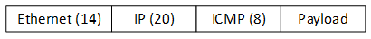
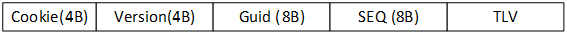
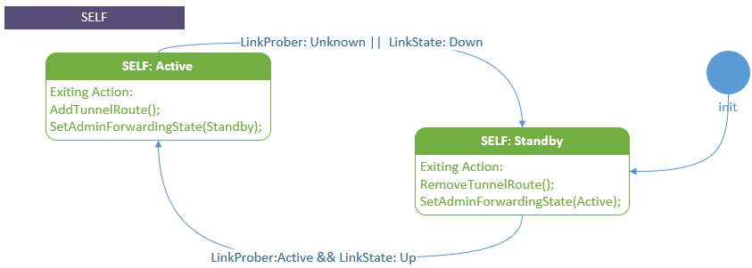

# Active-Active Dual ToR

Active-active dual ToR link manager is an evolution of active-standby dual ToR link manager. Both ToRs are expected to handle traffic in normal scenarios. For consistency, we will keep using the term "standby" to refer inactive links or ToRs. 

## Revision

| Rev | Date     | Author          | Change Description |
|:---:|:--------:|:---------------:|--------------------|
| 0.1 | 05/23/22 | Jing Zhang      | Initial version    |

## Scope 
This document provides the high level design of SONiC dual toR solution, supporting active-active setup. 

## Server requirements
In general, the intoduction of active-active will simplify state transition logics for SONiC dual ToRs. The complexity is transferred from smart y-cable to server side. Each server will have a Network Interface Card (NIC) connected to 2 x 100Gbps uplinks. These uplinks will be connected to 2 different ToRs with Direct Attach Copper (DAC) Cable. No Y-cable is needed.

For active-active setup, the requirements for server side are:
1. Server NIC is responsible to deliver traffic up the stack once receiving sourthbound (tier 0 device to server) traffic.
1. Server NIC is responsible to dispense northbound (server to tier 0) traffic between two active links: at IO stream (5 tuples) level. each stream will be dispatched to one of the 2 up links until link state changes. 
1. Server should provide support for ToR to control traffic forwarding, and follow this control when dispensing traffic. 
1. Server should replicate the northbound traffic to both ToRs:
    * Specified ICMP replies (for probing link health status)
    * ARP
    * Neighbor advertisements

## Cluster Topology 
There are a certain number of racks in a row, each rack will have 2 ToRs, and each row will have 8 Tier One (T1s) network devices. Each server will have a NIC connected to 2 ToRs with 100 Gbps DAC cables. 

In this design:
* Both upper ToR (labeled as UT0) and lower ToR (labeled as LT0) will advertise same VLAN to upstream T1s, each T1 will see 2 available next hops for the VLAN. 
* Both UT0 and LT0 are expected to carry traffic in normal scenarios. 
* The software stack on server host will see 200 Gbps NIC. 

### Bandwidth 
Each ToR will have single port-channel to each T1. The port-channel will have 2 members of 100Gbps. Therefore, each T0 will have total of 8\*2\*100 Gbps = 1.6 Tbps to all T1s.   

T1s will have 8 uplinks to T2s. Therefore, total T1s uplink will be 64. Total uplink bandwidth is 6.4Tbps.

## SONiC ToR Controlled Solution 
### Normal Scenario  
Both T0s are up and functioning and both the server NIC connections are up and functioning.
* Control Plane  
   UT0 and LT0 will advertise same VLAN  (IPv4 and IPv6) to upstream T1s. Each T1 will see there are 2 available next hops for the VLAN. T1s advertise to T2 as normal.
* Data Plane  
  * Traffic to the server  
    * Traffic lands on any of the T1 by ECMP from T2s.
    * T1 forwards traffic to either of the T0s by ECMP. 
    * T0 sends the traffic to the server. 
  * Traffic from the server to outside the cluster  
    * NIC determines which link to use and sends all the packets on a flow using the same link.
    * T0 sends the traffic to the T1 by ECMP. 
  * Traffic from the server to within the cluster  
    * NIC determines which link to use and sends all the packet on a flow using the same link.
    * T0 sends the traffic to destination server if T0 has learn the MAC address of the destination server.

### Server Uplink Issue  
Both T0s are up and functioning and some servers NIC are only connected to 1 ToR (due to cable issue, or the cable is taken out for maintenance).  
* Control Plane  
No change from the normal case. 
* Data Plane  
  * Traffic to the server  
    * Traffic lands on any of the T1 by ECMP from T2s.
    * T1 forwards traffic to either of the T0s by ECMP.
    * If T0 does not have the downlink to the server, T0 will send the traffic to the peer T0 over VxLAN encap via T1s.  
    * T0 sends the traffic to the server. 
  * Traffic from the server to outside the cluster   
    * T0 will signal to NIC which side to use.  
    * NIC determines which link to use and sends all the packets on a flow using the same link. If server NIC has only 1 connection up, all traffic will be on this connection. 
    * T0 sends the traffic to the T1 by ECMP
  * Traffic from the server to within the cluster  
    * T0 will signal to NIC which side to use. 
    * NIC determines which link to use and sends all the packets on a flow using the same link. If Server NIC has only 1 connection up, all traffic will be on this connection
    * If T0 does not have the downlink to the server, T0 will send the traffic to the peer T0 over VxLAN encap via T1s. 
    * T0 sends the traffic to the server.

### ToR Failure  
Only 1 T0s is up and functioning and both the server NIC connections are up and functioning. 
* Control Plane  
Only 1 T0 will advertise the VLAN (IPv4 and v6) to upstream T1s. 
* Data Plane  
  * Traffic to the server  
    * Traffic lands on any of the T1 by ECMP from T2s.
    * T1 forwards traffic to either of the T0s by ECMP. If one T0 is down, T1 forwards traffic to the healthy one. 
    * T0 sends the traffic to the server. 
  * Traffic from the server to outside the cluster   
    * T0 will signal to NIC which side to use.  
    * T0 sends the traffic to the T1 by ECMP.
  * Traffic from the server to within the cluster  
    * T0 will signal to NIC which side to use.
    * T0 sends the traffic to the server. 

Highlight on the difference with Active-Standby:   
1. In active-standby dual ToR design, traffic from server is duplicate to both T0s, standby ToR needs to drop the packets. In active-active, NIC will determine which link to use if both are available. 
1. In active-ative design, servers have up to 2 links for traffic, T1s and above devices will see more throughput from server. 

## Linkmgrd  
Linkmgrd will provide the determination of a ToR / link's readiness for use. 

### Requirement
1. Introduce active-active mode into MUX state machine. 
1. Probe to determine if link is healthy or not. 
1. Signal NIC if ToR is switching active or standby.
1. Rescue when peer ToR failure occures.
1. Unblock traffic when cable control channel is unreachable.  

### Solution 
* Link Prober   
  Linkmgrd will keep the link prober design from active-standby mode for monitoring link health status. Link prober will send ICMP packets and listen to ICMP response packets. ICMP packets will contain payload information about the ToR. ICMP replies will be duplicated to both ToRs from the server, hence a ToR can monitor the health status of its peer ToR as well.  

  Link Prober will report 4 possible states:  
  * LinkProberUnknown: Serves as initial states. This state is also reachable in the case of no ICMP reply is received. 
  * LinkProberActive: It indicates that LinkMgr receives ICMP replies containing ID of the current ToR.
  * LinkProberPeerUnknown: It indicates that LinkMgr did not receive ICMP replies containing ID of the peer ToR. Hence, there is a chance that peer ToR’s link is currently down. 
  * LinkProberPeerAcitve: It indicates that LinkMgr receives ICMP replies containing ID of the peer ToR, or in other words, peer ToR’s links appear to be active.  

  __ICMP Probing Format__  
  The source MAC will be ToR's SVI mac address. Ethernet destination will be the well-known MAC address. Source IP will be ToR's Loopback IP, destination IP will be SoC's IP address, which will be introduced as a field in minigraph.   
    

  Linkmgrd also adapt TLV (Type-Length-Value) as the encoding schema in payload for additional information elements, including cookie, version, ToR GUID etc.  
     

* Link State  
  When link is down, linkmgrd will receive notification from SWSS based on kernel message from netlink. This notification will be used to determine if ToR is healthy. 

* Admin Forwarding State   
  ToRs will signal NIC if the link is active / standby, we will call this active / standby state as admin forwarding state. It's up to NIC to determine which link to use if both are active, but it should never choose to use a standby link. This logic provides ToR more control over traffic forwarding. 

* Cable Control through gRPC  
  In active-active design, we will use gRPC to do cable control and signal NIC if ToRs is up active. SoC will run a gRPC server. Linkmgrd will determine server side forwarding state based on link prober status and link state. Then linkmgrd can invoke transceiver daemon to update NIC if ToRs are active through gRPC calls. 
  
  Current defined gRPC services between SoC and ToRs related with linkmgrd cable controlling:  
  * DualToRActive
      1. Query forwarding state of ports for both peer and self ToR;
      1. Query server side link state of ports for both peer and self ToR;
      1. Set forwarding states of ports for both peer and self ToR; 
  * GracefulRestart
      1. Shutdown / restart notification from SoC to ToR.
  
* Acitve-Active State Machine  
  Active-acitve state transition logics are simplified compared to active-standby. In active-standby, linkmgrd makes mux toggle decisions based on y-cable direction, while for active-active, two links are more independent. Linkmgrd will only make state transition decisions based on healthy indicators. 

  To be more specific, if link prober indicates active AND link state appears to be up, linkmgrd should determine link's forwarding state as active, otherwise, it should be standby.

   

  Linkmgrd also provides rescue mechanism when peer can't switch to standby for some , i.e. link failures. If link prober doesn't receive peer's heartbeat response AND self ToR is in healthy active state, linkmgrd should determine peer link to be standby. 
    

  When control channel is unreachable, ToR won't block the traffic forwarding, but it will periodically check gRPC server's healthiness. It will make sure server side's admin forwarding state aligns with linkmgrd's decision.
   

### Incremental Featrues   
* Default gateway to T1  
  If default gateway to T1 is missing, dual ToR system can suffer from northbound packet loss, hence linkmgrd also monitors defaul route state. If default route is missing, linkmgrd will stop sending ICMP probing request and fake an unhealthy status. This functionality can be disabled as well, the details is included in [default_route](https://github.com/Azure/sonic-linkmgrd/blob/master/doc/default_route.md).

* Link Prober Packet Loss Statics
  Link prober will by default send heartbeat packet every 100 ms, the packet loss statics can be a good system healthiness measurement. An incremental feature is to collect the packet loss counts, start time and end time. The collected data is stored and updated in state db. User can check and reset through CLI. 
 
* Supoort for Detachment
  User can config linkmgrd to a certain mode, so it won't switch to active / standby based on health indicators. User can also config linkmgrd to a mode, so it won't modify peer's forwarding state. This support will be useful for maintenance, upgrade and testing scenarios. 

### Command Line 
TBD

