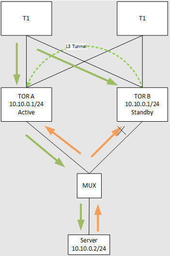
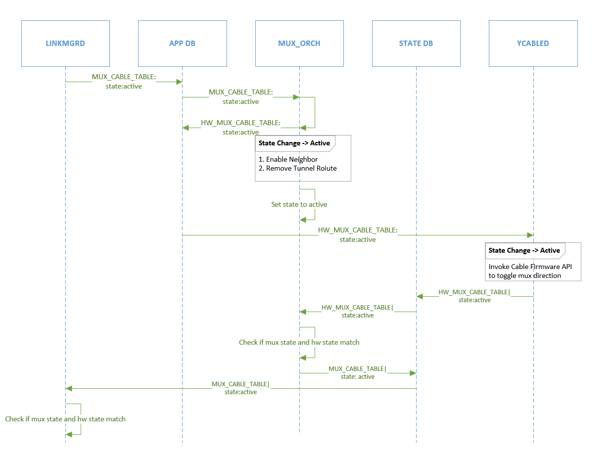
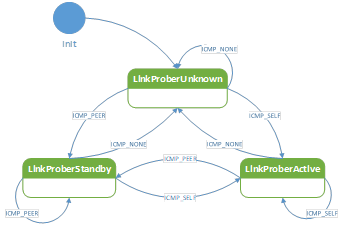
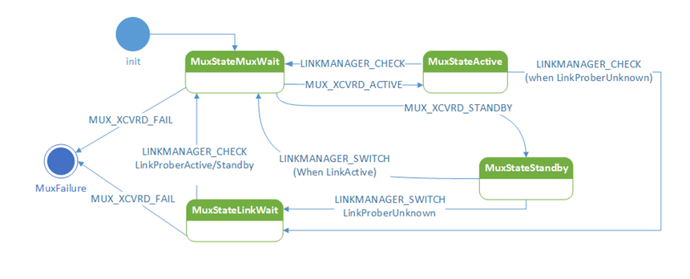
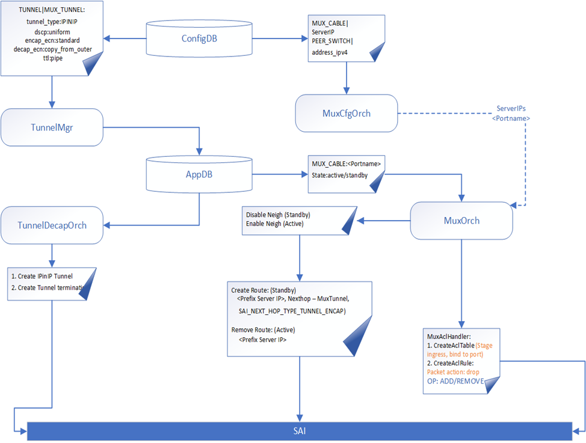
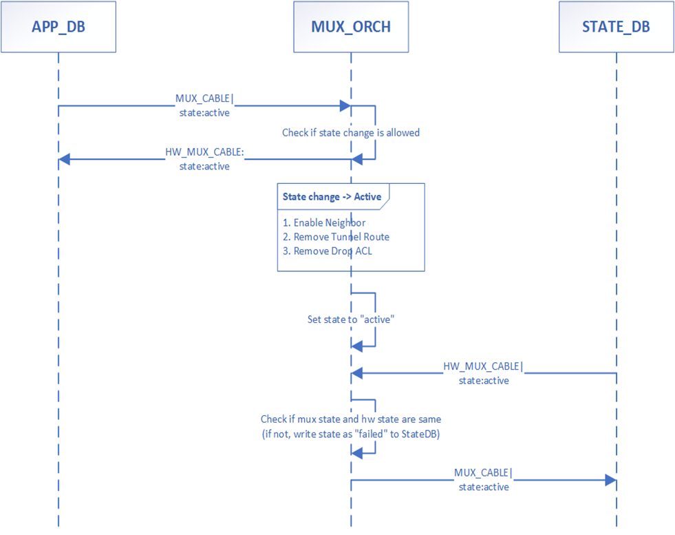
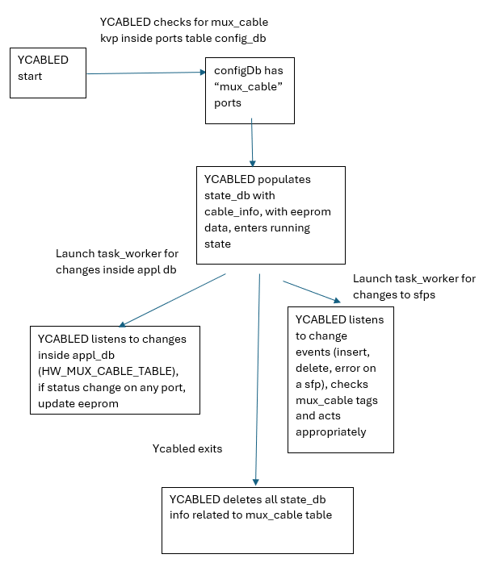

# Active-Standby Dual ToR

|  Rev  |   Date   |    Author     | Change Description                 |
| :---: | :------: | :-----------: | ---------------------------------- |
|  0.1  | 02/14/25 |  Jing Zhang   | Publish active-standby dualtor doc |


<!-- TOC orderedlist:true -->

- [Active-Standby Dual ToR](#active-standby-dual-tor)
    - [1. Scope](#1-scope)
    - [2. Requirement](#2-requirement)
    - [3. Theory of operation](#3-theory-of-operation)
        - [3.1. MUX cable ycable behavior](#31-mux-cable-ycable-behavior)
        - [3.2. Routing behavior](#32-routing-behavior)
    - [4. Data Schema](#4-data-schema)
        - [4.1. CONFIG_DB](#41-config_db)
        - [4.2. APP_DB](#42-app_db)
        - [4.3. STATE_DB](#43-state_db)
    - [5. Command Line](#5-command-line)
        - [5.1. MUX Configuration](#51-mux-configuration)
            - [5.1.1. Configuration Example](#511-configuration-example)
        - [5.2. MUX Status](#52-mux-status)
            - [5.2.1. MUX Configuration Status](#521-mux-configuration-status)
                - [5.2.1.1. Example](#5211-example)
            - [5.2.2. MUX Operation Status](#522-mux-operation-status)
                - [5.2.2.1. Single Port Example](#5221-single-port-example)
                - [5.2.2.2. All Ports Example](#5222-all-ports-example)
    - [6. Modules](#6-modules)
        - [6.1. Active/standby manager](#61-activestandby-manager)
            - [6.1.1. LinkProber Submodule](#611-linkprober-submodule)
            - [6.1.2. MuxState Submodule](#612-muxstate-submodule)
            - [6.1.3. LinkManager state machine](#613-linkmanager-state-machine)
        - [6.2. Active/standby orchagent](#62-activestandby-orchagent)
            - [6.2.1. MuxCfgOrch](#621-muxcfgorch)
            - [6.2.2. MuxOrch](#622-muxorch)
            - [6.2.3. TunnelOrch](#623-tunnelorch)
            - [6.2.4. State transition flow](#624-state-transition-flow)
            - [6.2.5. Rollback behavior](#625-rollback-behavior)
        - [6.3. Neighbor Table Management](#63-neighbor-table-management)
            - [6.3.1. Proxy ARP](#631-proxy-arp)
            - [6.3.2. Proxy NDP](#632-proxy-ndp)
            - [6.3.3. GARP](#633-garp)
            - [6.3.4. Server IP to port mapping](#634-server-ip-to-port-mapping)
            - [6.3.5. Special cases of Neighbor handling](#635-special-cases-of-neighbor-handling)
                - [6.3.5.1. Active ToR:  Neighbor miss after decap of tunneled packets](#6351-active-tor--neighbor-miss-after-decap-of-tunneled-packets)
                - [6.3.5.2. Neighbor miss due to one side link down](#6352-neighbor-miss-due-to-one-side-link-down)
                - [6.3.5.3. Directed Broadcast](#6353-directed-broadcast)
                - [6.3.5.4. Standby ToR Failed IPv6 Neighbor Entry](#6354-standby-tor-failed-ipv6-neighbor-entry)
        - [6.4. MUX Driver](#64-mux-driver)
            - [6.4.1. ycabled Transitions platform daemon for transceivers transitions for mux_cable](#641-ycabled-transitions-platform-daemon-for-transceivers-transitions-for-mux_cable)

<!-- /TOC -->


## 1. Scope
This document provides the design of active-standby dualtor.

## 2. Requirement
Able to switch to a healthy link/ToR when there is a link failure.

## 3. Theory of operation

### 3.1. MUX cable (ycable) behavior

1. From TOR to NIC, both links will be up, but only active link traffic will be forwarded to the NIC side.
1. From NIC to TOR, traffic will be broadcasted to both TOR.
1. There will be no link down during the mux switchover.
1. Expect a few packets corrupted/dropped during the mux switchover from TOR to NIC, but there will be no traffic disruption during mux switchover from NIC to TOR.

### 3.2. Routing behavior



1. Both TOR will have same VLAN configuration as well as virtual mac address
1. Both TOR will advertise VLAN prefix to T1
1. One of the TOR port will be active mode, another TOR port will be standby mode.
1. For active port, mux will forward the traffic down to server.
1. For standby port, mux will not forward the traffic down to the server. TOR will drop all the traffic received on the standby port.
1. TOR will use L3 tunnel to forward all traffic destined to the standby port to the peer TOR.

## 4. Data Schema

### 4.1. CONFIG_DB

| Table           |      Key       |         Field         | Description                                                                                                                                                                                                     |
| --------------- | :------------: | :-------------------: | --------------------------------------------------------------------------------------------------------------------------------------------------------------------------------------------------------------- |
| MUX_LINKMGR     |   LINK_PROBE   |                       |                                                                                                                                                                                                                 |
|                 |                |      interval_v4      | heartbeat probe interval                                                                                                                                                                                        |
|                 |                |      interval_v6      | heartbeat probe for ipv6                                                                                                                                                                                        |
|                 |                |        timeout        | treat loss of heartbeat if link probe not received for x intervals.                                                                                                                                             |
|                 |                |     suspend_timer     | heartbeats will be suspended for duration of linkprober_suspend_timer when transition from LinkManager transition from Active to Unknown state.                                                                 |
|                 |                | positive_signal_count | event count to confirm a positive state transition, i.e. unknown to active.                                                                                                                                     |
|                 |                | negative_signal_count | event count to confirm a negative state transtion, i.e. active to unknown.                                                                                                                                      |
| Localhost       |   MUX_DRIVER   |                       |                                                                                                                                                                                                                 |
|                 |                |    i2c_retry_count    | number of I2C retries before driver announce MUX entering failure state                                                                                                                                         |
| MUX_CABLE       |  \<PORTNAME\>  |                       |                                                                                                                                                                                                                 |
|                 |                |         state         | "active\|standby\|auto\|manual"; "active\|standby": try to switch MUX to state, "auto": mux is in auto mode and will switch proactively (heartbeat loss or link down), and "manual": mux will switch reactively |
|                 |                |      server_ipv4      | ipv4 prefix; from minigraph                                                                                                                                                                                     |
|                 |                |      server_ipv6      | ipv6 prefix; from minigraph                                                                                                                                                                                     |
| PEER_SWITCH     | \<switchname\> |                       |                                                                                                                                                                                                                 |
|                 |                |     address_ipv4      | IPv4 address; from minigraph                                                                                                                                                                                    |
| TUNNEL          |   MUX_TUNNEL   |                       |                                                                                                                                                                                                                 |
|                 |                |      tunnel_type      | "IPINIP"                                                                                                                                                                                                        |
|                 |                |        dst_ip         | IPv4 address; from self loopback0                                                                                                                                                                               |
|                 |                |       dscp_mode       | "uniform"; all modes from minigraph                                                                                                                                                                             |
|                 |                |    encap_ecn_mode     | "standard"                                                                                                                                                                                                      |
|                 |                |       ecn_mode        | "copy_from_outer"                                                                                                                                                                                               |
|                 |                |       ttl_mode        | "pipe"                                                                                                                                                                                                          |
| DEVICE_METADATA |   localhost    |                       |                                                                                                                                                                                                                 |
|                 |                |         type          | "ToRRouter"                                                                                                                                                                                                     |
|                 |                |      peer_switch      | hostname of peer switch                                                                                                                                                                                         |
|                 |                |        subtype        | “DualTor”; from minigraph (another option to set “mux_cable”:”enable”)                                                                                                                                          |
 
### 4.2. APP_DB

| Table              |     Key      |      Field       | Description                                                                                                                                                            |
| ------------------ | :----------: | :--------------: | ---------------------------------------------------------------------------------------------------------------------------------------------------------------------- |
| MUX_CABLE          | \<PORTNAME\> |                  |                                                                                                                                                                        |
|                    |              |      state       | "active\|standby\|unknown" ; for LinkManager communication with swss; for unknown state, orchagent internally treats as “standby” and write “standby” to HW_MUX_CABLE  |
| HW_MUX_CABLE       | \<PORTNAME\> |                  |                                                                                                                                                                        |
|                    |              |      state       | "active\|standby"; for orchagent to communicate with ycabled                                                                                                           |
| MUX_CABLE_COMMAND  | \<PORTNAME\> |                  |                                                                                                                                                                        |
|                    |              |     command      | "probe\|link_status_peer"; for linkmgrd communication with ycabled, “probe” will trigger a mux direction check, “link_status_peer” will check a peer link status check |
| MUX_CABLE_RESPONSE | \<PORTNAME\> |                  |                                                                                                                                                                        |
|                    |              |     response     | "active\|standby\|unknown"; mux direction check result                                                                                                                 |
|                    |              | link_status_peer | "up\|down\|unknown"                                                                                                                                                    |

### 4.3. STATE_DB

| Table              |     Key      |                   Field                    | Description                                                                                                                                                                                                                                         |
| ------------------ | :----------: | :----------------------------------------: | --------------------------------------------------------------------------------------------------------------------------------------------------------------------------------------------------------------------------------------------------- |
| MUX_CABLE_TABLE    | \<PORTNAME\> |                                            |                                                                                                                                                                                                                                                     |
|                    |              |                   state                    | "active\|standby\|unknown\|error" ; written by orchagent.                                                                                                                                                                                           |
| HW_MUX_CABLE_TABLE | \<PORTNAME\> |                                            |                                                                                                                                                                                                                                                     |
|                    |              |                   state                    | "active\|standby\|unknown";    Written by ycabled. "unknown" when MUX fails to respond to I2C commands for i2c_retry_count.                                                                                                                         |
| MUX_LINKMGR_TABLE  | \<PORTNAME\> |                                            |                                                                                                                                                                                                                                                     |
|                    |              |                   state                    | "healthy, unhealthy, uninitialized"; Written by linkmgrd to reflect current combined mux state and link prober state. "unintialized" indicates that SM for this port did not complete initialization and is considered unhealthy for auto failover. |
| MUX_METRICS_TABLE  | \<PORTNAME\> |                                            |                                                                                                                                                                                                                                                     |
|                    |              | \<app name\>_switch_\<target state\>_start | “yyyy-mmm-dd hh:mm:ss.uuuuuu”; time when \<app name\> starts switch operation to state \<target state\>. \<app name\> is one of ycabled, orchagent, or linkmgrd and \<target state\> is active or standby.                                          |
|                    |              |  \<app name\>_switch_\<target state\>_end  | “yyyy-mmm-dd hh:mm:ss.uuuuuu”; time when \<app name\> completes switch operation to state \<target state\>. \<app name\> and \<target state\> are as defined above.                                                                                 |
| MUX_SWITCH_CAUSE   | \<PORTNAME\> |                                            |                                                                                                                                                                                                                                                     |
|                    |              |                   cause                    | the cause that triggers last switchover                                                                                                                                                                                                             |
|                    |              |                    time                    | “yyyy-mmm-dd hh:mm:ss.uuuuuu”; last switchover timestamp                                                                                                                                                                                            |
| LINK_PROBE_STATS   | \<PORTNAME\> |                                            |                                                                                                                                                                                                                                                     |
|                    |              |    link_prober_\<state\>_\<start\|end\>    | “yyyy-mmm-dd hh:mm:ss.uuuuuu”; link probe state change timestamp                                                                                                                                                                                    |
|                    |              |               pck_loss_count               | missing HBs counter                                                                                                                                                                                                                                  |
|                    |              |             pck_expected_count             | counter of HBs sent                                                                                                                                                                                                                                  |

## 5. Command Line

### 5.1. MUX Configuration
Configuration data will be updated via cli module `config`. MUX operation mode could be set using the following command:
```
config muxcable mode {active} {<portname>|all} [--json]
```

The above command will set the MUX operation mode for specific port portname if provided. If `all` keyword is provided, the operation mode will apply to all port.

#### 5.1.1. Configuration Example

```
eg: config muxcable mode active Ethernet4 [--json]
output case 1:
RC: 100
{
    “Ethernet4”: “OK”
}
Output case 2:
RC: 1
Output case 3:
RC: 100 
{
    “Ethernet4”: “INPROGRESS”
} 
```

In case 1, OK output would be returned if the mux is in active state already. Return code of 1 indicates failure for Case 2. Output 3 of “INPROGRESS” for mux port in healthy standby. Please notice that once “INPROGRESS” is returned, the mux health state will indicate standby unhealthy until linkmgrd establishes the current health of the mux cable.

Return Code 0 means `config` is successful, everything else (all other RCs)  is to be considered failure.

### 5.2. MUX Status

MUX status will be retrieved using `show`.

#### 5.2.1. MUX Configuration Status
To view MUX configuration data, show module will be extended to support the following command:
```
show muxcable config [portname] [--json]
````
##### 5.2.1.1. Example
```
eg: show muxcable config --json
output:
{
   “MUX_CABLE”: {
       “PEER_TOR”: “10.10.10.3”,
       “LINK_PROBER”: {
           “INTERVAL”: {
               “IPv4”: 100,
               “IPv6”: 1000,
           },
           “TIMEOUT”: 3,
       },
       “PORTS”: {
           “ETHERNET0”: {
               “STATE”: “ACTIVE”,
               “SERVER”: {
                   “IPv4”: “192.168.1.10”,
                   “IPv6”: “fc00::75”,
               }
           },
           “ETHERNET4”: {
               “STATE”: “AUTO”,
               “SERVER”: {
                   “IPv4”: “192.168.1.40”,
                   “IPv6”: “fc00::ab”,
               }
           }
       }
    }
}
```

Return Code 0 means show Config is successful , everything else (all other RCs)  is to be considered failed.

#### 5.2.2. MUX Operation Status

Mux status can be "active/standby/unknown".

The reason to incorporate an unknown state is that there could be a case when cable is not powered on or cable is disconnected, faulty cable etc. In those scenarios the ToR cannot access the status of the mux direction though i2c. So, the ToR would reflect the status as unknown in these scenarios.

To view the current operating mode of the MUX cable, `show` module will support the following command:
```
show muxcable status [portname] [--json]
```

##### 5.2.2.1. Single Port Example
```
show muxcable status Ethernet0 –-json 
output:
{
   “MUX_CABLE”: {
       “ETHERNET0”: {
           “STATUS”: “ACTIVE”,
	“HEALTH”: “HE
    ALTHY”
        }
    }
}
```

##### 5.2.2.2. All Ports Example
```
show muxcable status --json
output:
{
   “MUX_CABLE”: {
       “ETHERNET0”: {
           “STATUS”: “ACTIVE”,
	“HEALTH”: “HEALTHY”
        },
       “ETHERNET4”: {
           “STATUS”: “STANDBY”,
	“HEALTH”: “HEALTHY”
        },
       .
       .
       “ETHERNET<N>”: {
           “STATUS”: “STANDBY”,
	“HEALTH”: “UNHEALTHY”
        }
    }
}
```
Return Code 0 means show status is successful , everything else RC  is to be considered failed

<!-- TODO: MUX cable info Command Line -->
<!-- TODO: cable FIRMWARE COMMANDS -->

## 6. Modules

The key SONiC components involved in a mux switchover are:
1. LinkManager daemon (linkmgrd)
2. Mux Orch (orchagent)
3. Transceiver daemon (ycabled)

The diagram below illustrates a complete workflow of a toggle to active.    


### 6.1. Active/standby manager
Active/Standby manager is a simple framework that enables standby ToR to switch/pull the link when it detects loss of health signs from active ToR. Active/Standby manager module consists of four submodules: 

1. LinkProber submodule is responsible for monitoring the link health status. It is a simple module that will send ICMP packets and listen to ICMP reply packets. ICMP packet will contains in its payload information about the originating ToR. LinkProber will report the link as active if it receives ICMP reply for packet that LinkProber sent. If LinkProber receives ICMP packet sent by peer ToR, it will report the link as standby. If no response is received the ICMP, LinkProber will report link status as Unknown.
2. LinkState submodule has two distinctive states: LinkUp and LinkDown states. It will listen to state DB for link update messages and updates its state accordingly.
3. MuxState submodule will report current MUX state retrievable via I2C command. Expected states are: MuxActive, MuxStandby, and MuxUnknown corresponding to MUX pointing to current ToR, MUX pointing to peer ToR, and no response is received from MUX, respectively.

The above three submodule will have their states processed by LinkManager module. LinkManager will run at frequency slower that its submodule frequencies to prevent as much hysteresis as possible. 

#### 6.1.1. LinkProber Submodule
Encode the switch id (UUID) in the ICMP payload, send ICMP and check ICMP reply. ICMP reply received [or not received] the following events:
- ICMP_NONE: ICMP reply was not seen during `localhost|LINK_PROBE|TIMEOUT` * `localhost|LINK_PROBE|INTERVAL` msec.
- ICMP_SELF: ICMP reply was received and its payload contains this ToR id. This event indicate that server do receive and respond to traffic from the current ToR. When ICMP_SELF event is received, LinkProber will transition to Active state.
- ICMP_PEER: ICMP reply was received and its payload contains peer ToR id. Payload of ICMP reply indicate that the ICM request originated from peer ToR and so LinkProber will transition to Standby state.

__The probe traffic will be both IPv4 and IPv6. The decision is only made using the IPv4 probe results. IPv6 is only for monitoring purpose and it will have larger probe interval.__

LinkProber has three states:
- LinkProberStateUnknown: It serves as initial states. The state is also reachable in the case of no ICMP replay is received.
- LinkProberStateStandby: It indicates that ICMP reply contained peer ToR Id.
- LinkProberStateActive: It indicates that ICMP reply contains this ToR Id.



<!-- TODO: link probe TLV: witch command etc. -->

#### 6.1.2. MuxState Submodule

MUX cables have an embedded I2C module with different registers reflecting different operational config and commands. For example, register B132 @page 4 of Credo MUX cables does provide a way to poll the current MUX state. This information will be used to confirm the MUX state when instructed by LinkManager state machine as per the following state machine. 



**NOTE: XCVRD refers to the transceiver daemon in pmon docker that runs as MUX driver, it has been renamed to YCABLED.**

<!-- TODO: remove reference to xcvrd -->

LinkManager can trigger the following two transitions in the MuxState machine:
1. LINKMANAGER_CHECK: LinkManager when notices inconsistencies between LinkProber state reporting, LinkState reporting, and finally MUX last known state, will trigger such state transition. Susbequently next state will be MuxStateLinkWait if link ProberState is LinkProberUnknown, or MuxStateMuxWait if LinkProber state is either LinkProberActive or LinkProberStandby.
1. LINKMANAGER_SWITCH: standby LinkManager triggers state transition from standby to active. Details of this transition is discussed in the next subsection. Subsequent state is similar to LINKMANAGER_CHECK above.
LinkManager will trigger LINKMANAGER_CHECK when LinkProber transitions from Active to Unknown state. When making this transition, transitioning ToR will suspend heartbeat for duration of linkprober_suspend_timer. The temporarily suspension of heartbeat is to aid standby ToR takeover the link in a timely manner. Next substate of MuxState will be MuxLinkWait State.

LinkManager will trigger LINKMANAGER_SWITCH when LinkProber transitions from StandbyState to UnknownState. Next substate of MuxState will be MuxLinkWait state. Details on these transition are described in subsequent sections.
XCVRD module will drive the MUX state changes. It will report state changes back via state DB. XCVRD reported states are:
1. MUX_XCVRD_ACTIVE: indicates that MUX cable is serving as active cable.
2. MUX_XCVRD_STANDBY: indicates that MUX cable is serving as standby cable.
3. MUX_XCVRD_FAIL: indicate that MUX cable is timing out request sent by xcvrd.


<!-- TODO: MUX State Check backoff design -->

#### 6.1.3. LinkManager state machine
LinkManager state is composite state of its submodules. **The current design delegate MUX state switching from standby to active to the standby ToR**. This is necessary to avoid a situation where two ToRs each is switching MUX state at the same time. The role of each ToR will be identified once MuXState submodule transition to either Active or Standby state. The following two tables describe LinkManager state and decision table:

LinkUp State:

| **MuxState**   |     | **LinkProber**                                             |                                                            |                                                                                         |
| -------------- | --- | ---------------------------------------------------------- | ---------------------------------------------------------- | --------------------------------------------------------------------------------------- |
|                |     | **Active**                                                 | **Standby**                                                | **Unknown**                                                                             |
| **Active**     |     | Noop (normal operation)                                    | Trigger LINKMANAGER_CHECK (transition to MuxState MuxWait) | Trigger LINKMANAGER_CHECK (transition to MuxState LinkWait, suspend sending heartbeats) |
| **Standby**    |     | Trigger LINKMANAGER_CHECK (transition to MuxState MuxWait) | Noop (Normal Operation)                                    | Trigger LINKMANAGER_SWITCH (transition to MuxState LinkWait)                            |
| **MuxWait**    |     | Noop                                                       | Noop                                                       | Noop                                                                                    |
| **LinkWait**   |     | Trigger LINKMANAGER_CHECK (transition to MuxState MuxWait) | Trigger LINKMANAGER_CHECK (transition to MuxState MuxWait) | Noop                                                                                    |
| **MuxFailure** |     | Faulty Cable                                               | Faulty Cable                                               | Faulty Cable                                                                            |

LinkDown State:
| **MuxState**   | **LinkProber** |              |                                                              |
| -------------- | -------------- | ------------ | ------------------------------------------------------------ |
|                | **Active**     | **Standby**  | **Unknown**                                                  |
| **Active**     | Noop           | Noop         | Trigger LINKMANAGER_SWITCH (transition to MuxState LinkWait) |
| **Standby**    | Noop           | Noop         | Trigger LINKMANAGER_SWITCH (transition to MuxState LinkWait) |
| **MuxWait**    | Noop           | Noop         | Noop                                                         |
| **LinkWait**   | Noop           | Noop         | Noop                                                         |
| **MuxFailure** | Faulty Cable   | Faulty Cable | Faulty Cable                                                 |

<!-- TODO: heartbeat suspending and default route missing -->

### 6.2. Active/standby orchagent



#### 6.2.1. MuxCfgOrch

MuxCfgOrch listens to MUX_CABLE and populate the Port to ServerIP mapping.

#### 6.2.2. MuxOrch

MuxOrch listens to state changes and does the following at a high-level:
1. Add/Remove tunnel routes. 
2. Add/Remove ACL to drop packets on the specific port
3. Optionally, handle Neighbor entry update

For Neighbor handling following are the three approaches:
1. Route and Neighbor co-existence  
If both route and neighbor entry exists in the hardware, then the assumption is route entry takes precedence. In case of IPv6, if ServerIP in MUX_CABLE mapping is a subnet prefix, then MuxOrch shall install routes for every IPv6 neighbor within that subnet. 

2. Orchagent handling delete   
In this approach, orchagent handles deletion of neighbor entry while adding the route or vice-versa. In this case, the IPv6 route entry would be programmed with a /80 prefix and orchagent shall trigger removing individual IPv6 neighbor entry. 

3. ACL redirect  
In this case, an ACL entry would be programmed with destination prefix match and with action as redirect to Tunnel Nexthop. This would be programmed in the same table as ACL drop.

#### 6.2.3. TunnelOrch

Subscribes to MUX Tunnel table and creates decap entry, tunnel termination and the tunnel. This tunnel object would be used as nexhop object by the MuxOrch for programming route via SAI_NEXT_HOP_TYPE_TUNNEL_ENCAP

#### 6.2.4. State transition flow

The following UML sequence shows the state change when MUX state moves to “active”. Similar flow is for “standby” state change. 



#### 6.2.5. Rollback behavior

When a state change is triggered by Linkmgrd, and if orchagent fails to do the transition, the following are the expected outcome:
1. Orchagent rolls back to its original state
2. Orchagent writes the new state to APP_DB for Xcvrd consumption.
3. Xcvrd write the updated state to STATE_DB
4. Orchagent write “unknown” to STATE_DB 
“Unknown” state shall trigger a new state transition from Linkmgrd. It is required for orchagent to be idempotent to state changes. 

<!-- TODO: orchagent assumption/limitations -->

### 6.3. Neighbor Table Management

#### 6.3.1. Proxy ARP
For server to server traffic, we cannot do normal l2 forwarding for following scenario. Both Server S1 and S2 are under the same TOR set. Server 1’s active links is to TORA and Server 2’s active link is to TORB. In order for Server 1 to reach server 2, the traffic needs to first go to TORA, encapped to TORB. TORB will decap the packet and send to Server 2.

In order for server 1’s traffic to be encapsulated at TORA, the destination mac address of the packet sent by S1 needs to be TORA’s router mac address.

To achieve this, we need to enable proxy ARP, so that all traffic sent by the server are treated as L3 traffic (routed).

#### 6.3.2. Proxy NDP
IPv6 Proxy NDP is supported but behaves slightly different from Proxy ARP for IPv4. Proxy NDP requires explicit neighbor entry programming. By enabling proxy NDP for say Vlan1000, the following kernel sysctl param must be set similar to proxy_arp:
```
net.ipv6.conf.Vlan1000.proxy_ndp=1
```

However just enabling this variable is not enough for IPv6 case, but also require adding explicit neighbor entry as below:
```
ip -6 neigh add proxy fc02:1000::3 dev Vlan1000
```

Note that IPv6 proxy feature does NOT support subnet, so it is required to explicitly have the inet6 neighbor address to be programmed to kernel that needs to be proxied. 

In the current proposal, neighbor manager (nbrmgrd) can subscribe to `MUX_CABLE|PORTNAME` and program each "ServerIPv6" as proxy entries. However, if the entry in this table is a prefix, and not necessarily the individual IPv6 address of connected servers, then one approach is to sync IPv6 NDP entries and handle this by nbrmgrd.

<!-- TO CONFIRM: ndppd still an option? -->

#### 6.3.3. GARP
Enable GARP management for TOR. In order for the standby TOR to send the HB probe traffic, the standby TOR needs to have correct ARP entry for the server. However, since the ARP request sent by standby TOR is dropped by the MUX. We need to a way to setup the ARP table correctly on the standby TOR.

Since, the active TOR is sending the ARP probe and the reply will be broadcasted to both TOR by MUX. Therefore, if we allow the standby TOR to accept GARP, then the standby TOR will be able to setup the correct ARP entries. 

IPv4:   set /proc/sys/net/ipv4/conf/Vlan1000/arp_accept to 1

Since the IPv6 setting for unsolicited NA is set to accept in current Sonic image,  this should work as expected.

To accept unsolicited NA messages, it is necessary to backport the kernel param `accept_untracked_na` to SONiC’s kernel and set its value to 1 when we want to accept unsolicited NA messages. The existing ‘drop_unsolicited_na’ parameter must also keep it’s current default value of 0.

```
$ cat /proc/sys/net/ipv6/conf/Vlan1000/drop_unsolicited_na 
0
$ cat /proc/sys/net/ipv6/conf/Vlan1000/accept_untracked_na 
0
```

#### 6.3.4. Server IP to port mapping
Active/Standby mode is controlled at the port level, while the L3 vxlan tunnel is setup based on L3 prefix. Thus, we need to build a mapping table between the server facing ports and server IP address on each port.

For IPv4, we can get the server IP from the minigraph. It is trivial to build such mapping table.
For IPv6, the server has IP address derived from the IPv4.

#### 6.3.5. Special cases of Neighbor handling

##### 6.3.5.1. Active ToR:  Neighbor miss after decap of tunneled packets

In the event where the first packets towards the Server/VM lands on Standby ToR, this shall get encapsulated towards the Active ToR. After decap-ing the packet by Active ToR and if the neighbor is not present, the entire packet (encapsulated), gets trapped to CPU. Currently in Sonic, the kernel is having limitation to decap the packet and send arp or neighbor solicitation. For this, a service is implemented (python based) that runs in the background and listens on the packets that are destined to Loopback0 IP and filtered on the Portchannel uplinks. The standby peer ToR sends the encapsulated packet with Loopback0 as the outer dst IP. 
The script shall issue a ping with timeout to the inner destination IP (server bound) which triggers kernel to send out NS or ARP request. It shall reside in the swss docker and started after all Portchannel interfaces are UP.  

##### 6.3.5.2. Neighbor miss due to one side link down

This is scenario where one link to the Server is down but the peer ToR has an active link. In this case if the packet lands on the ToR having link down, the traffic may get permanently black-holed. The expected behavior is to tunnel the packets to peer ToR. Since the neighbor was never learned, it is not possible to identify if it’s on Standby link or Active link.  To overcome this scenario, the following is the approach taken:

For neighbors for which ARP is not learned, the packets shall be as currently, trapped to CPU.  If this neighbor ARP cannot be resolved, the following changes are made in neighsyncd:
1. Check if PEER_SWITCH table exists (to identify as a dual-tor topology)
1. If table exists, update the neighbor table (NEIGH) with zero mac and optionally, type as “tunnel” and write to APP_DB for state FAILED/INCOMPLETE ARP entries.
1. For zero mac neighbor with “SET” operation, neighorch/muxorch shall install tunnel routes to peer switch.
1. For neighbor delete notification from kernel, handle as existing. i.e delete the neighbor/tunnel

Once the neighbor solicitation or ARP is send, the arp_update script shall periodically refresh the entries and relearns if the link comes up later.  

##### 6.3.5.3. Directed Broadcast

Directed broadcast packets are flooded directly in the hardware and depending on the ToR where the packet lands, the packet may not get flooded on all the ports (which are standby). This is a behavioral difference from the existing single ToR and require a different approach (TBD).

##### 6.3.5.4. Standby ToR Failed IPv6 Neighbor Entry
For a valid IPv6 neighbor entry that is ‘REACHABLE’ on the active ToR, it’s possible for the same neighbor on the standby to be in the ‘FAILED’ state because the kernel does not automatically learn neighbor information from unsolicited neighbor advertisement (NA) messages. In this case, if a switchover occurs for the link on which the neighbor is located, traffic will be disrupted because the new active ToR (previously standby) has a ‘FAILED’ neighbor entry. The change in 6.3.5.2 (zero mac) prevents the normal neighbor learning process from occurring – the tunnel route means that packets destined for the neighbor will be sent to the peer. The following changes have been made to prevent this from occurring:
1. Enable kernel parameter `accept_untracked_na` (see 6.3.3) to prevent asymmetric neighbor learning
1. Edit the `arp_update` script to change any ‘FAILED’ neighbor entries to ‘INCOMPLETE’. 
    1. In the ‘FAILED’ state, neighbor entries will not be updated/learned when the kernel receives an NA message. Setting it to ‘INCOMPLETE’ allows these entries to be learned.
    1. Once `arp_update` runs on the standby ToR and changes any ‘FAILED’ entries to ‘INCOMPLETE’, the next run of `arp_update` on the active ToR will trigger NA messages from connected neighbors. When these messages are received by the standby ToR, the ‘INCOMPLETE’ neighbor entries will be fully resolved.

### 6.4. MUX Driver


#### 6.4.1. ycabled Transitions (platform daemon for transceivers transitions for mux_cable)
These are the tasks of the transceiver for the Y cable. 



