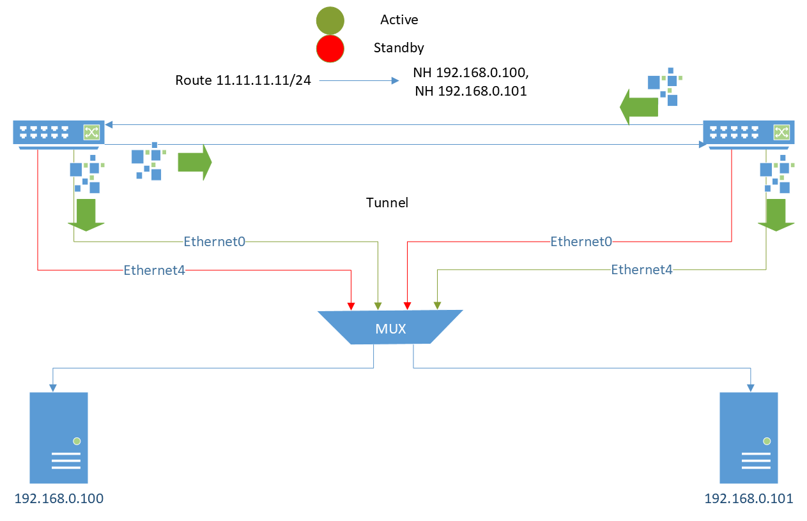
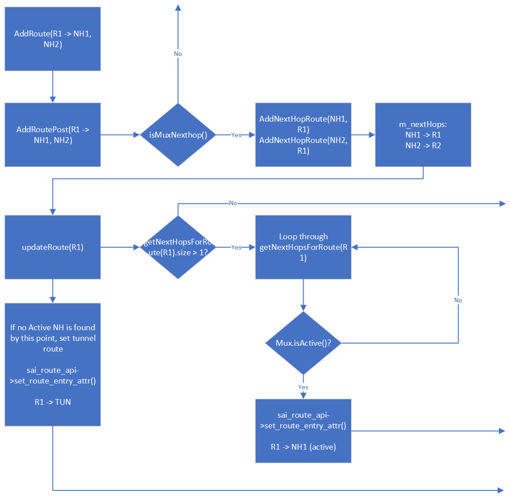
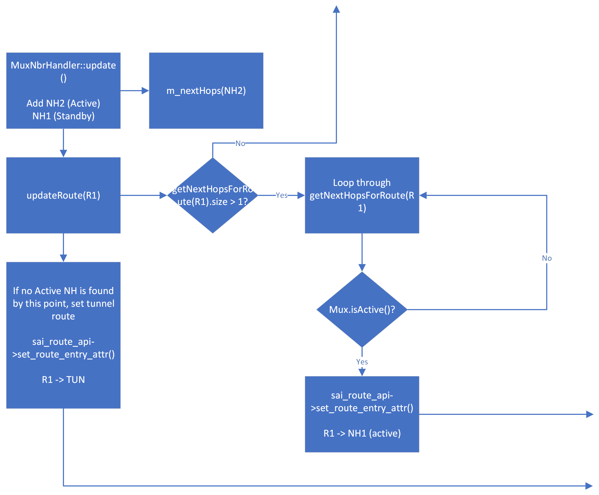
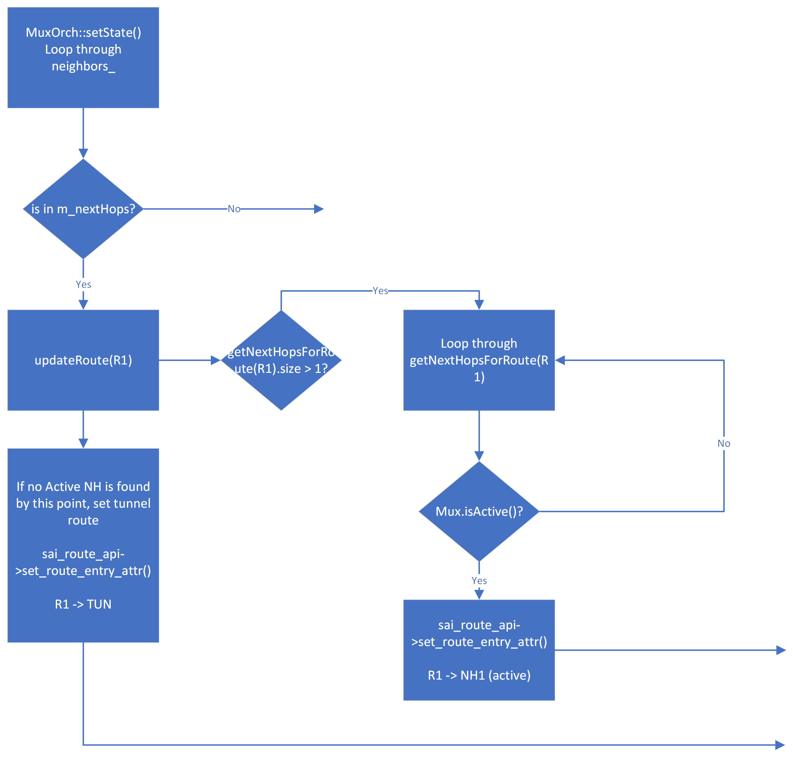

## Problem

### Description

On Gemini active-standby servers, there are use-cases where an route is programmed with multiple next-hop neighbors. In this scenario the next-hop neighbors occur on separate Ethernet ports with independent mux states. As a result, one of these ports could be in active state on the upper T0 while the other is active on the lower T0. in other words on a single ToR, we would have one active neighbor and one standby neighbor. In this case, a data loop is currently formed when ECMP routes some of the data designated to the route to the peer ToR. The peer ToR subsequently routes some of those packets back to the original switch. This continues on in a loop causing a small amount of packet loss.

### Example

Neighbor 192.168.0.100 on Ethernet0
Neighbor 192.168.0.101 on Ethernet4
Route 11.11.11.11/24 with nexthops 192.168.0.100, 192.168.0.101



## Goal

enable multiple nexthops to work with the same route by adding logic that will prevent packets from being routed through the peer tunnel route if there is an active nexhop on the current T0.

## Design

We will be adding a function `updateRoute()` to muxorch which will handle refreshing the nexthop routes in the ASIC using SAI API. `updateRoute()` will check each nexthop associated with the given route. It will then decide what to do depending on the following logic:

If `updateRoute()` finds 1 nexthop corresponding to the given route, it will be a no-op and the current behavior will be maintained.

If `updateRoute()` finds more than 1 nexthop corresponding to the given route, then it will set the hardware route according to the folowing logic using `sai_route_api`:

1. If a nexthop neighbor is in Standby: do nothing
2. If a nexthop neighbor is in Active: Set the first active neighbor as the sole nexthop and return.
3. If all neighbors are in Standby: add tunnel as the sole nexthop

`updateRoute()` will also handle checking if the nextHopGroup is already programmed to the ASIC, and removing it if necessary.

```c++
// Remove the nexthop group if it exists already
if (gRouteOrch->hasNextHopGroup(nextHops))
{
    NextHopGroupKey nhg_key(nextHops);
    gRouteOrch->removeNextHopGroup(nhg_key);
}
```

The following pseudocode shows the logical flow that the function will follow

>muxorch.cpp
```c++
UpdateRoute(Route R1)
{
	if (R1 has more than 1 nexthops)
	{
        if (ECMP group exists with nexthops)
        {
            Remove stale ECMP group
        }
		loop through nexthops NH.0 - NH.m
		{
			If (NH is active)
			{
				Set route nexthop to NH
			}
		}
		// No active neighbor is found
		Set route nexthop to tunnel
	}
}
```

### Scenarios

#### Adding a Route with Multiple Nexthop Neighbors


#### Adding a Nexthop Neighbor


#### Changing a Nexthop Neighbor State


### Additional Changes

updateRoute will depend on `m_nextHops` being up-to-date and containing all nexthops that a route will be pointing to. Currently, we do not add nexthop groups to the m_nexthops struct, so some changes will need to be made in order to account for the mux nexthops.

In Routeorch.cpp, we will add a check `nextHops.is_mux_nexthop()` which will add each nexthop from a nexthop group to `m_nextHops` if it resolves as true.

>routeorch.cpp
```c++
if (ctx.nhg_index.empty() && nextHops.getSize() == 1 &&
	!nextHops.is_overlay_nexthop() && !nextHops.is_srv6_nexthop() ||
	nextHops.is_mux_nexthop())
{
	RouteKey r_key = { vrf_id, ipPrefix };
	auto nexthop_list = nextHops.getNextHops();
	for (auto it = nexthop_list.begin(); it != nexthop_list.end(); it++)
	{
		if (!it.ip_address.isZero())
		{
			addNextHopRoute(it, r_key);
		}
	}
}
```

`is_mux_nexthop` will be a method in the nexthopgroup class definition which will check if a given mux contains a nexthop that is in the nexthop group. Here we assume that if any nexthop is a mux neighbor, then all nexthops in the nexthop group will be mux neighbors.

>nexthopgroup.h
```c++
bool is_mux_nexthop(MuxOrch mux)
{
	for (auto it = m_nexthops.begin(); it != m_nexthops.end(); ++it)
	{
		if (mux.containsNextHops(it)){
			return true;
		}
	}
	return false;
}
```

in Muxorch.cpp, we will add a bool `containsNextHop` which will return true if a nexthop is in the `mux_nexthop_tb_`

>muxorch.cpp
```c++
bool MuxOrch::containsNextHop(NextHopKey nh)
{
	return mux_nexthop_tb_.find(nh) != mux_nexthop_tb_.end();
}
```

With these changes, `m_nextHops` will contain all nexthops that are also mux neighbors, and updateRoute will be able to loop through this struct in order to determine the amount of nexthop neighbors that a route has.

### Limitations

Several assumptions are made as a part of this design. This means that there are certain limitations that need to be defined:

- As part of this design, we are assuming that within a nexthop group, nexthop neighbors are either ALL "Mux" nexthops, or None of the neighbors are "Mux" nexthops. Due to this assumption, we will not support mixed "Mux" and "non-Mux" nexthop neighbors within a nexthop group.

- Since only one nexthop will be programmed to the ASIC, all ECMP neighbors with a mux will fall back to 1 active nexthop neigbor or 1 tunnel route.

## Testing

create pytest method: create_and_test_multi_nexthop_route(). This can be added to test_Route(). All tests will be repeated with ipv6 neighbors as well.

1. Create neighbor `192.168.0.100` on Ethernet0 (Active)
2. Create neighbor `192.168.0.101` on Ethernet4 (Standby)
3. create Route `2.3.4.0/24` with NH `192.168.0.100`, `192.168.0.101`
4. Check `ASIC_DB` for `2.3.4.0/24 -> 192.168.0.100`
5. Set Ethernet0 to Standby
6. Check `ASIC_DB` for `192.168.0.100/32` tunnel route
7. Set Ethernet4 to Active
8. Check `ASIC_DB` for `2.3.4.0/24 -> 192.168.0.101`
9. Set Ethernet0 to Active
10. Check `ASIC_DB` for `2.3.4.0/24 -> 192.168.0.101`

1. Create neighbor `192.168.0.102` on Ethernet8 (Active)
3. create Route `2.3.4.0/24` with NH `192.168.0.102`
4. Check `ASIC_DB` for `2.3.4.0/24 -> 192.168.0.102`
5. create Route `2.3.4.0/24` with NH `192.168.0.102` and `192.168.0.100`
6. Check `ASIC_DB` for `2.3.4.0/24 -> 192.168.0.102`
7. Create neighbor `1.1.1.1` on Portchannel
8. create Route `2.3.4.0/24` with NH `1.1.1.1` - not mux neighbor
9.  Check `ASIC_DB` for `2.3.4.0/24 -> 1.1.1.1`

Along with this test covering a known scenario, we will also cover various state changes with multiple nexthop neighbors on different muxes:

1. Start with Standby, Standby on different mux ports
2. Move one to Active
3. Move other to Active
4. Move one to Standby
5. Move other to Standby
