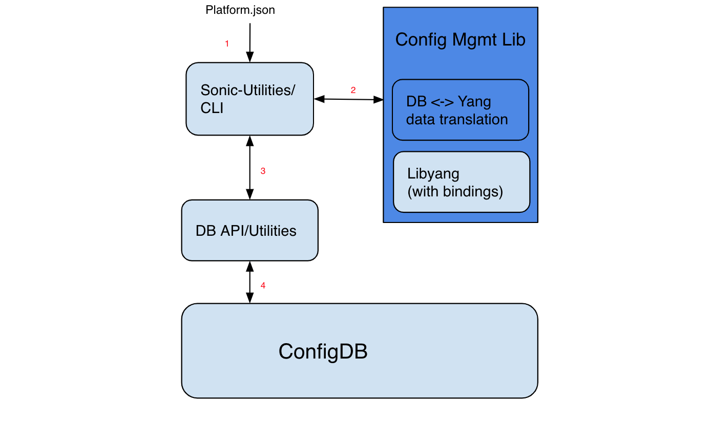
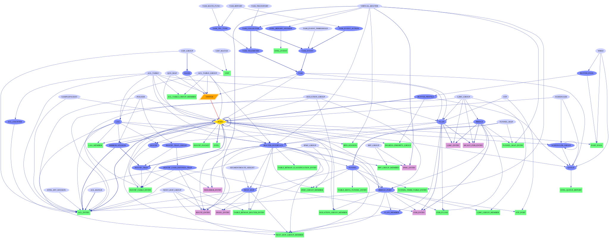

# SONiC dynamic port breakout feature high level design

# Table of Contents
- [SONiC dynamic port breakout feature high level design](#sonic-dynamic-port-breakout-feature-high-level-design)
- [Table of Contents](#table-of-contents)
- [Revision history](#revision-history)
- [Scope](#scope)
- [Acronyms](#acronyms)
- [Feature Overview](#feature-overview)
- [Requirements](#requirements)
- [Design Scope](#design-scope)
  - [In scope](#in-scope)
  - [Out of scope](#out-of-scope)
- [Design](#design)
  - [Platform capability design](#platform-capability-design)
    - [Special HW capability consideration](#special-hw-capability-consideration)
    - [Special serdes wire considerations](#special-serdes-wire-considerations)
  - [CLI design](#cli-design)
    - [General design](#general-design)
    - [Special case](#special-case)
    - [CLI workflow](#cli-workflow)
    - [Show CLI](#show-cli)
  - [Configuration management](#configuration-management)
    - [Yang model examples](#yang-model-examples)
    - [Example configuration changes](#example-configuration-changes)
      - [Inactive configuration --phase 2](#inactive-configuration---phase-2)
    - [QOS/Buffer/PG configurations --phase 2](#qosbufferpg-configurations---phase-2)
  - [Feature backend design](#feature-backend-design)
    - [Refactor](#refactor)
  - [General design principles](#general-design-principles)
  - [Orchagent changes](#orchagent-changes)
    - [Data structure changes](#data-structure-changes)
    - [PORT](#port)
    - [Host interface](#host-interface)
    - [LAG MEMBER](#lag-member)
    - [BridgePort/Vlan-member](#bridgeportvlan-member)
    - [ACL](#acl)
    - [Buffer](#buffer)
    - [Port counter and Queue counter](#port-counter-and-queue-counter)
    - [FDB](#fdb)
    - [Interface handling](#interface-handling)
    - [Mirror](#mirror)
    - [Neighbor](#neighbor)
    - [Routes](#routes)
    - [QoS](#qos)
  - [SAI-Redis and Syncd considerations](#sai-redis-and-syncd-considerations)
    - [SAI Redis](#sai-redis)
    - [Syncd changes](#syncd-changes)
  - [libSAI requirements](#libsai-requirements)
- [Warm reboot support](#warm-reboot-support)
- [Unit test -TBD](#unit-test--tbd)
- [System test -TBD](#system-test--tbd)
- [Scalability - TBD](#scalability---tbd)
- [References](#references)

# Revision history
| Rev |    Date     |       Author       | Change Description                |
|:---:|:-----------:|:------------------:|-----------------------------------|
| 0.1 | 07/15/2019  | Zhenggen Xu           | Initial version                   |
| 0.2 | 08/16/2019  | Zhenggen Xu           | Second version                   |
| 0.3 | 08/16/2019  | Zhenggen Xu           | Review feedback and other changes                   |
| 0.4 | 12/20/2019  | Zhenggen Xu           | platform.json changes, dependency check changes etc       |
| 0.5 | 3/5/2019    | Zhenggen Xu           | Clarification of port naming and breakout modes       |
| 0.6 | 2/3/2021    | Zhenggen Xu           | Support more flexible port aliases       |

# Scope
This document is the design document for dynamic port-breakout feature on SONiC. This includes the requirements, the scope of the design, HW capability considerations, software architecture and scope of changes for different modules.


# Acronyms
| Acronym                  | Description                                |
|--------------------------|--------------------------------------------|
| DPB                      | Dynamic Port Breakout             |

# Feature Overview
Ports can be broken out to different speeds with various lanes in most HW today. However, on SONiC, the port breakout modes are hard-coded in the profiles and only loaded at initial time. In case we need to have a new port breakout mode, we would potentially need a new image or at least need to restart services which would impact the traffic of the box on irrelevant ports.

The feature in this document is to address the above issues.

# Requirements
Today, the port breakout is predefined in the image with a profile for each HWSKU, I,E, how to combine lanes for different speeds per port is predefined. One port could use 1, 2, 4 or other number of lanes. If we need to change the port breakout mode that is not part of the predefined profiles, we would have to come up with a new HWSKU and define the configuration file and potentially a new HW initialization profile and a new image. Even we could generate the configuration files with a common HW profile, we would have to restart the SONiC service or reboot the SONiC device. This would impact the existing connections on the device that are different than the port (group) under the change.

High level requirements:
- SONiC to support port breakout dynamically.
We should be able to change port breakout mode at run time without affecting the unrelated port activities. E,g,  If we want to change port 0 from 50G to port 0-1 with 2x25G.  The remaining ports of the switch should not be touched, traffic should not be interrupted on those ports.
- We need support breakout mode for one port with different lanes: e,g, 1, 2, 4 and others number of lanes if supported.
- Configuration dependencies on the ports to be changed with breakout mode should be reported or removed automatically.
- Run time dependencies and resources should be cleared on the ports to be changed with breakout mode.
- Optionally, we provide a way to automatically add the configuration back to the port if operators can specify in advance.

# Design Scope
## In scope
- CLI design for operations to change the port breakout dynamically.
- HW capabilities that need to be specified and checked before applying the configurations.
- Configuration dependencies handling on the port when we removing/adding it.
- Support inactive configurations, we can prepare the configurations for inactive ports if they are not available yet, so when we breakout the port, those configurations will be automatically applied to the relevant newly added ports. This will be in phase 2.
- Configuration manager backend daemons to deal with relevant configuration changes. These daemons are usually to take the configurations and pass to orchagent through appDB.
- Orchagent daemon and classes to deal with relevant configurations and runtime dependencies changes.
- SAI redis and syncd changes to deal with relevant configuration and runtime dependencies changes.
- LibSAI APIs required for relevant configuration and runtime dependencies changes.

## Out of scope
- Integration of the feature with the configuration management framework.
- Programmable interface for config changes like REST API or gnmi etc.
- Internal immediate feedback mechanism from low level to user is not in scope of this design. Once the port is changed to different breakout mode to configDB, daemon status and log messages are used to check whether end-to-end is succeed for now.

# Design
## Port Naming
SONiC will continue to use the current port naming convention, we reserve one lane per EthernetXX, and we can also group the lanes to one interface based on the mode:

e,g, 4 serdes lanes for lane 0/1/2/3:

- 1 Lane mode:
```
Ethernet0 (lane 0)
Ethernet1 (lane 1)
Ethernet2 (lane 2)
Ethernet3 (lane 3)
```

- 2 lanes mode:
```
Ethernet0 (lane 0/1)
Ethernet2 (lane 2/3)
```

- 4 lanes mode:
```
Ethernet0 (lane 0/1/2/3)
```

Note, it will be similar if we want to support 8 lanes mode for newer devices.

The new naming converntion like [SONiC port naming] (https://github.com/yxieca/SONiC-1/blob/b70bb0c7da38b490009b7dbdad8b83a264e8a07b/doc/sonic-port-name.md) is not used in this design.

Also there was considerations of grouping port together for different purposes and also support or mix with FibreChannel ports with different naming convention, this will NOT be part of this design.

For the naming changes, since the port naming will be in `platform.json` etc common files (check below section) and the parser function is common, the design will allow you to easiy improve this later.

## Platform capability design
A capability file for a platform with port breakout capabilities is provided. It defines the initial configurations like lanes, speed, alias etc. This file will be used for CLI later to pick the parent port and breakout mode. It can be used for speed checks based on the current mode. It (in conjunction with `hwsku.json` talked later) will also replace the functionality of the current existing port_config.ini.

The capability file is named `platform.json` and should be provided to each platform if we need support DPB. Also to support more properties in this table we make the interfaces related capabilities into one section:

`platform.json` looks like this:

```
"interfaces": {
	"Ethernet0": {
	    "index": "1,1,1,1",
	    "lanes": "0,1,2,3",
	    "breakout_modes": {
	        "1x100G[40G]": ["Eth1"],
	        "2x50G": ["Eth1/1", "Eth1/2"],
	        "4x25G[10G]": ["Eth1/1", "Eth1/2", "Eth1/3", "Eth1/4"],
	        "2x25G(2)+1x50G(2)": ["Eth1/1", "Eth1/2", "Eth1/3"],
	        "1x50G(2)+2x25G(2)": ["Eth1/1", "Eth1/2", "Eth1/3"]
	    }
	 },

	 "Ethernet4": {
	    "index": "2,2,2,2",
	    "lanes": "4,5,6,7",
	    "breakout_modes": {
	        "1x100G[40G]": ["Eth1"],
	        "2x50G": ["Eth1/1", "Eth1/2"],
	        "4x25G[10G]": ["Eth1/1", "Eth1/2", "Eth1/3", "Eth1/4"],
	        "2x25G(2)+1x50G(2)": ["Eth1/1", "Eth1/2", "Eth1/3"],
	        "1x50G(2)+2x25G(2)": ["Eth1/1", "Eth1/2", "Eth1/3"]
	    }
	 }
 	 ...
 }
```
In this file, only the parent ports (e,g, Ethernet0/4) are defined, the child ports would be generated from them. For each parent port, it defines fields as below:
- "index": the indexes for individual lanes. This usually matches the front panel port #, and is used by platform plugins for optical module queries.
- "lanes": This defines the physical HW lanes included in this parent port. The lanes will be used for breakout ports.
- "breakout_modes": This defines the breakout modes available on the platform for this parent port, and it maps to the alias list. The alias list presents the alias names for individual ports in order under this breakout mode.

    The modes in the example file is neither necessarily the full list nor a must list, the design will not tied to the example. For instance, we should be able to define 50G serdes based platforms for 400G/200G/100G/50G ports. We can also define a subset of the port modes on some platform.
- "default_brkout_mode": This defines the default breakout mode if no mode changes were applied on the system.

Syntax for breakout_modes key:
- `number x speed1 [speed2, speed3]`

    means the parent port lanes are split equally to number of ports denoted by the `number`. And the speed for each breakout port is default to `speed1`, but is changeable to `speed2`, `speed3` etc.
    For examples:
    `1x100G[40G]` means, all lanes are assigned for one port, and running at 100G by default, but the speed could be changed to 40G later.

    `2x50G` means, all lanes split into 2 ports equally, and each run at 50G.

    `4x25G[10G]` means, all lanes are split into 4 ports equally, each run at 25G by default, but each individual one is changeable to 10G.

    Note: If the platform doesn't support mix speeds, you may want to make the modes of `4x25G[10G]` to `4x25G` and `4x10G`. This will be platform specific choices.

- `number1 x speed1[speed2,..](numberA) + number2 x speedX[speedY,..](numberB) + ...`

    means `numberA` of lanes were used for `number1` of port(s) with default `speed1` and changeable to `speed2` etc., the `numberA` lanes are assigned equally to the `number1` of ports.  Same thing for `number2`, `speedX[speedY,..]` and `numberB` and so on.

    This is useful for some asymmetric speed support. Examples as below:

    `2x25G(2)+1x50G(2)` means the first two lanes were used by 2x25G, and the last two lanes were used by a 50G. You can apply mix speeds for individual port like `2x25G[10G](2)+1x50G(2)` if HW supports it.

    Please note, ASICs might have different restrictions especially for the asymmetric breakout mode.

Speeds in the breakout modes will be used for speed validation when we change the individual ports speed later.
Eg, In `4x25G[10G]` mode, we can change the individual port in that port group to 25G or 10G, but not some other speeds.

The speeds usually used today are:
`10G, 20G, 25G, 50G, 100G, 200G, 400G` etc.
However, the design is not limited to this list.

Note: In some case, the `brkout_mode` only have one mode, this means it will not allow changing to different modes, e,g `1x100G[40G]` means it only support 100G[40G] on this port, could mean no breakout to child ports.

We will have a new table `BREAKOUT_CFG` in configDB to present the current running breakout mode, it will be saved to configDB after the initial breakout at boot time, and also updated whenever the port breakout is changed.

```
BREAKOUT_CFG:
{
    "Ethernet0": {
        "brkout_mode": "1x100G[40G]"
    },
    "Ethernet4": {
        "brkout_mode": "2x50G"
     }
    ...
}
```

The configDB will have the final port breakout settings for individual ports, the format/schema is the same as before. Above table is used for CLI to quickly know what breakout mode the system is on, and thus delete/add relevant ports if we are going to change the breakout mode. Also, it could be used by backend daemons like `PMON` to know the breakout mode and change the port layout for port based events and LED changes etc.

After dynamic port breakout support, we won’t need different HWSKUs for the same platform. If for any reason (e,g, keep backwards compatibility) the user still wants to have HWSKUs, we would put the `hwsku.json` into each HWSKU with the desired default breakout modes:

```
"interfaces": {
	"Ethernet0": {
	    "default_brkout_mode": "1x100G[40G]"
	 },
	 "Ethernet4": {
	    "default_brkout_mode": "2x50G"
	 }
	…
}
```

The `default_brkout_mode` mode should be one of the modes in `brkout_mode` from the same port in `platform.json`.

The file will work in conjuction with the `platform.json` at platform level, and it will be used for port breakout during the initialization phase.

Above `platform.json` and `hwsku.json` files will deprecate the old port_config.ini file in the current SONiC design.

To keep backwards compatibility, we will modify the current code which is using port_config.ini to read from `platform.json` and `hwsku.json` first, if they don't exist, it will read the port_config.ini as usual. To support the breakout feature, the json files will be required. In case they are missing, DPB changes would fail at CLI phase.

### Special HW capability consideration
On some platforms, there are some limitations about the number of port/mac available for the total count or for a particular group. For example, on some platforms, there were limitations where only 4 port/MAC are available for 8 lanes, in this case, we could define the `platform.json` to fit that platform. e,g:
```
"Ethernet0": {
    "index": "1,1,1,1,2,2,2,2",
    "lanes": "0,1,2,3,4,5,6,7",
    "breakout_modes": {
        "2x100G[40G]": ["Eth1", "Eth2"],
        "4x50G": ["Eth1/1", "Eth1/2", "Eth2/1", "Eth2/2"],
        "1x100G[40G](4)+2x50G(4)": ["Eth1", "Eth2/1", "Eth2/2"],
        "2x50G(4)+1x100G[40G](4)": ["Eth1/1", "Eth1/2", "Eth2"],
        "4x25G[10G](4)": ["Eth1/1", "Eth1/2", "Eth1/3", "Eth1/4"],
        "None(4)+4x25G[10G](4)": ["Eth2/1", "Eth2/2", "Eth2/3", "Eth2/4"]
    }
 }
 ...
```
### Special serdes wire considerations
On some platforms, the serdes connection to front panel port might not be the as the same granular as the QSFP port, so it is possible to define the `platform.json` based on different number of serdes group. E,g, we use two lanes to group a port group as below:
```
"Ethernet0": {
    "index": "1, 1",
    "lanes": "0,1",
    "breakout_modes": {
        "1x50G": ["Eth1"]
        "1x25G[10G]": ["Eth1"],
        "2x25G[10G]": ["Eth1/1", "Eth1/2"]
    }
 },

 "Ethernet2": {
    "index": "2, 2",
    "lanes": "2,3",
    "breakout_modes": {
        "1x50G": ["Eth1"]
        "1x25G[10G]": ["Eth1"],
        "2x25G[10G]": ["Eth1/1", "Eth1/2"]
    }
 }
 ...
```

## CLI design
### General design
As mentioned above, when we change the configuration by CLI, we also keep a running breakout mode in configDB to know the current mode and do platform validation. The `platform.json` will be used to generate new configurations after we breakout the ports to a different mode. The format/schema of the configDB for port table is not changed in this design. Also, we will introduce a lock for config CLI so only one can change the configuration at a time to prevent inconsistency.

Given example of `platform.json` to have 4 lanes on parent port Ethernet0 with Ethernet1/2/3 in the same group:
```
"Ethernet0": {
    "index": "1,1,1,1",
    "lanes": "0,1,2,3",
	 "breakout_modes": {
	     "1x100G[40G]": ["Eth1"],
	     "2x50G": ["Eth1/1", "Eth1/2"],
	     "4x25G[10G]": ["Eth1/1", "Eth1/2", "Eth1/3", "Eth1/4"],
	     "2x25G(2)+1x50G(2)": ["Eth1/1", "Eth1/2", "Eth1/3"],
	     "1x50G(2)+2x25G(2)": ["Eth1/1", "Eth1/2", "Eth1/3]"
	 }
 }
```
CLI will look like below:

Config port to 100G/40G from 4x25G/10G mode:
```
> config interface breakout Ethernet0 1x100G[40G]
```
Or
```
> config interface breakout Ethernet0 1x100G[40G]
> config interface breakout Ethernet0 speed 40G
```
CLI will query the configDB to get the current mode of `4x25G[10G]` for Ethernet0. If port name in the CLI (e,g, Ethernet0) is not found in json, we will fail the CLI.

Based on the `platform.json` and the current mode, we know there are 4 ports in the port group, and CLI will try to delete all of them one by one first. During deletion, if there are dependencies on the port, depending on the CLI options, we will print the list of the dependencies and fail the CLI, or we delete the dependencies automatically and then delete the ports. This will be described in more details later. After the old ports got deleted, CLI will query the `platform.json` and the target breakout mode to generate the configDB entries. In this case as below:
```
    "Ethernet0": {
        "alias": "Eth1/1",
        "lanes": "0,1,2,3",
        "speed": "100000",
        "index": "1"
    }
```
At this point, the backend should have deleted the old ports and is adding this new port as specified. We should now get Ethernet0 as 100G. Ethernet1/2/3 are removed.

Note: The other properties would be loaded with default values or not set at this point, e,g, admin_status, mtu, FEC setting etc.

- For example, admin_status is "DOWN" by default, so the newly created port is stood at "DOWN" state until user put it in "UP" state later. This could prevent the issues where we have to apply other configurations first before we can bring up the port itself to avoid some temporary traffic impact.

- Also, different FEC setting could be applied separately by user later.


Similar CLI for different modes, examples as below:

Config port to 2x50G
```
> config interface breakout Ethernet0 2x50G
```
We should now get Ethernet0/2 as 50G. Ethernet1/3 are removed if existed before.

Config port to 4x25G/10G mix speeds:
```
> config interface breakout Ethernet0 4x25G[10G]
> config interface Ethernet0 speed 10G
> config interface Ethernet3 speed 10G
```
We should now get Ethernet0/1/2/3 with either 25G or 10G as configured by speed.

Config port to 25G/50G mix speeds:
```
> config interface breakout Ethernet0 2x25G(2)+1x50G(2)
```
We should now get Ethernet0/1 with 25G and Ethernet2 with 50G. Ethernet3 are removed if existed before.

In short, the CLI will query the current breakout mode from configDB, it will delete ports first and then add ports back.

The CLI checks that only the ports in `platform.json` will be applicable for breakout mode, and only the breakout modes defined in "breakout_modes" in `platform.json` can be applied.

When using CLI to configure the port speed, it will also query the current breakout mode from configDB, and then check if the current speed is supported or not.

E,g, If the current breakout mode is `4x25G[10G]`, this means any ports can be configured to 25G or 10G,  but if we configure the speed with 50G or other speed, CLI will return error right away before calling the backend calls.

### Special case
We also consider some special case where we don’t want to delete all ports in the current mode to limit the impact domain due to the breakout change:

E,g, current mode is 2x50G, and we are changing to 2x25G(2)+1x50G(2). The CLI should be able to find that the second 50G port is not changed, and we will just change the first port from 50G to 2x25G.  I,E, Delete Ethernet0, and add Ethernet0/1 back with 25G.  This will make the second 50G port not impacted for traffic.

### CLI workflow
Overall CLI workflow (python click based currently):

CLI will be used to configure the parent port with different breakout modes. CLI will query the running breakout mode and get target breakout mode from CLI option, and then decide what ports need to be deleted first and what ports need to be added later.

There are configuration dependencies on the port to be changed to different breakout modes. This will be talked in the later section.

During the port breakout removing port process, it will communicate with configuration management system (see later section, it is a library currently) to check syntax and also check if all dependencies are removed from the port:
- If yes, it will continue to push the configuration to configDB to delete the port.
- If no, it will provide error messages and print the dependencies list. We also provide a `“--force-remove-dependencies/-f”` option to CLI, which will remove the configuration dependencies automatically.

During the adding port process, CLI will determine the physical lanes for each breakout port based on `platform.json` and the target breakout mode. It will generate multiple individual ports with proper lanes, alias, speed etc info to configDB.

To eliminate the chance that the adding port could fail (e,g, validation failure), we will finish all the validation of delete/add data in memory before we even start to delete ports into configDB.

### Show CLI
Show interface command should be able to show the ports capability and the current breakout mode.

```
> show interfaces breakout
"Ethernet0": {
    "index": "1,1,1,1",
    "lanes": "0,1,2,3",
	 "breakout_modes": {
	     "1x100G[40G]": ["Eth1"],
	     "2x50G": ["Eth1/1", "Eth1/2"],
	     "4x25G[10G]": ["Eth1/1", "Eth1/2", "Eth1/3", "Eth1/4"],
	     "2x25G(2)+1x50G(2)": ["Eth1/1", "Eth1/2", "Eth1/3"],
	     "1x50G(2)+2x25G(2)": ["Eth1/1", "Eth1/2", "Eth1/3"]
	 }
    "default_brkout_mode": "1x100G[40G]",
    "brkout_mode": "4x25G[10G]"
 },

 "Ethernet4": {
    "index": "2,2,2,2",
    "lanes": "4,5,6,7",
	 "breakout_modes": {
	     "1x100G[40G]": ["Eth1"],
	     "2x50G": ["Eth1/1", "Eth1/2"],
	     "4x25G[10G]": ["Eth1/1", "Eth1/2", "Eth1/3", "Eth1/4"],
	     "2x25G(2)+1x50G(2)": ["Eth1/1", "Eth1/2", "Eth1/3"],
	     "1x50G(2)+2x25G(2)": ["Eth1/1", "Eth1/2", "Eth1/3"]
	 }
    "default_brkout_mode": "1x100G[40G]",
    "brkout_mode": "2x50G"
 }

```

## Configuration management
As mentioned above, during the port delete process, we would need to remove all the configuration dependencies before we are deleting the port. Also the configuration validation should be done when we push data to configDB.

To achieve this, we are defining Yang models for all configuration objects based on the current SONiC schema. During the configuration processes(e,g, removing a port), we will check all the dependencies on the port based on the Yang model data instance that initialized by existing configurations. For example, if we delete a port which is referenced by some VLANs, we should take action on those dependencies.

If the dependencies exist, we will print out all of them by default.
Also, an option is provided to user to automatically remove the dependencies. This is done by CLI and backend libraries together. Once the dependencies were removed, it will be translated to the SONiC configDB format and pushed to configDB, this process will be a generic translation since the Yang model we defined are following the configDB schema exactly,

When adding a new port, we will fill up the Yang model instance data from configDB and new added data, and do some validation check, then push the configDB formatted data to configDB.

High level configuration flow is as below:


Interfaces in the figure:
1. CLI will utilize `platform.json` and configDB to find out what ports to be deleted and then generate the individual port configurations into configDB. When port-breakout was changed successfully, CLI will update the configDB for `BREAKOUT_CFG` table.
2. CLI will call the config management library to load configDB data into Yang instance data after generic translation, then during the port delete, it will find all the dependencies and optionally remove them automatically. It then translates the Yang instance data to configDB data. This interface is also used for config validate like syntax checks and dependency checks, whenever we are pushing data to configDB, e,g, during the port adding process. Note: CLI is also leaveraged to verfiy the port deletion completeness before adding the new ports.
3. CLI will use existing RedisDB APIs or utilities to read/write data to configDB.
4. This is the RedisDB interface.

### Yang model examples
sonic-port.yang
```
module sonic-port{

    namespace "http://sonic-port";
    prefix sonic-port;

    import ietf-yang-types {
        prefix yang;
    }

    import ietf-inet-type {
        prefix inet;
    }

    import sonic-head {
        prefix sonic-head;
    }

    organization "Linkedin Corporation";

    contact "lnos_coders@linkedin.com";

    description "PORT yang Module for SONiC OS";

    revision 1.0.0 {
        description "First Revision";
    }

    container PORT {

        description "PORT part of config_db.json";

        list PORT_LIST {

            key "port_name";
/*
            sonic-head:sonic_db_path = PORT;        [Todo: Fix by extension]

            sonic-head:sonic_db_schema {            [Todo: Fix by extension]
                {port_name}: {
                    "alias": {alias},
                    "lanes": {lanes},
                    "description": {description},
                    "speed": {speed},
                    "mtu": {mtu}
                }
            }
*/
            leaf port_name {
                type string {
                    length 1..128;
                    /* <must be a valid name as per profile.json>;  [Todo: How to verify this] */
                }
            }

            leaf alias {
                config false;
                type string {
                    length 1..128;
                    /* <get_alias_function()>; [Todo] */
                }
            }

            leaf lanes {
                config false;
                type string {
                    length 1..128;
                    /* <get_lanes_function()>; [Todo] */
                }
            }

            leaf description {
                type string {
                    length 1..255;
                }
            }

            leaf speed {
                type uint32 {
                    range 1..100000;
                    /* <must be a valid speed as per profile.json>;  [Todo: How to verify this] */
                }
            }

            leaf mtu {
                type uint16 {
                    range 1..9216;
                }
            }

            leaf admin_status {
                mandatory true;
                type sonic-head:admin_status;
            }
        }
        /* end of list PORT_LIST */
    }
    /* end of container PORT */
}
/* end of module sonic-port */

```

sonic-vlan.yang:
```
module sonic-vlan {

    namespace "http://sonic-vlan";
    prefix sonic-vlan;

    import ietf-yang-types {
        prefix yang;
    }

    import ietf-inet-type {
        prefix inet;
    }

    import sonic-head {
        prefix sonic-head;
    }

    import sonic-port {
        prefix sonic-port;
    }

    organization "Linkedin Corporation";

    contact "lnos_coders@linkedin.com";

    description "VLAN yang Module for SONiC OS";

    revision 1.0.0 {
        description "First Revision";
    }

    container VLAN_INTERFACE {

        description "VLAN_INTERFACE part of config_db.json";

        list VLAN_INTERFACE_LIST {

            key "vlanid ip-prefix";
/*
            sonic-head:sonic_db_path "VLAN_INTERFACE";  [Todo: Fix by extension]

            sonic-head:sonic_db_schema {                [Todo: Fix by extension]
                "Vlan{vlanid}|{ip-prefix}": {
                    "scope": {scope},
                    "family": {family}
                }
            }
*/
            leaf vlanid {
                type leafref {
                    path "/VLAN/VLAN_LIST/vlanid";
                }
            }

            leaf ip-prefix {
                mandatory true;

                when "../family = IPv4";
                type inet:ip4-prefix;

                when "../family = IPv6";
                type inet:ip6-prefix;
            }

            leaf scope {
                mandatory true;
                type enumeration {
                    enum global;
                    enum local;
                }
            }

            leaf family {
                mandatory true;
                type sonic-head:ip-family;
            }
        }
        /* end of VLAN_INTERFACE_LIST */

    }
    /* end of VLAN_INTERFACE container */

    container VLAN {

        description "VLAN part of config_db.json";

        list VLAN_LIST {

            key "vlanid";
/*
            <sonic_top>\sonic_db_path "VLAN";

            sonic-head:sonic_db_schema {
                "Vlan{vlanid}: {
                    "description": {description},
                    "dhcp_servers": {dhcp_servers},
                    "vlanid": {vlanid},
                    "mtu": {mtu},
                    "admin_status": {admin_status},
                    "members": {members},
                }
            }
*/
            leaf vlanid {
                type uint16 {
                    range 1..4094;
                }
            }

            leaf description {
                type string {
                    length 1..255;
                }
            }

            leaf-list dhcp_servers {
                type inet:ip-address;
            }

            leaf mtu {
                type uint16 {
                    range 1..9216;
                }
            }

            leaf admin_status {
                mandatory true;
                type sonic-head:admin_status;
            }

            leaf-list members {
                /* leaf-list members are unique by default */
                mandatory true;
                type leafref {
                    path sonic-port:PORT/sonic-port:PORT_LIST/sonic-port:port_name;
                }
            }
        }
        /* end of VLAN_LIST */
    }
    /* end of container VLAN */

    container VLAN_MEMBER {

        description "VLAN_MEMBER part of config_db.json";

        list VLAN_MEMBER_LIST {

            key "vlanid port";
/*
            sonic-head:sonic_db_path "VLAN";

            sonic-head:sonic_db_schema {
                "Vlan{vlanid}|{port}": {
                "tagging_mode": {tagging_mode}
                }
            }
*/
            leaf vlanid {
                type leafref {
                    path ../../../VLAN/VLAN_LIST/vlanid;
                }
            }

            leaf port {
                /* key elements are mandatory by default */
                mandatory true;
                type leafref {
                    path sonic-port:PORT/sonic-port:PORT_LIST/sonic-port:port_name;
                }
            }

            leaf tagging_mode {
                mandatory true;
                type enumeration {
                    enum tagged;
                    enum untagged;
                    enum priority_tagged;
                }
            }
        }
        /* end of list VLAN_MEMBER_LIST */
    }
    /* end of container VLAN_MEMBER */
}
```

### Example configuration changes
Assume Ethernet0 has `1x100G[40G]` breakout mode initially, and we are changing the mode to `2x50G` mode.

The configDB data is as below initially:
```
"PORT": {
        "Ethernet0": {
            "alias": "Eth1/1",
            "lanes": "0,1,2,3",
            "description": "",
            "speed": "100000",
            "index": "1"
        }
}
"VLAN_MEMBER": {
        "Vlan100|Ethernet0": {
            "tagging_mode": "untagged"
        },
        "Vlan200|Ethernet0": {
            "tagging_mode": "tagged"
        }
}
```

When we issue CLI:

` > config interface breakout Ethernet0 2x50G `

It will find out the dependencies on Ethernet0, and print out the list as below:
/sonic-vlan:VLAN/VLAN_LIST[vlanid='100']/members[.='Ethernet0']
/sonic-vlan:VLAN/VLAN_LIST[vlanid='200']/members[.='Ethernet0']
/sonic-vlan:VLAN_MEMBER/VLAN_MEMBER_LIST[vlanid='100'][port='Ethernet0']/port
/sonic-vlan:VLAN_MEMBER/VLAN_MEMBER_LIST[vlanid='200'][port='Ethernet0']/port

If we use -f option as below:

`> config interface breakout Ethernet0 2x50G -f`

CLI will generate the below diff and push to the configDB:

```
"PORT": {
-        "Ethernet0": {
-            "alias": "Eth1/1",
-            "lanes": "0,1,2,3",
-            "description": "",
-            "speed": "100000",
-            "index": "1"
-        }
}

"VLAN_MEMBER": {
-        "Vlan100|Ethernet0": {
-            "tagging_mode": "untagged"
-        },
-        "Vlan200|Ethernet0": {
-            "tagging_mode": "tagged"
-        }

```
and later CLI will also generate the new ports section and push to configDB:
```
"PORT": {
+        "Ethernet0": {
+            "alias": "Eth1/1",
+            "lanes": "0,1",
+            "description": "",
+            "speed": "50000",
+            "index": "1"
+        },
+        "Ethernet2": {
+            "alias": "Eth1/3",
+            "lanes": "2,3",
+            "description": "",
+            "speed": "50000",
+            "index": "1"
+        }
}
```
#### Inactive configuration --phase 2
When the new ports were added above, we could see the other configurations like VLAN etc are not applied. This could potentially require operators to apply the configurations manually after the port breakout.  In some scenarios, the configuration could be the same before and after breakout. To make the operation easier, we introduce a way to automatically apply the configurations prepared by users.
A configuration file with configurations related to ports are prepared by users: port_config_superset.json, in the below example, it has VLAN configurations:

```
"VLAN_MEMBER": {
        "Vlan100|Ethernet0": {
            "tagging_mode": "untagged"
        },
        "Vlan200|Ethernet0": {
            "tagging_mode": "tagged"
        },
        "Vlan100|Ethernet1": {
            "tagging_mode": "untagged"
        },
        "Vlan200|Ethernet1": {
            "tagging_mode": "tagged"
        },
        "Vlan100|Ethernet2": {
            "tagging_mode": "untagged"
        },
        "Vlan200|Ethernet2": {
            "tagging_mode": "tagged"
        },
        "Vlan100|Ethernet3": {
            "tagging_mode": "untagged"
        },
        "Vlan200|Ethernet3": {
            "tagging_mode": "tagged"
        }
}
```
This file is used after the new ports are added, and then CLI will look the file with the newly added ports and apply the applicable configuration to configDB, in the above case, it will be:

```
"VLAN_MEMBER": {
        "Vlan100|Ethernet0": {
            "tagging_mode": "untagged"
        },
        "Vlan200|Ethernet0": {
            "tagging_mode": "tagged"
        },
        "Vlan100|Ethernet2": {
            "tagging_mode": "untagged"
        },
        "Vlan200|Ethernet2": {
            "tagging_mode": "tagged"
        }
}
```

### QOS/Buffer/PG configurations --phase 2
This part of the configurations are generated by buffermgrd or using jinja template to generate configuration to be used.
We will define the Yang models for these settings, and then remove the dependencies during CLI process for the port removal.

Example of the configurations:
```
"QUEUE": {
    "Ethernet0|0": {
        "scheduler": "[SCHEDULER|scheduler.0]"
    },
    "Ethernet0|1": {
        "scheduler": "[SCHEDULER|scheduler.0]"
    }
}
```
This is generated by J2 template, when removing ports, Yang models will get dependencies list and CLI can decide to remove it. When adding port, we also need to add above configurations back, we could follow the super-set configuration model mentioned before. then add all the configurations to the newly added ports.

Buffer PG:
```
 "BUFFER_PG": {
    "Ethernet0|3": {
        "profile": "[BUFFER_PROFILE|pg_lossless_25000_5m_profile]"
    }
 }
```
This part and “BUFFER_PROFILE” with lossless were generated by buffermgrd. This will be updated when speed/cable was changed, but if the port is deleted, we should remove this as the dependencies.

```
"BUFFER_PG": {
    "Ethernet0,Ethernet1,Ethernet2|0": {
        "profile": "[BUFFER_PROFILE|ingress_lossy_profile]"
    },

"PORT_QOS_MAP": {
    "Ethernet0,Ethernet1,Ethernet2": {
        "tc_to_pg_map": "[TC_TO_PRIORITY_GROUP_MAP|AZURE]",
        "tc_to_queue_map": "[TC_TO_QUEUE_MAP|AZURE]",
        "pfc_enable": "3",
        "pfc_to_queue_map": "[MAP_PFC_PRIORITY_TO_QUEUE|AZURE]",
        "dscp_to_tc_map": "[DSCP_TO_TC_MAP|AZURE]"
    }

 "BUFFER_QUEUE": {
    "Ethernet0,Ethernet1,Ethernet2|0-2": {
        "profile": "[BUFFER_PROFILE|egress_lossy_profile]"
    }
```
We would need to split the configuration to be using individual port (not group of ports) as the key, when we remove a port, we need to remove the relevant section,  and when we add more, we need J2 template to take port parameter and generate the configuration and load to configDB.

## Feature backend design
A high level backend architecture is described figure 2:


Today, the port initialization process at high level is like following, syncd/HW brings up the system with predefined HW profile. Portsyncd read the configDB or port_config.ini to push them into appDB, orchagent will pick up the configuration to create the host interfaces (in turn creates the linux kernel interface). Portsyncd listens on netlink messages to make sure interfaces are ready before other subsystem can continue to work on port-related objects.

During the run time, configurations will be pushed to configDB through CLI or other interfaces.

The changes picked up by the configMgr daemons, e,g, portmgrd, vlanmgrd. It will verify the internal dependencies, e,g, StateDB to check if the port is already configured,  if not, it will wait for it to be ready.  After things are ready, the configuration will be set to linux and/or translated to AppDB data and pushed to Redis-DB.

Note: Today, there were duplicated logic in portsyncd and portmgrd to sync configurations changes from configDB to appDB.

There are some exceptions here for the above processes, like bufferMgrd,  it listens on port configurations: speed, cable length.  It will generate the buffer configurations automatically and push them into configDB directly.

The orchagent is the major daemon to deal with the application data, it resolves dependencies and translate the data to SAI API calls towards lower level and HW.  It not only deals with appDB data but also deals with configDB data where the intermediate configMgr daemons are not present.

### Refactor
The individual port configurations generated by port breakout modes are dynamically changed and saved to configDB.

The current “PortConfigDone” , “PortInitDone” signals are not very straight design. We are going to refactor the code as following:
- portsyncd would focus on reading the netlink of linux kernel interface and generate “state” of the interface in stateDB.  No configuration read or subscribe is done here.
- portmgrd will deal with the linux actions for the PORTs.  E,g, set MTU, admin status on linux.
- Orchagent (portsorch class) will deal with the configuration directly from configDB. The PORT_TABLE in APPDB will only carry operation_status for now. All applications like CLI, snmp, etc, that rely on PORT_TABLE should be moved the configuration PORT table.

Portsorch in orchagent will be handling the configuration changes, including add, delete and modify.  It will compare the lane_set to decide whether the port need to be added/deleted.  For the very first time, it will read the configuration PORT table once, and a counter will be used to make sure all PORTs are read before we do the initial add/delete port action. Afterwards, it will dynamic handle the port configuration changes.

To limit the scope, the first phase proposal:
- portsyncd only doing the netlink related tasks and generate “state” of the interfaces in stateDB.
- portmgrd will deal with all the initial configuration flags, configuration DB/file parsing as well as the configuration handling including Linux related fields like MTU, admin status.
- Orchagent is acting similar as before but will add the dynamic add/delete/modify functions.

## General design principles
As mentioned above, we will leverage CLI and config libs to remove the dependencies from port to be deleted. The backend will take the configuration changes and remove the configuration dependencies. Also, they are runtime dependencies (e,g, fdb, routes, neighbors etc), this will be done at orchagent to fulfill the sairedis check later. To avoid any timing issue where the configuration or dynamic dependencies are not removed before the port is deleted, dependencies tracking info were added to port object, and they are checked and if not done, it will retry.

For runtime dependencies removal, after the validation was done and configuration dependencies were removed, we will shutdown the physical port before we remove it. This will help to remove the FDB, neighbors etc dynamic entries on the PORT. Code will be changed also to handle dynamic dependencies like host interface, flex counter etc.

As mentioned before, CLI is also helping to simplify the backend process of removing and adding ports. It will verify the port deletion happened in the backend (ASIC-DB) before it will issue the add ports changes.

## Orchagent changes
Orchagent is in the central location of the system, it listens the data from appDB and resolves the dependencies and then translates the actions into SAI API calls to create/delete/modify SAI objects in sai-redis and HW. Orchagent sometimes listens on the configDB directly if the configuration sync daemons are not present for such features.

Orchagent is organized in a way that it splits tables into features, and each feature will have one or a few C++ classes associated with it,  which will deal with the corresponding table changes.

Sairedis library used by Orchagent does track the dependencies for objects. The DPB design will leverage that tracking to make sure the dependencies were removed on the port before we remove the port itself, to avoid any errors for Sairedis call. In case such dependencies are not removed, orchagent will wait for that.

### PORT
PortsOrch::doPortTask will be called based on APP_PORT_TABLE changes, it will set port properties like MTU, Speed, FEC etc. Also, if the appDB lane mapping information is changed, it will create or delete the port.  In case of dynamic port breakout feature support, CLI/configMgr system should have made changes to the port and lanes etc in the configDB, this will be picked up by PortMgrd and push to AppDB, this class in the orchagent will pick up the appDB changes and delete and/or add ports.
We need to add the PORT deletion action in portsync.cpp code. We need to check dependencies for the sairedis meta data on the port before we move the port.

### Host interface
Host interface was created during the initialization. However, it was never deleted when the port is deleted today. Changes are needed to make the dynamic port breakout to work.  We should remove the host interface before we can delete the port itself to not violate the dependency checks at SAI level.

The host interface is essential for Linux kernel for neighbors and protocol stack for routes etc. We can leverage the host interface to clean the neighbors and routes before removing the port itself.

### LAG MEMBER
PortsOrch::doLagMemberTask will be called based on APP_LAG_MEMBER_TABLE changes.  It is CLI or configMgr system to remove the LAG MEMBER before it removes the port itself. By doing so,  orchagent will pick up the change and remove the port from LAG MEMBER.

To avoid any timing issue that port might not be removed from LAG member table yet before other operations, we need leverage the lag_member_id in Port Class in orchagent.  The id is set/cleared at orchagent when it add or remove the LAG association, and orchagent need check this flag before removing the port itself.

### BridgePort/Vlan-member
PortsOrch::doVlanMemberTask will deal with BridgePort and Vlan-member based on changes in APP_VLAN_MEMBER_TABLE.

Function addBridgePort() and addVlanMember() will be called if the port is added to be part of a VLAN.
Function removeBridgePort() and removeVlanMember()  will called if the port is removed from part of any VLAN.

If a new port is added, we will not put it in any VLAN.

It is expected that the CLI or configMgr system will remove the Port from any vlan before it removes the port itself.  orchagent will pick up that change and make the corresponding changes.

### ACL
The aclorch class is used to deal with configurations of ACL table and ACL rules.  The configuration changes is coming from configDB directly (in contrast to most orchagent which use the data from appDB).

ACL process can take care of ACL table create/delete, ACL rules create/delete.  The port is part of the ACL table binding location, in case of dynamic port breakout is happening, we don’t want to delete and create ACL table again, which in turn would delete and create ACL rules. This could create security holes during the configuration changes.  Instead, we would like to change the port binding dynamically.

The current ACL flow for binding the port,  the call graph:
AclOrch::addAclTable -> createBindAclTable -> AclTable::bind() -> PortsOrch::bindAclTable

This is only called when adding the ACL table. Since aclorch does have a local copy of the ACL table, we will add  a flow where we compare the binding port map (AclTable::portSet) from the configDB to local copy, and then add the new port to  the binding map and/or remove the missing port from the binding map.

It is expected to have CLI or configMgr remove the ACL from port binding before removing the port itself, with above workflow, the ACL should be removed from the port to be deleted. 

### Buffer
For IngressBufferProfile (IBP) and EgressBufferProfile (EBP) settings
They are set by sai_port_api->set_port_attribute API to SAI, and not saved in PortOrch itself.

To support dynamic port breakout feature where we could delete the port itself, we need high level application like CLI with J2 to remove the IBP and EBP from the configDB when port was removed.  The BufferOrch in orchagent will take action and remove the IBP and EBP by calling SAI API and set profile to “null”.

To make the configuration in sync from top to bottom,  If there was any configurations done by user, it should have been removed by CLI or configMgr system.  BufferOrch in the orchagent will get the queue and prioritygroup from configDB and break the association.


### Port counter and Queue counter
Orchagent is passing a flex counter map to syncd to pull the counters periodically. Whenever we remove/add ports, we should update that counter map.

### FDB
FDB is learnt on HW and will send notification to this process and it will add back to SAI objects. In case the port is going to be deleted, we should remove the bridgePort itself in PortOrch, it should automatically remove all the FDB entries on the port.


### Interface handling
This process get the Interface information from APP_INTF_TABLE, and it will add router interface and ip2me routes if there are IPs available on the interface/Port. Once all IPs are removed from the interface/Port, the router interface and ip2me routes will be removed.

CLI or ConfigMgr system should handle this dependencies at configuration level.  I,E, it will remove any IPs and let this process to remove the router interface and ip2me routes dependencies on the port.

Sairedis check of the port dependencies should gate the remove port process before interface is removed.

### Mirror
Mirror session could point to a destination with port or LAG.  If the port to be detected are configured as the mirror session destination port.  We will have to remove the session itself or we need update the port (e,g, to a different port in the LAG).

CLI or ConfigMgr system will handle this dependency, and remove the session if the port is configured as the destination port.  In case of LAG, it should track the LAG member and if the port is the only member of the LAG, it should remove the mirror session as well, otherwise, we need the mirror session to update the port info in the LAG.


### Neighbor
When the hostif is removed at the time when port is deleted,  Linux kernel will withdraw the neighbor entries, but that might be too late as we would hit the violation of dependencies during the port deletion since neighbors are depending on it.


### Routes
When the hostif is removed when port is deleted, protocol stack will withdraw the routes, but that might be too late as we would hit the violation of dependencies during the port deletion since routes are depending on it.


### QoS
This process handles DSCP-to-TC, TC-to-pg, TC-to-queue mappings, Queue setting, WRED setting, scheduler etc.

Before remove port, we should remove the Qos settings on port, this should be initiated by CLI or configMgr system.  This daemon will listen on those tables and apply the “null” objects to the port.  When adding back the port,the qos setting need to be re-applied,  however this process was done at init time only with J2 template, we will need to change that so we can dynamically apply Qos per port.


## SAI-Redis and Syncd considerations

### SAI Redis
In SAI redis, there were a lot of objects maintained in the object model, below is the SAI redis dependencies graph:



As you can see,  the port objects is a fundamental objects that so many objects are depending on.  SAI Redis has reference counter for port object to count how many it was referenced, and it will check whether the dependencies are removed before we can remove the port object.

To support this, for any regular objects that configured by users, should be removed by users before deleting the port, and added by users later after we create the port. Dynamic dependencies added by orchagent should also be removed before deleting the port.

There are some special cases where queue, scheduler group and priority group objects that were created during create_switch at initialization.  When creating new port, the default should be created for the new port too,  but when we delete port, we consider following solution:
- We introduce a default state for those objects, if the objects are at default state,  sai-redis will delete them automatically also let libsai by itself to delete them automatically.
If they are not at default state, that means user has configured them, sai-redis will fail the delete port action. This means, user should remove the configured objects before deleting the port. I,E, User should bring queues/ingress priority groups/scheduler groups that belong to the port to default state (will remove all assigned objects like buffer profile etc).

PR in Sairedis and Syncd is available already:
https://github.com/Azure/sonic-sairedis/pull/500


### Syncd changes
Today syncd is handling the events from below entities in order:
restartQuery.get();
flexCounter.get();
flexCounterGroup.get();
swss::Select::OBJECT();

However, due to the consumer tables for different objects with batch size, this could lead to the timing issues where even if the flex counters were removed from the port before the port was removed in orchagent,  in syncd, the flexcounter event could be handled later, which could lead to crash due to port was removed first in syncd. A similar issue could happen when we add port and flex counter, where syncd could handle the flex counter event first.

We will ignore some dependencies check to avoid the crash in syncd, and also add retry logic in syncd to avoid above timing issue.
PRs:
https://github.com/Azure/sonic-sairedis/pull/464
https://github.com/Azure/sonic-sairedis/pull/483

Another issue with syncd today is to support dynamic port breakout feature with warm-reboot. We need dynamically update the port map in syncd for comparison logic to support warm-reboot.
PR is available as below:
https://github.com/Azure/sonic-sairedis/pull/515

## libSAI requirements
We need the HW to initialize with the profile that is breakout capable.

For example, on Broadcom platform, the hardware profile would be required to support the dynamic port-breakout later from application. If we want to port1-port4 to be fully flexible to support 100G, 50G and 25G etc modes, below settings are required.
```
portmap_1=5:100
portmap_2=6:25:i
portmap_3=7:25:50:i
portmap_4=8:25:i
```
Same thing applies to other port groups.

To support dynamic port breakout feature, we will call a lot of SAI APIs to manipulate the objects on HW, implementation of those APIs need to be available and working to support the feature , below are list of APIs that need to be validated:

```
Port:
Create_port
Remove_port

LAG:
create_lag_member;
remove_lag_member;

VLAN
create_vlan_member;
remove_vlan_member;

Host-if
create_host_interface,
remove_host_interface,

BridgePort
create_bridge_port,
remove_bridge_port,

Mirror
create_mirror_session;
remove_mirror_session;

set_mirror_session_attribute
SAI_MIRROR_SESSION_ATTR_MONITOR_PORT

ACL:
create_acl_table_group_member
remove_acl_table_group_member

Buffer/Qos/
sai_port_api->set_port_attribute  with
SAI_PORT_ATTR_QOS_INGRESS_BUFFER_PROFILE_LIST
SAI_PORT_ATTR_QOS_EGRESS_BUFFER_PROFILE_LIST
SAI_PORT_ATTR_QOS_SCHEDULER_PROFILE_ID

sai_buffer_api->set_ingress_priority_group_attribute()
with:
SAI_INGRESS_PRIORITY_GROUP_ATTR_BUFFER_PROFILE

Queue settings
sai_queue_api->set_queue_attribute
with:
SAI_QUEUE_ATTR_BUFFER_PROFILE_ID
SAI_QUEUE_ATTR_WRED_PROFILE_ID
to be valid or NULL.

Dtel
sai_dtel_api->create_dtel_queue_report
sai_dtel_api->remove_dtel_queue_report
sai_dtel_api->set_dtel_attribute
With SAI_DTEL_ATTR_QUEUE_REPORT_ENABLE

PFC WD
N/A

Tunnel
N/A

VNET/VRF
TBD

VXLAN
N/A

FDB
create_fdb_entry,
remove_fdb_entry,
Set_fdb_entry_attribute,
get_fdb_entry_attribute,
flush_fdb_entries

Router interfaces
create_router_interface,
remove_router_interface,

Ip2me routes:
create_route_entry
remove_neighbor_entry

Neighbors:
create_next_hop
create_neighbor_entry
remove_next_hop
remove_neighbor_entry
```

All thee attribute that coud be changed in orchagent should be able to be brought back to default state. e,g, set the attribute to null.

# Warm reboot support
Syncd changes are required as mentioned above. The PR need to be merged and tested.

# Unit test -TBD
At high level, We will leverage the vs test environment to test:
- CLI
- Dynamic port-breakout from any mode to any mode.
- Speed validation
- Dependencies validation and automatically removal.
- SAI layer dependencies removal in orchagent and syncd
- regression tests due to `platform.json` etc changes
- regression tests due to code refactor and changes

# System test -TBD
Will leverage the ansible framework to test traffic impact.
- If we breakout a parent port from one mode to another, no traffic should be impacted outside the port group.
- If breakout mode has common ports with same speed/lanes, the port should not be impacted too.

# Scalability - TBD
Initial target with 4K VLANs, 1K ACL etc.

# References
N/A
