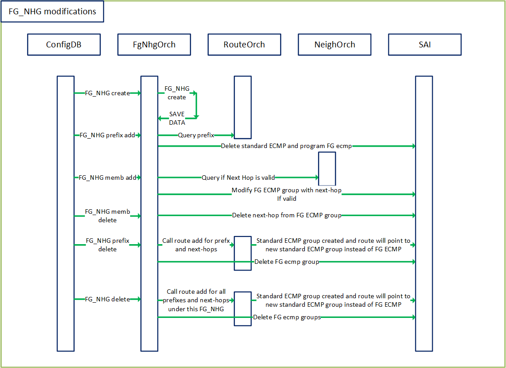
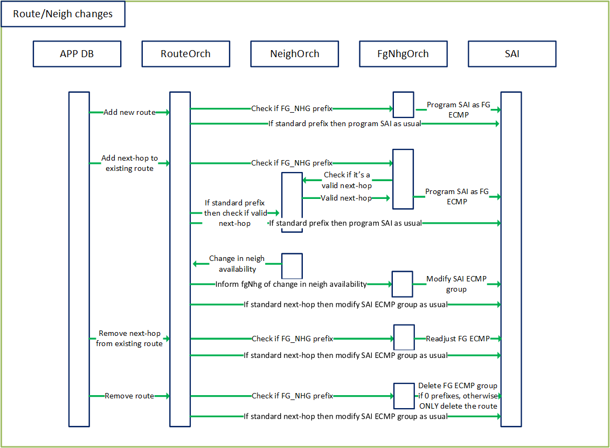

# SONiC Fine Grained ECMP 
# High Level Design Document
### Rev 0.1

# Table of Contents
  * [List of Tables](#list-of-tables)

  * [Revision](#revision)

  * [About this Manual](#about-this-manual)

  * [Scope](#scope)

  * [Definitions/Abbreviation](#definitionsabbreviation)
 
  * [1 Requirements Overview](#1-requirements-overview)
    * [1.1 Functional requirements](#11-functional-requirements)
    * [1.2 Orchagent requirement](#12-orchagent-requirements)
    * [1.3 CLI requirements](#13-cli-requirements)
    * [1.4 Scalability requirements](#14-scalability-requirements)
    * [1.5 Warm Restart requirements ](#15-warm-restart-requirements)
  * [2 Modules Design](#2-modules-design)
    * [2.1 Config DB](#21-config-db)
    * [2.1 CLI](#22-cli)
    * [2.3 Orchestration Agent](#23-orchestration-agent)
    * [2.4 SAI](#24-sai)
  * [3 Flows](#3-flows)
  * [4 Example configuration](#4-example-configuration)

###### Revision
| Rev |     Date    |       Author       | Change Description                |
|:---:|:-----------:|:------------------:|-----------------------------------|
| 0.1 | 04/24/2020  |    Anish Narsian   | Initial version                   |


# About this Manual
This document provides the high level design for the Fine Grained ECMP feature implementation in SONiC
Associated SAI proposal: https://github.com/opencomputeproject/SAI/blob/master/doc/ECMP/Ordered_and_Fine_Grained_ECMP.md
# Scope
This document describes the high level design of the Fine Grained ECMP feature as implemented in the application layer. 
- In-scope: Modifying the behavior of ECMP to achieve fine grained handling of ECMP for dynamic routing and neighbor changes
- Out of scope: Fine grained ECMP can be used to achieve generic consistent hashing, and dynamically enabling consistent hashing for a router is beyond scope of this feature.

# Definitions/Abbreviation
###### Table 1: Abbreviations
|                          |                                |
|--------------------------|--------------------------------|
| ECMP                     | Equal Cost MultiPath           |
| FG                       | Fine Grained                   |
| NHG                      | Next Hop Group                 |


# 1 Requirements Overview
## 1.1 Functional requirements
This section describes the SONiC requirements for Fine Grained ECMP next-hop groups 

At a high level the following should be supported:

Phase #1
- Should be able to configure a Fine Grained ECMP group which defines a static means of redistribution of ECMP upon next-hop modifications based upon the fine grained ECMP SAI proposal
- Hooked into the routeorch to function with standard route modifications via routing applications, such that any route changes involving prefixes with defined Fine grained ECMP has special ECMP behavior
- Ability to enable consistent hashing via Fine grained ECMP for a statically defined ECMP group
- Ability to specify a group(bank) in which ECMP redistribution should be performed out of a set of available next-hops
- Warm restart support(TBD)

Phase #2
- CLI commands to configure Fine Grained ECMP
- Other potential ways to do traffic shaping such as assigning x% of traffic to specified next-hops via Fine Grained ECMP


## 1.2 Orchagent requirements
### FgNhg orchagent:
 - Should be able to create Fine Grained Next-hop groups
 - Should be able to control ECMP for a prefix in the special way as defined in next-hop group definitions
 - Should continue to be compatible with existing routeorch functionality

### Route orchagent:
 - Should be able to redirect route and next-hop modifications to fgNhg orchagent for prefixes which have a Fine Grained definition
 
## 1.3 CLI requirements
- User should be able to add/delete/view Fine Grained Next-hop groups
- User should be able to view the configured state of fine grained groups

## 1.4 Scalability requirements

### 1.4.1 Fine Grained Next-hop group
###### Table 2: Scalability
| Component                | Expected value              |
|--------------------------|-----------------------------|
| Size of hash bucket      | HW specific(can be 4k)      |
| Number of FG ECMP groups | 128                         |


## 1.5 Warm Restart requirements
Warm restart is planned for Phase #1, implementation details to follow.  

# 2 Modules Design

## 2.1 Config DB
Following new tables will be added to Config DB. Unless otherwise stated, the attributes are mandatory.
```
FG_NHG|{{fg-nhg-group-name}}:
    "bucket_size": {{hash_bucket_size}}

FG_NHG_PREFIX|{{IPv4 OR IPv6 address}}:
    "FG_NHG":{{fg-nhg-group-name}}

FG_NHG_MEMBER|{{next-hop-ip(IPv4 or IPv6)}}:
    "FG_NHG":{{fg-nhg-group-name}}
    "Bank": {{an index which specifies a bank/group in which the redistribution is performed}} 
```


### 2.1.3 ConfigDB Schemas
```
; Defines schema for FG NHG configuration attributes
key                                   = FG_NHG:fg-nhg-group-name      ; FG_NHG group name
; field                               = value
BUCKET_SIZE                           = hash_bucket_size              ; total hash bucket size desired, recommended value of Lowest Common Multiple of 1..{max # of next-hops}
		  
```

```
; Defines schema for FG NHG prefix configuration attributes
key                                   = FG_NHG_PREFIX|{{IPv4 OR IPv6 prefix}} ; FG_NHG_PREFIX for which FG behavior is desired
; field                               = value
FG_NHG                                = fg-nhg-group-name                     ; Fine Grained next-hop group name
```

```
; Defines schema for FG NHG member configuration attributes
key                                   = FG_NHG_MEMBER|{{next-hop-ip(IPv4 or IPv6 address)}}    ; FG_NHG next-hop-ip member associated with prefix
; field                               = value
FG_NHG                                = fg-nhg-group-name                                      ; Fine Grained next-hop group name
BANK                                  = DIGITS                                                 ; An index which specifies a bank/group in which the redistribution is performed
```

Please refer to the [schema](https://github.com/Azure/sonic-swss/blob/master/doc/swss-schema.md) document for details on value annotations. 

## 2.2 CLI

Commands summary (Phase #2):
CLI commands:
```
	config fg nhg <add/del> <fg-nhg-group-name> type <static/dynamic> size <hash_bucket_size>
	config fg nhg prefix <add/del> <fg-nhg-group-name> <prefix>
	config fg nhg member <add/del> <fg-nhg-group-name>  <next-hop-ip>
	show fg nhg group <fg-nhg-group-name/all>
	show fg nhg hash-view <fg-nhg-group-name> (shows the current hash bucket view of fg nhg)
	show fg nhg active_hops <fg-nhg-group-name> (shows which set of next-hops are active) 
```


## 2.3 Orchestration Agent
Following orchagents shall be modified. Flow diagrams are captured in a later section. 
- routeorch
- fgnhgorch

 ### routeorch
 This is the swss orchetrator responsible for pushing routes down to the ASIC. It can create ECMP groups in the ASIC for cases where there are multiple next-hops. It can also add/remove next-hop members as neighbor availability changes(link up and down scnearios)
 	
 ### fgnhgorch
 This is the swss orchestrator which receives FG_NHG entries and identifies the exact way in which the hash buckets need to be created and assigned at the time of BGP route modifications. For BGP route modifications/next-hop changes, fgnhgorch gets evoked by routeorch.
 

 
The overall data flow diagram is capturedin Section 3 for all TABLE updates. 

 
 
## 2.4 SAI
The below table represents main SAI attributes which shall be used for Fine Grained ECMP


###### Table 3: Fine Grained ECMP SAI attributes
| FG_NHG component         | SAI attribute                                         |
|--------------------------|-------------------------------------------------------|
| Fine Grained ECMP type   | SAI_NEXT_HOP_GROUP_TYPE_FINE_GRAIN_ECMP               |
| Length of ECMP group     | SAI_NEXT_HOP_GROUP_ATTR_CONFIGURED_SIZE               |
| Next-hop ids             | SAI_NEXT_HOP_GROUP_MEMBER_ATTR_NEXT_HOP_ID            |
| Specify nh index         | SAI_NEXT_HOP_GROUP_MEMBER_ATTR_INDEX                  |


# 3 Flows




# 4 Example configuration

### Loadbalanced VMs with multiple NICs
6 VMs where each set of 3 VMs form a group which share state, advertising VIP 10.10.10.10:
- VM set 1 next-hops: 1.1.1.1, 1.1.1.2, 1.1.1.3
- VM set 2 next-hops: 1.1.1.4, 1.1.1.5,	1.1.1.6	

### ConfigDB objects:
```
{
	"FG_NHG": {
		"2-VM-Sets": {
			"hash_bucket_size": 12
		}
	},
	"FG_NHG_PREFIX": {
		"10.10.10.10/32": {
			"FG_NHG": "2-VM-Sets"
		}
	},
	"FG_NHG_MEMBER": {
		"1.1.1.1": {
			"FG_NHG": "2-VM-Sets",
			"Bank": 0
		},
		"1.1.1.2": {
			"FG_NHG": "2-VM-Sets",
			"Bank": 0
		},
		"1.1.1.3": {
			"FG_NHG": "2-VM-Sets",
			"Bank": 0
		},
		"1.1.1.4": {
			"FG_NHG": "2-VM-Sets",
			"Bank": 1
		},
		"1.1.1.5": {
			"FG_NHG": "2-VM-Sets",
			"Bank": 1
		},
		"1.1.1.6": {
			"FG_NHG": "2-VM-Sets",
			"Bank": 1
		}
	}
}
```

### Sample scenario which highlights redistribution performed by fgNhgOrch during runtime scenarios:


