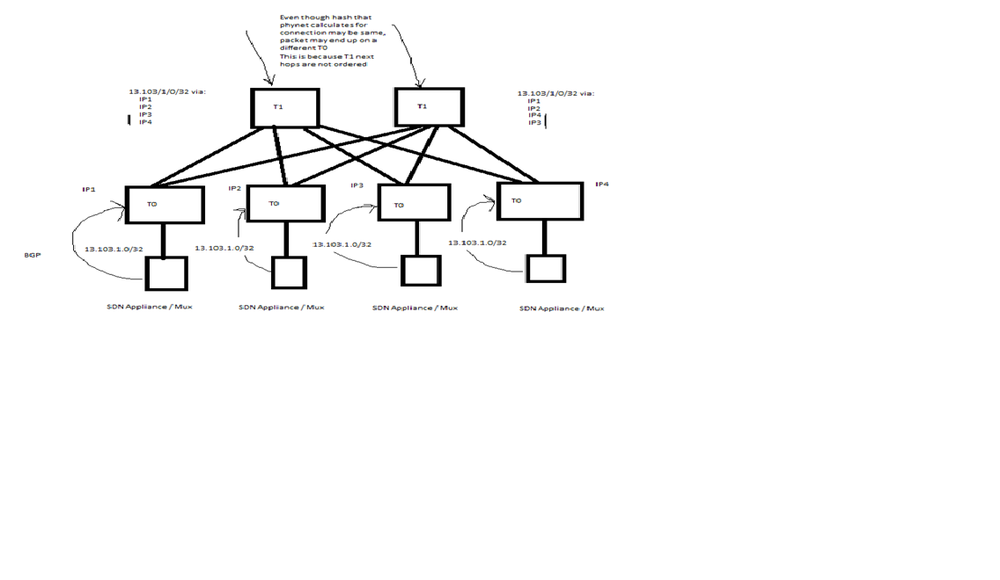

# SONiC Ordered ECMP Design
# High Level Design Document
### Rev 0.1

# Table of Contents
  * [List of Tables](#list-of-tables)

  * [Revision](#revision)

  * [About this Manual](#about-this-manual)

  * [Scope](#scope)

  * [Use case](#use-case)

  * [Definitions/Abbreviation](#definitionsabbreviation)
 
  * [1 Requirements Overview](#1-requirements-overview)
    * [1.1 Use Case](#11-use-case)
    * [1.2 Acheiving Order Nexthop member in ECMP](#12-acheiving-order-nexthop-memeber-in-ecmp)
    * [1.3 Functional requirements](#13-functional-requirements)
  * [2 Modules Design](#2-modules-design)
    * [2.1 App DB](#21-app-db)
    * [2.2 Orchestration Agent](#24-orchestration-agent)
    * [2.3 Backward Compatibility](#25-backward-compatibility)
  * [3 Test Plan](#3-test-plan)

###### Revision
| Rev |     Date    |       Author       | Change Description                |
|:---:|:-----------:|:------------------:|-----------------------------------|
| 0.1 | 11/05/2021  |    Abhishek Dosi   | Initial version                   |
| 0.2 | 12/09/2021  |    Abhishek Dosi   | Address SONiC Community Feedback  |

# About this Manual
This document talks about use-case to support ECMP with Ordered Nexthop and changes needed in SONiC to support same.

# Definitions/Abbreviation
###### Table 1: Abbreviations
| Abbreviation             | Meaning                        |
|--------------------------|--------------------------------|
| ECMP                     | Equal Cost MultiPath           |

# 1 Requirements Overview
## 1.1 Use case
Under the ToR (Tier0 device) there can be appliances (eg:Firewall/Software-Load Balancer) which maintain state of flows running through them. For better scaling/high-availaibility/fault-tolerance
set of appliances are used and connected to differnt ToR's. Not all the flow state that are maintained by these appliances in a set are shared between them. Thus with flow state not being sync 
if the flow do not end up alawys on to same TOR/Appliance it can cause services (using that flow) degradation and also impact it's availability

To make sure given flow (identidied by 5 tuple) always end up on to same TOR/Appliance we need ECMP ordered support/feature on T1 (Leaf Router). 
With this feature enable even if flow land's on different T1's (which is common to happen as some link/device in the flow path goes/come to/from maintainence)
ECMP memeber being ordered will use same nexthop (T0) and thus same appliace.

Below diagram captures the use-case (Traffic is flowing from T1 <-> T0 <-> Appliance)

## 1.2 Acheiving Order Nexthop member in ECMP
1. Nexthop's will be sorted based on their IP address to get their order within the ECMP group. 
In typical data-center ip address allocation scheme all T1’s in a given podset/cluster have the same order for P2P v4/v6 IP Address for all downstream T0's.
2. This feature/enhacement assumes entropy calculation will be same for a given flow on each devices that have set set of nexthop in the ECMP Group.
3. This feature/enhancement is best effort in nature where if the Links/Bgp between pair of devices are not in same state (either Up/Down) then flow can take different path.

## 1.3 Functional requirements
This section describes the SONiC requirements for Ordered ECMP Nexthop 

At a high level the following should be supported:

Phase #1
- Program ECMP memebers (nexthops) in ordered way. Above use case is for ECMP Group on T1 with nexthop memebers as T0 but requirement is generic for any ECMP Group/Tier
- Knob to enable/disable the order ecmp nexthop
- Maintain Backward Compatible if given SAI Vendor can not support ordered ecmp
- Should work with Overlay ECMP.
- Handling linkdown/linkup scenarios which triggers nexthop withdrawal/addition to nexthop group.

Phase #2 (Not commited as of now)
- Init time knob to configure key/parameter to use for creating ordered nexthop (default being nexthop ip address)
- Warm restart support (if/when enable on T0)
- Config DB based knob to enable/disable order ecmp feature. This might need system reboot
- Nexthop Group OA

# 2 Modules Design

## 2.1 APP DB
The following are the changes for Switch table
```
New field "orded_ecmp_group" is added.

SWITCH_TABLE:switch
    "ecmp_hash_seed": {{ecmp_hash_seed}}
     ....
    "order_ecmp_group": {{bool}} (false being default)

```

## 2.2 Orchestration Agent
Following orchagents shall be modified.
- switchorch
- routeorch
- overlayecmporch

### SwitchOrch

1. Switch Orch read the APP_DB Switch Table new field "order_ecmp_group" and enable/disable the feature by setting the global flag.
2. The field will be added to switch.json.j2 and will be rendered based on Device role and asic_type. Default value being false.

### RouteOrch
1. By default, Route OA insert all the Nexthops in sorted order into Nexthop-Group set. Sorting is based nexthop-key tuple with ip address as being the first element.
   Thus all the elements in Nexthop Group set are already sorted on IP Address. For Phase#2 init time option will be added to control the key to use for sorting nexthop-group set.

2. When Route OA create Nexthop-Group and add Nexthop as member to the group following changes will be done:-
   - ECMP Group will be created with SAI attribute SAI_NEXT_HOP_GROUP_TYPE_DYNAMIC_ORDERED_ECMP
   - When nexthop is added to the group SAI attribute SAI_NEXT_HOP_GROUP_MEMBER_ATTR_SEQUENCE_ID will be used. Passing the sequence id enforces SAI 
     to program all the members as per application passed order.
   - The Sequence Id will be traversal index of nexthop in nexthop group set. We will save this map {nexthop:sequence_id} in the local data structure

3. When Route OA add/remove member to the Nexthop Group for eg: in case of ECMP HW Acceleration (for link up/down handling) following changes will be done:-
    - For remove case no change is needed. SAI should retain the order of all the members still present after the removal of member
    - For add case SAI_NEXT_HOP_GROUP_MEMBER_ATTR_SEQUENCE_ID will be used with value being passed from the new map {nexthop:sequence_id} created above.

4. When Route OA delete Nexthop group member and removes Nexthop-Group no change is needed. Current flow should work.

### OverlayECMP Orch
Above point discussed for Route OA (w.r.t Single Level Underlay ECMP) applies and will be done for Overlay ECMP Route OA also. 
Overlay ECMP Route OA will make sure nexthop will be added into nexthop group set with sorted on the Tunnel Endpoint IP Address. 
SAI API changes for Overlay ECMP also will be same as Route OA.

## 2.3 Backward Compatibility
To maintain backward compatibility this feature will only be functionally enabled (even if config wise enable in APP_DB SWITCH_TABLE) 
if SAI enum capability query support for SAI_NEXTHOP_GROUP object for attribute SAI_NEXT_HOP_GROUP_ATTR_TYPE return “DYNAMIC_ORDERED_ECMP” as supported. 
Otherwise, we will mark the feature as disable (control by global flag) and fall back to existing Unordered ECMP group behavior.

# 3 Test Plan
The following testing is planned for this feature:
- SWSS unit tests via virtual switch testing
- Data Plane tests via pytest + PTF

## SWSS unit tests via virtual switch testing
Test details(Applies to all Route/OverlayECMP/NexthopGroup OA):
- Verify ASIC DB has correct sequence id for all nexthops when creating Nexthop Group. 
- Verify ASIC DB has correct sequence id for all nexthops when removing Nexthop Group. 
- Verify ASIC DB has correct sequence id for nexthop member add/removal from the Group. 

## Data Plane community tests via pytest + PTF
A new Pytest and PTF test will be created for Ordered ECMP testing. The Pytest is responsible for creating/deploying the device configuration, and will invoke PTF test to run the data plane scenario test

Test details:
- To verify flow is load-balance as per the next-hop sequence in ecmp group for add/remove/add-memeber/remove-memeber case.
- Preserve the test result { flow to nexthop-mapping } so that in case entropy is changed across SONiC/SAI release we can catch/notify about it.
