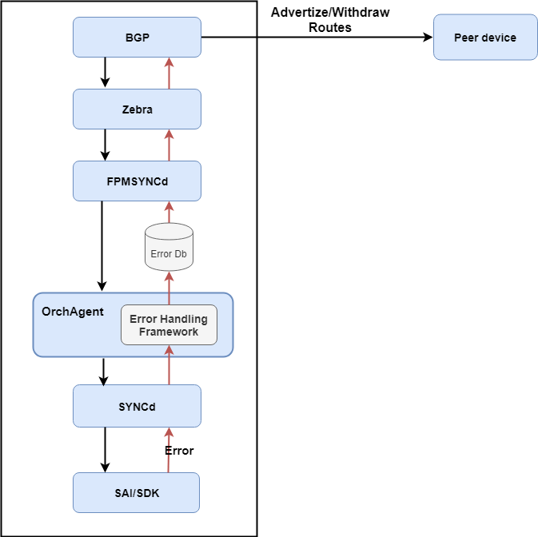
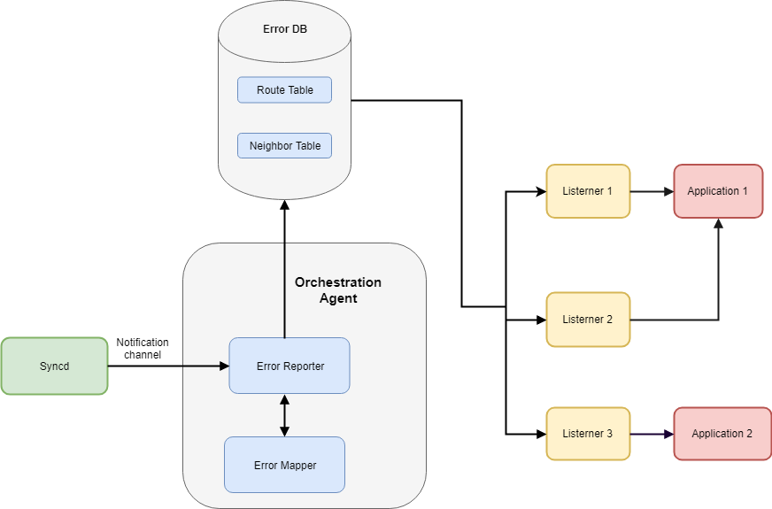
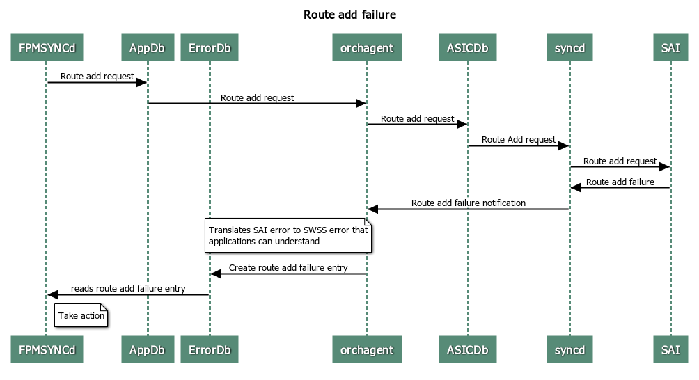

# Error Handling Framework in SONiC
# High Level Design Document
#### Rev 0.1

# Table of Contents
  * [Revision](#revision)
  * [About this Manual](#about-this-manual)
  * [Scope](#scope)
  * [Overview](#overview)
  * [Definitions/Abbreviation](#definitionsabbreviation)
  * [1 Requirements Overview](#1-requirements-overview)
    * [1.1 Functional Requirements](#11-functional-requirements)
    * [1.2 Configuration and Management Requirements ](#12-Configuration-and-Management-Requirements)
    * [1.3 Supported Objects](#13-Supported-Objects)
  * [2 Use cases](#2-Use-cases)
  * [3 Design](#3-Design)
    * [3.1 Error Database](#31-Error-Database)
    * [3.2 Error codes](#32-Error-codes)
    * [3.3 OrchAgent Changes](#33-OrchAgent-changes)
      * [3.3.1 Event processing](#331-Event-Processing)
      * [3.3.2 Application registration](#332-Application-Registration)
      * [3.3.3 Clearing ERROR_DB](#333-Clearing-ERROR-DB)
    * [3.4 DB changes](#34-DB-Changes)
      * [3.4.1 Config DB](#341-Config-DB)
      * [3.4.2 App DB](#342-App-DB)
      * [3.4.3 Error DB](#343-Error-DB)
        * [3.4.3.1 Error Tables](#3431-Error-Tables)
        * [3.4.3.2 Error DB Schemas](#3432-Error-DB-Schemas)
    * [3.5 CLI](#35-CLI)
      * [3.5.1 Data Models](#351-Data-Models)
      * [3.5.2 Config commands](#352-Config-commands)
      * [3.5.3 Show commands](#353-Show-commands)
      * [3.5.4 Clear commands](#354-Clear-commands)
  * [4 Flow Diagrams](#4-Flows-diagrams)
    * [4.1 Route Add Failure](#41-Route-Add-Failure)
  * [5 Serviceability and Debug](#5-Serviceability-and-Debug)
  * [6 Warm Boot Support](#6-Warm-Boot-Support)
  * [7 Scalability](#7-Scalability)
  * [8 Unit Tests](#8-Unit-Tests)
  * [9 Unsupported features](#9-Unsupported-features)

# Revision

| Rev |     Date    |       Author       | Change Description          |
|:---:|:-----------:|:-------------------------|:----------------------|
| 0.1 |  05/6/2019  | Siva Mukka, Santosh Doke | Initial version       |


# About this Manual
This document describes the design details of error handling framework in SONiC. The framework is responsible for notifying ASIC/SAI programming failures back to applications. It can also be extended to notify other failures in the system.

# Scope
This document describes the high level design details of error handling framework in SONiC.

# Overview
SONIC currently does not have a mechanism to propagate ASIC/SAI programming errors back to application. If the SAI CREATE/SET method fails:

- Syncd treats all such failures as fatal irrespective of reason code.
- Syncd sends a switch shutdown request to Orchestration Agent.
- Syncd waits indefinitely to restart, switch is no longer manageable/operational.

To address this, a generic framework is introduced to notify errors, instead of sending shutdown request to OrchAgent.

# Definitions/Abbreviation
###### Table 1: Abbreviations
| Abbreviation | Description                                                  |
| ------------ | ------------------------------------------------------------ |
| SAI          | Switch Abstraction Interface                                 |
| APP DB       | Application Database                                         |
| ASIC DB      | ASIC Database                                                |
| ERROR DB     | Error Database                                               |
| SWSS         | Switch State Service                                         |
| Syncd        | Daemon responsible for invoking SAI functions based on ASIC DB updates |

In this document, the term '**object**' refers to an entry in the table OR a specific attribute in the table.

# 1 Requirements Overview
## 1.1 Functional Requirements

The requirements for error handling framework are:

1.1.1 Provide registration/de-registration mechanism for applications to enable/disable error notifications on a specific table. More than one application can register for notifications on a given table.

1.1.2 Provide notifications for failed objects and also for the objects that were successfully installed. By default, only failed operations are notified. A configuration parameter to enable notifications for objects that are processed without error.

1.1.3 Provide support to get all the failed objects at any given instance.

1.1.4 Provide error notifications for CREATE/DELETE/UPDATE operations on objects. Framework does not report errors for GET operation.

1.1.5 Provide all the required key fields as part of notifications so that applications can map the error to an object. For example, framework provides subnet/length/nexthop fields as part of failed route notification along with operation and actual error code.

1.1.6 Provide error codes to application when reporting failures. Framework defines various error codes and maps them to underlying SAI/ASIC errors. For example, TABLE_FULL, NOT_FOUND and OUT_OF_MEMORY.

1.1.7 In some cases, a given object may fail multiple times. The framework reports each failure as a separate notification, but retains the last-known error on that object. For example, a route modify operation may fail multiple times with different set of next hops, in which case multiple failure notifications are reported for that route entry.

1.1.8 Provide configuration commands to clear the failed objects.

1.1.9 Framework is only responsible for reporting errors. Any retry/rollback operation is the responsibility of applications.

## 1.2 Configuration and Management Requirements
Provide CLI commands to display and clear ERROR_DB tables.

## 1.3 Supported objects
Error handling framework supports notifications for the following tables defined in APP_DB:

- ROUTE_TABLE
- NEIGH_TABLE

The framework can be extended for other tables depending on application requirements. Currently, only ROUTE/NEIGH tables are supported to address the BGP use case.

# 2 Use cases

BGP application relies on RIB failure status to withdraw or advertise the routes. The error handling framework notifies the BGP application about route programming failures. This helps BGP application to withdraw the failed routes that are advertised to the neighbors.

Following diagram describes a high level overview of the BGP use case:



# 3 Design

## 3.1 Error Database

As SONIC architecture relies on the use of centralized Redis-database as means of multi-process communication among all subsystems, the framework re-uses the same mechanism to notify errors back to applications.

A new database, ERROR_DB, is introduced to store the details of failed entries/objects corresponding to various tables. The ERROR_DB tables are defined in application friendly format. Applications can register as consumer of ERROR_DB table to receive error notifications, whereas OrchAgent is registered as producer of ERROR_DB table. If the SAI CREATE/SET method fails, Syncd informs OrchAgent using the notification channel of ASIC_DB. OrchAgent is responsible to translate the ASIC_DB notification and store it in ERROR_DB format. It is also responsible to map the SAI specific error codes to SWSS error codes.

For some objects, a notification may be needed even when the object is successfully programmed (SAI API reports SUCCESS). In such scenarios, the framework does not store the object in ERROR_DB (to reduce memory usage), but does notify the registered applications using ERROR_DB notification channel.

Defining a separate error database has the following advantages over extending existing APP_DB tables for error notifications:

- Applications do not register as consumer & producer for same table, which avoids redundant notifications.
- Flexible, not tied to any other table format.
- Extensible to all types of errors in the system, not restricted to APP_DB definitions.
- Efficient, as notifications are limited to failures in the DB.
- Notification for delete failures can be supported even when corresponding objects are deleted from APP_DB.

## 3.2 Error codes
As per SONIC architecture, applications do not invoke SAI APIs directly and they are not aware of underlying SAI error codes. A new set of generic error codes are defined for applications, which are internally mapped to underlying SAI error codes.

As SWSS submodule already provides a common library accessible to all SONIC applications, a new set of common error codes are defined as part of this library (applications need not include any new header files). The following table shows the mapping of SWSS error codes to SAI error codes.

| SWSS error code       | SAI error code                 |
|-----------------------|--------------------------------|
| SWSS_RC_SUCCESS       | SAI_STATUS_SUCCESS             |
| SWSS_RC_INVALID_PARAM | SAI_STATUS_INVALID_PARAMETER   |
| SWSS_RC_UNAVAIL       | SAI_STATUS_NOT_SUPPORTED       |
| SWSS_RC_NOT_FOUND     | SAI_STATUS_ITEM_NOT_FOUND      |
| SWSS_RC_NO_MEMORY     | SAI_STATUS_NO_MEMORY           |
| SWSS_RC_EXISTS        | SAI_STATUS_ITEM_ALREADY_EXISTS |
| SWSS_RC_FULL          | SAI_STATUS_TABLE_FULL          |
| SWSS_RC_IN_USE        | SAI_STATUS_OBJECT_IN_USE       |

## 3.3 OrchAgent changes

OrchAgent is the only component responsible for adding/modifying/deleting objects in ERROR_DB database. Since the error handling framework is part of the orchestration agent, the error notifications are reported only when orchestration agent is running.

OrchAgent defines the following new classes to handle error reporting/listening:

1. **Error reporter class** - defines functions to write to ERROR_DB and publish the notifications.
2. **Error listener class** - defines functions to register/de-register for notifications on a specific table. Applications need to specify the table name, operation such CREATE/DELETE/UPDATE, notification type (success/failure/both)  and callback function when instantiating the error listener class. Applications can instantiate multiple listeners to receive notifications from different tables.

### 3.3.1 Event processing

Below diagram shows how framework reports notifications to the registered listeners:



The following is the sequence of events involved in reporting a failure notification from Syncd process to application:

1. Syncd reports errors using a single notification channel to OrchAgent. Using a single notification channel ensures that order of the notifications is retained.
2. After receiving the notification from Syncd, OrchAgent:
   - Translates it from SAI data types to ERROR_DB data types
   - Adds an entry in to error database. If the entry already exists, the corresponding failure code is updated.
   - Publishes the notifications to respective error listeners.
3. Error listener waits for the incoming notifications, filters them and invokes the application callback.


The following is the sequence of events involved in reporting successful programming of an entry from Syncd process to application:

1. Syncd reports the successful programming of an entry to OrchAgent using a notification channel.

2. After receiving the notification from Syncd, OrchAgent:

   - Translates it from SAI data types to ERROR_DB data types.

   - Removes the entry from database. if present.
   - Publishes the notifications to respective error listeners.

3. Error listener waits for the incoming notifications, filters them and invokes the application callback.


The following table describes how framework handles some of the notifications:

| Previous Notification | Current Notification | Framework Action                                             |
| --------------------- | -------------------- | ------------------------------------------------------------ |
| Create failure        | Update failure       | Update the entry in the database and notify the registered applications |
| Create failure        | Delete failure       | Remove the entry from database and notify the registered applications |
| Create failure        | Update success       | Remove the entry from the database and notify the registered applications |
| Create success        | Delete failure       | Add the entry to the database and notify the registered applications |
| Delete failure        | Create success       | Remove the entry from the database and notify the registered applications |

### 3.3.2 Application registration
```
ErrorListener fpmErrorListener(APP_ROUTE_TABLE_NAME, (ERR_NOTIFY_FAIL | ERR_NOTIFY_POSITIVE_ACK));

Select s;
s.addSelectable(&fpmErrorListener);
```

### 3.3.3 Clearing ERROR_DB
ERROR_DB contents can be cleared using CLI command. The clear command can be invoked for all objects in a table or all tables. OrchAgent gets notified about clear operation via the notification channel and it deletes the corresponding objects from ERROR_DB without notifying the registered applications.

## 3.4 DB Changes
### 3.4.1 Config DB
None.

### 3.4.2 App DB
None.

### 3.4.3 Error DB

#### 3.4.3.1 ERROR Tables

```
ERROR_ROUTE_TABLE|prefix
    "opcode": {{method}}
    "nexthop": {{list_of_nexthops}}
    "intf": ifindex ? PORT_TABLE.key
    "status": {{return_code}}
```

```
ERROR_NEIGH_TABLE|INTF_TABLE.name/ VLAN_INTF_TABLE.name / LAG_INTF_TABLE.name|prefix
    "opcode": {{method}}
    "neigh": {{mac_address}}
    "family": {{ip_address_family}}
    "status": {{return_code}}
```

### 3.4.3.2 ERROR_DB Schemas

```
;Defines schema for ERROR_ROUTE_TABLE that stores error status while programming the routes
;Status: Mandatory
key                = ERROR_ROUTE_TABLE|prefix
; field            = value
operation          = opcode         ; method CREATE/SET/DELETE
nexthop            = *prefix,       ; IP addresses separated by “,”
intf               = ifindex,       ; zero or more separated by ","
rc                 = SWSS Code      ; status code
```

```
;Defines schema for ERROR_NEIGH_TABLE that stores error status while programming the neighbor table entries
;Status: Mandatory
key                = ERROR_NEIGH_TABLE|INTF_TABLE.name / VLAN_INTF_TABLE.name / LAG_INTF_TABLE.name|prefix
operation          = opcode           ; method CREATE/SET/DELETE
neigh              = 12HEXDIG         ; mac address of the neighbor
family             = "IPv4" / "IPv6"  ; address family
rc                 = SWSS code        ; status code for each neighbour
```

Please refer to the [schema](https://github.com/sonic-net/sonic-swss/blob/master/doc/swss-schema.md) document for details on value annotations.


## 3.5 CLI

### 3.5.1 Data Models

Commands summary :

	- show error-database [TableName]
	- sonic-clear error-database [TableName]

### 3.5.2 Config commands
None

### 3.5.3 Show commands
show command to display the error database entries

```
show error-database [TableName]

Usage: show [OPTIONS] COMMAND [ARGS]...

  SONiC command line - 'show' command

Options:

  -?, -h, --help  Show this message and exit.

Commands:

  error-database      Show error database entries

```

Example:
```
Router#show error-database route
Route            Nexthop               Operation  Failure
--------------   --------------------- ---------  --------------
2.2.2.0/24       10.10.10.2            Create     TABLE FULL
192.168.10.12/24 12.12.10.2,11,11,11,2 Update     PARAM
...
```

### 3.5.4 Clear commands
Clear command to clear error database entries
```
sonic-clear error-database [TableName]

Usage: sonic-clear [OPTIONS] COMMAND [ARGS]...

Options:

  -?, -h, --help  Show this message and exit.

Commands:

  error-database      Clear error database entries

```


# 4 Flows Diagrams

## 4.1 Route add failure
The following flow diagram depicts the flow of route failure notification.




Syncd sends the following data to the framework through a notification channel as part of the error notification.


```
key:"SAI_OBJECT_TYPE_ROUTE_ENTRY:{"dest":"20.20.20.0/24","vr":"oid:0x300000000004a"}"

1) "opcode"
2) "CREATE"
3) "SAI_ROUTE_ENTRY_ATTR_NEXT_HOP_ID"
4) "oid:0x1000000000001"
5) "rc"
6) "SAI_STATUS_TABLE_FULL"
```

The framework records the following entry into ERROR_ROUTE_TABLE, which gets notified to the registered applications.

```
"ERROR_ROUTE_TABLE:20.20.20.0/24"
1) "opcode"
2) "CREATE"
3) "nexthop"
4) "10.10.10.2"
5) "intf"
6) "Vlan10"
7) "rc"
8) "SWSS_RC_TABLE_FULL"
```

# 5 Serviceability and Debug

The logging utility `swssloglevel` is used to set the log level for various operations involved in error handling.

- When application registers/de-registers for notifications on ERROR_DB
- When framework notifies errors to applications
- When framework receives error notifications from Syncd
- When framework adds entry to ERROR_DB
- When frame deletes entry from ERROR_DB
- When framework receives 'clear' command


# 6 Warm Boot Support
 The error database is not persistent across warm reboots.

# 7 Scalability

None.

# 8 Unit Tests

The unit test plan for error handling framework is documented below:

| Error Handling | S.No | Test description                                             |
| -------------- | ---- | ------------------------------------------------------------ |
| Route Table    | 1.1  | Verify application can register successfully for ROUTE table notifications. Generate failure event and verify application is notified |
|                | 1.2  | Verify application can de-register successfully for ROUTE table notifications. Generate failure event and verify application is NO LONGER notified. |
|                | 1.3  | Verify multiple applications registering for ROUTE table notifications. Generate failure event and verify all registered applications are notified. |
|                | 1.4  | Verify multiple applications de-register for ROUTE table notifications. Generate failure event and verify only de-registered application is NO LONGER notified. Other registered applications continue to get notified. |
|                | 1.5  | Verify that the notification for IPv4/IPv6 ROUTE entry contains all the required parameters as defined by the schema - Prefix/Nexthops/Opcode/Failure code. |
|                | 1.6  | Verify error is notified incase of IPv4/IPv6 ROUTE add failure due to TABLE full condition. Verify entry exists in ERROR_DB for failed route with Opcode=Add and Error=Table Full. |
|                | 1.7  | Verify error is notified incase of IPv4/IPv6 ROUTE add failure due to ENTRY_EXISTS condition. Verify entry exists in ERROR_DB for failed route with Opcode=Add and Error=Entry Exists. |
|                | 1.8  | Verify application is notified even in case of IPv4/IPv6 ROUTE is successfully programmed (NO_ERROR). Verify that there is NO entry for the route in ERROR_DB. |
|                | 1.9  | Verify error is notified in case of IPv4/IPv6 ROUTE deletion failure due to NOT_FOUND. Verify that there is NO entry for the failed route in ERROR_DB. |
|                | 1.10 | Verify that the failed IPv4/IPv6 ROUTE entry in ERROR_DB is cleared, when application deletes that entry. Verify other failed entries in ERROR_DB are retained. |
|                | 1.11 | Verify multiple add failures on the ECMP IPv4/IPv6 ROUTE entry. Verify each failure is notified individually along with set of nexthops. Verify ERROR_DB entry reflects the last known failure status. |
| Neighbor Table | 2.1  | Verify application can register successfully for Neighbor table notifications. Generate failure event and verify application is notified. |
|                | 2.2  | Verify application can de-register successfully for Neighbor table notifications. Generate failure event and verify application is NO LONGER notified. |
|                | 2.3  | Verify multiple applications registerting for Neighbor table notifications. Generate failure event and verify all registered applications are notified. |
|                | 2.4  | Verify multiple applications de-register for Neighbor table notifications. Generate failure event and verify only de-registered application is NO LONGER notified. Other registered applications continue to get notified. |
|                | 2.5  | Verify that the notification for IPv4/IPv6 Neighbor entry contains all the required parameters as defined by the schema -  Ifname/Prefix/Opcode/Failure code. |
|                | 2.6  | Verify error is notified incase of IPv4/IPv6 NEIGHBOR add failure due to TABLE full condition. Verify entry exists in ERROR_DB for failed neighbor with Opcode=Add and Error=Table Full. |
|                | 2.7  | Verify error is notified incase of IPv4/IPv6 NEIGHBOR add failure due to ENTRY_EXISTS condition. Verify entry exists in ERROR_DB for failed neighbor with Opcode=Add and Error=Entry Exists. |
|                | 2.8  | Verify application is notified even in case of IPv4/IPv6 NEIGHBOR is successfully programmed (NO_ERROR). Verify that there is NO entry for the neighbor in ERROR_DB in this case. |
|                | 2.9  | Verify error is notified in case of IPv4/IPv6 NEIGHBOR deletion failure due to NOT_FOUND. Verify that there is NO entry in ERROR_DB in this case. |
|                | 2.10 | Verify that the failed IPv4/IPv6 NEIGHBOR entry in ERROR_DB is cleared, when application deletes that entry. Verify other failed entries in ERROR_DB are retained. |
| CLI            | 3.1  | Verify that the 'show' command displays all the failed entries in the ERROR_DB. Verify that the output matches with redis-cli query command. |
|                | 3.2  | Verify that the 'clear' command removes all the failed entries in the ERROR_DB. Verify using redis-cli query command that there are no entries in ERROR_DB. |


# 9 Unsupported features

- Add transaction ID support to track the notifications back to application. This helps applications to correlate when multiple operations fail on the same object.

  Typically, the following steps are required to handle the request that includes transaction ID:

  - Application adds transaction ID (Tid) to APP_DB entry
  - OrchAgent pass Tid to ASIC_DB
  - Syncd includes Tid in the notification after invoking SAI API
  - OrchAgent pass the Tid to the applications that includes other error details.

  If Tid is included in the application request, framework includes the same in the notification. Otherwise, the notification is still sent, but without Tid. This enables migration of applications to start using Tid on a need basis.

- Extend error handling to other tables in the sytem (VLAN/LAG/Mirror/FDB etc).
