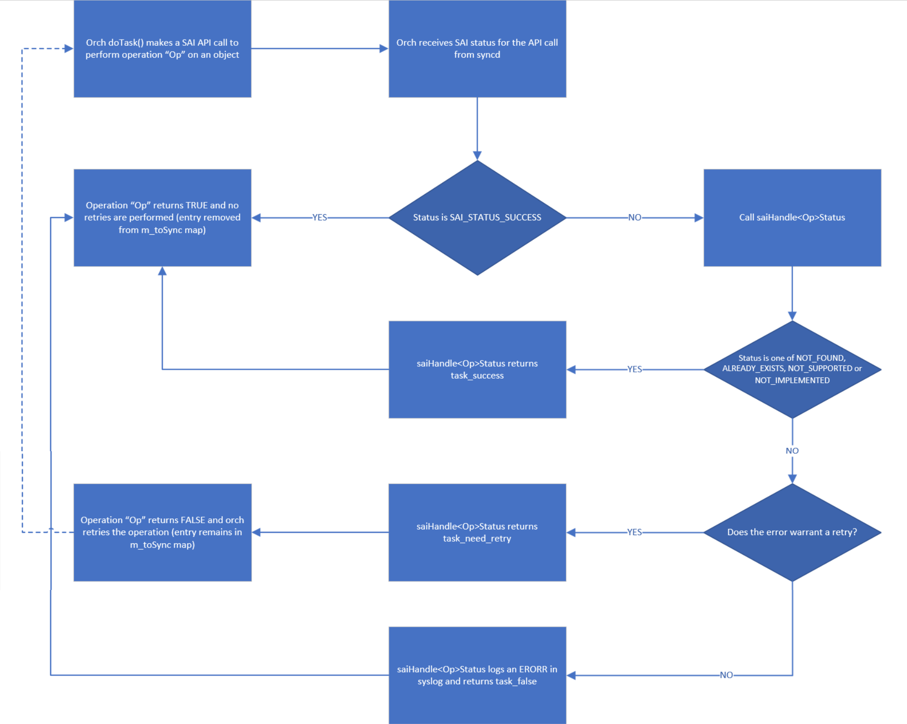

# Orchagent Error Handling Improvements #
## High Level Design Document
### Rev 0.1

# Table of Contents
  * [Revision](#revision)
  * [Scope](#scope)
  * [Definitions/Abbreviation](#definitionsabbreviations)
  * [Overview](#overview)
  * [Requirements](#requirements)
  * [Motivation](#motivation)
  * [Design](#high-level-design)
    * [Orchagent changes](#orchagent-changes)
      * [Avoid self-induced orchagent aborts in response to SAI errors](#1-avoid-self-induced-orchagent-aborts-in-response-to-sai-errors)
      * [Detect missed notifications from APP_DB to orchagent](#2-detect-missed-notifications-from-app_db-to-orchagent)
      * [Detect out-of-sync entries between APP_DB and ASIC_DB](#3-detect-out-of-sync-entries-between-app_db-and-asic_db)
  * [Warm Boot Support](#warmboot-and-fastboot-design-impact)
  * [Unit Tests](#unit-test-cases)
  * [System Tests](#system-test-cases)
  * [Unsupported features](#9-Unsupported-features)

### Revision

| Rev |     Date    |       Author       | Change Description          |
|:---:|:-----------:|:-------------------------|:----------------------|
| 0.1 |  03/6/2024  |   Prabhat Aravind  | Initial version             |

### Scope

This document describe the details of error handling changes in SONiC Orchestration Agent to improve orchagent resiliency and to gracefully handle ASIC/SAI programming failures without causing dataplane impact.

### Definitions/Abbreviations

This section covers the abbreviation if any, used in this high-level design document and its definitions.

|                          |                                          |
|--------------------------|------------------------------------------|
| Orchagent                | Orchestration Agent                      |
| SAI                      | Switch Abstraction Interface             |
| ASIC                     | Application Specific Integrated Circuit  |
| APP_DB                   | Application Database                     |
| ASIC_DB                  | ASIC Database                     |

### Overview

Orchagent is one of the most critical components in SONiC that is responsible for translating the data generated by applications into SAI objects that can be pushed down to the hardware via the southbound interface. As such, the reliability of this component is of great importance to the stability and availability of system running SONiC. Currently, most of the ASIC/SAI programming failures in SONiC result in a crash/restart of orchagent which can potentially cause dataplane impact and degraded customer experience. This is a legacy/day-1 behavior. The intent of this document is to come up with a solution where such errors are handled gracefully by orchagent without a crash or restart. Also being addressed as part of this are some improvements in detecting and mitigating some of the common orchagent issues which can potentially cause sever dataplane impact. These improvements are primarily in the flows #1, #2 and #6 referenced in the flow diagram below:

P.S: The diagram above is intended as a high-level overview of the components that are at play for redis based pub-sub architecture used in SONiC.

#### Goals

- Handle all SAI programming errors gracefully without causing orchagent to crash or restart
- Detect missed notifications from APP_DB to orchagent in SONiC systems that use redis-based communication channels
- Detect out-of-sync entries between APP_DB and ASIC_DB

#### Non-Goals

- SAI error handling in redis async mode
- Propagation of errors from orchagent to upper layers via mechanisms like ERROR_DB
- SDK/ASIC error handling

#### Motivation

Orchagent is of great significance in SONiC design primarily because of it being an intermediary between applications and the ASIC. Since orchagent crash brings down the dataplane, it does not make sense to let it crash for all failed SAI operations. This is a legacy behavior which is a simple and efficient way to recover a potentially degraded dataplane and start everything afresh but this has a big drawback of disrupting network traffic. Likewise, when certain APP_DB operations are not synced to ASIC-DB either due to missing dependencies, system resource unavailibility or missed notifications from APP_DB to orchagent, it is imperative to have mechanisms to detect such situations early. This design document attempts to address these shortcomings.

### Architecture Design

No change in SONiC architecture is intended with this orchagent error handling behavioral change.

### High-Level Design

This HLD discusses three potential ways in which orchagent behavior today can be improved:

1. Avoid self-induced orchagent aborts in response to SAI errors

    The most significant change in this proposal is to do away with self-induced orchagent crashes when a SAI API call fails (i.e, when the call returns anything other than SAI_STATUS_SUCCESS) as is the case for a large proportion of SAI errors handled today by different orchs that constitute orchagent.

    All existing SAI error statuses are planned to be gracefully handled by orchagent without causing it to exit. The orchagent error handling behavioral changes introduced here will be the standard behavior going forward on all SONiC platforms with no option to retain the existing behavior. All changes will be limited to orchagent inside the swss container and in standalone scripts that are run periodically using monit infrastructure in SONiC.

2. Detect missed notifications from APP_DB to orchagent

    There have been instances where orchagent missed certain APP_DB table entry notifications in a race condition with a rather innocuous logrotate event. This caused those notifications to linger in the redis channel between APP_DB and orchagent without being consumed atll by Orchagent. It is quite obvious that this can be quite detrimental for entries which undergo lots of updates under normal circumstances. For eg: a link down event on a portchannel member may not be synced to ASIC-DB due to this resulting in traffic blackhole. While the root cause of that was a bug in code which was fixed later, it was understood that such conditions are painfully difficult to debug and mitigate without proper failsafe mechanisms. One of the mechanisms that we propose to alleviate this problem is to have a script that monitors APP_DB for unconsumed entries periodically using monit framework and nudge the notifications down to orchagent using sonic-db-cli PUBLISH command so they get consumed right away.

3. Detect out-of-sync entries between APP_DB and ASIC_DB

    This is a situation that is similar to the one discussed above, but slightly different in the sense that these notifications are not missed by Orchagent. These notifications have been processed by orchagent but have not been synced to ASIC-DB due to either failed dependency checks or other conflicts resulting in retries. In this case the entries are part of m_toSync data structure until they are successfully added to ASIC_DB. A good example for such a situation is where a route addition fails when the nexthop neighbor is not resolved. This will trigger a set of retries in orchagent with the expectation that it will eventually succeed, however in many cases the situation may not resolve itself and will need an intervention. Such situations are easily overlooked when trying to narrow down the root cause for a traffic loss scenario in a complex network deployment. While route_check.py script does help to identify such routes which are out of sync between APP_DB and ASIC_DB, a more generic object-agnostic way of determining entries that are out of sync between APP_DB and ASIC_DB at any given time is needed. Our proposal is to either leverage the script used in #1 to also determine such pending entries in a periodic manner using monit or otherwise extend the main loop of orchagent to check for pending entries after each iteration, i.e after executing doTask() methods for all the orchs in m_orchList once.

## Orchagent changes

### 1. Avoid self-induced orchagent aborts in response to SAI errors

When orchagent receives an error notification from syncd for a SAI API call that failed,
one of three actions will be performed in one of the handleSai<Op>Status() functions in orchagent, depending on whether the operation was a create, set, remove or get:

 a. If the error is something that can resolve itself with subsequent retries like for eg: SAI_STATUS_OBJECT_IN_USE or SAI_STATUS_TABLE_FULL, handleSai<Op>Status() will return task_need_retry. In this case, the entry is not removed from the m_toSync map. No errors are logged in such cases as it can potentially cause log flooding in case of repeated retries. Such errors are highlighted in yellow in the table below.

 b. If the error is something that is unlikely to be resolved with a subsequent attempt like for eg: SAI_STATUS_NOT_SUPPORTED, orchagent will call handleSaiFailure() with abort_on_failure set to false by default so orchagent does not exit and handleSaiFailure() will instead throw a custom AddToFailed exception. The exception handler in the approrpiate orch's doTask() will then remove the entry from m_toSync map and move it to a newly introduced m_failed_toSync map if the entry already does not exists there. This will also log an ERROR syslog message and also generate an eventd alert via structured-events channel. Entries in m_failed_toSync map will be removed when a corresponding "DEL" operation is received for the entry.

 Such errors are highlighted in red in the table below.

 c. If the error is rather harmless like SAI_STATUS_ITEM_ALREADY_EXISTS, orchagent will return task_success. In such cases, the entry is removed from m_toSync map and therefore no retries will be attempted.  An INFO log message will also be logged in syslog. In addition, when handling SAI_STATUS_ITEM_NOT_EXISTS status for "DEL" operation, orchagent will also call handleSaiFailure() with abort_on_failure set to false which in turn throws a custom exception RemoveFromFailed to be handled by the appropriate orch's doTask()function. The exception handler will remove the entry from m_failed_toSync map if it exists there. Such errors are highlighted in green in the table below.

It is to be noted that some combinations in the table above are not valid scenarios like for example: SAI_STATUS_INSUFFICIENT_RESOURCES when removing an object or SAI_STATUS_ITEM_NOT_FOUND when creating an object. They are however mentioned for completeness.

### 2. Detect missed notifications from APP_DB to orchagent

A new python script will be introduced whose job is to verify that there are no notifications from APP_DB that are yet to be seen or consumed by orchagent over a specified period of time. The initial plan is to introduce this monitoring and mitgation only for certain dynamic APP_DB tables that undergo a lot of churn like LAG_MEMBER_TABLE, LAG_TABLE, NEIGH_TABLE, ROUTE_TABLE, INTF_TABLE and MUX_CABLE_TABLE.

The script workflow will be as follows:

* Read aforementioned APP_DB tables once for unconsumed entries. These entries show up in APP_DB with an "_" prefix.
* Wait 30 seconds.
* Read APP_DB tables again for unconsumed entries
* If there are overlapping entries between both reads,
    * Return a non-zero error code
  Else
    * Return zero

This script will be called periodically every 5 minutes using monit infrastructure and alert will be generated by monit if the script returns a non-zero status for 3 cycles. This helps in faster detection and mitigation of such issues.

### 3. Detect out-of-sync entries between APP_DB and ASIC_DB

A new binary query_orchagent will be introduced in swss container which will talk to orchagent using redis notification channels ORCHAGENTQUERY and ORCHAGENTQUERYREPLY similar to the RESTARTCHECK and RESTARTREPLY channels used for warm restart readiness check.
query_orchagent will act as the notification producer on ORCHAGENTQUERY channel and be notification consumer on the ORCHAGENTQUERYREPLY channel while switchorch in orchagent will act as the notification producer on ORCHAGENTQUERYREPLY channel and act as the notification consumer on ORCHAGENTQUERY channel. It is to be noted that while query_orchagent is used in this particular case for determing out-of-sync entries between APP_DB and ASIC_DB, the design is generic enough to be used as a mechanism to retrieve any desired data from orchagent using appropriate command options to query_orchagent. For the specific case of getting pending entries from orchagent, query_orchagent will be run with an option "-p".

Call flow:

1. When query_orchagent binary is run with the option "-p", it will create a NotificationProducer for APP_DB "ORCHAGENTQUERY" channel and a NotificationConsumer for APP_DB "ORCHAGENTQUERYREPLY" channel. It will then send a notification on the "ORCHAGENTQUERY" channel with opcode set to "orchagent" (as is done today for "RESTARTCHECK" notifications) and FieldValueTuple containing the following:

    - "PendingCheck": "true"

2. When doTask() for switchorch gets called, this notification is processed by switchorch which sets a member variable m_getPendingEntries to True.

3. At the end of Orchagent's main while loop after doTask() for all orchs have been called, orchagent will call getPendingEntries() function to retrieve the entries that have yet to be programmed to ASIC_DB only if switchorch's m_getPendingEntries is set to True. This ensures that every orchagent loop does not incur an additional cost of processing pending entries. Pending entries can be obtained from the m_toSync maps associated with each orch's consumer.

4. getPendingEntries() will call the existing getTaskToSync() which returns all the entries to be synced in m_toSync map as a vector of strings. getPendingEntries() will also call a new function getFailedEntries() which returns all the failed entries in m_failed_toSync map as a vector of strings. Entries in m_toSync map and m_failed_toSync map together form the pending entries that are present in APP_DB, but missing in ASIC_DB.

5. getPendingEntries() will then call gsWitchOrch->sendPendingEntriesResponse() which will  send the pending entries to query_orchagent process using ORCHAGENTQUERYREPLY notification channel and subsequently set m_getPendingEntries to False. Subsequent orchagent main loop iterations will not retrive pending entries until query_orchagent sends another notification after a specified period of time.

6. query_orchagent process will then listen to notifications on ORCHAGENTQUERYREPLY channel and retrieve the pending entries in orchagent.

7. query_orchagent can then compare the most recently obtained set of pending entries to the previously stashed copy of pending entries and determine if any of the entries are stuck in processing beyond a specific timeframe of 15 minutes. If so, an ERROR message can be logged into syslog. This will help debug and mitigate such issues faster.
 
### SAI API

No new SAI APIs are introduced as part of this functionaility.

### Configuration and management
There are no configuration and management changes introduced as part of this functionality.

#### CLI/YANG model Enhancements

There is no CLI change associated with this functionality.

#### Config DB Enhancements

There is no config DB change needed for this functionality.

### Warmboot and Fastboot Design Impact

This error handling improvement does not have any requirements or dependencies w.r.t warmboot or fastboot.
In the going down path, warm reboot does not currently go through when there are pending orchagent entries that have yet to be programmed to ASIC_DB and that behavior will stay as-is. In the going up path after SWSS state restoration, there should be no pending entries in m_toSync map as well as m_failedtoSync map.

### Memory Consumption

No significant additional memory overhead is anticipated in implementing this functionality.

### Restrictions/Limitations

### Testing Requirements/Design

### Unit Test cases

The unit test plan for orchagent error handling is documented below.

| S.No | Test description                                                                                                          |
| ---- | ------------------------------------------------------------------------------------------------------------------------- |
| 1 | Mock test to verify that orchagent does not crash when SAI_STATUS_TABLE_FULL is returned during CREATE operation |
| 2  | Mock test to verify that orchagent does not crash when SAI_STATUS_ITEM_ALREADY_EXISTS is returned during CREATE operation |
| 3  | Mock test to verify that orchagent does not crash when SAI_STATUS_INSUFFICIENT_RESOURCES is returned during CREATE/SET operation |
| 4  | Mock test to verify that orchagent does not crash when SAI_STATUS_NO_MEMORY is returned during CREATE/SET operation |
| 5  | Mock test to verify that orchagent does not crash when SAI_STATUS_ATTRIBUTE_X is returned during CREATE/SET operation |
| 6  | Mock test to verify that orchagent does not crash when SAI_STATUS_ATTR_VALUE_X is returned during CREATE/SET operation |
| 7  | Mock test to verify that orchagent does not crash when SAI_STATUS_ATTR_NOT_SUPPORTED_X is returned during CREATE/SET operation |
| 8  | Mock test to verify that orchagent does not crash when SAI_STATUS_ATTR_NOT_IMPLEMENTED_X is returned during CREATE/SET operation |
| 9  | Mock test to verify that orchagent does not crash when SAI_STATUS_NOT_SUPPORTED is returned during SET operation |
| 10 | Mock test to verify that orchagent does not crash when SAI_STATUS_NOT_IMPLEMENTED is returned during SET operation |
| 11 | Mock test to verify that orchagent does not crash when SAI_STATUS_INVALID_PARAMETER is returned during SET operation |
| 12 | Mock test to verify that orchagent does not crash when SAI_STATUS_NOT_EXECUTED is returned during CREATE/REMOVE operation |
| 13 | Mock test to verify that orchagent does not crash when SAI_STATUS_ITEM_NOT_FOUND is returned during REMOVE operation|
| 14 | Mock test to verify that orchagent does not crash when SAI_STATUS_OBJECT_IN_USE is returned during REMOVE operation |
| 15 | Mock test to verify that orchagent does not crash when SAI_STATUS_FAILURE is returned during CREATE/SET/REMOVE operation |

### System Test cases

| S.No | Scenario Description | Legacy orchagent behavior | Expected orchagent behavior with proposed changes|
|------| -------------------- | ---------------------------| ------------------------------------------------ |
| 1    | Create more than 128 VRFs via config_db | SAI_STATUS_INSUFFICIENT_RESOURCES when programming route entries followed by orchagent crash | Orchagent should retry the operation and not crash |
| 2    | Retrieve available CRM routes and try to create more new route entries than available |  SAI_STATUS_TABLE_FULL when programming route entries followed by orchagent crash | Orchagent should retry the operation and not crash |
| 3    | Retrieve available CRM neighbors and try to add more neighbors than available | SAI_STATUS_TABLE_FULL when programming neighbor entries | Orchagent should retry the operation and not crash |
| 4    | Retrieve available CRM nexthop groups and try to add more ECMP groups than available | SAI_STATUS_TABLE_FULL when programming nexthop groups | Orchagent should retry the operation and not crash |
| 5    | Re-learn neighbor after switching from standby to active on a dualtor system | SAI_STATUS_OBJECT_IN_USE when removing nexthop | Orchagent should retry the operation and not crash
| 6    | Learn same neighbor IP with different MACs over multiple VLANs on a dualtor system | SAI_STATUS_ITEM_NOT_FOUND when setting a neighbor entry attribute | Orchagent should not crash and not retry
| 7    | Add a duplicate route matching a vlan or loopback IP of a SONiC device | SAI_STATUS_ITEM_ALREADY_EXISTS when programming a duplicate route entry | Orchagent should not crash and not retry
| 8    | Preform repeated link flaps to trigger ingress buffer space exhaustion in some platforms | SAI_STATUS_INVALID_PARAMETER when setting ingress priority group | Orchagent should not crash and not retry
| 9    | Perform a warm-reboot test from a version without orchagent SAI error handling to a version that has orchagent SAI error handling | N/A | Orchagent should not crash and there should not be any pending entries in orchagent after SWSS state restoration |

### Open items/Future enhancements

Change the retry logic so that it follows an exponential backoff mechanism to save CPU cycles rather than the current static retry mechanism in SONiC.
Leverage ERROR_DB that is already available to escalate the errors from Orchagent to upper layers/applications.

