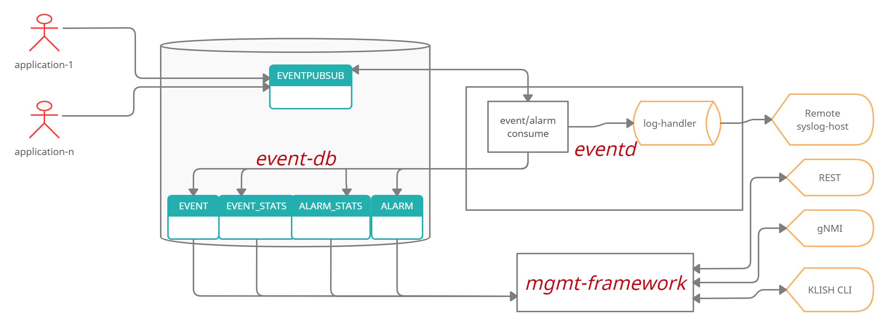
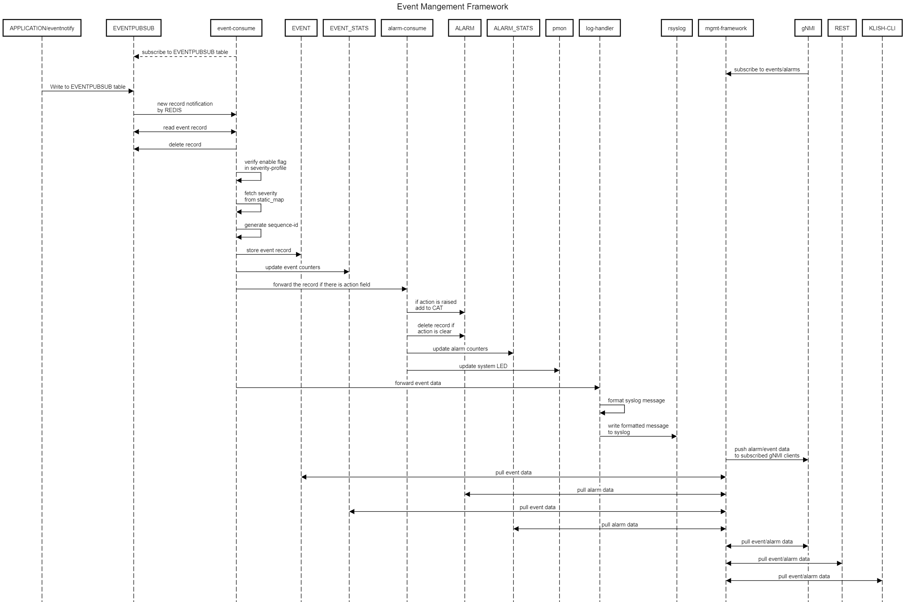

# Feature Name
Event and Alarm Framework
# High Level Design Document
#### Rev 0.1

# Table of Contents
  * [Revision](#revision)
  * [About This Manual](#about-this-manual)
  * [Scope](#scope)
  * [1 Feature Overview](#1-feature-overview)
    * [1.1 Requirements](#11-requirements)
      * [1.1.1 Functional Requirements](#111-functional-requirements)
      * [1.1.2 Scalability Requirements](#112-scalabilty-requirements)
    * [1.2 Design Overview](#12-design-overview)
      * [1.2.1 Basic Approach](#121-basic-approach)
      * [1.2.2 Container](#122-container)
  * [2 Functionality](#2-functionality)
    * [2.1 Target Deployment Use Cases](#21-target-deployment-user-cases)
    * [2.2 Functional Description](#22-functional-description)
  * [3 Design](#3-description)
    * [3.1 Overview](#31-overview)
      * [3.1.1 Event Producers](#311-event-producers)
        * [3.1.1.2 Development Process](#3112-development-process)
      * [3.1.2 Event Consumer](#312-event-consumer)
        * [3.1.2.1 Severity](#3121-severity)
        * [3.1.2.2 Sequence-ID](#3122-sequence-id)
      * [3.1.3 Alarm Consumer](#313-alarm-consumer)
      * [3.1.4 Event Receivers](#314-event-receivers)
        * [3.1.4.1 syslog](#3141-syslog)
        * [3.1.4.2 REST](#3142-rest)
        * [3.1.4.3 gNMI](#3143-gnmi)
        * [3.1.4.4 System LED](#3144-system-led)
        * [3.1.4.5 Event/Alarm flooding](#3145-event/alarm-flooding)
        * [3.1.4.6 Eventd continuous restart](#3146-event-continuous-restart)
      * [3.1.5 Event Profile](#315-event-profile)
      * [3.1.6 CLI](#316-cli)
      * [3.1.7 Event History Table and Current Alarm Table](#317-event-history-table-and-current-alarm-table)
      * [3.1.8 Pull Model](#318-pull-model)
      * [3.1.9 Supporting third party containers](#319-supporting-third-party-containers)
    * [3.2 DB Changes](#32-db-changes)
      * [3.2.1 CONFIG DB](#321-config-db)
      * [3.2.2 APP DB](#322-app-db)
      * [3.2.3 STATE DB](#323-state-db)
      * [3.2.4 ASIC DB](#324-asic-db)
      * [3.2.5 COUNTER DB](#325-counter-db)
    * [3.3 User Interface](#33-user-interface)
      * [3.3.1 Data Models](#331-data-models)
      * [3.3.2 CLI](#332-cli)
        * [3.3.2.1 Exec Commands](#3321-exec-commands)
        * [3.3.2.2 Configuration Commands](#3322-configuration-commands)
        * [3.3.2.3 Show Commands](#3323-show-commands)
      * [3.3.3 REST API Support](#333-rest-api-support)
  * [4 Flow Diagrams](#4-flow-diagrams)
  * [5 Warm Boot Support](#5-warm-boot-support)
    * [5.1 Application warm boot](#51-application-warm-boot)
    * [5.2 eventd warm boot](#52-eventd-warm-boot)
  * [6 Scalability](#6-scalability)
  * [7 Unit Test](#7-unit-test)


# Revision
| Rev |     Date    |       Author       | Change Description                                       |
|:---:|:-----------:|:------------------:|-----------------------------------                       |
| 0.1 | 03/20/2021  | Srinadh Penugonda  | Initial Version                                          |

# About this Manual
This document provides general information on the implementation and functionality of Event and Alarm Framework in SONiC.
Wherever CLI is specified, it is the CLISH cli that is referred.

# Scope
This document describes the high-level design of Event and Alarm Framework feature. 

# 1 Feature Overview

The Event and Alarm Framework feature provides a centralized framework for applications in SONiC to raise notifications and store them for NBIs to listen and fetch to monitor the device. 

Events and Alarms are means to indicate a change in the state of the system that operator may be interested in. 
Such a change has an important metric called *severity* to indicate how critical it is to the health of the system. 
This makes severity as an important chracteristic of an event.

*  Events

   Events are "one shot" notifications to indicate an abnormal/important situation. 
   
   User logging in, authentication failure, configuration changed notification are all examples of events.

*  Alarms

   Alarms are notifications raised for conditions that could be cleared by correcting or removal of such conditions.
   
   Out of memory, temperature crossing a threshold, and so on, are examples of conditions when the alarms are raised.
   Such conditions are dynamic: a faulty software/hardware component encounters the above such condition and **may** come out of that situation when the condition is resolved.
   So, these conditions have a state: RAISED, CLEARED or ACKNOWLEDGED.
   
   Events are sent as the condition progresses through each of these states.
   Each of these events is characterized by "state" in addition to "severity".
   
   An application *raises* an alarm when it encounters a faulty condition by sending an event with a state: RAISED.
   After the application recovers from the condition, that alarm is *cleared* by sending an event with a state: CLEARED. 
   An operator could *acknowledge* an alarm. This indicates that the user is aware of the faulty condition. 

   Overall system health and system LED state is deduced from the severities of alarms.
   An acknowledged alarm is taken out of consideration from deciding system health and system LED is updated accordingly.

   Operator must acknowledge or investigate alarms with a high severity.

Both events and alarms get recorded in the DB. 

1.  Event History Table

    All events get recorded in the event history table, by name, "EVENT". EVENT table contains history of all events generated by the system.
    This table is persisted across system restarts of any kind, including restore to factory defaults and SW upgrades and downgrades.

2. Current Alarm Table

   All events with a RASIED state get recorded in a table, by name, "ALARM" in addition to getting recorded in Event History Table ( only events corresponding to an alarm has state ).
   When a component that raised the alarm clears it ( by sending an event with CLEARED state ), the alarm record is removed from ALARM table.
   An user acknowledging a particular alarm will NOT remove that alarm record from this table.
   
   In effect, ALARM table contains outstanding alarms that need to be cleared by those components who raised them.
   This table is NOT persisted and its contents are cleared with a reload.
   
In summary, the framework provides both current and historical event status of software and physical entities of the system through ALARM and EVENT tables. 

As mentioned above, each event has an important characteristic: severity. SONiC defines following severities for events.

- CRITICAL : A critical condition exists and requires immediate action. A critical event may trigger if one or more hardware components fail, or one or more hardware components exceed temperature thresholds.
  ( maps to log-alert )
- MAJOR : A major error had occurred and requires escalation or notification. For example, a major alarm may trigger if an interface failure occurs, such as a port channel being down.
  ( maps to log-critical )
- MINOR : A minor error or noncritical condition occurred that, if left unchecked, might cause system service interruption or performance degradation. A minor alarm requires monitoring or maintenance.
  ( maps to log-error )
- WARNING : A warning condition was observed, but it may or may not result in an error condition.
  ( maps to log-warning )
- INFORMATIONAL : An informational event had occurred, but it does not impact performance. NOT applicable to alarms.
  ( maps to log-notice )

By default every event will have a severity assigned by the component. The framework provides Event Profiles to customize severity of an event and also disable an event.
Operator can decide to lower or increase severity of an event or can decide to turn off an event.

An example of event profile is as below:
```
{
    "events": [
        {
        	name: "CAM_FULL_ERROR",
        	severity: "WARNING",
        	enable: "true"
        },
        {
        	name: "TEMPERATURE_EXCEEDED",
        	severity: "CRITICAL",
        	enable: "true"
        },
        {
        	name: "PORT_OPSTATUS_UPDATE",
        	severity: "INFORMATIONAL",
        	enable: "true"
        }
    ]
}
```

Operator can download default event profile to a remote host. 
This downloaded file can be modified by changing the severity or enable/disable flag of event(s).
This modified file can then be uploaded to the device.
Operator can select any of these custom event profiles to change default properties of events.
The selected profile is persistent across reboots and will be in effect until operator selects either default or another custom profile.

In addition to storing events in DB, framework forwards log messages corresponding to all the events to syslog. 
Syslog message displays the type (alarm or event), state (RAISED, CLEARED or ACKNOWLEDGED) - when the message corresponds to an event of an alarm, name of the event and detailed message. 

gNMI clients can subscribe to receive events as they are raised. Subscribing through REST is being evaluated.

CLI and REST/gNMI clients can query either table with filters - based on severity, delta based on timestamp, sequence-id etc.,

## 1.1 Requirements


### 1.1.1 Functional Requirements

| ID    | Requirement                                            		                  | Comment             |
| :---  | :----                                                 		                  | :---                |
| 1     | Provide API via library for apps to publish events                              |                     |
| 2     | Provide API via library for apps to publish alarms                   |                | 
| 3     | Event Infra to write formatted syslog messages corresponding to all events to Syslog. |                    |
| 4     | Event Infra to persist all events and alarms in StateDB.                        |                     |
| 5     | Event Infra to read Event profile ( severity and enable/disable flag ) from a json file. |                    |
| 6     | Event Infra to read Event table parameters (size and # of days) from a config file. |                     |
| 7     | NBI interface (gNMI and REST) and CLI                                           |                     |
| 7.1   | Events                                                        	              |                     |
| 7.1.1 | Openconfig interface to pull event information.                                 |                     |
| 7.1.2 | Openconfig interface to pull event summary information.                         |                     |
|       | Event summary information to contain cumulative counters for:                   |                     |
|       | - Raised-count (events)                                                         |                     |
| 7.1.3 | Openconfig interface to pull events using following filters                     |                     |
|       | - ALL ( pull all events)                                                        |                     |
|       | - Severity.                                                                     |                     |
|       | - Recent records (eg., last 5 minutes, one hour, one day).                      |                     |
|       | - Records between two timestamps,  one timestamp and end, and beginning and a timestamp. |                    |
|       | - All records between two Sequence Numbers (incl begin and end)                 |                     |
| 7.2   | Alarms                                                        	              |                     |
| 7.2.1 | Openconfig interface to pull alarm information.                                 |                     |
| 7.2.2 | Openconfig interface to pull alarm summary information.                         |                     |
|       | Counters for Total, Critical, Major, Minor, Warning, Acknowledged               |                     |
| 7.2.3 | Openconfig interface to pull alarms using following filters                     |                     |
|       | - All (pull all events)                                                         |                     |
|       | - Severity.                                                                     |                     |
|       | - Recent alarms (eg., last 5 minutes, one hour, one day).                       |                     |
|       | - Records between two timestamps, one timestamp and end, and beginning and a timestamp. |                     |
|       | - All records between two Sequence Numbers (incl end and begin)                 |                     |
| 7.2.4 | Openconfig interface  to acknowledge an alarm.                                  |                     |
| 8     | CLI commands                                                                    |                     |
| 8.1   | show alarm [ detail \| summary \| severity \| timestamp <from> <to> \| recent <5min\|1hr\|1day> \| sequence-number <from> <to> \| all]          |                    |
| 8.2   | show event [ detail \| summary \| severity \| timestamp <from> <to> \| recent <5min\|1hr\|1day> \| sequence-number <from> <to>]                 |                     |
| 8.3   | show event profile                                                              |                     |
| 8.4   | alarm acknowledge <sequence id>                                                 |                     |
| 8.5   | logging server <ip> [ log \| event ]                                             | default is 'log'   |
| 8.6   | event profile   [ default \| name-of-file ]	                                  |                     |
| 9     | gNMI subscription                                                               |                     |
| 9.1   | Subscribe to openconfig Event container and Alarm container. All events and alarms published to gNMI subscribed clients. |                    |
| 10    | Clear all events (Best effort)                                                  |                     |

### 1.1.2 Scalability Requirements

EVENT table should support 40k/30-day records. Current active alarms are limited to total instances of unique alarms (which makes ALARM Table is a finite quantity)

## 1.2 Design Overview



### 1.2.1 Basic Approach
The feature involves new development. 
Applications act as producers by writing to a table in redis app-db. 
Eventd receives a new record in the table and processess it. 
It then saves the processed entry in event history table; if the event has a state and if it is RAISED, record gets added to alarm table and system health/LED is updated. 
If the state is CLEARED, record is removed from ALARM table and system health/LED is updated.
Both EVENT and ALARM tables are stored under state-db. For stats, EVENT_STATS and ALARM_STATS are maintained in state DB.
Eventd then informs logging API to format the log message and send the message to syslog.

### 1.2.2 Container
A new container by name, eventd, is created to hold event consumer logic.

# 2 Functionality
## 2.1 Target Deployment Use Cases

The framework provides the following key management services:

- Push model: Event/Alarm information to remote syslog hosts and subscribed gNMI clients
- Pull model: Event/Alarm information from CLI, REST/gNMI interfaces
- Ability to change severity of events, ability to turn off a particular event

## 2.2 Functional Description
Event Management Framework allows applications to store "state" of the system for user to query through various north bound interfaces.

# 3 Design
## 3.1 Overview
There are three players in the event framework. Applications, which raises events; 
an Event consumer to receive updates whenever an application raises an event and 
a set of event receivers for each NBI type.

Applications act as producers of events. 

Event consumer class in eventd container receives and processess the event whenever a new one is produced. 
Event consumer manages received events, updates event history table and current alarm table and invokes logging API, which constructs message and sends it over to syslog. 

Operator can chose to change properties of events with the help of event profile. Default
event profile is stored at /etc/sonic/evprofile/default.json. User can download the default event profile,
modify and upload it back to the switch to apply it. 

Through event profile, user can change severity of any event and also can enable/disable a 
event.

Through CLI, REST or gNMI, event history table and current alarm table can be retrieved using various filters.

### 3.1.1 Event Producers
Application that need to raise an event, need to use event notifiy API ( LOG_EVENT ). 
This API is part of libeventnotify library that applications need to link.

For events, applications need to provide event-id (name of the event), source, dynamic message, and event state set to NOTIFY. 
For alarms, applications need to provide event-id (name of the event), source, dynamic message, and event state (RAISE_ALARM / CLEAR_ALARM).

The eventd maintains a static map of event-ids. Developers of events need to declare event-id
of new events and other characteristics - severity and static message - that gets appended with dynamic message.
The static map is located at eventd/lib/src/eventstaticmap.h

```
std::unordered_map<std::string, EventInfo_t> static_event_map = {
    {"PORT_MTU_UPDATE",           {EventSeverity::INFORMATIONAL, true, "Port MTU is updated. "}},
    {"TEMPERATURE_EXCEEDED",      {EventSeverity::CRITICAL,      true, "Temperature threshold is 75 degrees. "}},
    {"PORT_LEARNING_MODE_UPDATE", {EventSeverity::INFORMATIONAL, true, "Learning mode updated. "}}
}
```

The format of event notify API is:

definition:
```
    LOG_EVENT(name, source, state, MSG, ...)
```
- name is name of the event
- source is the object that is generating this event
- state is either NOTIFY, RAISE_ALARM, CLEAR_ALARM or ACKNOWLEDGE_ALARM

Usage:
```
    LOG_EVENT(PORT_MTU_UPDATE, alias.c_str(), NOTIFY, "Configure  ethernet %s MTU to %s", alias.c_str(), mtu.c_str());
```

For alarms:
```
    if (temperature >= THRESHOLD) {
        LOG_EVENT(TEMPERATURE_EXCEEDED, sensor_name_p, RAISE_ALARM, "Temperature for sensor %s is %d degrees", sensor_name_p, current_temp);
    } else {
        LOG_EVENT(TEMPERATURE_EXCEEDED, sensor_name_p, CLEAR_ALARM, "Temperature for the sensor %s is %d degrees ", sensor_name_p, current_temp);
    }
```
#### 3.1.1.2 Development Process

Here is a typical developement process to add/raise new event:

a. Update buildimage/rules/*app*.mk

   Add $(LIBEVENTNOTIFY_DEV) to compile dependency.
   
   Add $(LIBEVENTNOTIFY) to runtime dependency.

```
   Ex: For rules/tam.mk,

       $(SONIC_TAM)_DEPENDS += $(LIBEVENTNOTIFY_DEV)
       $(SONIC_TAM)_RDEPENDS += $(LIBEVENTNOTIFY)
```

b. Update Makefile.am of the app to link to event notify library.
```
   Ex: To let tammgr use event notify API, update src/sonic-tam/tammgr/Makefile.am as below:

       tammgrd_LDADD += -leventnotify
```
c. Declare the new event-id in static_event_map defined in src/sonic-eventd/lib/src/eventstaticmap.h 

d. In the source file where event is to be raised, include eventnotify.h and invoke LOG_EVENT with state as NOTIFY/RAISE_ALARM/CLEAR_ALARM.

The event notifier takes the event properties, packs a field value tuple and writes to a table, by name, EVENTPUBSUB.

The EVENTPUBSUB table uses event-id and a sequence-id generated locally by event notifier as the key so that there wont be 
any conflicts across multiple applications trying to write to this table.

### 3.1.2 Event Consumer
The event consumer is a class in sonic-eventd container that processes the incoming record.

On bootup, event consumer reads from EVENTPUBSUB table.
This table contains records that are published by applications and waiting to be received by event consumer.
Whenever there is a new record, event consumer reads the record, processess and deletes it. 

On reading the field value tuple, using the event-id in the record, event consumer fetches static information from *static_event_map*.
As mentioned above, static information contains severity, static message part and event enable/disable flag. 
If the flag is set to disabled, event consumer ignores the event by logging a debug message.
If the flag is set to enabled, it continues to process the event as follows:
- Determine if enable flag is enabled/disabled from static information table
- Generate new sequence-id for the event if enable flag is set to enabled
- Write the event to Event History Table
- It verifies if the event corresponds to an alarm - by checking the state field. If so, it forwards the event to alarm consumer for further processing.
    - If state is raised, add the record to ALARM table
    - If state is clear, remove the entry from ALARM table
    - Update system health status 
- Invoke logging API to send a formatted message to syslog

#### 3.1.2.1 Severity
Supported event severities: Critical, Major, Minor, Warning and Informational
Informational severity is not applicable to alarms.
The corresponding syslog severities are: log-alert, log-crit, log-error, log-warning and log-notice respectively.

#### 3.1.2.2 Sequence-ID
Every new event should have a sequential ID. The sequence-id is persistent and continues to grow until 2 exp 64 
before wrapping around to start from 1.

### 3.1.3 Alarm Consumer
The alarm consumer on receiving the event record, verifies the event state. If it is RAISE_ALARM, it adds the record to Current Alarm Table.
Alarm consumer also maintains a map of sequence-id and pair of event-id and source fields.
If the state is CLEAR_ALARM, it removes the previous record using the key it fetches from the above internal map. 
It then updates the system LED by updating system health status.

system health status field is updated based on alarm severity as follows:
```
    ERROR if any outstanding Major or Critical alarms, else WARNING if any Minor or Warning alarms, else NORMAL.
```

The system LED update follows the system health status field and is as follows:
```
    Red if system health status is ERROR, else Yellow if it is WARNING, else Green.
```

An outstanding alarm is an alarm that is either not cleared or not acknowledged by the user yet.

There will be a provision to acknowledge an alarm through CLI/REST/gNMI. 
On acknowledging, the system health state ( and hence LED ) is updated by taking out acknowledged alarm into consideration.

### 3.1.4 Event Receivers
Supported NBIs are: syslog, REST and gNMI.

#### 3.1.4.1 syslog
Logging API contains logic to take the event record, augment it with any static information, format the message and 
send it to syslog.
```
if (ev_state.empty()) {
    const char LOG_FORMAT[] = "[%s], %%%s: %s: %s";
                                                // Log Type
                                                // Event Name
                                                // Dynamic message
                                                // Static message
    // raise a syslog message                                                
    syslog(LOG_MAKEPRI(ev_sev, SYSLOG_FACILITY), LOG_FORMAT,
        ev_type.c_str(),
        ev_id.c_str(), ev_msg.c_str(), ev_static_msg.c_str());
} else {
    const char LOG_FORMAT[] = "[%s] (%s), %%%s: %s: %s";
                                                // Log Type
                                                // Event state 
                                                // Event Name
                                                // Dynamic message
                                                // Static message
    // raise a syslog message                                                
    syslog(LOG_MAKEPRI(ev_sev, SYSLOG_FACILITY), LOG_FORMAT,
        ev_type.c_str(), ev_state.c_str(),
        ev_id.c_str(), ev_msg.c_str(), ev_static_msg.c_str());
}
        
``` 

An example of syslog message generated for an event raised by tam when changing switch-id
```
Feb 09 21:44:07.487906 2021 sonic NOTICE eventd#eventd[21]: [EVENT], %TAM_SWITCH_ID_CHANGE :- processSwitchTblEvent: Received new switch-id as 2. switch-id changed.
```

Syslog message for an alarm raised by a sensor:
```
Feb 10 16:24:42.148610 2021 sonic NOTICE eventd#eventd[125]: [ALARM] (raised), %TEMPERATURE_EXCEEDED :- temperatureCrossedThreshold: Current temperature of sensor/2 is 76 degrees. Temperature threshold is 75 degrees.
```

Syslog message when alarm is clared is as follows:
```
Feb 10 16:24:42.148610 2021 sonic NOTICE eventd#eventd[125]: [ALARM] (cleared), %TEMPERATURE_EXCEEDED :- temperatureCrossedThreshold: Current temperature of sensor/2 is 70 degrees. Temperature threshold is 75 degrees.
```

Operator can configure specifc syslog host to receive either syslog messages corresponding to events or general log messages.
Through CLI, operator can chose 'logging server <ip> [log|event]' command.
When operator configures a host with 'event' type, it receives *only* log messages corresponding to events.
Support for VRF/source-interface/UDP port are all are applicable for 'event' type.

#### 3.1.4.2 REST
Subcribing through REST to receive event notifications is currently being evaluated.

#### 3.1.4.3 gNMI
gNMI clients can subscribe to receive event notifications. Subscribed gNMI clients receive event fields as in the DB and 
there is no customization of these fileds similar to syslog messages.

TODO: add definitions of protobuf spec

#### 3.1.4.4 System LED
The original requirement was to change LED based on severities of the events. But on most of the platforms the system/power/fan LEDs are managed by the BMC. 
BMC (baseboard management controller) is an embedded system that manages various platform elements like fan, PSU, temperature sensors. 
There is an API that can be invoked to control LED, but not all platforms will support that API if they are fully controlled by the BMC.
So, on certain platforms, system LED could not represent events on the system.

Another issue is: Currently pmon controls LED, and as eventd now tries to change the very same LED, this leads to conflicts. 
A mechanism must exist for one of these to be master.

The proposed solution could be to have a system health paramter in the DB. 

```
127.0.0.1:6379[6]> hgetall "SYSTEM_HEALTH|SYSTEM_STATE"
1) "state"
2) "NORMAL"
```
This is updated by eventd and pmon could use it to update LED accordingly. 

#### 3.1.4.5 Event/Alarm flooding
There are scenarios when system enters a loop of a fault condition that makes application trigger events continuously. To avoid such
instances flood the EVENT or ALARM tables, eventd maintains a cache of last event/alarm. Every new event/alarm is compared against this cache entry
to make sure it is not a flood. If it is found to be same event/alarm, the newly raised entry will be silently discarded.

#### 3.1.4.6 Eventd continuous restart
Under the scenarios when eventd runs into an issue and restarts continuously, applications can keep writing to the eventpubsub table. As consumer - eventd - is restarting continuously, eventpusbub table could grow forever as applications keep rising events/alarms. 
One way to fix is to have the system monitor daemon to periodically (very high polling interval) to check the number of keys in the table and if it exceeds a number, delete all the entries. When system monitor daemon does this, it logs a syslog message. 

### 3.1.5 Event Profile
The Event profile contains mapping between event-id and severity of the event, enable/disable flag.
Through event profile, operator can change severity of a particular event. And can also enable/disable
a particular event.

On bootup, event framework would create default event profile file based on the contents of static_event_map. 
By default, every event is enabled.
The severity of event is decided by designer while adding the event.
The default event profile is stored at /etc/sonic/evprofile/default.json

User can download the default event profile to a remote host. User can modify characteristics of
certain events in the profile and can upload it back to the switch.

The updated profile will become custom profile.

User can select any of the custom profiles under /etc/sonic/evprofile/ using 'event profile' command.

The framework will sanity check the user selected profile and merges it with default characteristics of static_event_map.

The framework genrates an event indicating that a new profile is in effect. 
If there are any outstanding alarms in the current alarm table, the framework removes those records for which enable is set to false in the new profile. System health status updated accordingly.

The event profile is upgrade and downgrade compatible by taking only those attributes that are *known* to eventd.
All the other attributes will remain to their default values.
Sanity check rejects the profile if attributes contains values that are not known to eventd.

To "remember" the selected custom profile across reboots, a persisting hidden symlink points to the selected custom
profile. Config Migration hooks will be used to persist profile across an upgrade.

The profile can also be applied through ztp.

### 3.1.6 CLI
The show CLI require many filters with range specifiers.
Various filters are supported using RPC.

e.g.
```
rpc getEventBySeqeuenceId{
input {
    from sequence-id;
    to sequence-id;
  }
output {
   list event-table-entries; 
}
```

The rpc callback needs to access DB with the given set of sequence ids.

The gNMI server (gnoi_client.go, gnoi.go, sonic_proto, transl_utils.go) need to be extended to support the RPC to support similar operations for gNMI.

### 3.1.7 Event History Table and Current Alarm Table
The Event History Table (EVENT) and Current Alarm List Table (ALARM) stored in state db. 
The size of Event History Table is 40k records or 30 days worth of events which ever hits earlier.
A manifest file will be created with parameters to specify the number and number of days limits for
eventd to read and enforce them.
```
root@sonic:/etc# cat eventd.conf 
# ==============================================================================
# Event and Alarm Manager (eventd) configuration file

# ==============================================================================
# no-of-records in EVENT table:
# type:  uint32
# range: [1, 40000]
no-of-records=40000

# ==============================================================================
# no-of-days for EVENT table:
# type:  uint32
# range: [1, 30]
no-of-days=30
```

When either of the limit is reached, the framework wraps around the table records by discarding the older records.

An example of an event in EVENT table raised by tam.
```
EVENT Table:
==============================

Key                       : id

id                        : Unique sequential ID generated by the system for every event {uint64}
type-id                   : Name of the event generated {string}
text                      : Dynamic message describing the cause for the event {string}
time-created              : Time stamp at which the event is generated {uint64}
state                     : Indicates state of the event; for one-shot events, it is empty. For alarms it could be raise, cleared or ack {enum}
resource                  : Object which generated the event {string}

127.0.0.1:6379[6]> hgetall "EVENT|1"
 1) "id"
 2) "1"
 3) "type-id"
 4) "TAM_SWITCH_ID_CHANGE"
 5) "text"
 6) "processSwitchTblEvent: Received new switch-id as 3"
 7) "time-created"
 8) "2021-02-09.21:42:59.553603"
 9) "state"
10) ""
11) "resource"
12) "3"
127.0.0.1:6379[6]>
```

Schema for EVENT_STATS table is as follows:
```
EVENT_STATS Table:
==============================

Key                       : id

id                        : key {state}
events                    : Total events raised {uint64}
alarms                    : Total alarms raised {uint64}
cleared                   : Total alarms cleared {uint64}
acked                     : Total alarms acknowledged {uint64}

127.0.0.1:6379[6]> hgetall "EVENT_STATS|state"
1) "events"
2) "7"
3) "alarms"
4) "2"
5) "cleared"
6) "2"
7) "acked"
8) "0"
```

Current Alarm Table will not have any limits as it only contains the snapshot of the alarms during the current run.

Contents of an alarm record. In this case, the alarm was raised temperature crossed a threshold.
```
ALARM Table:
==============================

Key                       : id

id                        : Unique sequential ID generated by the system for every event {uint64}
type-id                   : Name of the event generated {string}
text                      : Dynamic message describing the cause for the event {string}
time-created              : Time stamp at which the event is generated {uint64}
is-acknowledged           : Indicates if alarm has been acknowledged {boolean}
resource                  : Object which generated the event {string}

127.0.0.1:6379[6]> hgetall "ALARM|29"
 1) "id"
 2) "29"
 3) "type-id"
 4) "TEMPERATURE_EXCEEDED"
 5) "text"
 6) "temperatureCrossedThreshold: Current temperature for sensor/2 is 76 degrees"
 7) "resource"
 8) "sensor/2"
 9) "time-created"
10) "2021-02-10.04:51:53.454450"
11) "is-acknowledged"
12) "false"
127.0.0.1:6379[6]>
```

Schema for ALARM_STATS table is as below. When an alarm of particular severity is cleared,
the corresponding severity counter is decremented. 
```
ALARM_STATS Table:
==============================

Key                       : id

id                        : key {state}
alarms                    : Number of active alarms {uint64}
critical                  : Number of alarms of severity 'critical' {uint64}
major                     : Number of alarms of severity 'major' {uint64}
minor                     : Number of alarms of severity 'minor' {uint64}
warning                   : Number of alarms of severity 'warning' {uint64}

127.0.0.1:6379[6]> hgetall "ALARM_STATS|state"
 1) "alarms"
 2) "1"
 3) "critical"
 4) "0"
 5) "major"
 6) "1"
 7) "minor"
 8) "0"
 9) "warning"
10) "0"

```

System Health Table
```
SYSTEM_HEALTH Table:
==============================
key           : “SYSTEM_STATE”
state         : enum to indicate the health state of the system (NORMAL, WARNING, ERROR) 

```
### 3.1.8 Pull Model
All NBIs - CLI, REST and gNMI - can pull contents of current alarm table and event history table.
The following filters are supported:
- ALL ( pulls all alarms)
- Severity.
- Recent alarms (eg., last 5 minutes, one hour, one day).
- Records between two timestamps, one timestamp and end, and   beginning and a timestamp.
- All records between two Sequence Numbers (incl end and begin)

### 3.1.9 Supporting third party containers
To support third party components ( e.g. FRR, teamd, DHCP Relay, LLDPd, ntpd etc ) which can not be modified to raise events, the following options are considered 
and are being evaluated.
1.  Patch the components
    Create a patch for these components by adding libeventnotify library and invoke the API. This however, requires these patches need to be maintained in the code forever.

2.  Listen to syslog messages
    As many of these components raises syslog messages on an important event, a listener can be implemented to read incoming syslog messages and raise 
    events based on the message.
    This however is heavy on performance due to the fact that listener has to parse each syslog message. Also listener need to maintain a map of messages to 
    event-id and need to be aware of resource and other specific details. It need to be aware of nuances of alarm raising/clearing if the component follows
    any specific logic. 

## 3.2 DB Changes
### 3.2.1 CONFIG DB
### 3.2.2 APP DB
Table EVENTPUBSUB is used for applications to write events and for eventconsumer to access and process them.

### 3.2.3 STATE DB
Four new tables are introduced. 
Event History Table (EVENT) and Current Alarm Table (ALARM).
To maintain various statistics of events, these two are introduced : EVENT_STATS and ALARM_STATS.

### 3.2.4 ASIC DB
### 3.2.5 COUNTER DB

## 3.3 User Interface
### 3.3.1 Data Models

The following is sonic yang for events.
```
module: sonic-event
  +--rw sonic-event
     +--rw EVENT
     |  +--rw EVENT_LIST* [id]
     |     +--rw id              uint64
     |     +--rw resource?       string
     |     +--rw text?           string
     |     +--rw time-created?   yang:date-and-time
     |     +--rw type-id?        string
     |     +--rw severity?       severity-type
     |     +--rw state?          state-type
     +--rw EVENT_STATS
        +--rw EVENT_STATS_LIST* [id]
           +--rw id         enumeration
           +--rw events?    uint64
           +--rw alarms?    uint64
           +--rw acked?     uint64
           +--rw cleared?   uint64

  rpcs:
    +---x show-events
       +---w input
       |  +---w (option)?
       |     +--:(time)
       |     |  +---w time
       |     |     +---w begin?   yang:date-and-time
       |     |     +---w end?     yang:date-and-time
       |     +--:(recent-interval)
       |     |  +---w interval?   enumeration
       |     +--:(severity)
       |     |  +---w severity?   event:severity-type
       |     +--:(identifier)
       |        +---w id
       |           +---w begin?   string
       |           +---w end?     string
       +--ro output
          +--ro status?          int32
          +--ro status-detail?   string
          +--ro EVENT
             +--ro EVENT_LIST* [id]
                +--ro id              uint64
                +--ro resource?       string
                +--ro text?           string
                +--ro time-created?   yang:date-and-time
                +--ro type-id?        string
                +--ro severity?       severity-type
                +--ro state?          state-type
```

The following openconfig yang for events

```
module: openconfig-events
  augment /oc-sys:system:
    +--rw events
    |  +--ro event* [id]
    |     +--ro id       -> ../state/id
    |     +--ro state
    |        +--ro id?                      string
    |        +--ro resource?                string
    |        +--ro text?                    string
    |        +--ro time-created?            oc-types:timeticks64
    |        +--ro time-created-datetime?   oc-yang-types:date-and-time
    |        +--ro severity?                identityref
    |        +--ro type-id?                 union
    +--rw event-stats
       +--ro state
          +--ro events?       uint64
          +--ro alarms?       uint64
          +--ro acked?        uint64
          +--ro cleared?      uint64
          +--ro non-alarms?   uint64
```

The following is sonic yang for alarms.
```
module: sonic-alarm
  +--rw sonic-alarm
     +--rw ALARM
     |  +--rw ALARM_LIST* [id]
     |     +--rw id              uint64
     |     +--rw resource?       string
     |     +--rw text?           string
     |     +--rw time-created?   yang:date-and-time
     |     +--rw type-id?        string
     |     +--rw severity?       event:severity-type
     |     +--rw acknowledged?   boolean
     +--rw ALARM_STATS
        +--rw ALARM_STATS_LIST* [id]
           +--rw id               enumeration
           +--rw alarms?          uint64
           +--rw critical?        uint64
           +--rw major?           uint64
           +--rw minor?           uint64
           +--rw warning?         uint64
           +--rw informational?   uint64
           +--rw acknowledged?    uint64

  rpcs:
    +---x acknowledge-alarms
    |  +---w input
    |  |  +---w id*   string
    |  +--ro output
    |     +--ro status?          int32
    |     +--ro status-detail?   string
    +---x unacknowledge-alarms
    |  +---w input
    |  |  +---w id*   string
    |  +--ro output
    |     +--ro status?          int32
    |     +--ro status-detail?   string
    +---x show-alarms
       +---w input
       |  +---w (option)?
       |     +--:(time)
       |     |  +---w time
       |     |     +---w begin?   yang:date-and-time
       |     |     +---w end?     yang:date-and-time
       |     +--:(last-interval)
       |     |  +---w period?     enumeration
       |     +--:(severity)
       |     |  +---w severity?   event:severity-type
       |     +--:(identifier)
       |        +---w id
       |           +---w begin?   string
       |           +---w end?     string
       +--ro output
          +--ro status?          int32
          +--ro status-detail?   string
          +--ro ALARM
             +--ro ALARM_LIST* [id]
                +--ro id              uint64
                +--ro resource?       string
                +--ro text?           string
                +--ro time-created?   yang:date-and-time
                +--ro type-id?        string
                +--ro severity?       event:severity-type
                +--ro acknowledged?   boolean
```

openconfig alarms yang is defined at [here](https://github.com/openconfig/public/blob/master/release/models/system/openconfig-alarms.yang)

### 3.3.2 CLI
#### 3.3.2.1 Exec Commands
```
sonic# alarm acknowledge <seq-id-of-raised-alarm>
```
An operator can acknolwedge a raised alarm. This indicates that the operator is aware of the fault condition and considers the condition not catastrophic. 
Acknowledging an alarm updates system health parameter and thereby system LED by removing the particular alarm from status consideration.

The alarm record in the ALARM table is marked with is_acknowledged field set to true.
```
sonic# event profile <profile-name>
```
The command takes specified file, validates it for its syntax and values; merges it with its internal static map of events *static_event_map*. The command creates a persistent symlink to the selected file so that eventd "remembers" it after a reboot. 

#### 3.3.2.2 Configuration Commands
```
sonic(config)# logging server <ip> [log|event] 
```
Note: The 'logging server' command is an existing, already supported command. 
It is only enhanced to take either 'log' or 'event' to indicate either native syslog messages or syslog messages corresponding to events alone are sent to the remote host.
Support with VRF/source-interface and configuring remote-port are all backward comaptible and will be applicable to either 'log' or 'event' options.

#### 3.3.2.3 Show Commands
```
sonic# show system health
System Health: Normal, Warning or Error

sonic# show event profile

Event Profile Details
----------------------------------------
Currently active     :  default
Active after restart :  myev_prof

sonic# show event [ detail | summary | severity <sev> | timestamp from <from-ts> to <to-ts> | recent <5min|1hr|1day> | sequence-id from <from-seq> to <to-seq> ] 

'show event' commands would display all the records in EVENT table.

sonic# show event 
Sq No   State        Name                             Timestamp                   Description
-----   --------     ------------------------------   --------------------------- --------------
2292    -            TAM_SWITCH_ID_CHANGE             Wed Feb 10 18:08:27 2021    processSwitchTblEvent: Received new switch-id as 3        
2291    raised       TEMPERATURE_EXCEEDED             Wed Feb 10 18:08:24 2021    temperatureCrossedThreshold: Current temperature of sensor/2 is 76 degrees
        
      
sonic# show event details 
Event History Details - 2292
-------------------------------------------
Sequence Number:   2292
Severity:          informational
Name:              TAM_SWITCH_ID_CHANGE
Description:       processSwitchTblEvent: Received new switch-id as 3
Timestamp:         Wed Feb 10 18:08:27 2021
Source:            -
State:             -
-------------------------------------------
Event History Details - 2291
-------------------------------------------
Sequence Number:   2291
Severity:          critical
Name:              TEMPERATURE_EXCEEDED
Description:       temperatureCrossedThreshold: Current temperature of sensor/2 is 76 degrees
Timestamp:         Wed Feb 10 18:08:24 2021
Source:            sensor/2
State:             raised

sonic# show event summary

Event Summary
-------------------------------------------
Raised:                 4
Ack:                    0
Cleared:                4
Events:                 20
-------------------------------------------

sonic# show event severity critical
Sq No   State        Name                             Timestamp                   Description
-----   --------     ------------------------------   --------------------------- --------------
2291    raised       TEMPERATURE_EXCEEDED             Wed Feb 10 17:58:19 2021    temperatureCrossedThreshold: Current temperature of sensor/2 is 76 degrees. 

sonic# show event recent 5min 
Sq No   State        Name                             Timestamp                   Description
-----   --------     ------------------------------   --------------------------- --------------
2292    -            TAM_SWITCH_ID_CHANGE             Wed Feb 10 18:08:27 2021    processSwitchTblEvent: Received new switch-id as 3        
2291    raised       TEMPERATURE_EXCEEDED             Wed Feb 10 18:08:24 2021    temperatureCrossedThreshold: Current temperature of sensor/2 is 76 degrees

sonic# show event sequence-id from 2290 to 2300
Sq No   State        Name                             Timestamp                   Description
-----   --------     ------------------------------   --------------------------- --------------
2292    -            TAM_SWITCH_ID_CHANGE             Wed Feb 10 18:08:27 2021    processSwitchTblEvent: Received new switch-id as 3        
2291    raised       TEMPERATURE_EXCEEDED             Wed Feb 10 18:08:24 2021    temperatureCrossedThreshold: Current temperature of sensor/2 is 76 degrees

sonic# show event TEMPERATURE_EXCEEDED
Sq No   State        Name                             Timestamp                   Description
-----   --------     ------------------------------   --------------------------- --------------
2311    cleared      TEMPERATURE_EXCEEDED             Wed Feb 11 01:03:32 2021    temperatureCrossedThreshold: Current temperature of sensor/2 is 70 degrees
2291    raised       TEMPERATURE_EXCEEDED             Wed Feb 10 17:08:24 2021    temperatureCrossedThreshold: Current temperature of sensor/2 is 76 degrees
182     cleared      TEMPERATURE_EXCEEDED             Wed Feb 10 09:52:12 2021    temperatureCrossedThreshold: Current temperature of sensor/2 is 70 degrees
134     raised       TEMPERATURE_EXCEEDED             Wed Feb 10 09:32:01 2021    temperatureCrossedThreshold: Current temperature of sensor/2 is 77 degrees

sonic# show alarm [ detail | summary | severity <sev> | timestamp from <from-ts> to <to-ts> | recent <5min|1hr|1day> | sequence-id from <from-seq> to <to-seq> | all ]

'show alarm' command would display all the active alarm records in ALARM table.

sonic# show alarm
  
Sq No     Severity         Name                             Timestamp                   Source
------    -------------    ------------------------------   --------------------------- --------------
2291      critical         TEMPERATURE_EXCEEDED             Wed Feb 10 18:08:24 2021    /sensor/2  

sonic# show alarm detail 
  
Active-alarm details - 2291
-------------------------------------------
Sequence Number:   2291
Severity:          critical
Source:            /sensor/2
Name:              TEMPERATURE_EXCEEDED
Description:       temperatureCrossedThreshold: Current temperature of sensor/2 is 76 degrees
Raise-time:        Wed Feb 10 18:08:24 2021
Ack-time:          
New:               true
Acknowledged:      false

sonic# show alarm summary
Active-alarm Summary
-------------------------------------------
Total:            6
Critical:         2
Major:            1
Minor:            1
Warning:          2
Acknowledged:     1
Informational:    0
-------------------------------------------
Major/Minor will be displayed only if there is a non-zero value exists for these counters.

sonic# show alarm severity critical
Sq No  Name                             Timestamp                   Description
-----  ------------------------------   --------------------------- --------------
2291   TEMPERATURE_EXCEEDED             Wed Feb 10 17:58:19 2021    temperatureCrossedThreshold: Current temperature of sensor/2 is 76 degrees. 

sonic# show alarm recent 5min 
Sq No  Name                             Timestamp                   Description
-----  ------------------------------   --------------------------- --------------
2291   TEMPERATURE_EXCEEDED             Wed Feb 10 18:08:24 2021    temperatureCrossedThreshold: Current temperature of sensor/2 is 76 degrees

sonic# show alarm sequence-id from 2290 to 2300
Sq No  Name                             Timestamp                   Description
-----  ------------------------------   --------------------------- --------------
2291   TEMPERATURE_EXCEEDED             Wed Feb 10 18:08:24 2021    temperatureCrossedThreshold: Current temperature of sensor/2 is 76 degrees

sonic# show alarm all
  
Sq No  Severity         Name                             Timestamp                   Source          Acknowledged
------ -------------    ------------------------------   --------------------------- --------------  ---------------
2291   critical         TEMPERATURE_EXCEEDED             Wed Feb 10 18:08:24 2021    /sensor/2       false
178    critical         PSU_FAULT                        Wed Dec 30 21:59:07 2020    /psu/2          true

```

### 3.3.3 REST API Support

sonic REST links:
*  /restconf/data/sonic-event:sonic-event/EVENT/EVENT_LIST
*  /restconf/data/sonic-event:sonic-event/EVENT_STATS/EVENT_STATS_LIST
*  /restconf/data/sonic-alarm:sonic-alarm/ALARM/ALARM_LIST
*  /restconf/data/sonic-alarm:sonic-alarm/ALARM_STATS/ALARM_STATS_LIST

openconfig REST links:
*  /restconf/data/openconfig-system:system/openconfig-events:events
*  /restconf/data/openconfig-system:system/openconfig-events:event-stats
*  /restconf/data/openconfig-system:system/alarms
*  /restconf/data/openconfig-system:system/openconfig-alarms-ext:alarm-stats

# 4 Flow Diagrams


# 5 Warm Boot Support
## 5.1 Application warm boot
Applications confirming to the warm boot, should have stored their state and compare current values against previous values.
Such complaint application also "remembers" that it raised an event before for a specific condition.
They would 
*  not raise alarms/events for the same condition that it raised pre warm boot
*  clear those alarms once current state of a particular condition is recovered (by comparing against the stored state). 

## 5.2 eventd warm boot
Records from applications are stored in a table, called EVENTPUBSUB.
By using table of type ProducerTable, records that are being written will be queued when the subscriber (eventd) is down.

This is in contrast to notification producer/consumer tables which causes incoming records getting lost.

The eventnotify from each application would write events to EVENTPUBSUB table that eventd subscribes to. 
eventnotify uses event-id and a local sequence-id as the key while writing records to this table.

During normal operation, eventd receives subscription notifications whenever a new record is added to the table.
eventd reads and removes records.

When eventd is restarted, events and alarms raised by applications will be waiting in a queue while eventd is coming up.
When eventd eventually comes back up, it reads those records in the queue.

# 6 Scalability
In this feature, scalability applies to Event History Table (EVENT). As it is persistent and it records every event generated on the system, to protect
against it growing indefinitely, user can limit its size through a manifest file.
By default, the size of Event History Table is set to 40k events or events for 30 days - after which, older records are discarded to make way for new records.

# 7 Unit Test
- Raise an event and verify the fields in EVENT table and EVENT_STATS table
- Raise an alarm and verify the fields in ALARM table and ALARM_STATS table
- Clear an alarm and verify that record is removed from ALARM and ALARM_STATS tables are udpated
- Ack an alarm and verify that is_acknowledged flag is set to true in ALARM table
- Verify wrap around for EVENT table ( change manifest file to a lower range and trigger that many events )
- Verify sequence-id for events is persistent by restarting
- Verify counters by raising various alarms with different severities 
- Change severity of an event through custom event profile and verify it is logged at specified severity
- Change enable/disable of an event through custom event profile and verify it is suppressed
- Verify custom event profile with an invalid event-id is rejected 
- Verify custom event profile with an invalid severity is rejected 
- Verify custom event profile with an invalid enable/disable flag is rejected 
- Verify custom event profile with an invalid json syntax is rejected 
- Verify custom event profile is persisted after a reboot
- Verify various show commands
- Verify 'logging-server <ip> event' command forwards only event log messages to the host
