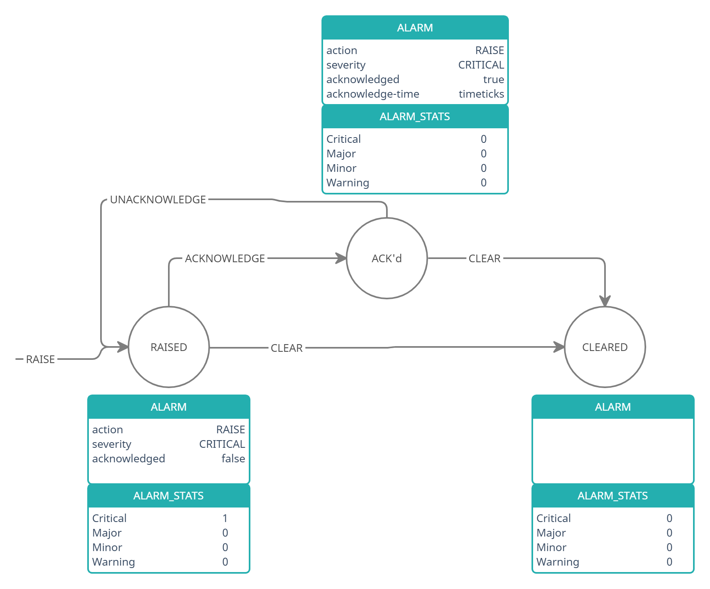

# Feature Name
Event and Alarm Framework
# High Level Design Document
#### Rev 0.2

# Table of Contents
  * [Revision](#revision)
  * [About This Manual](#about-this-manual)
  * [Scope](#scope)
  * [1 Feature Overview](#1-feature-overview)
    * [1.1 Requirements](#11-requirements)
      * [1.1.1 Functional Requirements](#111-functional-requirements)
    * [1.2 Design Overview](#12-design-overview)
      * [1.2.1 Basic Approach](#121-basic-approach)
      * [1.2.2 Container](#122-container)
  * [2 Functionality](#2-functionality)
    * [2.1 Target Deployment Use Cases](#21-target-deployment-user-cases)
    * [2.2 Functional Description](#22-functional-description)
  * [3 Design](#3-description)
    * [3.1 Overview](#31-overview)
      * [3.1.1 Event Producers](#311-event-producers)
        * [3.1.1.2 Development Process](#3112-development-process)
      * [3.1.2 Event Consumer](#312-event-consumer)
        * [3.1.2.1 Severity](#3121-severity)
        * [3.1.2.2 Sequence-ID](#3122-sequence-id)
      * [3.1.3 Alarm Consumer](#313-alarm-consumer)
      * [3.1.4 Event Receivers](#314-event-receivers)
        * [3.1.4.1 syslog](#3141-syslog)
        * [3.1.4.2 REST](#3142-rest)
        * [3.1.4.3 gNMI](#3143-gnmi)
        * [3.1.4.4 System LED](#3144-system-led)
        * [3.1.4.5 Event/Alarm flooding](#3145-event/alarm-flooding)
        * [3.1.4.6 Eventd continuous restart](#3146-event-continuous-restart)
      * [3.1.5 Event Profile](#315-event-profile)
      * [3.1.6 CLI](#316-cli)
      * [3.1.7 Event History Table and Current Alarm Table](#317-event-history-table-and-current-alarm-table)
      * [3.1.8 Pull Model](#318-pull-model)
      * [3.1.9 Supporting third party containers](#319-supporting-third-party-containers)
    * [3.2 DB Changes](#32-db-changes)
      * [3.2.1 EVENT DB](#321-event-db)
    * [3.3 User Interface](#33-user-interface)
      * [3.3.1 Data Models](#331-data-models)
      * [3.3.2 CLI](#332-cli)
        * [3.3.2.1 Exec Commands](#3321-exec-commands)
        * [3.3.2.2 Configuration Commands](#3322-configuration-commands)
        * [3.3.2.3 Show Commands](#3323-show-commands)
      * [3.3.3 REST API Support](#333-rest-api-support)
  * [4 Flow Diagrams](#4-flow-diagrams)
  * [5 Warm Boot Support](#5-warm-boot-support)
    * [5.1 Application warm boot](#51-application-warm-boot)
    * [5.2 eventd warm boot](#52-eventd-warm-boot)
  * [6 Scalability](#6-scalability)
  * [7 Showtech Support](#7-showtech-support)
  * [8 Unit Test](#8-unit-test)


# Revision
| Rev |     Date    |       Author       | Change Description                                       |
|:---:|:-----------:|:------------------:|-----------------------------------                       |
| 0.1 | 03/20/2021  | Srinadh Penugonda  | Initial Version                                          |
| 0.2 | 04/30/2021  | Srinadh Penugonda  | Updated with comments from HLD review                    |

# About this Manual
This document provides general information on the implementation and functionality of Event and Alarm Framework in SONiC.
Wherever CLI is specified, it is the CLISH cli that is referred - SONiC native (CLICK) CLI is not updated for this feature.

# Scope
This document describes the high-level design of Event and Alarm Framework.
It is not in the scope of the framework to update ANY of the applications to raise events and alarms.

# 1 Feature Overview

The Event and Alarm Framework feature provides a centralized framework for applications in SONiC to raise notifications and store them for NBIs to listen and fetch to monitor the device.

Events and Alarms are means to indicate a change in the state of the system that operator may be interested in. 
Such a change has an important metric called *severity* to indicate how critical it is to the health of the system. 

*  Events

   Events are "one shot" notifications to indicate an abnormal/important situation. 
   
   User logging in, authentication failure, configuration changed notification are all examples of events.

*  Alarms

   Alarms are notifications raised for conditions that could be cleared by correcting or removal of such conditions.
   
   Out of memory, temperature crossing a threshold, and so on, are examples of conditions when the alarms are raised.
   Such conditions are dynamic: a faulty software/hardware component encounters the above such condition and **may** come out of that situation when the condition is resolved.
   
   Events are sent as the condition progresses through being raised and cleared in addition to operator acknowledging it.
   So, these events have a field called *action*: raise, clear OR acknowledge.

   Each of such events for an alarm is characterized by "action" in addition to "severity".
   
   An application *raises* an alarm when it encounters a faulty condition by sending an event with action: *raise*.
   After the application recovers from the condition, that alarm is *cleared* by sending an event with action: *clear*.
   An operator could *acknowledge* an alarm. This indicates that the operator is aware of the faulty condition.

   The set of alarms and their severities informs overall health of various applications of the system and System LED can be deduced from alarms.
   An acknowledged alarm means that operator is aware of the condition so, acknowledged alarm should be taken out of consideration from deciding system LED state.

Both events and alarms get recorded in the EVENT_DB.

1.  Event History Table

    All events get recorded in the event history table, by name, "EVENT". EVENT table contains history of all events generated by the system.
    This table is persisted across system restarts of any kind, including restore to factory defaults and SW upgrades and downgrades.

2. Current Alarm Table

   All events with an action field of *raise* get recorded in a table, by name, "ALARM" in addition to getting recorded in Event History Table ( only events corresponding to an alarm has state ).
   When an application that raised the alarm clears it ( by sending an event with action *clear* ), the alarm record is removed from ALARM table.
   An user acknowledging a particular alarm will NOT remove that alarm record from this table.
   
   In effect, ALARM table contains outstanding alarms that need to be cleared by those applications who raised them.
   This table is NOT persisted and its contents are cleared with a reload.

In summary, the framework provides both current and historical event status of software and physical entities of the system through ALARM and EVENT tables. 

In addition to the above tables, the framework maintains various statisitcs.

1. Event Statistics Table

   Statistics on number of events and alarms are maintained in EVENT_STATS table.

2. Alarm Statistics Table

   Statistics on number of alarms per severity are maintained in ALARM_STATS table.
   When application raises an alarm, the counter corresponding to the alarm's severity is increased by 1.
   When the alarm is cleared or acknowledged, the corresponding counter will be reduced by 1.
   This table categorizes "active" alarms per severity.

As mentioned above, each event has an important characteristic: severity. SONiC uses following severities for events and alarms as defined in opeconfig alarm yang.

- critical : Requires immediate action. An critical event may trigger if one or more hardware components fail, or one or more hardware components exceed temperature thresholds.
  ( maps to log-alert )
- major : Requires escalation or notification. For example, a major alarm may trigger if an interface failure occurs, such as a port channel being down.
  ( maps to log-critical )
- minor : If left unchecked, might cause system service interruption or performance degradation. An alarm with minor severity requires monitoring or maintenance.
  ( maps to log-error )
- warning : It may or may not result in an error condition.
  ( maps to log-warning )
- informational : Does not impact performance. NOT applicable to alarms.
  ( maps to log-notice )

The following describes how an alarm transforms and how various tables are updated.  


By default every event will have a severity assigned by the component. The framework provides Event Profiles to customize severity of an event and also disable an event.

An example of event profile is as below:
```
{
    "events": [
        {
        	name: "CAM_FULL_ERROR",
        	severity: "warning",
        	enable: "true"
        },
        {
        	name: "TEMPERATURE_EXCEEDED",
        	severity: "critical",
        	enable: "true"
        },
        {
        	name: "PORT_OPSTATUS_UPDATE",
        	severity: "informational",
        	enable: "true"
        }
    ]
}
```
The framework maintains default event profile at /etc/sonic/evprofile/default.json.
Operator can download default event profile to a remote host.
This downloaded file can be modified by changing the severity or enable flag of event(s).
This modified file can then be uploaded to the device to /etc/sonic/evprofile/.
Operator can select any of these custom event profiles to change default properties of events.
The selected profile is persistent across reboots and will be in effect until operator selects either default or another custom profile.

In addition to storing events in EVENT_DB, framework forwards log messages corresponding to all the events to syslog.
Syslog message displays the type (alarm or event), action (raise, clear or acknowledge) - when the message corresponds to an event of an alarm, name of the event and detailed message. 

gNMI clients can subscribe to receive events as they are raised. Subscribing through REST is being evaluated.

CLI and REST/gNMI clients can query either table with filters - based on severity, delta based on timestamp, sequence-id etc.,

Application owners need to identify various conditions that would be of interest to the operator and use the framework to raise events/alarms. 

## 1.1 Requirements


### 1.1.1 Functional Requirements

| ID    | Requirement                                            		                  | Comment             |
| :---  | :----                                                 		                  | :---                |
| 1     | Provide API via library for apps to publish events                              |                     |
| 2     | Provide API via library for apps to publish alarms                   |                | 
| 3     | Event Infra to write formatted syslog messages corresponding to all events to Syslog. |                    |
| 4     | Event Infra to persist all events and alarms in DB.                        |                     |
| 5     | Event Infra to read Event profile ( severity and enable/disable flag ) from a json file. |                    |
| 6     | Event Infra to read Event table parameters (size and # of days) from a config file. |                     |
| 7     | NBI interface (gNMI and REST) and CLI                                           |                     |
| 7.1   | Events                                                        	              |                     |
| 7.1.1 | Openconfig interface to pull event information.                                 |                     |
| 7.1.2 | Openconfig interface to pull event summary information.                         |                     |
|       | Event summary information to contain cumulative counters for:                   |                     |
|       | - Raised-count (events)                                                         |                     |
| 7.1.3 | Openconfig interface to pull events using following filters                     |                     |
|       | - ALL ( pull all events)                                                        |                     |
|       | - Severity.                                                                     |                     |
|       | - Recent records (eg., last 5 minutes, one hour, one day).                      |                     |
|       | - Records between two timestamps,  one timestamp and end, and beginning and a timestamp. |                    |
|       | - All records between two Sequence Numbers (incl begin and end)                 |                     |
| 7.2   | Alarms                                                        	              |                     |
| 7.2.1 | Openconfig interface to pull alarm information.                                 |                     |
| 7.2.2 | Openconfig interface to pull alarm summary information.                         |                     |
|       | Counters for Total, Critical, Major, Minor, Warning, Acknowledged               |                     |
| 7.2.3 | Openconfig interface to pull alarms using following filters                     |                     |
|       | - All (pull all events)                                                         |                     |
|       | - Severity.                                                                     |                     |
|       | - Recent alarms (eg., last 5 minutes, one hour, one day).                       |                     |
|       | - Records between two timestamps, one timestamp and end, and beginning and a timestamp. |                     |
|       | - All records between two Sequence Numbers (incl end and begin)                 |                     |
| 7.2.4 | Openconfig interface  to acknowledge an alarm.                                  |                     |
| 8     | CLI commands                                                                    |                     |
| 8.1   | show alarm [ detail \| summary \| severity \| timestamp <from> <to> \| recent <5min\|1hr\|1day> \| sequence-number <from> <to> \| all]          |                    |
| 8.2   | show event [ detail \| summary \| severity \| timestamp <from> <to> \| recent <5min\|1hr\|1day> \| sequence-number <from> <to>]                 |                     |
| 8.3   | show event profile                                                              |                     |
| 8.4   | alarm acknowledge <sequence id>                                                 |                     |
| 8.5   | logging server <ip> [ log \| event ]                                             | default is 'log'   |
| 8.6   | event profile   [ default \| name-of-file ]	                                  |                     |
| 9     | gNMI subscription                                                               |                     |
| 9.1   | Subscribe to openconfig Event container and Alarm container. All events and alarms published to gNMI subscribed clients. |                    |
| 10    | Clear all events                                                                |                     |

## 1.2 Design Overview


### 1.2.1 Basic Approach
The feature involves new development.
A new DB by name - EVENT_DB - is created using redis2 instance to host various tables of the framework.
Applications act as producers by writing to a table in EVENT_DB with the help of event notify library.
Eventd reads new record in the table and processes it:
It saves the entry in event history table; if the event has an action and if it is *raise*, record gets added to alarm table, severity counter in ALARM_STATS is increased.
If the received event action is *clear*, record in the ALARM table is removed and severity counter in ALARM_STATS of that alarm is reduced by 1.
If eventd receives an event with action *acknowledge*, severity counter in ALARM_STATS is reduced by 1.
Eventd then informs logging API to format the log message and send the message to syslog.

Any applications like pmon can subscribe to tables like ALARM_STATS to act accordingly.

### 1.2.2 Container
A new container by name, eventd, is created to hold event consumer logic.

# 2 Functionality
## 2.1 Target Deployment Use Cases

The framework assigns an unique sequence number to each of the events sent by applications.

In addition, the framework provides the following key management services:

- Push model: Event/Alarm information to remote syslog hosts and subscribed gNMI clients
- Pull model: Event/Alarm information from CLI, REST/gNMI interfaces
- Ability to change severity of events, ability to turn off a particular event

## 2.2 Functional Description
Event Management Framework allows applications to store "state" of the system for user to query through various north bound interfaces.

# 3 Design
## 3.1 Overview
There are three players in the event framework. Producers, which raises events; a consumer to receive and process them as they are raised and a set of receivers one for each NBI type.

Applications act as producers of events. 

Event consumer class in eventd container receives and processes the event whenever a new one is produced. 
Event consumer manages received events, updates event history table, current alarm table, event_stats table and alarm_stats tables and invokes logging API, which constructs message and sends it over to syslog. 

Operator can chose to change properties of events with the help of event profile. Default
event profile is available at */etc/sonic/evprofile/default.json*. User can download the default event profile,
modify and upload it back to the switch to apply it. 

Through event profile, user can change severity of any event and also can enable/disable a event.

Through CLI, REST or gNMI, event history table and current alarm table can be retrieved using various filters.

### 3.1.1 Event Producers
Application that need to raise an event, need to use event notifiy API ( LOG_EVENT ).
This API is part of *libeventnotify* library that applications need to link.

For one-shot events, applications need to provide event-id (name of the event), source, dynamic message, and event action set to NOTIFY. 

For alarms, applications need to provide event-id (name of the event), source, dynamic message, and event action (RAISE_ALARM / CLEAR_ALARM / ACK_ALARM).

Eventd maintains a json file of events and alarms at sonic-eventd/etc/sonic/evprofile/default.json.
Developers of new events or alarms need to update this file by declaring name and other characteristics - severity, enable flag and static message that gets appended with dynamic message.

```
{
    "__README__": "This is default map of events that eventd reads on bootup and uses while events are raised.                                                                                                Developer can modify this file and send SIGINT to eventd during run-time to read and use the updated file.                                                                                 Alternatively developer can test the new event by adding it to a custom event profile and use 'event profile <filename>' command.                                                          This apples that profile without a eventd restart. Developer need to commit default.json file with the new event after testing it out.                                                     Supported severities are: 'critical', 'major', 'minor', 'warning' and 'informational'.                                                                                                     Supported enable flag values are: 'true' and 'false'.",
  
    "events": [
        {
            name: "PORT_MTU_UPDATE",
            severity: "informational",
            enable: "true",
            message:"Port MTU is updated."
        },
        {
            name: "TEMPERATURE_EXCEEDED",
            severity: "critical",
            enable: "true",
            message:"Temperature threshold is 75 degrees."
        },
        {
            name: "PORT_LEARNING_MODE_UPDATE",
            severity: "informational",
            enable: "true",
            message:"Learning mode updated."
        },
        {
            name: "TAM_SWITCH_ID_CHANGE",
            severity: "informational",
            enable: "true",
            message:"Switch-id has been changed."
        }
    ]
}
```
The format of event notify API is:

definition:
```
    LOG_EVENT(name, source, action, MSG, ...)
```
- name is name of the event
- source is the object that is generating this event
- action is either NOTIFY, RAISE_ALARM, CLEAR_ALARM or ACK_ALARM

Usage:
For one-shot events:
```
    LOG_EVENT(PORT_MTU_UPDATE, alias.c_str(), NOTIFY, "Configure  ethernet %s MTU to %s", alias.c_str(), mtu.c_str());
```

For alarms:
```
    if (temperature >= THRESHOLD) {
        LOG_EVENT(TEMPERATURE_EXCEEDED, sensor_name_p, RAISE_ALARM, "Temperature for sensor %s is %d degrees", sensor_name_p, current_temp);
    } else {
        LOG_EVENT(TEMPERATURE_EXCEEDED, sensor_name_p, CLEAR_ALARM, "Temperature for the sensor %s is %d degrees ", sensor_name_p, current_temp);
    }
```
#### 3.1.1.2 Development Process

Here is a typical developement process to link eventnotify library to a component and be able to send new events/alarms:

a. Update buildimage/rules/*app*.mk

   Add $(LIBEVENTNOTIFY_DEV) to compile dependency.
   
   Add $(LIBEVENTNOTIFY) to runtime dependency.

```
   Ex: For rules/tam.mk,

       $(SONIC_TAM)_DEPENDS += $(LIBEVENTNOTIFY_DEV)
       $(SONIC_TAM)_RDEPENDS += $(LIBEVENTNOTIFY)
```

b. Update Makefile.am of the app to link to event notify library.
```
   Ex: To let tammgr use event notify API, update src/sonic-tam/tammgr/Makefile.am as below:

       tammgrd_LDADD += -leventnotify
```
c. Declare the name of new event/alarm along with severity, enable flag and static message in sonic-eventd/etc/sonic/evprofile/default.json 

d. In the source file where event is to be raised, include eventnotify.h and invoke LOG_EVENT with action as NOTIFY/RAISE_ALARM/CLEAR_ALARM/ACK_ALARM.

The event notifier takes the event properties, packs a field value tuple and writes to a table, by name, EVENTPUBSUB.

The EVENTPUBSUB table uses event-id and a sequence-id generated locally by event notifier as the key so that there wont be 
any conflicts across multiple applications trying to write to this table.

### 3.1.2 Event Consumer
The event consumer is a class in sonic-eventd container that processes the incoming record.

On intitialization, event consumer reads */etc/sonic/evprofile/default.json* and builds an internal map of events, called *static_event_map*.
It then reads from EVENTPUBSUB table. This table contains records that are published by applications and waiting to be received by eventd.
Whenever there is a new record, event consumer reads the record, processes and deletes it.

On reading the field value tuple, using the event-id in the record, event consumer fetches static information from *static_event_map*.
As mentioned above, static information contains severity, static message and event enable flag. 
If the enable flag is set to false, event consumer ignores the event by logging a debug message.
If the flag is set to true, it continues to process the event as follows:
- Generate new sequence-id for the event
- Write the event to Event History Table
- It verifies if the event corresponds to an alarm - by checking the *action* field. If so, alarm consumer API is invoked for the event for further processing.
    - If action is RAISE_ALARM, add the record to ALARM table
    - If action is CLEAR_ALARM, remove the entry from ALARM table
    - If action is ACK_ALARM, update is_acknowledged flag of the corresponding raised entry in ALARM table
    - Alarm Statistics Table is updated
- Invoke logging API to send a formatted message to syslog

#### 3.1.2.1 Severity
Supported event severities: critical, major, minor, warning and informational as defined opeconfig alarm yang.
The corresponding syslog severities are: log-alert, log-crit, log-error, log-warning and log-notice respectively.
Severity informational is not applicable to alarms.

#### 3.1.2.2 Sequence-ID
Every new event should have a unique sequential ID. The sequence-id is persistent and continues to grow until 2 exp 64.

### 3.1.3 Alarm Consumer
The alarm consume method on receiving the event record, verifies the event action. If it is RAISE_ALARM, it adds the record to Current Alarm Table.
The counter in ALARM_STATS corresponding to the severity of the incoming alarm is increased by 1.

Eventd maintains a lookup map of sequence-id and pair of event-id and source fields.
An entry for the newly received event with action raise is added to this look up map.

. If the action is CLEAR_ALARM, it removes the previous raised record of the alarm using above lookup map.
  The counter in ALARM_STATS corresponding to the severity of the updated alarm is reduced by 1.

. If the action is ACK_ALARM, alarm consumer finds the raised record of the alarm in the ALARM table using the above lookup map and updates *is_acknowledged* flag to true.
  ALARM_STATS is updated by reducing the corresponding severity counter by 1.

pmon can use ALARM_STATS to update system LED based on severities of outstanding alarms:
```
    Red if any outstanding critical/major alarms, else Yellow if any minor/warning alarms, else Green.
```
An outstanding alarm is an alarm that is either not cleared or not acknowledged by the user yet.

The following illustrates how ALARM table is updated as alarms goes through their life cycle and how pmon can use ALARM_STATS table to control system LED.

| ALARM |  SEVERITY  | IS_ACK  |
|:-----:|:----------:|:-------:|
|       |            |         |
|       |            |         |

Alarm table is empty. All counters in ALARM_STATS is 0. System LED is Green.

| ALARM |  SEVERITY  | IS_ACK  | 
|:-----:|:----------:|:-------:|
| ALM-1 | critical   |         |
| ALM-2 | minor      |         |

Alarm table now has two alarms. One with *critical* and other with *minor*. ALARM_STATS is updated as: Critical as 1 and Minor as 1. As There is atleast one alarm with *critical/major* severity, system LED is Red.

| ALARM |  SEVERITY  | IS_ACK  | 
|:-----:|:----------:|:-------:|
| ALM-2 | minor      |         |

The *critical* alarm is cleared by the application, so alarm consumer removes it from ALARM table, ALARM_STATS is updated as: Critical as 0 and Minor as 1. As there is at least one *minor/warning* alarms in the table, system LED is Amber.

| ALARM |  SEVERITY  | IS_ACK  | 
|:-----:|:----------:|:-------:|
| ALM-2 | minor      |         |
| ALM-9 | major      |         |

Now there is an alarm with *critical/major* severity. ALARM_STATS now reads as: Major as 1 and Minor as 1. So, system LED is Red.

| ALARM |  SEVERITY  | IS_ACK  | 
|:-----:|:----------:|:-------:|
| ALM-2 | minor      |         |
| ALM-9 | major      | true    |

The *major* alarm is acknowledged by user, alarm consumer sets *is_acknolwedged* flag to true and reduces Major counter in ALARM_STATS by 1, ALARM_STATS now reads as: Major 0 and Minor 1. This way, acknowledged major alarm has no effect on system LED. There are no other *critical/major* alarms. There however, exists an alarm with *minor/warning* severity. System LED is Amber.

| ALARM |  SEVERITY  | IS_ACK  | 
|:-----:|:----------:|:-------:|
| ALM-2 | minor      | true    |
| ALM-9 | major      | true    |

The *minor* alarm is also acknowledged by user. ALARM_STATS reads: Major as 0, Minor as 0. So it is also taken out of consideration for system LED. System LED is Green.

### 3.1.4 Event Receivers
Supported NBIs are: syslog, REST and gNMI.

#### 3.1.4.1 syslog
Logging API contains logic to take the event record, augment it with any static information, format the message and 
send it to syslog.
```
if (ev_state.empty()) {
    const char LOG_FORMAT[] = "[%s], %%%s: %s: %s";
                                                // Log Type
                                                // Event Name
                                                // Dynamic message
                                                // Static message
    // raise a syslog message                                                
    syslog(LOG_MAKEPRI(ev_sev, SYSLOG_FACILITY), 
           LOG_FORMAT,
           ev_type.c_str(), ev_id.c_str(), ev_msg.c_str(), ev_static_msg.c_str());
} else {
    const char LOG_FORMAT[] = "[%s] (%s), %%%s: %s: %s";
                                                // Log Type
                                                // Event action 
                                                // Event Name
                                                // Dynamic message
                                                // Static message
    // raise a syslog message                                                
    syslog(LOG_MAKEPRI(ev_sev, SYSLOG_FACILITY), 
           LOG_FORMAT,
           ev_type.c_str(), ev_action.c_str(), ev_id.c_str(), ev_msg.c_str(), ev_static_msg.c_str());
}
        
``` 
An example of syslog message generated for an event raised by tam when changing switch-id
```
Feb 09 21:44:07.487906 2021 sonic NOTICE eventd#eventd[21]: [EVENT], %TAM_SWITCH_ID_CHANGE :- processSwitchTblEvent: Received new switch-id as 2. Switch-id has been changed.
```
Syslog message for an alarm raised by a sensor:
```
Feb 10 16:24:42.148610 2021 sonic ALERT eventd#eventd[125]: [ALARM] (raise), %TEMPERATURE_EXCEEDED :- temperatureCrossedThreshold: Current temperature of sensor/2 is 76 degrees. Temperature threshold is 75 degrees.
```
Syslog message when alarm is clared is as follows:
```
Feb 10 16:24:42.148610 2021 sonic ALERT eventd#eventd[125]: [ALARM] (clear), %TEMPERATURE_EXCEEDED :- temperatureCrossedThreshold: Current temperature of sensor/2 is 70 degrees. Temperature threshold is 75 degrees.
```
Syslog message when alarm is acknowledged is as follows:
```
Feb 10 16:24:42.148610 2021 sonic ALERT eventd#eventd[125]: [ALARM] (acknowledge), %TEMPERATURE_EXCEEDED :- acknowledgeAlarm: Alarm 'TEMPERATURE_EXCEEDED' is acknowledged by user 'admin'.
```
Operator can configure specifc syslog host to receive either syslog messages corresponding to events or general log messages.
Through CLI, operator can chose 'logging server <ip> [log|event]' command.
When operator configures a host with 'event' type, it receives *only* log messages corresponding to events.
Support for VRF/source-interface/UDP port are all are applicable for 'event' type.

#### 3.1.4.2 REST
Subcribing through REST to receive event notifications is currently being evaluated.

#### 3.1.4.3 gNMI
gNMI clients can subscribe to receive event notifications. Subscribed gNMI clients receive event fields as in the DB and 
there is no customization of these fileds similar to syslog messages.

TODO: add definitions of protobuf spec

#### 3.1.4.4 System LED
The original requirement was to change LED based on severities of the events. But on most of the platforms the system/power/fan LEDs are managed by the BMC. 
BMC (baseboard management controller) is an embedded system that manages various platform elements like fan, PSU, temperature sensors. 
There is an API that can be invoked to control LED, but not all platforms will support that API if they are fully controlled by the BMC.
So, on certain platforms, system LED could not represent events on the system.

Another issue is: Currently pmon controls LED, and as eventd now tries to change the very same LED, which leads to conflicts. 
A mechanism must exist for one of these to be master, which, in this case, is pmon.

The proposed solution is to have pmon use ALAMR_STATS counters in conjunction with existing logic to update system LED. 

#### 3.1.4.5 Event/Alarm flooding
There are scenarios when system enters a loop of a fault condition that makes application trigger events continuously. To avoid such
instances flood the EVENT or ALARM tables, eventd maintains a cache of last event/alarm. Every new event/alarm is compared against this cache entry
to make sure it is not a flood. If it is found to be same event/alarm, the newly raised entry will be silently discarded.

#### 3.1.4.6 Eventd continuous restart
Under the scenarios when eventd runs into an issue and restarts continuously, applications might keep writing to the eventpubsub table. As consumer - eventd - is not able to remove events from the pusbsub table, eventpusbub table could grow forever as applications keep rising events/alarms. 
One way to fix is to have the system monitor daemon to periodically (very high polling interval) to check the number of keys in the table and if it exceeds a number, delete all the entries. When system monitor daemon does this, it logs a syslog message. 

### 3.1.5 Event Profile
The Event profile contains mapping between event-id and severity of the event, enable flag.
Through event profile, operator can change severity of a particular event. And can also enable/disable
a particular event.

The default profile exists at */etc/sonic/evprofile/default.json*
By default, every event is enabled.
The severity of event is decided by developer while adding the event.

User can download the default event profile to a remote host. User can modify characteristics of
some/all events in the profile and can upload it back to the switch and place the file at /etc/sonic/evprofile/.

The uploaded profile will be called custom event profile.

User can have multiple custom profiles and can select any of the profiles under /etc/sonic/evprofile/ using 'event profile' command.

The framework will sanity check the user selected profile and merges it map of events *static_event_map* maintained by eventd.

After a successful sanity check, the framework generates an event indicating that a new profile is in effect. 

If there are any outstanding alarms in the current alarm table, the framework removes those records for which enable is set to false in the new profile. 
Severity counters in ALARM_STATS are reduced accordingly.

Eventd starts using the merged map of characteristics for the all the newly generated events.

The event profile is upgrade and downgrade compatible by accepting only those attributes that are *known* to eventd.
All the other attributes will remain to their default values.

Sanity check rejects the profile if attributes contains values that are not known to eventd.

Config Migration hooks will be used to persist custom profiles across an upgrade.

The profile can also be applied through ztp.

### 3.1.6 CLI
The show CLI require many filters with range specifiers.
Various filters are supported using RPC.

e.g.
```
rpc getEventBySeqeuenceId{
input {
    from sequence-id;
    to sequence-id;
  }
output {
   list event-table-entries; 
}
```

The rpc callback needs to access DB with the given set of sequence ids.

The gNMI server (gnoi_client.go, gnoi.go, sonic_proto, transl_utils.go) need to be extended to support the RPC to support similar operations for gNMI.

### 3.1.7 Event History Table and Current Alarm Table
The Event History Table (EVENT) and Current Alarm List Table (ALARM) stored in EVENT_DB. 
The size of Event History Table is 40k records or 30 days worth of events which ever hits earlier.
A manifest file will be created with parameters to specify the number and number of days limits for
eventd to read and enforce them.

```
root@sonic:/etc# cat eventd.json 
{
    "config" : {
        "no-of-records": 40000,
        "no-of-days": 30
    }
}
```
'no-of-records' indicates maximum number of records EVENT table can hold. The range is 1-40000.
'no-of-days' indicates maximum number of days an event can exist in the EVENT table. The range is 1-30.

When either of the limit is reached, the framework wraps around the table by discarding older records.

An example of an event in EVENT table raised by tam.
```
EVENT Table:
==============================

Key                       : id

id                        : Unique sequential ID generated by the system for every event {uint64}
type-id                   : Name of the event generated {string}
text                      : Dynamic message describing the cause for the event {string}
time-created              : Time stamp at which the event is generated {uint64}
action                    : Indicates action of the event; for one-shot events, it is empty. For alarms it could be raise, clear or acknowledge {enum}
resource                  : Object which generated the event {string}
severity                  : Severity of the event {string}

127.0.0.1:6379[6]> hgetall "EVENT|1"
 1) "id"
 2) "1"
 3) "type-id"
 4) "TAM_SWITCH_ID_CHANGE"
 5) "text"
 6) "processSwitchTblEvent: Received new switch-id as 3"
 7) "time-created"
 8) "2021-02-09.21:42:59.553603"
 9) "action"
10) ""
11) "resource"
12) "3"
13) "severity"
14) "informational"
127.0.0.1:6379[6]>
```

Schema for EVENT_STATS table is as follows:
```
EVENT_STATS Table:
==============================

Key                       : id

id                        : key {state}
events                    : Total events raised {uint64}
raised                    : Total alarms raised {uint64}
cleared                   : Total alarms cleared {uint64}
acked                     : Total alarms acknowledged {uint64}

127.0.0.1:6379[6]> hgetall "EVENT_STATS|state"
1) "events"
2) "7"
3) "raised"
4) "2"
5) "cleared"
6) "2"
7) "acked"
8) "0"
```

Current Alarm Table will not have any limits as it only contains the snapshot of the alarms during the current run.

Contents of an alarm record. In this case, the alarm was raised temperature crossed a threshold.
```
ALARM Table:
==============================

Key                       : id

id                        : Unique sequential ID generated by the system for every event {uint64}
type-id                   : Name of the event generated {string}
text                      : Dynamic message describing the cause for the event {string}
time-created              : Time stamp at which the event is generated {uint64}
is-acknowledged           : Indicates if alarm has been acknowledged {boolean}
resource                  : Object which generated the event {string}
severity                  : Severity of the event {string}

127.0.0.1:6379[6]> hgetall "ALARM|29"
 1) "id"
 2) "29"
 3) "type-id"
 4) "TEMPERATURE_EXCEEDED"
 5) "text"
 6) "temperatureCrossedThreshold: Current temperature for sensor/2 is 76 degrees"
 7) "resource"
 8) "sensor/2"
 9) "time-created"
10) "2021-02-10.04:51:53.454450"
11) "is-acknowledged"
12) "false"
13) "severity"
14) "critical"
127.0.0.1:6379[6]>
```

Schema for ALARM_STATS table is as below. When an alarm of particular severity is cleared,
the corresponding severity counter is decremented. 
```
ALARM_STATS Table:
==============================

Key                       : id

id                        : key {state}
alarms                    : Number of active alarms {uint64}
critical                  : Number of alarms of severity 'critical' {uint64}
major                     : Number of alarms of severity 'major' {uint64}
minor                     : Number of alarms of severity 'minor' {uint64}
warning                   : Number of alarms of severity 'warning' {uint64}
informational             : Number of alarms of severity 'informational' {uint64}

127.0.0.1:6379[6]> hgetall "ALARM_STATS|state"
 1) "alarms"
 2) "1"
 3) "critical"
 4) "0"
 5) "major"
 6) "1"
 7) "minor"
 8) "0"
 9) "warning"
10) "0"

```
### 3.1.8 Pull Model
All NBIs - CLI, REST and gNMI - can pull contents of current alarm table and event history table.
The following filters are supported:
- ALL ( pulls all alarms)
- Severity.
- Recent alarms (eg., last 5 minutes, one hour, one day).
- Records between two timestamps, one timestamp and end, and   beginning and a timestamp.
- All records between two Sequence Numbers (incl end and begin)

### 3.1.9 Supporting third party containers
To support third party components ( e.g. FRR, teamd, DHCP Relay, LLDPd, ntpd etc ) which can not be modified to raise events, the following options are considered 
and are being evaluated.
1.  Patch the components
    Create a patch for these components by adding libeventnotify library and invoke the API. This however, requires these patches need to be maintained in the code forever.

2.  Listen to syslog messages
    As many of these components raises syslog messages on an important event, a listener can be implemented to read incoming syslog messages and raise 
    events based on the message.
    This however is heavy on performance due to the fact that listener has to parse each syslog message. Also listener need to maintain a map of messages to 
    event-id and need to be aware of resource and other specific details. It need to be aware of nuances of alarm raising/clearing if the component follows
    any specific logic. 

Approach 1 is preferred.

## 3.2 DB Changes
### 3.2.1 EVENT DB
Table EVENTPUBSUB is used for applications to write events and for eventd to access and process them.
Four other new tables are introduced. 
Event History Table (EVENT) and Current Alarm Table (ALARM).
To maintain various statistics of events, these two are introduced : EVENT_STATS and ALARM_STATS.

## 3.3 User Interface
### 3.3.1 Data Models

The following is SONiC yang for events.
```
module: sonic-event
  +--rw sonic-event
     +--rw EVENT
     |  +--rw EVENT_LIST* [id]
     |     +--rw id              uint64
     |     +--rw resource?       string
     |     +--rw text?           string
     |     +--rw time-created?   yang:date-and-time
     |     +--rw type-id?        string
     |     +--rw severity?       severity-type
     |     +--rw action?         action-type
     +--rw EVENT_STATS
        +--rw EVENT_STATS_LIST* [id]
           +--rw id         enumeration
           +--rw events?    uint64
           +--rw alarms?    uint64
           +--rw acked?     uint64
           +--rw cleared?   uint64

  rpcs:
    +---x show-events
       +---w input
       |  +---w (option)?
       |     +--:(time)
       |     |  +---w time
       |     |     +---w begin?   yang:date-and-time
       |     |     +---w end?     yang:date-and-time
       |     +--:(recent-interval)
       |     |  +---w interval?   enumeration
       |     +--:(severity)
       |     |  +---w severity?   event:severity-type
       |     +--:(identifier)
       |        +---w id
       |           +---w begin?   string
       |           +---w end?     string
       +--ro output
          +--ro status?          int32
          +--ro status-detail?   string
          +--ro EVENT
             +--ro EVENT_LIST* [id]
                +--ro id              uint64
                +--ro resource?       string
                +--ro text?           string
                +--ro time-created?   yang:date-and-time
                +--ro type-id?        string
                +--ro severity?       severity-type
                +--ro action?         action-type
```

The following openconfig yang for events

```
module: openconfig-events
  augment /oc-sys:system:
    +--rw events
    |  +--ro event* [id]
    |     +--ro id       -> ../state/id
    |     +--ro state
    |        +--ro id?                      string
    |        +--ro resource?                string
    |        +--ro text?                    string
    |        +--ro time-created?            oc-types:timeticks64
    |        +--ro time-created-datetime?   oc-yang-types:date-and-time
    |        +--ro severity?                identityref
    |        +--ro type-id?                 union
    +--rw event-stats
       +--ro state
          +--ro events?       uint64
          +--ro alarms?       uint64
          +--ro acked?        uint64
          +--ro cleared?      uint64
          +--ro non-alarms?   uint64
```

The following is SONiC yang for alarms.
```
module: sonic-alarm
  +--rw sonic-alarm
     +--rw ALARM
     |  +--rw ALARM_LIST* [id]
     |     +--rw id              uint64
     |     +--rw resource?       string
     |     +--rw text?           string
     |     +--rw time-created?   yang:date-and-time
     |     +--rw type-id?        string
     |     +--rw severity?       event:severity-type
     |     +--rw acknowledged?   boolean
     +--rw ALARM_STATS
        +--rw ALARM_STATS_LIST* [id]
           +--rw id               enumeration
           +--rw alarms?          uint64
           +--rw critical?        uint64
           +--rw major?           uint64
           +--rw minor?           uint64
           +--rw warning?         uint64
           +--rw informational?   uint64
           +--rw acknowledged?    uint64

  rpcs:
    +---x acknowledge-alarms
    |  +---w input
    |  |  +---w id*   string
    |  +--ro output
    |     +--ro status?          int32
    |     +--ro status-detail?   string
    +---x unacknowledge-alarms
    |  +---w input
    |  |  +---w id*   string
    |  +--ro output
    |     +--ro status?          int32
    |     +--ro status-detail?   string
    +---x show-alarms
       +---w input
       |  +---w (option)?
       |     +--:(time)
       |     |  +---w time
       |     |     +---w begin?   yang:date-and-time
       |     |     +---w end?     yang:date-and-time
       |     +--:(last-interval)
       |     |  +---w period?     enumeration
       |     +--:(severity)
       |     |  +---w severity?   event:severity-type
       |     +--:(identifier)
       |        +---w id
       |           +---w begin?   string
       |           +---w end?     string
       +--ro output
          +--ro status?          int32
          +--ro status-detail?   string
          +--ro ALARM
             +--ro ALARM_LIST* [id]
                +--ro id              uint64
                +--ro resource?       string
                +--ro text?           string
                +--ro time-created?   yang:date-and-time
                +--ro type-id?        string
                +--ro severity?       event:severity-type
                +--ro acknowledged?   boolean
```

openconfig alarms yang is defined at [here](https://github.com/openconfig/public/blob/master/release/models/system/openconfig-alarms.yang)

### 3.3.2 CLI
#### 3.3.2.1 Exec Commands
```
sonic# alarm acknowledge <seq-id-of-raised-alarm>
```
An operator can acknolwedge a raised alarm. This indicates that the operator is aware of the fault condition and considers the condition not catastrophic. 
Acknowledging an alarm updates system health parameter and thereby system LED by removing the particular alarm from status consideration.

The alarm record in the ALARM table is marked with is_acknowledged field set to true.

```
sonic# event profile <profile-name>
```
The command takes name of specified file, validates it for its syntax and values; merges it with its internal static map of events *static_event_map*.

```
sonic# clear event history
```
This command clears all the records in the event history table. All the event stats are cleared. 
The command will not affect alarm table or alarm statistics.
Eventd generates an event informing that event history table is cleared. 

#### 3.3.2.2 Configuration Commands
```
sonic(config)# logging server <ip> [log|event] 
```
Note: The 'logging server' command is an existing, already supported command. 
It is only enhanced to take either 'log' or 'event' to indicate either native syslog messages or syslog messages corresponding to events alone are sent to the remote host.
Support with VRF/source-interface and configuring remote-port are all backward comaptible and will be applicable to either 'log' or 'event' options.

#### 3.3.2.3 Show Commands
```
sonic# show event profile
Event Profile: my_ev_prof.json

sonic# show event [ detail | summary | severity <sev> | timestamp from <from-ts> to <to-ts> | recent <5min|1hr|1day> | sequence-id from <from-seq> to <to-seq> ] 

'show event' commands would display all the records in EVENT table.

sonic# show event 
Id    Action  Severity       Name                   Timestamp                   Description
----- ------  -----------    ---------------------  --------------------------- --------------
2292  -       informational  TAM_SWITCH_ID_CHANGE   Wed Feb 10 18:08:27 2021    processSwitchTblEvent: Received new switch-id as 3        
2291  raise   critical       TEMPERATURE_EXCEEDED   Wed Feb 10 18:08:24 2021    temperatureCrossedThreshold: Current temperature of sensor/2 is 76 degrees
182   clear   critical       TEMPERATURE_EXCEEDED   Wed Feb 10 09:52:12 2021    temperatureCrossedThreshold: Current temperature of sensor/2 is 76 degrees
134   raise   critical       TEMPERATURE_EXCEEDED   Wed Feb 10 09:32:01 2021    temperatureCrossedThreshold: Current temperature of sensor/2 is 76 degrees
        
sonic# show event details 
Event History Details - 2292
-------------------------------------------
Id:              2292
Severity:        informational
Name:            TAM_SWITCH_ID_CHANGE
Description:     processSwitchTblEvent: Received new switch-id as 3
Timestamp:       Wed Feb 10 18:08:27 2021
Source:          3
Action:          -
-------------------------------------------
Event History Details - 2291
-------------------------------------------
Id:              2291
Severity:        critical
Name:            TEMPERATURE_EXCEEDED
Description:     temperatureCrossedThreshold: Current temperature of sensor/2 is 76 degrees
Timestamp:       Wed Feb 10 18:08:24 2021
Source:          sensor/2
Action:          raise

sonic# show event summary

Event Summary
-------------------------------------------
Raised:                 5
Ack:                    1
Cleared:                4
Events:                 20
-------------------------------------------

sonic# show event severity critical
Id     Action   Name                             Timestamp                   Description
-----  ------   ------------------------------   --------------------------- --------------
2291   raise    TEMPERATURE_EXCEEDED             Wed Feb 10 17:58:19 2021    temperatureCrossedThreshold: Current temperature of sensor/2 is 76 degrees. 

sonic# show event recent 5min 
Id    Action  Severity        Name                             Timestamp                   Description
----  ------  -------------   ------------------------------   --------------------------- --------------
2292  -       informational   TAM_SWITCH_ID_CHANGE             Wed Feb 10 18:08:27 2021    processSwitchTblEvent: Received new switch-id as 3        
2291  raise   critical        TEMPERATURE_EXCEEDED             Wed Feb 10 18:08:24 2021    temperatureCrossedThreshold: Current temperature of sensor/2 is 76 degrees

sonic# show event id from 2290 to 2300
Id    Action  Severity       Name                             Timestamp                   Description
----  ------  -------------  ------------------------------   --------------------------- --------------
2292  -       informational  TAM_SWITCH_ID_CHANGE             Wed Feb 10 18:08:27 2021    processSwitchTblEvent: Received new switch-id as 3        
2291  raise   critical       TEMPERATURE_EXCEEDED             Wed Feb 10 18:08:24 2021    temperatureCrossedThreshold: Current temperature of sensor/2 is 76 degrees

sonic# show event TEMPERATURE_EXCEEDED
Id      Action        Name                             Timestamp                   Description
-----   --------     ------------------------------   --------------------------- --------------
2311    ack          TEMPERATURE_EXCEEDED             Wed Feb 11 01:03:32 2021    Alarm is acknolwedged by user. 
2291    raise        TEMPERATURE_EXCEEDED             Wed Feb 10 17:08:24 2021    temperatureCrossedThreshold: Current temperature of sensor/2 is 76 degrees
182     clear        TEMPERATURE_EXCEEDED             Wed Feb 10 09:52:12 2021    temperatureCrossedThreshold: Current temperature of sensor/2 is 70 degrees
134     raise        TEMPERATURE_EXCEEDED             Wed Feb 10 09:32:01 2021    temperatureCrossedThreshold: Current temperature of sensor/2 is 77 degrees

sonic# show alarm [ detail | summary | severity <sev> | timestamp from <from-ts> to <to-ts> | recent <5min|1hr|1day> | sequence-id from <from-seq> to <to-seq> | all ]

'show alarm' command would display all the *active* alarm records in ALARM table. Acknowledged alarms wont be shown here.

sonic# show alarm
  
Id        Severity         Name                             Timestamp                   Source
------    -------------    ------------------------------   --------------------------- --------------
2291      critical         TEMPERATURE_EXCEEDED             Wed Feb 10 18:08:24 2021    /sensor/2  

sonic# show alarm all
  
Id     Severity         Name                             Timestamp                   Source          Acknowledged
------ -------------    ------------------------------   --------------------------- --------------  ---------------
2291   critical         TEMPERATURE_EXCEEDED             Wed Feb 10 18:08:24 2021    /sensor/2       false
178    critical         PSU_FAULT                        Wed Feb 10 08:08:24 2021    /psu/2          true

sonic# show alarm detail 
  
alarm details - 2291
-------------------------------------------
Id:                2291
Severity:          critical
Source:            /sensor/2
Name:              TEMPERATURE_EXCEEDED
Description:       temperatureCrossedThreshold: Current temperature of sensor/2 is 76 degrees
Raise-time:        Wed Feb 10 18:08:24 2021
Ack-time:          
New:               true
Acknowledged:      false
-------------------------------------------
alarm details - 178
-------------------------------------------
Id:                178
Severity:          critical
Source:            /psu/2
Name:              PSU_FAULT
Description:       /psu/2 has experienced a fault 
Raise-time:        Wed Feb 10 08:08:24 2021
Ack-time:          Wed Feb 10 08:10:14 2021 
New:               true
Acknowledged:      true

sonic# show alarm summary
alarm Summary
-------------------------------------------
Critical:   2
Major:      1
Minor:      1
Warning:    2
Total:      6
-------------------------------------------

sonic# show alarm severity critical
Id     Name                             Timestamp                   Description
-----  ------------------------------   --------------------------- --------------
2291   TEMPERATURE_EXCEEDED             Wed Feb 10 17:58:19 2021    temperatureCrossedThreshold: Current temperature of sensor/2 is 76 degrees. 
178    PSU_FAULT                        Wed Feb 10 08:08:24 2021    /psu/2 experienced a fault. 

sonic# show alarm recent 5min 
Id     Severity  Name                             Timestamp                   Description
-----  --------  ------------------------------   --------------------------- --------------
2291   critical  TEMPERATURE_EXCEEDED             Wed Feb 10 18:08:24 2021    temperatureCrossedThreshold: Current temperature of sensor/2 is 76 degrees

sonic# show alarm id from 2290 to 2300
Id     Severity  Name                             Timestamp                   Description
-----  --------  ------------------------------   --------------------------- --------------
2291   critical  TEMPERATURE_EXCEEDED             Wed Feb 10 18:08:24 2021    temperatureCrossedThreshold: Current temperature of sensor/2 is 76 degrees

```

### 3.3.3 REST API Support

sonic REST links:
*  /restconf/data/sonic-event:sonic-event/EVENT/EVENT_LIST
*  /restconf/data/sonic-event:sonic-event/EVENT_STATS/EVENT_STATS_LIST
*  /restconf/data/sonic-alarm:sonic-alarm/ALARM/ALARM_LIST
*  /restconf/data/sonic-alarm:sonic-alarm/ALARM_STATS/ALARM_STATS_LIST

openconfig REST links:
*  /restconf/data/openconfig-system:system/openconfig-events:events
*  /restconf/data/openconfig-system:system/openconfig-events:event-stats
*  /restconf/data/openconfig-system:system/alarms
*  /restconf/data/openconfig-system:system/openconfig-alarms-ext:alarm-stats

# 4 Flow Diagrams


# 5 Warm Boot Support
## 5.1 Application warm boot
Applications confirming to the warm boot, should have stored their state and compare current values against previous values.
Such compliant application also "remembers" that it raised an event before for a specific condition.
They would 
*  not raise alarms/events for the same condition that it raised pre warm boot
*  clear those alarms once current state of a particular condition is recovered (by comparing against the stored state). 

## 5.2 eventd warm boot
Records from applications are stored in a table, called EVENTPUBSUB.
By using table of type ProducerTable, records that are being written will be queued when the consumer (eventd) is down.

During normal operation, eventd reads, processes whenever a new record is added to the table.

When eventd is restarted, events and alarms raised by applications will be waiting in a queue while eventd is coming up.
When eventd eventually comes back up, it reads those records in the queue.

# 6 Scalability
In this feature, scalability applies to Event History Table (EVENT). As it is persistent and it records every event generated on the system, to protect
against it growing indefinitely, user can limit its size through a manifest file.
By default, the size of Event History Table is set to 40k events or events for 30 days - after which, older records are discarded to make way for new records.

# 7 Showtech support
The techsupport bundle is upgraded to include output of "show event recent 1hr and show alarm all.
The first command displays all the events that were sent by applications for the last one hour.
The second command displays all the alarms that are waiting to be cleared by applications (this includes alarms that were acknowledged by operator as well).

# 8 Unit Test
- Raise an event and verify the fields in EVENT table and EVENT_STATS table
- Raise an alarm and verify the fields in ALARM table and ALARM_STATS table
- Clear an alarm and verify that record is removed from ALARM and ALARM_STATS tables are udpated
- Ack an alarm and verify that is_acknowledged flag is set to true in ALARM table
- Verify wrap around for EVENT table ( change manifest file to a lower range and trigger that many events )
- Verify sequence-id for events is persistent by restarting
- Verify counters by raising various alarms with different severities 
- Change severity of an event through custom event profile and verify it is logged at specified severity
- Change enable/disable of an event through custom event profile and verify it is suppressed
- Verify custom event profile with an invalid event-id is rejected 
- Verify custom event profile with an invalid severity is rejected 
- Verify custom event profile with an invalid enable/disable flag is rejected 
- Verify custom event profile with an invalid json syntax is rejected 
- Verify custom event profile is persisted after a reboot
- Verify various show commands
- Verify 'logging-server <ip> event' command forwards only event log messages to the host
