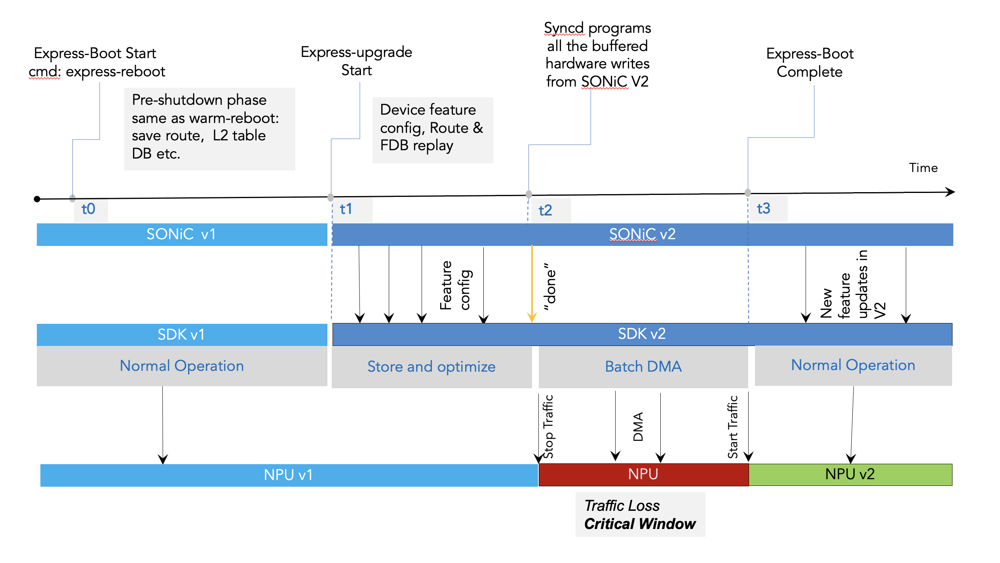
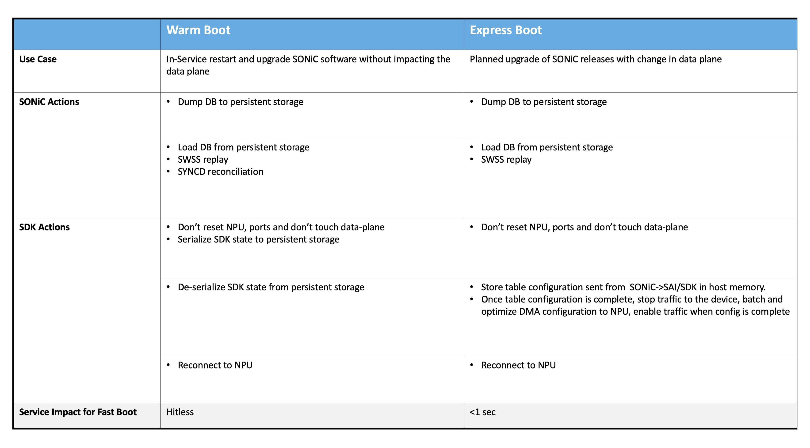

#
# Sonic Express reboot HLD Spec

## Overview

The goal of Sonic express reboot is to be able to restart and upgrade SONiC software with sub-second data plane interruption. This is achieved by not initializing external phys, and only initializing NPU after receiving all configuration updates. Figure 1 below illustrates how V1 and V2 version of sonic/SDK/NPU interacts as express boot progresses.

<p align=center>

</p>

It can be seen from Figure 1, it is possible that punt-header-v1 reachs SONIC-v2 or inject-header-v2 reachs NPU-v1 during t1 to t2 window. The punt and inject header changes are rare and not commom. Currently punt and inject header data structure differences between V1 and V2 are handled case by case basis in S1 SDK internally. A more generic and scalable approach for it is being planned and will be shared with the community as an express boot phase-2 once it is finalized. But in principle, maintaining backward compatibility in punt-inject-header if there are any changes is essential for successful express boot upgrades.

Figure 2 below compares major steps taken in warm boot and express boot from both SONiC and SDK point of view. 

<p align=center>

</p>

This document covers updates needed in Sonic and SAI interface. 

## fast-reboot script

The existing fast-reboot script ((https://github.com/sonic-net/sonic-utilities/blob/master/scripts/fast-reboot) that is used to trigger fast-reboot/warm-boot will be enhanced to support express-reboot. Major changes are:

1.	Enforce express-reboot is only applicable to Cisco 8000 platforms at the moment.
2.	During express-reboot shutdown path, syncd_request_shutdown will be called with a new option “-pxe” to inform syncd pre-shutdown for express boot mode. The actual calls will be “docker exec syncd /usr/bin/syncd_request_shutdown –pxe”.
3.	“SONIC_BOOT_TYPE=express” will be added to reboot cmdline to indicate express-reboot.

The rest flow is similar to warm-reboot. 

A new express-reboot script will be added as a soft link to fast-reboot script.

## Syncd 

Major changes in syncd components are:
1.	A new command line option “-pxe” will be added to syncd_request_shutdown program for indication of express boot pre-shutdown. New RequestShutdownCommandLineOptions enum _syncd_restart_type_t for express boot will also be added:

```
    typedef enum _syncd_restart_type_t
    {
        SYNCD_RESTART_TYPE_COLD,
        SYNCD_RESTART_TYPE_WARM,
        SYNCD_RESTART_TYPE_FAST,
        SYNCD_RESTART_TYPE_PRE_SHUTDOWN,
        SYNCD_RESTART_TYPE_EXPRESS,
        SYNCD_RESTART_TYPE_EXPRESS_PRE_SHUTDOWN,
    } syncd_restart_type_t;
```

2.	New express boot mode will be added to syncd CommandLineOptions:

```
#define STRING_SAI_START_TYPE_EXPRESS_BOOT      "express"
    typedef enum _sai_start_type_t
    {
        SAI_START_TYPE_COLD_BOOT = 0,
        SAI_START_TYPE_WARM_BOOT = 1,
        SAI_START_TYPE_FAST_BOOT = 2,

        /**
         * A special type of boot used by Mellanox platforms to start in 'fastfast'
         * boot mode
         */
        SAI_START_TYPE_FASTFAST_BOOT = 3,

        /**
         * A special type of boot used by Cisco platforms to start in 'express'
         * boot mode
         */
        SAI_START_TYPE_EXPRESS_BOOT = 4,

        /**
         * Set at last, just for error purpose.
         */
        SAI_START_TYPE_UNKNOWN
    } sai_start_type_t;
```

3.	During express boot pre-shutdown, syncd sets SAI_SWITCH_ATTR_FAST_API_ENABLE = true in setPreShutdownOnAllSwitches() to notify SDK to prepare for next express boot. This includes not initializing external phys during reboot, and only re-initializing NPU once configuration done notification is received.

```
sai_status_t Syncd::setPreShutdownOnAllSwitches()
{
	    if (shutdownType == SYNCD_RESTART_TYPE_EXPRESS) 
      {
        	status = setFastAPIEnableOnAllSwitches();
      }
}

sai_status_t Syncd:: setFastAPIEnableOnAllSwitches()
{
    sai_attribute_t attr;
    attr.id = SAI_SWITCH_ATTR_FAST_API_ENABLE;
    attr.value.booldata = true;
    for (auto& sw: m_switches)
    {
        auto rid = sw.second->getRid();
        sai_status_t status = m_vendorSai->set(SAI_OBJECT_TYPE_SWITCH, rid, &attr);
    }
}
```

4.	Initialization
   
During syncd vendorSai initialization after express boot, SAI_KEY_BOOT_TYPE will be set to SAI_START_TYPE_EXPRESS_BOOT to indicate express boot. OCP SAI SAI_KEY_BOOT_TYPE attribute will be updated to include express boot type.

5.	Config Done notification

SDK needs a notification once all configurations are restored after express boot. Express boot follows the same logic used in the FASTFAST boot for this. SAI_SWITCH_ATTR_FAST_API_ENABLE will be set after receive SAI_REDIS_NOTIFY_SYNCD_APPLY_VIEW:

```
sai_status_t Syncd::processNotifySyncd()
{
    …
        else if (redisNotifySyncd == SAI_REDIS_NOTIFY_SYNCD_APPLY_VIEW)
        {
            …
            if (m_commandLineOptions->m_startType == SAI_START_TYPE_FASTFAST_BOOT ||
                m_commandLineOptions->m_startType == SAI_START_TYPE_EXPRESS_BOOT)
            {
                // fastfast/express boot configuration end

                status = onApplyViewInFastFastBoot();
            }
        }
}
```


It can be seen that SAI_SWITCH_ATTR_FAST_API_ENABLE, which was originally introduced for fastfast boot, is being leveraged for express boot. The table below shows its settings and meanings for both express and fastfast boot cases.

| SAI_SWITCH_ATTR_FAST_API_ENABLE | Express boot | Fastfast boot | Meaning |
|--------------------------------|--------------|---------------|---------|
| TRUE | Pre-shut | Not used | Pre-shutdown indication for express boot  |
| FALSE | Post-boot | Post-boot | Signals SAI to begin the bulk programming post-boot|


## Build infra

docker_image_ctl.j2 will be updated to include express boot type so that {service}.sh files will be able to handle express boot 

## Host-services

Sonic-host-services will need update to correctly reflect reboot-reason as “express” in “show reboot-reason” when express-reboot is executed.

