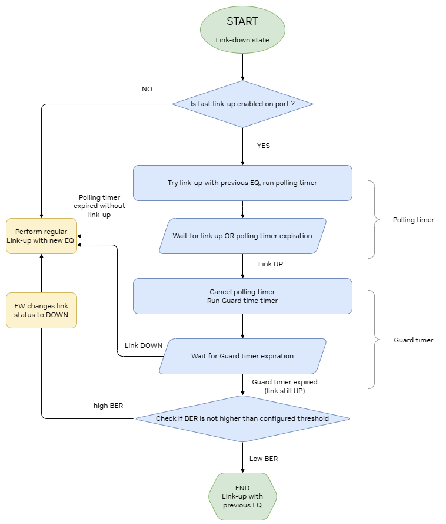
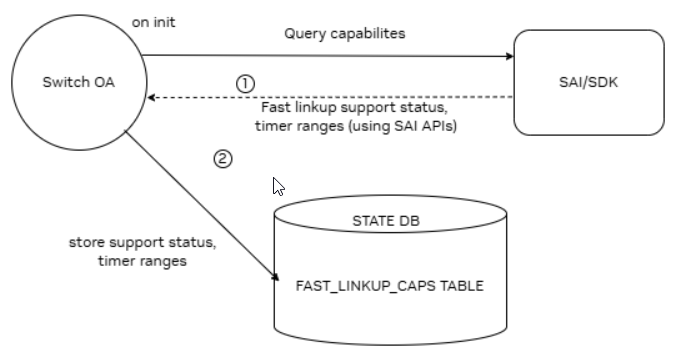
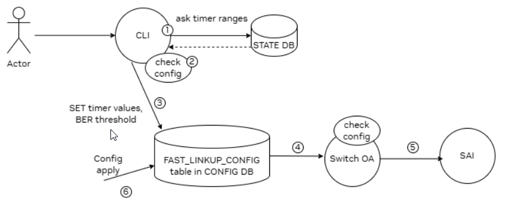
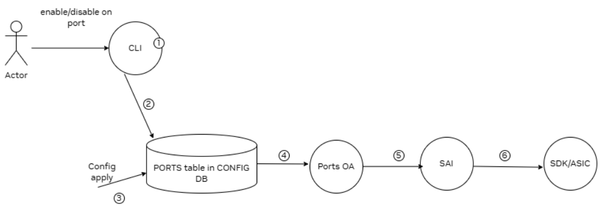

# SONiC Fast Link-Up

## High Level Design document

## Table of contents

- [Revision](#revision)
- [Scope](#scope)
- [1 Introduction](#1-introduction)
  - [1.1 Feature overview](#11-feature-overview)
  - [1.2 Requirements](#12-requirements)
    - [1.2.1 Functionality](#121-functionality)
    - [1.2.2 Command interface](#122-command-interface)
    - [1.2.3 Error handling](#123-error-handling)
    - [1.2.4 Event logging](#124-event-logging)
- [2 Design](#2-design)
  - [2.1 Flows](#21-flows)
    - [2.1.1 Capability discovery on switch init](#211-capability-discovery-on-switch-init)
    - [2.1.2 Global parameters configuration](#212-global-parameters-configuration)
    - [2.1.3 Per-port enablement](#213-per-port-enablement)
  - [2.2 SAI API](#22-sai-api)
  - [2.3 Orchestration agent](#23-orchestration-agent)
    - [2.3.1 Switch orch](#231-switch-orch)
    - [2.3.2 Ports orch](#232-ports-orch)
  - [2.4 CLI](#24-cli)
    - [2.4.1 Command structure](#241-command-structure)
    - [2.4.2 Usage examples](#242-usage-examples)
  - [2.5 DB schema](#25-db-schema)
    - [2.5.1 Config DB](#251-config-db)
      - [2.5.1.1 SWITCH_FAST_LINKUP (Switch OA)](#2511-switch_fast_linkup-switch-oa)
      - [2.5.1.2 PORT (Ports OA)](#2512-port-ports-oa)
    - [2.5.2 State DB](#252-state-db)
      - [2.5.2.1 Fast link-up capabilities](#2521-fast-link-up-capabilities)
    - [2.5.3 Data sample](#253-data-sample)
    - [2.5.4 Configuration sample](#254-configuration-sample)
    - [2.5.5 Initial configuration](#255-initial-configuration)
    - [2.5.6 Configuration migration](#256-configuration-migration)
  - [2.6 YANG model](#26-yang-model)
- [3 Test plan](#3-test-plan)
  - [3.1 Unit tests](#31-unit-tests)
  - [3.2 Verification - TBD](#32-verification---tbd)

## Revision

| Rev | Date       | Author            | Description |
|:---:|:----------:|:-----------------:|:------------|
| 0.1 | TBD        | Yair Raviv        | Initial version       |

## Scope

This document describes the high level design of the Fast Link-Up feature in SONiC.


# 1 Introduction

## 1.1 Feature overview

Fast Link-Up reduces link recovery time by attempting to bring links up using the last-known-good equalization (EQ) parameters from the previous successful session (“Just-Do-Fast”), instead of running a full tuning sequence after a link flap. The feature is applied only on link recovery events.

Key points:
1. Operation model (recovery-only): on link flap, ASIC FW first tries fast link-up by reusing the prior EQ. If unsuccessful within the polling window, regular link-up is executed.
2. Quality gate: when link reaches UP via fast path, a guard timer starts; at expiry, BER is checked against a configured threshold to decide whether to keep the fast path or fall back to regular link-up.
3. Configuration model:
   - Global parameters on the switch:
     - polling_time (sec): max time to attempt fast link-up before falling back.
     - guard_time (sec): period the link must remain UP with acceptable BER.
     - ber_threshold (exponent): acceptable BER as 1e-<E> (e.g., 12 → 1e-12).
   - Per-port enable/disable: controls whether fast link-up is attempted for that port.
4. Capability-gated: on init, SONiC queries SAI for support and optional ranges; configuration is accepted only if supported and values are within published ranges.

## 1.2 Requirements

### 1.2.1 Functionality

Functional requirements:
1. The system shall discover Fast Link-Up capability and optional min/max ranges on init and publish them to `STATE_DB:SWITCH_CAPABILITY|switch`.
2. The system shall allow configuring global parameters `polling_time`, `guard_time`, `ber_threshold` via `SWITCH_FAST_LINKUP|GLOBAL`, validating support and enforcing published ranges.
3. The system shall allow enabling/disabling Fast Link-Up per port using `PORT|<ifname>:fast_linkup` and program `SAI_PORT_ATTR_FAST_LINKUP_ENABLED` when supported.
4. The system shall attempt fast bring-up on link recovery, and shall fall back to regular link-up if the fast attempt fails or BER exceeds the configured threshold at `guard_time` expiry.
5. The system shall expose configuration and status via CLI (`config switch-fast-linkup`, `config interface fast-linkup`, `show` commands) and model the global container in YANG.


### 1.2.2 Command interface

Config section:
- `config switch-fast-linkup global [--polling-time <sec>] [--guard-time <sec>] [--ber <exp>]`
- `config interface fast-linkup <interface_name> <enabled|disabled>`

Show section:
- `show switch-fast-linkup global [--json]`
- `show interfaces fast-linkup status`

Notes:
- Invalid or out-of-range global values are rejected with a clear error.
- On unsupported platforms, global configuration is rejected; per-port changes become a safe no-op.

### 1.2.3 Error handling

Frontend (CLI):
- Missing parameters
- Invalid parameter value
- Out‑of‑range parameter
- Unsupported platform

Backend (OA):
- Missing parameters
- Invalid parameter value
- Out‑of‑range parameter
- Unsupported operation on `SWITCH_FAST_LINKUP`
- Capability/range query failure
- SAI set/get failure (switch/port)
- Per‑port attribute set failure

### 1.2.4 Event logging

Frontend (CLI):
- Global fast-linkup configuration applied
- Global fast-linkup configuration failed

###### Table 1: Frontend event logging

| Event                                   | Severity |
|:----------------------------------------|:---------|
| Global fast-linkup configuration applied| INFO     |
| Global fast-linkup configuration failed | ERROR    |

Backend (SWSS):
- Fast-linkup capability query failed
- Global fast-linkup parameters applied on switch (SAI)
- Global fast-linkup parameter apply failed (SAI)
- Out-of-range global configuration rejected
- Unsupported operation on SWITCH_FAST_LINKUP
- Unknown field in SWITCH_FAST_LINKUP ignored
- Per-port fast_linkup applied (SAI)
- Per-port fast_linkup apply failed (SAI)
- Fast-linkup not supported (switch/port path)

###### Table 2: Backend event logging

| Event                                             | Severity |
|:--------------------------------------------------|:---------|
| Capability query failed                           | ERROR    |
| Global parameters applied on switch (SAI)         | INFO     |
| Global parameter apply failed (SAI)               | ERROR    |
| Out-of-range global configuration rejected        | NOTICE   |
| Unsupported operation on SWITCH_FAST_LINKUP       | ERROR    |
| Unknown field in SWITCH_FAST_LINKUP ignored       | WARN     |
| Per-port fast_linkup applied (SAI)                | INFO     |
| Per-port fast_linkup apply failed (SAI)           | ERROR    |
| Fast-linkup not supported (switch/port path)      | NOTICE   |


# 2 Design

## 2.1 Flows

The design consists of:
- Capability discovery via `STATE_DB` populated by platform components.
- Global configuration via `CONFIG_DB:SWITCH_FAST_LINKUP|GLOBAL` modeled in YANG.
- Per-port control via `CONFIG_DB:PORT|<ifname>:fast_linkup`.
- Orchestration in SWSS to program SAI `SAI_PORT_ATTR_FAST_LINKUP_ENABLED` when supported.

###### Figure 1: Architecture overview



###### Figure 2: Capability discovery on switch init



### 2.1.1 Capability discovery on switch init

On orchagent init, `switchorch` queries SAI for support and optional ranges of Fast Link-Up attributes and publishes them into `STATE_DB:SWITCH_CAPABILITY|switch`. These values are used by CLI validation and to guard orchestration paths. See Figure 2.

### 2.1.2 Global parameters configuration

###### Figure 3: Global parameters configuration



Flow:
- User invokes `config switch-fast-linkup global [--polling-time ...] [--guard-time ...] [--ber ...]`.
- CLI reads `STATE_DB` capabilities, validates support and ranges, and writes to `CONFIG_DB:SWITCH_FAST_LINKUP|GLOBAL`.
- `switchorch` validates again (for config-apply) and programs switch SAI attributes.

### 2.1.3 Per-port enablement

###### Figure 4: Per-port enablement



Flow:
- User invokes `config interface fast-linkup <ifname> <enabled|disabled>`.
- CLI updates `CONFIG_DB:PORT|<ifname>:fast_linkup` (with alias handling as applicable).
- `portsorch` checks capability and sets `SAI_PORT_ATTR_FAST_LINKUP_ENABLED` for the port when supported (safe no-op otherwise).

## 2.2 SAI API

- Switch attributes:
  - `SAI_SWITCH_ATTR_FAST_LINKUP_POLLING_TIME_RANGE` (read-only)
  - `SAI_SWITCH_ATTR_FAST_LINKUP_POLLING_TIME`
  - `SAI_SWITCH_ATTR_FAST_LINKUP_GUARD_TIME_RANGE` (read-only)
  - `SAI_SWITCH_ATTR_FAST_LINKUP_GUARD_TIME`
  - `SAI_SWITCH_ATTR_FAST_LINKUP_BER_THRESHOLD`
- Port attribute:
  - `SAI_PORT_ATTR_FAST_LINKUP_ENABLED` (boolean)

## 2.3 Orchestration agent

### 2.3.0 Overview

The orchestration agent (OA) is extended to support Fast Link-Up through a new `SWITCH_FAST_LINKUP` Config DB table and a new per-port field in the `PORT` table. The design follows the standard producer-consumer model:
- Switch-level logic (capability discovery and global parameter application) is handled by `switchorch`.
- Port-level logic (per-interface enable/disable) is handled by `portsorch`.

Key responsibilities:
- Discover and publish capability (support flag and optional ranges) into `STATE_DB:SWITCH_CAPABILITY|switch`.
- Validate and apply global parameters to the switch object using SAI.
- Validate and apply per-port enable/disable using a dedicated SAI port attribute when supported; otherwise safe no-op.
- Preserve unspecified global fields (partial update semantics) and ensure idempotent programming.
- Log success/failure events as described in the Event logging section.

### 2.3.1 Switch orch

Responsibilities:
1) Capability discovery and publish
   - On init, `setFastLinkupCapability()` queries:
     - Support: by checking create/set capability for `SAI_SWITCH_ATTR_FAST_LINKUP_POLLING_TIME`.
     - Ranges (optional): `SAI_SWITCH_ATTR_FAST_LINKUP_POLLING_TIME_RANGE`, `SAI_SWITCH_ATTR_FAST_LINKUP_GUARD_TIME_RANGE`.
   - Results are cached in `m_fastLinkupCap` and published to `STATE_DB:SWITCH_CAPABILITY|switch`:
     - `FAST_LINKUP_CAPABLE`
     - `FAST_LINKUP_POLLING_TIMER_RANGE` (if available)
     - `FAST_LINKUP_GUARD_TIMER_RANGE` (if available)

2) Global configuration apply
   - `doCfgSwitchFastLinkupTableTask(Consumer&)` handles updates under `SWITCH_FAST_LINKUP|GLOBAL`.
   - Builds `FastLinkupConfig` from provided fields; unknown fields are logged and ignored.
   - `setSwitchFastLinkup(const FastLinkupConfig&)`:
     - Validates values against cached ranges when available (partial updates supported).
     - Programs SAI switch attributes for provided fields only:
       - `SAI_SWITCH_ATTR_FAST_LINKUP_POLLING_TIME`
       - `SAI_SWITCH_ATTR_FAST_LINKUP_GUARD_TIME`
       - `SAI_SWITCH_ATTR_FAST_LINKUP_BER_THRESHOLD`
     - Emits a single INFO summary line indicating which fields were applied (set/skipped).

3) Error handling and invariants
   - If capability is not supported: emit NOTICE and return without SAI calls (safe no-op).
   - Out-of-range values (when ranges known): reject and do not program SAI.
   - SAI failures when setting attributes: log status and stop applying subsequent attributes for the same update.
   - Unsupported operations on `SWITCH_FAST_LINKUP` and unknown fields are logged and ignored.
   - Ensures idempotent programming: re-applying the same values is harmless.

### 2.3.2 Ports orch

Responsibilities:
1) Capability detection
   - On init, checks port-level capability using `querySwitchCapability(SAI_OBJECT_TYPE_PORT, SAI_PORT_ATTR_FAST_LINKUP_ENABLED)` and caches the result in `m_fastLinkupPortAttrSupported`.

2) Per-port configuration apply
   - On `PORT|<ifname>` updates, `setPortFastLinkupEnabled(Port&, bool)` applies the per-port enable/disable:
     - If the attribute is supported, sets `SAI_PORT_ATTR_FAST_LINKUP_ENABLED` accordingly.
     - If not supported, emits NOTICE and returns success without programming SAI (safe no-op).

3) Integration details
   - Operates on canonical interface names; CLI takes care of alias resolution before writing Config DB.
   - Namespace-aware through the standard SONiC framework (no special handling unique to this feature).
   - Error paths from SAI are logged with ERROR and surfaced via standard task status propagation.

## 2.5 DB schema

### 2.5.1 Config DB

#### 2.5.1.1 SWITCH_FAST_LINKUP (Switch OA)

```abnf
; defines schema for switch fast link-up configuration attributes
key = SWITCH_FAST_LINKUP|GLOBAL ; switch fast link-up global. Must be unique

; field         = value
polling_time    = 1*5DIGIT   ; time (in sec) to attempt fast link-up before fallback
guard_time      = 1*3DIGIT   ; time (in sec) to verify link quality (BER gate)
ber_threshold   = 1*2DIGIT   ; BER negative exponent (e.g., 12 => 1e-12)
```

Note:
- Partial updates are allowed; unspecified fields are preserved.

#### 2.5.1.2 PORT (Ports OA)

```abnf
; per-port fast link-up enable/disable
key = PORT|ifname             ; ifname must be unique

; field       = value
fast_linkup   = "true" / "false"  ; feature status (default "false")
```

### 2.5.2 State DB

#### 2.5.2.1 Fast link-up capabilities

```abnf
; defines schema for switch fast link-up capabilities
key = SWITCH_CAPABILITY|switch ; must be unique

; field                                  = value
FAST_LINKUP_CAPABLE                       = capability-knob ; whether fast link-up is supported
FAST_LINKUP_POLLING_TIMER_RANGE           = range-list      ; allowed polling_time values "min,max"
FAST_LINKUP_GUARD_TIMER_RANGE             = range-list      ; allowed guard_time values "min,max"

; value annotations
capability-knob = "true" / "false"
range-list      = 1*DIGIT "," 1*DIGIT
```

### 2.5.3 Data sample

Config DB:
```bash
redis-cli -n 4 HGETALL 'SWITCH_FAST_LINKUP|GLOBAL'
1) "polling_time"
2) "60"
3) "guard_time"
4) "10"
5) "ber_threshold"
6) "12"

redis-cli -n 4 HGETALL 'PORT|Ethernet0'
1) "fast_linkup"
2) "true"
```

State DB:
```bash
redis-cli -n 6 HGETALL 'SWITCH_CAPABILITY|switch'
1) "FAST_LINKUP_CAPABLE"
2) "true"
3) "FAST_LINKUP_POLLING_TIMER_RANGE"
4) "5,120"
5) "FAST_LINKUP_GUARD_TIMER_RANGE"
6) "1,20"
```

### 2.5.4 Configuration sample

config_db.json:
```json
{
  "SWITCH_FAST_LINKUP": {
    "GLOBAL": {
      "polling_time": "60",
      "guard_time": "10",
      "ber_threshold": "12"
    }
  },
  "PORT": {
    "Ethernet0": {
      "fast_linkup": "true"
    }
  }
}
```

## 2.4 CLI

### 2.4.1 Command structure

User interface:
```
config
|--- switch-fast-linkup
|    |--- global [OPTIONS]
|
|--- interface
     |--- fast-linkup <IFNAME> <enabled|disabled> [OPTIONS]

show
|--- switch-fast-linkup
|    |--- global [--json]
|
|--- interfaces
     |--- fast-linkup
          |--- status
```

Options:

config switch-fast-linkup global
1. `--polling-time <uint16>`  - time (sec) to attempt fast link-up (validated against STATE_DB range if present)
2. `--guard-time <uint8>`     - time (sec) to verify link quality (validated against STATE_DB range if present)
3. `--ber|--ber-threshold <int8>` - BER exponent (e.g., 12 => 1e-12)

config interface fast-linkup
1. `<IFNAME>`                 - interface name (alias supported by CLI)
2. `<enabled|disabled>`       - enable/disable per-port fast link-up

show switch-fast-linkup global
1. `--json`                   - display in JSON format

### 2.4.2 Usage examples

- Global show:
  - `show switch-fast-linkup global`
  - `show switch-fast-linkup global --json`
  - Output table (example):
    ```
    +---------------+-------+
    | Field         | Value |
    +---------------+-------+
    | polling_time  | 60    |
    | guard_time    | 10    |
    | ber_threshold | 12    |
    +---------------+-------+
    ```
  - Output JSON (example):
    ```json
    {
      "polling_time": "60",
      "guard_time": "10",
      "ber_threshold": "12"
    }
    ```

- Global config:
  - `config switch-fast-linkup global [--polling-time <sec>] [--guard-time <sec>] [--ber <exp>]`
  - Behavior: validates platform capability and enforces min/max ranges from STATE_DB; partial updates preserve unspecified fields.
  - Error cases:
    - Unsupported platform → non-zero exit with a clear error.
    - Out-of-range value → non-zero exit and a message with supported range.

- Per-interface show:
  - `show interfaces fast-linkup status`
  - Output (example):
    ```
    -------------------------------
    | Interface | fast_linkup     |
    |-----------+-----------------|
    | Ethernet0 | true            |
    | Ethernet4 | false           |
    -------------------------------
    ```

- Per-interface config:
  - `config interface fast-linkup Ethernet0 enabled`
  - `config interface fast-linkup Ethernet0 disabled`
  - Notes:
    - Interface aliases are converted automatically when alias mode is enabled.
    - On multi-ASIC systems, namespace can be supplied and is propagated to backend.
    - If the platform does not support the SAI attribute, SWSS safely no-ops (no disruptive errors).

## 2.6 YANG model

New YANG module `sonic-fast-linkup.yang` models the global configuration:

Skeleton code:
```yang
module sonic-fast-linkup {
  yang-version 1.1;
  namespace "http://github.com/sonic-net/sonic-fast-linkup";
  prefix sfl;

  description "YANG model for SWITCH_FAST_LINKUP global configuration.";

  revision 2025-10-20 {
    description "First Revision";
  }

  container sonic-fast-linkup {
    container SWITCH_FAST_LINKUP {
      description "SWITCH_FAST_LINKUP part of config_db.json";

      container GLOBAL {
        leaf polling_time {
          description "Time (in seconds) to attempt fast link-up before fallback";
          type uint16;
        }
        leaf guard_time {
          description "Time (in seconds) to verify link quality (BER gate)";
          type uint16;
        }
        leaf ber_threshold {
          description "BER negative exponent; 12 => 1e-12";
          type uint8;
        }
      }
      /* end of container GLOBAL */
    }
    /* end of container SWITCH_FAST_LINKUP */
  }
  /* end of container sonic-fast-linkup */
}
/* end of module sonic-fast-linkup */
```

Notes:
- The YANG module provides type/structure validation for `SWITCH_FAST_LINKUP|GLOBAL` during `config apply/replace`.
- Platform min/max ranges (from STATE_DB) are enforced at runtime by the CLI; dynamic ranges are not modeled in YANG.
- Per-port enable/disable remains a `PORT` table field (`PORT|<ifname>:fast_linkup`) and follows the existing `sonic-port.yang`.

# 3 Test plan

## 3.1 Unit tests

- SWSS (orchagent, VS)
  - Capability publish (STATE_DB)
  - Global apply → ASIC DB switch attributes set
  - Global range enforcement (negative match when ranges exist)
  - Per-port fast_linkup toggle → SAI port attribute

- CLI (sonic-utilities)
  - Global config on unsupported platform
  - Global range validation (frontend)
  - Show global JSON equals CONFIG_DB
  - Show interfaces fast-linkup status
  - Interface fast-linkup enable/disable
  - Enable fast-linkup when not supported (fails)

## 3.2 Verification - TBD

---


