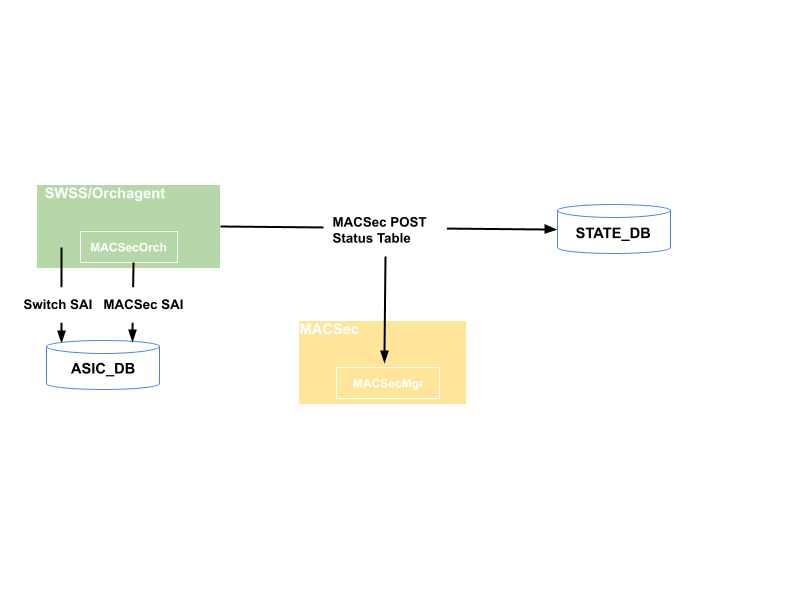
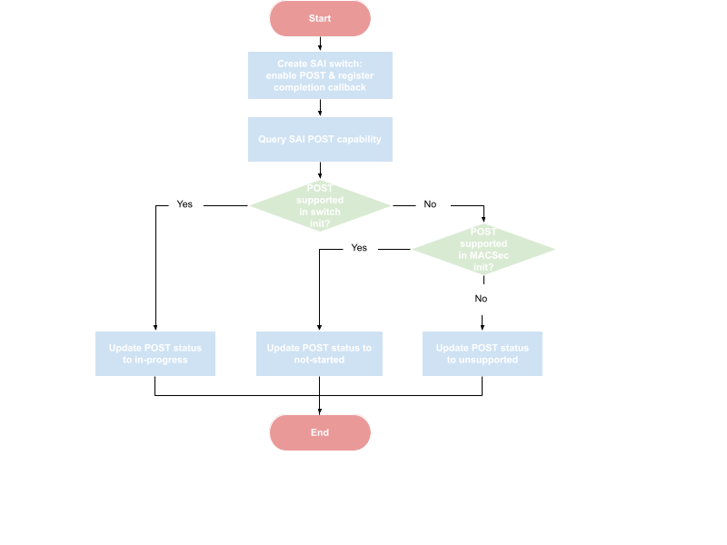
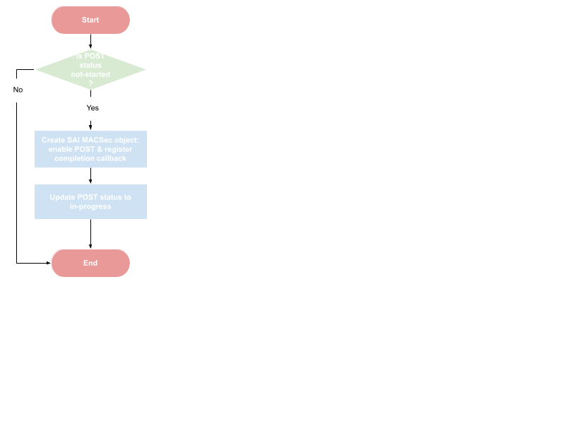
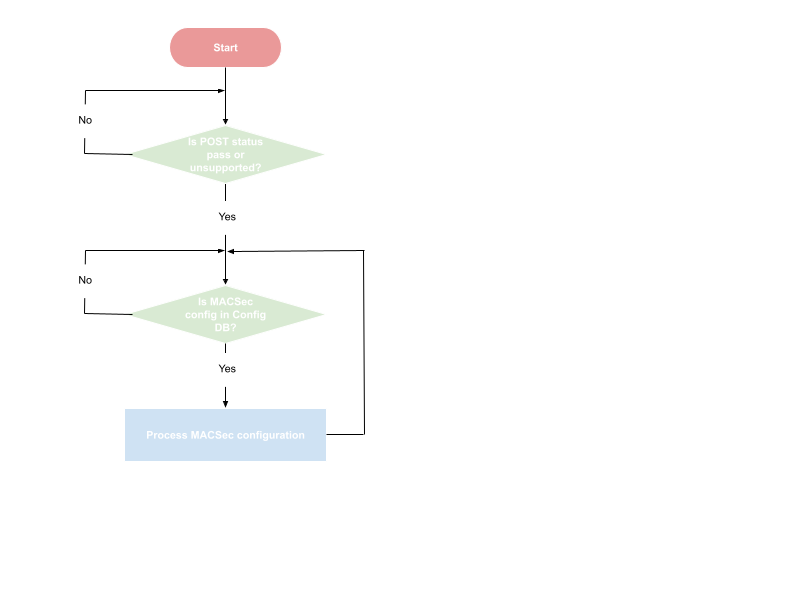

# SONiC FIPS POST support

## Revision
| Rev |     Date    |       Author       | Change Description |      
|:---:|:-----------:|:------------------:|--------------------|
| 1 | Jul-7 2025 | Song Yuan (Arista Networks) | Initial Version |

## Table of Contents
* [Overview](#Overview)
* [Design requirements](#Design-requirements)
* [Deisgn details](#Design-details)
  * [State DB](#State-DB)
  * [Enabling POST in SAI switch init](#Enabling-POST-in-SAI-switch-init)
  * [Enabling POST in SAI MACSec init](#Enabling-POST-in-SAI-MACSec-init)
  * [Checking SAI POST status](#Checking-SAI-POST-status)
  * [Handling SAI POST failure](#Handling-SAI-POST-failure)
  * [Enforcing FIPS compliance](#Enforcing-FIPS-compliance)

## Overview

This document describes SONiC design for Federal Information Processing Standards (FIPS) 140-3 standard compliance. Especially, the focus of the document is to trigger Pre-Operational Self-Test (POST) in SONiC and also ensure SONiC’s behavior is compliant to FIPS standard after POST.

## Design requirements

The design must meet the following requirements:
- In order to accommodate different forwarding ASIC architecture or SAI implementation, the design should support enabling POST at either switch level (during switch init) or at MACSec engine level (during MACSec engine init).
- SONiC MACSec configuration must be processed only after POST passes. 
- POST failure must not affect the operation of non-MACSec ports.
- Explicit visibility must be provided if POST fails, for example, in syslog. The syslog message must include the details of the failure. For example, SAI object Id of ports that fail POST and the corresponding MACSec engine.

## Deisgn details

The following figure depicts the data flow and SONiC components in the design. Orchagent is responsible for triggering POST via SAI calls and publishing POST status in State DB.   MACSec container, precisely MACSecMgr, is enhanced to be POST aware and only process MACSec configuration after POST has passed. 



### State DB

The following table is added to State DB to track POST status.
```
POST_STATUS_TABLE

;Store POST status

key    = POST_STATUS_TABLE|macsec
status = "in-progress"    ; POST is in-progress.
         "not-started"    ; POST was not enabled in switch init.
         "pass"           ; POST passed.
         "fail"           ; POST failed. 
         "unsupported"    ; POST is not supported by SAI.

```

### Enabling POST in SAI switch init

Orchagent enables POST when creating SAI switch regardless of whether the MACSec feature is supported or enabled. This can avoid triggering POST after SAI switch creation, e.g., MACSec feature is enabled later. The below flow chart depicts the process.



Orchagent enables POST when creating SAI switch. After SAI switch is created, Orchagent queries SAI POST capability. If POST is supported in switch init, Orchagent sets POST status to in-progress and waits for POST completion callback. Otherwise, if POST is supported only in MACSec init, Orchagent sets POST status to not-started, which informs MACSecOrch of performing POST in its initialization.

If POST is not supported in either switch or MACSec init, then SAI does not support POST. The possible scenarios are:
- The platform does not support MACSec. Or
- The platform does support MACSec. But the deployment does not require FIPS compliance. Or
- The platform does support MACSec, and the vendor incrementally supports FIPS when they can.

In the above scenarios, Orchagent sets POST status to unsupported, which means POST is not required and is no-op.

### Enabling POST in SAI MACSec init

POST is performed by MACSecOrch when POST is supported only in MACSec init. The following flow chart demonstrates the process.



POST is triggered in MACSecOrch initialization. Since POST is enabled via SAI MACSec create API, SAI MACSec object may be created proactively and before any MACSec port is configured.

### Checking SAI POST status

Since SAI supports POST completion callback, a callback or notification function is provided when enabling POST in SAI switch or MACSec creation. Once being invoked, the callback function sets POST status in State DB accordingly based on the POST status returned by SAI.

### Handling SAI POST failure

If SAI POST fails,  MACSecOrch reads POST status of all MACSec ports and finds out which port has failed in POST.  MACSecOrch then adds the details of the failure in syslog.

### Enforcing FIPS compliance

In order to be compliant to FIPS, SONiC should process MACSec configuration only after POST passes. This is achieved by enhancing MACSecMgr, running in MACSec container, to check POST status published in State DB before processing any MACSec configuration, as shown in the flow chart below:

