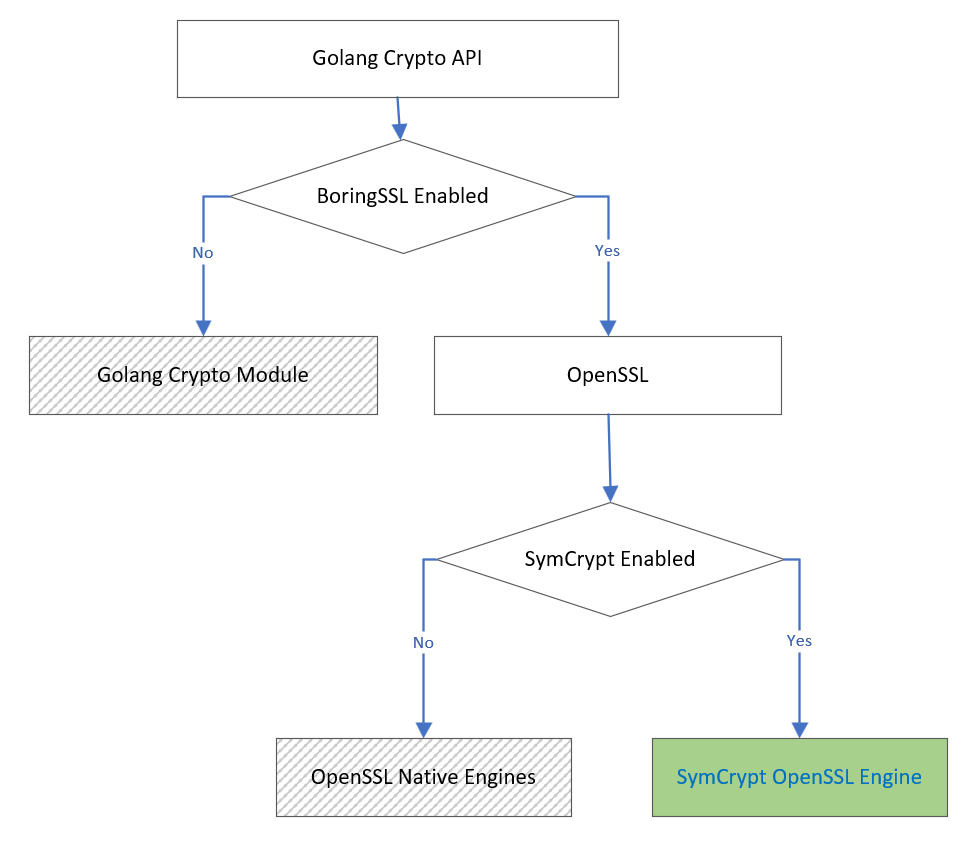

# SONIC OpenSSL FIPS 140-3 HLD

## Revision

|  Rev  | Date       | Author     | Change Description |
| :---: | :--------: | :--------: | ------------------ |
|  0.1  | 2022-02-22 | Xuhui Miao | Initial version    |
|  0.2  | 2022-07-07 | Xuhui Miao | Update Fips config |

## Table of Contents
- [Abbreviation](#abbreviation)
- [Requirement](#requirement)
- [The cryptographic modules in SONiC](#the-cryptographic-modules-in-SONiC)
- [OpenSSL FIPS 140-3](#OpenSSL-FIPS-140-3)
  * [OpenSSL Engine](#OpenSSL-Engine)
  * [SymCrypt OpenSSL Engine](#symCrypt-openSSL-engine)
  * [OpenSSL configuration for SymCrypt Engine](#OpenSSL-configuration-for-SymCrypt-Engine)
  * [OpenSSL configuration enhancement](#OpenSSL-configuration-enhancement)
  * [SymCrypt OpenSSL Engine debian package](#SymCrypt-OpenSSL-Engine-debian-package)
- [Kerberos Cryptographic Module](#Kerberos-Cryptographic-Module)
- [Golang Cryptographic Module](#Golang-Cryptographic-Module)
- [Application Impact](#Application-Impact)
- [SONiC FIPS Configuration](#SONiC-FIPS-Configuration)
  * [Enable FIPS on system level](#Enable-FIPS-on-system-level)
  * [Enable FIPS on application level](#Enable-FIPS-on-application-level)
  * [SONiC Build Options](#SONiC-Build-Options)
- [SONiC FIPS Command lines](#SONiC-FIPS-Command-lines)
- [Q&A](#Q&A)


## Abbreviation

| Abbreviation | Description                                  |
| ------------ | -------------------------------------------- |
| CAVP         | Cryptographic Algorithm Validation Program   |
| CST          | Cryptographic and Security Test              |
| CMVP         | Cryptographic Module Validation Program      |
| FIPS         | Federal Information Processing Standard      |

## Requirement
SONiC only uses cryptographic modules validated by FIPS 140-3, Make SONiC compliant with FIPS 140-3.

## The cryptographic modules in SONiC

| Module   | Use Scenarios | Description                                                |
| -------------------- | --------------- | -------------------------------------------- |
| OpenSSL              | Python, OpenSSH | Cyptography and SSL/TLS ToolKit              |
| Kerberos             | OpenSSH         | Kerboros contains builtin crypto module      |
| Golang               | sonic-restapi   | Golang contains builtin crypto module         |
| Libgcrypto           | GPG             | A general purpose cryptographic library originally based on code from GnuPG |
| Kernel Crypto        | --              | Linux crypto kernel module |

## Scopes:
In Scopes:
1. OpenSSL
2. Kerberos
3. Golang

Out of Scopes:
1. Linux Kernel
2. Libgcrypt


## OpenSSL FIPS 140-3


### OpenSSL Engine
OpenSSL supports engine cryptographic modules in the form of engine objects, and provides a reference-counted mechanism to allow them to be dynamically loaded in and out of the running application. An engine object can implement one or all cryptographic algorithms.

### SymCrypt OpenSSL Engine
The [SymCrypt engine for OpenSSL (SCOSSL)](https://github.com/microsoft/SymCrypt-OpenSSL) allows the use of OpenSSL with [SymCrypt](https://github.com/microsoft/SymCrypt) as the provider for core cryptographic operations. It leverages the OpenSSL engine interface to override the cryptographic implementations in OpenSSL's libcrypto. The primary motivation for this is to support FIPS certification, as OpenSSL 1.1.1 does not have a FIPS-certified cryptographic module. Microsoft will submit the FIPS 140-3 reports for SymCrypt to CMVP.

The SymCrypt Engine is one of the implementation to support FIPS, The [wolfSSL engine](https://github.com/wolfSSL/wolfEngine) is another option.

### OpenSSL configuration for SymCrypt Engine

/usr/lib/ssl/openssl-fips.cnf 
```
openssl_conf = openssl_init
[ openssl_init ]
engines = engine_section

[ engine_section ]
symcrypt = symcrypt_section

[ symcrypt_section ]
engine_id = symcrypt
dynamic_path = /usr/lib/x86_64-linux-gnu/libsymcryptengine.so
default_algorithms = ALL
```

### OpenSSL configuration enhancement
When fips=1 is set in /proc/cmdline, the OpenSSL default config file is changed to "/usr/lib/ssl/openssl-fips.cnf", otherwise, the config file "/usr/lib/ssl/openssl.cnf" is used.

### SymCrypt OpenSSL Engine debian package
Provide SymCrypt OpenSSL debian package.
Package name: symcrypt-openssl
Current version: 0.1

Package file name example: symcrypt-openssl_0.1_amd64.deb
Files in the packages:
```
/usr/lib/ssl/openssl.cnf
/usr/lib/ssl/openssl-fips.cnf
/usr/lib/x86_64-linux-gnu/libsymcrypt.so
/usr/lib/x86_64-linux-gnu/libsymcryptengine.so
```

## Kerberos Cryptographic Module
Kerberos will use the builtin cryptographic module by default, but it allows to change the build option to use OpenSSl, see [MIT Kerberos features](https://web.mit.edu/kerberos/krb5-1.13/doc/mitK5features.html). SONiC will change the build option to use OpenSSL instead of the builtin one. It is not configurable to use the Kerberos builtin cryptographic module when OpenSSL used.

## Golang Cryptographic Module
Golang has its own cryptographic module (see [crypto](https://github.com/golang/go/tree/master/src/crypto)) without FIPS supports. There are some branches with branch name starting with "dev.boringcrypto" (see [golang branches](https://github.com/golang/go/branches/all?query=dev.boringcrypto)), changing the Golang cryptographic APIs' referenece to use [BoringSSL](https://github.com/google/boringssl). Although BoringSSL is an open source project, but it used by Google only, not intened for general use.

To support FIPS for Golang, RedHat offers an alternative solution (see [here](https://developers.redhat.com/blog/2019/06/24/go-and-fips-140-2-on-red-hat-enterprise-linux)), it builds on top of the Golang's dev.bringcrypt branches, has ability to call into OpenSSL, not BoringSSL. SONiC can reuse the RedHat sulotion, one difference is that RedHat supports FIPS for OpenSSL directly, SONiC uses OpenSSL Engine.

How OpenSSL Engine works in Golang?


When FIPS enabled, both of the BoringSSL Enable Option and the SymCrypt Enabled option will be set.


## Application Impact
Some of functions of a application might be broken when using the cryptographic algorithms that are not FIPS compliant. It is relied on the tests of the applications to detect all the impact functions.
For OpenSSH, Centos provides a [patch](https://git.centos.org/rpms/openssh/raw/c8/f/SOURCES/openssh-7.7p1-fips.patch) which is compiant with FIPS 140-2. We can apply the patch and verify if it can pass all the OpenSSH test cases when FIPS enabled.

## SONiC FIPS Configuration

### Enable FIPS on system level
Set the Linux System parameter sonic_fips=1, to validate if the FIPS is enabled:
```
grep 'sonic_fips=1' /proc/cmdline
```

There is another parameter fips=1 supported for SymCrypt OpenSSL to enable FIPS. The parameter will enable the Linux Kernel FIPS, but the Linux Kernel FIPS is not supported yet, and it is out of scope in this document. In future, when the FIPS is supported by SONiC Linux Kernel, and the parameter fips=1 has already set, it is not necessary to set sonic_fips=1.

For grub, one of implemetation as below:
cat /etc/grub.d/99-fips.cfg
```
GRUB_CMDLINE_LINUX_DEFAULT="$GRUB_CMDLINE_LINUX_DEFAULT sonic_fips=1"
```

For uboot, use fw_setenv to variable linuxargs to change the boot options.
```
OTHER_OPTIONS=$(fw_printenv linuxargs | sed 's/linuxargs=//')
fw_setenv linuxargs "$OTHER_OPTIONS sonic_fips=1"
```

For Aboot, add the config in /host/image-{version}/kernel-cmdline, example:
```
reboot=p console=ttyS0 acpi=on Aboot=Aboot-norcal7-7.2.0-pcie2x4-6128821 <other parameters...> sonic_fips=1
```

### Enable FIPS on application level
```
export ENABLE_FIPS=1
```

Alternative option for the golang applications only:
```
export GOLANG_FIPS=1
```

Alternative option for the OpenSSL applications only:

see https://www.openssl.org/docs/manmaster/man7/openssl-env.html
```
export OPENSSL_CONFIG=/usr/lib/ssl/openssl-fips.cnf
```

### SONiC Build Options
Support to enable/disable the FIPS feature, the feature is enabled by default in rules/config as below.
```
ENABLE_FIPS_FEATURE ?= y
```
Support to enable/disable FIPS config, the flage is disabled by default. IF the option is set, then the fips is enabled by default in the image, not necesary to do the config in system level or application level.
```
ENABLE_FIPS ?= n
```
If the ENABLE_FIPS_FEATURE is not set, then the option ENABLE_FIPS is useless.

## SONiC FIPS Command lines
### The command line to enable or disable FIPS
sonic-installer set-fips <image> [--enable-fips|--disable-fips]

If the image is not specified, the next boot image will be used.
The default behavior is to enable FIPS, if none of the option --enable-fips or --disable-fips specified.

### The command line to show FIPS status
sonic-installer get-fips <image>

Returns the following message: FIPS is enabled/disabled.
If the image is not specified, the next boot image will be used.


## Q&A
### Does SymCrypt use Linux Kernel crypto module?
SymCrypt on Linux does not rely on Kernel crypt for FIPS certification today.