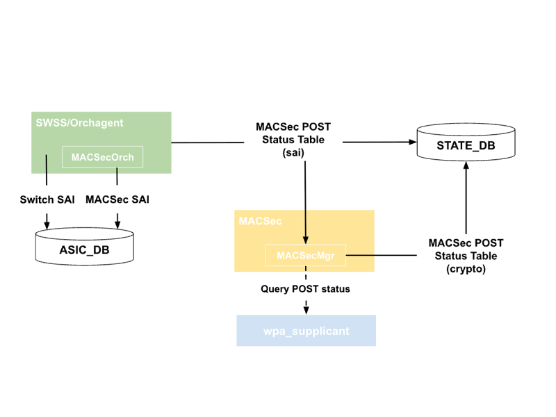
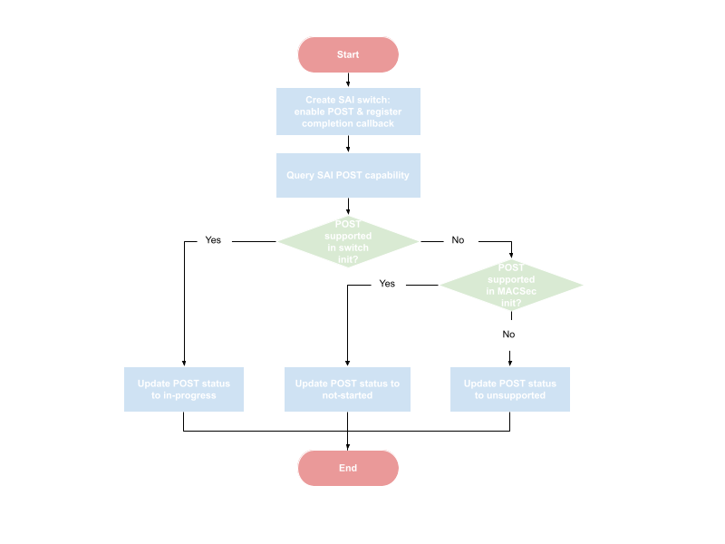
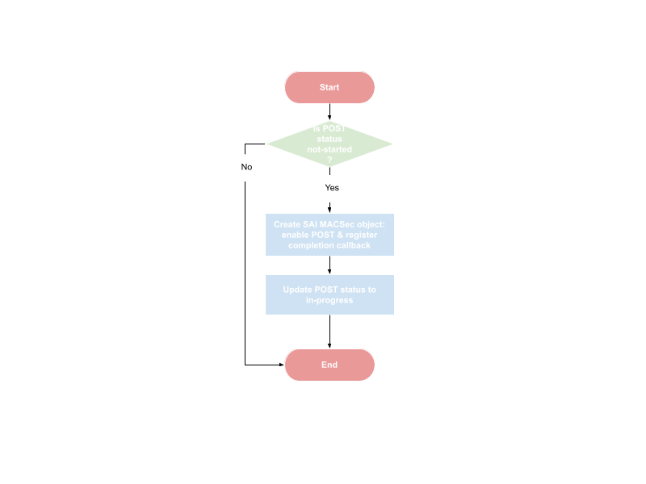
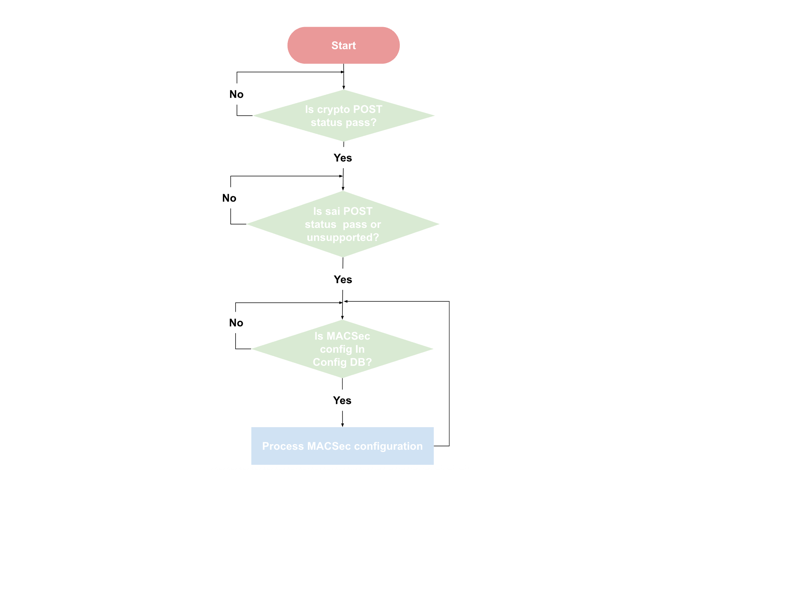

# SONiC SAI POST support for MACSec

## Revision
| Rev |     Date    |       Author       | Change Description |      
|:---:|:-----------:|:------------------:|--------------------|
| 1 | Jul-7 2025 | Song Yuan (Arista Networks) | Initial Version |

## Table of Contents
* [Overview](#Overview)
* [Design requirements](#Design-requirements)
* [Deisgn details](#Design-details)
  * [State DB](#State-DB)
  * [Enabling POST in SAI switch init](#Enabling-POST-in-SAI-switch-init)
  * [Enabling POST in SAI MACSec init](#Enabling-POST-in-SAI-MACSec-init)
  * [Checking SAI POST status](#Checking-SAI-POST-status)
  * [Handling SAI POST failure](#Handling-SAI-POST-failure)
  * [Enforcing FIPS compliance](#Enforcing-FIPS-compliance)

## Overview

This document describes SONiC design for Federal Information Processing Standards (FIPS) 140-3 standard compliance. Especially, the focus of the document is to trigger MACSec Pre-Operational Self-Test (POST) in SONiC and also ensure SONiC’s behavior is compliant to FIPS standard after POST.

## Design requirements

The design must meet the following requirements:
- In order to accommodate different forwarding ASIC architecture or SAI implementation, the design should support enabling POST at either switch level (during switch init) or at MACSec engine level (during MACSec engine init).
- SONiC MACSec configuration must be processed only after POST passes. 
- POST failure must not affect the operation of non-MACSec ports.
- Explicit visibility must be provided if POST fails, for example, in syslog. The syslog message must include the details of the failure. For example, SAI object Id of ports that fail POST and the corresponding MACSec engine.

## Deisgn details

The following figure depicts the data flow and SONiC components in the design. Orchagent is responsible for triggering POST via SAI calls and publishing POST status in State DB. MACSec container, precisely MACSecMgr, is enhanced to be POST aware and only process MACSec configuration after POST has passed. 



### State DB

The following table is added to State DB to track MACSec POST status, including SAI POST result/status.
```
FIPS_MACSEC_POST_TABLE

;Store MACSec POST status

key    = FIPS_MACSEC_POST_TABLE|sai
status = "switch-level-post-in-progress"    ; SAI switch level POST is in-progress.
         "macsec-level-post-in-progress"    ; SAI MACsec level POST will be triggered or in-progress.
         "pass"                             ; SAI POST passed.
         "fail"                             ; SAI POST failed. 
         "disabled"                         ; SAI POST is disabled.

```

### Enabling SAI POST

SAI POST is enabled only when FIPS is enabled in SONiC. FIPS can be configured via either sonic-installer, i.e., set-fips option, or config file, i.e.,/etc/sonic/fips.json. Enabling FIPS requires switch reboot, and FIPS config will be populated in FIPS_STATS table in State DB after reboot. However, there may be a latency to populate FIPS config in State DB. Therefore, checking FIPS config in State DB is reliable because Orchagent may start before FIPS config is populated. Instead, Orchagent will directly check FIPS config in the following files:
- /proc/cmdline : When FIPS is configured via sonic-installer, the result, e.g., sonic_fips=1, is written in this file.
- /etc/fips/fips_enable : If FIPS is configured via config file /etc/sonic/fips.json, /etc/fips/fips_enable is updated accordingly.

Orchagent will trigger SAI POST if FIPS is enabled in either of the above files.

### Enabling POST in SAI switch init

Orchagent enables POST when creating SAI switch regardless of whether the MACSec feature is supported or enabled. This can avoid triggering POST after SAI switch creation, e.g., MACSec feature is enabled later. The below flow chart depicts the process.



Orchagent enables POST when creating SAI switch. After SAI switch is created, Orchagent queries SAI POST capability. If POST is supported in switch init, Orchagent sets POST status to in-progress and waits for POST completion callback. Otherwise, if POST is supported only in MACSec init, Orchagent sets POST status to not-started, which informs MACSecOrch of performing POST in its initialization.

If POST is not supported in either switch or MACSec init, then SAI does not support POST. In this case, Orchagent sets POST status to fail if FIPS is enabled in SONiC.

### Enabling POST in SAI MACSec init

POST is performed by MACSecOrch when POST is supported only in MACSec init. The following flow chart demonstrates the process.



POST is triggered in MACSecOrch initialization. Since POST is enabled via SAI MACSec create API, SAI MACSec object may be created proactively and before any MACSec port is configured.

### Checking SAI POST status

Since SAI supports POST completion callback, a callback or notification function is provided when enabling POST in SAI switch or MACSec creation. Once being invoked, the callback function sets POST status in State DB accordingly based on the POST status returned by SAI.

### Handling SAI POST failure

If SAI POST fails,  MACSecOrch reads POST status of all MACSec ports and finds out which port has failed in POST.  MACSecOrch then adds the details of the failure in syslog. The following syslog is added to report SAI POST failure.

Swith level POST failure
```
Switch MACSec POST failed
```
MACSec level POST failure
```
MACSec POST failed: oid <macsec-oid>, direction ingress|egresss
```

### Enforcing FIPS compliance

In order to be compliant to FIPS, SONiC should process MACSec configuration only after POST passes. This is achieved by enhancing MACSecMgr, running in MACSec container, to check POST status published in State DB before processing any MACSec configuration, as shown in the flow chart below:


