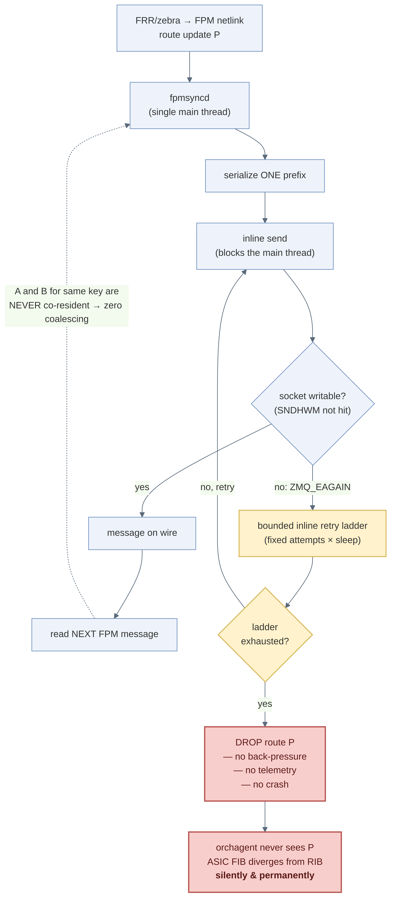
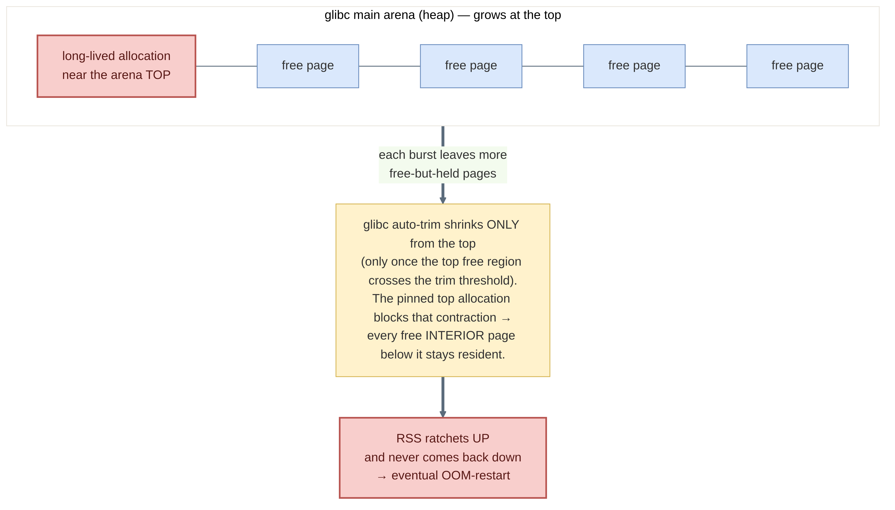
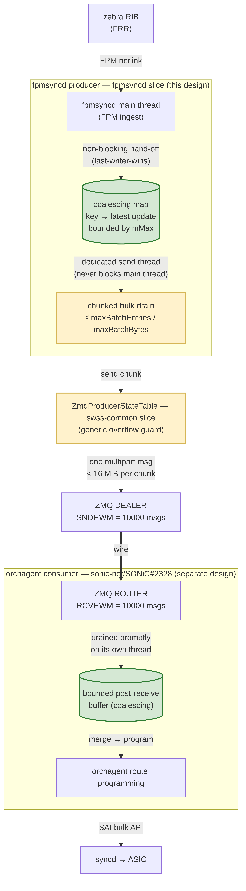
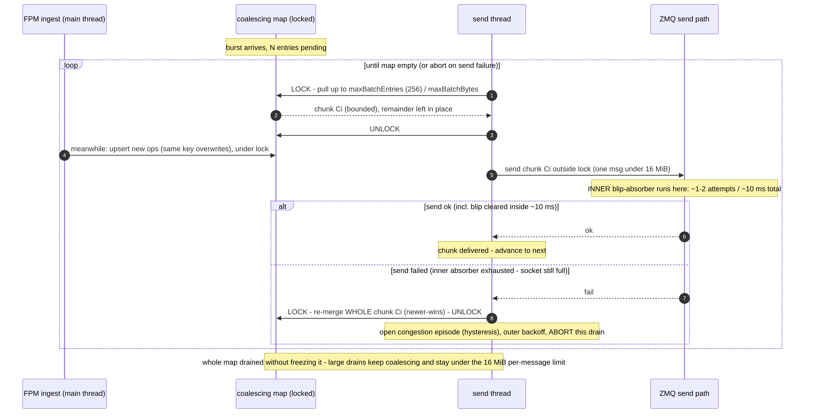
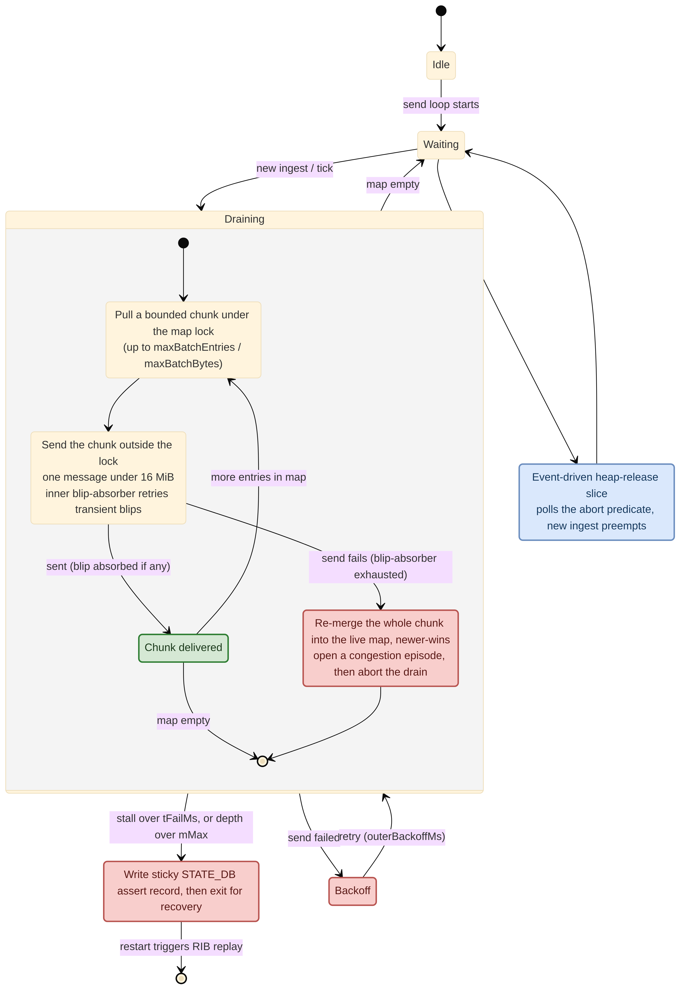
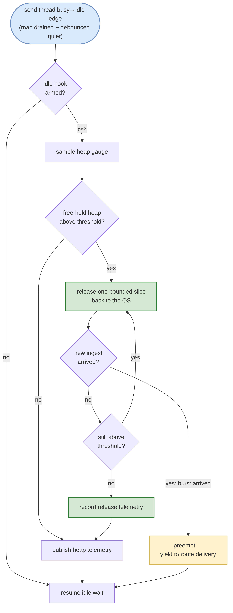

<!-- omit in toc -->
# fpmsyncd → orchagent ZMQ Route Delivery (Producer Side) — High Level Design

<!-- omit in toc -->
## Table of Content

- [1. Revision](#1-revision)
- [2. Scope](#2-scope)
- [3. Definitions / Abbreviations](#3-definitions--abbreviations)
- [4. Overview](#4-overview)
  - [4.1 Problem A — silent route drop under burst (#28369)](#41-problem-a--silent-route-drop-under-burst-28369)
  - [4.2 Problem B — heap RSS ratchet (#28245)](#42-problem-b--heap-rss-ratchet-28245)
  - [4.3 Goals / Motivation](#43-goals--motivation)
- [5. Requirements](#5-requirements)
  - [5.1 Functional](#51-functional)
  - [5.2 Non-functional](#52-non-functional)
  - [5.3 Non-goals](#53-non-goals)
  - [5.4 Scale targets](#54-scale-targets)
- [6. Architecture Design](#6-architecture-design)
- [7. High-Level Design](#7-high-level-design)
  - [7.1 Design overview](#71-design-overview)
  - [7.2 Why the async send thread *is* the coalescing mechanism](#72-why-the-async-send-thread-is-the-coalescing-mechanism)
  - [7.3 Back-pressure — retain-and-retry from the map](#73-back-pressure--retain-and-retry-from-the-map)
  - [7.4 Chunked drain from the live map](#74-chunked-drain-from-the-live-map)
  - [7.5 Batch sizing — wire efficiency vs. coalescing yield](#75-batch-sizing--wire-efficiency-vs-coalescing-yield)
  - [7.6 Failure, retry and liveness](#76-failure-retry-and-liveness)
  - [7.7 Send-thread state machine](#77-send-thread-state-machine)
  - [7.8 Event-driven heap release (#28245)](#78-event-driven-heap-release-28245)
  - [7.9 Interaction with the consumer redesign (#2328)](#79-interaction-with-the-consumer-redesign-2328)
  - [7.10 Telemetry and observability](#710-telemetry-and-observability)
  - [7.11 Repository / component change map](#711-repository--component-change-map)
- [8. SAI API](#8-sai-api)
- [9. Configuration and Management](#9-configuration-and-management)
  - [9.1 Manifest](#91-manifest)
  - [9.2 CLI / YANG](#92-cli--yang)
  - [9.3 Config DB and tuning knobs](#93-config-db-and-tuning-knobs)
- [10. Warmboot and Fastboot Design Impact](#10-warmboot-and-fastboot-design-impact)
- [11. Memory Consumption](#11-memory-consumption)
- [12. Restrictions / Limitations](#12-restrictions--limitations)
- [13. Testing Requirements / Design](#13-testing-requirements--design)
  - [13.1 Unit test cases](#131-unit-test-cases)
  - [13.2 Component A/B benchmark design](#132-component-ab-benchmark-design)
  - [13.3 System test cases](#133-system-test-cases)
- [14. Open / Action Items](#14-open--action-items)
- [15. References](#15-references)
- [Appendix A — Measured benchmark results](#appendix-a--measured-benchmark-results)

---

## 1. Revision

| Rev | Date        | Author          | Change Description                                              |
|:---:|:-----------:|:---------------:|:---------------------------------------------------------------|
| 0.1 | Jul 27 2026 | Deepak Singhal  | Initial HLD — producer-side route delivery, chunked drain, event-driven heap release, STATE_DB telemetry; component A/B results. |

---

## 2. Scope

This HLD covers the **producer side** of the fpmsyncd → orchagent route-delivery path in SONiC:
how fpmsyncd hands FRR/zebra route updates to `orchagent` over ZMQ. fpmsyncd consumes FRR/zebra's
FPM netlink stream (north) and produces route updates to orchagent over ZMQ (south); "producer"
refers to that ZMQ egress channel, the subject of this document. It specifies:

- **(a)** a non-blocking, coalescing, chunked send path that removes a class of **silent route drops**
  under burst ([sonic-buildimage #28369](https://github.com/sonic-net/sonic-buildimage/issues/28369));
- **(b)** an event-driven **heap release** that returns burst-inflated memory to the OS
  ([sonic-buildimage #28245](https://github.com/sonic-net/sonic-buildimage/issues/28245)); and
- **(c)** the **STATE_DB telemetry** that makes both observable.

**Out of scope:** the *consumer* side (orchagent `ZmqRouteConsumerStateTable` / `RouteOrch`
ingestion), which is covered separately in
[sonic-net/SONiC #2328](https://github.com/sonic-net/SONiC/pull/2328). The two designs are
architecturally independent: this producer-side design composes with the consumer-side design
(§7.9) but does not require it. No change to ZMQ HWM configuration or the single-message transport
ceiling (16 MiB).

---

## 3. Definitions / Abbreviations

| Term | Definition |
|------|------------|
| **fpmsyncd** | SONiC daemon that receives FRR route updates via the FPM (Forwarding Plane Manager) netlink channel and delivers them to orchagent over ZMQ (`APPL_DB` is written for debug only in the ZMQ path). |
| **FPM** | Forwarding Plane Manager — FRR's interface that streams zebra's forwarding-plane route updates (the selected/installed best paths, as netlink messages) to an external agent. |
| **RIB / FIB** | Routing Information Base (control-plane routes) / Forwarding Information Base (programmed ASIC routes). |
| **ZMQ** | ZeroMQ, the message transport between fpmsyncd (producer) and orchagent (consumer). |
| **SNDHWM / RCVHWM** | ZMQ send / receive High-Water-Mark — the per-socket queue depth (in messages) before back-pressure/`EAGAIN`. |
| **EAGAIN** | ZMQ "would block" — the socket send buffer is full; the write did not complete. |
| **Coalescing** | Collapsing multiple updates for the **same key** into one, keeping only the latest (last-writer-wins). |
| **LWW** | Last-Writer-Wins — the map-merge policy: a later op for a key overwrites the earlier one. |
| **HWM** | High-Water-Mark (see SNDHWM/RCVHWM). |
| **RIB replay** | fpmsyncd's route replay after a restart — FRR re-drives the full RIB and fpmsyncd re-produces the routes. |
| **RSS** | Resident Set Size — physical memory a process holds, as seen by the OS. |
| **`malloc_trim` / `MADV_DONTNEED`** | glibc call / madvise flag that returns free heap pages to the OS. |
| **`brk`/`sbrk`** | syscalls that move the top of the heap; glibc's auto-trim only contracts the arena top. |
| **tcmalloc** | Google's malloc (gperftools); returns free-held memory to the OS **by size** (any freed span), not only the arena top. fpmsyncd links tcmalloc. |

---

## 4. Overview

fpmsyncd is the sole conduit from the FRR control plane to the SONiC data plane for routes. Its
producer-side send path has two independent defects that surface under **burst** (tens of
thousands of route updates in a short window) — a scale point SONiC routinely hits on session
flap, peer bounce, or a full-table refresh.

### 4.1 Problem A — silent route drop under burst (#28369)

In the baseline (pre-fix) implementation, fpmsyncd sends **one prefix per ZMQ message**, **inline
on its single main thread**. When a
burst fills the ZMQ send buffer, the send returns a would-block (`EAGAIN`); the code spins a **bounded**
inline retry ladder and, once the ladder exhausts, **silently drops** the route — no
back-pressure, no telemetry, no crash. The route never reaches orchagent and is never retried, so
the ASIC FIB diverges from the RIB **with no signal**. Figure 1 traces the failure.

<p align="center">
  
</p>
<p align="center"><b>Figure 1.</b> The #28369 silent-drop chain. The inline send blocks the main
thread; on sustained <code>EAGAIN</code> the bounded ladder exhausts and the route is
<b>dropped with no back-pressure, no telemetry, and no crash</b> — the ASIC FIB diverges from the
RIB permanently. The same inline structure also makes <b>coalescing structurally impossible</b>:
two updates for one prefix are never co-resident (dashed edge).</p>

Two distinct gaps hide in that one path:

1. **No back-pressure (the correctness bug).** The producer cannot *hold* work when ZMQ is not
   writable — it either spins the ladder or drops. There is no way to retain the update and no
   signal when it gives up.
2. **No coalescing; per-prefix framing (the efficiency gap).** Every update is its own ZMQ
   message, so a burst of *N* updates costs *N* messages and nothing collapses redundant same-key
   churn (e.g. ECMP next-hop flap rewriting the same prefix repeatedly).

### 4.2 Problem B — heap RSS ratchet (#28245)

fpmsyncd's RSS climbs after each burst and never comes back down. glibc's main arena keeps freed
pages as **free-but-not-returned**; its automatic reclaim shrinks the arena **only from the top**
(and only once the top free region crosses the trim threshold) and never proactively returns freed
*interior* pages to the OS. A single long-lived allocation near the top **pins every free
page below it**, so a transient burst permanently inflates steady-state RSS → eventual
OOM-restart. Figure 2 shows the mechanism.

<p align="center">
  
</p>
<p align="center"><b>Figure 2.</b> The #28245 RSS ratchet. glibc auto-trim contracts only the arena
top; a long-lived top allocation pins the interior free pages, so each burst leaves more
free-but-held memory and RSS climbs monotonically toward an eventual OOM-restart.</p>

### 4.3 Goals / Motivation

- **No silent drops.** Every route reaches the wire or is retained for retry; a genuine
  unrecoverable stall becomes a **bounded, observable failure** (assert + restart + RIB replay),
  never silent divergence.
- **Decouple ingest from ZMQ.** The FRR/FPM netlink thread never blocks on the socket.
- **Earliest-possible work reduction.** Collapse same-key churn on the producer — *before* it
  costs serialize-CPU, wire bytes, and consumer memory.
- **Bulk throughput without a hard size cliff.** Large drains ship efficiently *and* safely under
  the 16 MiB single-message ceiling.
- **Bounded, self-healing memory.** Return burst-inflated heap to the OS with no dedicated thread
  and no stall to route delivery.
- **Keep `swss-common` generic.** Any shared-library change stays route-agnostic and reusable by
  other producers; all route-specific policy lives in fpmsyncd.

---

## 5. Requirements

RFC-2119 keywords. A requirement states an **outcome**; the mechanism that achieves it is a design
choice (§7) guarded by a test (§13).

### 5.1 Functional

- **R1.** fpmsyncd **shall not** silently drop a route update in any recoverable regime;
  `routes_lost_total` **shall** remain `0` in all regimes. A deliberate assert+restart interrupts
  in-flight delivery, but the restart RIB replay re-drives the affected routes end-to-end, so the
  counter still does not increment.
- **R2.** The producer **shall** retain un-sent route updates and retry them when the socket is
  not writable, rather than dropping them.
- **R3.** Route ingest (the FPM netlink read path) **shall not** block on the ZMQ socket.
- **R4.** Redundant same-key updates pending at send time **shall** be coalesced last-writer-wins
  before crossing the wire.
- **R5.** *(Design-induced — a consequence of batching, not a baseline problem: the pre-fix
  one-prefix-per-message path could never approach the ceiling.)* Because this design batches route
  updates into bulk messages to meet throughput (R13) and create coalescing dwell (R4), a batched
  drain **shall** be chunked so that no individual wire message exceeds the transport's
  single-message ceiling, and delivery **shall** still complete.
- **R6.** A prolonged unrecoverable stall **shall** produce an **observable** failure (a sticky
  STATE_DB assert record + process exit for restart RIB-replay recovery), never silent divergence.
- **R7.** fpmsyncd **shall** return burst-inflated free heap memory to the OS when the send path
  is idle, without a dedicated thread and without delaying route delivery.
- **R8.** The producer **shall** publish STATE_DB telemetry sufficient to answer, at a glance,
  "is the no-drop guarantee holding?", "is there congestion?", and "is memory being reclaimed?".

### 5.2 Non-functional

- **R9.** The added STATE_DB telemetry sink **shall not** prevent fpmsyncd from starting — nor
  crash it — if Redis/STATE_DB is unreachable at construction; telemetry publication **shall**
  degrade gracefully and resume once STATE_DB is reachable.
- **R10.** The `swss-common` change **shall** remain route-agnostic (a generic send-path overflow
  guard + retry-config API), so other producers are unaffected.
- **R11.** The heap release **shall** be bounded and abortable — it **shall** yield the instant new
  ingest arrives, so a burst during a release is served promptly.
- **R12.** The design **shall** be backward compatible: no new CONFIG_DB schema, no CLI change, and
  it **shall** compose with the consumer redesign (#2328) without requiring it.

### 5.3 Non-goals

1. **Bounding a flood of *distinct* prefixes** is out of scope — coalescing collapses nothing when
   every key differs; only back-pressure + the assert bound protect that regime.
2. **Consumer-side changes** are out of scope — owned by
   [#2328](https://github.com/sonic-net/SONiC/pull/2328) (§7.9).
3. **Changing ZMQ HWM or the single-message transport ceiling** is out of scope — the design lives entirely
   within the existing transport limits and instead *chunks under* the ceiling (§7.5).
4. **A user-facing config surface** is a non-goal — the knobs (§9.3) are internal defaults tuned by
   benchmark, not CONFIG_DB. Adding a CLI/YANG surface is deferred to §14 if a need emerges.

### 5.4 Scale targets

- **R13.** The design **shall** sustain the full BGP table (order **10⁶** routes) and absorb a burst
  drain of **≥ 40,000** route updates without silent drop, staying within the transport's existing
  single-message ceiling (§7.5) and the map memory bound (§7.4).

---

## 6. Architecture Design

fpmsyncd is the FRR→orchagent route conduit — it consumes zebra's FPM netlink stream and produces
route updates to orchagent over ZMQ. This design keeps that daemon topology unchanged: all new code
lives inside fpmsyncd (`sonic-swss`), plus a small generic send-path guard in `sonic-swss-common`.
What changes is the **internal shape** of fpmsyncd's producer path — a coalescing map + a dedicated
send thread + a chunked drain replace the inline per-prefix send. Figure 3 shows where each piece
plugs in and the end-to-end dataflow.

<p align="center">
  
</p>
<p align="center"><b>Figure 3.</b> End-to-end dataflow. The FPM netlink thread only does a
non-blocking hand-off (last-writer-wins) into the coalescing map; a
<b>dedicated send thread</b> drains it in bounded chunks through the generic
<code>ZmqProducerStateTable</code> guard (swss-common slice). Green = coalescing points, yellow =
the generic send-path guard. The orchagent consumer (right) is a separate design, covered in §7.9.</p>

**Four load-bearing pieces, in priority order:**

| # | Piece | Role | Regime it matters most |
|---|---|---|---|
| 1 | **Back-pressure** (retain-and-retry from the map) | the *bound* — never drop | consumer unavailable / socket not draining |
| 2 | **Assert + `_Exit` + restart RIB replay** | bounded, observable failure | prolonged unrecoverable stall |
| 3 | **Coalescing map** (LWW) | earliest-possible work reduction | same-key churn |
| 4 | **Chunked bulk framing** | throughput + removes the 16 MiB cliff | every large drain |

---

## 7. High-Level Design

### 7.1 Design overview

The producer path is redesigned around a single principle: **decouple FPM ingest from ZMQ delivery,
and never let the delivery side drop a route.** Concretely, the inline "serialize-and-send each
prefix on the FPM thread" path is replaced by the following set of mechanisms, listed here in
dataflow order; each is detailed in the subsection noted.

1. **Asynchronous send thread** — the FPM thread hands each update off in microseconds and returns
   to reading netlink; a dedicated thread owns all ZMQ I/O, so ingest never blocks on the socket
   (§7.2).
2. **Coalescing map as the retain buffer** — updates land in a keyed, last-writer-wins (LWW) map
   (not a FIFO queue), so redundant same-key updates that are co-resident collapse to the latest
   before they ever cross the wire (§7.2).
3. **Back-pressure by retain-and-retry** — when the socket is not writable the unsent work stays in
   the map and is retried, rather than being dropped; the map is the buffer and the bound (§7.3).
4. **Chunked bulk drain** — the send thread drains the map in bounded chunks (by entry count and by
   bytes), each chunk becoming one multipart wire message that stays under the transport's
   single-message ceiling (§7.4, §7.5).
5. **Bounded, observable failure** — a prolonged unrecoverable stall (or a map that exceeds its
   memory bound) produces a sticky STATE_DB assert record and a process exit for restart RIB-replay
   recovery, never silent divergence (§7.6, §7.7).
6. **Event-driven heap release** — on the busy→idle edge the producer returns burst-inflated free
   heap to the OS in bounded, abortable steps, with no dedicated thread and no delay to route
   delivery (§7.8).
7. **STATE_DB telemetry** — the producer publishes read-only route- and heap-health records so the
   no-drop guarantee, congestion, and memory reclaim are observable at a glance (§7.10).

These compose so that coalescing, back-pressure, and chunking are all properties of the **same**
async-send-thread + coalescing-map structure — no one of them is a bolt-on. §7.9 places this
producer design against the separate consumer redesign (#2328), and §7.11 maps each mechanism to
the repository/component it lands in.

### 7.2 Why the async send thread *is* the coalescing mechanism

> **In short:** coalescing is not a separate step — it falls out of the async send thread. While one
> send is on the wire, same-key updates pile into the live map and collapse to the latest, for free,
> and the effect scales with congestion.

Coalescing requires **dwell**: two updates for the same key must be resident in the map at the
same instant for the second to overwrite the first.

- **Inline (the bug):** the main thread serializes+sends route P, blocks on ZMQ, *then* reads the
  next FPM message. A and B for the same prefix are never co-resident → **zero coalescing,
  structurally** (Figure 1, dashed edge).
- **Async send thread:** the main thread hands the update off (microseconds, non-blocking) and
  immediately returns to reading FPM. The send thread is off doing one send, which takes real
  wall-clock time. **During that send, the map is live and every FPM update that arrives
  coalesces.** The natural dwell window equals **one send's duration** and **self-scales with
  congestion**: the slower the wire, the longer each send, the more arrives-during-send, the more
  coalescing — exactly the regime you want it in.

**Design choice — no explicit flush timer.** An artificial "hold the map N ms" (Nagle-style) timer
would add coalescing only in the light-load gap between sends (where wire load is not a problem)
and would spend **convergence latency**, which the design treats as sacred. Under real congestion
the send-duration window already dominates. So dwell comes purely from send duration: a route
waits only as long as the send thread was *legitimately busy* — latency the system was already
paying — never an added delay. **Consequence:** producer coalescing is delivered *for free* as a
property of the async send thread + chunked drain, because the retain-and-retry buffer is a **map**
(keyed, LWW) instead of a FIFO queue.

### 7.3 Back-pressure — retain-and-retry from the map

The coalescing map *is* the retain buffer. When a chunk's send fails past the inner absorber
(§7.6), the whole chunk is **re-merged into the live map** (newer-wins) and the drain aborts into an
outer backoff; the next drain picks it up again. Work is therefore **held, not dropped** (R1/R2).
The map is bounded by `mMax`; exceeding it is a memory-safety assert (observable, §7.6), never a
silent drop.

### 7.4 Chunked drain from the live map

The send thread drains the map in **bounded chunks** (≤ `maxBatchEntries` keys **and**
≤ `maxBatchBytes`), each chunk becoming exactly one wire message. Crucially it pulls a chunk **from
the live map without freezing it** — between chunk pulls, the main thread keeps upserting, so a
large drain **keeps coalescing** and never blocks ingest. Figure 4 is the numbered sequence.

<p align="center">
  
</p>
<p align="center"><b>Figure 4.</b> Chunked drain from the live map. Each iteration pulls a bounded
chunk under the map lock, releases the lock, and sends <b>outside</b> the lock (so ingest never
waits on the wire). New same-key upserts during a send coalesce into the remainder. On a send
failure the <b>whole chunk is re-merged newer-wins</b> and the drain aborts to an outer backoff —
the map is drained without ever being frozen and a large drain never crosses the 16 MiB per-message
limit.</p>

**Design choice — chunk from the live map, reject whole-map-freeze.** Snapshotting or locking the
entire map for a drain would (a) stall ingest for the whole drain and (b) stop coalescing exactly
when it matters (a big backlog). Bounded-chunk-from-live keeps both ingest and coalescing running
throughout.

### 7.5 Batch sizing — wire efficiency vs. coalescing yield

> **In short:** chunk size trades wire efficiency against coalescing yield. The benchmarked knee is
> 256 keys per chunk; an 8 MiB byte cap independently guards the wide-route case so no message
> crosses the 16 MiB transport limit.

Given that the drain is chunked (§7.4), how large should each chunk be? The bound is a deliberate
balance between two opposing pressures.

- **Larger chunks amortize fixed per-message cost.** Each chunk is one multipart ZMQ message — one
  serialization/framing pass, one send syscall, one HWM check, one consumer-side receive/dispatch.
  Packing more keys into a message spreads those fixed costs over more routes, cutting CPU and
  syscall overhead per route and raising wire throughput. This is the whole point of batching over
  the original per-prefix send.
- **Smaller chunks preserve coalescing (and latency).** Keys extracted into a chunk have left the
  map; a late same-key update that arrives while that chunk is in flight can no longer collapse into
  it — it becomes a fresh map entry that must be sent again. Draining in smaller chunks leaves more
  of the working set resident in the map for longer (§7.2 dwell), so more same-key duplicates
  coalesce before extraction. Very large chunks also delay the first route's delivery and raise
  per-message memory.

The right chunk size is therefore the **knee** where wire efficiency has essentially saturated but
coalescing yield has not yet begun to erode. Benchmarking (Appendix A) puts that knee at
`maxBatchEntries` = **256** keys per chunk (**128** as a conservative backup): at 256 the fixed-cost
amortization is effectively fully captured, while the map still retains enough residency to coalesce
same-key churn. Larger chunks buy no further throughput but start trading away coalescing; smaller
chunks lose throughput without a matching coalescing gain.

Independently of that tuning, a hard correctness bound also applies (R5): a single multipart message
must stay under the transport's **16 MiB** per-message limit. `maxBatchBytes` (**8 MiB**) enforces
this and specifically guards the pathological wide-route case (few keys but very large field-value
lists), where the entry-count bound alone would not. A chunk is thus capped by whichever of
`maxBatchEntries` or `maxBatchBytes` it reaches first.

### 7.6 Failure, retry and liveness

The retry design separates a **benign HWM blip** from **real congestion**, so a transient hiccup
never escalates while a genuine stall is always bounded:

- **Inner blip absorber:** on a transient "would block", the send path retries a small number of
  times with a short backoff (a few milliseconds total). A momentary HWM blip clears here and
  **never escalates**; absorbed blips are counted separately from real congestion (§7.10).
- **Outer retry:** if the blip absorber is exhausted, the whole chunk is **re-merged into the live
  map** (§7.3) and the drain aborts to a backoff; the next drain retries. A congestion **episode**
  opens under hysteresis, so isolated blips do not inflate the episode count.
- **Liveness bound:** if the time since the last successful send exceeds `tFailMs`, or the map depth
  exceeds `mMax`, the producer writes a **sticky STATE_DB assert record** (which survives the
  process exit) and exits for recovery. The restart triggers **RIB replay**, which
  re-drives the routes — so even the failure path converges without silent loss (R6).

### 7.7 Send-thread state machine

Figure 5 is the send thread's lifecycle — the single place all of §7.3–7.6 comes together. It also
**arms** the idle-hook seam that the event-driven heap release consumes (§7.8).

<p align="center">
  
</p>
<p align="center"><b>Figure 5.</b> Send-thread state machine. In <code>Draining</code>, each iteration
pulls a bounded chunk under the map lock and sends it <b>outside</b> the lock; on success it advances
to the next chunk (or returns to <code>Waiting</code> when the map empties), and on send failure it
re-merges the whole chunk newer-wins and backs off. A stall beyond <code>tFailMs</code> or a depth
over <code>mMax</code> transitions to the assert path (sticky record → process exit →
RIB replay). When the map empties, the thread arms the debounced busy→idle hook that the
event-driven heap release consumes (§7.8). <b>Colour legend:</b> green = normal delivery, red =
congestion / failure path, blue = the separate heap-release concern; cream = steady states.</p>

### 7.8 Event-driven heap release (#28245)

The RSS ratchet (Figure 2) is fixed in **two parts**. First, fpmsyncd is linked against
**tcmalloc**, whose reclaim returns freed memory to the OS **by size** (any freed span) — unlike
glibc's top-only trim, which a single pinned top allocation defeats (Figure 2). Second, an
**event-driven release** proactively returns tcmalloc's free-held memory to the OS on the send
thread's busy→idle edge (tcmalloc otherwise caches freed spans in its page heap), so reclaim never
contends with ingest/dispatch. Figure 6 expands the idle-hook state armed by the state machine in
Figure 5 (§7.7) into the release flow that runs inside it.

<p align="center">
  
</p>
<p align="center"><b>Figure 6.</b> Event-driven heap release &mdash; the drill-down of the idle-hook state
in Figure 5 (§7.7). On the debounced idle edge the manager
samples the heap; only if <code>free_held &gt; THRESH</code> does it release <b>one bounded slice</b>
back to the OS (tcmalloc's size-based return), re-checking an
<b>abort predicate</b> (new ingest ⇒ <code>mapDepth != 0</code>) between slices. A burst mid-release
preempts immediately (<code>release_skipped_busy++</code>) so route delivery is never delayed.</p>

Four design choices make this safe:

- **Trigger = debounced busy→idle edge.** The release arms only after the map has been drained and
  quiet for `quietDebounceMs` (500 ms, above the max intra-burst gap, ≤ `idleTickMs`), so it never
  false-starts mid-burst.
- **Chunked + abortable.** Memory is returned in bounded slices (`sliceBytes`, 4 MiB each) and the
  abort predicate is polled **between** slices, so worst-case latency to serve a new burst is one
  slice, not the whole backlog. Slicing continues until free-held drops below `freeHeldThreshBytes`
  (8 MiB) or the allocator returns nothing more.
- **No dedicated thread.** Reusing the send thread's idle hook means no new thread, no blind timer,
  and — because the idle edge implies whole-fpmsyncd quiescence — **no heap contention**.
- **Allocator = tcmalloc.** fpmsyncd links tcmalloc so freed memory can be returned to the OS **by
  size**; the idle-edge release drives that return explicitly, since tcmalloc otherwise retains
  freed spans in its page heap. This replaces glibc, whose top-only trim cannot reclaim pinned
  interior free pages (Figure 2). A published `allocator` field records the linked allocator for
  field verification.

### 7.9 Interaction with the consumer redesign (#2328)

The end-to-end route path (Figure 3, §6) has two halves that can ship independently: this
**producer** fix and the separate **consumer** redesign ([#2328](https://github.com/sonic-net/SONiC/pull/2328)),
which bounds orchagent's post-receive buffer. The two are complementary, not competing, and compose
without ordering constraints:

- **This producer fix needs neither #2328 nor any consumer change.** It reduces the wire-message
  count at the source (coalescing + chunked framing) and never silently drops, so it delivers its
  full benefit on the existing consumer.
- **#2328 is orthogonal.** The consumer already drains the socket on its own thread regardless of
  this design, so producer back-pressure does not depend on consumer coalescing. #2328 additionally
  bounds consumer memory under burst — a benefit that stacks on top of, and is independent of, the
  producer-side reduction.

Neither half is a precondition for the other; deployed together they bound memory and message
volume at both ends of the same pipe.

### 7.10 Telemetry and observability

The producer publishes two STATE_DB tables (read-only, debug-first) plus a sticky assert record.
Full schema, ABNF, and examples are in §9 (Configuration and Management, DB section) so vendors and
operators have one home for the contract. The **on-call one-liner**: read `health` first, then
`routes_lost_total` (must be `0`) for the no-drop guarantee, and `retention_ratio` for memory
health.

### 7.11 Repository / component change map

| Repo | Component | Change |
|---|---|---|
| `sonic-swss-common` | `ZmqClient` / `ZmqProducerStateTable` | Generic send-path overflow guard + a clamped retry-config setter (max attempts and backoff ceiling) + send-path counters (raw blips, blips absorbed, max backoff). **No route-specific logic.** Version-bumped. |
| `sonic-swss` | `fpmsyncd` — new `RouteSendCoalescer` | Coalescing map + dedicated send thread + chunked drain + inner blip-absorber wiring + outer retry + episode hysteresis + assert/liveness + route & heap STATE_DB telemetry. Exposes an **idle-hook seam**. |
| `sonic-swss` | `fpmsyncd` — new `HeapReleaseManager` | Chunked, abortable heap release on the busy→idle edge; wires the seam above. |
| `sonic-swss` | `fpmsyncd` — `RouteSync` | Funnels the steady-state route/label-route write path through the coalescer; installs the heap-release idle hook. |

---

## 8. SAI API

**No new SAI API or SAI behavior changes are required.** This design is entirely upstream of
orchagent's route-programming path — it changes how fpmsyncd *delivers* routes to orchagent over
ZMQ, not how routes are programmed into the ASIC. The orchagent → syncd → SAI path is unchanged.

---

## 9. Configuration and Management

### 9.1 Manifest

Not applicable. fpmsyncd is a **built-in** SONiC daemon, not an Application Extension; no package
manifest changes are required.

### 9.2 CLI / YANG

**No new CLI commands and no YANG model changes.** The design adds no CONFIG_DB schema (§9.3), so
there is nothing to model in YANG and no `config`/`show` surface to add. The telemetry is exposed in
STATE_DB and read with standard tooling:

```
admin@sonic:~$ sonic-db-cli STATE_DB HGETALL "FPMSYNCD_ROUTE_STAT_TABLE|global"
admin@sonic:~$ sonic-db-cli STATE_DB HGETALL "FPMSYNCD_HEAP_STAT_TABLE|global"
```

A dedicated `show` wrapper is a possible future enhancement (§14); it is intentionally not part of
this change to keep the surface minimal and backward compatible.

### 9.3 Config DB and tuning knobs

**No CONFIG_DB tables are added or changed** — hence the design is trivially **backward
compatible**: upgrading to (or downgrading from) an image with this change does not alter any
operator-visible configuration or default behavior. The correctness fix is **always on** (it has no
"disabled" mode because "keep dropping routes silently" is not a supported configuration).

The behavior is governed by internal coalescer defaults, tuned by benchmark
(Appendix A), not by CONFIG_DB:

| Knob | Default | Purpose |
|---|---|---|
| `maxBatchEntries` | 256 (backup 128) | keys per chunk = one wire message; the coalescing/throughput knee (§7.4) |
| `maxBatchBytes` | 8 MiB | safety cap under the 16 MiB ceiling (§7.5); guards pathological wide routes |
| `idleTickMs` | 1000 | timed-wait period that wakes the idle thread to service the busy→idle edge |
| `sendInnerMaxRetries` | 1–2 | inner **blip-absorber** attempts (§7.6) — not a retry ladder |
| `sendInnerMaxBackoffMs` | ~5 | inner per-attempt backoff cap (~10 ms total) |
| `outerBackoffMs` | 50 | pause after a failed flush before re-draining — the real retry cadence |
| `tFailMs` | 60000 | assert if the time since the last successful send exceeds this |
| `mMax` | 1000000 | assert if total map depth exceeds this (memory bound) |
| `quietDebounceMs` | 500 | busy→idle debounce before the idle hook fires (§7.8) |
| `telemetryMinIntervalMs` | 10000 | throttle STATE_DB publish |

#### 9.3.1 STATE_DB schema — route send stats

Key separator `|` (STATE_DB). Producer: fpmsyncd send thread. Consumer: operators / DRI tooling.

```
; Route send statistics — one global record, published by fpmsyncd
key                        = FPMSYNCD_ROUTE_STAT_TABLE|global   ; single global row
health                     = "OK" / "CONGESTED" / "STALLED" / "RECOVERED" ; health state machine (see below)
map_depth                  = 1*DIGIT      ; current backlog (live gauge)
map_depth_hwm              = 1*DIGIT      ; peak backlog ever (sizing signal for mMax)
last_success_age_sec       = 1*DIGIT      ; seconds since last successful send (liveness leading indicator)
routes_sent_total          = 1*DIGIT      ; routes that crossed the wire (monotonic)
routes_coalesced_total     = 1*DIGIT      ; inputs collapsed before the wire (efficiency win)
chunks_sent_total          = 1*DIGIT      ; wire messages sent (feeds avg_chunk_fill)
congestion_episodes_total  = 1*DIGIT      ; real episodes (hysteresis-gated; blips excluded)
routes_lost_total          = 1*DIGIT      ; THE no-drop guarantee — 0 always
assert_total               = 1*DIGIT      ; lifetime asserts (restarts)
ep_duration_ms             = 1*DIGIT      ; last episode duration
ep_peak_depth              = 1*DIGIT      ; worst backlog during last episode
ep_coalesced_in            = 1*DIGIT      ; inputs folded during last episode
ep_coalesced_out           = 1*DIGIT      ; sets emitted during last episode
zmq_eagain_total           = 1*DIGIT      ; raw EAGAIN count (all blips)
zmq_blip_absorbed_total    = 1*DIGIT      ; EAGAIN cleared inside the inner absorber
retry_from_map_total       = 1*DIGIT      ; outer re-merges (real congestion past hysteresis)
zmq_backoff_max_ms         = 1*DIGIT      ; max backoff on the retry path
```

*Example STATE_DB record (excerpt — the complete field set is the ABNF above; §13.1 #7 governs the full published record):*

```json
{
  "FPMSYNCD_ROUTE_STAT_TABLE": {
    "global": {
      "health": "OK",
      "map_depth": "0",
      "map_depth_hwm": "1841",
      "last_success_age_sec": "0",
      "routes_sent_total": "5823941",
      "routes_coalesced_total": "214877",
      "chunks_sent_total": "23142",
      "congestion_episodes_total": "0",
      "routes_lost_total": "0",
      "assert_total": "0"
    }
  }
}
```

```
admin@sonic:~$ sonic-db-cli STATE_DB HGETALL "FPMSYNCD_ROUTE_STAT_TABLE|global"
health                     OK
map_depth                  0
map_depth_hwm              1841
routes_sent_total          5823941
routes_coalesced_total     214877     # ~3.6% collapsed before the wire
chunks_sent_total          23142      # avg_chunk_fill = 5823941/23142 ≈ 251 (256 well-utilized)
routes_lost_total          0          # ← no-drop guarantee holding
assert_total               0
```

**`health` state machine:** `OK` (draining freely, no open episode) → `CONGESTED` (an episode is
open — failure persisted past the inner absorber + first outer backoff) → `STALLED`
(`last_success_age_sec` approaching `tFailMs` — heading to assert) → `RECOVERED` (episode just
closed; sticky for one publish, then `OK`).

#### 9.3.2 STATE_DB schema — heap stats

```
; Heap release statistics — one global record, published by the fpmsyncd send thread
key                        = FPMSYNCD_HEAP_STAT_TABLE|global
heap_rss_bytes             = 1*DIGIT      ; RSS symptom (/proc/self/statm)
heap_inuse_bytes           = 1*DIGIT      ; genuinely-live bytes
heap_free_held_bytes       = 1*DIGIT      ; free-but-not-returned to the OS = the retained bytes
retention_ratio            = 1*DIGIT "." 1*DIGIT ; derived free_held/rss — one-glance health (<0.3)
allocator                  = "tcmalloc"  ; linked allocator (fpmsyncd links tcmalloc)
release_runs_total         = 1*DIGIT      ; releases executed
release_skipped_busy_total = 1*DIGIT      ; releases aborted/skipped because busy (starvation signal)
released_bytes_total       = 1*DIGIT      ; cumulative bytes returned to the OS
release_last_ts            = 4DIGIT "-" 2DIGIT "-" 2DIGIT SP 2DIGIT ":" 2DIGIT ":" 2DIGIT ; "YYYY-MM-DD HH:MM:SS" UTC — NOT epoch
release_last_rss_before    = 1*DIGIT      ; RSS immediately before the last release
release_last_rss_after     = 1*DIGIT      ; RSS immediately after (after < before ⇒ effective)
```

*Example STATE_DB record (excerpt — the complete field set is the ABNF above; §13.1 #8 governs the full published record):*

```json
{
  "FPMSYNCD_HEAP_STAT_TABLE": {
    "global": {
      "heap_rss_bytes": "22421504",
      "heap_free_held_bytes": "1310720",
      "retention_ratio": "0.058",
      "allocator": "tcmalloc",
      "release_runs_total": "37",
      "released_bytes_total": "1560281088",
      "release_last_ts": "2026-07-27 08:15:44",
      "release_last_rss_before": "171196416",
      "release_last_rss_after": "22421504"
    }
  }
}
```

**Timestamp convention.** Absolute wall-clock stamps (`release_last_ts`, `assert_last_ts`) are
human-readable UTC strings (`YYYY-MM-DD HH:MM:SS`), **not epoch integers**, so a raw `HGETALL` is
fleet-unambiguous; elapsed values (`*_age_sec`, `*_ms`) stay numeric for alert math.

#### 9.3.3 Sticky assert record

Written once at death into the route-stat table so post-restart triage sees **why** it died (STATE_DB
survives an fpmsyncd container bounce): `assert_last_ts` (UTC), `assert_last_reason`
(`STUCK_TIMEOUT` / `DEPTH_OVERFLOW`), `assert_last_depth`, `assert_last_stuck_ms`.

**Backward compatibility:** STATE_DB *outputs* only — like the schemas above, they add no existing
table or configuration change (§9.3), and consumers that ignore them are unaffected.

---

## 10. Warmboot and Fastboot Design Impact

Warmboot/fastboot behavior is **out of scope** for this design and unchanged from the baseline —
this change touches only fpmsyncd's steady-state producer path, not the boot/reboot sequence, and
adds nothing to the boot critical chain.

The only restart-relevant property: the coalescing map is process memory and is intentionally *not*
persisted. On restart the route state is relearned end-to-end across the bgp→swss→syncd pipeline
(FRR re-drives the RIB), so any routes pending in the map at exit are re-delivered by that replay.
The sticky assert record (§7.6) persists in STATE_DB; other telemetry gauges reset on restart.

---

## 11. Memory Consumption

- **When idle:** the coalescing map is empty, so it adds no steady-state footprint; the two STATE_DB
  telemetry records are small and fixed-size.
- **When enabled under load:** the map grows with the number of **distinct pending route keys** and
  is hard-capped at `mMax` before an observable assert. This is a **transient** high-water bound
  that the send thread drains continuously — not a persistent allocation.
- **Reclaim:** free-held heap is returned to the OS on the send thread's idle edge (§7.8), so
  steady-state RSS does **not** ratchet across bursts (Appendix A measures a 129 MiB reclaim).
- **Allocator:** fpmsyncd links **tcmalloc**, which returns freed memory to the OS **by size**;
  combined with the idle-edge release this keeps steady-state RSS flat where the baseline glibc
  allocator ratcheted (Figure 2).

Net effect: a **bounded, transient** working set plus **active reclaim** replaces the baseline's
unbounded RSS ratchet.

---

## 12. Restrictions / Limitations

- **Distinct-prefix floods are bounded by assert, not coalescing.** When every key differs,
  coalescing collapses nothing; a sustained flood past `mMax` becomes an observable assert + restart
  (recovered by restart RIB replay), not a silent drop. This is a deliberate design boundary (§5.3
  non-goal 1): a bounded, observable, self-healing failure is preferred over the silent divergence
  it replaces.
- **Residual allocator fragmentation.** Even with tcmalloc's size-based return, free memory that is
  interleaved with genuinely-live objects cannot always be returned, so a release can free fewer
  bytes than the free-held gauge suggests. The heap telemetry's before/after RSS fields surface
  exactly this (bytes released but RSS flat ⇒ fragmentation-limited). This is a property of any
  allocator, not a fixable defect.
- **No user config surface.** The knobs (§9.3) are internal defaults; an operator cannot retune them
  without a build. Deliberate (§5.3 non-goal 4) to keep the surface minimal; revisited in §14 if a
  fleet need emerges.

---

## 13. Testing Requirements / Design

### 13.1 Unit test cases

The code changes ship with unit tests that verify the following behaviors:

| # | Behavior verified | Ref |
|---|---|---|
| 1 | A backlog larger than one batch drains as multiple bounded wire messages, each within the size ceiling. | §7.4 / §7.5 |
| 2 | Repeated updates to the same key collapse to a single wire update, keeping the latest. | §7.2 |
| 3 | A failed batch is re-merged into the map without overwriting a newer update that arrived for the same key. | §7.3 / §7.6 |
| 4 | A transient send blip is absorbed and does **not** open a congestion episode. | §7.6 |
| 5 | A field-less update (indistinguishable from a delete on the wire) is rejected rather than sent. | §7.6 |
| 6 | The lifetime assert count survives a restart via the sticky STATE_DB record. | §9.3.3 |
| 7 | The published route-stat record contains exactly the documented fields. | §9.3.1 |
| 8 | The published heap-stat record contains all documented fields, including the linked allocator. | §9.3.2 |
| 9 | Absolute timestamps are published as human-readable UTC strings, not epoch integers. | §9.3.2 |
| 10 | A heap release in progress aborts immediately when new ingest arrives. | §7.8 |
| 11 | No heap release runs while free-held memory is below the release threshold. | §7.8 |

### 13.2 Component A/B benchmark design

Each requirement is validated by a **same-rig A/B** comparison: Baseline **A** = the pre-fix inline
path; Fix **B** = the coalescer / heap-release. An in-process harness drives controllable workloads
through a fake send sink (no real ZMQ socket), so the comparison isolates coalescer/release behavior
from send-duration. The scenarios and the requirement each one proves:

| Scenario | What it demonstrates | Proves |
|---|---|---|
| Same-key churn | repeated same-key updates collapse to a single wire update, latest wins | R1, §7.2 |
| Distinct-prefix flood | a large backlog drains as bounded, well-filled chunks | §7.4 |
| Congestion stall | under an identical stall the inline path drops routes while the coalescer holds, retries, and converges with zero loss | R1, R2 |
| Throughput | sustained ingest/drain rate over a large prefix set | R13 |
| Heap release (idle edge) | free-held memory retained by the baseline is returned to the OS on the idle edge | R7 |
| Concurrent churn during release | a release overlapping route bursts yields to ingest and leaves mean drain throughput unaffected | R7, §7.8 |

Measured results from a representative rig are in **Appendix A**.

### 13.3 System test cases

Integration coverage lands in `sonic-mgmt` (data-plane proof on a fixed image). Strongest form —
legacy vs expected:

| # | Scenario | Legacy behavior | Expected behavior |
|---|---|---|---|
| 1 | Burst past SNDHWM (tens of thousands of routes) | silent drop; ASIC route count < RIB, no signal | no drop; ASIC route count reconciles to RIB; `routes_lost_total == 0` |
| 2 | Same-key churn (ECMP next-hop flap) | N per-prefix messages | coalesced; `routes_coalesced_total` > 0; convergence unchanged |
| 3 | Sustained consumer stall (> `tFailMs`) | silent divergence | sticky assert record written; container bounce; restart RIB replay repairs |
| 4 | Steady-state churn over hours (RSS watch) | RSS ratchets up → OOM-restart | RSS plateaus; `released_bytes_total` rises on idle edges |
| 5 | Image upgrade old→new, restart | N/A | no crash; routes relearned via RIB replay; no route loss |

On-box verification: `sonic-db-cli STATE_DB HGETALL "FPMSYNCD_ROUTE_STAT_TABLE|global"` and the
heap table; compare `show ip route` count vs the ASIC route count. These scenarios are implemented
as `sonic-mgmt` test cases accompanying the change.

---

## 14. Open / Action Items

Future **design** increments (not a fix backlog):

1. **Operator `show`/`config` surface.** If a fleet need emerges to retune `maxBatchEntries` /
   `quietDebounceMs` at runtime, add a `show fpmsyncd route-stats` wrapper and a CONFIG_DB-backed
   knob table + YANG model (deliberately deferred, §5.3 non-goal 4).
2. **KVM/hardware data-plane A/B.** Corroborate the component results (Appendix A) end-to-end on a T2
   testbed (burst-past-HWM no-drop + RSS release under real FRR flap). The component evidence is
   load-bearing; this is confirming.

---

## 15. References

- [sonic-buildimage #28369 — fpmsyncd drops route updates under burst](https://github.com/sonic-net/sonic-buildimage/issues/28369)
- [sonic-buildimage #28245 — fpmsyncd heap RSS ratchet](https://github.com/sonic-net/sonic-buildimage/issues/28245)
- [sonic-net/SONiC #2328 — consumer-side (orchagent) route ingestion redesign](https://github.com/sonic-net/SONiC/pull/2328) (complementary; §7.9)
- FRR FPM / zebra route streaming — [FRRouting documentation](https://docs.frrouting.org/)

---

## Appendix A — Measured benchmark results

> Run on a `sonic-slave` container (`-O2`), shipping allocator **tcmalloc**. The route tests use an
> in-process fake sink instead of a real ZMQ socket, so they measure the fix's own overhead, not wire
> time. Rates are relative to this rig; ratios hold anywhere. **Before** = the existing inline path,
> **After** = the fix. Test design is in §13.2.

### A.1 Route delivery

| Test | Measure | Before | After |
|---|---|---|---|
| **Same-key churn** — 1000 prefixes rewritten 20× | Messages sent | 20,000 | **4** |
| | Duplicates collapsed | 0 | **19,000** |
| | Routes converged | 1000 | 1000 ✓ |
| **Prefix flood** — 5000 unique prefixes | Chunks sent (avg fill) | — | **20** (250/chunk) |
| **Congestion** — send stalls 40× | Routes dropped | **40** | **0** |
| | Routes converged | 2960 | **3000** |
| **Throughput** — drain 100k prefixes | Accept into map / drain to wire | — | **1.6M / 3.4M routes/s** |

**What it shows:** same-key churn collapses a 20,000-message burst to 4 messages, with every route
still converged. Under the same stall the inline path silently drops 40 routes while the fix holds
and delivers all 3000 (R1, R2). The map keeps up at millions of routes/s each way — far above real
churn — so it adds no throughput bottleneck (R13).

### A.2 Heap release

> Same rig, tcmalloc. A burst allocates ~156 MiB, then frees it. **Before** = leave it; **After** =
> run one release at the idle edge.

| | RSS | Held by allocator |
|---|---|---|
| After the burst (before release) | 172 MiB | 132 MiB |
| After one idle-edge release | 40 MiB | 0 MiB |
| **Returned to the OS** | **129 MiB** | |

**What it shows:** the freed memory sits unused inside the allocator until the release hands it back
— **129 MiB returned in one pass** (R7).

**Cost:** returning all 129 MiB took **≈14 ms of CPU** (~108 µs/MiB), once, on the idle edge. Memory
is handed back in **4 MiB slices** (`sliceBytes`) — so ~32 slices here — with the abort predicate
checked between each, meaning a burst mid-release is served within one slice, not after the whole
backlog. If work is already waiting the release does nothing and steps aside.

**Under concurrent churn:** reclaiming a 156 MiB pool *while* route bursts arrive every ~2 ms (a
deliberately harsh cadence) leaves drain throughput unchanged (within ±1.5%) and typical latency
flat; only the p99 tail rises a few percent as freed pages are re-touched. The release uses **≈7% of
one core** while running, **steps aside for every burst**, and still returns ~100 MiB. Route
delivery is not slowed — the only cost is a small, bounded worst-case latency bump.
