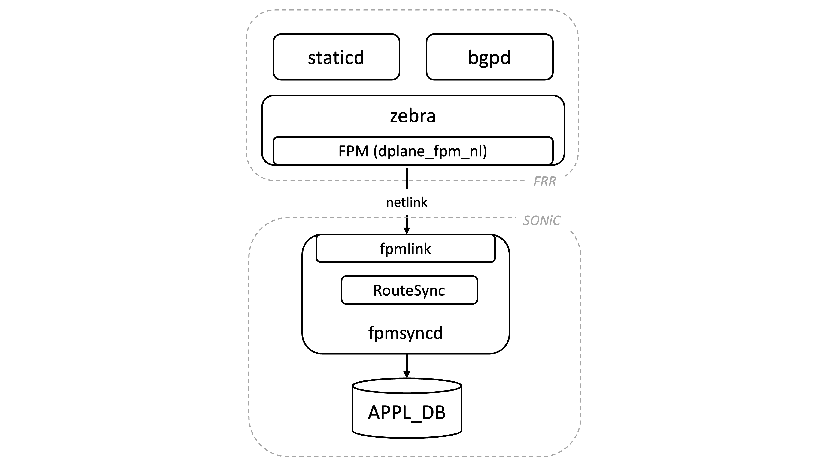
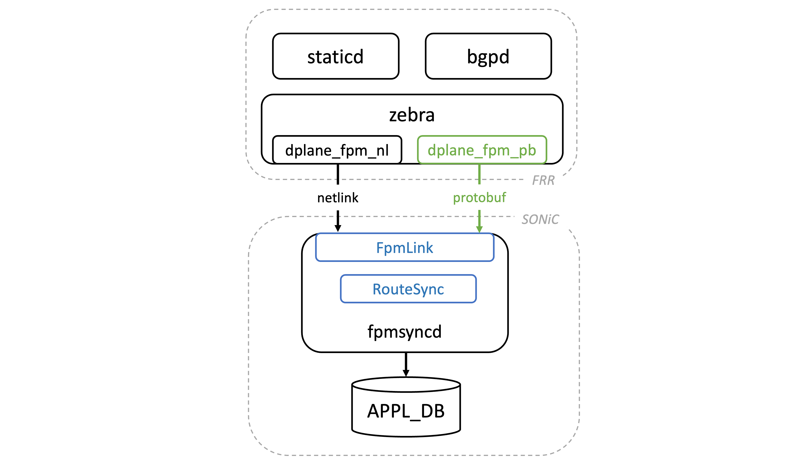
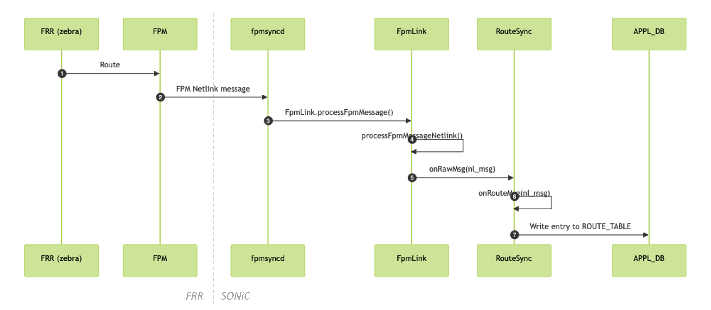
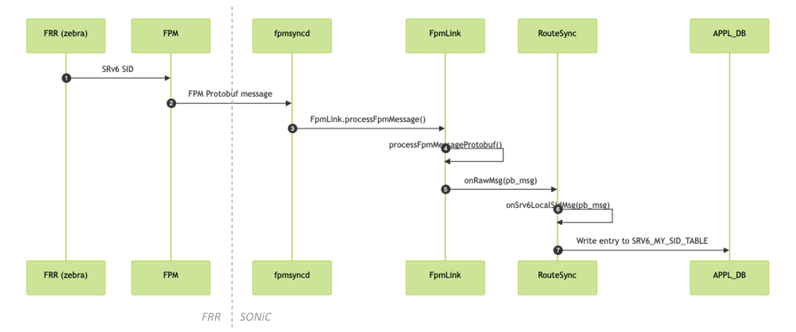

<!-- omit from toc -->
# FRR-SONiC Protobuf Communication Channel #

<!-- omit from toc -->
## Table of Content 

<!-- TOC -->

- [1. Revision](#1-revision)
- [2. Definitions/Abbreviations](#2-definitionsabbreviations)
- [3. Overview](#3-overview)
  - [3.1. Context](#31-context)
- [4. Scope](#4-scope)
- [5. Requirements](#5-requirements)
- [6. Architecture Design](#6-architecture-design)
- [7. High-Level Design](#7-high-level-design)
  - [7.1. FRR changes](#71-frr-changes)
  - [7.2. SONiC fpmsyncd changes](#72-sonic-fpmsyncd-changes)
  - [7.3. BGP container changes](#73-bgp-container-changes)
    - [7.3.1. Build FRR with the FPM Protobuf support](#731-build-frr-with-the-fpm-protobuf-support)
    - [7.3.2. Load the FPM Protobuf module on zebra startup](#732-load-the-fpm-protobuf-module-on-zebra-startup)
- [8. Testing Requirements/Design](#8-testing-requirementsdesign)
  - [8.1. Unit Test cases](#81-unit-test-cases)

<!-- /TOC -->

## 1. Revision  

| Rev  |    Date    |      Author                         | Change Description      |
| :--: | :--------: | :---------------------------------: | :---------------------: |
| 0.1  | 14/02/2024 | Carmine Scarpitta, Ahmed Abdelsalam | Initial version         |

## 2. Definitions/Abbreviations

| Definitions/Abbreviation | Description                             |
| ------------------------ | --------------------------------------- |
| ASIC                     | Application specific integrated circuit |
| BGP                      | Border Gateway Protocol                 |
| FIB                      | Forwarding Information Base             |
| FRR                      | Free Range Routing                      |
| FPM                      | Forwarding Plane Manager                |
| RIB                      | Routing Information Base                |
| SRv6                     | Segment Routing over IPv6               |
| SID                      | Segment Identifier                      |

## 3. Overview

SONiC has support for routing protocols such as BGP through the integration of the FRR routing suite. FRR's routing protocols calculate their optimal routes and send them to an intermediary FRR daemon named *zebra*. Zebra, in turn, leverages the Forwarding Plane Manager (FPM) module to push these routes to SONiC. Finally, on the SONiC side, the SONiC fpmsyncd component receives the routes provided by FRR and writes them into the SONiC Redis database.

	
*Figure 1: FRR-SONiC Communication Channel Overview*

### 3.1. Context

Currently, FRR communicates with SONiC using the Netlink message format. However, Netlink is primarily designed for transferring data between the kernel and user-space processes. Consequently, it is tailored to the specific requirements and data model of the kernel, lacking the flexibility needed to support many use cases on the SONiC dataplane, such as SRv6 VPNs.

As an example, let's consider a scenario where FRR needs to install an SRv6 SID into the SONiC dataplane. FRR must provide the following information, which is mandatorily required by the SONiC data model: SID value, behavior associated with the SID, behavior-specific parameters and SID format. Although the Netlink message format includes support for SID value, behavior, and behavior-specific parameters, it lacks support for the SID format.

The lack of flexibility of Netlink in supporting various use cases in SONiC was previously discussed in the SONiC Routing Working Group. The community has agreed on the following solution: migrating the communication channel between FRR and SONiC from Netlink to Protobuf, with FRR delivering all messages to SONiC using Protobuf. However, since the migration effort is substantial (as it requires recoding all message types supported so far from Netlink to Protobuf), it has been decided to adopt a transitional approach.
This involves introducing a new communication channel between FRR and SONiC specifically for exchanging information encoded in Protobuf format. In the short term, this new channel operates alongside the existing Netlink-based channel, running in parallel. New features are expected to utilize the Protobuf channel, while legacy functionalities will gradually transition from Netlink to Protobuf. Eventually, all messages will be transmitted through Protobuf.

For further details, please refer to the SONiC Routing Working Group meeting notes and recording:
https://lists.sonicfoundation.dev/g/sonic-wg-routing/wiki/34083.

## 4. Scope  

This document describes the changes required to support the exchange of data encoded in Protobuf format between FRR and SONiC.


## 5. Requirements

This feature requires:

* FRR to be able to deliver information to SONiC using both Netlink and Protobuf message formats
* SONiC fpmsyncd to handle Protobuf messages and Netlink messages received from FRR
* SONiC fpmsyncd to SET/DEL entries (such as regular routes, SRv6 SIDs and SRv6 routes) to APPL_DB

## 6. Architecture Design

Currently, the communication channel between FRR and SONiC exclusively supports the transmission of information encoded in the Netlink format. As previously mentioned (refer to [Section 3.1](#31-context)), the Netlink format is tailored to meet the specifications and data model of the kernel. Consequently, it exhibits limitations in accommodating various use cases on the SONiC dataplane.

To overcome the limitations imposed by the Netlink format, we propose extending the communication channel between FRR and SONiC. This extension would introduce the capability to transmit information encoded in a format independent on the kernel data model, specifically the Protobuf message format.

This proposal introduces a new FPM module in FRR, named `dplane_fpm_pb`. This module enables FRR to encode information using Protobuf as the message format and subsequently transmit the Protobuf message to SONiC.

On the SONiC side, we have a small daemon (`fpmsyncd`) that receives information from FRR and process it. We make some modifications to SONiC's `fpmsyncd`, allowing it to receive Protobuf messages from the new `dplane_fpm_pb` module, process them, and subsequently write the necessary information (such as SRv6 routes and SIDs) into the APPL_DB.

The following figure shows the changes to the SONiC Architecture:

	
*Figure 2: FRR-SONiC Protobuf Communication Channel - High-Level Architecture*

The new modules are colored in <span style="color:blue">blue</span>; the modified components are colored in <span style="color:green">green</span>.

## 7. High-Level Design 

### 7.1. FRR changes

FRR has a module called `dplane_fpm_nl` which is responsible for exporting the routing information to SONiC. The routing information exported by `dplane_fpm_nl` is encoded using Netlink as the message format.

In order to support transmitting information encoded in Protobuf format, we introduce a new module in FRR. The new module is called `dplane_fpm_pb` and is responsible for encoding and sending information to SONiC using Protobuf as the message format. The new FPM module (`dplane_fpm_pb`) is designed to coexist with the existing one (`dplane_fpm_nl`). The two modules can be run simultaneously.

To enable the FPM Protobuf module in FRR, two steps are required:

* FRR must be compiled with the support for the FPM Protobuf module.
* The FRR zebra daemon must load the FPM Protobuf module during startup.

To implement these modifications, a PR has been submitted to the FRR repository and is currently under review: https://github.com/FRRouting/frr/pull/14173.

### 7.2. SONiC fpmsyncd changes

On the SONiC side, SONiC's `fpmsyncd` is responsible for collecting the FIB state generated by FRR and dumping its content into the APPL_DB. Upon initialization, SONiC's `fpmsyncd` waits for incoming FPM connections on the FPM port (TCP port 2620). Subsequently, it enters an indefinite loop to receive FPM messages. Each FPM message is then routed to `FpmLink`, which is responsible for parsing the message and passing it to the appropriate handler (`RouteSync`). Currently, `RouteSync` is only capable of interpreting messages containing routes encoded in Netlink format.

We perform the following changes:

* We extend SONiC's `fpmsyncd` to accept connections from multiple FPM clients. This is required to support receiving information from both FPM Netlink (`dplane_fpm_nl`) and FPM Protobuf (`dplane_fpm_pb`) modules at the same time.
* We extend SONiC's `fpmsyncd` to parse messages encoded in protobuf.
* We extend SONiC's `RouteSync` by adding an handler to parse information encoded in Protobuf format, such as SRv6 routes and SIDs.

The following sequence diagram shows the operations performed when FRR delivers an FPM message to SONiC using the Netlink format:

	
*Figure 2: FRR-SONiC Communication Channel - Netlink Message*

* zebra sends an FPM message through the `dplane_fpm_nl` module (1).
* fpmsyncd receives the FPM message and passes the message to FpmLink. FpmLink invokes the callback `processFpmMessage()` to parse the received message (2).
* FpmLink passes the message to the `processFpmMessageNetlink()` callback (3). This callback passes the message to RouteSync (4).
* RouteSync invokes the handler onRouteMsg (5).
* RouteSync extracts the attributes of the route from the Netlink message and writes the route entry to the APPL_DB (6).

The following sequence diagram shows the operations performed when FRR delivers an FPM message to SONiC using the Protobuf format:

	
*Figure 2: FRR-SONiC Communication Channel - Protobuf Message*

* zebra sends an FPM message through the `dplane_fpm_pb` module (1).
* fpmsyncd receives the FPM message and passes the message to FpmLink. FpmLink invokes the callback `processFpmMessage()` to parse the received message (2).
* FpmLink passes the message to the `processFpmMessageProtobuf()` callback (3). This callback passes the message to RouteSync (4).
* RouteSync invokes the handler onSrv6LocalSidMsg (5).
* RouteSync extracts the attributes of the SRv6 SID from the Netlink message and writes the SRv6 SID entry to the APPL_DB (6).

### 7.3. BGP container changes

As mentioned earlier (see [Section 7.1](#71-frr-changes)), the FPM protobuf support in FRR is optional.
This implies that the newly introduced FPM protobuf module in FRR (`dplane_fpm_pb`) is disabled by default.

To activate the FPM Protobuf module in FRR, two steps are required:

* FRR must be compiled with the support for the FPM Protobuf module.
* The FRR zebra daemon must load the FPM Protobuf module during startup.

We make some modifications to the BGP container settings to accomplish this, as outlined in [Section 7.3.1](#731-build-frr-with-the-fpm-protobuf-support) and [Section 7.3.2](#732-load-the-fpm-protobuf-module-on-zebra-startup).


#### 7.3.1. Build FRR with the FPM Protobuf support

*sonic-buildimage* scripts compile FRR with the build-time options specified in the *debian/rules* file.
To enable the FPM Protobuf module in FRR, FRR needs to be compiled with the `--enable-dplane-pb` and `--enable-protobuf` options.

A new patch file is introduced to compile FRR with the above options. Specifically, this patch adjusts the FRR build options specified within the FRR's *debian/rules* file as follows:

* The option `--disable-protobuf` is replaced with `--enable-protobuf`
* The option `--enable-dplane-pb` is added

```diff
...

override_dh_auto_configure:
	$(shell dpkg-buildflags --export=sh); \
	dh_auto_configure -- \
		--sbindir=/usr/lib/frr \
		--with-vtysh-pager=/usr/bin/pager \
		--libdir=/usr/lib/$(DEB_HOST_MULTIARCH)/frr \
		--with-moduledir=/usr/lib/$(DEB_HOST_MULTIARCH)/frr/modules \
		LIBTOOLFLAGS="-rpath /usr/lib/$(DEB_HOST_MULTIARCH)/frr" \
		--disable-dependency-tracking \
		\
		$(CONF_RPKI) \
		$(CONF_LUA) \
		$(CONF_PIM6) \
		--with-libpam \
		--enable-doc \
		--enable-doc-html \
		--enable-snmp \
		--enable-fpm \
-		--disable-protobuf \
+		--enable-protobuf \
		--disable-zeromq \
		--enable-ospfapi \
		--enable-bgp-vnc \
		--enable-multipath=256 \
		\
		--enable-user=frr \
		--enable-group=frr \
		--enable-vty-group=frrvty \
		--enable-configfile-mask=0640 \
		--enable-logfile-mask=0640 \
+		--enable-dplane-pb \
		# end

...
```

#### 7.3.2. Load the FPM Protobuf module on zebra startup

To enable the FPM Protobuf module in FRR, the FRR zebra daemon should be started with the `-M dplane_fpm_pb` option.
The command line options used to start zebra are specified in the *supervisord.conf.j2* template file, located within the *dockers/docker-fpm-frr/frr/supervisord/* directory of the *sonic-buildimage* repository.

We modify the template *supervisor.conf.j2* file to add the `-M dplane_fpm_pb` option:

```jinja2
[program:zebra]
command=/usr/lib/frr/zebra -A 127.0.0.1 -s 90000000 -M dplane_fpm_nl -M snmp --asic-offload=notify_on_offload -M dplane_fpm_pb
```

Including the `-M dplane_fpm_pb` option ensures that zebra loads the FPM Protobuf module during startup.

## 8. Testing Requirements/Design  

### 8.1. Unit Test cases  

* **Test case 1:** Receiving an SRv6 VPN route encoded using the Protobuf format
  1. Generate an FPM message containing an SRv6 VPN route encoded using Protobuf.
  2. Call `FpmLink::processFpmMessage()` with the generated FPM message.
  3. Verify the delivery of the FPM message to RouteSync by checking if `RouteSync.onMsgRaw()` is invoked.
  4. Ensure that the route is added to the ROUTE_TABLE of APPL_DB.

* **Test case 2:** Receiving an SRv6 SID encoded using the Protobuf format
  1. Generate an FPM message containing an SRv6 SID encoded using Protobuf.
  2. Call `FpmLink::processFpmMessage()` with the generated FPM message.
  3. Verify the delivery of the FPM message to RouteSync by checking if `RouteSync.onMsgRaw()` is invoked.
  4. Ensure that the route is added to the SRV6_MY_SID_TABLE of APPL_DB.
