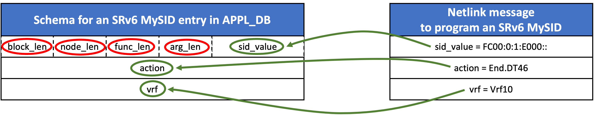

<!-- omit from toc -->
# FRR-SONiC Communication Channel Enhancements #

<!-- omit from toc -->
## Table of Content 

<!-- TOC -->

- [1. Revision](#1-revision)
- [2. Definitions/Abbreviations](#2-definitionsabbreviations)
- [3. Scope](#3-scope)
- [4. Overview](#4-overview)
	- [4.1. Context](#41-context)
		- [4.1.1. Problem](#411-problem)
			- [4.1.1.1. Example](#4111-example)
		- [4.1.2. Solution](#412-solution)
- [5. High-Level Design](#5-high-level-design)
	- [5.1. New FPM SONiC module](#51-new-fpm-sonic-module)
	- [5.2. Build FRR with the FPM SONiC module](#52-build-frr-with-the-fpm-sonic-module)
	- [5.3. Load the FPM module on zebra startup](#53-load-the-fpm-module-on-zebra-startup)

<!-- /TOC -->

## 1. Revision  

| Rev  |    Date    |      Author                         | Change Description      |
| :--: | :--------: | :---------------------------------: | :---------------------: |
| 0.1  | 14/02/2024 | Carmine Scarpitta, Ahmed Abdelsalam | Initial version         |

## 2. Definitions/Abbreviations

| Definitions/Abbreviation | Description                               |
| ------------------------ | ----------------------------------------- |
| ASIC                     | Application specific integrated circuit   |
| BGP                      | Border Gateway Protocol                   |
| FIB                      | Forwarding Information Base               |
| FRR                      | Free Range Routing                        |
| FPM                      | Forwarding Plane Manager                  |
| Protobuf                 | Protocol Buffers                          |
| RIB                      | Routing Information Base                  |
| SRv6                     | Segment Routing over IPv6                 |
| SID                      | Segment Identifier                        |
| SONiC                    | Software for Open Networking in the Cloud |

## 3. Scope  

Extending the communication channel between FRR and SONiC to support the programming of features that cannot be programmed with the current approach.

## 4. Overview

SONiC supports routing functionalities and protocols such as BGP through the integration of the FRR routing suite. Routing protocols provided by FRR calculate their optimal routes and send them to an intermediary FRR daemon named `zebra`. `zebra`, in turn, leverages the FPM module `dplane_fpm_nl` to push these routes to SONiC. Finally, a component of SONiC called `fpmsyncd` receives the routes sent by FRR and writes the route entries into the SONiC database.

	
*Figure 1: FRR-SONiC Current Communication Channel*

### 4.1. Context

#### 4.1.1. Problem

FRR communicates with SONiC through the FPM module. In order to program a route in SONiC, the FPM module first encodes the route in a Netlink message, and then it sends the Netlink message to SONiC. However, the FPM module programs the SONiC data plane using the same Netlink message used to program the kernel data plane. Although this Netlink message is suitable for programming the kernel data plane, it lacks some attributes required for supporting several features and use cases in SONiC. 

##### 4.1.1.1. Example

As an example, let's consider a scenario where FRR needs to program an SRv6 End.DT46 SID into the SONiC dataplane. The following figure shows the comparison between the kernel's data model and SONiC's data model.

	
*Figure 2: Example: Netlink cannot be used to program an SRv6 SID in SONiC*

The SONiC data model includes attributes (block_len, node_len, func_len, arg_len) that are not present in the kernel data model.

As mentioned earlier, to program a SID in SONiC, currently the FPM module generates a message that only contains the information required by the kernel (sid_value, action, vrf_table). Since some mandatory attributes are missing (block_len, node_len, func_len, arg_len), this Netlink message cannot be used to program the SID in SONiC. When SONiC receives the Netlink message, the installation of the SID fails.

*Note that SRv6 is merely one example, but this issue is general and exists for other features as well.*

#### 4.1.2. Solution

To overcome this limitation, we create a new FPM module called FPM SONiC module (`dplane_fpm_sonic`), designed specifically for SONiC. This module is hosted under the SONiC repository and maintained by the SONiC community. The new FPM SONiC module allows the SONiC community to design the features they need without any dependency on FRR. It encodes the routing information provided by FRR in a SONiC-specific Netlink message. The format of this message is tailored to the SONiC data model and includes all information required to program the feature in SONiC.


## 5. High-Level Design

### 5.1. New FPM SONiC module

We add a new FPM module in FRR, named FPM SONiC module (`dplane_fpm_sonic`). This module will be hosted under the SONiC repository and maintained by the SONiC community. To maintain backward compatibility and support all the features currently supported, initially, the new FPM SONiC module will be an exact copy of the existing FPM module (`dplane_fpm_nl`). This ensures that it will support all the Netlink messages supported so far. Over the time, the new FPM SONiC module can be extended by adding SONiC-specific Netlink messages to support any use case.

The following figure shows the changes to the SONiC architecture:

	
*Figure 3: FRR-SONiC New Communication Channel*

### 5.2. Build FRR with the FPM SONiC module

We add a new patch file to compile FRR with the new FPM SONiC module.

### 5.3. Load the FPM module on zebra startup

The new FPM SONiC module is disabled in FRR by default. To enable the new FPM SONiC module in FRR, we modify the startup options of the FRR Zebra daemon. The startup options are specified in the template file `supervisor.conf.j2` located under the `sonic-buildimage` repository.

We modify `supervisor.conf.j2` by adding the command-line option `-M dplane_fpm_sonic` to the startup options of zebra:

```jinja2
[program:zebra]
command=/usr/lib/frr/zebra -A 127.0.0.1 -s 90000000 -M dplane_fpm_sonic -M snmp --asic-offload=notify_on_offload
```
