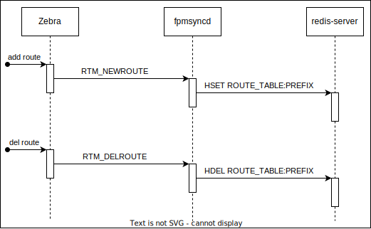

# `fpmsyncd` NextHop Group Enhancement High Level Design Document

<!-- omit in toc -->
## Table of Content 
- [Revision](#revision)
- [Scope](#scope)
- [Overview](#overview)
- [Requirements](#requirements)
- [Architecture Design](#architecture-design)
  - [Source Code change (TODO: move to proper place)](#source-code-change-todo-move-to-proper-place)
- [High-Level Design](#high-level-design)
  - [Current fpmsyncd processing flow (for reference)](#current-fpmsyncd-processing-flow-for-reference)
  - [Proposed fpmsyncd processing flow using NextHop Group](#proposed-fpmsyncd-processing-flow-using-nexthop-group)
  - [Value SET/DEL to APPL\_DB](#value-setdel-to-appl_db)
  - [Example of entries in APPL\_DB](#example-of-entries-in-appl_db)
  - [Example of entries in ASIC\_DB](#example-of-entries-in-asic_db)
- [SAI API](#sai-api)
- [Configuration and management](#configuration-and-management)
  - [Manifest (if the feature is an Application Extension)](#manifest-if-the-feature-is-an-application-extension)
  - [CLI/YANG model Enhancements](#cliyang-model-enhancements)
  - [Config DB Enhancements](#config-db-enhancements)
- [Warmboot and Fastboot Design Impact](#warmboot-and-fastboot-design-impact)
- [Restrictions/Limitations](#restrictionslimitations)
- [Testing Requirements/Design](#testing-requirementsdesign)
  - [Unit Test cases](#unit-test-cases)
  - [System Test cases](#system-test-cases)
- [Open/Action items - if any](#openaction-items---if-any)
  - [Backward compatibility with Fine-grain NHG, Ordered NHG/ECMP](#backward-compatibility-with-fine-grain-nhg-ordered-nhgecmp)

### Revision  

|  Rev  | Date  |               Author                | Change Description |
| :---: | :---: | :---------------------------------: | ------------------ |
|  0.1  |  TBD  | Kanji Nakano, Kentaro Ebisawa (NTT) | Initial version    |

### Scope  

This document details the design and implementation of the "fpmsyncd extension" related to NextHop Group behavior in SONiC.
The goal of this "fpmsyncd extension" is to integrate NextHop Group functionality into SONiC by writing NextHop Group entry from `fpmsyncd` to `APPL_DB` for NextHop Group operation in SONiC.

### Overview 

SONIC system has support for programming routes using the NextHop Group feature through the NextHop Group table in `APPL_DB` database.
The idea is to have a more efficient system that would involve managing the NextHop Group in use by the route table separately, and simply have the route table specify a reference to which NextHop Group to use.
Since at scale many routes will use the same NextHop Groups, this requires much smaller occupancy per route, and so more efficient building, transmission and parsing of per-route information. 

The current version of `fpmsyncd` has no support to handle the NextHop Group netlink messages sent by zebra process when it uses the new `dplane_fpm_nl` module.
This implementation modifies the `fpmsyncd` code to handle `RTM_NEWNEXTHOP` and `RTM_DELNEXTHOP` events and write it to the database.
Also, the `fpmsyncd` was modified to use the NextHop Group ID (`nexthop_group`) when programming the route to the `ROUTE_TABLE`.

These capabilities consist in:
- `fpmsyncd` is responsible for enabling the SET/DEL setting of `NEXTHOP_GROUP_TABLE` for `APPL_DB` in Redis DB.

### Requirements

`Fpmsyncd extension` requires:
- `fpmsyncd` to handle `RTM_NEWNEXTHOP` and `RTM_DELNEXTHOP` events from zebra via `dplane_fpm_nl`
- `fpmsyncd` to SET/DEL routes to `APPL_DB: ROUTE_TABLE`` using `nexthop_group`
- `fpmsyncd` to SET/DEL NextHop Group entry to `APPL_DB: NEXTHOP_GROUP_TABLE`

### Architecture Design 
<!--

This section covers the changes that are required in the SONiC architecture. In general, it is expected that the current architecture is not changed.
This section should explain how the new feature/enhancement (module/sub-module) fits in the existing architecture. 

If this feature is a SONiC Application Extension mention which changes (if any) needed in the Application Extension infrastructure to support new feature.
-->

This design directly modifies `fpmsyncd` to use the new `APPL_DB` tables.

The current `fpmsyncd` handle just the `RTM_NEWROUTE` and `RTM_DELROUTE` writing all route information for each route prefix to `ROUTE_TABLE` on Redis DB (`redis-server`).
When zebra process is initialized using the old fpm module, the `RTM_NEWROUTE` is sent with at least destination address, gateway, and interface id attributes.
For multipath route, the `RTM_NEWROUTE` is sent with a list of gateways and interfaces id.

This `Fpmsyncd extension` will modify `fpmsyncd` to handle  `RTM_NEWNEXTHOP` and `RTM_DELNEXTHOP` as below.

> TODO: Add diagram with flow described in Overview and Requirements

To implement this, below SONiC subsystems will be changed.

- sonic-buildimage
  - modify `sonic-cfggen` to set `fpm use-nexthop-groups`
  - patch `src/libnl3` to support `nh_id` (TODO: still required in latest master?)
  - modify `/zebra/rt_netlink.c` to use `vrf_id` for vrf, not `table_id`
- fpmsyncd (swss)
  - add default VRF in `/cfgmgr/vrfmgr.cpp`
  - add `RTM_NEWNEXTHOP` and `RTM_DELNEXTHOP` support in `/fpmsyncd/fpmlink.cpp`
  - add NextHop Group support in `/fpmsyncd/routesync.cpp` and `/fpmsyncd/routesync.h`
- frr
  - change plugin from `fpm` to `dplane_fpm_nl` in `/dockers/docker-fpm-frr/frr/supervisord/supervisord.conf.j2`
  - this is already done in the latest master branch with [PR#12852](https://github.com/sonic-net/sonic-buildimage/pull/12852)

#### Source Code change (TODO: move to proper place)

sonic-buildimage.patch

- /src/libnl3/patch/0003-Adding-support-for-RTA_NH_ID-attribute.patch
  - /dockers/docker-fpm-frr/frr/supervisord/supervisord.conf.j2
  - patch to `rt_nh_id`, `rtnl_route_set_nh_id` etc.
  - TODO: check if this is still required in the latest master
- add change to use next hop groups
  - change
    - `+fpm use-next-hop-groups`
    - `+fpm address 127.0.0.1 port 2620`
  - /dockers/docker-fpm-frr/frr/common/daemons.common.conf.j2
  - /src/sonic-bgpcfgd/tests/data/sonic-cfggen/
    - bgpd.conf.j2/all.conf
    - common/daemons.common.conf
    - frr.conf.j2/all.conf
    - staticd/staticd.conf
    - zebra/zebra.conf
  - /src/sonic-config-engine/tests/sample_output/py2/
    - bgpd_frr.conf
    - bgpd_frr_backend_asic.conf
    - bgpd_frr_frontend_asic.conf
    - frr.conf
    - staticd_frr.conf
    - t2-chassis-fe-bgpd.conf
    - etc.
- /src/sonic-frr/patch/dplane_fpm_nl-Use-vrf_id-for-vrf-not-tabled_id.patch
  - /zebra/rt_netlink.c

sonic-swss.patch

- add default VRF
  - /cfgmgr/vrfmgr.cpp
- Add `RTM_NEWNEXTHOP` and `RTM_DELNEXTHOP` support
  - /fpmsyncd/fpmlink.cpp
- many changes to support NextHop Group
  - /fpmsyncd/routesync.cpp
  - /fpmsyncd/routesync.h

### High-Level Design 
<!--

This section covers the high level design of the feature/enhancement. This section covers the following points in detail.
		
	- Is it a built-in SONiC feature or a SONiC Application Extension?
	- What are the modules and sub-modules that are modified for this design?
	- What are the repositories that would be changed?
	- Module/sub-module interfaces and dependencies. 
	- SWSS and Syncd changes in detail
	- DB and Schema changes (APPL_DB, ASIC_DB, COUNTERS_DB, LOGLEVEL_DB, CONFIG_DB, STATE_DB)
	- Sequence diagram if required.
	- Linux dependencies and interface
	- Warm reboot requirements/dependencies
	- Fastboot requirements/dependencies
	- Scalability and performance requirements/impact
	- Memory requirements
	- Docker dependency
	- Build dependency if any
	- Management interfaces - SNMP, CLI, RestAPI, etc.,
	- Serviceability and Debug (logging, counters, trace etc) related design
	- Is this change specific to any platform? Are there dependencies for platforms to implement anything to make this feature work? If yes, explain in detail and inform community in advance.
	- SAI API requirements, CLI requirements, ConfigDB requirements. Design is covered in following sections.
-->

#### Current fpmsyncd processing flow (for reference)

For example, if one configure following routes:

```
S>* 8.8.8.0/24 [1/0] via 10.0.1.5, Ethernet4, weight 1, 00:00:05
* via 10.0.1.6, Ethernet4, weight 1, 00:00:05
S>* 9.9.9.0/24 [1/0] via 10.0.1.5, Ethernet4, weight 1, 00:00:19
* via 10.0.1.6, Ethernet4, weight 1, 00:00:19
```

it will generate the following `APPL_DB` entries:

```
admin@sonic:~$ sonic-db-cli APPL_DB hgetall "ROUTE_TABLE:8.8.8.0/24"
{'nexthop': '10.0.1.5,10.0.1.6', 'ifname': 'Ethernet4,Ethernet4', 'weight': '1,1'}
admin@sonic:~$ sonic-db-cli APPL_DB hgetall "ROUTE_TABLE:9.9.9.0/24"
{'nexthop': '10.0.1.5,10.0.1.6', 'ifname': 'Ethernet4,Ethernet4', 'weight': '1,1'}
```

The flow below shows how `zebra`, `fpmsyncd` and `redis-server` interacts when using `fpm plugin` without NextHop Group:

<!-- omit in toc -->
##### Figure: Flow diagram without NextHop Group
  

#### Proposed fpmsyncd processing flow using NextHop Group

To support the nexthop group, `fpmsyncd` was modified to handle the new events `RTM_NEWNEXTHOP` and `RTM_DELNEXTHOP`.
`fpmsyncd` now has a new logic to associate routes to NextHop Groups.

The flow for the new NextHop Group feature is shown below:

<!-- omit in toc -->
##### Figure: Flow diagram new nexthop group feature


#### Value SET/DEL to APPL_DB

After enabling `use-next-hop-groups` in `dplane_fpm_nl` plugin, zebra will send `RTM_NEWNEXTHOP` to `fpmsyncd` when a new route is added.

`RTM_NEWNEXTHOP` is sent with 2 different attribute groups as shown in the table below:

<table>
  <tr><td>Event</td><td>Attributes</td><td>Description</td></tr>
  <tr><td rowspan="3">RTM_NEWNEXTHOP</td><td>NHA_ID</td><td>NextHop Group ID</td></tr>
  <tr><td>NHA_GATEWAY</td><td>gateway address</td></tr>
  <tr><td>NHA_OIF</td><td>The interface ID</td></tr>
  <tr><td rowspan="2">RTM_NEWNEXTHOP</td><td>NHA_ID</td><td>NextHop Group ID</td></tr>
  <tr><td>NHA_GROUP</td><td>A list of nexthop groups IDs with its respective weights.</td></tr>
</table>

After sending the `RTM_NEWNEXTHOP` events, zebra sends the `RTM_NEWROUTE` to `fpmsyncd` with NextHop Group ID as shown in the table below:

<table>
  <tr><td>Event</td><td>Attributes</td><td>Description</td></tr>
  <tr><td rowspan="2">RTM_NEWROUTE</td><td>RTA_DST</td><td>route prefix address</td></tr>
  <tr><td>RTA_NH_ID</td><td>NextHop Group ID</td></tr>
</table>

#### Example of entries in APPL_DB

For example. following route configuration will generate events show in the table below:

```
S>* 8.8.8.0/24 [1/0] via 10.0.1.5, Ethernet4, weight 1, 00:01:09 
  * via 10.0.2.6, Ethernet8, weight 1, 00:01:09 
S>* 9.9.9.0/24 [1/0] via 10.0.1.5, Ethernet4, weight 1, 00:00:04 
  * via 10.0.2.6, Ethernet8, weight 1, 00:00:04
```
<table>
  <tr><td>Seq</td><td>Event</td><td>Attributes</td><td>Value</td></tr>
  <tr><td rowspan="3">1</td><td rowspan="3">RTM_NEWNEXTHOP</td><td>NHA_ID</td><td>116</td></tr>
  <tr><td>NHA_GATEWAY</td><td>10.0.1.5</td></tr>
  <tr><td>NHA_OIF</td><td>22</td></tr>
  <tr><td rowspan="3">2</td><td rowspan="3">RTM_NEWNEXTHOP</td><td>NHA_ID</td><td>117</td></tr>
  <tr><td>NHA_GATEWAY</td><td>10.0.2.6</td></tr>
  <tr><td>NHA_OIF</td><td>23</td></tr>
  <tr><td rowspan="2">3</td><td rowspan="2">RTM_NEWNEXTHOP</td><td>NHA_ID</td><td>118</td></tr>
  <tr><td>NHA_GROUP</td><td>[{116,1},{117,1}]</td></tr>
  <tr><td rowspan="2">4</td><td rowspan="2">RTM_NEWROUTE</td><td>RTA_DST</td><td>8.8.8.0/24</td></tr>
  <tr><td>RTA_NH_ID</td><td>118</td></tr>
  <tr><td rowspan="2">5</td><td rowspan="2">RTM_NEWROUTE</td><td>RTA_DST</td><td>9.9.9.0/24</td></tr>
  <tr><td>RTA_NH_ID</td><td>118</td></tr>
</table>

A short description of `fpmsyncd` logic flow:

- When receiving `RTM_NEWNEXTHOP` events on sequence 1, 2 and 3, `fpmsyncd` will save the information in an internal list to be used when necessary.
- When `fpmsyncd` receive the `RTM_NEWROUTE` on sequence 4, the process will write the NextHop Group with ID 118 to the `NEXTHOP_GROUP_TABLE` using the information of gateway and interface from the NextHop Group events with IDs 116 and 117.
- Then `fpmsyncd` will create a new route entry to `ROUTE_TABLE` with a `nexthop_group` field with value `ID118`.
- When `fpmsyncd` receives the last `RTM_NEWROUTE` on sequence 5, the process will create a new route entry (but no NextHop Group entry) in `ROUTE_TABLE` with `nexthop_group` field with value `ID118`. (Note: This NextHop Group entry was created when the `fpmsyncd` received the event sequence 4.)

#### Example of entries in ASIC_DB

The `ASIC_DB` entry is not changed by this enhancement.
Therefore, even after this enhancement, table entries will be created for `ROUTE_ENTRY`, `NEXT_HOP_GROUP`, `NEXT_HOP_GROUP_MEMBER`, and `NEXT_HOP` respectively, as shown in the example below

<!-- omit in toc -->
##### Figure: Example of ASIC_DB entry


### SAI API 

No changes are being made in SAI. The end result of what gets programmed via SAI will be the same as current implementation.


### Configuration and management 

The output of 'show ip route' and 'show ipv6 route' will remain unchanged - the CLI code will resolve the NextHop Group ID referenced in the `ROUTE_TABLE` to display the next hops for the routes.


#### Manifest (if the feature is an Application Extension)

<!-- Paste a preliminary manifest in a JSON format. -->

#### CLI/YANG model Enhancements 

<!--
This sub-section covers the addition/deletion/modification of CLI changes and YANG model changes needed for the feature in detail. If there is no change in CLI for HLD feature, it should be explicitly mentioned in this section. Note that the CLI changes should ensure downward compatibility with the previous/existing CLI. i.e. Users should be able to save and restore the CLI from previous release even after the new CLI is implemented. 
This should also explain the CLICK and/or KLISH related configuration/show in detail.
https://github.com/sonic-net/sonic-utilities/blob/master/doc/Command-Reference.md needs be updated with the corresponding CLI change.
-->

No change.

#### Config DB Enhancements  

<!--
This sub-section covers the addition/deletion/modification of config DB changes needed for the feature. If there is no change in configuration for HLD feature, it should be explicitly mentioned in this section. This section should also ensure the downward compatibility for the change. 
-->

No change.

### Warmboot and Fastboot Design Impact  

<!--
Mention whether this feature/enhancement has got any requirements/dependencies/impact w.r.t. warmboot and fastboot. Ensure that existing warmboot/fastboot feature is not affected due to this design and explain the same.
-->

TBD (if applicable)

### Restrictions/Limitations  

TBD (if applicable)

### Testing Requirements/Design  

TBD

<!--
Explain what kind of unit testing, system testing, regression testing, warmboot/fastboot testing, etc.,
Ensure that the existing warmboot/fastboot requirements are met. For example, if the current warmboot feature expects maximum of 1 second or zero second data disruption, the same should be met even after the new feature/enhancement is implemented. Explain the same here.
Example sub-sections for unit test cases and system test cases are given below. 
-->

#### Unit Test cases  

TBD

#### System Test cases

TBD

### Open/Action items - if any 

<!--
NOTE: All the sections and sub-sections given above are mandatory in the design document. Users can add additional sections/sub-sections if required.
-->

#### Backward compatibility with Fine-grain NHG, Ordered NHG/ECMP

Eddy Kevetny (Nvidia) provided feedback about `net.ipv4.nexthop_compat_mode` and backward compatibility issue.

> From: eddyk=nvidia.com@lists.sonicfoundation.dev on Date: Thu, 29 Jun 2023 14:29:56 +0000
>
> You might want to set “net.ipv4.nexthop_compat_mode” with 0 to enable the Linux kernel to handle NHG and send to FRR.
> Then you will need also to set “fpm use-next-hop-groups” in FRR Vtysh. Please check which logic of NHG creation is preferrable: by kernel (supporting it from 5.3) or by FRR/Zebra
>
> Today the logic of creation of NHGs is located in SWSS (Route/NextHopGroup Orch Agent) and the community defined different types of NHG/ECMP with configuration via Redis – e.g. Fine-grain NHG, Ordered NHG/ECMP. If some apps are using these NHG types (I know for sure that Microsoft uses some of them) then it might be a problematic to have a logic of NHG/ECMP creation (particularly enforcing the specific order of NHG members) out of SWSS. Then you might need to consider the support of backward-compatibility for this feature 

We already have set `fpm use-next-hop-groups` in FRR.

We can disable `net.ipv4.nexthop_compat_mode` (set to 0) if it does not cause backward compatibility issue, e.g. if we want to make `fpmsyncd` to use NextHop Group an optional feature.

TODO: study NHG creation logic in SWSS (Route/NextHopGroup Orch Agent) to identify:
1. if we should make this feature an runtime option.
2. if this has backward compatibility issue