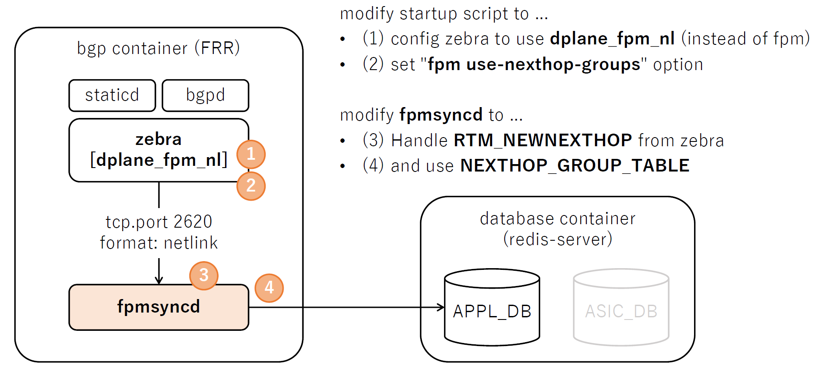

# `fpmsyncd` NextHop Group Enhancement High Level Design Document

<!-- omit in toc -->
## Table of Content 
- [Revision](#revision)
- [Scope](#scope)
- [Overview](#overview)
- [Requirements](#requirements)
- [Architecture Design](#architecture-design)
- [High-Level Design](#high-level-design)
  - [Current fpmsyncd processing flow (for reference)](#current-fpmsyncd-processing-flow-for-reference)
  - [Proposed fpmsyncd processing flow using NextHop Group](#proposed-fpmsyncd-processing-flow-using-nexthop-group)
  - [Value SET/DEL to APPL\_DB](#value-setdel-to-appl_db)
  - [Example of entries in APPL\_DB](#example-of-entries-in-appl_db)
  - [Example of entries in ASIC\_DB](#example-of-entries-in-asic_db)
- [SAI API](#sai-api)
- [Configuration and management](#configuration-and-management)
  - [CLI/YANG model Enhancements](#cliyang-model-enhancements)
  - [Config DB Enhancements](#config-db-enhancements)
- [Warmboot and Fastboot Design Impact](#warmboot-and-fastboot-design-impact)
- [Testing Requirements/Design](#testing-requirementsdesign)
  - [Unit Test cases](#unit-test-cases)
  - [System Test cases](#system-test-cases)
- [Open/Action items - if any](#openaction-items---if-any)
  - [libnl compatibility with upstream](#libnl-compatibility-with-upstream)
  - [Further performance improvements](#further-performance-improvements)
  - [Backward compatibility with current NHG creation logic (Fine-grain NHG, Ordered NHG/ECMP)](#backward-compatibility-with-current-nhg-creation-logic-fine-grain-nhg-ordered-nhgecmp)
  - [nexthop\_compat\_mode Kernel option](#nexthop_compat_mode-kernel-option)
  - [Warmboot/Fastboot support](#warmbootfastboot-support)
  - [No support for setting config enable/disable on runtime](#no-support-for-setting-config-enabledisable-on-runtime)

### Revision  

|  Rev  |     Date     |                       Author                       | Change Description                                                                                                                                                          |
| :---: | :----------: | :------------------------------------------------: | --------------------------------------------------------------------------------------------------------------------------------------------------------------------------- |
|  0.1  | Jul 14, 2023 | Kanji Nakano, Kentaro Ebisawa, Hitoshi Irino (NTT) | Initial version                                                                                                                                                             |
|  0.2  | Jul 30, 2023 |               Kentaro Ebisawa (NTT)                | Remove description about VRF which is not nessesary for NHG. Add High Level Architecture diagram. Add note related to libnl, Routing WG. Fix typo and improve explanations. |
|  0.3  | Sep 18, 2023 |               Kentaro Ebisawa (NTT)                | Update based on discussion at Routing WG on Sep 14th (Scope, Warmboot/Fastboot, CONFIG_DB)                                                                                             |

### Scope  

This document details the design and implementation of the "fpmsyncd extension" related to NextHop Group behavior in SONiC.
The goal of this "fpmsyncd extension" is to integrate NextHop Group functionality into SONiC by writing NextHop Group entry from `fpmsyncd` to `APPL_DB` for NextHop Group operation in SONiC.

- Scope of this change is to extend `fpmsyncd` to handle `RTM_NEWNEXTHOP` and `RTM_DELNEXTHOP` messages from FPM.
- There will be no change to SWSS/Orchagent.
- This change is backward compatible. Upgrade from a SONiC version that does not support this feature does not change the user's expected behavior as this feature is disabled by default.

### Overview 

SONIC system has support for programming routes using the NextHop Group feature through the NextHop Group table in `APPL_DB` database.
The idea is to have a more efficient system that would involve managing the NextHop Group in use by the route table separately, and simply have the route table specify a reference to which NextHop Group to use.
Since at scale many routes will use the same NextHop Groups, this requires much smaller occupancy per route, and so more efficient building, transmission and parsing of per-route information. 

The current version of `fpmsyncd` has no support to handle the NextHop Group netlink messages sent by zebra process via `FPM` using the `dplane_fpm_nl` module.
This implementation modifies the `fpmsyncd` code to handle `RTM_NEWNEXTHOP` and `RTM_DELNEXTHOP` events and write it to the database.
Also, the `fpmsyncd` was modified to use the NextHop Group ID (`nexthop_group`) when programming the route to the `ROUTE_TABLE` if `RTA_NH_ID` was included in the `RTM_NEWROUTE` message from zebra via `FPM`.

Use case example of this feature would be BGP PIC, and recursive routes handling.
BGP PIC has started in design discussion in the SONiC Routing WG.
Recursive routes support would be discussed after.
See [09072023 Routing WG Meeting minutes](https://lists.sonicfoundation.dev/g/sonic-wg-routing/wiki/34786) for further information about BGP PIC discussion.

### Requirements

`Fpmsyncd extension` requires:
- `fpmsyncd` to handle `RTM_NEWNEXTHOP` and `RTM_DELNEXTHOP` events from zebra via `dplane_fpm_nl`
- `fpmsyncd` to SET/DEL routes to `APPL_DB: ROUTE_TABLE` using `nexthop_group`
- `fpmsyncd` to SET/DEL NextHop Group entry to `APPL_DB: NEXTHOP_GROUP_TABLE`

This feature must be disabled by default.
- When this feature is disabled, behavior will be the same as before introducing this feature.
  - i.e. `NEXTHOP_GROUP_TABLE` entry will not be created and `nexthop_group` will not be used in `ROUTE_TABLE` entry in `APPL_DB`.
- See section [Configuration and management](#configuration-and-management) for details on how this feature is disabled/enabled.

### Architecture Design 
<!--

This section covers the changes that are required in the SONiC architecture. In general, it is expected that the current architecture is not changed.
This section should explain how the new feature/enhancement (module/sub-module) fits in the existing architecture. 

If this feature is a SONiC Application Extension mention which changes (if any) needed in the Application Extension infrastructure to support new feature.
-->

This design modifies `fpmsyncd` to use the new `APPL_DB` tables.

The current `fpmsyncd` handle just the `RTM_NEWROUTE` and `RTM_DELROUTE` writing all route information for each route prefix to `ROUTE_TABLE` on Redis DB (`redis-server`).
When zebra process is initialized using the old fpm module, the `RTM_NEWROUTE` is sent with at least destination address, gateway, and interface id attributes.
For multipath route, the `RTM_NEWROUTE` is sent with a list of gateway and interface id.

This `Fpmsyncd extension` will modify `fpmsyncd` to handle  `RTM_NEWNEXTHOP` and `RTM_DELNEXTHOP` as below.

<!-- omit in toc -->
##### Figure: Fpmsyncd NHG High Level Architecture


- FRR configuration
  - (1) config zebra to use `dplane_fpm_nl` instead of `fpm` module (this is default since 202305 release)
  - (2) set `fpm use-nexthop-groups` option (this is disabled by default and enabled via `CONFIG_DB`)
- fpmsyncd enhancement
  - (3) Handle `RTM_NEWNEXTHOP` fpm message from zebra
  - (4) and create `NEXTHOP_GROUP_TABLE` entry


### High-Level Design 
<!--

This section covers the high level design of the feature/enhancement. This section covers the following points in detail.
		
	- Is it a built-in SONiC feature or a SONiC Application Extension?
	- What are the modules and sub-modules that are modified for this design?
	- What are the repositories that would be changed?
	- Module/sub-module interfaces and dependencies. 
	- SWSS and Syncd changes in detail
	- DB and Schema changes (APPL_DB, ASIC_DB, COUNTERS_DB, LOGLEVEL_DB, CONFIG_DB, STATE_DB)
	- Sequence diagram if required.
	- Linux dependencies and interface
	- Warm reboot requirements/dependencies
	- Fastboot requirements/dependencies
	- Scalability and performance requirements/impact
	- Memory requirements
	- Docker dependency
	- Build dependency if any
	- Management interfaces - SNMP, CLI, RestAPI, etc.,
	- Serviceability and Debug (logging, counters, trace etc) related design
	- Is this change specific to any platform? Are there dependencies for platforms to implement anything to make this feature work? If yes, explain in detail and inform community in advance.
	- SAI API requirements, CLI requirements, ConfigDB requirements. Design is covered in following sections.
-->

#### Current fpmsyncd processing flow (for reference)

For example, if one configure following routes:

```
S>* 8.8.8.0/24 [1/0] via 10.0.1.5, Ethernet4, weight 1, 00:00:05
* via 10.0.1.6, Ethernet4, weight 1, 00:00:05
S>* 9.9.9.0/24 [1/0] via 10.0.1.5, Ethernet4, weight 1, 00:00:19
* via 10.0.1.6, Ethernet4, weight 1, 00:00:19
```

it will generate the following `APPL_DB` entries:

```
admin@sonic:~$ sonic-db-cli APPL_DB hgetall "ROUTE_TABLE:8.8.8.0/24"
{'nexthop': '10.0.1.5,10.0.1.6', 'ifname': 'Ethernet4,Ethernet4', 'weight': '1,1'}
admin@sonic:~$ sonic-db-cli APPL_DB hgetall "ROUTE_TABLE:9.9.9.0/24"
{'nexthop': '10.0.1.5,10.0.1.6', 'ifname': 'Ethernet4,Ethernet4', 'weight': '1,1'}
```

The flow below shows how `zebra`, `fpmsyncd` and `redis-server` interacts when using `fpm plugin` without NextHop Group:

<!-- omit in toc -->
##### Figure: Flow diagram without NextHop Group
  

#### Proposed fpmsyncd processing flow using NextHop Group

To support the nexthop group, `fpmsyncd` was modified to handle the new events `RTM_NEWNEXTHOP` and `RTM_DELNEXTHOP`.
`fpmsyncd` now has a new logic to associate routes to NextHop Groups.

The flow for the new NextHop Group feature is shown below:

<!-- omit in toc -->
##### Figure: Flow diagram new nexthop group feature


#### Value SET/DEL to APPL_DB

After enabling `use-next-hop-groups` in `dplane_fpm_nl` plugin, zebra will send `RTM_NEWNEXTHOP` to `fpmsyncd` when a new route is added.

`RTM_NEWNEXTHOP` is sent with 2 different attribute groups as shown in the table below:

<table>
  <tr><td>Event</td><td>Attributes</td><td>Description</td></tr>
  <tr><td rowspan="3">RTM_NEWNEXTHOP</td><td>NHA_ID</td><td>NextHop Group ID</td></tr>
  <tr><td>NHA_GATEWAY</td><td>gateway address</td></tr>
  <tr><td>NHA_OIF</td><td>The interface ID</td></tr>
  <tr><td rowspan="2">RTM_NEWNEXTHOP</td><td>NHA_ID</td><td>NextHop Group ID</td></tr>
  <tr><td>NHA_GROUP</td><td>A list of nexthop groups IDs with its respective weights.</td></tr>
</table>

After sending the `RTM_NEWNEXTHOP` events, zebra sends the `RTM_NEWROUTE` to `fpmsyncd` with NextHop Group ID as shown in the table below:

<table>
  <tr><td>Event</td><td>Attributes</td><td>Description</td></tr>
  <tr><td rowspan="2">RTM_NEWROUTE</td><td>RTA_DST</td><td>route prefix address</td></tr>
  <tr><td>RTA_NH_ID</td><td>NextHop Group ID</td></tr>
</table>

#### Example of entries in APPL_DB

For example. following route configuration will generate events show in the table below:

```
S>* 8.8.8.0/24 [1/0] via 10.0.1.5, Ethernet4, weight 1, 00:01:09 
  * via 10.0.2.6, Ethernet8, weight 1, 00:01:09 
S>* 9.9.9.0/24 [1/0] via 10.0.1.5, Ethernet4, weight 1, 00:00:04 
  * via 10.0.2.6, Ethernet8, weight 1, 00:00:04
```
<table>
  <tr><td>Seq</td><td>Event</td><td>Attributes</td><td>Value</td></tr>
  <tr><td rowspan="3">1</td><td rowspan="3">RTM_NEWNEXTHOP</td><td>NHA_ID</td><td>116</td></tr>
  <tr><td>NHA_GATEWAY</td><td>10.0.1.5</td></tr>
  <tr><td>NHA_OIF</td><td>22</td></tr>
  <tr><td rowspan="3">2</td><td rowspan="3">RTM_NEWNEXTHOP</td><td>NHA_ID</td><td>117</td></tr>
  <tr><td>NHA_GATEWAY</td><td>10.0.2.6</td></tr>
  <tr><td>NHA_OIF</td><td>23</td></tr>
  <tr><td rowspan="2">3</td><td rowspan="2">RTM_NEWNEXTHOP</td><td>NHA_ID</td><td>118</td></tr>
  <tr><td>NHA_GROUP</td><td>[{116,1},{117,1}]</td></tr>
  <tr><td rowspan="2">4</td><td rowspan="2">RTM_NEWROUTE</td><td>RTA_DST</td><td>8.8.8.0/24</td></tr>
  <tr><td>RTA_NH_ID</td><td>118</td></tr>
  <tr><td rowspan="2">5</td><td rowspan="2">RTM_NEWROUTE</td><td>RTA_DST</td><td>9.9.9.0/24</td></tr>
  <tr><td>RTA_NH_ID</td><td>118</td></tr>
</table>

A short description of `fpmsyncd` logic flow:

- When receiving `RTM_NEWNEXTHOP` events on sequence 1, 2 and 3, `fpmsyncd` will save the information in an internal list to be used when necessary.
- When `fpmsyncd` receive the `RTM_NEWROUTE` on sequence 4, the process will write the NextHop Group with ID 118 to the `NEXTHOP_GROUP_TABLE` using the information of gateway and interface from the NextHop Group events with IDs 116 and 117.
- Then `fpmsyncd` will create a new route entry to `ROUTE_TABLE` with a `nexthop_group` field with value `ID118`.
- When `fpmsyncd` receives the last `RTM_NEWROUTE` on sequence 5, the process will create a new route entry (but no NextHop Group entry) in `ROUTE_TABLE` with `nexthop_group` field with value `ID118`. (Note: This NextHop Group entry was created when the `fpmsyncd` received the event sequence 4.)

#### Example of entries in ASIC_DB

The `ASIC_DB` entry is not changed by this enhancement.
Therefore, even after this enhancement, table entries will be created for `ROUTE_ENTRY`, `NEXT_HOP_GROUP`, `NEXT_HOP_GROUP_MEMBER`, and `NEXT_HOP` respectively, as shown in the example below

<!-- omit in toc -->
##### Figure: Example of ASIC_DB entry


### SAI API 

No changes are being made in SAI.
The end result of what gets programmed via SAI will be the same as current implementation when manually adding `NEXTHOP_GROUP_TABLE` entries to `APPL_DB`.


### Configuration and management 

#### CLI/YANG model Enhancements 

<!--
This sub-section covers the addition/deletion/modification of CLI changes and YANG model changes needed for the feature in detail. If there is no change in CLI for HLD feature, it should be explicitly mentioned in this section. Note that the CLI changes should ensure downward compatibility with the previous/existing CLI. i.e. Users should be able to save and restore the CLI from previous release even after the new CLI is implemented. 
This should also explain the CLICK and/or KLISH related configuration/show in detail.
https://github.com/sonic-net/sonic-utilities/blob/master/doc/Command-Reference.md needs be updated with the corresponding CLI change.
-->

The output of 'show ip route' and 'show ipv6 route' will remain unchanged - the CLI code will resolve the NextHop Group ID referenced in the `ROUTE_TABLE` to display the next hops for the routes.

TODO: update config/show CLI inline with CONFIG_DB enhancement. (including CLI/YANG model Enhancements)

#### Config DB Enhancements  

<!--
This sub-section covers the addition/deletion/modification of config DB changes needed for the feature. If there is no change in configuration for HLD feature, it should be explicitly mentioned in this section. This section should also ensure the downward compatibility for the change. 
-->

This feature should be disabled/enabled using CONFIG_DB.

This configuration is backward compatible. Upgrade from a SONiC version that does not support this feature does not change the user's expected behavior as this flag is set to be disabled by default.

This setting can NOT be enabled or disabled at runtime.
Reboot is required after enabling/disabling this feature to make sure route entry using and not using this NHG feature would not co-exisit in the `APPL_DB`.

TODO: add schema and example of CONFIG_DB entry to below.

Configuration schema in ABNF format:

```
TODO
```

Sample of CONFIG DB snippet given below:

```
TODO
```


### Warmboot and Fastboot Design Impact  

<!--
Mention whether this feature/enhancement has got any requirements/dependencies/impact w.r.t. warmboot and fastboot. Ensure that existing warmboot/fastboot feature is not affected due to this design and explain the same.
-->

- When the feature is disabled, there should be no impact to Warmboot and Fastboot.
- When the feature is enabled, there will be no warmboot nor fastboot support.

When the feature is enabled, NHG ID will be managed by FRR which will change after FRR related process or BGP container restart.
We need a way to either let FRR preserve the ID or a way to correlate the NHGs, IDs and it's members before and after the restart.

We will continue discussion on how we could support Warmboot/Fastboot for future enhancements.

### Testing Requirements/Design  

<!--
Explain what kind of unit testing, system testing, regression testing, warmboot/fastboot testing, etc.,
Ensure that the existing warmboot/fastboot requirements are met. For example, if the current warmboot feature expects maximum of 1 second or zero second data disruption, the same should be met even after the new feature/enhancement is implemented. Explain the same here.
Example sub-sections for unit test cases and system test cases are given below. 
-->

#### Unit Test cases  

> TBD: Should we add script to unit test fpmsyncd?
> e.g. create a script to push RTM_NEWNEXTHOP and RTM_DELNEXTHOP message to fpmsyncd and create stub redis DB to check entries are created as expected.

#### System Test cases

Add route

1. Create static route with 2 or more ECMP routes (which cause zebra to send `RTM_NEWNEXTHOP`)
2. Confirm `APPL_DB` entries are created as expected

Del route

1. Delete static route created in previous test (which cause zebra to send `RTM_DELNEXTHOP`)
2. Confirm `APPL_DB` entries are deleted as expected

### Open/Action items - if any 

<!--
NOTE: All the sections and sub-sections given above are mandatory in the design document. Users can add additional sections/sub-sections if required.
-->

#### libnl compatibility with upstream

To add this feature, we have extended `libnl` to support NextHop Group. (i.e. `nh_id`, `RTM_NEWNEXTHOP` etc.)

However, there is a proposal [libnl: PR#332](https://github.com/thom311/libnl/pull/332/) to support NextHop Group in upstream `libnl`.
We should review this PR (and any other related patches if found) so difference from the upstream code would be minimal.

#### Further performance improvements

Extention to fpmsyncd described in this HLD will only change how `fpmsyncd` will handle `RTM_NEWNEXTHOP` and `RTM_DELNEXTHOP`.

Further study is required for more fundamental improvements, e.g. how zebra handles NextHop Groups in scale, communication channel between zebra and fpmsyncd, improvements in FRR like BGP PIC support etc.

Refer to the meeting minutes [SONiC Routing Working Group](https://lists.sonicfoundation.dev/g/sonic-wg-routing/wiki) for discussions related to future improvements.
For the discussion specific to this HLD, check [07132023 Meeting Minutes](https://lists.sonicfoundation.dev/g/sonic-wg-routing/wiki/34321)

#### Backward compatibility with current NHG creation logic (Fine-grain NHG, Ordered NHG/ECMP)

This feature is disabled by default and thus backward compatible that it would not impact the current NHG creation logic in SWSS/Orchagent.

When enabled, NHG ID and member management will be handled by FRR, and the current NHG creation logic in SWSS/Orchagent will not be used.
i.e. behavior will be same as the current behavior of manually adding entry to `APPL_DB: NEXTHOP_GROUP_TABLE`.


#### nexthop_compat_mode Kernel option

In regards to NextHop Group, Linux Kernel runs in compatibility mode which sends netlink message using both old route format without `RTA_NH_ID` and new format using `RTA_NH_ID`.

There is a `sysctl` option `net.ipv4.nexthop_compat_mode nexthop_compat_mode` which is on by default but provides the ability to turn off compatibility mode allowing systems to only send route update with the new format which could potentially improve performance.

This option is not changed as part this HLD to avoid unexpected impact to the existing behavior.

One should carefully study the impact of this change before chainging this option.

#### Warmboot/Fastboot support

Currently this feature does not work with Warmboot/Fastboot.
We will continue discussion on how we could support Warmboot/Fastboot for future enhancements.

#### No support for setting config enable/disable on runtime

This feature can NOT be enabled or disabled at runtime.
Reboot is required after enabling/disabling this feature to make sure route entry using and not using this NHG feature would not co-exisit in the `APPL_DB`.