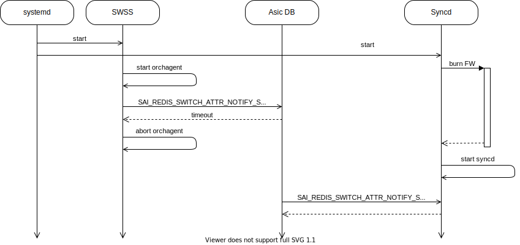

# FW Burn Init Issue
# Overview
- We have an issue in init flow when FW burn takes place.
- We can see that SWSS Orchagent tries to configure Syncd while FW burn takes place.
- Since the flow is valid the decision that was taken is to increase timeout for Orchagent calls.

# High-Level Design
- We set the timeout for SAI Redis calls in Orchagent init flow.
- Timeout value determined by system type.
- We have 2 system types, with and without Gearbox.
- In systems without Gearbox, FW burn takes ~2 min -> set timeout to 150 seconds
- In systems with Gearbox, FW burn takes ~7 min -> set timeout to 480 seconds
- See below table with time measurements

|Operation|SPC1|SPC2|SPC3|SPC2 with Gearbox
|--|--|--|--|--|
|MST start|2s|2s|2s|2s
|FW burn|1m55s|1m27s|1m32s|1m35s
|SXD start|3s|12s|42s|5m26s
|Whole process|2m|1m41s|2m16s|7m3s

# API
- This API allows us to set the timeout for SAI Redis API calls.
- Identifier: SAI_REDIS_SWITCH_ATTR_GET_RESPONSE_TIMEOUT_MS
- Value: determined by system type.
