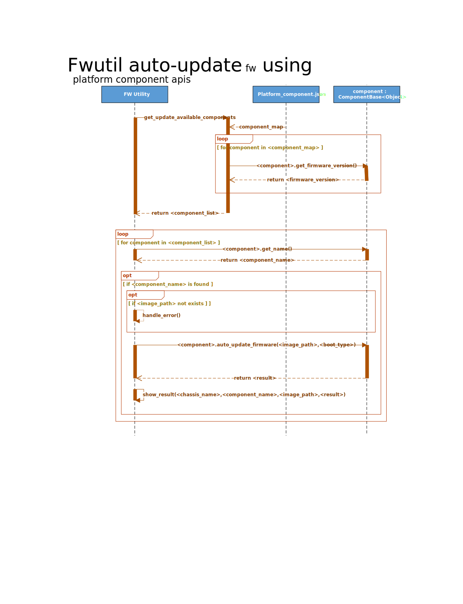
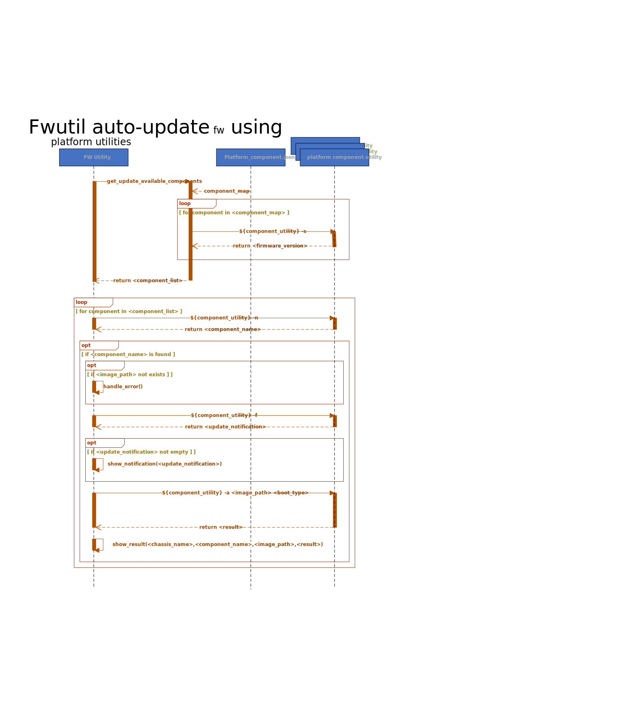

# SONiC FW utility

## High Level Design document

## Table of contents
- [About this manual](#about-this-manual)
- [Revision](#revision)
- [Abbreviations](#abbreviations)
- [1 Introduction](#1-introduction)
    - [1.1 Feature overview](#11-feature-overview)
    - [1.2 Requirements](#12-requirements)
        - [1.2.1 Functionality](#121-functionality)
        - [1.2.2 Command interface](#122-command-interface)
        - [1.2.3 Error handling](#123-error-handling)
        - [1.2.4 Event logging](#124-event-logging)
- [2 Design](#2-design)
    - [2.1 Overview](#21-overview)
    - [2.2 FW utility](#22-fw-utility)
        - [2.2.1 Command structure](#221-command-structure)
        - [2.2.2 Command interface](#222-command-interface)
            - [2.2.2.1 Show commands](#2221-show-commands)
                - [2.2.2.1.1 Overview](#22211-overview)
                - [2.2.2.1.2 Description](#22212-description)
            - [2.2.2.2 Install commands](#2222-install-commands)
                - [2.2.2.2.1 Overview](#22221-overview)
                - [2.2.2.2.2 Description](#22222-description)
            - [2.2.2.3 Update commands](#2223-update-commands)
                - [2.2.2.3.1 Overview](#22231-overview)
                - [2.2.2.3.2 Description](#22232-description)
            - [2.2.2.4 Auto-Update commands](#2224-auto-update-commands)
                - [2.2.2.4.1 Overview](#22241-overview)
                - [2.2.2.4.2 Description](#22242-description)
                - [2.2.2.4.3 Platform FW Update utility](#22243-plarform-fw-update-utility)
                - [2.2.2.4.4 Auto-update Use Cases](#22244-auto-update-use-cases)
- [3 Flows](#3-flows)
    - [3.1 Show components status](#31-show-components-status)
    - [3.2 Show available updates](#32-show-available-updates)
    - [3.3 Install component FW](#33-install-component-fw)
        - [3.3.1 Non modular chassis platform](#331-non-modular-chassis-platform)
        - [3.3.2 Modular chassis platform](#332-modular-chassis-platform)
    - [3.4 Auto-update platform component firmwares](#33-Auto-update-platform-component-firmwares)
        - [3.4.1 Auto-update platform component firmwares](#331-Auto-update-platform-component-firmwares)
        - [3.4.2 Auto-update using platform utility](#332-Auto-update-using-platform-utility)
- [4 Tests](#4-tests)
    - [4.1 Unit tests](#41-unit-tests)

## About this manual

This document provides general information about FW utility implementation in SONiC.

## Revision

| Rev | Date       | Author         | Description                       |
|:---:|:----------:|:--------------:|:----------------------------------|
| 0.1 | 21/08/2019 | Nazarii Hnydyn | Initial version                   |
| 0.2 | 10/09/2019 | Nazarii Hnydyn | Review feedback and other changes |
| 0.3 | 17/09/2019 | Nazarii Hnydyn | Align flows with the platform API |
| 0.4 | 18/12/2019 | Nazarii Hnydyn | CLI review feedback               |
| 0.5 | 05/05/2020 | Nazarii Hnydyn | Automatic FW update per component |
| 0.6 | 08/03/2020 | Sujin Kang     | Add firmware auto-update command  |

## Abbreviations

| Term   | Meaning                                             |
|:-------|:----------------------------------------------------|
| FW     | Firmware                                            |
| SONiC  | Software for Open Networking in the Cloud           |
| PSU    | Power Supply Unit                                   |
| QSFP   | Quad Small Form-factor Pluggable                    |
| EEPROM | Electrically Erasable Programmable Read-Only Memory |
| I2C    | Inter-Integrated Circuit                            |
| SPI    | Serial Peripheral Interface                         |
| JTAG   | Joint Test Action Group                             |
| BIOS   | Basic Input/Output System                           |
| CPLD   | Complex Programmable Logic Device                   |
| FPGA   | Field-Programmable Gate Array                       |
| SSD    | Solid State Drive                                   |
| URL    | Uniform Resource Locator                            |
| API    | Application Programming Interface                   |
| N/A    | Not Applicable/Not Available                        |

## List of figures

[Figure 1: FW utility High Level Design](#figure-1-fw-utility-high-level-design)  
[Figure 2: Show components status flow](#figure-2-show-components-status-flow)  
[Figure 3: Show available updates flow](#figure-3-show-available-updates-flow)  
[Figure 4: FW install (non modular) flow](#figure-4-fw-install-non-modular-flow)  
[Figure 5: FW install (modular) flow](#figure-5-fw-install-modular-flow)  

## List of tables

[Table 1: Event logging](#table-1-event-logging)

# 1 Introduction

## 1.1 Feature overview

A modern network switch is a sophisticated equipment which consists of many auxiliary components  
which are responsible for managing different subsystems (e.g., PSU/FAN/QSFP/EEPROM/THERMAL)  
and providing necessary interfaces (e.g., I2C/SPI/JTAG).

Basically these components are complex programmable logic devices with it's own HW architecture  
and software. The most important are BIOS/CPLD/FPGA etc.

It is very important to always have the latest recommended software version to improve device stability,  
security and performance. Also, software updates can add new features and remove outdated ones.

In order to make software update as simple as possible and to provide a nice user frindly  
interface for various maintenance operations (e.g., install a new FW or query current version)  
we might need a dedicated FW utility.

## 1.2 Requirements

### 1.2.1 Functionality

**This feature will support the following functionality:**
1. Manual FW installation for particular platform component
2. Complete FW installation for particular platform component
3. Querying platform components and FW versions
4. Querying available FW updates for all platform components
5. Automatic FW updates for all available platform components

### 1.2.2 Command interface

**This feature will support the following commands:**
1. show: Display FW versions/updates
2. install: Manual FW installation
3. update: Complete FW installation
3. auto-update: Automatic FW updates

### 1.2.3 Error handling

**This feature will provide error handling for the next situations:**
1. Invalid input
2. Incompatible options/parameters
3. Invalid/nonexistent FW URL/path

**Note:** FW binary validation (checksum, format, etc.) should be done by SONiC platform API

### 1.2.4 Event logging

**This feature will provide event logging for the next situations:**
1. FW binary downloading over URL: start/end
2. FW binary downloading over URL: error
3. FW binary installation: start/end
4. FW binary installation: error

###### Table 1: Event logging

| Event                                     | Severity |
|:------------------------------------------|:---------|
| FW binary downloading over URL: start/end | NOTICE   |
| FW binary downloading over URL: error     | ERROR    |
| FW binary installation: start/end         | INFO     |
| FW binary installation: error             | ERROR    |
| FW binary auto-update : start/end         | INFO     |
| FW binary auto-update : error             | ERROR    |

**Note:** Some extra information also will be logged:
1. Component location (e.g., Chassis1/Module1/BIOS)
2. Operation result (e.g., success/failure)
3. FW binary source location (e.g., current/next/custom)

# 2 Design

## 2.1 Overview


###### Figure 1: FW utility High Level Design

In order to improve scalability and performance a modern network switches provide different architecture solutions:
1. Non modular chassis platforms
2. Modular chassis platforms

Non modular chassis platforms may contain only one chassis.  
A chassis may contain it's own set of components.

Modular chassis platforms may contain only one chassis.  
A chassis may contain one or more modules and it's own set of components.  
Each module may contain it's own set of components.

Basically each chassis/module may contain one or more components (e.g., BIOS/CPLD/FPGA).

SONiC platform API provides an interface for FW maintenance operations for both modular and  
non modular chassis platforms. Both modular and non modular chassis platforms share the same platform API,  
but may have different implementation.

SONiC FW utility uses platform API to interact with the various platform components.
SONiC FW utility extends to support for the automatic firmware update based on "platform_components.json" under platform directory and next reboot option which is passed as a option for `fwutil autoupdate fw` command.
SONiC FW utility also extends to support for the automatic firmware update with a custom firmware package that can include any firmware update tool and the firmware update tool will be used for the firmware update if it's specified in the "platform_components.json".

## 2.2 FW utility

### 2.2.1 Command structure

**User interface**:
```
fwutil
|--- show
|    |--- version
|    |--- status
|    |--- updates -i|--image=<current|next>
|
|--- install
|    |--- chassis
|    |    |--- component <component_name>
|    |         |--- fw -y|--yes <fw_path>
|    |
|    |--- module <module_name>
|         |--- component <component_name>
|              |--- fw -y|--yes <fw_path>
|
|--- update
|    |--- chassis
|    |    |--- component <component_name>
|    |         |--- fw -y|--yes -f|--force -i|--image=<current|next>
|    |
|    |--- module <module_name>
|         |--- component <component_name>
|              |--- fw -y|--yes -f|--force -i|--image=<current|next>
|
|--- auto-update
     |--- fw -z|--image=<current|next> --b|--boot=<any|none|fast|warm|cold|powercycle>
     |--- fw -z|--fw-image=<fw_package.tar.gz> --b|--boot=<any|none|fast|warm|cold|powercycle>

**Note:** <fw_path> can be absolute path or URL
```

### 2.2.2 Command interface

#### 2.2.2.1 Show commands

##### 2.2.2.1.1 Overview

The purpose of the show commands group is to provide an interface for:
1. FW utility related information query (version, etc.)
2. Platform components related information query (version, description, etc.)
3. Available FW updates related information query (fw, version, status, etc.)

##### 2.2.2.1.2 Description

**The following command displays FW utility version:**
```bash
root@sonic:~# fwutil show version
fwutil version 1.0.0.0
```

**The following command displays platform components and FW versions:**
1. Non modular chassis platform
```bash
root@sonic:~# fwutil show status
Chassis   Module   Component   Version             Description
--------  -------  ----------  ------------------  ------------
Chassis1  N/A      BIOS        0ACLH003_02.02.007  Chassis BIOS
                   CPLD        5                   Chassis CPLD
                   FPGA        5                   Chassis FPGA
```

2. Modular chassis platform
```bash
root@sonic:~# fwutil show status
Chassis   Module   Component   Version             Description
--------  -------  ----------  ------------------  ------------
Chassis1           BIOS        0ACLH004_02.02.007  Chassis BIOS
                   CPLD        5                   Chassis CPLD
                   FPGA        5                   Chassis FPGA
          Module1  CPLD        5                   Module CPLD
                   FPGA        5                   Module FPGA
```

**The following command displays available FW updates:**
1. Non modular chassis platform
```bash
root@sonic:~# fwutil show updates --image=next
Chassis   Module   Component   Firmware               Version (current/available)              Status
--------  -------  ----------  ---------------------  ---------------------------------------  ------------------
Chassis1  N/A      BIOS        <image_path>/bios.bin  0ACLH004_02.02.007 / 0ACLH004_02.02.010  update is required
                   CPLD        <image_path>/cpld.bin  5 / 10                                   update is required
                   FPGA        <image_path>/fpga.bin  5 / 5                                    up-to-date
                   SSD         <image_path>/ssd.bin   4 / 5                                    update is required
```

2. Non modular chassis platform when the "boot" key and value are available in `platform_components.json`
```bash
root@sonic:~# fwutil show updates --image=next
Chassis   Module   Component   Firmware               Version (current/available)              Status
--------  -------  ----------  ---------------------  ---------------------------------------  ------------------
Chassis1  N/A      BIOS        <image_path>/bios.bin  0ACLH004_02.02.007 / 0ACLH004_02.02.010  update is required
                   CPLD        <image_path>/cpld.bin  5 / 10                                   update is required
                   FPGA        <image_path>/fpga.bin  5 / 5                                    up-to-date
                   SSD         <image_path>/ssd.bin   4 / 5                                    update is required
```

3. Modular chassis platform
```bash
root@sonic:~# fwutil show updates --image=next
Chassis   Module   Component   Firmware               Version (current/available)              Status
--------  -------  ----------  ---------------------  ---------------------------------------  ------------------
Chassis1           BIOS        <image_path>/bios.bin  0ACLH004_02.02.007 / 0ACLH004_02.02.010  update is required
                   CPLD        <image_path>/cpld.bin  5 / 10                                   update is required
                   FPGA        <image_path>/fpga.bin  5 / 5                                    up-to-date
                   SSD         <image_path>/ssd.bin   4 / 5                                    update is required
          Module1  CPLD        <image_path>/cpld.bin  5 / 10                                   update is required
                   FPGA        <image_path>/fpga.bin  5 / 5                                    up-to-date
```

4. Custom FW Package when the "boot" key and value are available in `platform_components.json`
```bash
root@sonic:~# fwutil show updates --fw-image=fw_update.tar.gz
Component   Firmware               Version (current/available)              Status
----------  ---------------------  ---------------------------------------  ------------------
CPLD        cpld.bin               5 / 10                                   update is required
SSD         ssd.bin                4 / 5                                    update is required
```

5. Auto-update status
```bash
root@sonic:~# fwutil show auto-updates status
Component   Firmware               Version (current/available)              Status
----------  ---------------------  ---------------------------------------  -------------------------
CPLD        <image_path>/cpld.bin  5 / 10                                   updated but need a power-cycle
SSD         <image_path>/ssd.bin   4 / 5                                    scheduled in cold reboot
```

**Supported options:**
1. -i|--image - show updates using current/next SONiC image
2. -z|--fw-image - show updates using custom FW package

**Note:** the default option is _--image=current_

#### 2.2.2.2 Install commands

##### 2.2.2.2.1 Overview

The purpose of the install commands group is to provide an interface  
for manual FW installation of various platform components.

##### 2.2.2.2.2 Description

**The following command installs FW:**
1. Non modular chassis platform
```bash
root@sonic:~# fwutil install chassis component BIOS fw --yes <image_path>/bios.bin
Warning: <firmware_update_notification>
...
FW update in progress ...
...
root@sonic:~# fwutil install chassis component CPLD fw --yes <image_path>/cpld.bin
Warning: <firmware_update_notification>
...
FW update in progress ...
...
root@sonic:~# fwutil install chassis component FPGA fw --yes <image_path>/fpga.bin
Warning: <firmware_update_notification>
...
FW update in progress ...
...
```

2. Modular chassis platform
```bash
root@sonic:~# fwutil install chassis component BIOS fw <image_path>/bios.bin
Warning: <firmware_update_notification>
New FW will be installed, continue? [y/N]: N
Aborted!
root@sonic:~# fwutil install chassis component CPLD fw <image_path>/cpld.bin
Warning: <firmware_update_notification>
New FW will be installed, continue? [y/N]: N
Aborted!
root@sonic:~# fwutil install chassis component FPGA fw <image_path>/fpga.bin
Warning: <firmware_update_notification>
New FW will be installed, continue? [y/N]: N
Aborted!
root@sonic:~# fwutil install module Module1 component CPLD fw <image_path>/cpld.bin
Warning: <firmware_update_notification>
New FW will be installed, continue? [y/N]: N
Aborted!
root@sonic:~# fwutil install module Module1 component FPGA fw <image_path>/fpga.bin
Warning: <firmware_update_notification>
New FW will be installed, continue? [y/N]: N
Aborted!
```

**Supported options:**
1. -y|--yes - automatic yes to prompts. Assume "yes" as answer to all prompts and run non-interactively

#### 2.2.2.3 Update commands

##### 2.2.2.3.1 Overview

The purpose of the update commands group is to provide an interface  
for automatic FW installation of various platform components.

Automatic FW installation requires "platform_components.json" to be created and placed at:  
_sonic-buildimage/device/<platform_name>/<onie_platform>/platform_components.json_
Recommanded image path = /lib/firmware/<vendor>/

**Example:**
1. Non modular chassis platform
```json
{
    "chassis": {
        "Chassis1": {
            "component": {
                "BIOS": {
                    "firmware": "/lib/firmware/<vendor>/bios.bin",
                    "version": "0ACLH003_02.02.010"
                },
                "CPLD": {
                    "firmware": "/lib/firmware/<vendor>/cpld.bin",
                    "version": "10"
                },
                "FPGA": {
                    "firmware": "/lib/firmware/<vendor>/fpga.bin",
                    "version": "5"
                }
            }
        }
    }
}
```

2. Modular chassis platform
```json
{
    "chassis": {
        "Chassis1": {
            "component": {
                "BIOS": {
                    "firmware": "/lib/firmware/<vendor>/bios.bin",
                    "version": "0ACLH003_02.02.010"
                },
                "CPLD": {
                    "firmware": "/lib/firmware/<vendor>/cpld.bin",
                    "version": "10"
                },
                "FPGA": {
                    "firmware": "/lib/firmware/<vendor>/fpga.bin",
                    "version": "5"
                }
            }
        }
    },
    "module": {
        "Module1": {
            "component": {
                "CPLD": {
                    "firmware": "/lib/firmware/<vendor>/cpld.bin",
                    "version": "10"
                },
                "FPGA": {
                    "firmware": "/lib/firmware/<vendor>/fpga.bin",
                    "version": "5"
                }
            }
        }
    }
}
```

**Note:**
1. FW update will be disabled if component definition is not provided (e.g., 'BIOS': { })
2. FW version will be read from image if `version` field is not provided

##### 2.2.2.3.2 Description

**The following command updates FW:**
1. Non modular chassis platform
```bash
root@sonic:~# fwutil update chassis component BIOS fw --yes --image=next
Warning: <firmware_update_notification>
...
FW update in progress ...
...
root@sonic:~# fwutil update chassis component CPLD fw --yes --image=next
Warning: <firmware_update_notification>
...
FW update in progress ...
...
root@sonic:~# fwutil update chassis component FPGA fw --yes --image=next
Warning: <firmware_update_notification>
...
FW update in progress ...
...
```

2. Modular chassis platform
```bash
root@sonic:~# fwutil update chassis component BIOS fw --image=next
Warning: <firmware_update_notification>
New FW will be installed, continue? [y/N]: N
Aborted!
root@sonic:~# fwutil update chassis component CPLD fw --image=next
Warning: <firmware_update_notification>
New FW will be installed, continue? [y/N]: N
Aborted!
root@sonic:~# fwutil update chassis component FPGA fw --image=next
Warning: <firmware_update_notification>
New FW will be installed, continue? [y/N]: N
Aborted!
root@sonic:~# fwutil update module Module1 component CPLD fw --image=next
Warning: <firmware_update_notification>
New FW will be installed, continue? [y/N]: N
Aborted!
root@sonic:~# fwutil update module Module1 component FPGA fw --image=next
Warning: <firmware_update_notification>
New FW will be installed, continue? [y/N]: N
Aborted!
```

**Supported options:**
1. -y|--yes - automatic yes to prompts. Assume "yes" as answer to all prompts and run non-interactively
2. -f|--force - install FW regardless the current version
3. -i|--image - update FW using current/next SONiC image

**Note:** the default option is _--image=current_

#### 2.2.2.4 Auto-update commands

##### 2.2.2.4.1 Overview
The purpose of the auto-update commands group is to provide and interface for automatic fw updates of various platform components based on the boot option and the platform firmwareupdate configuration file - "platform_components.json".

The existing FWutil infra supports the upgrade of platform components which can be performed during run time.
The SSD upgrade for certain platforms requires the unmount of the filesystems and this needs to be incorporated as part of the reboot scripts.
To integrate the upgrade of these platform components which can’t be performed during run time,
the FWutil requires few more enhancements that specifies the reboot-type during which the user expects the upgrade to happen.
New component api is introduced to support the component firmware auto-update as follows.
```
    def auto_update_firmware(self, image_path, boot_action):
        """
        Updates firmware of the component

        This API performs firmware update automatically based on boot_action: it assumes firmware installation
        and/or creating a loading task during a boot action, if needed, in a single call.
        In case platform component requires some extra steps (apart from calling Low Level Utility)
        to load the installed firmware (e.g, reboot, power cycle, etc.) - this will be done automatically during the reboot.
        The loading task will be created by API.

        Args:
            image_path: A string, path to firmware image
            boot_action: A string, boot action following the upgrade

        Returns:
            Output: A string, status and info
                status: True or False, firmware auto-update status
                info: The detail information of the firmware auto-update status.
                    "updated"/"installed"(which needs a reboot for the firmware to be active)/"scheduled"

        Raises:
            RuntimeError: auto-update failure cause
        """
        raise NotImplementedError
```
The installed and updated firmware information and scheduled task should be logged in "<boot_type>_fw_auto_update" under "/tmp/fwupdate/" directory. This allows that fwutil to recognize the firmware auto-update status and handle any further firmware auto-update request.

The FWutil infra section below indicates the necessary changes to add support for auto update during reboot.
The Platform plugins section describes the plugins that a platform must implement to support auto updates when the platform component APIs are not available.

Automatic FW installation requires default platform_components.json to be created and placed at:
_sonic-buildimage/device/<platform_name>/<onie_platform>/platform_components.json_
Recommended image path is "/lib/firmware/<vendor>".

Auto-update command can support the standalone custom firmware image package with --fw-image option.
The package can be any format between ".tar" or ".tar.gz" and should have the "platform_components.json", the firmware image(s).
The package can have the auto-update plugin if the platform doesn't support platform api or if plugin needs to be updatedplugin.
The package can also have the component upgrade utility(script) and the utility will be used for the component firmware upgrade if it's specified in "platform_compnents.json".
The `fwutil auto-update` commands uncompress the package and parse the "platform_components.json" to retrieve the firmware information.

If the script path is available for the component firmware configuration in the "platform_components.json",
it means that the specific component firmware upgrade shall use the script to process the fwutil commands.
`2.2.2.4.3 Platform Component Firmware Update Utility` explains the requirement of the component firmware upgrade utility
to interfere with the fwutil to support the auto-update command - mainly status and install.

**Note:**
1. FW update will be disabled if component definition is not provided (e.g., 'BIOS': { })
2. FW version will be read from image if `version` field is not provided

##### 2.2.2.4.2 Description

**The following command updates FW Automatically with installing the available component firmware, creating task(s) for update during reboot:**
1. auto-update command for installation and reboot task creation
```bash
root@sonic:~# fwutil auto-update fw --yes --image=<current|next> --boot=<boot_type>
<COMPONENT1> firmware auto-update starting: <firmware_path> with <boot_type>
...
<COMPONENT1> firmware auto-update status: <status> with <info>
...
<COMPONENT2> firmware auto-update starting: <firmware_path> with <boot_type>
...
<COMPONENT2> firmware auto-update status: <status> with <info>
...
All firmware update has been completed.
```

This is examples of a platform which supports the SSD firmware update during fast reboot and cold reboot with different commands
along with CPLD firmware update available only for the cold reboot which can perform a power cycle triggered by some register setting.

Example 1: BIOS and SSD firmware update is available for fast-reboot upgrade path.
BIOS firmware update is going to be updated and no further task is needed during reboot.
SSD firmware update is logged in a platform defined designated file and it will be updated during fast-reboot.
```bash
root@sonic:~# fwutil auto-update fw --yes --image=next --boot=fast
BIOS firmware auto-update starting: bios.bin with fast
...
BIOS firmware auto-update status: True with Updated
...
SSD firmware auto-update starting: ssd.bin with fast
...
SSD firmware auto-update status: True with Scheduled
...
All firmware update has been completed.
```
Example 2: BIOS, SSD and CPLD update is available for cold reboot upgrade path.
BIOS firmware update is going to be updated and no further task is needed during reboot.
SSD firmware update is logged in a platform defined designated file and it will be updated during cold reboot.
CPLD firmware update is going to be done with this command and the CPLD completion activity will be performed during cold reboot
once all reboot processes are finished. The CPLD completion activity for this case is a power cycle triggered by the hw register setting.
```bash
root@sonic:~# fwutil auto-update fw --yes --image=next --boot=cold
BIOS firmware auto-update starting: bios.bin with cold
...
BIOS firmware auto-update status: True with Updated
...
SSD firmware auto-update starting: ssd.bin with cold
...
SSD firmware auto-update status: True with Scheduled
...
CPLD firmware auto-update starting: cpld.bin with cold
...
CPLD firmware auto-update status: True with Installed
...
All firmware update has been completed.
```

**Supported options:**
3. -i|--image - update FW using current/next SONiC image
4. -b|--boot - following boot option after the upgrade
6. -z|--fw-image - firmware package downloaded during run time (this is an exclusive option from --image)

**Note:** the default option is _--image=current_ and _--boot=any_

##### 2.2.2.4.3 Platform Component Firmware Update Utility
When Vendor doesn't have platform API ready to support all platform component APIs including the auto-update interface,
the platform component utility will perform the equivalent process of `auto-update` platform component api.
The component utility can perform the firmware update if the firmware update doesn't need any boot action required after the update.
Otherwise, it will create a task file if any process or handling for the component firmware update needs to be done during the reboot
and also if the update can be done for the specified reboot type.
The componenet utility should be defined with key value `utility` in the component object of `platform_components.json` to be called by fwutil instead of the platform api.
The task file will be platform-specific.

**Example:**
1. `platform_components.json` with platform specific utility.
```json
{
    "chassis": {
        "Chassis1": {
            "component": {
                "BIOS": {
                    "firmware": "bios.bin",
                    "version": "0ACLH003_02.02.010",
                },
                "CPLD": {
                    "firmware": "cpld.bin",
                    "utility": "cpldupdate",
                    "version": "10",
                },
                "SSD": {
                    "firmware": "SSD.bin",
                    "utility": "ssd_fw_update",
                    "version": "5",
                }
            }
        }
    }
}
```

##### 2.2.2.4.3.1 Platform Component Firmware Update Utility Interface Requirement

The Utility should support the minimum requirements to perform the fwutil auto-update interface. 
The minimum requirement is that the component api's get_frimware_version, get_firmware_update_notification(), and auto_update_firmware() needs to be supported by the utility.
Here are the interface requirements to support them.
1. {utility} -s(--status) : able to retrieve the current firmware version:
    - equivalent to the component api's get_firmware_version()
    - response : installed firmware version
2. {utility} -n(--notification) : able to provide the update complete action :
    - equivalent to the component api's get_firmware_update_notification(image_path) 
    - response : the required action to complete the component installation
3. {utility} -a(--autoupdate) : able to perform the auto-update action :
    - equivalent to the component api's auto_update_firmware(image_path, boot_type) 
    - auto-update interface needs two arguments : image_path and boot_type
    - response : the result of auto-update as follows
        ```json
        "True : updated"
        "True : scheduled"
        "True : installed"
        "False : ${ErrorCode}"
        ```

**Optional) The utility can be supported for other platform api substitues like `compoenent_update` and `compoenent_install` with |-u(--update)|-i(--install)**

The component utility needs to be called by the FWutil command to perform the firmware auto-update process if it's defined in the `platform_components.json`, otherwise, the platform component api will be called.
The componet utility path will be pased from the `platform_components.json` and be executed by fwutil.
Below shows how the utility can be executed for the auto-update interface.
```bash
...
firmware_path = parser[self.__pcp.FIRMWARE_KEY]
utility_path = parser[self.__pcp.UTILITY_KEY]
if os.path.isfile(utility_path) and os.access(utility_path, os.X_OK):
    cmd = "{} -a {} {}".format(
        utility_path,
        firmware_path,
        boot_type
    )
    output = subprocess.check_output(cmd, stderr=subprocess.STDOUT, shell=True)
...
```
From the above `platform_components.json` example, if the platform needs the SSD firmware update, then the auto-update can be triggered with following command.
`$PWD/ssd_fw_update -a $PWD/SSD.bin fast` 

##### 2.2.2.4.3.2 Platform Firmware Update Reboot Handle Plugin
The reboot scripts will invoke the platform firmware update reboot plugin with boot-type, which will analyze the reboot firmware task file and execute the upgrade commands for the components present in task file.
```bash
PLATFORM_FWUTIL_AU_REBOOT_HANDLE="platform_fwutil_au_reboot_handle"
if [[ -x ${DEVPATH}/${PLATFORM}/${PLATFORM_FWUTIL_AU_REBOOT_HANDLE} ]]; then
    debug "Handling task file for boot type ${REBOOT_TYPE}”
    ${DEVPATH}/${PLATFORM}/${PLATFORM_FWUTIL_AU_REBOOT_HANDLE} ${REBOOT_TYPE}
fi
```

##### 2.2.2.4.4 Auto-update Use Cases

##### 2.2.2.4.4.1 Standalone firmware update during run time
Since FWutil auto-update can support the firmware update using a custom firmware package, this will allow the firmware update to be available during run time.

SONiC device can have a component firmware updated without interrupting the data plan if the component firmware update doesn't need any boot action.
```bash
root@sonic:~# fwutil auto-update fw --fw-image=aboot-fw-update.tar.gz --boot=none
```

SONiC device can also be updated only a specific firmware update with a possible boot option that can be supported on a certain topology.
But in this case, the firmware update can be completed by following reboot which is indicated in the boot option of fwutil auto-update command.
```bash
root@sonic:~# fwutil auto-update fw --fw-image=ssd-fw-update.tar.gz --boot=fast
...
root@sonic:~# sudo fast-reboot
```

##### 2.2.2.4.4.2 Firmware upgrade during Sonic_to_Sonic upgrade
During the sonic image upgrade, all available platform component firmware can be upgraded for the specific following boot option.
```bash
PLATFORM_FW_UPDATE="/usr/bin/fwutil"

CURRENT_FW=`sonic_installer list |grep "Current" |awk '{print $2}'`

if grep -q aboot /host/machine.conf; then
    TARGET_FW=`unzip -p /tmp/$FILENAME boot0 |grep -m 1 "image_name" |sed -n "s/.*image-\(.*\)\".*/\1/p"`
else
    TARGET_FW=`cat -v /tmp/$FILENAME |grep -m 1 "image_version" | sed -n "s/.*image_version=\"\(.*\)\".*/\1/p"`
fi

sonic_installer install -y /tmp/$FILENAME || FAILED=1
sync;sync;sync || exit 14


if [[ -x ${PLATFORM_FW_UPDATE} ]]; then
    ${PLATFORM_FW_UPDATE} auto-update fw --yes --image=next --boot=${REBOOT_TYPE}
fi
```

# 3 Flows

## 3.1 Show components status


###### Figure 2: Show components status flow

## 3.2 Show available updates


###### Figure 3: Show available updates flow

## 3.3 Install component FW

### 3.3.1 Non modular chassis platform

 flow")

###### Figure 4: FW install (non modular) flow

### 3.3.2 Modular chassis platform

 flow")

###### Figure 5: FW install (modular) flow

## 3.4 Auto-update platform component firmwares

### 3.4.1 Auto-update using platform component apis 



###### Figure 6: Platform Component FW Auto-update flow

### 3.4.2 Auto-update using platform utility



###### Figure 7: Platform Component FW Auto-update with platform utility flow

# 4 Tests

## 4.1 Unit tests

1. Show utility version
2. Show components status
3. Show available updates
4. Install BIOS/CPLD/FPGA FW on non modular chassis
5. Install BIOS/CPLD/FPGA FW on modular chassis
6. Update BIOS/CPLD/FPGA FW on non modular chassis
7. Update BIOS/CPLD/FPGA FW on modular chassis
8. Auto Update BIOS/CPLD/FPGA FW with boot-action options
