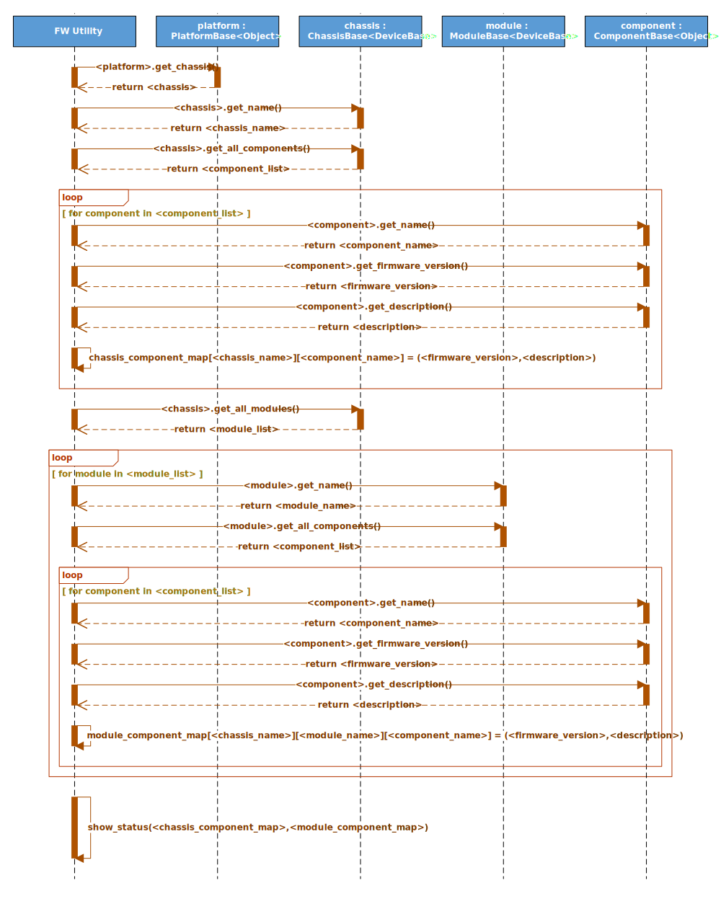

# SONiC FW utility

## High Level Design document

## Table of contents
- [About this manual](#about-this-manual)
- [Revision](#revision)
- [Abbreviations](#abbreviations)
- [1 Introduction](#1-introduction)
    - [1.1 Feature overview](#11-feature-overview)
    - [1.2 Requirements](#12-requirements)
        - [1.2.1 Functionality](#121-functionality)
        - [1.2.2 Command interface](#122-command-interface)
        - [1.2.3 Error handling](#123-error-handling)
        - [1.2.4 Event logging](#124-event-logging)
- [2 Design](#2-design)
    - [2.1 Overview](#21-overview)
    - [2.2 FW utility](#22-fw-utility)
        - [2.2.1 Command structure](#221-command-structure)
        - [2.2.2 Command interface](#222-command-interface)
            - [2.2.2.1 Show commands](#2221-show-commands)
                - [2.2.2.1.1 Overview](#22211-overview)
                - [2.2.2.1.2 Description](#22212-description)
            - [2.2.2.2 Install commands](#2222-install-commands)
                - [2.2.2.2.1 Overview](#22221-overview)
                - [2.2.2.2.2 Description](#22222-description)
            - [2.2.2.3 Update commands](#2223-update-commands)
                - [2.2.2.3.1 Overview](#22231-overview)
                - [2.2.2.3.2 Description](#22232-description)
- [3 Flows](#3-flows)
    - [3.1 Show components status](#31-show-components-status)
    - [3.2 Show available updates](#32-show-available-updates)
    - [3.3 Install component FW](#33-install-component-fw)
        - [3.3.1 Non modular chassis platform](#331-non-modular-chassis-platform)
        - [3.3.2 Modular chassis platform](#332-modular-chassis-platform)
- [4 Tests](#4-tests)
    - [4.1 Unit tests](#41-unit-tests)

## About this manual

This document provides general information about FW utility implementation in SONiC.

## Revision

| Rev | Date       | Author         | Description                       |
|:---:|:----------:|:--------------:|:----------------------------------|
| 0.1 | 21/08/2019 | Nazarii Hnydyn | Initial version                   |
| 0.2 | 10/09/2019 | Nazarii Hnydyn | Review feedback and other changes |
| 0.3 | 17/09/2019 | Nazarii Hnydyn | Align flows with the platform API |
| 0.4 | 18/12/2019 | Nazarii Hnydyn | CLI review feedback               |
| 0.5 | 05/05/2020 | Nazarii Hnydyn | Automatic FW update per component |

## Abbreviations

| Term   | Meaning                                             |
|:-------|:----------------------------------------------------|
| FW     | Firmware                                            |
| SONiC  | Software for Open Networking in the Cloud           |
| PSU    | Power Supply Unit                                   |
| QSFP   | Quad Small Form-factor Pluggable                    |
| EEPROM | Electrically Erasable Programmable Read-Only Memory |
| I2C    | Inter-Integrated Circuit                            |
| SPI    | Serial Peripheral Interface                         |
| JTAG   | Joint Test Action Group                             |
| BIOS   | Basic Input/Output System                           |
| CPLD   | Complex Programmable Logic Device                   |
| FPGA   | Field-Programmable Gate Array                       |
| URL    | Uniform Resource Locator                            |
| API    | Application Programming Interface                   |
| N/A    | Not Applicable/Not Available                        |

## List of figures

[Figure 1: FW utility High Level Design](#figure-1-fw-utility-high-level-design)  
[Figure 2: Show components status flow](#figure-2-show-components-status-flow)  
[Figure 3: Show available updates flow](#figure-3-show-available-updates-flow)  
[Figure 4: FW install (non modular) flow](#figure-4-fw-install-non-modular-flow)  
[Figure 5: FW install (modular) flow](#figure-5-fw-install-modular-flow)  

## List of tables

[Table 1: Event logging](#table-1-event-logging)

# 1 Introduction

## 1.1 Feature overview

A modern network switch is a sophisticated equipment which consists of many auxiliary components  
which are responsible for managing different subsystems (e.g., PSU/FAN/QSFP/EEPROM/THERMAL)  
and providing necessary interfaces (e.g., I2C/SPI/JTAG).

Basically these components are complex programmable logic devices with it's own HW architecture  
and software. The most important are BIOS/CPLD/FPGA etc.

It is very important to always have the latest recommended software version to improve device stability,  
security and performance. Also, software updates can add new features and remove outdated ones.

In order to make software update as simple as possible and to provide a nice user frindly  
interface for various maintenance operations (e.g., install a new FW or query current version)  
we might need a dedicated FW utility.

## 1.2 Requirements

### 1.2.1 Functionality

**This feature will support the following functionality:**
1. Manual FW installation for particular platform component
2. Automatic FW installation for particular platform component
3. Querying platform components and FW versions
4. Querying available FW updates for all platform components

### 1.2.2 Command interface

**This feature will support the following commands:**
1. show: display FW versions/updates
2. install: manual FW installation
3. update: automatic FW installation

### 1.2.3 Error handling

**This feature will provide error handling for the next situations:**
1. Invalid input
2. Incompatible options/parameters
3. Invalid/nonexistent FW URL/path

**Note:** FW binary validation (checksum, format, etc.) should be done by SONiC platform API

### 1.2.4 Event logging

**This feature will provide event logging for the next situations:**
1. FW binary downloading over URL: start/end
2. FW binary downloading over URL: error
3. FW binary installation: start/end
4. FW binary installation: error

###### Table 1: Event logging

| Event                                     | Severity |
|:------------------------------------------|:---------|
| FW binary downloading over URL: start/end | NOTICE   |
| FW binary downloading over URL: error     | ERROR    |
| FW binary installation: start/end         | INFO     |
| FW binary installation: error             | ERROR    |

**Note:** Some extra information also will be logged:
1. Component location (e.g., Chassis1/Module1/BIOS)
2. Operation result (e.g., success/failure)

# 2 Design

## 2.1 Overview


###### Figure 1: FW utility High Level Design

In order to improve scalability and performance a modern network switches provide different architecture solutions:
1. Non modular chassis platforms
2. Modular chassis platforms

Non modular chassis platforms may contain only one chassis.  
A chassis may contain it's own set of components.

Modular chassis platforms may contain only one chassis.  
A chassis may contain one or more modules and it's own set of components.  
Each module may contain it's own set of components.

Basically each chassis/module may contain one or more components (e.g., BIOS/CPLD/FPGA).

SONiC platform API provides an interface for FW maintenance operations for both modular and  
non modular chassis platforms. Both modular and non modular chassis platforms share the same platform API,  
but may have different implementation.

SONiC FW utility uses platform API to interact with the various platform components.

## 2.2 FW utility

### 2.2.1 Command structure

**User interface**:
```
fwutil
|--- show
|    |--- version
|    |--- status
|    |--- updates -i|--image=<current|next>
|
|--- install
|    |--- chassis
|    |    |--- component <component_name>
|    |         |--- fw -y|--yes <fw_path>
|    |
|    |--- module <module_name>
|         |--- component <component_name>
|              |--- fw -y|--yes <fw_path>
|
|--- update
     |--- chassis
     |    |--- component <component_name>
     |         |--- fw -y|--yes -f|--force -i|--image=<current|next>
     |
     |--- module <module_name>
          |--- component <component_name>
               |--- fw -y|--yes -f|--force -i|--image=<current|next>
```

**Note:** <fw_path> can be absolute path or URL

### 2.2.2 Command interface

#### 2.2.2.1 Show commands

##### 2.2.2.1.1 Overview

The purpose of the show commands group is to provide an interface for:
1. FW utility related information query (version, etc.)
2. Platform components related information query (version, description, etc.)
3. Available FW updates related information query (fw, version, status, etc.)

##### 2.2.2.1.2 Description

**The following command displays FW utility version:**
```bash
root@sonic:~# fwutil show version
fwutil version 1.0.0.0
```

**The following command displays platform components and FW versions:**
1. Non modular chassis platform
```bash
root@sonic:~# fwutil show status
Chassis   Module   Component   Version             Description
--------  -------  ----------  ------------------  ------------
Chassis1  N/A      BIOS        0ACLH003_02.02.007  Chassis BIOS
                   CPLD        5                   Chassis CPLD
                   FPGA        5                   Chassis FPGA
```

2. Modular chassis platform
```bash
root@sonic:~# fwutil show status
Chassis   Module   Component   Version             Description
--------  -------  ----------  ------------------  ------------
Chassis1           BIOS        0ACLH004_02.02.007  Chassis BIOS
                   CPLD        5                   Chassis CPLD
                   FPGA        5                   Chassis FPGA
          Module1  CPLD        5                   Module CPLD
                   FPGA        5                   Module FPGA
```

**The following command displays available FW updates:**
1. Non modular chassis platform
```bash
root@sonic:~# fwutil show updates --image=next
Chassis   Module   Component   Firmware               Version (current/available)              Status
--------  -------  ----------  ---------------------  ---------------------------------------  ------------------
Chassis1  N/A      BIOS        <image_path>/bios.bin  0ACLH004_02.02.007 / 0ACLH004_02.02.010  update is required
                   CPLD        <image_path>/cpld.bin  5 / 10                                   update is required
                   FPGA        <image_path>/fpga.bin  5 / 5                                    up-to-date
```

2. Modular chassis platform
```bash
root@sonic:~# fwutil show updates --image=next
Chassis   Module   Component   Firmware               Version (current/available)              Status
--------  -------  ----------  ---------------------  ---------------------------------------  ------------------
Chassis1           BIOS        <image_path>/bios.bin  0ACLH004_02.02.007 / 0ACLH004_02.02.010  update is required
                   CPLD        <image_path>/cpld.bin  5 / 10                                   update is required
                   FPGA        <image_path>/fpga.bin  5 / 5                                    up-to-date
          Module1  CPLD        <image_path>/cpld.bin  5 / 10                                   update is required
                   FPGA        <image_path>/fpga.bin  5 / 5                                    up-to-date
```

**Supported options:**
1. -i|--image - show updates using current/next SONiC image

**Note:** the default option is _--image=current_

#### 2.2.2.2 Install commands

##### 2.2.2.2.1 Overview

The purpose of the install commands group is to provide an interface  
for manual FW installation of various platform components.

##### 2.2.2.2.2 Description

**The following command installs FW:**
1. Non modular chassis platform
```bash
root@sonic:~# fwutil install chassis component BIOS fw --yes <image_path>/bios.bin
Warning: <firmware_update_notification>
...
FW update in progress ...
...
root@sonic:~# fwutil install chassis component CPLD fw --yes <image_path>/cpld.bin
Warning: <firmware_update_notification>
...
FW update in progress ...
...
root@sonic:~# fwutil install chassis component FPGA fw --yes <image_path>/fpga.bin
Warning: <firmware_update_notification>
...
FW update in progress ...
...
```

2. Modular chassis platform
```bash
root@sonic:~# fwutil install chassis component BIOS fw <image_path>/bios.bin
Warning: <firmware_update_notification>
New FW will be installed, continue? [y/N]: N
Aborted!
root@sonic:~# fwutil install chassis component CPLD fw <image_path>/cpld.bin
Warning: <firmware_update_notification>
New FW will be installed, continue? [y/N]: N
Aborted!
root@sonic:~# fwutil install chassis component FPGA fw <image_path>/fpga.bin
Warning: <firmware_update_notification>
New FW will be installed, continue? [y/N]: N
Aborted!
root@sonic:~# fwutil install module Module1 component CPLD fw <image_path>/cpld.bin
Warning: <firmware_update_notification>
New FW will be installed, continue? [y/N]: N
Aborted!
root@sonic:~# fwutil install module Module1 component FPGA fw <image_path>/fpga.bin
Warning: <firmware_update_notification>
New FW will be installed, continue? [y/N]: N
Aborted!
```

**Supported options:**
1. -y|--yes - automatic yes to prompts. Assume "yes" as answer to all prompts and run non-interactively

#### 2.2.2.3 Update commands

##### 2.2.2.3.1 Overview

The purpose of the update commands group is to provide an interface  
for automatic FW installation of various platform components.

Automatic FW installation requires platform_components.json to be created and placed at:  
_sonic-buildimage/device/<platform_name>/<onie_platform>/platform_components.json_

**Example:**
1. Non modular chassis platform
```json
{
    "chassis": {
        "Chassis1": {
            "component": {
                "BIOS": {
                    "firmware": "/etc/<platform_name>/fw/<onie_platform>/chassis1/bios.bin",
                    "version": "0ACLH003_02.02.010"
                },
                "CPLD": {
                    "firmware": "/etc/<platform_name>/fw/<onie_platform>/chassis1/cpld.bin",
                    "version": "10"
                },
                "FPGA": {
                    "firmware": "/etc/<platform_name>/fw/<onie_platform>/chassis1/fpga.bin",
                    "version": "5"
                }
            }
        }
    }
}
```

2. Modular chassis platform
```json
{
    "chassis": {
        "Chassis1": {
            "component": {
                "BIOS": {
                    "firmware": "/etc/<platform_name>/fw/<onie_platform>/chassis1/bios.bin",
                    "version": "0ACLH003_02.02.010"
                },
                "CPLD": {
                    "firmware": "/etc/<platform_name>/fw/<onie_platform>/chassis1/cpld.bin",
                    "version": "10"
                },
                "FPGA": {
                    "firmware": "/etc/<platform_name>/fw/<onie_platform>/chassis1/fpga.bin",
                    "version": "5"
                }
            }
        }
    },
    "module": {
        "Module1": {
            "component": {
                "CPLD": {
                    "firmware": "/etc/<platform_name>/fw/<onie_platform>/module1/cpld.bin",
                    "version": "10"
                },
                "FPGA": {
                    "firmware": "/etc/<platform_name>/fw/<onie_platform>/module1/fpga.bin",
                    "version": "5"
                }
            }
        }
    }
}
```

**Note:**
1. FW update will be disabled if component definition is not provided (e.g., 'BIOS': { })
2. FW version will be read from image if `version` field is not provided

##### 2.2.2.3.2 Description

**The following command updates FW:**
1. Non modular chassis platform
```bash
root@sonic:~# fwutil update chassis component BIOS fw --yes --image=next
Warning: <firmware_update_notification>
...
FW update in progress ...
...
root@sonic:~# fwutil update chassis component CPLD fw --yes --image=next
Warning: <firmware_update_notification>
...
FW update in progress ...
...
root@sonic:~# fwutil update chassis component FPGA fw --yes --image=next
Warning: <firmware_update_notification>
...
FW update in progress ...
...
```

2. Modular chassis platform
```bash
root@sonic:~# fwutil update chassis component BIOS fw --image=next
Warning: <firmware_update_notification>
New FW will be installed, continue? [y/N]: N
Aborted!
root@sonic:~# fwutil update chassis component CPLD fw --image=next
Warning: <firmware_update_notification>
New FW will be installed, continue? [y/N]: N
Aborted!
root@sonic:~# fwutil update chassis component FPGA fw --image=next
Warning: <firmware_update_notification>
New FW will be installed, continue? [y/N]: N
Aborted!
root@sonic:~# fwutil update module Module1 component CPLD fw --image=next
Warning: <firmware_update_notification>
New FW will be installed, continue? [y/N]: N
Aborted!
root@sonic:~# fwutil update module Module1 component FPGA fw --image=next
Warning: <firmware_update_notification>
New FW will be installed, continue? [y/N]: N
Aborted!
```

**Supported options:**
1. -y|--yes - automatic yes to prompts. Assume "yes" as answer to all prompts and run non-interactively
2. -f|--force - install FW regardless the current version
3. -i|--image - update FW using current/next SONiC image

**Note:** the default option is _--image=current_

# 3 Flows

## 3.1 Show components status



###### Figure 2: Show components status flow

## 3.2 Show available updates


###### Figure 3: Show available updates flow

## 3.3 Install component FW

### 3.3.1 Non modular chassis platform

 flow")

###### Figure 4: FW install (non modular) flow

### 3.3.2 Modular chassis platform

 flow")

###### Figure 5: FW install (modular) flow

# 4 Tests

## 4.1 Unit tests

1. Show utility version
2. Show components status
3. Show available updates
4. Install BIOS/CPLD/FPGA FW on non modular chassis
5. Install BIOS/CPLD/FPGA FW on modular chassis
6. Update BIOS/CPLD/FPGA FW on non modular chassis
7. Update BIOS/CPLD/FPGA FW on modular chassis
