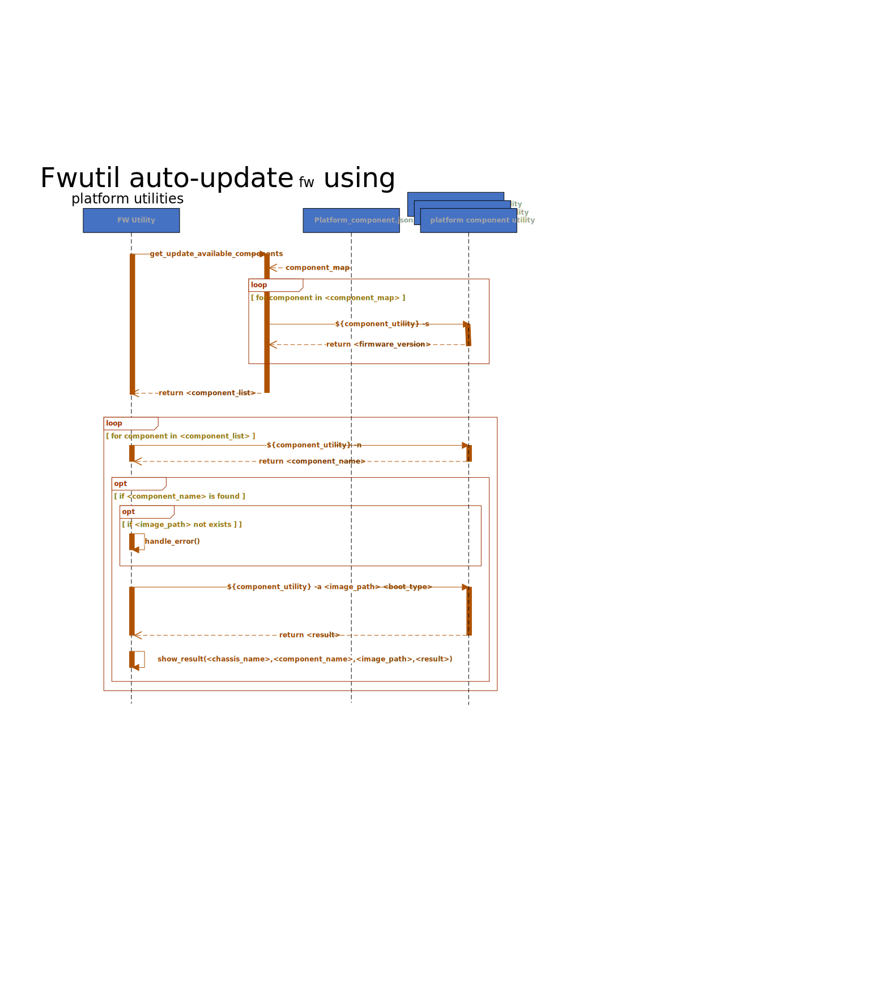

# SONiC FW utility

## High Level Design document

## Table of contents
- [About this manual](#about-this-manual)
- [Revision](#revision)
- [Abbreviations](#abbreviations)
- [1 Introduction](#1-introduction)
    - [1.1 Feature overview](#11-feature-overview)
    - [1.2 Requirements](#12-requirements)
        - [1.2.1 Functionality](#121-functionality)
        - [1.2.2 Command interface](#122-command-interface)
        - [1.2.3 Error handling](#123-error-handling)
        - [1.2.4 Event logging](#124-event-logging)
- [2 Design](#2-design)
    - [2.1 Overview](#21-overview)
    - [2.2 FW utility](#22-fw-utility)
        - [2.2.1 Command structure](#221-command-structure)
        - [2.2.2 Command interface](#222-command-interface)
            - [2.2.2.1 Show commands](#2221-show-commands)
                - [2.2.2.1.1 Overview](#22211-overview)
                - [2.2.2.1.2 Description](#22212-description)
            - [2.2.2.2 Install commands](#2222-install-commands)
                - [2.2.2.2.1 Overview](#22221-overview)
                - [2.2.2.2.2 Description](#22222-description)
            - [2.2.2.3 Update commands](#2223-update-commands)
                - [2.2.2.3.1 Overview](#22231-overview)
                - [2.2.2.3.2 Description](#22232-description)
            - [2.2.2.4 Update All commands](#2224-update-all-commands)
                - [2.2.2.4.1 Overview](#22241-overview)
                - [2.2.2.4.2 Description](#22242-description)
                - [2.2.2.4.3 Platform FW Update utility](#22243-plarform-fw-update-utility)
                - [2.2.2.4.4 Update All Use Cases](#22244-update-all-use-cases)
- [3 Flows](#3-flows)
    - [3.1 Show components status](#31-show-components-status)
    - [3.2 Show available updates](#32-show-available-updates)
    - [3.3 Install component FW](#33-install-component-fw)
        - [3.3.1 Non modular chassis platform](#331-non-modular-chassis-platform)
        - [3.3.2 Modular chassis platform](#332-modular-chassis-platform)
    - [3.4 FW update all platform components](#33-FW-update-all-platform-components)
        - [3.4.1 FW update all using platform component api](#331-FW-update-all-using-platform-component-api)
        - [3.4.2 FW update all using platform utility](#332-FW-update-all-using-platform-utility)
- [4 Tests](#4-tests)
    - [4.1 Unit tests](#41-unit-tests)

## About this manual

This document provides general information about FW utility implementation in SONiC.

## Revision

| Rev | Date       | Author         | Description                       |
|:---:|:----------:|:--------------:|:----------------------------------|
| 0.1 | 21/08/2019 | Nazarii Hnydyn | Initial version                   |
| 0.2 | 10/09/2019 | Nazarii Hnydyn | Review feedback and other changes |
| 0.3 | 17/09/2019 | Nazarii Hnydyn | Align flows with the platform API |
| 0.4 | 18/12/2019 | Nazarii Hnydyn | CLI review feedback               |
| 0.5 | 05/05/2020 | Nazarii Hnydyn | Automatic FW update per component |
| 0.6 | 08/03/2020 | Sujin Kang     | Add firmware `update all` command  |

## Abbreviations

| Term   | Meaning                                             |
|:-------|:----------------------------------------------------|
| FW     | Firmware                                            |
| SONiC  | Software for Open Networking in the Cloud           |
| PSU    | Power Supply Unit                                   |
| QSFP   | Quad Small Form-factor Pluggable                    |
| EEPROM | Electrically Erasable Programmable Read-Only Memory |
| I2C    | Inter-Integrated Circuit                            |
| SPI    | Serial Peripheral Interface                         |
| JTAG   | Joint Test Action Group                             |
| BIOS   | Basic Input/Output System                           |
| CPLD   | Complex Programmable Logic Device                   |
| FPGA   | Field-Programmable Gate Array                       |
| SSD    | Solid State Drive                                   |
| URL    | Uniform Resource Locator                            |
| API    | Application Programming Interface                   |
| N/A    | Not Applicable/Not Available                        |

## List of figures

[Figure 1: FW utility High Level Design](#figure-1-fw-utility-high-level-design)  
[Figure 2: Show components status flow](#figure-2-show-components-status-flow)  
[Figure 3: Show available updates flow](#figure-3-show-available-updates-flow)  
[Figure 4: FW install (non modular) flow](#figure-4-fw-install-non-modular-flow)  
[Figure 5: FW install (modular) flow](#figure-5-fw-install-modular-flow)  

## List of tables

[Table 1: Event logging](#table-1-event-logging)

# 1 Introduction

## 1.1 Feature overview

A modern network switch is a sophisticated equipment which consists of many auxiliary components  
which are responsible for managing different subsystems (e.g., PSU/FAN/QSFP/EEPROM/THERMAL)  
and providing necessary interfaces (e.g., I2C/SPI/JTAG).

Basically these components are complex programmable logic devices with it's own HW architecture  
and software. The most important are BIOS/CPLD/FPGA etc.

It is very important to always have the latest recommended software version to improve device stability,  
security and performance. Also, software updates can add new features and remove outdated ones.

In order to make software update as simple as possible and to provide a nice user frindly  
interface for various maintenance operations (e.g., install a new FW or query current version)  
we might need a dedicated FW utility.

## 1.2 Requirements

### 1.2.1 Functionality

**This feature will support the following functionality:**
1. Manual FW installation for particular platform component
2. Complete FW installation for particular platform component
3. Querying platform components and FW versions
4. Querying available FW updates for all platform components
5. Automatic FW updates for all available platform components listed in platform_components.json
   for any specific boot type. Automatic FW updates expects to be followed by the reboot
   that was specified by the fwutil automatic fw update command, unless the boot type was none.
6. Automatic FW updates can have two phases for the components which firmware update needs
   the complete action to be performed and the first phase is done by platform api and the
   second phase can be done by the fwupdate reboot plugin. The heavy time consuming firmware
   update is expected to be done during the first phase.
7. Automatic FW updates can have another two phases for any firmware update which needs
   any system intervention like process stop or disk unmount, the firmware update task should
   be scheduled by platform api during the first phase and the actual firmware update should
   be performed by the fwupdate reboot plugin during the second phase with timing restriction*.
   *In the real network situation, long device reboot timing could interrupt any services
   running on the servers under the network device. Based on the reboot type, the platform vendor
   needs to measure the reboot timing including the firmware update and diagonize the firmware update
   is applicable for the autoupdate and the auto_update_firmware() platform api should return
   "status_err_boot_type" if the reboot timing doesn't meet for any reboot requirement.

### 1.2.2 Command interface

**This feature will support the following commands:**
1. show: Display FW versions/updates
2. install: Manual FW installation
3. update: Complete FW installation
4. update all: Automatic updates of all available FWs for any specific boot type

### 1.2.3 Error handling

**This feature will provide error handling for the next situations:**
1. Invalid input
2. Incompatible options/parameters
3. Invalid/nonexistent FW URL/path

**Note:** FW binary validation (checksum, format, etc.) should be done by SONiC platform API

### 1.2.4 Event logging

**This feature will provide event logging for the next situations:**
1. FW binary downloading over URL: start/end
2. FW binary downloading over URL: error
3. FW binary installation: start/end
4. FW binary installation: error

###### Table 1: Event logging

| Event                                     | Severity |
|:------------------------------------------|:---------|
| FW binary downloading over URL: start/end | NOTICE   |
| FW binary downloading over URL: error     | ERROR    |
| FW binary installation: start/end         | INFO     |
| FW binary installation: error             | ERROR    |
| FW binary update : start/end              | INFO     |
| FW binary update : error                  | ERROR    |

**Note:** Some extra information also will be logged:
1. Component location (e.g., Chassis1/Module1/BIOS)
2. Operation result (e.g., success/failure)
3. FW binary source location (e.g., current/next/custom)

# 2 Design

## 2.1 Overview


###### Figure 1: FW utility High Level Design

In order to improve scalability and performance a modern network switches provide different architecture solutions:
1. Non modular chassis platforms
2. Modular chassis platforms

Non modular chassis platforms may contain only one chassis.  
A chassis may contain it's own set of components.

Modular chassis platforms may contain only one chassis.  
A chassis may contain one or more modules and it's own set of components.  
Each module may contain it's own set of components.

Basically each chassis/module may contain one or more components (e.g., BIOS/CPLD/FPGA).

SONiC platform API provides an interface for FW maintenance operations for both modular and  
non modular chassis platforms. Both modular and non modular chassis platforms share the same platform API,  
but may have different implementation.

SONiC FW utility uses platform API to interact with the various platform components.
SONiC FW utility extends to support for the automatic firmware update based on "platform_components.json" under platform directory and next reboot option which is passed as a option for `fwutil update all fw` command.
SONiC FW utility also extends to support for the automatic firmware update with a custom firmware package that can include any firmware update tool and the firmware update tool will be used for the firmware update if it's specified in the "platform_components.json".

## 2.2 FW utility

### 2.2.1 Command structure

**User interface**:

```
fwutil
|--- show
|    |--- version
|    |--- status
|    |--- updates -i|--image=<current|next>
|    |--- updates -z|--fw-image=<fw_package.tar.gz>
|    |--- update status
|
|--- install
|    |--- chassis
|    |    |--- component <component_name>
|    |         |--- fw -y|--yes <fw_path>
|    |
|    |--- module <module_name>
|         |--- component <component_name>
|              |--- fw -y|--yes <fw_path>
|
|--- update
     |--- chassis
     |    |--- component <component_name>
     |         |--- fw -y|--yes -f|--force -i|--image=<current|next>
     |
     |--- module <module_name>
     |    |--- component <component_name>
     |         |--- fw -y|--yes -f|--force -i|--image=<current|next>
     |--- all
          |--- fw -i|--image=<current|next> --b|--boot=<none|fast|warm|cold>
          |--- fw -z|--fw-image=<fw_package.tar.gz> --b|--boot=<none|fast|warm|cold>

```
**Note:**
- <fw_path> can be absolute path or URL
- --image and --fw-image can not be supported at the same time


### 2.2.2 Command interface

#### 2.2.2.1 Show commands

##### 2.2.2.1.1 Overview

The purpose of the show commands group is to provide an interface for:
1. FW utility related information query (version, etc.)
2. Platform components related information query (version, description, etc.)
3. Available FW updates related information query (fw, version, status, etc.)

##### 2.2.2.1.2 Description

**The following command displays FW utility version:**
```bash
root@sonic:~# fwutil show version
fwutil version 1.0.0.0
```

**The following command displays platform components and FW versions:**
1. Non modular chassis platform
```bash
root@sonic:~# fwutil show status
Chassis   Module   Component   Version             Description
--------  -------  ----------  ------------------  ------------
Chassis1  N/A      BIOS        0ACLH003_02.02.007  Chassis BIOS
                   CPLD        5                   Chassis CPLD
                   FPGA        5                   Chassis FPGA
```

2. Modular chassis platform
```bash
root@sonic:~# fwutil show status
Chassis   Module   Component   Version             Description
--------  -------  ----------  ------------------  ------------
Chassis1           BIOS        0ACLH004_02.02.007  Chassis BIOS
                   CPLD        5                   Chassis CPLD
                   FPGA        5                   Chassis FPGA
          Module1  CPLD        5                   Module CPLD
                   FPGA        5                   Module FPGA
```

**The following command displays available FW updates:**
1. Non modular chassis platform
```bash
root@sonic:~# fwutil show updates --image=next
Chassis   Module   Component   Firmware               Version (current/available)              Status
--------  -------  ----------  ---------------------  ---------------------------------------  ------------------
Chassis1  N/A      BIOS        <image_path>/bios.bin  0ACLH004_02.02.007 / 0ACLH004_02.02.010  update is required
                   CPLD        <image_path>/cpld.bin  5 / 10                                   update is required
                   FPGA        <image_path>/fpga.bin  5 / 5                                    up-to-date
                   SSD         <image_path>/ssd.bin   4 / 5                                    update is required
```

2. Modular chassis platform
```bash
root@sonic:~# fwutil show updates --image=next
Chassis   Module   Component   Firmware               Version (current/available)              Status
--------  -------  ----------  ---------------------  ---------------------------------------  ------------------
Chassis1           BIOS        <image_path>/bios.bin  0ACLH004_02.02.007 / 0ACLH004_02.02.010  update is required
                   CPLD        <image_path>/cpld.bin  5 / 10                                   update is required
                   FPGA        <image_path>/fpga.bin  5 / 5                                    up-to-date
                   SSD         <image_path>/ssd.bin   4 / 5                                    update is required
          Module1  CPLD        <image_path>/cpld.bin  5 / 10                                   update is required
                   FPGA        <image_path>/fpga.bin  5 / 5                                    up-to-date
```

3. Custom FW Package
```bash
root@sonic:~# fwutil show updates --fw-image=fw_update.tar.gz
Chassis   Module    Component   Firmware                       Version (current/available)              Status
--------  -------   ----------  -----------------------------  ---------------------------------------  ------------------
Chassis1  N/A       CPLD        <fwpackage_path>/cpld.bin      5 / 10                                   update is required
                    SSD         <fwpackage_path>/ssd.bin       4 / 5                                    update is required
```

```
**Supported options:**
1. -i|--image - show updates using current/next SONiC image
2. -z|--fw-image - show updates using custom FW package

**Note:**
- the default option is _--image=current_
- --image and --fw-image can not be supported at the same time
- `fwutil show updates` command only displays for the components which have the firmware image path available in platform_components.json
```

**The following command displays the Component FW update satus (only available for `fwutil update all` command):**
1. update status
```bash
root@sonic:~# fwutil show update status
Firmware auto-update performed for cold reboot
Component      Version    Status     Info
-------------  ---------  ---------  --------------------------------------
MSN2700/SSD    4/5        scheduled  installation scheduled for cold reboot
MSN2700/CPLD1  5/10       installed  need cold reboot to be completed
```

#### 2.2.2.2 Install commands

##### 2.2.2.2.1 Overview

The purpose of the install commands group is to provide an interface  
for manual FW installation of various platform components.

##### 2.2.2.2.2 Description

**The following command installs FW:**
1. Non modular chassis platform
```bash
root@sonic:~# fwutil install chassis component BIOS fw --yes <image_path>/bios.bin
Warning: <firmware_update_notification>
...
FW update in progress ...
...
root@sonic:~# fwutil install chassis component CPLD fw --yes <image_path>/cpld.bin
Warning: <firmware_update_notification>
...
FW update in progress ...
...
root@sonic:~# fwutil install chassis component FPGA fw --yes <image_path>/fpga.bin
Warning: <firmware_update_notification>
...
FW update in progress ...
...
```

2. Modular chassis platform
```bash
root@sonic:~# fwutil install chassis component BIOS fw <image_path>/bios.bin
Warning: <firmware_update_notification>
New FW will be installed, continue? [y/N]: N
Aborted!
root@sonic:~# fwutil install chassis component CPLD fw <image_path>/cpld.bin
Warning: <firmware_update_notification>
New FW will be installed, continue? [y/N]: N
Aborted!
root@sonic:~# fwutil install chassis component FPGA fw <image_path>/fpga.bin
Warning: <firmware_update_notification>
New FW will be installed, continue? [y/N]: N
Aborted!
root@sonic:~# fwutil install module Module1 component CPLD fw <image_path>/cpld.bin
Warning: <firmware_update_notification>
New FW will be installed, continue? [y/N]: N
Aborted!
root@sonic:~# fwutil install module Module1 component FPGA fw <image_path>/fpga.bin
Warning: <firmware_update_notification>
New FW will be installed, continue? [y/N]: N
Aborted!
```

**Supported options:**
1. -y|--yes - automatic yes to prompts. Assume "yes" as answer to all prompts and run non-interactively

#### 2.2.2.3 Update commands

##### 2.2.2.3.1 Overview

The purpose of the update commands group is to provide an interface  
for automatic FW installation of various platform components.

Automatic FW installation requires "platform_components.json" to be created and placed at:  
_sonic-buildimage/device/<platform_name>/<onie_platform>/platform_components.json_
Recommanded image path = /lib/firmware/<vendor>/

**Example:**
1. Non modular chassis platform
```json
{
    "chassis": {
        "Chassis1": {
            "component": {
                "BIOS": {
                    "firmware": "/lib/firmware/<vendor>/bios.bin",
                    "version": "0ACLH003_02.02.010"
                },
                "CPLD": {
                    "firmware": "/lib/firmware/<vendor>/cpld.bin",
                    "version": "10"
                },
                "FPGA": {
                    "firmware": "/lib/firmware/<vendor>/fpga.bin",
                    "version": "5"
                }
            }
        }
    }
}
```

2. Modular chassis platform
```json
{
    "chassis": {
        "Chassis1": {
            "component": {
                "BIOS": {
                    "firmware": "/lib/firmware/<vendor>/bios.bin",
                    "version": "0ACLH003_02.02.010"
                },
                "CPLD": {
                    "firmware": "/lib/firmware/<vendor>/cpld.bin",
                    "version": "10"
                },
                "FPGA": {
                    "firmware": "/lib/firmware/<vendor>/fpga.bin",
                    "version": "5"
                }
            }
        }
    },
    "module": {
        "Module1": {
            "component": {
                "CPLD": {
                    "firmware": "/lib/firmware/<vendor>/cpld.bin",
                    "version": "10"
                },
                "FPGA": {
                    "firmware": "/lib/firmware/<vendor>/fpga.bin",
                    "version": "5"
                }
            }
        }
    }
}
```

**Note:**
1. FW update will be disabled if component definition is not provided (e.g., 'BIOS': { })
2. FW version will be read from image if `version` field is not provided

##### 2.2.2.3.2 Description

**The following command updates FW:**
1. Non modular chassis platform
```bash
root@sonic:~# fwutil update chassis component BIOS fw --yes --image=next
Warning: <firmware_update_notification>
...
FW update in progress ...
...
root@sonic:~# fwutil update chassis component CPLD fw --yes --image=next
Warning: <firmware_update_notification>
...
FW update in progress ...
...
root@sonic:~# fwutil update chassis component FPGA fw --yes --image=next
Warning: <firmware_update_notification>
...
FW update in progress ...
...
```

2. Modular chassis platform
```bash
root@sonic:~# fwutil update chassis component BIOS fw --image=next
Warning: <firmware_update_notification>
New FW will be installed, continue? [y/N]: N
Aborted!
root@sonic:~# fwutil update chassis component CPLD fw --image=next
Warning: <firmware_update_notification>
New FW will be installed, continue? [y/N]: N
Aborted!
root@sonic:~# fwutil update chassis component FPGA fw --image=next
Warning: <firmware_update_notification>
New FW will be installed, continue? [y/N]: N
Aborted!
root@sonic:~# fwutil update module Module1 component CPLD fw --image=next
Warning: <firmware_update_notification>
New FW will be installed, continue? [y/N]: N
Aborted!
root@sonic:~# fwutil update module Module1 component FPGA fw --image=next
Warning: <firmware_update_notification>
New FW will be installed, continue? [y/N]: N
Aborted!
```

**Supported options:**
1. -y|--yes - automatic yes to prompts. Assume "yes" as answer to all prompts and run non-interactively
2. -f|--force - install FW regardless the current version
3. -i|--image - update FW using current/next SONiC image

**Note:** the default option is _--image=current_

#### 2.2.2.4 `update all` commands

##### 2.2.2.4.1 Overview
The purpose of the `update all` commands group is to provide and interface for automatic fw updates of various platform components based on the boot option and the platform firmware update configuration file - "platform_components.json".

The existing FWutil infra supports the upgrade of platform components which can be performed during run time.
The SSD upgrade for certain platforms requires the unmount of the filesystems and this needs to be incorporated as part of the reboot scripts.
To integrate the upgrade of these platform components which can’t be performed during run time,
the FWutil requires few more enhancements that specifies the reboot-type during which the user expects the upgrade to happen.
New component api is introduced to support the component firmware auto-update as follows.

```bash
    def auto_update_firmware(self, image_path, boot_action):
        """
        Updates firmware of the component

        This API performs firmware update automatically based on boot_action: it assumes firmware installation
        and/or creating a loading task during a boot action, if needed, in a single call.
        In case platform component requires some extra steps (apart from calling Low Level Utility)
        to load the installed firmware (e.g, reboot, power cycle, etc.) - this will be done automatically during the reboot.
        The loading task will be created by API.

        Args:
            image_path: A string, path to firmware image
            boot_action: A string, boot action following the upgrade
                         - none/fast/warm/cold

        Returns:
            Output: A return code
                return_code: An integer number, status of component firmware auto-update
                    - return code of a positive number indicates successful auto-update
                        - status_installed = 1
                        - status_updated = 2
                        - status_scheduled = 3
                    - return_code of a negative number indicates failed auto-update
                        - status_err_boot_type = -1
                        - status_err_image = -2
                        - status_err_others = -3

        Raises:
            RuntimeError: auto-update failure cause
        """
        raise NotImplementedError
```
The return_code of auto_update_firmware() which indicates the firmware auto-update  status, will be logged in "fw_au_status" under "/var/platform/" directory by fwutil and the status file will be used for the `fwutil show update status` command. 

In case that a firmware update needs any additional step to complete the firmware update but the installation time is longer than the boot time requirement, auto-update platform api is expected to install the firmware and perform the complete action during the reboot via `platform_fw_au_reboot_handle` or `platform_reboot` plugin.
For example, some cpld update needs a power cycle to complete the firmware update and some cpld update needs a register triggered power-cycle to give some refresh time for the new firmware to be effective on the system.

Any scheduled component firmware update needs to be logged in "<boot_type>_fw_au_task".
The reboot script will prevent from performing the reboot if the <boot_type> of the scheduled task is different than the current reboot type.
Each vendor needs to implement the reboot auto-update task handler plugin which is platform specific plugin and is expected to be named as "platform_fw_au_reboot_handle".
The plugin will parse the "<boot_type>_fw_au_task" file and perform the update during the reboot if needed. 
The contents of the task file can be defined by the platform vendors and be utilized by the platform specific reboot plugin.

```json
{
    "<component_path1>": {
            "status": "<installed/updated/scheduled/skipped/failed>"
            "info": "<need \<boot_type\> reboot to be completed/completed/installation scheduled for <boot_type> reboot/\<boot_type\> reboot not supported for auto-update/ErrorMsg>"
        },
}
```

Here is the example of the firmware update status file with cold reboot as boot_type action.
And the components available for the update are BIOS, CPLD, and SSD.
In this example, BIOS firmware got updated, CPLD firmware got installed but powercycle* is needed, and SSD firmware update is scheduled during boot.
*powercycle can be triggered by cold reboot script in this case.

```bash
admin@sonic:~/fwutil$ cat /var/platform/fw_au_status
{
    "MSN2700/BIOS":
        {
            "status": "updated",
            "from": "0ACLH004_02.02.007",
            "to": "0ACLH004_02.02.010",
            "info": "completed"
        },
    "MSN2700/SSD":
        {
            "status": "scheduled",
            "from": "4",
            "to": "5",
            "info": "installation scheduled for cold reboot"
        },
    "MSN2700/CPLD1":
        {
            "status": "installed",
            "from": "5",
            "to": "10",
            "info": "need cold reboot to be completed"
        }
    ]
}
```

Here is the example of the firmware update status file with warm reboot as boot_type action.
And the components available for the update are BIOS, and SSD.
In this example, BIOS firmware got updated, CPLD firmware update was skipped since the update completion can not be done for warm, and SSD firmware update is scheduled during warm boot.

```bash
admin@sonic:~/fwutil$ cat /var/platform/fw_au_status
{
    "MSN2700/BIOS":
        {
            "status": "updated",
            "from": "0ACLH004_02.02.007",
            "to": "0ACLH004_02.02.010",
            "info": "completed"
        },
    "MSN2700/SSD":
        {
            "status": "scheduled",
            "from": "4",
            "to": "5",
            "info": "installation scheduled for warm reboot"
        },
    "MSN2700/CPLD1":
        {
            "status": "skipped",
            "from": "5",
            "to": "10",
            "info": "warm reboot not supported for auto-update"
        }
    ]
}
```

The FWutil infra section below indicates the necessary changes to add support for auto update during reboot.
The Platform plugins section describes the plugins that a platform must implement to support auto updates when the platform component APIs are not available.

Automatic FW installation requires default platform_components.json to be created and placed at:
_sonic-buildimage/device/<platform_name>/<onie_platform>/platform_components.json_
Recommended image path is "/lib/firmware/<vendor>".

Here is the /var/platform directory structure while fwutil handles the `fwutil update all fw` and `fwutil show update status` command.
```
/var/platform/
          |--- fw_au_status
          |--- <boot_type>_fw_au_task*
```

Auto-update command can support the standalone custom firmware image package with --fw-image option.
`2.2.2.4.3 Custom Firmware Package option with --fw-image` explains the requirement of the custom firmware image package.
The custom firmware image package should have the platform_components.json which indicates which component's firmware image is available  
and the relative location of the image file.
Fwutil will search for the platform_components.json first to get the firmware image information - version and the relative location  
from the platform_componenets.json.

**Note:**
1. FW update will be disabled if component definition is not provided (e.g., 'BIOS': { })
2. FW version will be read from image if `version` field is not provided

##### 2.2.2.4.2 Description

**The following command updates FW Automatically with installing the available component firmware, creating task(s) for update during reboot:**
1. `update all` command for installation and reboot task creation
```bash
root@sonic:~# fwutil update all fw --yes --image=<current|next> --boot=<boot_type>
<COMPONENT1_PATH> firmware auto-update starting: <firmware_path> with <boot_type>
...
<COMPONENT1_PATH> firmware auto-update status from <current_version> to <available_version>: <status> - <info>
...
<COMPONENT2_PATH> firmware auto-update starting: <firmware_path> with <boot_type>
...
<COMPONENT2_PATH> firmware auto-update status from <current_version> to <available_version>: <status> - <info>
...
All firmware auto-update has been performed.
```

This is examples of a platform which supports the SSD firmware update during fast reboot and cold reboot with different commands
along with CPLD firmware update available only for the cold reboot which can perform a power cycle triggered by some register setting.

Example 1: BIOS and SSD firmware update is available for fast-reboot upgrade path.
BIOS firmware update is going to be updated and no further task is needed during reboot.
SSD firmware update is logged in a platform defined designated file and it will be updated during fast-reboot.
```bash
root@sonic:~# fwutil update all fw --yes --image=next --boot=fast
Firmware auto-update for boot_type fast is allowed
MSN2700/BIOS firmware auto-update starting: /lib/firmware/mlnx/bios.bin with fast
...
BIOS firmware auto-update status from 0ACLH004_02.02.007 to 0ACLH004_02.02.010: updated - completed
...
MSN2700/SSD firmware auto-update starting: /lib/firmware/mlnx/ssd.bin with fast
...
SSD firmware auto-update status from 4 to 5: scheduled - installation scheduled for fast reboot
...
MSN2700/CPLD firmware auto-update starting: /lib/firware/mlnx/cpld.bin with fast
...
CPLD firmware auto-update status from 5 to 10: skipped - warm reboot not supported for auto-update
All firmware auto-update has been performed.
```
Example 2: BIOS, SSD and CPLD update is available for cold reboot upgrade path.
BIOS firmware update is going to be updated and no further task is needed during reboot.
SSD firmware update is logged in a platform defined designated file and it will be updated during cold reboot.
CPLD firmware update is going to be done with this command and the CPLD completion activity will be performed during cold reboot
once all reboot processes are finished. The CPLD completion activity for this case is a power cycle triggered by the hw register setting.
```bash
root@sonic:~# fwutil update all fw --yes --image=next --boot=cold
Firmware auto-update for boot_type cold is allowed
MSN2700/BIOS firmware auto-update starting: /lib/firmware/mlnx/bios.bin with cold
...
BIOS firmware auto-update status from 0ACLH004_02.02.007 to 0ACLH004_02.02.010: updated - completed
...
MSN2700/SSD firmware auto-update starting: /lib/firmware/mlnx/ssd.bin with cold
...
SSD firmware auto-update status from 4 to 5: scheduled - installation scheduled for cold reboot
...
MSN2700/CPLD firmware auto-update starting: /lib/firware/mlnx/cpld.bin with cold
...
CPLD firmware auto-update status from 5 to 10: installed - need cold reboot to be completed
All firmware auto-update has been performed.
```

Example 3: SSD and CPLD update is available for cold reboot upgrade path.
BIOS firmware update is going to be updated and no further task is needed during reboot.
SSD firmware update is logged in a platform defined designated file and it will be updated during cold reboot.
CPLD firmware update is going to be done with this command and the CPLD completion activity will be performed during cold reboot
once all reboot processes are finished. The CPLD completion activity for this case is a power cycle triggered by the hw register setting.
```bash
admin@sonic:~# sudo fwutil update all fw --fw_image=fwpackage.tar.gz --boot=cold
Firmware auto-update for boot_type cold is allowed
MSN2700/CPLD1 firmware auto-update starting: /tmp/firmwareupdate/fwpackage/fwpackage/sn2700_cpld.mpfa with boot_type cold
...
CPLD1 firmware auto-update status: installed - need cold reboot to be completed
All firmware auto-update has been performed.
```

**Supported options:**
1. -i|--image - update FW using current/next SONiC image
2. -b|--boot - following boot option after the upgrade
3. -z|--fw-image - firmware package downloaded during run time (this is an exclusive option from --image)

**Note:**
- the default option is _--image=current_ and _--boot=none_
- --image and --fw-image can not be supported at the same time

##### 2.2.2.4.3 Custom Firmware Package option with --fw-image

The `update all` command can support the standalone custom firmware image package with --fw-image option.
The package can be any format between ".tar" or ".tar.gz" and should have the "platform_components.json", the firmware image(s).
The package can have the auto-update plugin if the platform doesn't support platform api or if plugin needs to be updatedplugin.
The package can also have the component upgrade utility(script) and the utility will be used for the component firmware upgrade if it's specified in "platform_compnents.json".
The `fwutil update all` commands uncompress the package and parse the "platform_components.json" to retrieve the firmware information.


Here is the firmwareupdate directory structure with the extract of firmware image package.
```
/tmp/firmwareupdate/fwpackage/
               |--- platform_components.json
               |--- <firmware_image>
               |--- <utility>*
```
The custom firmware image package provided with --fw-image option, will be extracted under fwpackage directory.
*: <utility> can be used if it's defined in platform_components.json in the custom firmware image package.

Here is the example of platform_components.json in the firmware image package.
```json
{
    "chassis": {
        "Chassis1": {
            "component": {
                "BIOS": {
                },
                "CPLD": {
                    "firmware": "cpld.bin",
                    "version": "10"
                },
                "SSD": {
                    "firmware": "ssd.bin",
                    "version": "5"
                }
            }
        }
    }
}
```

Here is the example of firmware image package contents with the platform_components.json shown above.
```bash
root@sonic:~$ tar tvf fwpackage.tar
-rw-r--r-- root/root       551 2020-11-18 17:05 platform_components.json
-rwxr-xr-x root/root      1436 2020-11-15 19:05 cpld.bin
-rw-r--r-- root/root    546141 2020-11-17 20:35 ssd.bin
```

Custom firmware package can also support the utility option for the components which doesn't have the platform api support yet.
If the script path is available for the component firmware configuration in the "platform_components.json",
it means that the specific component firmware upgrade shall need to use the script to process the fwutil commands.
`2.2.2.4.4 Platform Component Firmware Update Utility` explains the requirement of the component firmware upgrade utility
to interfere with the fwutil to support the auto-update command - mainly status and install.

##### 2.2.2.4.4 Platform Component Firmware Update Utility
When Vendor doesn't have platform API ready to support all platform component APIs including the auto-update interface,
the platform component utility will perform the equivalent process of `auto-update` platform component api.
The component utility can perform the firmware update if the firmware update doesn't need any boot action required after the update.
Otherwise, it will create a task file if any process or handling for the component firmware update needs to be done during the reboot
and also if the update can be done for the specified reboot type.
The componenet utility should be defined with key value `utility` in the component object of `platform_components.json` to be called by fwutil instead of the platform api.
The task file will be platform-specific.

**Example:**
1. `platform_components.json` with platform specific utility.
```json
{
    "chassis": {
        "Chassis1": {
            "component": {
                "BIOS": {
                    "firmware": "bios.bin",
                    "version": "0ACLH003_02.02.010",
                },
                "CPLD": {
                    "firmware": "cpld.bin",
                    "utility": "cpldupdate",
                    "version": "10",
                },
                "SSD": {
                    "firmware": "SSD.bin",
                    "utility": "ssd_fw_update",
                    "version": "5",
                }
            }
        }
    }
}
```

##### 2.2.2.4.3.1 Platform Component Firmware Update Utility Interface Requirement

The Utility should support the minimum requirements to perform the fwutil's automatic update interface.
The minimum requirement is that the component api's get_frimware_version, get_firmware_update_notification(), and auto_update_firmware() needs to be supported by the utility.
Here are the interface requirements to support them.
1. {utility} -s(--status) : able to retrieve the current firmware version:
    - equivalent to the component api's get_firmware_version()
    - response : installed firmware version
2. {utility} -n(--notification) : able to provide the update complete action :
    - equivalent to the component api's get_firmware_update_notification(image_path) 
    - response : the required action to complete the component installation
3. {utility} -a(--autoupdate) : able to perform the auto-update action :
    - equivalent to the component api's auto_update_firmware(image_path, boot_type) 
    - auto-update interface needs two arguments : image_path and boot_type
    - response : the return_code that indicates the status of auto-update (please refer to section  2.2.2.4.1)

**Optional) The utility can be supported for other platform api substitues like `compoenent_update` and `compoenent_install` with |-u(--update)|-i(--install)**

The component utility needs to be called by the FWutil command to perform the firmware auto-update process if it's defined in the `platform_components.json`, otherwise, the platform component api will be called.
The componet utility path will be pased from the `platform_components.json` and be executed by fwutil.
Below shows how the utility can be executed for the auto-update interface.
```bash
...
firmware_path = parser[self.__pcp.FIRMWARE_KEY]
utility_path = parser[self.__pcp.UTILITY_KEY]
if os.path.isfile(utility_path) and os.access(utility_path, os.X_OK):
    cmd = "{} -a {} {}".format(
        utility_path,
        firmware_path,
        boot_type
    )
    output = subprocess.check_output(cmd, stderr=subprocess.STDOUT, shell=True)
...
```
From the above `platform_components.json` example, if the platform needs the SSD firmware update, then the auto-update can be triggered with following command.
`$PWD/ssd_fw_update -a $PWD/SSD.bin fast` 

##### 2.2.2.4.3.2 Platform Firmware Update Reboot Handle Plugin
If any specific component firmware update needs to be done only during the reboot, auto_update_firmware() api will log the firmware update to the "<boot_type>_fw_au_task as explained in 2.2.2.4.1.
Platform firmware update reboot plugin will handle the task during the rebooot and will be invoked by the reboot script with its reboot-type.
The plugin is expected to analyze the task file to understand what component firmware update has been scheduled for which reboot and determine if the component firmware update can be performed for the reboot or not.
After the determination, firmware update will be done by the plugin if any firmware update is scheduled for the reboot.
If the passed reboot_type to the plugin is different than the boot_type of task file, the pluin should exit with error code so that the reboot script can fail for the error case.

```bash
PLATFORM_FW_AU_REBOOT_HANDLE="platform_fw_au_reboot_handle"
if [[ -x ${DEVPATH}/${PLATFORM}/${PLATFORM_FW_AU_REBOOT_HANDLE} ]]; then
    debug "Handling task file for boot type ${REBOOT_TYPE}”
    ${DEVPATH}/${PLATFORM}/${PLATFORM_FW_AU_REBOOT_HANDLE} ${REBOOT_TYPE} || PLATFORM_FW_AU_RC=$?
    if [[ $PLATFORM_FW_AU_RC -ne 0 ]]; then
        error "Failed to handle the platform firmware auto-update for ${REBOOT_TYPE} Exit code: $PLATFORM_FW_AU_RC"
        exit "${EXIT_PLATFORM_FW_AU_FAILURE}"
    fi
fi
```

##### 2.2.2.4.4 Update All Use Cases

##### 2.2.2.4.4.1 Standalone firmware update during run time
Since `fwutil update all` can support the firmware update using a custom firmware package, this will allow the firmware update to be available during run time.

SONiC device can have a component firmware updated without interrupting the data plan if the component firmware update doesn't need any boot action.
```bash
root@sonic:~# fwutil update all fw --fw-image=aboot-fw-update.tar.gz --boot=none
```

SONiC device can also be updated only a specific firmware update with a possible boot option that can be supported on a certain topology.
But in this case, the firmware update can be completed by following reboot which is indicated in the boot option of `fwutil update all` command.
```bash
root@sonic:~# fwutil update all fw --fw-image=ssd-fw-update.tar.gz --boot=fast
...
root@sonic:~# sudo fast-reboot
```

##### 2.2.2.4.4.2 Firmware upgrade during Sonic_to_Sonic upgrade
During the sonic image upgrade, all available platform component firmware can be upgraded for the specific following boot option.
```bash
PLATFORM_FW_UPDATE="/usr/bin/fwutil"

CURRENT_FW=`sonic_installer list |grep "Current" |awk '{print $2}'`

if grep -q aboot /host/machine.conf; then
    TARGET_FW=`unzip -p /tmp/$FILENAME boot0 |grep -m 1 "image_name" |sed -n "s/.*image-\(.*\)\".*/\1/p"`
else
    TARGET_FW=`cat -v /tmp/$FILENAME |grep -m 1 "image_version" | sed -n "s/.*image_version=\"\(.*\)\".*/\1/p"`
fi

sonic_installer install -y /tmp/$FILENAME || FAILED=1
sync;sync;sync || exit 14


if [[ -x ${PLATFORM_FW_UPDATE} ]]; then
    ${PLATFORM_FW_UPDATE} update all fw --yes --image=next --boot=${REBOOT_TYPE}
fi
```

# 3 Flows

## 3.1 Show components status


###### Figure 2: Show components status flow

## 3.2 Show available updates


###### Figure 3: Show available updates flow

## 3.3 Install component FW

### 3.3.1 Non modular chassis platform

 flow")

###### Figure 4: FW install (non modular) flow

### 3.3.2 Modular chassis platform

 flow")

###### Figure 5: FW install (modular) flow

## 3.4 FW update all platform components

### 3.4.1 FW update all using platform component api


###### Figure 6: FW update all with platform component api flow

### 3.4.2 FW update all using platform utility



###### Figure 7: FW update all with platform utility flow

# 4 Tests

## 4.1 Unit tests

1. Show utility version
2. Show components status
3. Show available updates
4. Install BIOS/CPLD/FPGA FW on non modular chassis
5. Install BIOS/CPLD/FPGA FW on modular chassis
6. Update BIOS/CPLD/FPGA FW on non modular chassis
7. Update BIOS/CPLD/FPGA FW on modular chassis
8. Auto Update BIOS/CPLD/FPGA FW with boot-action options
