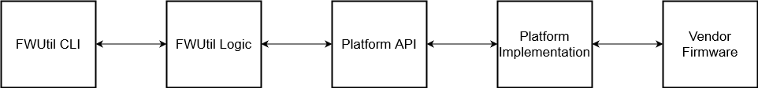

# SONiC FW Utility Test Plan

### Table of Contents
...

### Changelog
...

## 1. Introduction

The firmware CLI utility in SONiC `fwutil` is used to install firmware onto devices within the switch hardware. The high level design is located [here](https://github.com/Azure/SONiC/blob/master/doc/fwutil/fwutil.md)

Examples of these devices are:

* Solid State Drive
* Motherboard (BIOS)
* Bootloader (ONIE)
* CPLD / FPGA

The architecture of this tool is
          


These components are already (or planned to be) unit tested individually thus we have a reasonable level of confidence that they are independently functionally correct.

However, what we need to test is the **integration** between the FWUtil tools and the platform methods they call.

These platform methods generally dispatch **vendor-specific executables** that actually handle the installation process.

## 2. Strategy

To truly test the functionality of `fwutil` we must ensure that it is appropriately calling these vendor-specific fimware utilities and parsing their outputs. However because these utilities are not within the scope of SONiC and are owned by each individual vendor it is not feasible for us to mock the bevhaior of each of these utilities for testing purposes.

Given the infeasibility of a mock, we must resort to **calling the utility during testing** and validating that the platform implementation is able to successfully call the utility, parse the output, and **return expected values given the operation we are attempting**.

For example, we could test the update of a SSD firmware by...

1. Ask `fwutil` to check the existing version
2. Ask `fwutil` to check the available version
3. Ask `fwutil` to install the available version
4. Ask `fwutil` to check the existing version

If the version reported by step 2 is identical to the version reported by step 4 we can reasonably concluded that fwutil sucessfully performed the installation.

We can also use metadata to assist in the validation of `fwutil` output such as associating a firmware version with an image using a `platform.json` type file. i.e.

```
{
    "chassis": {
        "Chassis1": {
            "component": {
                "BIOS": {
                    "firmware": "/lib/firmware/<vendor>/bios.bin",
                    "version": "0ACLH003_02.02.010"
                }
            }
        }
    }
}
```


We can then ask `fwutil` to parse the image and report back a version that should be identical to the version provided by the vendor.

Using `fwutil` to perform a variety of install / update / probe operations on each defined component type will fully test its functionality for a given platform.

This strategy of enforcing self-consistency can be used to create a **vendor-agnostic test suite** that is capable of verifying the functionality of `fwutil` on **any platform that supports the Platform API**.

## 3. Firmware Integration

In order to achieve the above test strategy we need a systematic way for vendors to compile the firmware images that will be used to perform the tests.

#### Requirements

For each type of firmware we require **two different firmware versions** for each desired component to be tested. This is because a firmware version which is *not* already installed on the DUT is required and having two different firmware versions present for testing ensures that requirement can be met.

#### Firmware Package

The easiest and most consistent way to do this is for vendors to generate a `.tar.gz` package consisting of the firmware images and a `platform_components.json` file that identifies what they are and their version number.

For example...

```
/firmware-pkg.tar.gz
        |--- platform_components.json
        |--- ssd_fw_A.bin
        |--- ssd_fw_B.bin
        |--- onie_fw_A.bin
        |--- onie_fw_B.bin
```

And an example `platform_components.json`

```
{
    "chassis": {
        "Chassis1": {
            "component": {
                "ONIE": [
                    {
                        "firmware": "onie_fw_A.bin",
                        "version": "10",
                        "reboot": "power"
                    },
                    {
                        "firmware": "onie_fw_B.bin",
                        "version": "11",
                        "reboot": "cold"
                    }
                ],
                "SSD": [
                    {
                        "firmware": "ssd_fw_A.bin",
                        "version": "5",
                        "reboot": "warm"
                    },
                    {
                        "fimware": "ssd_fw_B.bin",
                        "version": "4",
                        "reboot": "none"
                    }
                ]
            }
        }
    }
}
```

The **first version listed** that **does not match the firmware version installed** will be installed for the test. If the firmware version originally installed on the switch is present in the list the test will attempt to restore that version.

#### Downgrades
If your platform does NOT support downgrades then you **MUST** specify the `upgrade_only: True` parameter in the firmware definition.

This means that the test suite will skip testing a specific component if it is not able to upgrade the firmware (the latest is installed).

However, if that option is specified AND it is able to upgrade the firmware it will, and will not attempt to downgrade it again. All future tests performed on that box *will skip until a newer firmware version is released and added to the tarball*.

#### Reboot Type

In addition to version **the vendor should specify the type of reboot that is required to complete the install for a given firmware image**. This will be used for the `auto update` testing and must be `< none | warm | cold | power >`.

If the vendor specifies that a power cycle is neccesary they must have support the `pdu_controller` test plugin otherwise the test will skip.

#### Vendor Implementation

These packages will **not** be required to be uploaded to the sonic-mgmt repository but will instead be provided as an argument `--fw-image` to `pytest` during runtime so that vendors may execute tests using their private firmware.

```
py.test platform/firmware/test_fwutil.py --inventory "../ansible/inventory, ../ansible/veos" --host-pattern r-tigris-13-t1-lag --module-path ../ansible/library/ --testbed r-tigris-13-t1-lag --testbed_file ../ansible/testbed.csv --fw-image ./firmware.tar.gz
```

This will be an optional argument and the `fwutil` tests will skip if it is not provided. In addition, the fwutil tests will run for each component provided so the vendor may choose to run regression on as many or as few components they choose.

**The primary use case for these tests are to allow vendors to ensure that changes to `fwutil` their platform API implementation or their firmware utilities do not cause a regression on SONiC.**

## 4. Test Cases

This section describes each of the planned major test cases and the proposed high level logical flow.

We perform two primary types of tests, positive tests and negative tests. Positive tests are tests that should succeed and we will verify that they do. Negative tests are tests that should result in `fwutil` failing for some reason and we will attempt to verify that it did fail for the reason we intended.

We will be testing four major components of `fwutil`

* Show (gets fimware information)
* Install (installs firmware from file)
* Update (installs firmware from SONiC image)
* Auto Update (automatically detects and installs firmware)

### 4.1 Show

This command should never fail under normal circumstances so we only test it for the positive test case. We just verify that the `fwutil show` will successfully execute and **return a firmware version that is present in the given list for each component**

### 4.2 Install

Here we perform the basic following procedure

1. Check the current firmware version
2. Attempt the installation via `fwutil`
3. Perform any reboots / power cycles neccesary
4. Check the current firmware version against what we tried to install
5. Attempt to roll back firmware to the latest version
6. Perform reboot
7. Verify successful rollback

and we do this for each available component

#### 4.2.1 Successful Install from File

Here we get the current installed firmware via `fwutil show status` and locate the first version listed in the firmware package that does not match.

Then we execute `fwutil install chassis component <component_name> fw -y <fw_path>` to complete the install.

We verify this has a successful return code and returned no errors.

We perform a warm reboot / cold reboot / power cycle if neccesary.

We execute `fwutil show status` and verify that the installed version matches the version we just attempted to install.

We then perform the above steps again in an attempt to install the prior firmware version to return the switch to the original state.

### 4.2.2 Successful Install from URL

See section 4.2.1 for steps. In this test case we will use the provided firmware file and host a temporary web server with a URL path to the firmware file.

This will be utilized by the DUT by executing `fwutil install chassis component <component_name> fw -y <fw_url>`

We will also verify in the syslog that there are logs marking the download start and end.

### 4.2.3 Invalid Component Name

We will execute `fwutil install chassis component <component_name> fw -y <fw_path>` using a mangled component name from the firmware file.

We will verify that the return code is non-zero and an error message like the one below is returned

```
Error: Invalid value for "<component_name>": Component "BIOS1" does not exist.
```

### 4.2.4 Invalid Filepath

See 4.2.3. for steps. In this case we will provide a mangled filepath instead and verify a non-zero exit code and an error message such as the one below.

```
Error: Invalid value for "fw_path": Path "/etc/mlnx/fw/sn3800/chassis1/invalid-bios.rom" does not exist.
```

## 4.3 Update

In these tests we perform the following basic procedure

1. Generate a mock `platform_components.json` file using the firmware file
2. Run `fwutil update`
3. Perform neccesary reboots
4. Run `fwutil show` and verify it matches the generated file
5. Attempt to restore the previous configuration

### 4.3.1 Successful Update from Current Image

In this test we use the firmware file to generate a mock `platform_components.json` file that describes all of the components and the version that we intend to install on each of them (using same algorithm as section 4.2.1).

This file and the associated firmware files are uploaded to the DUT and then `fwutil update -y --image=current` is executed. We verify that there are no errors and then perform a cold reboot (or power cycle if required)

After the power cycle we execute `fwutil show status` and verify that it matches the versions we expected to install for all components.

We then generate a new mock file with the original firmware versions for each component and run `fwutil update` again to attempt to roll back the switch.

### 4.3.2 Successful Update from Next Image

See 4.3.1 but we reboot into the "next" image before uploading the mock `platform_components.json` file and then we reboot back into the "current" image to perform the test and verify that it successfully reads the mock file and firmware files from the next image.

This test will skip if the DUT does not have a "next" image present.

### 4.3.3 Invalid Platform Configuration

See 4.3.1 except we mangle the mock `platform_components.json` file and then we execute the `fwutil update` command and verify that it returns the expected error message and a non-zero exit code.

We mangle the file to omit the `"chassis"` key and we expect...

```
Error: Failed to parse "platform_components.json": invalid platform schema: "chassis" key hasn't been found. Aborting...
```

We mangle the file to omit the `"component"` key and we expect...

```
Error: Failed to parse "platform_components.json": invalid chassis schema: "component" key hasn't been found. Aborting...
```

We mangle the file such that the `"version"` key of a component has a dict value i.e. `"version": { "version": "0ACLH004_02.02.007_9600" },` and we expect...

```
Error: Failed to parse "platform_components.json": invalid component schema: string is expected: key=version. Aborting...
```

Finally we restore the valid `platform_components.json` file as in section 4.3.1


## 4.4 Auto Update

These tests will only run if the vendor has implemented the `auto_update_firmware()` method in at least one of their components.

In this test we perform the following basic procedure for each component

1. Generate a mock `platform_components.json` file using the firmware file
2. Run `fwutil update all fw --yes --boot=<boot_type>` for a given boot type
2. Cross reference that boot type with the firmware configuration file
3. Verify that the command performed the intended action (install / schedule / skip)
4. Perform perscribed boot type
5. Use `fwutil show` to verify that install was successful
6. Repeat step 2 - 5 for next boot type (go from least to most disruptive type i.e. none, warm boot, cold boot, power cycle)
