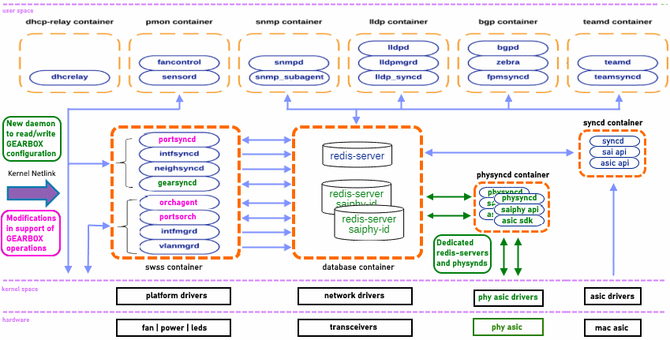
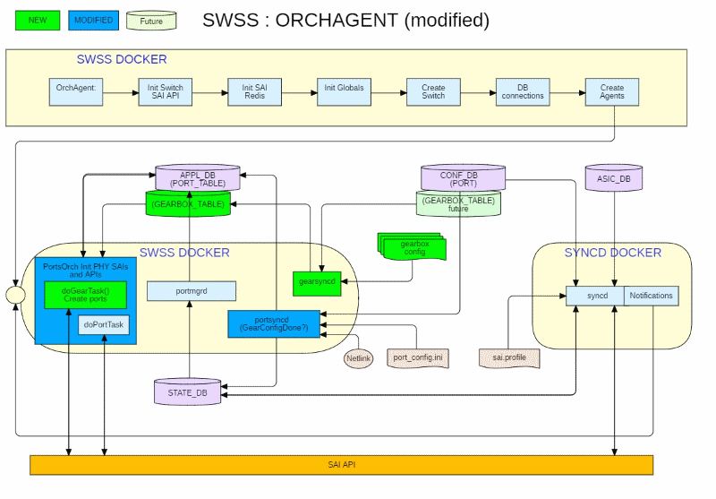
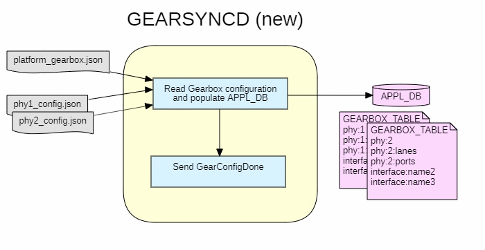
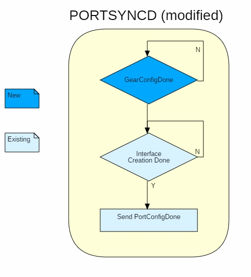
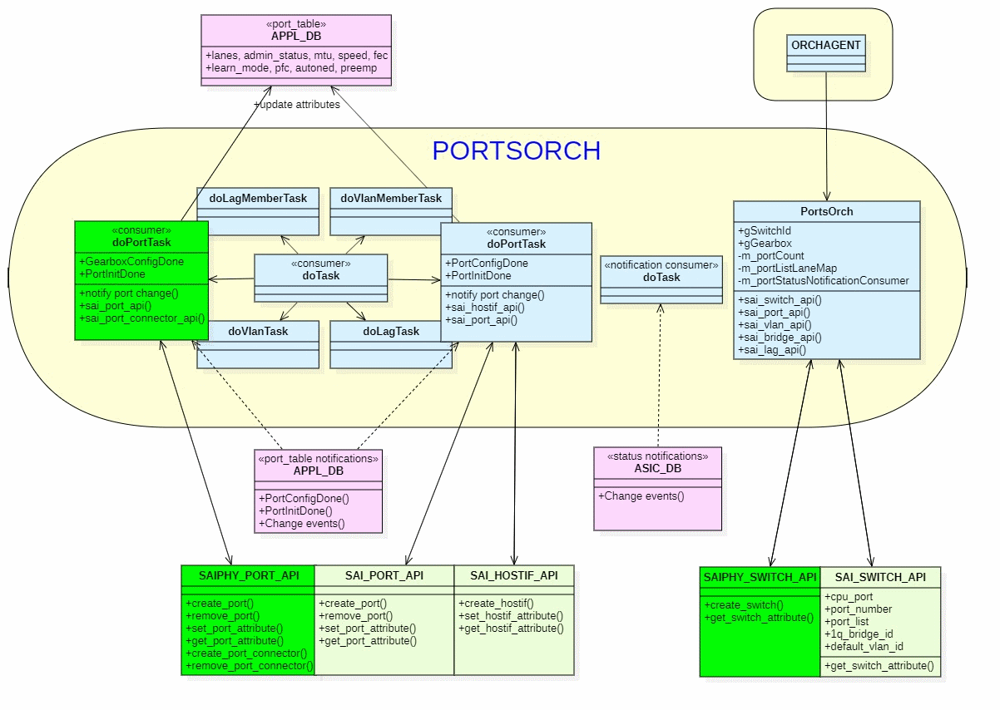
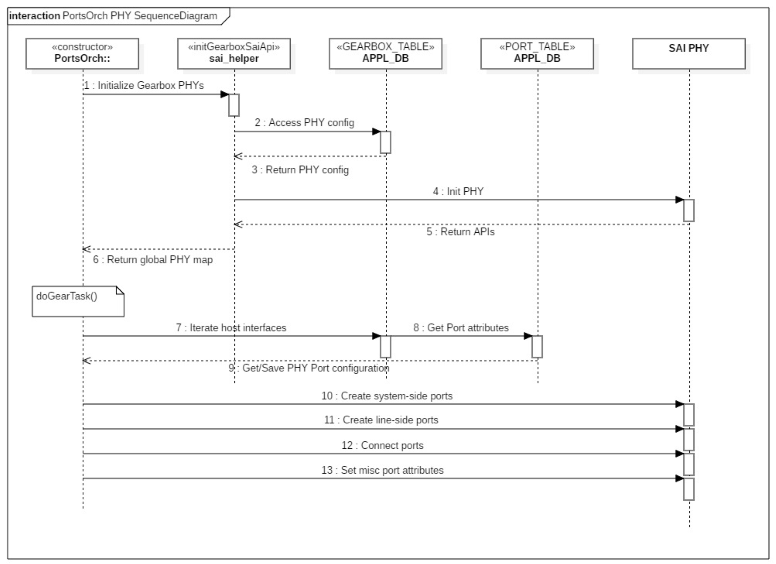
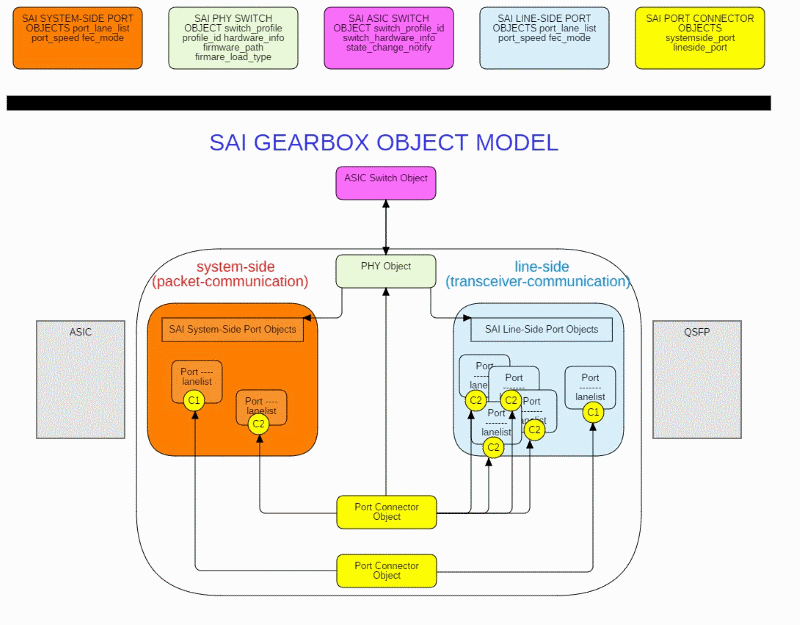
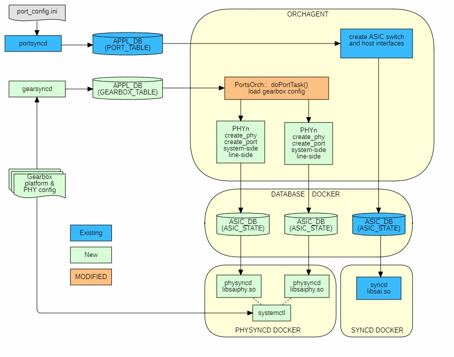

# Feature Name
SONiC Gearbox Manager

# High Level Design Document
#### Rev 0.2 (Draft)

# Table of Contents
  * [List of Tables](#list-of-tables)
  * [Revision](#revision)
  * [About This Manual](#about-this-manual)
  * [Scope](#scope)
  * [Definition/Abbreviation](#table-1-abbreviations)
  * [Document/References](#table-2-references)
  * [Requirement Overview](#1-requirement-overview)
  * [Definition/Abbreviation](#definitionabbreviation)

# List of Tables
[Table 1: Abbreviations](#table-1-abbreviations)
[Table 2: References](#table-2-references)
[Table 3: Gearbox Configuration](#table-3-gearbox-configuration)
[Table 4: PHY Configuration](#table-4-phy-configuration)

# Revision
| Rev |     Date    |       Author       | Change Description                |
|:---:|:-----------:|:------------------:|-----------------------------------|
| 0.1 | 10/22/2019  | Dan Arsenault      | Initial Draft                     |
| 0.2 | 12/12/2019  | Dan Arsenault      | Minor internal review edits       |

# About this Manual
This document provides general information about the new Gearbox Manager functionality and infrastructure in utilizing the new OCP External PHY Abstraction Interface for SONiC.

# Scope
This document describes the high level design of the Gearbox Manager feature. This feature primarily consists of two new processes or tasks running within the SWSS Docker which utilizes and depends on the availability of the new OCP External PHY Interface. Please refer to the OCP External PHY Abstraction Interface for additional information.

# Definition/Abbreviation
# Table 1: Abbreviations

| **Term**         | **Meaning**                                                                |
|------------------|----------------------------------------------------------------------------|
| gearbox          | PHY silicon to merge PHY Tx side and to split apart PHY Rx side            |
| GEARSYNCD        | New ORCHAGENT daemon servicing gearbox configuration processing            |
| line-side        | Connection between the PHY and Ethernet line cards                         |
| NETLINK          | Communication channel between kernel and user space containing port status |
| ORCHAGENT        | Core daemon thread which manages similar Orch agents                       |
| PHY              | Physical Layer chip devices (commonly found on Ethernet devices)           |
| REDIS            | Open source, in-memory data structure store, used as a database            |
| SAI              | Switch Abstraction Interface                                               |
| SWSS             | SWitch State Service                                                       |
| system-side      | Connection between the PHY and switching silicon                           |

# Document/References
# Table 2: References
| **Document**                       | **Location**  |
|------------------------------------|---------------|
| Gearbox Manager Requirements       | [Gearbox Manager Requirements](http://gerrit-lvn-07.lvn.broadcom.net:8083/plugins/gitiles/sonic/documents/+/refs/changes/34/12034/1/base/gearbox_mgr_req.md) |
| External PHY Abstraction Interface | [External PHY Abstraction Interface](https://github.com/opencomputeproject/SAI/pull/1004) |

# 1 Requirement Overview
The Ethernet switches of today have evolved and are entering several key segments providing switch chips for enterprise, data-center, and carrier, as well as optical transceivers, Gearbox PHYs and 25Gbps  Re-timers. If the platform/hardware supports it, the PHY may be configurable to speeds including 10G, 25G, 40G, 50G, and 100G, and beyond. Some platforms contain an external PHY, while others have PHYs embedded in the switch ASIC (Internal PHY). An External PHY is used to serve different purposes like gearbox,  Re-timer, MACSEC and multi gigabit Ethernet PHY transceivers, etc. 

The Abstraction Interface contains a set of SAI APIs providing new functionality in support of the most recent PHY advancements and requirements. Through utilizing this new external PHY interface, this project adds configuration and management capabilities for these new external PHY requirements.

## 1.1 Functional Requirements
1. Introduce configuration schema supporting external gearbox and PHY configurations
2. Support multiple external PHYs
3. Administer CRUD services for external PHYs
4. Administer Re-timer configuration for external PHYs
5. Coordinates port configuration between system and line side and External PHYs
6. Abstracts the system side configuration from the SONiC application
7. Consolidate link status from ASIC and PHY port side if PHY driver doesn't support status propagation
8. Support removable line cards with any PHY configuration (*future*)
9. Warm-boot support

## 1.2 Configuration and Management Requirements
1. Existing CLI interface commands are not affected.
2. Show commands to display the gearbox port configuration, as described in "Show Commands" section below.
3. Debug commands as described in "Debug Commands" section below.

## 1.3 Warm Boot Requirements
Functionality should continue to work across warm boot.
- To support planned system warm boot.
- To support SWSS docker warm boot.

# 2 Functionality

## 2.1 Target Deployment Use Cases
The Gearbox Manager infrastructure is used to manage and configure the external PHYs which are used to serve different purposes like gearbox,  Re-timer, and multi gigabit ethernet PHY transceivers, etc. 

### 2.1.1 Gearbox Use Cases
A gearbox is essentially a kind of multiplexer/de-multiplexer that's used to convert multiple serial data streams at one rate to multiple streams at another rate. Here is just a sample of possible gearbox use cases.

#### 2.1.1.1 40GbE Quad Port Gearbox PHY
A high-density gearbox physical layer transceiver (PHY) converts 20 Gbps signals to multiple lanes running at 10 Gbps. Using the companion PHY, customers have the option to provide legacy 40GbE ports while leveraging the full bandwidth of the switch.

### 2.1.2 Re-timer Use Case
A  Re-timer is essentially a kind of clock change without effect the rates.

#### 2.1.2.1 Dual 100GbE PHY/Octal 25G  Re-timer
A low-power, low-latency PHY integrating  Re-timer and equalizer functions that support 100-Gigabit Ethernet (GbE), 40GbE and 10GbE applications.

### 2.1.3 vSONiC
Virtual SONiC or vSONiC is an infrastructure that is based on the Linux QEMU/KVM hypervisor that enables creation, management and interconnections of VMs that are running SONiC. When creating an instance of a chassis, a new gearbox chip-type has been added and is identified as "82764 - Sesto Gearbox". When using this chassis (and other gearbox PHY types), the associated platform and PHY configuration files are copied to the VM. In addition, the associated SAI PHY object library has been modified to mock simple APIs in order to test and validate basic Gearbox functionality.

## 2.2 Functional Description
The external PHY capabilities are platform specific and are defined in 2 files; the gearbox platform and the PHY configuration file. The Gearbox Manager reads the configuration files for the given platform, constructs the gearbox topology and initializes both the system-side and line-side of the PHY(s). The Gearbox Manager also receives and processes select configuration requests as well the consolidation of system-side and line-side operational state port events.

# 3 Design

## 3.1 Overview
In order to isolate gearbox functionality and complexity, the Gearbox Manager implementation is an *infrastructure* of new gearbox specific Linux processes. In addition to the new Gearbox processes, the SYNCD Docker has been enhanced to support the new External PHY Abstraction Interface extensions.

### 3.1.1 ORCHAGENT (modified)
Upon startup or reboot, portsyncd is started as well as the new gearsyncd deamon. The Orchagent is still responsible for creating the ASIC switch and the associated host interfaces. The internal doPortTask has been modified to support both internal port and Gearbox related events.  

### 3.1.2 GEARSYNCD (new)
This component essentially provides the same database services as provided by PORTSYNCD but for gearbox configurations. Specifically, GEARSYNCD reads the Gearbox configuration files and creates the associated GEARBOX tables in the APPL_DB database. Upon completion, GEARSYNCD sends a GearboxConfigDone notification (similar to the PORTSYNCD PortConfigDone).

### 3.1.3 PORTSYNCD (modified)
The existing PORTSYNCD daemon has been modified to detect the presence of the Gearbox Manager. If enabled, PORTSYNCD simply waits for GearboxConfigDone before it begins its processing.

### 3.1.4 PORTSORCH (modified)
If the Gearbox Manager is enabled, the PORTSORCH agent has been modified to load and initialize all the external PHYs as well their associated SAI APIs. The PORTSORCH doPortTask has been modified to filter on Gearbox events. Given the gearbox platform and PHY configurations and by utilizing the new SAI PHY APIs, the actual device topology (how these gearbox devices are physically connected) is configured. The following is a high-level interaction between this agent and the SAI APIs.

The following sequence diagram shows the PHY initialization process; which also establishes a map structure that is used by the enhanced doPortTask(). The doPortTask() creates the external PHY ports and their connections using the associated external SAI PHY API library.

## 3.2 Gearbox Platform Configuration
The Gearbox Platform configuration file includes one or more PHYs including its host interfaces. Each interface is linked to its associated PHY using the phy_id.

### Table 3: Gearbox Platform Configuration
| **Attribute**     | **Description**            | **Example**             |
|-------------------|----------------------------|-------------------------|
| **PHYs**          |                            |                         |
| id                | Unique numeric identifier  | 0                       |
| name              | Unique string identified   | "example-1"             |
| address           | Unique Hex string          | "0x1000"                |
| lib_name          | Name of shared object file | "example-1.so"          |
| firmware_path     | FQN firmware location      | "/usr/../example-1.bin" |
| config_file       | Detailed PHY specification | "ph1_config.json"       |
| phy_access        | Platform Adaption          | "MDIO" or "I2C"         |
| bus_id            | Unique numeric identifier  | 0                       |
| **Interfaces**    |                            |                         |
| index             | Unique interface key       | 0                       |
| phy_id            | Unique PHY key             | 0                       |
| system_lanes      | System-side lanes          | [38,39]                 |
| system_lane_speed | System-side lane speed     | "50G"                   |
| line_lanes        | Line-side lanes            | [30,31,32,33]           |
| line_lane_speed   | Line-side lane speed       | "25G"                   |

## 3.3 Gearbox PHY Configuration
Multiple PHYs are supported. Each PHY is described in it's own configuration file. The configuration includes the individual lanes, as well as the logical port configuration consisting of multiple lanes and their lane maps. This file is used to construct the PHY system-side to line-side port hierarchy.

### Table 4: Gearbox PHY Configuration
| **Attribute**          | **Description**                | **Example**    |
|------------------------|--------------------------------|----------------|
| **PHY INFO**           |                                |                |
| name                   | Unique string identified       | "example-1"    |
| address                | Unique Hex string              | "0x1000"       |
| mode                   | Operational mode               | "gearbox"      |
| port_ref_clk           | Transceiver Frequency          | "600Mhz"       |
| **LANES**              |                                |                |
| id                     | Unique lane identifier         | 30             |
| system_side            | System-side, else Line-side    | true or false  |
| local_lane_id          | Internal unique identifier     | 0              |
| line_tx_lanemap        | Transmit lane                  | 3              |
| tx_polarity            | Transmit polarity (percentage) | 0              |
| line_rx_lanemap        | Receiver lane                  | 3              |
| rx_polarity            | Receiver polarity (percentage) | 0              |
| line_to_system_lanemap | Internal unique identifier     | 38             |
| mdio_addr              | Unique Hex string              | "0x1001"       |
| **PORTS**              |                                |                |
| id                     | Unique numeric identifier      | 0              |
| system_side_lanes      | System-side lanes              | [34,35]        |
| system_side_speed      | System-side lane speed         | "50G"          |
| line_side_lanes        | Line-side lanes                | [30,31,32,33]  |
| lane_side_speed        | Line-side lane speed           | "25G"          |
| mdio_addr              | Unique Hex string              | "0x1002"       |

## 3.4 DB Changes

### 3.4.1 CONFIG DB
No gearbox specific configurations are necessary at this time.

### 3.4.2 APP DB
A new GEARBOX_TABLE has been added to the application database for the purpose of storing the related gearbox platform and PHY related configuration parameters. This table is populated by the new GEARSYNCD ORCHAGENT.

#### 3.4.2.1 GEARBOX_TABLE - Platform Instance

REDIS example:
~~~
_GEARBOX_TABLE:phy:example-1 =>
  id
  0
  name
  example-1
  address
  0x1000
  lib_name
  libsai_phy_example1.so
  firmware_path
  /tmp/phy-example1.bin
  config_file
  phy1_config.json
  phy_access
  MDIO(NPU)
  bus_id
  0
~~~

#### 3.4.2.2 GEARBOX_TABLE - Platform Host Interfaces

REDIS example:
~~~
_GEARBOX_TABLE:interface:Ethernet0 =>                                                                                                                
  index                                                                            
  1                                                                                                                                                           
  phy_id                                                                           
  0                                                                                
  system_lanes                                                                     
  38,39                                                                            
  system_lane_speed                                                                
  50G                                                                              
  line_lanes                                                                       
  30,31,32,33                                                                      
  line_lane_speed                                                                  
  25G      
~~~

#### 3.4.2.3 GEARBOX_TABLE - Platform PHY Lanes

REDIS Example:
~~~
_GEARBOX_TABLE:phy:phy1:lanes:32 =>                                             
  id                                                                               
  32                                                                               
  system_side                                                                      
  0                                                                                
  local_lane_id                                                                    
  1                                                                                
  line_rx_lanemap                                                                  
  1                                                                                
  rx_polarity                                                                      
  0                                                                                
  line_to_system_lanemap                                                           
  39                                                                               
  mdio_addr                                                                        
  0x1003   
~~~

#### 3.4.2.4 GEARBOX_TABLE - Platform PHY Ports

REDIS Example:
~~~
_GEARBOX_TABLE:phy:phy1:ports:1 =>                                              
  id                                                                               
  1                                                                                
  system_lane_speed                                                                
  50G                                                                              
  line_lanes                                                                       
  34,35,36,37                                                                      
  system_lanes                                                                     
  40,41                                                                            
  line_lane_speed                                                                  
  25G                                                                              
  mdio_addr                                                                        
  0x3000     
~~~

### 3.4.3 STATE DB
No modifications made.

### 3.4.4 ASIC DB
No modifications made.

### 3.4.5 COUNTER DB
No modifications made.

## 3.5 Docker SYNCD (modified)
The SYNCD Docker syncd daemon has been extended to support the new SAI APIs and callbacks introduced by the new External SAI Abstraction Interface.

A key feature of the External PHY Abstraction Interface is the separation and mapping of system-to-line side ports for each PHY (switch). The ability to configure and re-configure the ports are represented in a new object model where each port object is attached to each other by using a port connector object.

~~~
typedef enum _sai_api_t
{
    SAI_API_UNSPECIFIED      =  0, /**< unspecified API */
    SAI_API_SWITCH           =  1, /**< sai_switch_api_t */
    SAI_API_PORT             =  2, /**< sai_port_api_t */
    .
    .
    SAI_API_PORT_CONNECTOR   =  40, /**< sai_phy_port_api_t */
} sai_api_t;
~~~

The following diagram shows the overall object model for which the new SAI External Abstraction Interface provides.

Each external PHY is represented and packaged within its own docker-syncd-phy daemon. Each daemon is uniquely identified by its PHY address and is linked with its own SAI PHY library. A new PHYSYNCD Docker has been created to detect the available PHYs and starts each new syncd-phy daemon within its container. Note that the DATABASE docker has also been modified to replicate the databases which are dedicated for each syncd-phy. Please see the following flow between the ORCHAGENT and the new/modified DATABASE and PHYSYNCD dockers.

## 3.6 SAI
The Gearbox Manager utilizes and is dependent on the new SAI library which shall include the External PHY Abstraction Interface.

## 3.7 CLI
### 3.7.1 Data Models
### 3.7.2 Configuration Commands
The Gearbox Manager has no dependency on the SONiC CLI.

### 3.7.3 Show Commands
Optionally, the CLI show command may provide additional information.

~~~
show gearbox interfaces status (future)

   Interface    Lanes  Speed Sytems Lanes  System Speed       Line Lanes  Line Speed           Alias 
   ---------  -------  ----- ------------  ------------  ---------------  ----------  --------------
   Ethernet0  101,102  40000      200,201         20000  203,204,205,206       10000  fortyGigE1/1/1  
   Ethernet1  103,104  40000      207,208         20000  209,210,211,212       10000  fortyGigE1/1/2
~~~
  
### 3.7.4 Debug Commands

### 3.7.5 REST API Support

# 4 Serviceability and Debug
Standard logging is instrumented for existing components (as well as the Gearbox Manager), for example;
1. SWSS/ORCHAGENTs:
  * *SWSS_LOG_XXX*
2. syncd:
  * *SAI_LOG_LEVEL_XXX*

# 5 Warm Boot Support
The Gearbox configuration is present in the ASIC database and therefore should be compatible with existing SYNCD and its warm boot capabilities.

# 6 Scalability
- The Gearbox Manager and its implementation is not specific to any platform, but rather the existence of External PHYs.
- Although untested (due to limited gearbox capabilities) the Gearbox Manager should be able to support multiply-connected gearbox PHYs.

# 7 Unit Test
The Gearbox Manager has been instrumented to include unit tests such that each component can be tested and validated in isolation using mock SAI APIs.
Gearbox Manager has several categories relating to unit test.
- REDIS database mock testing
- SAI API Simulation
- Warm boot test cases

