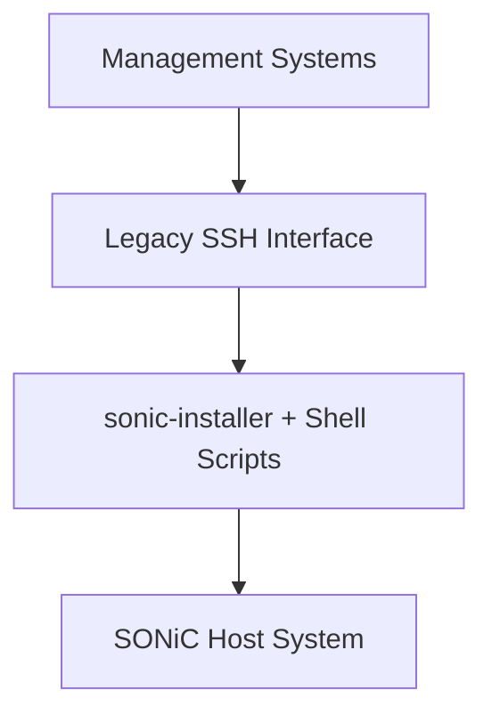
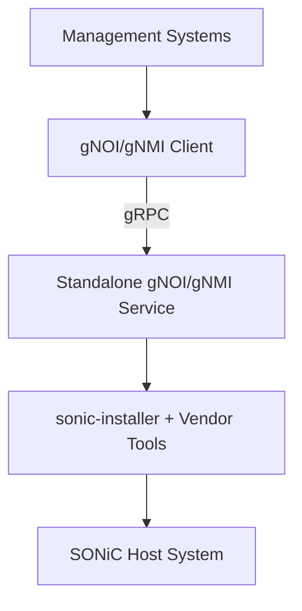
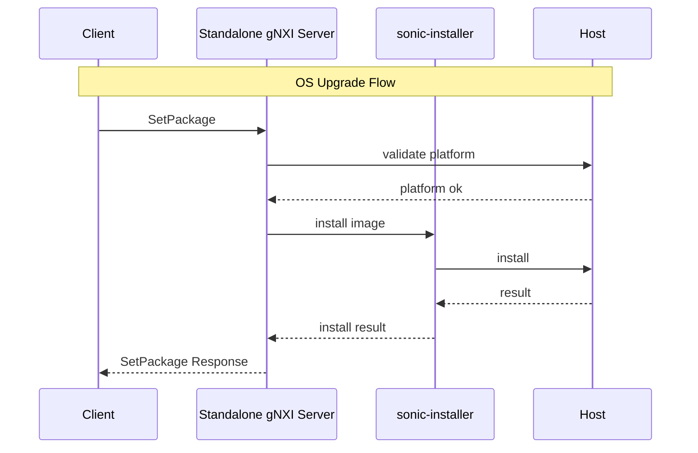
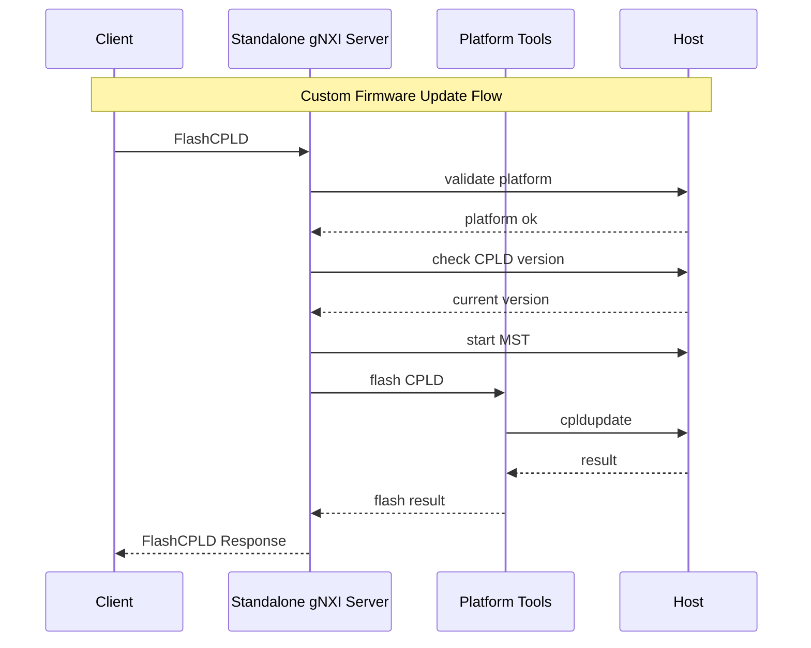
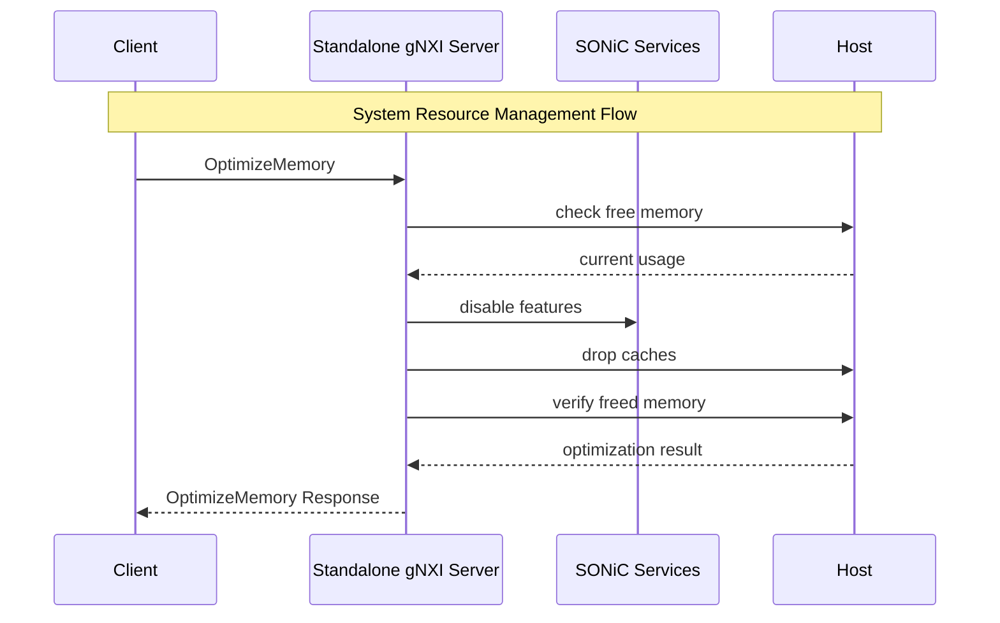

# HLD for Standalone gNOI/gNMI endpoint for OS Upgrade

## Table of Content 

### 1. Revision  

| Rev | Date | Author | Change Description |
|-----|------|--------|-------------------|
| 0.1 | 2025-01-22 | Initial Draft | HLD for Standalone gNOI/gNMI OS Upgrade Service |

### 2. Scope  

This section describes the scope of this high-level design document in SONiC.

This HLD covers the design and implementation of a standalone gNOI/gNMI service that provides structured gRPC interfaces for SONiC OS upgrade operations. The service acts as a wrapper around existing upgrade mechanisms (sonic-installer) while adding support for vendor-specific firmware operations and production-grade orchestration capabilities.

### 3. Definitions/Abbreviations 

This section covers the abbreviation if any, used in this high-level design document and its definitions.

| Term | Definition |
|------|------------|
| gNOI | gRPC Network Operations Interface |
| gNMI | gRPC Network Management Interface |
| CPLD | Complex Programmable Logic Device |
| MST | Mellanox Software Tools |
| KubeSonic | Kubernetes-based SONiC container orchestration project |
| ASIC | Application-Specific Integrated Circuit |

### 4. Overview 

The purpose of this section is to give an overview of high-level design document and its architecture implementation in SONiC.

Current SONiC OS upgrade operations rely on CLI-based tools (sonic-installer) and complex shell scripts that handle platform-specific firmware updates, system preparation, and post-processing. This approach creates several challenges:

1. **Reproducibility Issues**: Vendor environments lack the complete production upgrade scripts, making issue reproduction difficult
2. **Transport Limitations**: SSH-based command execution introduces serialization overhead and transport reliability issues
3. **Error Handling**: Text-based CLI output parsing provides poor error detection and structured error reporting
4. **Automation Challenges**: Programmatic access requires complex SSH orchestration with fragile text parsing

#### 4.1 Production Upgrade Complexity

Our script-based production upgrade process reveals extensive complexity that goes far beyond `sonic-installer install`:

**System Resource Management**: Memory optimization through selective feature disabling (eventd, restapi, acms, pmon, gnmi, snmp), multi-level cache dropping, disk cleanup, and swap management for constrained devices.

**Platform-Specific Operations**: Complex logic for 15+ different platform families (Mellanox SN2700/SN3800/SN4600, Dell S6100, Arista 7050/7060/7260, Cisco 8101/8102/8111, Celestica E1031, Nokia 7215) with hardware-specific firmware updates, validation, and workarounds.

**Version-Specific Workarounds**: Intricate upgrade path handling with 30+ version-specific checks for transitions like 2018→2023, 2019→2024, including script replacements, configuration patches, and compatibility fixes.

**Vendor Firmware Orchestration**: Direct hardware interaction via vendor tools (mlxfwmanager, cpldupdate, mst, s6100_cpld_upgrade) with semantic validation (BIOS compatibility, CPLD versioning, ASIC firmware management).

**Service Orchestration**: Container lifecycle management, systemd service control, configuration migration, and file system operations with retry mechanisms and error recovery.

**Error Handling**: 30+ specific exit codes for different failure scenarios, extensive validation checks, and automated cleanup procedures.

This HLD introduces a standalone gNOI/gNMI service that addresses these challenges by providing:
- Structured gRPC interfaces replacing fragile SSH/CLI orchestration
- Production-grade upgrade logic that can be upstreamed and reproduced by vendors
- Vendor-specific firmware operations through typed custom RPCs
- Platform-aware operation filtering with proper validation
- Integration with KubeSonic container orchestration

### 5. Requirements

This section list out all the requirements for the HLD coverage and exemptions (not supported) if any for this design.

#### 5.1 Functional Requirements

**FR-1**: Support standard gNOI operations for OS upgrades
- System.Reboot: Graceful and forced system reboot capabilities
- System.SetPackage: SONiC OS image installation via sonic-installer wrapper

**FR-2**: Provide gNMI interfaces for system status monitoring
- System resource monitoring: `/system/memory/free`, `/system/disk/host/free`
- Platform identification: `/os/platform`
- Upgrade compatibility information via structured paths

**FR-3**: Support vendor-specific firmware operations through custom RPCs
- **Mellanox platforms**: ASIC firmware (mlxfwmanager), CPLD flashing (cpldupdate via /dev/mst), BIOS updates with validation
- **Dell EMC platforms**: S6100 CPLD upgrade tools, SSD firmware updates
- **Cisco platforms**: FPGA/CPLD updates for 8101/8102/8111 series, media type corrections
- **Arista platforms**: Reboot cause management, disk repair utilities for VFAT platforms
- **Other vendors**: Framework for Celestica, Nokia, and additional platform support

**FR-4**: Maintain operation idempotency and reversibility
- All operations must either succeed completely or perform cleanup
- No partial state scenarios
- Robust error handling with structured error responses

**FR-5**: Platform-aware operation filtering
- Reject incompatible operations based on platform detection
- Validate hardware compatibility before executing firmware operations
- Provide clear error responses for unsupported operations

#### 5.2 Non-Functional Requirements

**NFR-1**: Security requirements equivalent to existing gNMI/gNOI services
- TLS encryption support
- Authentication and authorization integration
- Audit logging capabilities

**NFR-2**: Backward compatibility with legacy SONiC versions
- Execute host commands/instructions without depending on sonic-host-services through DBUS
- Mount host system, share host namespace and execute commands using nsenter
- Direct interaction with host file systems for legacy version support
- Version-specific workaround handling through custom RPCs

**NFR-3**: Container deployment flexibility
- Support privileged container deployment in KubeSonic environments
- Legacy deployment via upgrade scripts for non-k8s environments

**NFR-4**: Developer experience and rapid iteration
- Simple checkout-to-test workflow without complex sonic-buildimage dependencies
- Standard Go tooling for build, test, and dependency management (go build, go test)
- Clear and minimal build prerequisites documented in README
- No requirement for sudo in development workflows
- Modern dependency management without manual vendor patching
- Accessible to junior developers and AI-assisted development
- CI/CD that can run in standard GitHub Actions or similar environments


### 6. Architecture Design 

This section covers the changes that are required in the SONiC architecture. In general, it is expected that the current architecture is not changed.

The standalone gNOI/gNMI service introduces a new component that operates alongside existing SONiC services without replacing core upgrade mechanisms. The service acts as a structured interface layer over existing tools.

#### 6.1 Current Architecture



#### 6.2 Proposed Architecture



#### 6.3 Integration with KubeSonic

The service is designed to support the KubeSonic transition:

**Phase 1 (Legacy Deployment)**:
- Manual container deployment via upgrade scripts
- Privileged container with host filesystem access

**Phase 2 (KubeSonic Deployment)**:
- Integration with gnmi container when k8s-managed
- Kubernetes orchestration for container lifecycle

### 7. High-Level Design 

This section covers the high level design of the feature/enhancement.

#### 7.1 Service Architecture

The standalone gNOI/gNMI service consists of the following components:

**Core gRPC Server**:
- Built on the sonic-gnmi-standalone foundation
- TLS-enabled gRPC server with reflection support
- Configurable addressing and graceful shutdown

**Service Implementations**:
- Standard gNOI System service (Reboot, SetPackage)
- gNMI service for system status queries
- Vendor-specific custom RPC services

**Platform Integration Layer**:
- Redis client for SONiC database access
- Docker client for container orchestration
- systemd integration via gNOI.containerz or direct calls
- Platform detection and validation logic

#### 7.2 Component Diagram

```
┌──────────────────────────────────────────────────┐
│            Standalone gNOI/gNMI Service          │
├──────────────────────────────────────────────────┤
│  ┌─────────────┐  ┌─────────────┐  ┌───────────┐ │
│  │    gNOI     │  │    gNMI     │  │  Custom   │ │
│  │   System    │  │   Service   │  │    RPC    │ │
│  │  Service    │  │             │  │ Services  │ │
│  └─────────────┘  └─────────────┘  └───────────┘ │
├──────────────────────────────────────────────────┤
│  ┌─────────────┐  ┌─────────────┐  ┌───────────┐ │
│  │   Redis     │  │   Docker    │  │ Platform  │ │
│  │Integration  │  │Integration  │  │Detection  │ │
│  └─────────────┘  └─────────────┘  └───────────┘ │
├──────────────────────────────────────────────────┤
│  ┌─────────────┐  ┌─────────────┐  ┌───────────┐ │
│  │sonic-installer│ │ Vendor Tools│  │ systemd   │ │
│  │   Wrapper   │  │(mlx, dell)  │  │Integration│ │
│  └─────────────┘  └─────────────┘  └───────────┘ │
└──────────────────────────────────────────────────┘
                          │
                          ▼
                ┌─────────────────┐
                │   SONiC Host    │
                │    System       │
                └─────────────────┘
```

#### 7.3 Module and Repository Changes

**New Repository**: 
- Enhancement to existing `sonic-gnmi-standalone` repository
- Addition of upgrade-specific service implementations

**Modified Repositories**:
- `sonic-gnmi`: Proto definition additions for custom RPCs
- `sonic-buildimage`: Container integration for deployment

#### 7.4 Database and Schema Changes

**No changes to existing SONiC databases**. The service accesses existing databases through Redis binding:

**CONFIG_DB**: Read-only access for system configuration
**STATE_DB**: Read-only access for system state information  
**COUNTERS_DB**: Read-only access for system metrics

New gNMI paths exposed:
```
/system/memory/free
/system/disk/host/free  
/system/swap/available
/os/platform
/os/version/current
/os/version/target
/platform/firmware/cpld/version
/platform/firmware/bios/version
/platform/firmware/asic/version
/services/status/enabled
/services/status/running
/upgrade/validation/memory_required
/upgrade/validation/disk_required
/upgrade/validation/platform_compatible
```

#### 7.5 Sequence Diagrams

**OS Upgrade Flow**:



**Custom Firmware Update Flow**:



**System Resource Management Flow**:



#### 7.6 Docker and Build Dependencies

**Container Requirements**:
- Privileged container execution
- Host filesystem access via bind mounts
- Redis port binding for database access
- Docker socket access for container orchestration

**Build Dependencies**:
- Go 1.18+ for gRPC service implementation
- Protocol buffer compiler for custom RPC definitions
- Standard SONiC build infrastructure integration

#### 7.7 Management Interfaces

**gRPC Interface**: Primary management interface
- Standard gNOI System operations
- gNMI Get operations for system status
- Custom RPC operations for vendor-specific functions

**No CLI Interface**: Service operates exclusively through gRPC
**No SNMP Interface**: Out of scope for this design
**No REST Interface**: gRPC-only approach for structured communication

#### 7.8 Serviceability and Debug

**Logging**:
- Structured logging via glog integration
- Operation audit trails
- Platform-specific operation logging

**Error Handling**:
- Structured gRPC error responses
- Platform validation error messages
- Operation rollback logging

**Monitoring**:
- gNMI paths for service health monitoring
- Operation status reporting
- Platform compatibility reporting

### 8. SAI API 

This section covers the changes made or new API added in SAI API for implementing this feature.

**No SAI API changes required**. This service operates at the system/OS level and does not interact directly with the SAI layer. All hardware interactions are performed through existing vendor tools and platform-specific utilities.

### 9. Configuration and management 

#### 9.1. Manifest (if the feature is an Application Extension)

This feature is not implemented as an Application Extension but as a core service enhancement.

#### 9.2. CLI/YANG model Enhancements 

**No CLI changes required**. The service operates exclusively through gRPC interfaces and does not expose CLI commands.

**YANG Model Changes**: Not applicable as this service uses gRPC proto definitions rather than YANG models.

#### 9.3. Config DB Enhancements  

**No Config DB schema changes**. The service reads existing configuration through standard Redis binding and does not introduce new configuration tables.

### 10. Warmboot and Fastboot Design Impact  

**Warmboot Impact**: The service does not interfere with warmboot operations as it operates as a separate container service. During warmboot scenarios, the service may be unavailable but will not affect the warmboot process itself.

**Fastboot Impact**: Similar to warmboot, fastboot operations are not affected by this service. The service may provide gRPC interfaces to trigger fastboot operations but does not modify the underlying fastboot mechanisms.

### Warmboot and Fastboot Performance Impact

**Performance Analysis**:
- Does this feature add any stalls/sleeps/IO operations to the boot critical chain? **No** - The service runs as a separate container and does not participate in the boot critical path.
- Does this feature add CPU heavy processing during boot? **No** - Service initialization is lightweight and does not perform heavy processing during boot.
- Third party dependency impact? **No** - Uses existing gRPC libraries and platform tools.
- Can the service be delayed? **Yes** - The service can start after core SONiC services are operational.
- Boot time optimizations: Service startup can be deferred until after critical SONiC services are running.

### 11. Memory Consumption

**Memory Consumption Analysis**:
- **Disabled by compilation**: No memory consumption when not built into the system
- **Disabled by configuration**: Minimal memory footprint when service is not actively processing requests
- **Active operation**: Memory usage scales with concurrent operations but includes cleanup mechanisms to prevent memory leaks
- **Container isolation**: Memory usage is isolated within the container boundary

**Estimated Memory Usage**:
- Base service: ~50MB
- Per active operation: ~10-20MB (temporary during operation execution)

### 12. Restrictions/Limitations  

**RL-1**: Platform-specific operations require appropriate hardware and vendor tools
**RL-2**: Requires privileged container execution for host system access
**RL-3**: Legacy SONiC versions may require manual deployment scripts
**RL-4**: Vendor-specific operations limited to supported platforms (Mellanox, Dell EMC initially)
**RL-5**: No real-time progress monitoring for long-running operations (future enhancement)

### 13. Testing Requirements/Design  

#### 13.1. Unit Test cases  

**UT-1**: gNOI System.Reboot operation validation
- Test graceful and forced reboot scenarios
- Verify platform validation logic
- Test error handling for invalid parameters

**UT-2**: gNOI System.SetPackage operation validation  
- Test sonic-installer wrapper functionality
- Verify image validation and installation
- Test rollback scenarios and cleanup

**UT-3**: gNMI Get operation validation
- Test system status path queries (/system/memory/free, /system/disk/host/free)
- Verify platform information retrieval (/os/platform)
- Test error handling for invalid paths

**UT-4**: Custom RPC operation validation
- Test vendor-specific operations (FlashCPLD)
- Verify platform filtering logic
- Test operation idempotency and reversibility

**UT-5**: Platform detection and validation
- Test multi-platform compatibility
- Verify rejection of incompatible operations
- Test platform-specific tool availability

#### 13.2. System Test cases

**ST-1**: End-to-end OS upgrade workflow
- Full SONiC image upgrade via gNOI System.SetPackage
- Verify system state before and after upgrade
- Test upgrade across different SONiC versions

**ST-2**: Vendor-specific firmware upgrade workflows
- Mellanox CPLD/ASIC firmware updates
- Dell EMC platform-specific operations
- Verify hardware state consistency

**ST-3**: Container deployment scenarios
- Legacy deployment via upgrade scripts
- KubeSonic container deployment
- Privileged container operation validation

**ST-4**: Error and recovery scenarios  
- Network interruption during upgrade
- Invalid image handling
- Platform incompatibility detection
- Operation rollback verification

**ST-5**: Security and authentication
- TLS certificate validation
- Authentication requirement verification
- Unauthorized operation rejection

**ST-6**: Performance and scalability
- Concurrent operation handling
- Memory usage under load
- Long-running operation behavior

### 14. Open/Action items - if any 

**AI-1**: Define complete set of gNMI paths for upgrade validation information
**AI-2**: Finalize vendor-specific custom RPC definitions beyond initial Mellanox support
**AI-3**: Develop migration strategy from existing upgrade scripts to gRPC-based approach
**AI-4**: Define integration points with KubeSonic container orchestration
**AI-5**: Establish testing framework for vendor-specific hardware operations
**AI-6**: Define monitoring and alerting integration for upgrade operations
**AI-7**: Create documentation for extending custom RPC support to additional vendors

---

NOTE: All the sections and sub-sections given above are mandatory in the design document. Additional vendor-specific implementation details and custom RPC definitions will be added as the project progresses through the development phases.