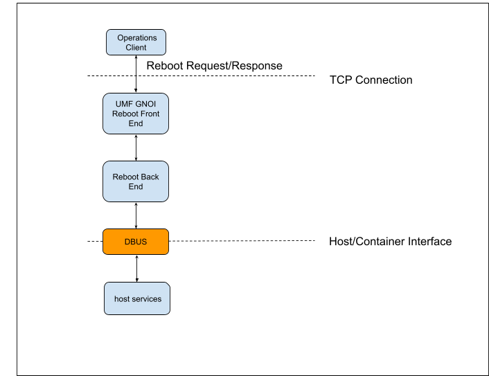
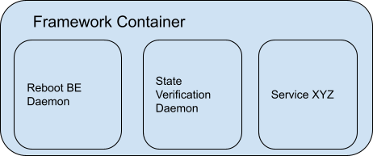
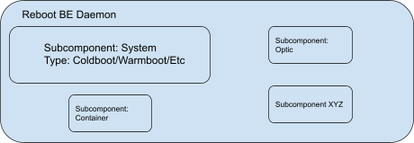
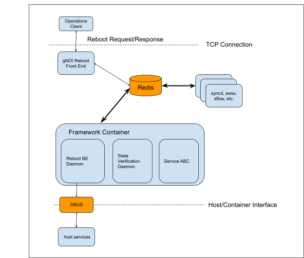

# **gNOI Reboot**

## Table of Content

<!-- TOC start (generated with https://github.com/derlin/bitdowntoc) -->

- [Revision](#revision)
- [Scope](#scope)
- [Definitions/Abbreviations](#definitionsabbreviations)
- [Overview](#overview)
- [Requirements](#requirements)
- [Architecture Design](#architecture-design)
   * [Framework Container](#framework-container)
- [High-Level Design](#high-level-design)
   * [Telemetry &lt;-> Reboot BE API](#telemetry-lt-reboot-be-api)
   * [Reboot Request Notification Schema](#reboot-request-notification-schema)
   * [Reboot Response Notification Schema](#reboot-response-notification-schema)
   * [CLI](#cli)
   * [Sonic Host Services](#sonic-host-services)
   * [SAI API {#sai-api}](#sai-api-sai-api)
   * [Configuration and management {#configuration-and-management}](#configuration-and-management-configuration-and-management)
   * [Warmboot and Fastboot Design Impact {#warmboot-and-fastboot-design-impact}](#warmboot-and-fastboot-design-impact-warmboot-and-fastboot-design-impact)
   * [Restrictions/Limitations {#restrictions-limitations}](#restrictionslimitations-restrictions-limitations)
   * [Testing Requirements/Design {#testing-requirements-design}](#testing-requirementsdesign-testing-requirements-design)

<!-- TOC end -->

<!-- TOC -->

## Revision

Rev  | RevDate    | Author(s)   | Change Description
---- | ---------- | ----------- | ------------------
v0.1 | 09/22/2023 | John Hamrick (Google) | Initial Version

## Scope

_This document describes the high level design for SONiC gNOI Reboot RPC support._

## Definitions/Abbreviations

API: Application Programming Interface

BE: Backend

FE: Frontend

gNOI: gRPC Network Operations Interface

RPC: remote procedure call

SAI: Switch Abstraction Interface

SONiC: Software for Open Networking in the Cloud

UMF: Unified Management Framework

## Overview

_Openconfig system.proto ([https://github.com/openconfig/gnoi/blob/main/system/system.proto](https://github.com/openconfig/gnoi/blob/main/system/system.proto)) defines reboot, cancel reboot and reboot status rpc’s within the system service. These rpc’s can be used to start, cancel and check status of reboot activities._

## Requirements

_NA_

## Architecture Design

The proposal is to create a Reboot Backend (BE) daemon in a new “Framework” container to handle a reboot request and forward it to the platform via DBUS.

This daemon provides a location to implement application level reboot functionality before forwarding a reboot request to the platform (in the spirit of “[Docker to Host Communications HLD](https://github.com/sonic-net/SONiC/blob/master/doc/mgmt/Docker%20to%20Host%20communication.md)”.

The reboot request contains a delay parameter, method and subcomponent fields. For subcomponents we can have support for:

* system reboot (method = warm, cold, fast, etc)
* optic reboot
* container reboot
* etc

The immediate short term use case for the reboot backend daemon is to support system warm boot. During warmboot applications will be requested and confirmed to:

* freeze/quiesce
* verify state
* checkpoint (save) state before shutdown 
* reconcile after boot
* verify state
* unfreeze

The controller can send a reboot request to the UMF gNOI Reboot Front End. This request will be forwarded to a Reboot Back End daemon executing in a container. The reboot back end daemon will then request host/platform level reboot actions via DBUS and a reboot sonic host service.

### Framework Container

There is no obvious container home for a reboot backend daemon: SWSS and PMON were considered. SWSS has the primary role of processing CONFIG_DB inputs (or kernel events) to APP_DB and ASIC_DB outputs. PMON, by name, exists to monitor the platform. Further, there are plans for a state verification daemon which also needs a home.

The Framework container is envisioned to provide a home for foundational services that interact with multiple containers/applications.

State verification daemon periodically (or by request) asks applications to verify their state. For example:

* SWSS Cfgmgr confirms CONFIG DB matches APPL DB.
* Syncd verifies ASIC DB matches SDK cache.

State verification daemon aggregates application results into a single state and writes overall state to the STATE DB.

It is proposed to create a new “Framework” container with reboot as its first daemon and state verification as its second.

One step further: the Reboot BE Daemon can have multiple state machines for different subcomponents. For example:

* System reboot
* Optic reboot
* Container reboot

## High-Level Design

The gNOI System service ([system.proto](https://github.com/openconfig/gnoi/blob/main/system/system.proto)) defines Reboot, RebootStatus and CancelReboot rpc’s. These rpc’s can be used to reboot a switch (or subcomponent) via gNOI.

### Telemetry &lt;-> Reboot BE API

There are three reboot rpc’s defined in [system.proto](https://github.com/openconfig/gnoi/blob/main/system/system.proto): Reboot, RebootStatus and CancelReboot.

JSON encoded RebootRequest, RebootStatusRequest and CancelRebootRequest will be send to the Reboot BE via a redis notification channel named: “`Reboot_Request_Channel".`

JSON encoded RebootResponse, RebootStatusResponse and CancelRebootResponse will be send to the gNOI Reboot FE  via a redis notification channel named: “`Reboot_Response_Channel".`

### Reboot Request Notification Schema

Data is JSON encoded [RebootRequest](https://github.com/openconfig/gnoi/blob/98d6b81c6dfe3c5c400209f82a228cf3393ac923/system/system.proto#L103C13-L103C13), [RebootStatusRequest](https://github.com/openconfig/gnoi/blob/98d6b81c6dfe3c5c400209f82a228cf3393ac923/system/system.proto#L145) or [CancelRebootRequest](https://github.com/openconfig/gnoi/blob/98d6b81c6dfe3c5c400209f82a228cf3393ac923/system/system.proto#L137) (from [system.proto](http://google3/third_party/openconfig/gnoi/system/system.proto)) indicated by the Key value.

### Reboot Response Notification Schema

Where StatusCode is defined in [sonic-swss-common/common/status_code_util.h](https://github.com/sonic-net/sonic-swss-common/blob/master/common/status_code_util.h) and can be populated via swss::statusCodeToStr(StatusCode::SWSS_RC_SUCCESS).

Data is JSON encoded RebootRequestResponse, RebootStatusResponse or CancelRebootResponse (from [system.proto](https://github.com/openconfig/gnoi/blob/main/system/system.proto)) indicated by the Key value.

### CLI

A cli based tool/script can write/read to/from the “Reboot_Request_Channel” and “Reboot_Response_Channel” notification channels to provide cli based reboot support.

### Sonic Host Services

We propose adding a new sonic host service named gnoi_reboot. This host service will have 3 methods defined: reboot, reboot_status and cancel_reboot.

These three methods will take as input json formatted RebootRequest, RebootStatusRequest and CancelRebootRequest (defined in system.proto as input).

Similarly, these three methods will return json formatted RebootResponse, RebootStatusResponse and CancelRebootResponse.

Reboot function definition:

      @host_service.method(host_service.bus_name(MOD_NAME), in_signature='as', out_signature='is')
      def reboot(self, options):
        request = json.loads(options[0])
        reboot_response = self.do_reboot(request)
        return 0, json.dumps(response)

Reboot status function definition:
   
      @host_service.method(host_service.bus_name(MOD_NAME), in_signature='as', out_signature='is')
      def reboot_status(self):
    	request = json.loads(options[0])
    	response = self.get_reboot_status(request)
    	return 0, json.dumps(response)

Cancel reboot function defintion:
      
      @host_service.method(host_service.bus_name(MOD_NAME), in_signature='as', out_signature='is')
      def cancel_reboot(self):
    	request = json.loads(options[0])
    	response = self.cancel_reboot(request)
    	return 0, json.dumps(response)

### SAI API {#sai-api}

_NA_

### Configuration and management {#configuration-and-management}

_NA_

### Warmboot and Fastboot Design Impact {#warmboot-and-fastboot-design-impact}

_No changes to existing functionality._

_This architecture provides a foundation for a gNOI based warm reboot with in switch software upgrade support. _

### Restrictions/Limitations {#restrictions-limitations}

### Testing Requirements/Design {#testing-requirements-design}

_Ondatra based gnoi reboot test will be designed/implemented._

_Ondatra is an open-source testing framework for network devices. It provides a way to write and run tests against network devices. Ondatra is written in Go and uses the gRPC protocol to communicate with the devices under test._

_More details about Ondatra can be found here [https://github.com/openconfig/ondatra/blob/main/README.md](https://github.com/openconfig/ondatra/blob/main/README.md)_

### 
Open/Action items - if any {#open-action-items-if-any}

