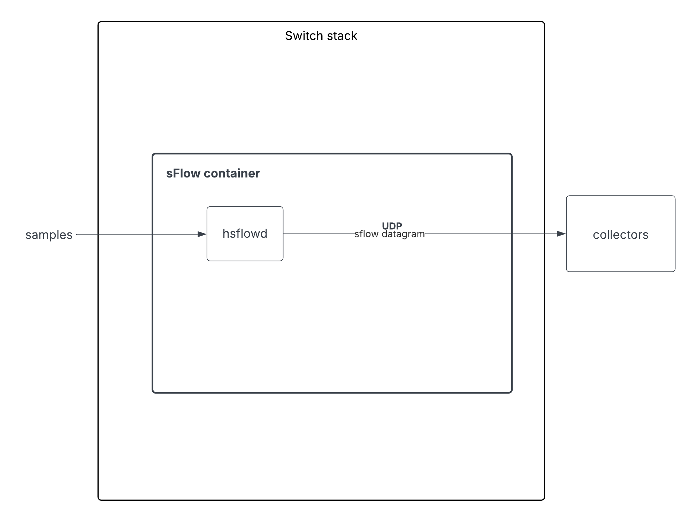
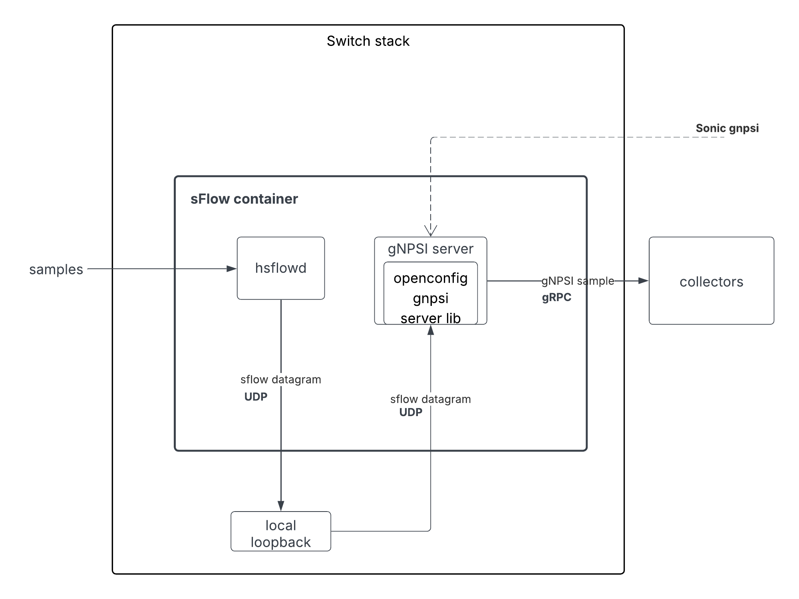
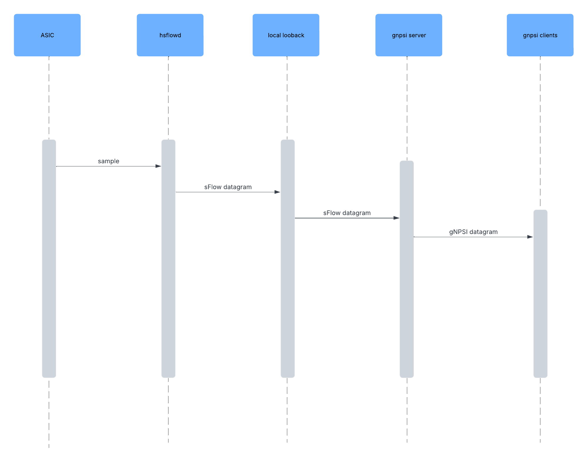
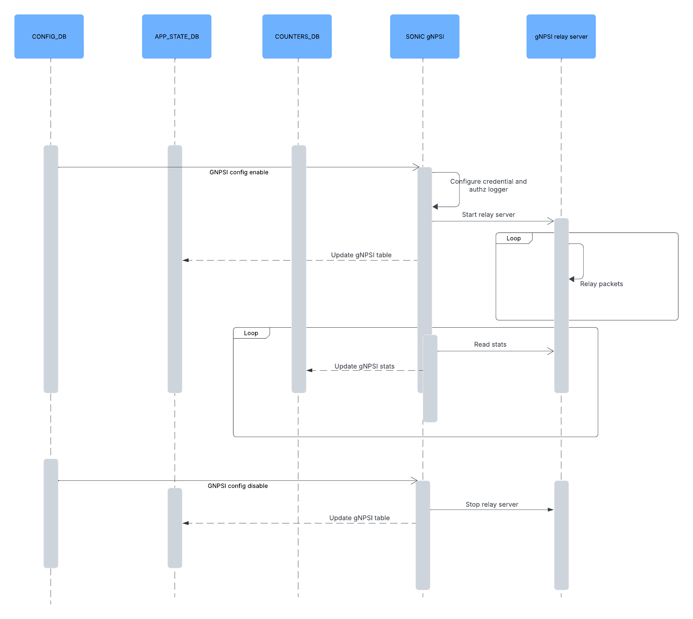
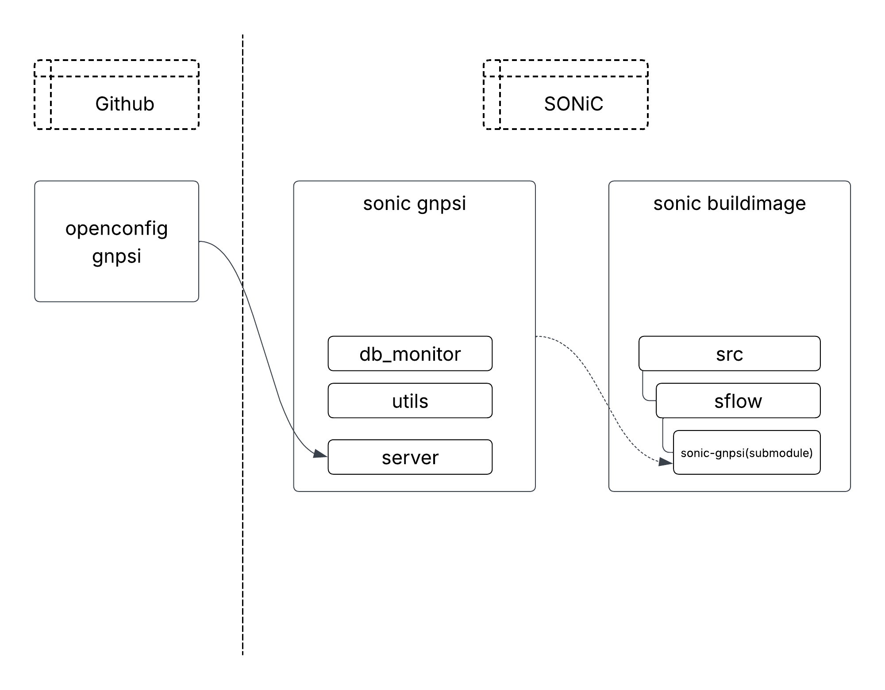
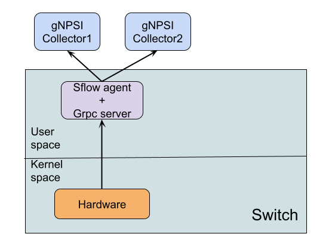
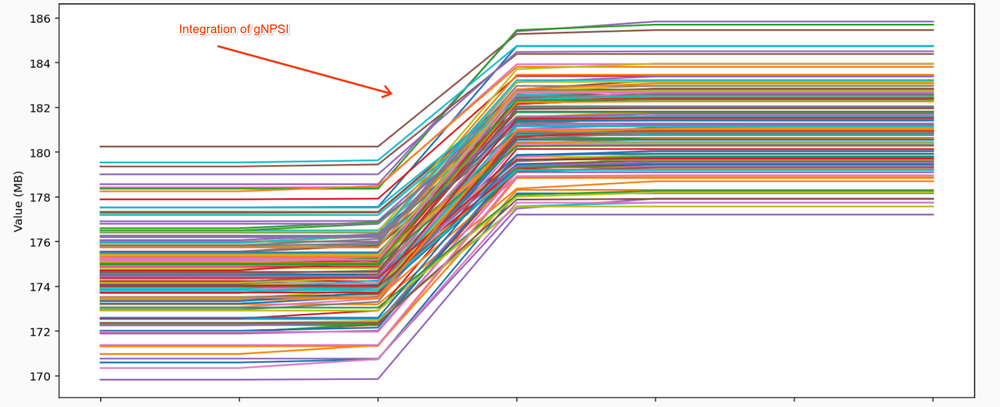

# SONIC GNPSI HLD


## [Table of Content](#table-of-content)
  * [1. Revision](#1-revision)
  * [2. Scope](#2-scope)
  * [3. Definitions/Abbreviations](#3-definitions-abbreviations)
  * [4. Overview](#4-overview)
  * [5. Requirements](#5-requirements)
  * [6. High-Level Design](#6-high-level-design)
    + [GNPSI application](#gnpsi-application)
    + [SONiC gNPSI implementation](#sonic-gnpsi-implementation)
    + [Repository and Module](#repository-and-module)
    + [Files](#files)
    + [Alternative](#alternative)
  * [7. Configuration and management](#7-configuration-and-management)
    + [7.1 Config DB Enhancements](#71-config-db-enhancements)
  * [8. Warmboot and Fastboot Design Impact](#8-warmboot-and-fastboot-design-impact)
  * [9. Memory Consumption](#9-memory-consumption)
  * [10. Testing Design](#10-testing-design)
    + [10.1. Unit Test cases](#101-unit-test-cases)
      - [Config DB monitor](#config-db-monitor)
      - [Stats](#stats)
    + [10.2. System Test cases](#102-system-test-cases)
      - [Ondatra](#ondatra)


### 1. Revision

| Revision | Author | Updated date| 
| -------- | ------ | ----------- |
| v0.1     | Google | Jun 16, 2025|

### 2. Scope

Add the service for supporting gNPSI in SONiC sFlow.


### 3. Definitions/Abbreviations

[gNPSI](https://github.com/openconfig/gnpsi) - gRPC Network Packet Sampling Interface


### 4. Overview

sFlow uses the Hsflowd agent within a docker container to send sample datagrams via UDP, whereas GNPSI is a new gRPC service streaming packet samples to the telemetry infrastructure.

It aims to address following issues of sFlow:


*   Lack of encryption and authentication (vulnerable to [man-in-the-middle attacks](http://b/183110882))
*   Challenges with UDP-based transport (packet loss)
*   Relies on VIP collector discovery

gNPSI solves these problems:


*   gRPC provides security & authentication
*   gRPC on TCP provides sequencing & re-transmission
*   Dial-in solution avoids discovery


### 5. Requirements

Integrate gNPSI into current sampling service, i.e. sFlow.  gNPSI is an optional feature that can be enabled by config and would not break any existing sFlow support.


### 6. High-Level Design


#### GNPSI application

Sonic runs sflow in a docker container by running an agent `hsflowd`. When sampled packets comes in, hsflowd would accumulate the packets into UDP datagrams and send them to the collector.




After the introduction of gNPSI, a new gNPSI server process would be brought up within the sFlow container. `hsflowd` would configure an internal local loopback collector just like a sFlow collector. 

**Advantage**: This local loopback approach ensures a streamlined architecture and simplifies the maintenance of the upstream code. Refer to the [Alternative](?tab=t.0#heading=h.5bgbtjgtpqgx) section on the rationale behind choosing this design.

When sampled packets come in, hsflowd would send it to the local loopback collector. Then gNPSI process would read from local loopback and relay samples to the subscribed clients. 








#### SONiC gNPSI implementation

The gNPSI relay server has been implemented within the [open-source gNPSI repository](https://github.com/openconfig/gnpsi) as a library. The SONiC gNPSI server integrates this relay server implementation, along with the addition of configuration, telemetry, and security functionalities.

Upon initialization, the gNPSI process will retrieve path configuration from the CONFIG_DB and activate or deactivate the relay server accordingly. Furthermore, it will collect statistics from the relay server and update the COUNTERS_DB every 30 seconds.

The gNPSI process has a scalability limitation of 3 clients. This modification is platform-independent.




#### Repository and Module

This design introduces a SONiC application extension. The primary modification involves adding a new `sonic-gnpsi` repository. The `sonic-gnpsi` would utilize an [open source gNPSI repo on github](https://github.com/openconfig/gnpsi) to build the server code. The `sonic-gnpsi` repo would be added as a submodule into the `sonic-buildimage`

By this way we ensure modularity and maintainability, making it easier to update and manage dependencies.

Build dependencies include the new `sonic-gnpsi` repository, the github `openconfig/gnpsi` repository, and `bazel`.

The dependency of repository is shown below




#### Files


*   `gnpsi.cc` : main file 
*   `/db_monitor`: to monitor config db gnpsi-related events
*   `/server`: helper to start and stop relay server and the stats thread, also write to appl_state_db
*   `/utils`: stats util, credential util and authz logger util.


#### Alternative




**Advantages:**


*   Avoids the overhead of writing and reading from the local loopback IP.

**Disadvantages:**


*   Introduces architectural complexities.
*   Difficult to upstream and maintain the sFlow open-source C code.

Given that the overhead of using the local loopback collector is negligible, we opted for local loopback collector solution instead of integrated processes.


### 7. Configuration and management


gNMI path

These paths controls the enablement of the server and gRPC port for gNPSI relay server 


*   `/system/grpc-servers/grpc-server[name=gnpsi]/config/enable`
*   `/system/grpc-servers/grpc-server[name=gnpsi]/config/port`

These paths cover the stats collection for gNPSI


*   `/system/grpc-servers/grpc-server[name=gnpsi]/clients/client[address=&lt;client_ip>][port=&lt;port_num>]/state/bytes-sent`
*   `/system/grpc-servers/grpc-server[name=gnpsi]/clients/client[address=&lt;client_ip>][port=&lt;port_num>]/state/packets-sent`
*   `/system/grpc-servers/grpc-server[name=gnpsi]/clients/client[address=&lt;client_ip>][port=&lt;port_num>]/state/sample-send-error`


Server flag


*   `gnpsi_grpc_port`: gRPC port for the gNPSI Server
*   `gnpsi_max_clients`: the max number of clients that can connect to gNPSI server at same time
*   `udp_port` UDP port to read sFlow samples. Switch would configure localhost and this port as sFlow collector.


#### 7.1 Config DB Enhancements

gNPSI uses `CONFIG_DB`, `APPL_STATE_DB` and `COUNTERS_DB` 

DB schema is shown as below:


```
CONFIG_DB:
	"GNPSI|global": {
"admin_state": "ENABLE"|"DISABLE",
"port": "<port_num>"
}
	APPL_STATE_DB:
		"GNPSI:global": {
"admin_state": "ENABLE"|"DISABLE",
"port": "<port_num>"
}
	COUNTERS_DB:
		"COUNTERS:GNPSI:<remote_ip>/<port_num>": {
			"bytes_sent": "0",
			"packets_sent": "0",
			"packets_error": "0"
}
```


*   For CONFIG_DB/APP_STATE_DB, admin_state and port are added for configuration purposes.
*   For COUNTERS_DB, gNPSI added stats path `bytes_sent`, `packets_sent` and `packetserror` for each collector._


### 8. Warmboot and Fastboot Design Impact

Since gNPSI does not interact with Switch hardware, it has no impact with respect to warm reboot and fast reboot.


### 9. Memory Consumption

Memory consumption is not significant based on collected stats. 




(All data is collected on Google-internal device environment)

There is a ~10MB(5%) memory increase after integration of feature (even when configuration is disabled)


### 10. Testing Design


#### 10.1. Unit Test cases


##### Config DB monitor


<table>
  <tr>
   <td>Test cases
   </td>
   <td>expected behavior
   </td>
  </tr>
  <tr>
   <td>TestConfigDbAdminStateEventSuccess
   </td>
   <td>Expect <code>db_monitor</code> can receive <code>admin_state</code> event successfully 
   </td>
  </tr>
  <tr>
   <td>TestConfigDbPortEventSuccess
   </td>
   <td>Expect <code>db_monitor</code> can receive <code>port</code> event successfully 
   </td>
  </tr>
  <tr>
   <td>TestConfigDbAllEventSuccess
   </td>
   <td>Expect <code>db_monitor</code> can receive <code>admin_state </code>and <code>port</code> event successfully 
   </td>
  </tr>
  <tr>
   <td>TestConfigDbInvalidEventFailure
   </td>
   <td>Expect <code>db_monitor</code> can parse invalid event as error 
   </td>
  </tr>
  <tr>
   <td>TestConfigDbIgnoreUninterestedEventSuccess
   </td>
   <td>Expect <code>db_monitor</code> would not return uninterested event
   </td>
  </tr>
  <tr>
   <td>TestConfigDbConsecutiveEventsSuccess
   </td>
   <td>Expect <code>db_monitor</code> can receive several events in correct order
   </td>
  </tr>
</table>


*   


##### Stats


<table>
  <tr>
   <td>Test cases
   </td>
   <td>expected behavior
   </td>
  </tr>
  <tr>
   <td>ReadCounterDbStatsSucceeds
   </td>
   <td>Can read from counters DB correctly
   </td>
  </tr>
  <tr>
   <td>UpdateCounterDbStatsSucceeds
   </td>
   <td>Can update counters DB correctly
   </td>
  </tr>
  <tr>
   <td>MergeEmptyExistingStatsNoopSucceeds
   </td>
   <td>Merge empty stats would not have effect
   </td>
  </tr>
  <tr>
   <td>MergeSameIpStatsDoubleCountSucceeds
   </td>
   <td>Merge same IP stats would double the stats count
   </td>
  </tr>
  <tr>
   <td>MergeDiffIpStatsNoopSucceeds
   </td>
   <td>Merge different IP stats would not change existing stats
   </td>
  </tr>
  <tr>
   <td>StatsThreadStartSucceeds
   </td>
   <td>Stats thread can start and update the stats correctly
   </td>
  </tr>
  <tr>
   <td>StatsThreadStopStartSucceeds
   </td>
   <td>Stats thread can stop and restart
   </td>
  </tr>
</table>


#### 10.2. System Test cases


##### Ondatra


<table>
  <tr>
   <td>Test cases
   </td>
   <td>expected behavior
   </td>
  </tr>
  <tr>
   <td><code>TestGNPSISubscribe</code>
<p>
This test verifies that a client can successfully establish a basic subscription to the gNPSI (gRPC Network Path and Service Interface) service on a device.<ol>

<li><strong>Configure DUT</strong>: It enables the gNPSI service on the Device Under Test (DUT).
<li><strong>Dial gNPSI</strong>: It creates a gNPSI client and establishes a connection to the DUT.
<li><strong>Subscribe</strong>: The client sends a <code>Subscribe</code> request to the DUT.
<li><strong>Wait for Response</strong>: It waits for an initial response or error from the subscription. The test doesn't expect a data sample, just a successful connection.</li></ol>

   </td>
   <td><ol>

<li>The client should successfully create a <code>Subscribe</code> RPC stream with the gNPSI service on the DUT without any errors. The test passes if the connection is established correctly.</li></ol>

   </td>
  </tr>
  <tr>
   <td><code>TestClientReceiveSampleSucceed</code>
<p>
 This test ensures that a gNPSI client can receive a sampled packet after traffic is sent through the device.<ol>

<li><strong>Configure DUT</strong>: It enables both <code>sFlow</code> (for packet sampling) and <code>gNPSI</code> on the DUT.
<li><strong>Set Sampling Rate</strong>: It configures a high sampling rate on a random interface to ensure packets are captured easily.
<li><strong>Create Client</strong>: It starts a gNPSI client and subscribes to the DUT.
<li><strong>Send Traffic</strong>: It uses a separate control device to send packets to the monitored interface on the DUT.
<li><strong>Wait for Sample</strong>: The test waits for the gNPSI client to receive a sample packet from the DUT.</li></ol>

   </td>
   <td><ol>

<li>After traffic is sent, the gNPSI client must receive at least one sFlow sample packet from the DUT within the timeout.</li></ol>

   </td>
  </tr>
  <tr>
   <td><code>TestGNPSISubscribeMultipleClients</code> 
<p>
This test verifies that the DUT correctly enforces the maximum number of allowed gNPSI clients. 
<ol>

<li><strong>Configure DUT</strong>: It enables the gNPSI service on the DUT.
<li><strong>Connect Max Clients</strong>: It enters a loop and successfully connects the maximum number of allowed clients (<code>maxClients</code>). Each client establishes and maintains its subscription.
<li><strong>Attempt Extra Connection</strong>: After all allowed slots are filled, it attempts to connect one more "extra" client.</li></ol>

   </td>
   <td><ol>

<li>The first <code>maxClients</code> should connect without issues. The connection attempt from the extra client <strong>must fail</strong>. 
<li>The error returned should specifically indicate that the client limit has been reached.</li></ol>

   </td>
  </tr>
  <tr>
   <td><code>TestClientReconnectAfterServiceRestart</code>
<p>
 This test checks if a gNPSI client can gracefully handle a service restart on the DUT and successfully reconnect.
<ol>

<li><strong>Initial Connection</strong>: It connects a client and verifies it receives a packet sample.
<li><strong>Start Traffic</strong>: It starts sending continuous traffic in the background to ensure samples are always being generated.
<li><strong>Stop Service</strong>: It remotely disables the gNPSI service on the DUT.
<li><strong>Check for Error</strong>: It verifies that the client receives an <code>EOF</code> (End-Of-File) error, indicating the server closed the connection.
<li><strong>Restart Service</strong>: It re-enables the gNPSI service on the DUT.
<li><strong>Reconnect</strong>: A new client is created, and it attempts to subscribe and receive a new sample.</li></ol>

   </td>
   <td><ol>

<li>The original client should detect the service shutdown via an error. 
<li>After the service is restarted, a new client should be able to connect and start receiving packet samples again.</li></ol>

   </td>
  </tr>
  <tr>
   <td><code>TestClientReconnectAfterSwitchReboot</code>
<p>
 This test validates the robustness of the gNPSI service across different types of system reboots. 
<ol>

<li><strong>Initial State</strong>: It connects a client and confirms it receives a sample packet to ensure the setup is working.
<li><strong>Perform Reboots</strong>: The test runs through two scenarios: <ul>

 <li><strong>NSF Reboot</strong>: A "graceful" Non-Stop Forwarding reboot.
 <li><strong>Cold Reboot</strong>: A complete power-cycle-style reboot.
<li><strong>Post-Reboot Verification</strong>: For each reboot type, the test: <ul>

 <li>Waits for the switch to come back online and stabilize.
 <li>Confirms that the sFlow and gNPSI configurations have been correctly reapplied.
 <li>Creates a new gNPSI client.
 <li>Sends new traffic to the DUT.
<li><strong>Check for Sample</strong>: It checks if the new client successfully receives a sample packet.</li></ul>
</li></ul>
</li></ol>

   </td>
   <td><ol>

<li>The <code>gNPSI</code> service and its configuration must persist across both NSF and cold reboots.
<li>After the DUT is back online, a new client must be able to connect and receive packet samples successfully.</li></ol>

   </td>
  </tr>
</table>

