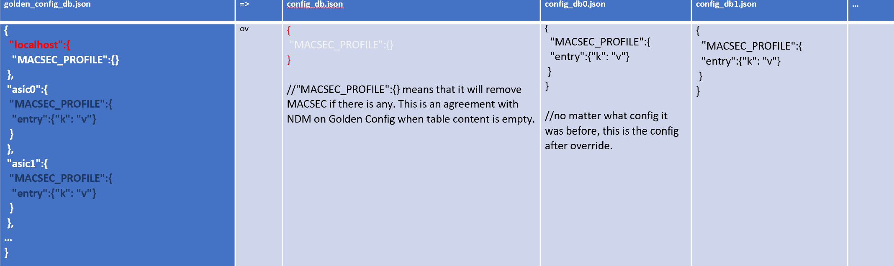

# Multi-Asic Single JSON Configuration Design

# Table of Contents
- [Table of Contents](#table-of-contents)
- [Revision](#revision)
- [About this Manual](#about-this-manual)
- [Scope](#scope)
- [Definition/Abbreviation](#definition-abbreviation)
    + [Table 1: Abbreviations](#table-1--abbreviations)
- [1. Background](#1-background)
- [2. Scope](#2-scope)
- [3. Design Overview](#3-design-overview)
  * [Objective](#objective)
  * [Requirements](#requirements)
  * [Designs: Add Another Layer of ASIC Info](#designs--add-another-layer-of-asic-info)
    + [3.1 DB Schema Design](#31-db-schema-design)
    + [3.2 Requirements](#32-requirements)
      - [3.2.1 config reload \<filename\>](#321-config-reload---filename--)
      - [3.2.2 config override](#322-config-override)
      - [3.2.3  config apply-patch](#323--config-apply-patch)
      - [3.2.4  show runningconfiguration all](#324--show-runningconfiguration-all)
      - [3.2.5 config save](#325-config-save)
    + [3.3 Pros and Cons](#33-pros-and-cons)
- [4. Summary](#4-summary)

# Revision

| Rev | Date        | Author             | Change Description  |
|:---:|:-----------:|:------------------:|---------------------|
| 0.1  | 07/20/2023 | Jingwen Xie        | Initial version     |

# About this Manual
This document provides a detailed description on the strategy to implement the SONiC single JSON configuration for multi-asic device.

# Scope
This document describes the high level design of a SONiC single JSON configuration for multi-asic device. This document provides minor configuration details about the proposed solutions.

# Definition/Abbreviation

### Table 1: Abbreviations
| **Term** | **Meaning**                |
| -------- | -------------------------- |
| ConfigDB | Configuration Database     |
| JSON     | JavaScript Object Notation |

# 1. Background

SONiC uses minigraph as configuration truth generation for both single ASIC and multi-ASIC. In multi-ASIC, SONiC itself will generate HOST and ASIC DB configurations based on single minigraph file.

In the future, SONiC will deprecate minigraph and fetch the Golden Config generated by NDM service. In the single ASIC workflow, NDM will be responsible to generate the Golden Config. HwProxy will push the config to SONiC. Then SONiC will load the Golden Config. However, NDM, HwProxy and SONiC  doesn’t have a workflow for multi-asic scenario to consume Golden Config.

In existing minigraph workflow, NGS/NDM/HwProxy will treat multi-asic SONiC device just as the single ASIC device, which means only one minigraph file will be provided to SONiC to generate all the  configuration no matter it is single ASIC or multi-asic. During multi-asic config generation, a single minigraph will be generated and deployed in SONiC device. SONiC has its minigraph parsing logic to break one piece of config into small pieces for host and each ASIC.

We assume NDM/HwProxy will follow the above existing minigraph workflow, where only one Golden Config file will be generated and deployed in SONiC’s multi-asic device.


# 2. Scope

This document describes the high level design of DB schema of multi-asic scenarios. This document provides minor implementation details about the proposed solutions.

# 3. Design Overview

A single Golden Config will serve as the ground truth for multi-ASIC SONiC configuration source.

## Objective

This DB design aims to serve as the single source of truth for multi-ASIC device configuration in the future.

## Requirements

- `config reload`: Reload one desired Golden Config file for multi-ASIC.
- `config override-config-table`: Override one desired Golden Config file for multi-ASIC.
- `show runningconfiguration all`: Show all host and ASIC configs in the format of the desired Golden Config.
- `config apply-patch`: Perform config update changes based on the JSON diff of desired Golden Config.
- `config save`: Save all configs to one file of the desired Golden Config format.

## Designs: Add Another Layer of ASIC Info

### 3.1 DB Schema Design

This design provides another layer of Host and ASIC as keys, appending relative configuration as the value.
```
{
    "localhost"：{
        "FEATURE": {…}，
        "ACL_TABLE": {…},
        …
    }，
    "asic0"：{
        "FEATURE": {…},
        "ACL_TABLE": {…},
        …
    }
    …
}
```
### 3.2 Requirements

- `config reload <filename>`: Support multi-ASIC reload by consuming one Golden Config JSON file.
- `config override`: Modify logic to support override in multi-ASIC scenarios.
- `config apply-patch`: Modify to support multi-ASIC by applying patches in a loop.
- `show runningconfiguration all`: Display configuration in the format of Golden Config schema.
- `config save`: Generate a single JSON file with the format specified.

#### 3.2.1 config reload \<filename\>
Current config reload CLI supports multi-asic reload by providing N config files, where N is the sum of host and ASICs. The config file for host will be `/etc/sonic/config_db.json`, and the config file for ASIC will be `/etc/sonic/config_db0.json`, `/etc/sonic/config_db1.json`, and so on.

To support the single Golden Config JSON file described earlier, SONiC should be able to consume one file to generate all configs of host and ASIC. To make it backward compatible, we need to add the multi ASIC support to make it be able to consume one Golden Config JSON file.

 **SCENARIOS**
1.	Existing support for single ASIC:
-	`config reload`
	It will reload the default config file: `/etc/sonic/config_db.json`
-	`config reload tmp_config_db.json`
	It will reload the `tmp_config_db.json`
2.	Existing support for multi-ASIC:
-	`config reload`
	It will reload the default config file: `/etc/sonic/config_db.json, /etc/sonic/config_db0.json, …, /etc/sonic/config_db5.json`
-	`config reload tmp_config_db.json,tmp_config_db0.json,…,tmp_config_db5.json`
	It will reload the specified list of tmp config files.
3.	Extra support for multi-ASIC:
-	`config reload golden_config_db.json`
	It will reload the single JSON file with format 3.1 to all configDBs.


#### 3.2.2 config override
Current config override CLI only support single ASIC override. Its logic needs to be modified to support override in multi-asic scenarios. [PR](https://github.com/sonic-net/sonic-utilities/pull/2738)

Take one table "MACSEC_PROFILE" for example,


#### 3.2.3  config apply-patch
Current config apply-patch CLI doesn’t support multi-asic. To support GCU in multi-asic, we need to modify the patch to make host and ASIC consume the patch in a loop.

The GCU command will keep the same as before. patch will stays the same and follow [JSON Patch (RFC6902)](https://datatracker.ietf.org/doc/html/rfc6902)

Example of patch.json. This patch is to change all the entry’s k to “value”.
```
[
 {
  "op": "replace",
  "path": "/asic1/MACSEC_PROFILE/entry/k",
  "value": "value"
 },
 {
  "op": "replace",
  "path": "/asic0/MACSEC_PROFILE/entry/k",
  "value": "value"
 }
 ...
]
```

#### 3.2.4  show runningconfiguration all
Current show runningconfiguration all CLI only display configuration of host only in multi-asic device. We can change it to the format of Golden Config schema:
```
{
    "localhost"：{
        "MGMT_INTERFACE": {…}，
        "ACL_TABLE": {…},
        …
    }，
    "asic0"：{
        "MGMT_INTERFACE": {…},
        "ACL_TABLE": {…},
        …
    }
    …
}
```

#### 3.2.5 config save
Current config save will generate N config files, where N is the sum of host and ASICs. The CLI will keep the same behavior as before.

**SCENARIOS**
1.	Existing support for single ASIC:
-	`config save`
	It will save to the default config file: `/etc/sonic/config_db.json`
-	`config save tmp_config_db.json`
	It will save config to the `tmp_config_db.json`
2.	Existing support for multi-ASIC:
-	`config save`
	It will save to the default config file: `/etc/sonic/config_db.json, /etc/sonic/config_db0.json, …, /etc/sonic/config_db5.json`
-	`config save tmp_config_db.json,tmp_config_db0.json,…,tmp_config_db5.json`
	It will save to the specified list of tmp config files.
3.	Extra support for multi-ASIC:
-	`config save all_config_db.json`
	It will save the single JSON file with format 3.1 to all configDBs.

### 3.3 Pros and Cons
- Pros:
   - To support this DB schema, all we need to do is to add one layer of host or ASIC information.
  - Compared to the next DB schema design, SONiC YANG models can stay as of now and no new fields need to be added.
  - During minigraph deprecation, this schema is easy to be supported on Golden Config Override.
- Cons:
  - YANG validation cannot be directly applied in such format. However, we can apply YANG validation on host and each ASIC’s configuration.
  - Some table might be duplicated in each ASIC, so there will be duplicate work for NDM.

# 4. Summary

The design is to add another layer of ASIC info as it avoids complicated parsing logic and maintains compatibility with existing YANG models. This design also simplifies the process of adding new tables during minigraph deprecation.


