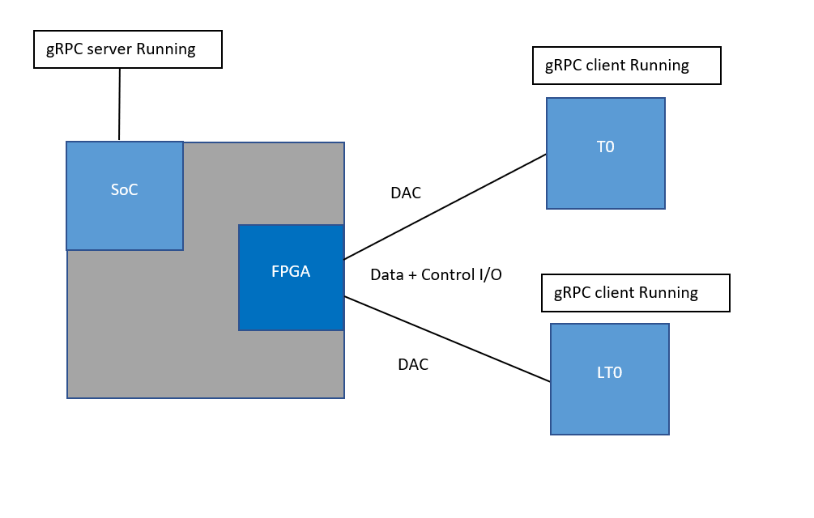

## gRPC client for active-actve DualToR scenario design


Table of Contents
=================
* [Scope](#scope)
* [Requirements](#Requirements)
* [why gRPC](#whygrpc)
* [HardWare Overview and Overall Architecture](#hardware-overview-and-overall-archtecture)
  * [Hardware Overview](#hardware-overview)
  * [Host Architecture](#host-architecture)
  * [DualToR architecture](#dualtor-redundancy-achievment-using-active-active-solution)
* [Proto and Schema Definition](#proto-and-schema-definition)
  * [Proto Definition for forwarding State](#proto-definition-interface-to-state-machine-for-getset-admin-state-of-the-fpga-ports)
  * [Schema Definition for DB's ](#ycabled-functional-schema-for-data-exchanged-between-orchagent-and-linkmgr)
* [gRPC channel customisation and Telemetry Schema](#grpc-channel-customisation-and-telemetry-schema)
  * [Keepalive mechanism for channels](#keepalive-for-grpc-channelstub)
* [gRPC client communicate to SoC over Loopback IP](#grpc-client-communicate-to-soc-over-loopback-ip)
* [gRPC commuication over secure channel](#grpc-commuication-over-secure-channel)
* [gRPC client initialization/deployment](#deployment)
* [gRPC commuication to NIC simulator](#grpc-communication-with-nic-simulator)
   * [Interceptor Solution for NIC simulator ](#proposed-solution-using-grpc-interceptor-inside-the-client)
   * [Mulptiple servers for NIC simulator ](#proposed-solution-using-multiple-grpc-servers-inside-nic-simulator)
* [Proto and Schema Definition for Aync notificaion](#proto-definition-interface-to-soc-to-notify-ycabled-about-service-notification)


## Revision

| Rev | Date     | Author          | Change Description |
|:---:|:--------:|:---------------:|--------------------|
| 0.1 | 04/1/22 | Vaibhav Dahiya  | Initial version    |
| 0.2 | 02/1/22 | Vaibhav Dahiya  | Make chnages to be shared to Core Team    |


## Scope
gRPC client design doc which would communicate with the SoC in DualToR Active-active setup/ and Nic-simulator for testing infrastructure in SONiC MGMT.
### Overview

This document summarizes the approach taken to accommodate gRPC client
for DualToR active active scenario. The gRPC client daemon's
main purpose is to provide a way for linkmgr to exchange RPC's with SoC
and do this within SONiC PMON docker


## Requirements

- provide a service/daemon in SONiC to run in DualToR mode, which can interact with Platform API as well interact with state machine(aka Linkmgr) and orchagent to provide capability for it to get/set Link State/Forwarding State etc. from SoC(gRPC server listening to the client)
- the service gRPC daemon should be able exchange RPC's with the gRPC server running on the SoC over a secure channel
- provide a schema for this daemon to publish to State DB on Host which would monitor the aspects of gRPC state for all SoC's running as server.
- provide an interface/method for gRPC daemon to exchange RPC's with the gRPC server running on the SoC using a loopback IP as source IP.
- provide an interface for SoC to notify this gRPC client about going to maintainence/shutdown via an asynchronous method.
- gRPC client communication with Nic-simulator(which will be run in SONiC-Mgmt Testbeds) should also be provided to exchange RPC's.
- provide a way to monitor gRPC client's and channel health for corrective/monitoring action to be implemented within SONiC ecosystem


## whygRPC

## why gRPC for communication between ToR AND the SoC

Notes provide a helpful link for learning gRPC and main page

- Lightweight messages. Depending on the type of call, gRPC-specific messages can be up to 30-50 percent smaller in size than JSON messages.
- High performance. By different evaluations, gRPC is 5, 7, and even 8 times faster than REST+JSON communication.
- Built-in code generation. gRPC has automated code generation in different programming languages including Java, C++, Python, Go, Dart, Objective-C, Ruby, and more.
- More connection options. While REST focuses on request-response architecture, gRPC provides support for data streaming with event-driven architectures: server-side streaming, client-side streaming, and bidirectional streaming.
- Healthy developer EcoSystem and gRPC is open source, hence it helps in getting acquainted with Libraries/API and Troubleshooting bugs/issues becomes easier

More Resources for learning gRPC and advantages Credits

[grpc github repo](https://github.com/grpc/grpc)


## Hardware Overview and overall Archtecture

### Hardware Overview



### HOST architecture

HOST and FPGA functionality is explained in this diagram


### DualToR redundancy achievment using Active-Active solution


## Proto and Schema definition


### Proto Definition Interface to State Machine for Get/Set Admin state of the FPGA Ports


the proto3 syntax's proto file used for generating gRPC code in Python3 is as follows. gRPC tools can be used to generate the corresponding library code in any language, ycabled employes Python3 to achieve this

    ```python
        service DualToRActive {
          rpc QueryAdminForwardingPortState(AdminRequest) returns (AdminReply) {}// queries the Admin Forwarding State of the FPGA
          rpc SetAdminForwardingPortState(AdminRequest) returns (AdminReply) {}// sets the Admin Forwarding State of the FPGA
          rpc QueryOperationPortState(OperationRequest) returns (OperationReply) {} // queries the Operation State of the FPGA
          rpc QueryLinkState(LinkStateRequest) returns (LinkStateReply) {} // queries the Link State of the FPGA
          rpc QueryServerVersion(ServerVersionRequest) returns (ServerVersionReply) {} // queries the version of the Server running
        }

        message AdminRequest {
          repeated int32 portid = 1;
          repeated bool state = 2;
        }

        message AdminReply {
          repeated int32 portid = 1;
          repeated bool state = 2;
        }

        message OperationRequest {
          repeated int32 portid = 1;
        }

        message OperationReply {
          repeated int32 portid = 1;
          repeated bool state = 2;
        }

        message LinkStateRequest {
          repeated int32 portid = 1;
        }

        message LinkStateReply {
          repeated int32 portid = 1;
          repeated bool state = 2;
        }

        message ServerVersionRequest {
          string version = 1;
        }

        message ServerVersionReply {
          string version = 1;
        }

    ```

- The QueryAdminForwardingPortState RPC is used to query the Admin Forwarding State of the FPGA. It takes an AdminRequest message as input and returns an AdminReply message as output.

- The SetAdminForwardingPortState RPC is used to set the Admin Forwarding State of the FPGA. It takes an AdminRequest message as input and returns an AdminReply message as output.

- The QueryOperationPortState RPC is used to query the Operation State of the FPGA. It takes an OperationRequest message as input and returns an OperationReply message as output.

- The QueryLinkState RPC is used to query the Link State of the FPGA. It takes a LinkStateRequest message as input and returns a LinkStateReply message as output.

- The QueryServerVersion RPC is used to query the version of the server running. It takes a ServerVersionRequest message as input and returns a ServerVersionReply message as output.

- The AdminRequest message contains two repeated fields, portid and state, where portid is a list of integers representing the ID of the port, and state is a list of booleans representing the state of the port.

- The AdminReply message has the same fields as AdminRequest.

- The OperationRequest message contains a single repeated field portid which is a list of integers representing the ID of the port.

- The OperationReply message has two repeated fields, portid and state, where portid is a list of integers representing the ID of the port, and state is a list of booleans representing the state of the port.

- The LinkStateRequest message has the same field as OperationRequest.

- The LinkStateReply message has the same fields as OperationReply.

- The ServerVersionRequest message contains a single string field version representing the version of the server.

- The ServerVersionReply message has the same field as ServerVersionRequest.


## Ycabled Functional Schema for Data Exchanged between orchagent and linkmgr

- Ycabled would exchange data/state with orchagent and linkmgr with the following schema:

   ```
        APP_DB
        MUX_CABLE_TABLE| PORTNAME; written by linkmgrd react on orchagent
        - state: active | standby
        HW_ MUX_CABLE_TABLE | PORTNAME; written by orchagent react on ycabled (its replacement)
        - state: active | standby
        FORWARDING_STATE_COMMAND | PORTNAME:
        - command: probe | set_active_self | set_standby_self | set_standby_peer   ;written by linkmgrd react on ycabled
        FORWARDING_STATE_RESPONSE | PORTNAME
        - response: active | standby | unknown | error ;written by ycabled react by linkmgrd
        - response_peer: active | standby | unknown | error ;written by ycabled react by linkmgrd
        PORT_TABLE|PORTNAME
        - oper_status: up|down; written  by swss  react by linkmgrd
        PORT_TABLE_PEER|PORT
        - oper_status: up|down; written by ycabled react by linkmgrd
        HW_FORWARDING_STATE_PEER|PORTNAME; written by linkmgrd react by ycabled
        - state: active|standby|unknown
        MUX_SERVICE_NOTIFICATION|PORT
        - notify_type:control/data
        - msg_type:begin/end
        - guid:<guid>
        - service_time:<time> //seconds

        STATE_DB
        MUX_CABLE_TABLE| PORTNAME
        - State: active|standby|unknown; written by orchagent react on linkmgrd
        HW_MUX_CABLE_TABLE| PORTNAME
        - State: acative|standby|unknown; written by ycabled react on orchagent
        HW_MUX_CABLE_TABLE_PEER| PORTNAME
        - state: active |standby|unknown; written by ycabled react on linkmgrd

   ```

### Ycabled Illustartion for Data Exchange between different Daemons

- Since Platform API already exists for all vendors and it is an essential requirement for gRPC agent to establish communication to check certain aspects(QSFP presence for example),
Ycabled is written in Python3

The following Picture explains how data is exchanged between orchagent/ycabled/linkmgr


## gRPC channel customisation and Telemetry Schema

### KeepAlive for gRPC channel and Stub
- Because of native gRPC channel State Machine has a delay issue for making the channel READY from IDLE state in case a gRPC RPC is not exchanged for a while, we employ a keepalive mechanism for DualToR messages exchanged.
- This helps achieve to immediately send an RPC, in case its requested fro linkmgr/orchagent and not have a delay in forming the session
- Enables HTTP2 pings to be sent to SoC and hence in normal working conditions Channel State of gRPC is always kept at READY
- more details for keepalive can be found here

- This allows gRPC channel to goto TRANSIENT_FAILURE state once pings are disrupted within any <tsecs>.
- gRPC channel attributes are hence added like this
- Currently ping frequency is 4 secs, but can be reduced/increased depending on requirement
```python
   GRPC_CLIENT_OPTIONS = [
    ('grpc.keepalive_timeout_ms', 8000),
    ('grpc.keepalive_time_ms', 4000),
    ('grpc.keepalive_permit_without_calls', True),
    ('grpc.http2.max_pings_without_data', 0)
]
```

### Telemetry publishing schema for monitoring YCabled

- for monitoring most of these fields are updated or sent RPC and updated after every ~60 seconds by the service, except the grpc_connection_status and soc_service fields, both of which are preemptively monitored by using keepalive mechanism and an asynchrounous notification from the SoC.

```
    State DB
    MUX_CABLE_INFO| PORTNAME;
    - mux_direction |active/standby/unknown
    - Peer_mux_direction| active/standby/unknown	//which side the Grpc FPGA TX  (active/standby) is pointing to, meaning the downward traffic will be allowed to pass. active means mux pointing to self and vice-versa
    - grpc server version| 1.xxx/NA	//Describes the version which the server is running onto	
    - self_operation_state|	Up/Down/NA	  //Describes whether the operation of the port is administratively up/down	yes
    - peer_operation_state|	Up/Down/NA	  //Describes whether the operation of the peer port is administratively up/down	
    - self_link_state|	Up/Down/NA	      //Describes whether or not the link is physically up from FPGA side using gRPC	
    - peer_Link_state|	Up/Down/NA	//Describes whether or not the link is physically up from FPGA side using gRPC	
    - grpc_connection_status| 	READY/TRANSIENT_FAILURE/IDLE/SHUTDOWN/CONNECTING/NA	//(TCP session details or channel details)	
    - mux_direction_probe_count|	Type:int	//A counter about how many times mux direction is probed using gRPC	
    - peer_mux_direction_probe_count|	Type:int	//A counter about how many times peer mux direction is probed using gRPC	
    - link_state_probe_count|	Type:int	//A counter about how many times link state is counted using gRPC	
    - peer_link_state_probe_count|	Type:int	//A counter about how many times peer link state is counted using gRPC	
    - operation_state_probe_count|	Type:int	//A counter about how many times operation link state is counted using gRPC	
    - peer_operation_state_probe_count|	Type:int	//A counter about how many times peer operation link state is counted using gRPC
    - soc_service| inprogress/noop/NA	//Mentions if at all there is a service happening on the SoC, If ths channel link status goes to READY, then this is not going to be utilized
			
```

## Other Considerations

## gRPC client communicate to SoC over Loopback IP

#### Background

- We need a way to communicate to SoC using a Loopback IPv4 which would not be adversitised to public from SONiC DualToR. This Loopback IP requirement arises because SoC has firewall rules which would not allow normal traffic to pass through. In Normal scenario the interface inside the subnet, which would be a vlan IP, would be the source IP of the packet going to the SoC for gRPC. As such we would need to use a well defined IP(Loopback IP) which would be allowed in SoC firewall rules, hence the requirement to communicate over a pre-defined IPv4 address.

#### Possible Solutions for Loopback IP
- The Best approach would be BIND the socket which is used by the gRPC channel to Loopback interface using a gRPC API. There is a socket_mutator API which is available in C++, which allows us to accomplish this, and was also tested inside the lab. However the gRPC client is proposed to be written in Python, because platform API is installed inside PMON(Python) as well as in DualToR Active/Standby scenrio ycabled is also written in Python. The gRPC client logic is proposed to be run inside PMON container. Since the gRPC library does not expose this API in Python, nor does it expose the socket, this is not an easy workaround. The github issue is filed for this issue inside gRPC Github repo.

- Another approach could be adding a Kernel Route. We could add a Kernel Route to the SoC IP. For example
    ```
       sudo ip route add <SoC IP> via <vlan IP> src <Loopback IP>
    ```
  - The issue with adding a Kernel Route is that route_checker will fail after adding this route, since vlan IP is the HOST's own vlan IP within SONiC as such no real neighbor is present, hence the route_checker will not be able to validate this entry
  - SWSS orchagent will also complain about not able to install the entry in ASIC, since the entry will be present in APP DB but not present inside ASIC itself. This would deem more workarounds necessary to be able to accomodate this route using this approach.
  - For the kernel route approach we would have to accomodate these issues listed above
- using an IPTABLES rule. We could add a POSTROUTING rule to the SNAT table with destination as SoC IP and source as Loopback IP. For Example
    ```
        sudo iptables -t nat -A POSTROUTING --destination <SoC IP> --source <Vlan IP> -j SNAT --to-source <LoopBack IP>
    ```
    - There could be single SNAT entry for the entire subnet which is covers all the SoC IP's connected to the ToR

#### Proposed Solution

- use the IPTABLES rule method as with this approach, there are no more workarounds necessary after adding the rule. Caclmgrd will check the CONFIG DB DEVICE_METADATA and upon learning this is ToR with subtype DualToR, will add the IPTABLES rule, after checking the MUX_CABLE table inside CONFIG_DB.
    ```
        DEVICE_METADATA | localhost;
        type: ToRRouter
        subtype: DualToR
    ```
    ```
        MUX_CABLE|PORTNAME
        SoC_IPv4: <SoC IP>
    ```
- The update_control_plane_nat_acls subroutine in caclmgrd will check for the above configuration and upon getting the config, it will add the POSTROUTING SNAT rule
- Currently the NAT rules which exist are only for multiasic platforms and are only for trapping the SNMP packets coming in the front panel interface in the linux network namespace and sent to the docker0 subnet 240.12.1.x. These NAT rules which are present are for SNMP packets, which are destined for UDP + dest port 161
- Adding this new POSTROUTING rule should not cause any issues to the forwarding behavior to the ToR.
- caclmgrd will not be needed to be restarted in this approach. The SNAT iptables entry would be a one time install when caclmgrd starts.
   For Example
```
admin@sonic:~$ sudo iptables -L -n -v -t nat --line-numbers

Chain POSTROUTING (policy ACCEPT 0 packets, 0 bytes)
num   pkts bytes target     prot opt in     out     source               destination
1        0     0 SNAT       all  --  *      *       0.0.0.0/0            10.10.10.10          to:10.212.64.2
```

#### Rationale

  - This approach conveniently adds the rule for all the SoC IP's needed to be communicating with DualToR over gPRC, and therefore SoC server and gRPC client would be able to communicate over agreed IP.

## gRPC commuication over secure channel

#### Background

- gRPC listener aka Server would need some way to autheticate that it is a valid and secure way for communication to the SoC.

#### Proposed Solution

- gRPC client would basically use TLS for establishing a secure channel. We will get certs pulled by acms container and turned into a certificate and a key file, and we would use these to create a secure channel.

    ```
    
    CONFIG DB
    GRPC_CLIENT| certs
    - ca_crt| /etc/sonic/credentials/<root>.pem
    - client_crt | /etc/sonic/credentials/<>.crt
    - client_key | /etc/sonic/credentials/<>.key
    - grpc_ssl_credential | <credential>

    GRPC_CLIENT| config
    - auth_level| client/server/mutual
    - log_level| debug/info
    - type | secure/ insecure

    ```
     
    Sample usage
    ```
    key = open('/etc/sonic/credentials/grpc_client.key', 'rb').read()
    cert_chain = open('/etc/sonic/credentials/grpc_client.crt', 'rb').read()
    credential = grpc.ssl_channel_credentials(
            private_key=key,
            certificate_chain=cert_chain)

    with grpc.secure_channel("{}:50075".format(host), credential) as channel:

        stub = linkmgr_grpc_driver_pb2_grpc.DualToRActiveStub(channel)
        # perform RPC's
    ```
#### gRPC client authentication with Nic-Simulator
gRPC also would need to be authenticated with the server which would be run for SONiC-MGMT tests. For this the proposal is to add self generated certs in a a task during add-topo for DualToR tetbeds and copied to the DUT when NiC-Simulator would be injected or change the auth_level to insecure. This would be similar to the way mux-simulator is injected today. This way when the gRPC client
is initiating the channels, it would be able to form a secure/insecure channel. Currently a fixture is added to change auth_level to insecure for grpc client for sonic-mgmt.

## gRPC client initialization

- gRPC client should not be initialized for all images/configurations. Here the premise will be taken that the gRPC client would only be initailzed only for DualToR active-active scenario.

#### Proposed Solution
- the proposal is to have a cable_type field in MUX_CABLE table inside CONFIG_DB. During PMON initilazation once the configuration has been rendered, and CONFIG_DB is populated and if it is active-active it will initailze the grpc client daemon logic for that PORT. For the lifetime of gRPC daemon, it will monitor this PORT as gRPC port only and not muxcable port
-
    ```
        MUX_CABLE|PORTNAME
        SoC_IPv4: <SoC IP>
        cable_type: active_active
    ```
    This part is only for discussion- Should we seperate out the logic for gRPC or should we keep both ycabled and gRPC in the same daemon. We could have an extra field for DualToRType type.
    ```
        DEVICE_METADATA | localhost
        type: ToRRouter
        subtype: DualToR
        DualToRType: active-active/Both
    ```
#### Rationale
- This logic eases the utilization of gRPC client only confined to DualToR configurations meant for active-active scenario.

## gRPC communication with Nic-Simulator

- the gRPC server hosted on the server in the lab, needs to know a request originating from the client, belongs to which Port. As in the case of real SoC the gRPC server only has the knowledge of a single PORT, it does not need to distinguish between requests for different ports. However the gRPC server hosted for SONiC MGMT tests will not have knowledge about the requests are orginating for different PORTs.

#### Proposed Solution using gRPC interceptor inside the client.

- Interceptor is an effective way to put additional data inside the RPC originating from the client. The idea is to add the SoC_IP belonging to the port inside the intercept channel when the requests are being sent.
- The interceptor channel wuld be created at Nic-Simulator injection time, and the meta_data entry would be populated.

For example
```
with grpc.insecure_channel("%s:%s" % (server, port)) as insecure_channel:
        metadata_interceptor = MetadataInterceptor(("grpc_server", "SoC_IP"))
        with grpc.intercept_channel(insecure_channel, metadata_interceptor) as channel:
            stub = nic_simulator_grpc_service_pb2_grpc.DualTorServiceStub(channel)
```

- the gRPC server listening to the requests would decode the meta_data and serve the requests for gRPC client by associating the SoC_IP with the port

#### Proposed Solution using multiple gRPC servers inside Nic-simulator 

- Have gRPC server listener for each port, this way the solution can mimic how the client will be actually run inside the production.
- for each of the SOC_IP which is to be connected for gRPC, there would be a corresponding server instance running in Nic-simulator
- Sample usage

For example 
```
server = grpc.server(
            futures.ThreadPoolExecutor(max_workers=THREAD_CONCURRENCY_PER_SERVER),
            options=GRPC_SERVER_OPTIONS
        )
nic_simulator_grpc_service_pb2_grpc.add_DualToRActiveServicer_to_server(
            self,
            server
        )
server.add_insecure_port("%s:%s" % (nic_addr, binding_port))
        server.start()
        server.wait_for_termination()
```


## Deployment

#### Deployment of gRPC in SONiC build system.
The current logic for deploying gRPC in PMON is that we utilize sonic-ycabled's wheel utility to generate the gRPC libray utlities which are imported by the daemon.
The main advantage of doing this is
- with each gRPC version improvement SONiC Dev does not have to maintain the generated code, if that changes over each version
- No need to test the generated code as part of Unit Test infrastructure

- Below are few snippets of setup.py function and the description of each

     ```
        from setuptools import setup, find_packages
        from distutils.command.build_ext import build_ext as _build_ext
        import distutils.command

        class GrpcTool(distutils.cmd.Command):
            def initialize_options(self):
                pass

            def finalize_options(self):
                pass

            def run(self):
                import grpc_tools.protoc

                grpc_tools.protoc.main([
                    'grpc_tools.protoc',
                    '-Iproto',
                    '--python_out=.',
                    '--grpc_python_out=.',
                    'proto/proto_out/linkmgr_grpc_driver.proto'
                ])

        class BuildExtCommand (_build_ext, object):
            def run(self):
                self.run_command('GrpcTool')
                super(BuildExtCommand, self).run()

        setup(
            packages=find_packages(),
            entry_points={
                'console_scripts': [
                    'ycabled = ycable.ycable:main',
                ]
            },
            cmdclass={'build_ext': BuildExtCommand,
                      'GrpcTool': GrpcTool}
        )
    ```

- The setup() function is the main entry point for defining the package's metadata and configuration. Here's what each argument in the setup() function does:

- entry_points: A dictionary that maps entry point names to the Python code that should be executed when the entry point is invoked.
cmdclass: A dictionary that maps custom command classes to their respective names.

- The cmdclass argument is used to define two custom commands: GrpcTool and BuildExtCommand. Let's look at each of these commands in more detail:

- GrpcTool
The GrpcTool class is a custom command that is added to the package's build process. When the package is built using setup.py, this command will be run to generate Python code from the specified proto file using the grpc_tools.protoc module. Here's what each method in the GrpcTool class does:

- initialize_options(self): This method is called before the command is run. In this case, it does nothing.
- finalize_options(self): This method is called after the command is run. In this case, it does nothing.
- run(self): This method is called when the command is run. It imports the grpc_tools.protoc module and uses it to generate Python code from the specified proto file. The generated code is written to the current directory.
- The arguments passed to grpc_tools.protoc.main() are as follows:

    ```
        'grpc_tools.protoc': This is the name of the grpc_tools.protoc module.
        '-Iproto': This option tells the grpc_tools.protoc module where to find the proto file.
        '--python_out=.': This option tells the grpc_tools.protoc module to generate Python code and write it to the current directory.
        '--grpc_python_out=.': This option tells the grpc_tools.protoc module to generate gRPC Python code and write it to the current directory.

        'proto/proto_out/linkmgr_grpc_driver.proto': This is the path to the proto file that should be used to generate the Python code.

    ```
- BuildExtCommand
The BuildExtCommand class is a subclass of the built-in _build_ext command class. It is used to extend the default behavior of the _build_ext command by adding a dependency on the GrpcTool command. Here's what each method in the BuildExtCommand class does:

- run(self): This method is called when the command is run. It calls the GrpcTool command before running the default _build_ext command using the super() function.
By adding the GrpcTool command as a dependency of the BuildExtCommand, the GrpcTool command will be automatically run whenever the BuildExtCommand is run. This ensures that the necessary Python code is generated before the package is built and installed.

- In summary, the setup() script defines a Python package called "sonic-ycabled" that includes a console script called ycabled. The package also includes two custom commands: GrpcTool and BuildExtCommand. The GrpcTool command generates Python code from a proto file using the grpc_tools.protoc module, and the BuildExtCommand command extends the default _build_ext command to include a dependency on the GrpcTool command. This ensures that the necessary Python code is generated before the package is built and installed.

### Proto Definition Interface to SoC to notify ycabled about service notification

```python
    service GracefulRestart {
     rpc NotifyGracefulRestartStart(GracefulAdminRequest) returns (stream GracefulAdminResponse) {}
    }

    enum ToRSide {
        LOWER_TOR = 0;
        UPPER_TOR =1;
    }

    message GracefulAdminRequest { 
        ToRSide tor = 1;
    }

    enum GracefulRestartMsgType {
        SERVICE_BEGIN = 0; 
        SERVICE_END = 1;// send this always from SoC Side even if not paired with Begin
    }

    enum GracefulRestartNotifyType { 
        CONTROL_PLANE = 0;// need proper definitions
        DATA_PLANE = 1; 
        BOTH = 2;
    }

    message GracefulAdminResponse { 
        GracefulRestartMsgType msgtype = 1; 
        GracefulRestartNotifyType notifytype = 2; 
        string guid = 3; 
        int32 period = 4; // in seconds
    }

```

- The service GracefulRestart block defines the service and includes a single RPC method called NotifyGracefulRestartStart. The NotifyGracefulRestartStart method takes a GracefulAdminRequest message as input and returns a stream of GracefulAdminResponse messages.

- he message GracefulAdminRequest block defines the message format for the input parameter of the NotifyGracefulRestartStart method. It includes a single field called tor of type ToRSide.

- The enum ToRSide block defines an enumeration of two possible values: LOWER_TOR and UPPER_TOR.

- The message GracefulAdminResponse block defines the message format for the response of the NotifyGracefulRestartStart method. It includes four fields: msgtype, notifytype, guid, and period. msgtype and notifytype are both of type enumeration (defined by enum GracefulRestartMsgType and enum GracefulRestartNotifyType, respectively). guid is a string field, and period is an integer field representing the duration in seconds.

- Overall, this proto file defines a message format for the gRPC service is used for graceful restart functionality in DualToR scenario

