# SONiC Release Branch Labels and Pull Request Lifecycle

## Purpose and Scope

This document explains the GitHub labels used by repositories in the
`sonic-net` organization to manage pull requests (PRs) targeting SONiC release
branches. It also describes the typical lifecycle for requesting and completing
a backport after a change has merged into a repository's default branch.

## Release Branch Labels

SONiC repositories commonly use a family of labels to track a request to
backport a change from the default branch to a release branch. In the table
below, `<release>` represents the target branch, for example `202605`.

| Label pattern | Set by | Meaning |
| --- | --- | --- |
| `Tested for <release> branch` | Automation or maintainer | Records that the change was verified against the release branch. This label must be present before the request label is added. |
| `Request for <release> Branch` | Automation or maintainer | Requests that the tested change be considered for the release branch. |
| `Approved for <release> Branch` | Release manager only | Records approval to proceed with the backport. Automation removes the label if it was added by anyone else. |
| `Created PR to <release> Branch` | Automation | A cherry-pick PR targeting the release branch has been created. |
| `Cherry Pick Conflict_<release>` | Automation | The automatic cherry-pick failed and manual conflict resolution is required. |
| `Included in <release> Branch` | Automation | The change has been merged into the release branch. |
| `Rejected for <release> Branch` | Release manager or automation | The backport request was declined. The exact label name varies between repositories. |
| `Backport Expired for <release> Branch` | Automation | The backport PR remained unmerged for 180 days and was closed. |

## PR Description Automation

Before adding `Request for <release> Branch`, confirm that:

1. The change has been verified against the target release branch and
   `Tested for <release> branch` has been applied.
2. The change is appropriate for the target release under the current release
   policy.
3. Required tests have passed and the PR contains enough information to assess
   release risk.
4. Any dependent PRs are already present in, or also requested for, the target
   release.

If the target is older than the latest release branch, the request may be
reviewed and approved, but the cherry-pick must not begin until
`Approved for <latest-release> Branch` is present.

Contributors may not have permission to add labels directly. Where the
repository enables PR-description automation, contributors request release
labels through the PR template:

1. **Tested label:** Select the release under **Tested branch** and provide the
   corresponding evidence under **Test result**. Automation adds
   `Tested for <release> branch` when both are present.
2. **Backport request label:** Select the release under
   **Which release branch to backport**. After the corresponding tested label
   is present, automation adds `Request for <release> Branch`.

The tested branch, test result, and backport request must refer to the same
release.

## Release Branch Pull Request Lifecycle

The following diagram shows the typical backport flow as label-state
transitions. `release` represents the target release branch and
`latest-release` represents the newest supported release branch.

```mermaid
%%{init: {"theme": "base", "themeVariables": {"background": "#ffffff", "darkMode": false, "primaryColor": "#ffffff", "primaryTextColor": "#111111", "primaryBorderColor": "#666666", "lineColor": "#2e75b6", "secondaryColor": "#eaf2f8", "tertiaryColor": "#ffffff", "edgeLabelBackground": "#ffffff"}}}%%
flowchart TD
    A(["S1: PR merged into<br/>master branch"]) --> B{"S2: Tested for release branch<br/>label present?"}

    B -- No --> B1["S2.1: Backport request blocked"]
    B1 --> B2["S2.2: Test change against<br/>release branch"]
    B2 --> B2A["S2.3: Select Tested branch and<br/>provide Test result"]
    B2A --> B3["S2.4: Automation adds<br/>Tested for release branch"]
    B3 --> C0
    B -- Yes --> C0{"S3: Backport requested<br/>in PR description?"}
    C0 -- No --> C1(["S3.1: No backport requested"])
    C0 -- Yes --> C["S3.2: Automation adds<br/>Request for release Branch"]

    C --> F["S4: Review request"]
    F --> G{"S4.1: Approved?"}
    G -- No response in 5 days --> F2["S4.2: Notify release manager"]
    F2 --> G
    G -- No --> H["S4.3: + Rejected for<br/>release Branch"]
    H --> Z([End])
    G -- Yes --> I["S4.4: + Approved for<br/>release Branch"]

    I --> I1{"S4.5: Added by a<br/>release manager?"}
    I1 -- No --> I2["S4.6: Automation removes<br/>Approved for release Branch"]
    I2 --> G
    I1 -- Yes --> D{"S5: Older release?"}
    D -- No --> J
    D -- Yes --> E{"S5.1: Latest release approved?"}
    E -- Yes --> J
    E -- No --> E1["S5.2: Pause older-branch<br/>cherry-pick"]
    E1 --> E2["S5.3: Wait for + Approved for<br/>latest-release Branch"]
    E2 --> J

    J{"S6: Automatic cherry-pick<br/>has conflicts?"}
    J -- Yes --> K["S6.1: + Cherry Pick<br/>Conflict_release"]
    K --> L["S6.2: Leave comment to<br/>notify PR author"]
    J -- No --> M["S6.3: Create backport PR"]
    M --> N["S6.4: + Created PR to<br/>release Branch"]

    N --> O{"S7: Backport PR checks<br/>and review pass?"}
    O -- No --> P["S7.1: Wait until checker has<br/>been open for 3 days"]
    P --> P1["S7.2: Automatically retry checker"]
    P1 --> P2{"S7.3: Retry passes?"}
    P2 -- Yes --> Q
    P2 -- No --> P3["S7.4: Notify release owner<br/>and PR author"]
    P3 --> T{"S8: Backport PR open<br/>for 180 days?"}
    T -- No --> P4["S7.5: Await updates to<br/>the backport PR"]
    P4 --> O
    T -- Yes --> T1["S8.1: Close backport PR"]
    T1 --> T2["S8.2: + Backport Expired for<br/>release Branch"]
    T2 --> T3["S8.3: - Created PR to<br/>release Branch"]
    T3 --> T4["S8.4: Notify release manager<br/>and PR author"]
    T4 --> Z
    O -- Yes --> Q["S9: Merge backport PR"]
    Q --> R["S9.1: + Included in<br/>release Branch"]
    R --> S["S9.2: - Request / Approved / Created PR<br/>workflow labels<br>(only keep Included in label)"]
    S --> Z

    classDef initial fill:#f2f2f2,stroke:#666,color:#000
    classDef action fill:#fff,stroke:#2e75b6,color:#111
    classDef decision fill:#eaf2f8,stroke:#2e75b6,color:#111
    classDef label fill:#d9ead3,stroke:#6aa84f,color:#000
    classDef blocked fill:#fff2cc,stroke:#d6b656,color:#000
    classDef conflict fill:#fce5cd,stroke:#e69138,color:#000
    classDef rejected fill:#f4cccc,stroke:#cc0000,color:#000
    classDef complete fill:#b6d7a8,stroke:#38761d,color:#000

    class A,Z initial
    class B,C0,D,E,G,I1,J,O,P2,T decision
    class B2,B2A,F,L,M,P,P1,P4,Q,S,T1,T3,T4 action
    class B3,C,E2,I,N label
    class C1 initial
    class B1,E1,F2,I2,P3,T2 blocked
    class K conflict
    class H rejected
    class R complete
```

In the diagram, `+` means that automation or an authorized participant adds
the label, while `-` means that automation removes the listed transient labels.

If the backport PR checker remains open for three days, automation retries the
checker. If the retry still fails, automation notifies the release owner and
the original PR author.

If the release manager does not respond to an approval request within five
days, automation sends a notification to the release manager.

Only a release manager may add `Approved for <release> Branch`. If another
participant adds the label, automation removes it and the backport remains
unapproved.

If a backport PR remains unmerged for 180 days, automation closes it, applies
`Backport Expired for <release> Branch`, removes
`Created PR to <release> Branch`, and notifies the release manager and original
PR author.

For a conflict, the PR author is expected to help resolve the cherry-pick,
preserve the intent of the original change, and ensure the release-branch PR
passes the required tests.

## Responsibilities

| Role | Responsibilities |
| --- | --- |
| PR author | Arrange testing against the target release, request backports in release order, address feedback and CI failures, and help resolve backport conflicts. |
| Reviewer or working group | Review technical correctness, design alignment, compatibility, and test coverage within the relevant domain. |
| Repository maintainer | Confirm repository requirements and approvals, manage labels when needed, and merge eligible PRs. |
| Release manager | Evaluate release risk and policy, enforce latest-release approval before older-release backports, approve or reject requests, and follow up on stalled release-branch PRs. |
| Automation | Enforce label prerequisites and release-manager ownership of approval labels, run checks, create cherry-pick PRs where configured, and update release workflow labels. |

## Release Label Maintenance Guidelines

When adding or updating release branch labels in a SONiC repository:

1. Reuse the established release label pattern when it represents the same
   state.
2. Give the label a description that states who applies it and what action it
   triggers.
3. Use consistent capitalization for every label in the release label family.
4. Do not create two labels for the same state.
5. Enforce `Tested for <release> branch` as a prerequisite for
   `Request for <release> Branch`.
6. Prevent cherry-picking to an older release branch until
   `Approved for <latest-release> Branch` is present.
7. Allow only release managers to add `Approved for <release> Branch`, and
   automatically remove approval labels added by anyone else.
8. Prefer automation for state transitions such as `Created PR`,
   `Cherry Pick Conflict`, `Included`, and `Backport Expired`.
9. Retire obsolete release labels only after confirming that no active
   automation depends on them.

## Related Documents

- [CONTRIBUTING.md](../../CONTRIBUTING.md)
- [Work Scope of SONiC Release Manager](../../sonic_release_manager_work_scope.md)
