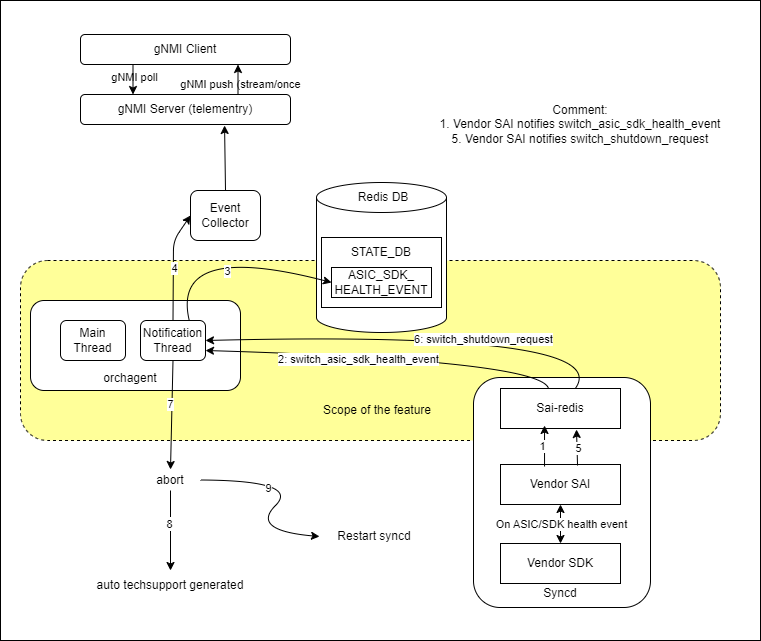
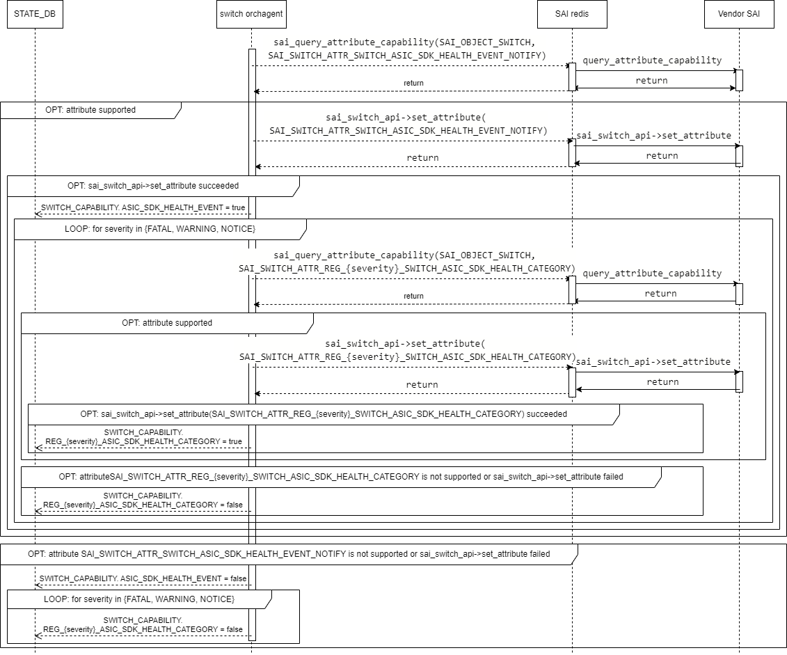
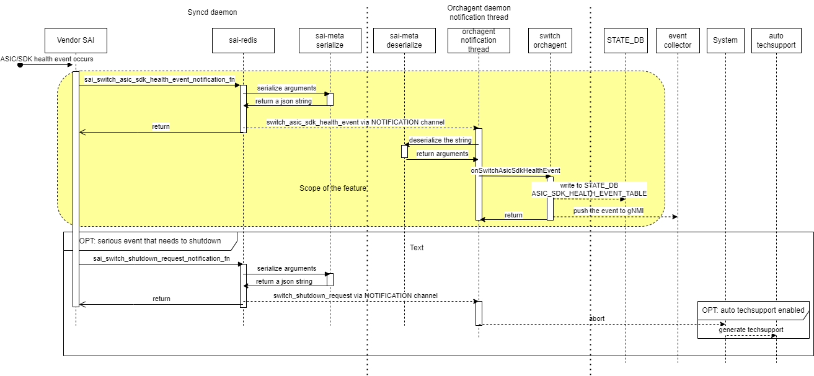
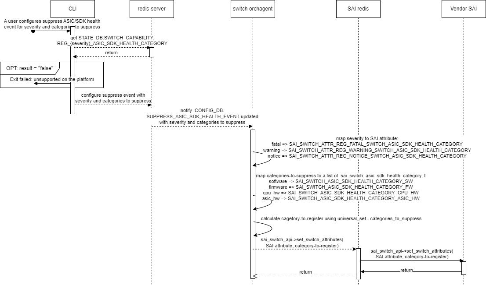

# Handle ASIC/SDK health event #

## Table of Content

### Revision

| Rev |     Date    |       Author       | Change Description                |
|:---:|:-----------:|:------------------:|-----------------------------------|
| 0.1 | Oct 23, 2023 | Stephen Sun | Initial version |
| 0.2 | Nov 17, 2023 | Stephen Sun | Fix internal review comments |
| 0.3 | Dec 11, 2023 | Stephen Sun | Adjust for multi ASIC platform according to the common pratice in the community |
| 0.4 | Jan 05, 2023 | Stephen Sun | Address community review comments |
| 0.5 | Jan 11, 2023 | Stephen Sun | Minor adjustments in CLI |

### Scope

This document describes the high level design of handle ASIC/SDK health event framework in SONiC.

### Definitions/Abbreviations

| Name | Meaning |
|:----:|:-------:|
| ASIC/SDK health event | Health event is a way for SAI to inform NOS about HW/SW health issues. Usually they are not directly caused by a SAI API call. |
|| An ASIC/SDK health event is described using `severity`, `category`, `timestamp`, `description`. |
|| For multi ASIC system it also includes `asic name`. |
| severity of an ASIC/SDK health event | one of `fatal`, `warning`, and `notice`, which represents how severe the event is |
| category of an ASIC/SDK health event | one of `software`, `firmware`, `cpu_hw`, `asic_hw`, which usually represents the component from which the event is detected |

### Overview

A way for syncd to notify orchagent an ASIC/SDK health event before asking orchagent to shutdown is introduced in this document.

For most of ethernet switches, the switch ASIC is the core component in the system. It is very important to identify a switch ASIC is in a failure state and report such event to NOS.

Currently, such failure is detected by SDK/FW on most of platforms. A vendor SAI notifies orchagent to shutdown using `switch_shutdown_request` notification when it detects an ASIC/SDK internal error. Usually, the vendor SAI prints log message before calling shutdown API.

Orchagent can abort itself if a SAI API call fails, usually due to a bad arguments, and can not be recovered. From a customer's perspective of view, this can be distinguished from the ASIC/SDK health event only by analyzing the log message.

The current implementation has the following limitations:

- It is difficult for a customer to understand what occured on SAI and below or distinguish an SDK/FW internal error from a SAI API call. Even a customer can analyze the issue using the log message, it is not intuitive.
- It is unable to notify an ASIC/FW/SDK event if the event is less serious to ask for shutdown.
- It is unable for telementry agent to collect such information.

In this design, we will introduce a new way to address the limitations.

### Requirements

This section list out all the requirements for the HLD coverage and exemptions (not supported) if any for this design.

1. Capabilities
    1. A vendor SAI should expose the corresponding SAI switch attributes if it supports ASIC/SDK health event so that orchagent can fetch them using `sai_query_attribute_capability`
    2. Orchagent shall not set any SAI switch attributes that is not supported by the vendor SAI.
2. For any vendor SAI who supports the feature, it shall notify a `switch_asic_sdk_health_event` when it detects a HW/SW health issues.
    1. If the issue is serious enough to shutdown the switch, the vendor SAI shall notify `switch_asic_sdk_health_event` before `switch_shutdown_request`
    2. Otherwise, the vendor SAI will not notify `switch_shutdown_request`.
3. On receiving an ASIC/SDK health event, the orchagent shall
    1. Extract data from the event (severity, timestamp, description) and push data to the STATE_DB table using timestamp and date as a key
    2. Report the event to gNMI server using the event collect mechanism
4. CLI commands shall be provided to display or clear all the ASIC/SDK health events in the STATE_DB
5. A CLI command shall be provided for a customer
    1. to suppress a certain type of ASIC/SDK health event on a certain severity.
    2. to eliminate old ASIC/SDK health events in the database in order to avoid consuming too much resource.
6. ASIC/SDK health events should be collected in `show techsupport` as an independent file in `dump`.

### Architecture Design

The current architecture is not changed in this design.

### High-Level Design



A mechanism to handle an SDK/FW internal events is enhanced in the following way in this design.

- Orchagent registers a notification handler of `switch_asic_sdk_health_event` to SAI during system initialization for all severities.
  - Capabilities will be fetched ahead of registering the event and exposed to `STATE_DB`.
  - A user can suppress the events that he/she is not interested in by severity and category using configuration.
- A vendor SAI notifies orchagent an ASIC/SDK event using `switch_asic_sdk_health_event` notification with corresponding arguments when it detects an HW/SW issue.
  - The orchagent stores the information of the ASIC/SDK health event into database and pushes it to gNMI server using event collector mechanism.
- The vendor SAI notifies orchagent to shutdown using `switch_shutdown_request` notification if the event is seriously enough.
    Orchagent will abort on receiving the notification.
  - Otherwise, `switch_shutdown_request` will not be sent and system continues to run.
- The ASIC/SDK health events stored in `STATE_DB.ASIC_SDK_HEALTH_EVENT_TABLE` can be displayed or cleared using CLI commands.

The `timestamp`, `severity`, and `category` are represented in various components.

The `timestamp` is converted to format "%Y-%m-%d %H:%M:%S" which is a walltime based on the timezone in `swss` docker container.

The `severity` is mapped between each other according to the next table:

| represention in SONiC | Enumerate in SAI headers | SAI attribute to register corresponding eventa |
|:---:|:---:|:---:|
| fatal | SAI_SWITCH_ASIC_SDK_HEALTH_SEVERITY_FATAL | SAI_SWITCH_ATTR_REG_FATAL_SWITCH_ASIC_SDK_HEALTH_CATEGORY |
| warning | SAI_SWITCH_ASIC_SDK_HEALTH_SEVERITY_WARNING | SAI_SWITCH_ATTR_REG_WARNING_SWITCH_ASIC_SDK_HEALTH_CATEGORY |
| notice | SAI_SWITCH_ASIC_SDK_HEALTH_SEVERITY_NOTICE | SAI_SWITCH_ATTR_REG_NOTICE_SWITCH_ASIC_SDK_HEALTH_CATEGORY |

The `category` is mapped between each other according to the next table:

| represention in SONiC | Enumerate in SAI headers |
|:---:|:---:|
| software | SAI_SWITCH_ASIC_SDK_HEALTH_CATEGORY_SW |
| firmware | SAI_SWITCH_ASIC_SDK_HEALTH_CATEGORY_FW |
| cpu_hw | SAI_SWITCH_ASIC_SDK_HEALTH_CATEGORY_CPU_HW |
| asic_hw | SAI_SWITCH_ASIC_SDK_HEALTH_CATEGORY_ASIC_HW |

This is a built-in SONiC feature implemented in the following sub-modules

- sonic-swss, which handles SAI notification, storing it into database and pushing it into gNMI server
- sonic-sairedis, which transmits the ASIC/SDK health events reported by vendor SAI to orchagent
- sonic-utilities, in which the CLI to display and clear ASIC/SDK health events and configure suppress ASIC/SDK health events are implemented
- sonic-buildimage, in which the new yang models for the new events are defined

#### DB changes

##### STATE_DB change

###### Table ASIC_SDK_HEALTH_EVENT_TABLE

Table `ASIC_SDK_HEALTH_EVENT_TABLE` contains the ASIC/SDK health events information.

```text
key           =  ASIC_SDK_HEALTH_EVENT_TABLE:timestamp_string       ; "%Y-%m-%d %H:%M:%S", full-date and partial-time separated by white space.
                                                                    ; Example: 2022-09-12 09:39:19
severity      = "fatal" | "warning" | "notice"
category      = "software" | "firmware" | "cpu_hw" | "asic_hw"
description   = 1*255VCHAR                                          ; ASIC/SDK health event's description text
```

###### Table SWITCH_CAPABILITY

Table `SWITCH_CAPABILITY` is not a new table. It has been designed to represent various switch object capabilities supported on the platform.

The following fields will be introduced in this design.

```text
ASIC_SDK_HEALTH_EVENT                   = "true" | "false"      ; whether SAI attribute SAI_SWITCH_ATTR_SWITCH_ASIC_SDK_HEALTH_EVENT_NOTIFY is supported
REG_FATAL_ASIC_SDK_HEALTH_CATEGORY      = "true" | "false"      ; whether SAI attribute SAI_SWITCH_ATTR_REG_FATAL_SWITCH_ASIC_SDK_HEALTH_CATEGORY is supported
REG_WARNING_ASIC_SDK_HEALTH_CATEGORY    = "true" | "false"      ; whether SAI attribute SAI_SWITCH_ATTR_REG_WARNING_SWITCH_ASIC_SDK_HEALTH_CATEGORY is supported
REG_NOTICE_ASIC_SDK_HEALTH_CATEGORY     = "true" | "false"      ; whether SAI attribute SAI_SWITCH_ATTR_REG_NOTICE_SWITCH_ASIC_SDK_HEALTH_CATEGORY is supported
```

### SAI API

There is no new SAI API introduced nor changed.

The following SAI attributes of switch object defined in `SAI/inc/saiswitch.h` are used in this document.

```C
    /**
     * @brief Health notification callback function passed to the adapter.
     *
     * Use sai_switch_asic_sdk_health_event_notification_fn as notification function.
     *
     * @type sai_pointer_t sai_switch_asic_sdk_health_event_notification_fn
     * @flags CREATE_AND_SET
     * @default NULL
     */
    SAI_SWITCH_ATTR_SWITCH_ASIC_SDK_HEALTH_EVENT_NOTIFY,

    /**
     * @brief Registration for health fatal categories.
     *
     * For specifying categories of causes for severity fatal events
     *
     * @type sai_s32_list_t sai_switch_asic_sdk_health_category_t
     * @flags CREATE_AND_SET
     * @default empty
     */
    SAI_SWITCH_ATTR_REG_FATAL_SWITCH_ASIC_SDK_HEALTH_CATEGORY,

    /**
     * @brief Registration for health warning categories.
     *
     * For specifying categories of causes for severity warning events
     *
     * @type sai_s32_list_t sai_switch_asic_sdk_health_category_t
     * @flags CREATE_AND_SET
     * @default empty
     */
    SAI_SWITCH_ATTR_REG_WARNING_SWITCH_ASIC_SDK_HEALTH_CATEGORY,

    /**
     * @brief Registration for health notice categories.
     *
     * For specifying categories of causes for severity notice events
     *
     * @type sai_s32_list_t sai_switch_asic_sdk_health_category_t
     * @flags CREATE_AND_SET
     * @default empty
     */
    SAI_SWITCH_ATTR_REG_NOTICE_SWITCH_ASIC_SDK_HEALTH_CATEGORY,
```

The following type definitions for the SAI attributes defined in `SAI/inc/saiswitch.h` are used in this document.

``` C
/**
 * @brief Switch health event severity
 */
typedef enum _sai_switch_asic_sdk_health_severity_t
{
    /** Switch event severity fatal */
    SAI_SWITCH_ASIC_SDK_HEALTH_SEVERITY_FATAL,

    /** Switch event severity warning */
    SAI_SWITCH_ASIC_SDK_HEALTH_SEVERITY_WARNING,

    /** Switch event severity notice */
    SAI_SWITCH_ASIC_SDK_HEALTH_SEVERITY_NOTICE

} sai_switch_asic_sdk_health_severity_t;

/**
 * @brief Switch health categories
 */
typedef enum _sai_switch_asic_sdk_health_category_t
{
    /** Switch health software category */
    SAI_SWITCH_ASIC_SDK_HEALTH_CATEGORY_SW,

    /** Switch health firmware category */
    SAI_SWITCH_ASIC_SDK_HEALTH_CATEGORY_FW,

    /** Switch health cpu hardware category */
    SAI_SWITCH_ASIC_SDK_HEALTH_CATEGORY_CPU_HW,

    /** Switch health ASIC hardware category */
    SAI_SWITCH_ASIC_SDK_HEALTH_CATEGORY_ASIC_HW

} sai_switch_asic_sdk_health_category_t;

/**
 * @brief Switch health event callback
 *
 * @objects switch_id SAI_OBJECT_TYPE_SWITCH
 *
 * @param[in] switch_id Switch Id
 * @param[in] severity Health event severity
 * @param[in] timestamp Time and date of receiving the SDK Health event
 * @param[in] category Category of cause
 * @param[in] data Data of switch health
 * @param[in] description JSON-encoded description string with information delivered from SDK event/trap
 * Example of a possible description:
 * {
 *    "switch_id": "0x00000000000000AB",
 *    "severity": "2",
 *    "timestamp": {
 *        "tv_sec": "22429",
 *        "tv_nsec": "3428724"
 *    },
 *    "category": "3",
 *    "data": {
 *        data_type: "0"
 *    },
 *    "additional_data": "Some additional information"
 * }
 */

typedef void (*sai_switch_asic_sdk_health_event_notification_fn)(
        _In_ sai_object_id_t switch_id,
        _In_ sai_switch_asic_sdk_health_severity_t severity,
        _In_ sai_timespec_t timestamp,
        _In_ sai_switch_asic_sdk_health_category_t category,
        _In_ sai_switch_health_data_t data,
        _In_ const sai_u8_list_t description);

```

The following type definitions for the SAI attributes defined in `SAI/inc/saitypes.h` are used in this document.

```C
typedef enum _sai_health_data_type_t
{
    /** General health data type */
    SAI_HEALTH_DATA_TYPE_GENERAL
} sai_health_data_type_t;

typedef struct _sai_switch_health_data_t
{
    /** Type of switch health data */
    sai_health_data_type_t data_type;

} sai_switch_health_data_t;
```

### Configuration and management

#### Manifest (if the feature is an Application Extension)

N/A.

#### CLI Enhancements

##### Configure suppress ASIC/SDK health events by severity and category

Command `config asic-sdk-health-event suppress <severity> [<--category-list> <category-list>|<none>|<all>] [<--max-events> <max-events>] [<--namespace|-n> <namespace>]` is introduced for a customer to configure:

- the categories that he/she wants to suppress for a certain severity.
- the maximum number of ASIC/SDK health events to be stored in `STATE_DB.ASIC_SDK_HEALTH_EVENT_TABLE`.

The severity can be one of `fatal`, `warning`, and `notice`.

The category-list is a list whose elements are one of `software`, `firmware`, `cpu_hw`, `asic_hw` separated by a comma. The order does not matter.

- If the category-list is `none`, none category is suppressed and all the categories will be notified for `severity` and the field `categories` will be removed.
- If the category-list is `all`, all the categories are suppressed and none category will be notified for `severity` and the field `catetories` is a list of all categories.

The max-events is a number, which represents the maximum number of events the customer wants to store in the database.

- If the max-events is `0`, all events of that severity will be stored in the database and the field `max_events` will be removed.

If neither `category-list` nor `max-events` exists, the entry will be removed from `CONFIG_DB.SUPPRESS_ASIC_SDK_HEALTH_EVENT`.

The namespace is an option for multi ASIC platforms only.

If a non-zero `max-events` is configured, the system will remove the oldest events of each severity every 1 hour.

If a `category-list` is configured, the ASIC/SDK health events whose `category` is in `category-list` with the `severity` will not be reported by the vendor SAI once the corresponding SAI attributes are set.
But the events that were reported after the command is executed but before the SAI attributes are set will be handled by orchagent and pushed into `STATE_DB.ASIC_SDK_HEALTH_EVENT_TABLE` as usual.

Eg 1. the following command will suppress `notice` events with category `asic_hw` and `cpu_hw`:

`config asic-sdk-health-event suppress notice --category-list asic_hw,cpu_hw`

After that, the ASIC/SDK health events whose `category` is one of `asic_hw` and `cpu_hw` and `severity` is `notice` will not be reported.

Eg 2. the following command will configure maxinum number of events of `notice` to '10240`:

`config asic-sdk-health-event suppress notice --max-events 10240`

After that, only the most-recently-received 10240 ASIC/SDK health events will be stored in the `STATE_DB.ASIC_SDK_HEALTH_EVENT_TABLE`. All the older entries will be removed.

The following error message will be shown if a customer configures it on a platform that does not support it.

`ASIC/SDK health event is not supported on the platform`

The following error message will be shown if a customer suppresses a severity which is not supported on the platform.

`Suppressing ASIC/SDK health {severity} event is not supported on the platform`

##### Display the ASIC/SDK health events

Command `show asic-sdk-health-event received [<--namespace|-n> <namespace>]` is introduced to display the ASIC/SDK health events as a table.
An example of the output is as below:

The namespace is an option for multi ASIC platforms only.

```
admin@sonic:~$ show asic-sdk-health-event received
Time                 Severity     Category   Description
-------------------  -----------  ---------  -----------------
2023-10-20 05:07:34  fatal        firmware   Command timeout
2023-10-20 03:06:25  fatal        software   SDK daemon keep alive failed
2023-10-20 05:07:34  fatal        asic_hw    Uncorrectable ECC error
2023-10-20 01:58:43  notice       asic_hw    Correctable ECC error
```

An example of the output on a multi ASIC system:

```
admin@sonic:~$ show asic-sdk-health-event received
asic0:
Time                 Severity     Category   Description
-------------------  -----------  ---------  -----------------
2023-10-20 05:07:34  fatal        firmware   Command timeout
2023-10-20 03:06:25  fatal        software   SDK daemon keep alive failed
asic1:
Time                 Severity     Category   Description
-------------------  -----------  ---------  -----------------
2023-10-20 05:07:34  fatal        asic_hw    Uncorrectable ECC error
2023-10-20 01:58:43  notice       asic_hw    Correctable ECC error
```

The following error message will be shown if a customer executes the command on a platform that does not support it.

`ASIC/SDK health event is not supported on the platform`

##### Display the ASIC/SDK health suppress configuration

Command `show asic-sdk-health-event suppress-configuration [<--namespace|-n> <namespace>]` is introduced to display the suppressed categories of each severity of ASIC/SDK health events or the maximum events to store in the database.

Only severities that have been configured will be displayed.

- if only category-list is configured, the maximum events will be displayed as `unlimited`
- if only maximum events is configured, the category-list will be displayed as `none`
- if neither of above is configured, the severity will not be displayed

An example of the output is as below:

The namespace is an option for multi ASIC platforms only.

```
admin@sonic:~$ show asic-sdk-health-event suppressed-category-list
Severity    Suppressed category-list    Max events
----------  --------------------------  ------------
fatal       software                    unlimited
notice      none                        1024
warning     firmware,asic_hw            10240
```

An example of the output on a multi ASIC system:
```
admin@sonic:~$ show asic-sdk-health-event suppressed-category-list
asic0:
Severity    Suppressed category-list    Max events
----------  --------------------------  ------------
warning     firmware,asic_hw            10240
asic1:
Severity    Suppressed category-list    Max events
----------  --------------------------  ------------
notice      none                        1024
```

The following error message will be shown if a customer executes the command on a platform that does not support it.

`ASIC/SDK health event is not supported on the platform`

##### Clear the ASIC/SDK health events

Command `sonic-clear asic-sdk-health-events [<--namespace|-n> <namespace>]` is introduced to clear the ASIC/SDK health events stored in `STATE_DB.ASIC_SDK_HEALTH_EVENT_TABLE`.

The namespace is an option for multi ASIC platforms only.

After the command is executed, all items in `STATE_DB.ASIC_SDK_HEALTH_EVENT_TABLE` will be cleared.

#### YANG model Enhancements

##### YANG model of the suppress ASIC/SDK health event configuration

The following YANG model is introduced for the suppress ASIC/SDK health event

```text
    container sonic-suppress-asic-sdk-health-event {
        container SUPPRESS_ASIC_SDK_HEALTH_EVENT {
            list SUPPRESS_ASIC_SDK_HEALTH_EVENT_LIST {
                key "severity";

                leaf severity {
                    type enumeration {
                        enum fatal;
                        enum warning;
                        enum notice;
                    }
                    description "Severity of the ASIC/SDK health event";
                }

                leaf max_events {
                    type uint32;
                }

                leaf-list categories {
                    mandatory true;
                    type enumeration {
                        enum software;
                        enum firmware;
                        enum cpu_hw;
                        enum asic_hw;
                    }
                    description "Category of the ASIC/SDK health event";
                }
            }
        }
    }

```

##### YANG model of the ASIC/SDK health event

The following YANG model is introduced for ASIC/SDK health event.

A `sai_timestamp` is provided on top of `timestamp` which is provided by the event collect mechanism since they differ.

```text
    container sonic-events-swss {
        container asic-sdk-health-event {
            evtcmn:ALARM_SEVERITY_MAJOR;
            description "Declares an event for ASIC/SDK health event.";
            leaf sai_timestamp {
                type string {
                    pattern '[0-9]{4}-[0-9]{2}-[0-9]{2} [0-9]{2}:[0-9]{2}:[0-9]{2}';
                }
            }
            leaf asic_name {
                type string {
                    pattern 'asic[0-9]{1,2}';
                }
            }
            leaf severity {
                type enumeration {
                    enum fatal;
                    enum warning;
                    enum notice;
                }
            }
            leaf category {
                type enumeration {
                    enum software;
                    enum firmware;
                    enum cpu_hw;
                    enum asic_hw;
                }
            }
            leaf description {
                type string;
            }
        }
    }
```

#### Config DB Enhancements

Table `SUPPRESS_ASIC_SDK_HEALTH_EVENT` contains

1. the list of categories of ASIC/SDK health events that a user wants to suppress for a certain severity.
2. the number of events of each severity a user wants to keep

```text
key         = SUPPRESS_ASIC_SDK_HEALTH_EVENT:<severity>         ; severity can be one of fatal, warning or notice
categories  = <software|firmware|cpu_hw|asic_hw>{,<software|firmware|cpu_hw|asic_hw>}
                                                                ; a list whose element can be one of software, firmware, cpu_hw, asic_hw separated by a comma
max_events = 1*10DIGIT                                          ; the number of events for a severity a user wants to keep.
                                                                ; If there are more events than max_events in the database, the older ones will be removed.
```

#### Flows

##### Register ASIC/SDK health event handler during system initialization

We leverage the existing framework to register the ASIC/SDK health event handler.

Various events can occur when a switch system is running, which requires orchagent, upper layer application or protocol to handle. Currently, this has been done by using event handlers. There is a dedicated event handler defined as an attribute of switch object for each event that needs to be handled.

Currently, there are following event handlers defined.

| Attribute name | Event |
|:---:|:---:|
| SAI_SWITCH_ATTR_SWITCH_STATE_CHANGE_NOTIFY | Switch state change |
| SAI_SWITCH_ATTR_SHUTDOWN_REQUEST_NOTIFY | Shutdown a switch |
| SAI_SWITCH_ATTR_FDB_EVENT_NOTIFY | FDB event |
| SAI_SWITCH_ATTR_NAT_EVENT_NOTIFY | NAT entry event |
| SAI_SWITCH_ATTR_PORT_STATE_CHANGE_NOTIFY | Port state change |
| SAI_SWITCH_ATTR_QUEUE_PFC_DEADLOCK_NOTIFY | PFC watchdog |
| SAI_SWITCH_ATTR_BFD_SESSION_STATE_CHANGE_NOTIFY | BFD session state change |

These events can be handled in different ways. Eg. `Shutdown a switch` event is handled directly in the event handler. For other events, the event handler is empty and the real logic is handled in orchagent main thread using `NotificationConsumer`.

To handle ASIC/SDK health event, a new event handler should be implemented and registered as below.
The ASIC/SDK health event will be handled in the event handler, which is the same way as `Shutdown a switch`. This is because we need to guarantee that `ASIC/SDK health` will always be handled before `shutdown a switch`, otherwise the information can be lost.

| Attribute name | Event | Callback prototype |
|:---:|:---:|:---:|
| SAI_SWITCH_ATTR_SWITCH_ASIC_SDK_HEALTH_EVENT_NOTIFY | ASIC/SDK health event handler | sai_switch_asic_sdk_health_event_notification_fn |

The following SAI attributes of switch object should also be specified, indicating ASIC/SDK health event of all categories and severities will be notified.

| Attribute name | Meaning | Value |
|:---:|:---:|:---:|
| SAI_SWITCH_ATTR_REG_FATAL_SWITCH_ASIC_SDK_HEALTH_CATEGORY | The categories of fatal severity | firmware, software, cpu_hw, asic_hw |
| SAI_SWITCH_ATTR_REG_WARNING_SWITCH_ASIC_SDK_HEALTH_CATEGORY | The categories of warning severity | firmware, software, cpu_hw, asic_hw |
| SAI_SWITCH_ATTR_REG_NOTICE_SWITCH_ASIC_SDK_HEALTH_CATEGORY | The categories of notice severity | firmware, software, cpu_hw, asic_hw |

The initialize flow is:

1. Fetch capability of `SAI_SWITCH_ATTR_SWITCH_ASIC_SDK_HEALTH_EVENT_NOTIFY` using `sai_query_attribute_capability`
2. If it is supported, set the attribute using `sai_switch_api->set_switch_attribute` with corresponding callback.
3. If it is not supported or failed to set, expose the following fields to `STATE_DB.SWITCH_CAPABILITY` table as `false` and flow finishes.
   - ASIC_SDK_HEALTH_EVENT
   - REG_FATAL_ASIC_SDK_HEALTH_CATEGORY
   - REG_WARNING_ASIC_SDK_HEALTH_CATEGORY
   - REG_NOTICE_ASIC_SDK_HEALTH_CATEGORY

4. For each severity in {FATAL, WARNING, NOTICE}, fetch the capability of the SAI switch attribute `REG_{severity}_ASIC_SDK_HEALTH_CATEGORY` using `sai_query_attribute_capability`
   1. If it is supported, set the attribute using `sai_switch_api->set_switch_attribute` with all categories (firmware, software, cpu_hw, asic_hw).
   2. If it is supported and succeeded to set, expose corresponding field `REG_{severity}_ASIC_SDK_HEALTH_CATEGORY` as `true`. Otherwise, expose it as `false`
 


##### Handle ASIC/SDK health event

The flow to handle ASIC/SDK health event is as below. The steps 1~3 are introduced in this HLD and the rest steps already existed.

1. A vendor SAI calls the stored callback function `sai_switch_asic_sdk_health_event_notification_fn` with arguments `timestamp`, `severity`, `category`, and `description` when it detects a HW/SW health issue.
2. Sai redis handles the ASIC/SDK health event, exacts the information, serializes it and then notifies orchagent using `switch_asic_sdk_health_event`.
3. Orchagent handles the sai redis notification
    1. arguments `timestamp`, `severity`, and `category` are translated to corresponding representations in SONiC.
    2. pushes the information to `STATE_DB.ASIC_SDK_HEALTH_EVENT_TABLE` with timestamp being the key of the table
    3. publishes the information to gNMI using event collect mechanism
    4. prints a syslog message: `[<severity>] ASIC/SDK health event occurred at <timestamp>, [asic <asic name>, ]category <category>: <description>`
        - the severity of the message is `NOTICE`
        - `<severity>`, `<timestamp>`, `<category>` and `<description>` are translated from the event
        - `asic <asic name>` is printed only for multi ASIC system. The `asic name` is `CONFIG_DB|DEVICE_METADATA|localhost.asic_name`.
4. The flow finishes if the vendor SAI decides not to ask orchagent to shutdown.

   Usually, vendor SAI does not need to ask orchagent to shutdown switch on receiving an ASIC/SDK health event with `NOTICE` severity.
5. The vendor SAI calls stored callback function `sai_switch_shutdown_request_notification_fn`
6. Sai redis notifies orchagent using `switch_shutdown_request`
7. Orchagent calls `abort` on receiving `switch_shutdown_request`
8. The core dump of orchagent is generated on receiving SIGABRT.

   The tech support dump is collected automatically as a result of coredump if auto techsupport is enabled both globally and for swss.
9. The swss and syncd service stopped and then restarted as the result of orchagent aborted.



##### Handle suppress ASIC/SDK health event configuration

A user can suppress the ASIC/SDK health events by severity match certain using configuration.

Once user configures the category, and severity to suppress, orchagent will deregister them from SAI using corresponding SAI attribute.
The events that have been notified by SAI before the SAI attributes are updated will be handled by orchagent and pushed into `STATE_DB.ASIC_SDK_HEALTH_EVENT_TABLE` as usual.

The flow to handle suppress ASIC/SDK health event configuration is as below:

1. CLI parses, validate user input
2. If the corresponding attribute is not supported according to `STATE_DB.ASIC_SDK_HEALTH_EVENT_TABLE` table, print an error and flow finishes.
3. Push the new value into `CONFIG_DB.SUPPRESS_ASIC_SDK_HEALTH_EVENT`
4. Switch orchagent receives notification of table update, and then translates severity and category list into corresponding SAI attribute and enumurations
    - severity mapping:
        - fatal: SAI_SWITCH_ATTR_REG_FATAL_SWITCH_ASIC_SDK_HEALTH_CATEGORY
        - warning: SAI_SWITCH_ATTR_REG_WARNING_SWITCH_ASIC_SDK_HEALTH_CATEGORY
        - notice: SAI_SWITCH_ATTR_REG_NOTICE_SWITCH_ASIC_SDK_HEALTH_CATEGORY
    - category mapping:
        - software: SAI_SWITCH_ASIC_SDK_HEALTH_CATEGORY_SW
        - firmware: SAI_SWITCH_ASIC_SDK_HEALTH_CATEGORY_FW
        - cpu_hw: SAI_SWITCH_ASIC_SDK_HEALTH_CATEGORY_CPU_HW
        - asic_hw: SAI_SWITCH_ASIC_SDK_HEALTH_CATEGORY_ASIC_HW
5. The categories to register ASIC/SDK health event for the `severity` is the completionary set of categories to be suppressed with the universal map containing all defined categories.
6. Switch orchagent calls SAI API `sai_switch_api->set_attribute` with corresponding `severity` and `categories to register event` as arguments.
7. SAI redis receives the call, validates the arguments, and then call vendor SAI's API.



##### Eliminate oldest events from the database

A user can configure the maximum number of events of each severity. The system will check `STATE_DB.ASIC_SDK_HEALTH_EVENT_TABLE` every 1 hour, and remove the oldest entries of a severity if it exceeds the threshold.

As it requires frequent communitcate with redis server, a Lua plugin will be introduced to do this job.
The Lua plugin will be loaded during system intialization, and check the number of entries in `STATE_DB.ASIC_SDK_HEALTH_EVENT_TABLE`, and remove the old entries every 1 hour.

The flow is as below:

1. Check whether `max_events` is configured and exit the flow if it is not configured for any severity.
2. Check the events in `STATE_DB.ASIC_SDK_HEALTH_EVENT_TABLE` and exit the flow if the number of events does not exceed the threshold.
3. Sort the events by time and remove the oldest events.

##### Add ASIC/SDK health event to `show asic-sdk-health-event received` to show techsupport

The command `show asic-sdk-health-event received` will be invoked during collecting techsupport dump.

A file `asic-sdk-health-event` will contain all the ASIC/SDK health events and be saved in `dump` folder of the techsupport dump.

### Warmboot and Fastboot Design Impact

It does not impact warm boot nor fast boot.

### Memory Consumption
This sub-section covers the memory consumption analysis for the new feature: no memory consumption is expected when the feature is disabled via compilation and no growing memory consumption while feature is disabled by configuration.
### Restrictions/Limitations

### Testing Requirements/Design
Explain what kind of unit testing, system testing, regression testing, warmboot/fastboot testing, etc.,
Ensure that the existing warmboot/fastboot requirements are met. For example, if the current warmboot feature expects maximum of 1 second or zero second data disruption, the same should be met even after the new feature/enhancement is implemented. Explain the same here.
Example sub-sections for unit test cases and system test cases are given below.

#### Unit Test cases

##### sonic-swss

1. Configure suppress all categories for a severity, and then check whether empty list has been set on the SAI attribute.
2. Configure suppress none categories for a severity, and then check whether all categories have been set on the SAI attribute.
3. Configure suppress part of the categories (eg. software, cpu_hw), and then check whether corresponding categories have been set on the SAI attribute.
4. Check whether the capabilities have been exposed to `STATE_DB.SWITCH_CAPABILITY|switch` correctly.
5. Check whether mocked event has been correctly handled.

##### sonic-sairedis

1. Check whether ASIC/SDK health event handler is correctly registered.
2. Check whether an instance of ASIC/SDK health event notification handler class is correctly created based on the notification string.
3. Check whether an ASIC/SDK health event is correctly serialized and then deserialized.

##### sonic-utilities

1. Check whether `CONFIG_DB.SUPPRESS_ASIC_SDK_HEALTH_EVENT` table is correctly updated based on CLI input.
2. Check whether `show asic-sdk-health-event received` correctly displays the information based on the `STATE_DB.ASIC_SDK_HEALTH_EVENT_TABLE`.
3. Check whether `show asic-sdk-health-event suppressed-category-list` correctly displays the configuration based on the `CONFIG_DB.SUPPRESS_ASIC_SDK_HEALTH_EVENT`.
4. Check whether the information in `STATE_DB.ASIC_SDK_HEALTH_EVENT_TABLE` has been cleared by executing `sonic-clear asic-sdk-health-event`.

#### System Test cases

TBD

### Open/Action items - if any 

### Appendix

#### Why ASIC/SDK health events are handled in notifications

The `main thread` in orchagent handles table updates.
There is a `dedicated thread` handling NOTIFICATIONS in orchagent daemon. The entrypoint is `RedisChannel::notificationThreadFunction`. All the notification callbacks defined in https://github.com/sonic-net/sonic-swss/blob/master/orchagent/notifications.cpp are called from that thread.

Nowadays almost all callbacks in that file are NOP except on_switch_shutdown_request which calls `exit` terminating the daemon.
The rest callbacks are handled using `NotificationConsumer` in the `main thread` in orchagent.

If the callback `on_switch_asic_sdk_health_event` is called from the `main thread` using NotificationConsumer, it is handled from a different thread than `on_switch_shutdown_request`.
In this case, even vendor SAI always sends ASIC/SDK health event ahead of shutdown request, it’s possible that the `dedicated thread` is scheduled to run ahead of the `main thread`. As a result, the `on_switch_shutdown_request` can be called before `on_switch_asic_sdk_health_event` is called and OA will shutdown without ASIC/SDK health event handled and saved.

If we handle shut down request in the main thread, it can result in the same situation. Eg. if something is wrong in ASIC/SDK which makes it unable to handle any SAI API calls:

1. It notifies ASIC/SDK health event and then shutdown request
2. At the same time, there are a large number of table updates, let’s say routing entry update, to be programmed to SAI.
3. Both shutdown request and routing entry update are handled in the main thread.
4. If the routing entry update is handled first, SAI can return fail because of ASIC issue. OA will abort immediately without handling ASIC/SDK health event and shutdown request.
5. The ASIC/SDK health event is lost.
