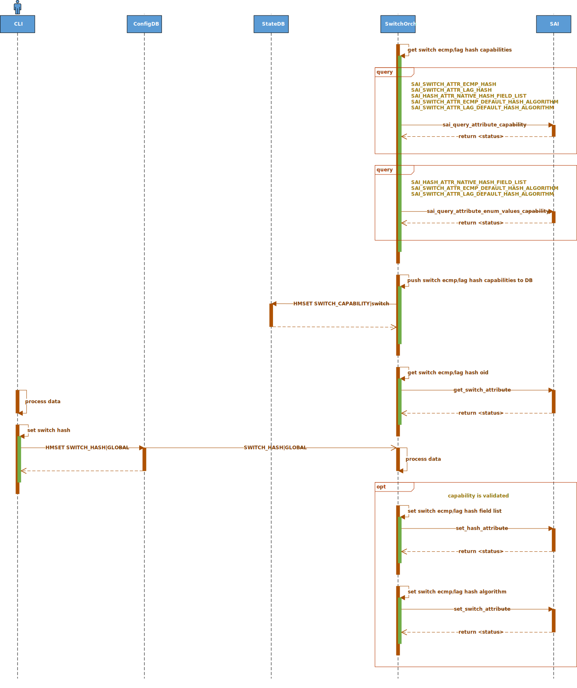

# SONiC Generic Hash

## High Level Design document

## Table of contents

- [Revision](#revision)
- [About this manual](#about-this-manual)
- [Scope](#scope)
- [Abbreviations](#abbreviations)
- [1 Introduction](#1-introduction)
    - [1.1 Feature overview](#11-feature-overview)
    - [1.2 Requirements](#12-requirements)
        - [1.2.1 Functionality](#121-functionality)
        - [1.2.2 Command interface](#122-command-interface)
        - [1.2.3 Error handling](#123-error-handling)
        - [1.2.4 Event logging](#124-event-logging)
- [2 Design](#2-design)
    - [2.1 Overview](#21-overview)
    - [2.2 SAI API](#22-sai-api)
    - [2.3 Orchestration agent](#23-orchestration-agent)
        - [2.3.1 Overview](#231-overview)
        - [2.3.2 Switch orch](#232-switch-orch)
    - [2.4 DB schema](#24-db-schema)
        - [2.4.1 Config DB](#241-config-db)
            - [2.4.1.1 Switch hash](#2411-switch-hash)
        - [2.4.2 State DB](#242-state-db)
            - [2.4.2.1 Switch hash capabilities](#2421-switch-hash-capabilities)
        - [2.4.3 Data sample](#243-data-sample)
        - [2.4.4 Configuration sample](#244-configuration-sample)
        - [2.4.5 Initial configuration](#245-initial-configuration)
    - [2.5 Flows](#25-flows)
        - [2.5.1 Config section](#251-config-section)
            - [2.5.1.1 GH update](#2511-gh-update)
        - [2.5.2 Show section](#252-show-section)
            - [2.5.2.1 GH show](#2521-gh-show)
            - [2.5.2.2 GH show capabilities](#2522-gh-show-capabilities)
    - [2.6 CLI](#26-cli)
        - [2.6.1 Command structure](#261-command-structure)
        - [2.6.2 Usage examples](#262-usage-examples)
            - [2.6.2.1 Config command group](#2621-config-command-group)
            - [2.6.2.2 Show command group](#2622-show-command-group)
    - [2.7 YANG model](#27-yang-model)
    - [2.8 Warm/Fast boot](#28-warmfast-boot)
- [3 Test plan](#3-test-plan)
    - [3.1 Unit tests via VS](#31-unit-tests-via-vs)
    - [3.2 Data plane tests via PTF](#32-data-plane-tests-via-ptf)

## Revision

| Rev | Date       | Author         | Description                                     |
|:---:|:----------:|:--------------:|:------------------------------------------------|
| 0.1 | 12/09/2022 | Nazarii Hnydyn | Initial version                                 |
| 0.2 | 05/12/2022 | Nazarii Hnydyn | Capabilities validation                         |

## About this manual

This document provides general information about GH implementation in SONiC

## Scope

This document describes the high level design of GH feature in SONiC

**In scope:**  
1. ECMP/LAG switch hash configuration

**Out of scope:**  
1. ECMP/LAG switch hash seed configuration
2. ECMP/LAG switch hash algorithm configuration

## Abbreviations

| Term   | Meaning                                   |
|:-------|:------------------------------------------|
| SONiC  | Software for Open Networking in the Cloud |
| GH     | Generic Hash                              |
| ECMP   | Equal-Cost Multi-Path                     |
| LAG    | Link Aggregation Group                    |
| IP     | Internet Protocol                         |
| SAI    | Switch Abstraction Interface              |
| API    | Application Programming Interface         |
| ASIC   | Application-Specific Integrated Circuit   |
| OA     | Orchestration agent                       |
| DB     | Database                                  |
| CLI    | Сommand-line Interface                    |
| YANG   | Yet Another Next Generation               |
| VS     | Virtual Switch                            |
| PTF    | Packet Test Framework                     |

## List of figures

[Figure 1: GH design](#figure-1-gh-design)  
[Figure 2: GH OA design](#figure-2-gh-oa-design)  
[Figure 3: GH update flow](#figure-3-gh-update-flow)  
[Figure 4: GH show flow](#figure-4-gh-show-flow)  
[Figure 5: GH show capabilities flow](#figure-5-gh-show-capabilities-flow)

## List of tables

[Table 1: Frontend event logging](#table-1-frontend-event-logging)  
[Table 2: Backend event logging](#table-2-backend-event-logging)

# 1 Introduction

## 1.1 Feature overview

The hashing algorithm is used to make traffic-forwarding decisions for traffic exiting the switch.  
It makes hashing decisions based on values in various packet fields, as well as on the hash seed value.  
The packet fields used by the hashing algorithm varies by the configuration on the switch.

For ECMP, the hashing algorithm determines how incoming traffic is forwarded to the next-hop device.  
For LAG, the hashing algorithm determines how traffic is placed onto the LAG member links to manage  
bandwidth by evenly load-balancing traffic across the outgoing links.

GH is a feature which allows user to configure which hash fields suppose to be used by hashing algorithm.  
GH provides global switch hash configuration for ECMP and LAG.

## 1.2 Requirements

### 1.2.1 Functionality

**This feature will support the following functionality:**
1. Ethernet packet hashing configuration with inner/outer IP frames
2. Global switch hash configuration for ECMP and LAG
3. Warm/Fast reboot

### 1.2.2 Command interface

**This feature will support the following commands:**
1. config: set switch hash global configuration
2. show: display switch hash global configuration

### 1.2.3 Error handling

#### 1.2.3.1 Frontend

**This feature will provide error handling for the next situations:**
1. Invalid parameter value

#### 1.2.3.2 Backend

**This feature will provide error handling for the next situations:**
1. Missing parameters
2. Invalid parameter value
3. Parameter removal
4. Configuration removal

### 1.2.4 Event logging

#### 1.2.4.1 Frontend

**This feature will provide event logging for the next situations:**
1. Switch hash update

###### Table 1: Frontend event logging

| Event                       | Severity |
|:----------------------------|:---------|
| Switch hash update: success | NOTICE   |
| Switch hash update: error   | ERROR    |

#### 1.2.4.2 Backend

**This feature will provide event logging for the next situations:**
1. Missing parameters
2. Invalid parameter value
3. Parameter value with duplicate items
4. Parameter removal
5. Configuration removal
6. Switch hash update

###### Table 2: Backend event logging

| Event                                | Severity |
|:-------------------------------------|:---------|
| Missing parameters                   | ERROR    |
| Invalid parameter value              | ERROR    |
| Parameter value with duplicate items | WARNING  |
| Parameter removal                    | ERROR    |
| Configuration removal                | ERROR    |
| Switch hash update: success          | NOTICE   |
| Switch hash update: error            | ERROR    |

# 2 Design

## 2.1 Overview


###### Figure 1: GH design

GH will use SAI Hash API to configure user-defined list of hash fields to ASIC.  
Hashing policy can be set independently for ECMP and LAG.

**GH important notes:**
1. According to the SAI Behavioral Model, the hash is calculated on ingress to pipeline
2. SAI configuration of hash fields is applicable to an original packet before any DECAP/ENCAP,
i.e. configuration is tunnel-agnostic
3. If some configured field is not present in an incoming packet, then zero is assumed for hash calculation

## 2.2 SAI API

**SAI native hash fields which shall be used for GH:**

| Field                                   | Comment                                 |
|:----------------------------------------|:----------------------------------------|
| SAI_NATIVE_HASH_FIELD_IN_PORT           | SWITCH_HASH\|GLOBAL\|ecmp_hash/lag_hash |
| SAI_NATIVE_HASH_FIELD_DST_MAC           |                                         |
| SAI_NATIVE_HASH_FIELD_SRC_MAC           |                                         |
| SAI_NATIVE_HASH_FIELD_ETHERTYPE         |                                         |
| SAI_NATIVE_HASH_FIELD_VLAN_ID           |                                         |
| SAI_NATIVE_HASH_FIELD_IP_PROTOCOL       |                                         |
| SAI_NATIVE_HASH_FIELD_DST_IP            |                                         |
| SAI_NATIVE_HASH_FIELD_SRC_IP            |                                         |
| SAI_NATIVE_HASH_FIELD_L4_DST_PORT       |                                         |
| SAI_NATIVE_HASH_FIELD_L4_SRC_PORT       |                                         |
| SAI_NATIVE_HASH_FIELD_INNER_DST_MAC     |                                         |
| SAI_NATIVE_HASH_FIELD_INNER_SRC_MAC     |                                         |
| SAI_NATIVE_HASH_FIELD_INNER_ETHERTYPE   |                                         |
| SAI_NATIVE_HASH_FIELD_INNER_IP_PROTOCOL |                                         |
| SAI_NATIVE_HASH_FIELD_INNER_DST_IP      |                                         |
| SAI_NATIVE_HASH_FIELD_INNER_SRC_IP      |                                         |
| SAI_NATIVE_HASH_FIELD_INNER_L4_DST_PORT |                                         |
| SAI_NATIVE_HASH_FIELD_INNER_L4_SRC_PORT |                                         |

**SAI attributes which shall be used for GH:**

| API    | Function                                   | Attribute                            |
|:-------|:-------------------------------------------|:-------------------------------------|
| OBJECT | sai_query_attribute_capability             | SAI_SWITCH_ATTR_ECMP_HASH            |
|        |                                            | SAI_SWITCH_ATTR_LAG_HASH             |
|        |                                            | SAI_HASH_ATTR_NATIVE_HASH_FIELD_LIST |
|        | sai_query_attribute_enum_values_capability | SAI_HASH_ATTR_NATIVE_HASH_FIELD_LIST |
| SWITCH | get_switch_attribute                       | SAI_SWITCH_ATTR_ECMP_HASH            |
|        |                                            | SAI_SWITCH_ATTR_LAG_HASH             |
| HASH   | set_hash_attribute                         | SAI_HASH_ATTR_NATIVE_HASH_FIELD_LIST |

## 2.3 Orchestration agent

### 2.3.1 Overview


###### Figure 2: GH OA design

The existing `SwitchOrch` class will be extended with a new APIs to implement GH feature.  
OA will be extended with a new GH Config DB schema and SAI Hash API support.  
Switch hash updates will be processed by OA based on Config DB changes.  
Some updates will be handled and some will be considered as invalid.

### 2.3.2 Switch orch

Class `SwitchOrch` holds a set of methods matching generic `Orch` class pattern to handle Config DB updates.  
For that purpose a producer-consumer mechanism (implemented in `sonic-swss-common`) is used.  
Method `SwitchOrch::doTask()` will be called on switch hash update. It will distribute handling  
of DB updates between other handlers based on the table key updated (Redis Keyspace Notifications).

This class is responsible for:
1. Processing updates of switch hash
2. Partial input data validation
3. Replicating data from Config DB to SAI DB via SAI Redis
4. Caching objects in order to handle updates

Switch hash object is stored under `SWITCH_HASH|GLOBAL` key in Config DB. On `SWITCH_HASH` update,  
method `SwitchOrch::doCfgSwitchHashTableTask()` will be called to process the change.  
Regular switch hash update will refresh the internal class structures and appropriate SAI objects.

Switch hash capabilities are stored under `SWITCH_CAPABILITY|switch` key in State DB.  
The vendor specific data is being queried by switch OA on init and pushed to both internal cache and DB.  
Any further switch hash update is being validated using vendor specific hash capabilities.

**Skeleton code:**
```cpp
class SwitchOrch : public Orch
{
    ...

private:
    void doCfgSwitchHashTableTask(Consumer &consumer);
    void doTask(Consumer &consumer);

    // Switch hash
    bool setSwitchHashFieldListSai(sai_object_id_t oid, std::vector<sai_int32_t> &hfList) const;
    bool setSwitchHashEcmpHash(const SwitchHash &hash) const;
    bool setSwitchHashLagHash(const SwitchHash &hash) const;
    bool setSwitchHash(const SwitchHash &hash);

    bool getSwitchHashOidSai(sai_object_id_t &oid, bool isEcmpHashOid) const;
    void getSwitchHashEcmpOid();
    void getSwitchHashLagOid();
    void querySwitchHashDefaults();

    // Switch hash SAI defaults
    struct {
        struct {
            sai_object_id_t oid = SAI_NULL_OBJECT_ID;
        } ecmpHash;
        struct {
            sai_object_id_t oid = SAI_NULL_OBJECT_ID;
        } lagHash;
    } m_switchHashDefaults;

    // Switch OA helper
    SwitchHelper swHlpr;

    ...
};
```

## 2.4 DB schema

### 2.4.1 Config DB

#### 2.4.1.1 Switch hash
```abnf
; defines schema for switch hash configuration attributes
key = SWITCH_HASH|GLOBAL ; switch hash global. Must be unique

; field   = value
ecmp_hash = hash-field-list ; hash fields for hashing packets going through ECMP
lag_hash  = hash-field-list ; hash fields for hashing packets going through LAG

; value annotations
hash-field      = "IN_PORT"
                / "DST_MAC"
                / "SRC_MAC"
                / "ETHERTYPE"
                / "VLAN_ID"
                / "IP_PROTOCOL"
                / "DST_IP"
                / "SRC_IP"
                / "L4_DST_PORT"
                / "L4_SRC_PORT"
                / "INNER_DST_MAC"
                / "INNER_SRC_MAC"
                / "INNER_ETHERTYPE"
                / "INNER_IP_PROTOCOL"
                / "INNER_DST_IP"
                / "INNER_SRC_IP"
                / "INNER_L4_DST_PORT"
                / "INNER_L4_SRC_PORT"
hash-field-list = hash-field [ 1*( "," hash-field ) ]
```

### 2.4.2 State DB

#### 2.4.2.1 Switch hash capabilities
```abnf
; defines schema for switch hash configuration capabilities
key = SWITCH_CAPABILITY|switch ; must be unique

; field                     = value
ECMP_HASH_CAPABLE           = capability-knob ; specifies whether switch is ECMP hash capable
LAG_HASH_CAPABLE            = capability-knob ; specifies whether switch is LAG hash capable
HASH|NATIVE_HASH_FIELD_LIST = hash-field-list ; hash field capabilities for hashing packets going through switch

; value annotations
capability-knob = "true" / "false"
hash-field      = ""
                / "IN_PORT"
                / "DST_MAC"
                / "SRC_MAC"
                / "ETHERTYPE"
                / "VLAN_ID"
                / "IP_PROTOCOL"
                / "DST_IP"
                / "SRC_IP"
                / "L4_DST_PORT"
                / "L4_SRC_PORT"
                / "INNER_DST_MAC"
                / "INNER_SRC_MAC"
                / "INNER_ETHERTYPE"
                / "INNER_IP_PROTOCOL"
                / "INNER_DST_IP"
                / "INNER_SRC_IP"
                / "INNER_L4_DST_PORT"
                / "INNER_L4_SRC_PORT"
hash-field-list = hash-field [ 1*( "," hash-field ) ]
```

### 2.4.3 Data sample

**Config DB:**
```bash
redis-cli -n 4 HGETALL 'SWITCH_HASH|GLOBAL'
1) "ecmp_hash@"
2) "DST_MAC,SRC_MAC,ETHERTYPE,IP_PROTOCOL,DST_IP,SRC_IP,L4_DST_PORT,L4_SRC_PORT, \
INNER_DST_MAC,INNER_SRC_MAC,INNER_ETHERTYPE,INNER_IP_PROTOCOL,INNER_DST_IP,INNER_SRC_IP,INNER_L4_DST_PORT,INNER_L4_SRC_PORT"
3) "lag_hash@"
4) "DST_MAC,SRC_MAC,ETHERTYPE,IP_PROTOCOL,DST_IP,SRC_IP,L4_DST_PORT,L4_SRC_PORT, \
INNER_DST_MAC,INNER_SRC_MAC,INNER_ETHERTYPE,INNER_IP_PROTOCOL,INNER_DST_IP,INNER_SRC_IP,INNER_L4_DST_PORT,INNER_L4_SRC_PORT"
```

**State DB:**
```bash
redis-cli -n 6 HGETALL 'SWITCH_CAPABILITY|switch'
 1) "ECMP_HASH_CAPABLE"
 2) "true"
 3) "LAG_HASH_CAPABLE"
 4) "true"
 5) "HASH|NATIVE_HASH_FIELD_LIST"
 6) "IN_PORT,DST_MAC,SRC_MAC,ETHERTYPE,VLAN_ID,IP_PROTOCOL,DST_IP,SRC_IP,L4_DST_PORT,L4_SRC_PORT, \
INNER_DST_MAC,INNER_SRC_MAC,INNER_ETHERTYPE,INNER_IP_PROTOCOL,INNER_DST_IP,INNER_SRC_IP, \
INNER_L4_DST_PORT,INNER_L4_SRC_PORT"
```

### 2.4.4 Configuration sample

**Outer/Inner frame hashing:**
```json
{
    "SWITCH_HASH": {
        "GLOBAL": {
            "ecmp_hash": [
                "DST_MAC",
                "SRC_MAC",
                "ETHERTYPE",
                "IP_PROTOCOL",
                "DST_IP",
                "SRC_IP",
                "L4_DST_PORT",
                "L4_SRC_PORT",
                "INNER_DST_MAC",
                "INNER_SRC_MAC",
                "INNER_ETHERTYPE",
                "INNER_IP_PROTOCOL",
                "INNER_DST_IP",
                "INNER_SRC_IP",
                "INNER_L4_DST_PORT",
                "INNER_L4_SRC_PORT"
            ],
            "lag_hash": [
                "DST_MAC",
                "SRC_MAC",
                "ETHERTYPE",
                "IP_PROTOCOL",
                "DST_IP",
                "SRC_IP",
                "L4_DST_PORT",
                "L4_SRC_PORT",
                "INNER_DST_MAC",
                "INNER_SRC_MAC",
                "INNER_ETHERTYPE",
                "INNER_IP_PROTOCOL",
                "INNER_DST_IP",
                "INNER_SRC_IP",
                "INNER_L4_DST_PORT",
                "INNER_L4_SRC_PORT"
            ]
        }
    }
}
```

### 2.4.5 Initial configuration

GH initial configuration will be updated at `sonic-buildimage/files/build_templates/init_cfg.json.j2`  
in order to match vendor specific requirements.

**Skeleton code:**
```jinja
{
    ...


    "SWITCH_HASH": {
        "GLOBAL": {
            "ecmp_hash": [
                "DST_IP",
                "SRC_IP",
                "IP_PROTOCOL",
                "L4_DST_PORT",
                "L4_SRC_PORT",
                "INNER_DST_IP",
                "INNER_SRC_IP"
            ],
            "lag_hash": [
                "DST_IP",
                "SRC_IP",
                "IP_PROTOCOL",
                "L4_DST_PORT",
                "L4_SRC_PORT",
                "INNER_DST_IP",
                "INNER_SRC_IP"
            ]
        }
    },


    ...
}
```

## 2.5 Flows

### 2.5.1 Config section

### 2.5.1.1 GH update



###### Figure 3: GH update flow

**Note:**  

The list of available hash fields will be queried by `sai_query_attribute_enum_values_capability` in two steps.  
The first attempt is used to accommodate the target list size after getting `SAI_STATUS_BUFFER_OVERFLOW` return code.  
And the second one is for getting the actual data.

### 2.5.2 Show section

#### 2.5.2.1 GH show


###### Figure 4: GH show flow

#### 2.5.2.2 GH show capabilities


###### Figure 5: GH show capabilities flow

## 2.6 CLI

### 2.6.1 Command structure

**User interface**:
```
config
|--- switch-hash
     |--- global
          |--- ecmp-hash ARGS
          |--- lag-hash ARGS

show
|--- switch-hash
     |--- global
     |--- capabilities
```

### 2.6.2 Usage examples

#### 2.6.2.1 Config command group

**The following command updates switch hash global:**
```bash
config switch-hash global ecmp-hash \
'DST_MAC' \
'SRC_MAC' \
'ETHERTYPE' \
'IP_PROTOCOL' \
'DST_IP' \
'SRC_IP' \
'L4_DST_PORT' \
'L4_SRC_PORT' \
'INNER_DST_MAC' \
'INNER_SRC_MAC' \
'INNER_ETHERTYPE' \
'INNER_IP_PROTOCOL' \
'INNER_DST_IP' \
'INNER_SRC_IP' \
'INNER_L4_DST_PORT' \
'INNER_L4_SRC_PORT'
config switch-hash global lag-hash \
'DST_MAC' \
'SRC_MAC' \
'ETHERTYPE' \
'IP_PROTOCOL' \
'DST_IP' \
'SRC_IP' \
'L4_DST_PORT' \
'L4_SRC_PORT' \
'INNER_DST_MAC' \
'INNER_SRC_MAC' \
'INNER_ETHERTYPE' \
'INNER_IP_PROTOCOL' \
'INNER_DST_IP' \
'INNER_SRC_IP' \
'INNER_L4_DST_PORT' \
'INNER_L4_SRC_PORT'
```

#### 2.6.2.2 Show command group

**The following command shows switch hash global configuration:**
```bash
root@sonic:/home/admin# show switch-hash global
ECMP HASH          LAG HASH
-----------------  -----------------
DST_MAC            DST_MAC
SRC_MAC            SRC_MAC
ETHERTYPE          ETHERTYPE
IP_PROTOCOL        IP_PROTOCOL
DST_IP             DST_IP
SRC_IP             SRC_IP
L4_DST_PORT        L4_DST_PORT
L4_SRC_PORT        L4_SRC_PORT
INNER_DST_MAC      INNER_DST_MAC
INNER_SRC_MAC      INNER_SRC_MAC
INNER_ETHERTYPE    INNER_ETHERTYPE
INNER_IP_PROTOCOL  INNER_IP_PROTOCOL
INNER_DST_IP       INNER_DST_IP
INNER_SRC_IP       INNER_SRC_IP
INNER_L4_DST_PORT  INNER_L4_DST_PORT
INNER_L4_SRC_PORT  INNER_L4_SRC_PORT
```

**The following command shows switch hash capabilities:**
```bash
root@sonic:/home/admin# show switch-hash capabilities
ECMP HASH          LAG HASH
-----------------  -----------------
IN_PORT            IN_PORT
DST_MAC            DST_MAC
SRC_MAC            SRC_MAC
ETHERTYPE          ETHERTYPE
VLAN_ID            VLAN_ID
IP_PROTOCOL        IP_PROTOCOL
DST_IP             DST_IP
SRC_IP             SRC_IP
L4_DST_PORT        L4_DST_PORT
L4_SRC_PORT        L4_SRC_PORT
INNER_DST_MAC      INNER_DST_MAC
INNER_SRC_MAC      INNER_SRC_MAC
INNER_ETHERTYPE    INNER_ETHERTYPE
INNER_IP_PROTOCOL  INNER_IP_PROTOCOL
INNER_DST_IP       INNER_DST_IP
INNER_SRC_IP       INNER_SRC_IP
INNER_L4_DST_PORT  INNER_L4_DST_PORT
INNER_L4_SRC_PORT  INNER_L4_SRC_PORT
```

## 2.7 YANG model

Existing YANG model template `sonic-types.yang.j2` at `sonic-buildimage/src/sonic-yang-models/yang-templates`  
will be extended with a new common type.

**Skeleton code:**
```yang
    typedef hash-field {
        description "Represents native hash field";
        type enumeration {
            enum IN_PORT;
            enum DST_MAC;
            enum SRC_MAC;
            enum ETHERTYPE;
            enum VLAN_ID;
            enum IP_PROTOCOL;
            enum DST_IP;
            enum SRC_IP;
            enum L4_DST_PORT;
            enum L4_SRC_PORT;
            enum INNER_DST_MAC;
            enum INNER_SRC_MAC;
            enum INNER_ETHERTYPE;
            enum INNER_IP_PROTOCOL;
            enum INNER_DST_IP;
            enum INNER_DST_IPV4;
            enum INNER_DST_IPV6;
            enum INNER_SRC_IP;
            enum INNER_SRC_IPV4;
            enum INNER_SRC_IPV6;
            enum INNER_L4_DST_PORT;
            enum INNER_L4_SRC_PORT;
        }
    }
```

New YANG model `sonic-hash.yang` will be added to `sonic-buildimage/src/sonic-yang-models/yang-models`  
in order to extend existing data schema and provide support for GH.

**Skeleton code:**
```yang
module sonic-hash {

    yang-version 1.1;

    namespace "http://github.com/Azure/sonic-hash";
    prefix hash;

    import sonic-types {
        prefix stypes;
    }

    description "HASH YANG Module for SONiC OS";

    revision 2022-09-05 {
        description "First Revision";
    }

    container sonic-hash {

        container SWITCH_HASH {

            description "SWITCH_HASH part of config_db.json";

            container GLOBAL {

                leaf-list ecmp_hash {
                    description "Hash fields for hashing packets going through ECMP";
                    type stypes:hash-field;
                }

                leaf-list lag_hash  {
                    description "Hash fields for hashing packets going through LAG";
                    type stypes:hash-field;
                }

            }
            /* end of container GLOBAL */
        }
        /* end of container SWITCH_HASH */
    }
    /* end of container sonic-hash */
}
/* end of module sonic-hash */
```

## 2.8 Warm/Fast boot

No special handling is required

# 3 Test plan

## 3.1 Unit tests via VS

GH basic configuration test:
1. Verify ASIC DB object state after switch ECMP hash update
2. Verify ASIC DB object state after switch LAG hash update

## 3.2 Data plane tests via PTF

TBD
