# High frequency telemetry high level design <!-- omit in toc -->

## Table of Content <!-- omit in toc -->

- [1. Revision](#1-revision)
- [2. Scope](#2-scope)
- [3. Definitions/Abbreviations](#3-definitionsabbreviations)
- [4. Overview](#4-overview)
- [5. Requirements / Constraints](#5-requirements--constraints)
  - [5.1. Phase 1](#51-phase-1)
  - [5.2. Phase 2](#52-phase-2)
- [6. Architecture Design](#6-architecture-design)
- [7. High-Level Design](#7-high-level-design)
  - [7.1. Modules](#71-modules)
    - [7.1.1. Counter Syncd](#711-counter-syncd)
    - [7.1.2. High frequency telemetry Orch](#712-high-frequency-telemetry-orch)
    - [7.1.3. Netlink Module and DMA Engine](#713-netlink-module-and-dma-engine)
    - [7.1.4. OpenTelemetry Collector (Existing open source solution)](#714-opentelemetry-collector-existing-open-source-solution)
  - [7.2. Data format](#72-data-format)
    - [7.2.1. IPFIX header](#721-ipfix-header)
    - [7.2.2. IPFIX template](#722-ipfix-template)
    - [7.2.3. IPFIX data](#723-ipfix-data)
    - [7.2.4. Netlink message](#724-netlink-message)
    - [7.2.5. OTLP message](#725-otlp-message)
  - [7.3. Bandwidth Estimation](#73-bandwidth-estimation)
    - [7.3.1. IPFIX input](#731-ipfix-input)
    - [7.3.2. OTLP heatmap output](#732-otlp-heatmap-output)
  - [7.4. Config DB](#74-config-db)
    - [7.4.1. DEVICE\_METADATA](#741-device_metadata)
    - [7.4.2. HIGH\_FREQUENCY\_TELEMETRY\_PROFILE](#742-high_frequency_telemetry_profile)
    - [7.4.3. HIGH\_FREQUENCY\_TELEMETRY\_AGGREGATOR](#743-high_frequency_telemetry_aggregator)
    - [7.4.4. HIGH\_FREQUENCY\_TELEMETRY\_AGGREGATOR\_ROLLOVER](#744-high_frequency_telemetry_aggregator_rollover)
    - [7.4.5. HIGH\_FREQUENCY\_TELEMETRY\_AGGREGATOR\_HISTOGRAM](#745-high_frequency_telemetry_aggregator_histogram)
    - [7.4.6. HIGH\_FREQUENCY\_TELEMETRY\_GROUP](#746-high_frequency_telemetry_group)
  - [7.5. StateDb](#75-statedb)
    - [7.5.1. HIGH\_FREQUENCY\_TELEMETRY\_SESSION\_TABLE](#751-high_frequency_telemetry_session_table)
  - [7.6. Work Flow](#76-work-flow)
  - [7.7. SAI API](#77-sai-api)
- [8. Configuration and management](#8-configuration-and-management)
  - [8.1. Manifest (if the feature is an Application Extension)](#81-manifest-if-the-feature-is-an-application-extension)
  - [8.2. CLI/YANG model Enhancements](#82-cliyang-model-enhancements)
    - [8.2.1. Config CLI](#821-config-cli)
    - [8.2.2. Inspect stream CLI](#822-inspect-stream-cli)
    - [8.2.3. YANG](#823-yang)
  - [8.3. Config DB Enhancements](#83-config-db-enhancements)
  - [8.4. Warmboot and Fastboot Design Impact](#84-warmboot-and-fastboot-design-impact)
  - [8.5. Memory Consumption](#85-memory-consumption)
  - [8.6. Restrictions/Limitations](#86-restrictionslimitations)
  - [8.7. Testing Requirements/Design](#87-testing-requirementsdesign)
    - [8.7.1. Unit Test cases](#871-unit-test-cases)
    - [8.7.2. System Test cases](#872-system-test-cases)
  - [8.8. Open/Action items - if any](#88-openaction-items---if-any)

## 1. Revision

| Rev | Date       | Author | Change Description |
| --- | ---------- | ------ | ------------------ |
| 0.1 | 09/06/2024 | Ze Gan | Initial version    |
| 0.2 | 03/01/2025 | Janet Cui | Initial version    |
| 0.3 | 06/21/2026 | Ze Gan | Add aggregator configuration |
| 0.4 | 08/18/2026 | Ze Gan | Define independent heatmap interval and method ordering |
| 0.5 | 08/25/2026 | Ze Gan | Define per-counter histogram bounds and default heatmap layout |
| 0.6 | 08/26/2026 | Ze Gan | Define per-counter rollover widths and correction semantics |
| 0.7 | 08/27/2026 | Ze Gan | Define compact semantic heatmap layouts and OTLP sizing |
| 0.8 | 08/27/2026 | Ze Gan | Define nominal accepted interval and bounded OTLP exports |

## 2. Scope

This document outlines the high-level design of high frequency telemetry, focusing primarily on the internal aspects of SONiC rather than external telemetry systems.

## 3. Definitions/Abbreviations

| Abbreviation | Description                               |
| ------------ | ----------------------------------------- |
| SAI          | The Switch Abstraction Interface          |
| IPFIX        | Internet Protocol Flow Information Export |
| TAM          | Telemetry and Monitoring                  |
| BW           | Bandwidth                                 |
| OTLP         | The OpenTelemetry Protocol                |

## 4. Overview

In the context of AI scenarios, we are encountering challenges with switches that have a higher number of ports, such as 512, and the need for more time-sensitive statistics fetching. The existing telemetry solution is unable to fully meet these requirements. This document aims to address these challenges by proposing a high-frequency telemetry solution that enhances the efficiency and accuracy of statistics collection in SONiC. Because the traditional telemetry solution of SONiC relies on the syncd process to proactively query stats and counters via the SAI API. This approach causes the syncd process to spend excessive time on SAI communication. The high frequency telemetry described in this document aims to provide a more efficient method for collecting object stats. The main idea is that selected stats will be proactively pushed from the vendor's driver to the collector via netlink.

## 5. Requirements / Constraints

### 5.1. Phase 1

- The number of SAI object types should not exceed 32,768 ($2^{15}$). This means the value of SAI_OBJECT_TYPE_MAX should be less than 32,768.
- The number of SAI object extension types should not exceed 32,768.
- The number of stats types for a single SAI object type should not exceed 32,768.
- The number of extension stats types for a single SAI object type should not exceed 32,768.
- The number of SAI objects of the same type should not exceed 32,768.
- The vendor SDK should support publishing stats in IPFIX format and its IPFIX template.
- If a polling frequency for stats cannot be supported, the vendor's SDK should return this error.
- The vendor SDK should support querying the minimal polling interval for each counter.
- Reconfiguring session-defining profile or group settings, such as the polling interval or stats list, interrupts and regenerates the existing high frequency telemetry session. Aggregator child settings are applied at an ordered configuration boundary as described in section 7.4.
- If any of monitored objects is deleted, the existing high frequency telemetry will be interrupted and regenerated.
- The counter increment between adjacent samples must be strictly less than `2^bit_width`. This guarantees that every detectable wrap makes the next raw value lower; an increment equal to one full modulus can return to the same raw value and cannot be inferred.

### 5.2. Phase 2

- Replace the existing solution by integrating the new high-frequency telemetry architecture into the Counter DB, ensuring compatibility with the current system and ecosystem.
- Supports updating configuration without interrupting the stream of high frequency telemetry
- Support stats of tam telemetry for debugging purpose

## 6. Architecture Design

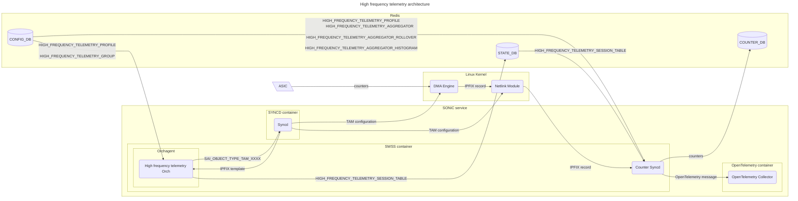
``` mermaid

---
title: High frequency telemetry architecture
---
flowchart LR
    subgraph Redis
        config_db[(CONFIG_DB)]
        state_db[(STATE_DB)]
        counter_db[(COUNTER_DB)]
    end

    subgraph SONiC service
        subgraph OpenTelemetry container
            otel(OpenTelemetry Collector)
        end
        subgraph SWSS container
            counter_syncd(Counter Syncd)
            subgraph Orchagent
                hft_orch(High frequency telemetry Orch)
            end
        end
        subgraph SYNCD container
            syncd(Syncd)
        end
    end

    subgraph Linux Kernel
        dma_engine(DMA Engine)
        netlink_module(Netlink Module)
    end

    asic[\ASIC\]

    config_db --HIGH_FREQUENCY_TELEMETRY_PROFILE
                HIGH_FREQUENCY_TELEMETRY_GROUP--> hft_orch
    config_db --HIGH_FREQUENCY_TELEMETRY_PROFILE
                HIGH_FREQUENCY_TELEMETRY_AGGREGATOR
                HIGH_FREQUENCY_TELEMETRY_AGGREGATOR_ROLLOVER
                HIGH_FREQUENCY_TELEMETRY_AGGREGATOR_HISTOGRAM--> counter_syncd
    state_db --HIGH_FREQUENCY_TELEMETRY_SESSION_TABLE--> counter_syncd
    hft_orch --HIGH_FREQUENCY_TELEMETRY_SESSION_TABLE--> state_db
    hft_orch --SAI_OBJECT_TYPE_TAM_XXXX--> syncd
    syncd --TAM configuration--> dma_engine
    syncd --TAM configuration--> netlink_module
    counter_syncd -- counters --> counter_db
    counter_syncd -- OpenTelemetry message --> otel
    dma_engine --IPFIX record--> netlink_module
    netlink_module --IPFIX record--> counter_syncd
    asic --counters--> dma_engine
    syncd --IPFIX template--> hft_orch
```

## 7. High-Level Design

### 7.1. Modules

#### 7.1.1. Counter Syncd

The `counter syncd` is a new process that runs within the swss container. Its primary responsibility is to receive counter messages via netlink and push them into the OpenTelemetry collector and Counter DB. It subscribes to a socket of a specific family and multicast group of generic netlink. The configuration for generic netlink is defined as constants in `/etc/sonic/constants.yml` as follows.

``` yaml

constants:
    high_frequency_telemetry:
        genl_family: "sonic_stel"
        genl_multicast_group: "ipfix"

```

- Architecture for CounterSyncd:

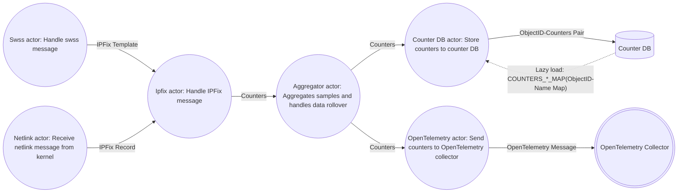
``` mermaid

flowchart LR
    swss_act((Swss actor: Handle swss message))
    netlink_act((Netlink actor: Receive netlink message from kernel))
    ipfix_act((Ipfix actor: Handle IPFix message))
    aggregate_act((Aggregator actor: Aggregates samples and handles data rollover))
    cdb_act((Counter DB actor: Store counters to counter DB))
    otel_act((OpenTelemetry actor: Send counters to OpenTelemetry collector))
    cdb[(Counter DB)]
    otel(((OpenTelemetry Collector)))

    swss_act -- IPFix Template --> ipfix_act
    netlink_act -- IPFix Record --> ipfix_act
    ipfix_act -- Counters --> aggregate_act
    aggregate_act -- Counters --> cdb_act
    aggregate_act -- Counters --> otel_act
    cdb_act -- ObjectID-Counters Pair --> cdb
    cdb -. Lazy load: COUNTERS_*_MAP(ObjectID-Name Map) .-> cdb_act
    otel_act -- OpenTelemetry Message --> otel

```

The Aggregator actor applies optional per-profile aggregation after IPFIX records are parsed and before counters are exported to Counter DB or OpenTelemetry. A profile selects an aggregator by setting `HIGH_FREQUENCY_TELEMETRY_PROFILE.aggregator`; if no aggregator is selected, Counter Syncd forwards the lower-layer reported samples without extra aggregation, rollover correction, or heatmap handling.

An aggregator supports the following optional methods and can be extended with more methods later. The methods can be configured independently or in any combination. For the heatmap branch, Counter Syncd applies rollover correction first, reporting-rate aggregation second, the counter-specific value transform third, and heatmap accumulation last.

Samples for one HFT session are expected in nondecreasing `observationTimeNanoseconds` order. This constrains timestamps, not values: watermark and current-occupancy values may decrease or reset. Samples for a reporting or heatmap window that has already been emitted are ignored. Both time-based stages are sample-driven: the first sample in a later window emits the completed preceding window. This avoids per-session timers for continuous telemetry; the final partial window can remain buffered if a stream becomes idle or ends, and is discarded when an aggregator configuration is replaced or removed.

- Reporting rate aggregation: groups lower-layer samples into the configured reporting interval, in microseconds. The ordinary gauge/reporting output remains the latest value in each completed reporting window. If `reporting_rate` is absent, every lower-layer sample is an accepted reporting point and no reporting window aggregation is performed.
- Rollover counters: the parent `rollover_counters` list enables correction for its group and counter pairs. A selected counter uses the `bit_width` in its `HIGH_FREQUENCY_TELEMETRY_AGGREGATOR_ROLLOVER` row; a selected counter with no override row has an effective width of 32 bits. The child `bit_width` leaf is mandatory when a row exists and has no YANG default. Watermark and current-occupancy counters remain forbidden in the parent enable list, and the list is empty by default.
- Heatmap counters: `heatmap_interval` and `heatmap_counters` are configured together. They produce OTLP delta histograms over the independent `heatmap_interval`, in microseconds. For example, a 1 ms lower-layer interval, 100 ms `reporting_rate`, and 1 s `heatmap_interval` produce a histogram from ten accepted reporting points. A counter-specific row in `HIGH_FREQUENCY_TELEMETRY_AGGREGATOR_HISTOGRAM` supplies custom explicit bounds. A selected counter without such a row uses the fixed semantic default layout for its counter quantity.

For a rollover counter with effective width `bit_width`, Counter Syncd uses `modulus = 2^bit_width`. Every raw value must be less than `modulus`. It maintains a `wrap_base`, initially zero, and the preceding raw value. On a raw decrease it detects one wrap and increments `wrap_base` by `modulus`; for every sample it then computes `corrected = wrap_base + raw`. The corrected value is a `uint64`.

- With the default 32-bit width, `modulus = 4294967296`; raw values `4294967290, 3, 10` produce corrected values `4294967290, 4294967299, 4294967306`.
- With an explicit 24-bit override, `modulus = 16777216`; raw values `16777210, 3, 10` produce corrected values `16777210, 16777219, 16777226`.
- The increment between adjacent samples must be strictly less than one modulus. Under that condition, every wrap produces `raw < previous_raw` and is detected. An increment equal to a complete modulus (`10 -> 10` for an 8-bit counter) or any larger unobserved advance is indistinguishable from fewer wraps and results in an undercount.
- Without an out-of-band reset signal, a counter reset is indistinguishable from a wrap. A raw decrease is therefore interpreted as one wrap. A reset signal must clear `wrap_base` and rebaseline the preceding raw value.
- If incrementing `wrap_base` or adding a raw value would overflow `uint64`, Counter Syncd must not emit a wrapped arithmetic result. It resets the rollover state, rebaselines at the current raw value with `wrap_base = 0`, and exports that raw value as the new corrected baseline; consumers observe this as a counter reset.
- Width 64 is unsupported. The configured range is 1 through 63, leaving `2^bit_width` representable in the `uint64` rollover state and permitting overflow checks before addition.

The heatmap value transform does not change the ordinary gauge/reporting output. Counter Syncd classifies each selected counter once, from its numeric SAI object type ID and stat ID; it does not infer semantics from counter-name strings on the hot path. Value kind and quantity are resolved independently:

| Heatmap quantity | Counter class | Histogram observation | OTLP unit | Default size |
| ---------------- | ------------- | --------------------- | --------- | ------------ |
| `delta_bytes` | Cumulative byte/octet counters | Raw byte delta | `By` | 42 bounds, 43 buckets |
| `absolute_bytes` | Watermark/current-occupancy byte counters | Raw absolute bytes | `By` | 9 bounds, 10 buckets |
| `delta_count` | Cumulative packet, error, discard, trim, pause, and PFC counters; unknown cumulative fallback | Raw count delta | `1` | 28 bounds, 29 buckets |
| `absolute_cells` | Watermark/current-occupancy cell counters | Raw absolute cells | `{cell}` | 26 bounds, 27 buckets |
| `native` | Recognized rare native quantities without a dedicated layout, such as level or nanosecond stats outside the current YANG allow-list | Raw native value using the stat's value kind | `1` | 55 bounds, 56 buckets |

- A watermark counter contributes the maximum raw value seen in each reporting window.
- A current-occupancy counter contributes the latest raw value seen in each reporting window.
- A cumulative counter contributes the raw delta between consecutive accepted reporting points. The first accepted point establishes the baseline and contributes no histogram observation. A decrease means that the counter reset; the lower point becomes the new baseline and no delta is produced for that point.
- Without `reporting_rate`, each lower-layer sample is an accepted point, so these rules are applied sample by sample.
- Heatmap observations are intentionally not normalized by elapsed time or converted into per-second rates. Byte/octet deltas remain bytes, count deltas remain counts, byte occupancy remains bytes, and cell occupancy remains cells.

Default layouts are resolved once when an effective profile and aggregator configuration is built. A child `explicit_bounds` row overrides the semantic default for that counter. Otherwise, `delta_bytes` uses the nominal accepted interval `max(reporting_rate, poll_interval)` when both are present, or whichever interval is present. The profile `poll_interval` is mandatory and positive; `reporting_rate` is optional and positive. Taking the maximum prevents default bounds from assuming accepted observations can arrive faster than either the source polling cadence or the reporting stage permits. For example, `reporting_rate=1000 us` with `poll_interval=10000 us` resolves the 10 ms layout, not the 1 ms layout. The nominal interval changes only the precomputed byte boundaries, never an observation value. Interval-independent layouts are shared globally, and every resolved layout is shared across objects and heatmap windows. Consequently, a shared aggregator can have different effective `delta_bytes` layouts when bound to profiles with different polling intervals.

A missed or sparse sample can make a cumulative delta span multiple nominal intervals. Such a raw delta can intentionally land in a higher bucket because Counter Syncd does not divide it by elapsed time. This is the performance-preserving tradeoff for retaining source values and units without per-sample rate arithmetic.

#### 7.1.2. High frequency telemetry Orch

The `High frequency telemetry Orch` is a new object within the Orchagent. It has following primary duties:

1. Maintain the TAM SAI objects according to the high frequency telemetry configuration in the config DB.
2. Generate a unique template ID for each high frequency telemetry profile to ensure distinct identification and management.
3. Register and activate streams on counter syncd.

`High frequency telemetry Orch` leverages `tam_counter_subscription` objects to bind monitoring objects, such as ports, buffers, or queues, to streams. Therefore, this orch must ensure that the lifecycle of `tam_counter_subscription` objects is within the lifecycle of their respective monitoring objects.

#### 7.1.3. Netlink Module and DMA Engine

These two modules need to be provided by vendors. Meanwhile, the new genetlink family and group will be registered through the kernel module provided by the vendor .This document proposes a ring buffer communication model to support all expected TAM configurations as follows.

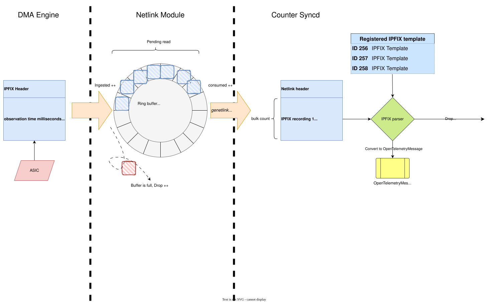

#### 7.1.4. OpenTelemetry Collector (Existing open source solution)

The OpenTelemetry Collector serves as a critical component in modern observability pipelines, acting as a vendor-agnostic middleware that receives, processes, and exports telemetry data. One of OpenTelemetry Collector's key strengths is its flexibility in supporting various open-source telemetry data formats, such as Jaeger and Prometheus, and exporting them to multiple open-source or commercial back-ends.

The collector is deployed as a Docker container with the following responsibilities:

- Receivers: Accepts OTLP metrics via OTLP/gRPC protocol
- Processors: Batches metrics for efficient transmission
- Exporters: Forwards metrics to backend databases for storage and visualization

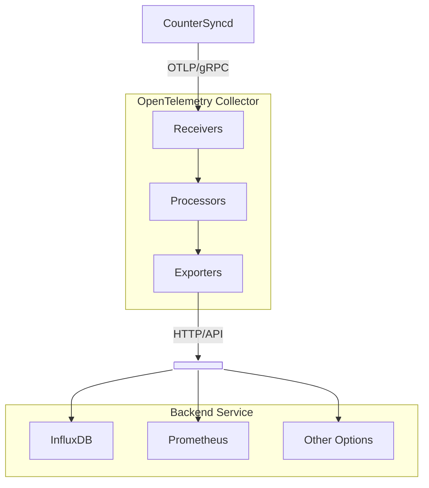
``` mermaid

flowchart TD;
    CS[CounterSyncd] -->|OTLP/gRPC| R
    subgraph OpenTelemetry Collector
        R[Receivers] --> P[Processors] --> E[Exporters]
    end
    BS@{ shape: fork, label: "Backend service" }
    subgraph Backend Service
        IDB[InfluxDB]
        PM[Prometheus]
        OTH[Other Options]
    end
    E --> |HTTP/API|BS
    BS --> IDB
    BS --> PM
    BS --> OTH

```

For further details on OpenTelemetry and OpenTelemetry Collector, please refer to the official documentation:

- [What is OpenTelemetry?](https://opentelemetry.io/docs/what-is-opentelemetry/)
- [OpenTelemetry Collector](https://opentelemetry.io/docs/collector/)

### 7.2. Data format

We will use IPFIX as the report format, with all numbers in the IPFIX message in network-order (Big-endian).

For more information on IPFIX, refer to the following resources:

- [Specification of the IP Flow Information Export (IPFIX) Protocol for the Exchange of Flow Information](https://datatracker.ietf.org/doc/html/rfc7011)
- [IP Flow Information Export (IPFIX) Entities](https://www.iana.org/assignments/ipfix/ipfix.xhtml)

#### 7.2.1. IPFIX header

The `Version` field of the IPFIX header is identical for each IPFIX message. `Observation Domain ID` is defined by vendor implementation. `Sequence Number` starts from 0 and is monotonically incremented per `Observation Domain ID` modulo 2^32.

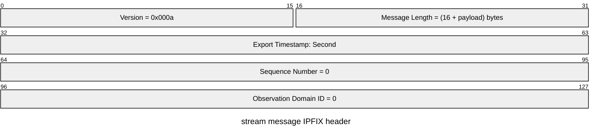
``` mermaid

---
title: stream message IPFIX header
---
packet-beta
0-15: "Version = 0x000a"
16-31: "Message Length = (16 + payload) bytes"
32-63: "Export Timestamp: Second"
64-95: "Sequence Number = 0"
96-127: "Observation Domain ID = 0"

```

#### 7.2.2. IPFIX template

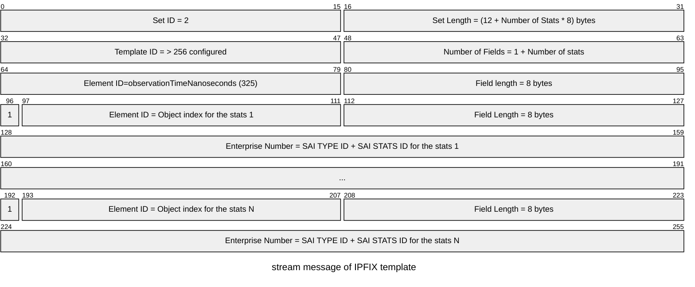
``` mermaid

---
title: stream message of IPFIX template
---
packet-beta
0-15: "Set ID = 2"
16-31: "Set Length = (12 + Number of Stats * 8) bytes"
32-47: "Template ID = > 256 configured"
48-63: "Number of Fields = 1 + Number of stats"
64-79: "Element ID=observationTimeNanoseconds (325)"
80-95: "Field length = 8 bytes"
96-96: "1"
97-111: "Element ID = Object index for the stats 1"
112-127: "Field Length = 8 bytes"
128-159: "Enterprise Number = SAI TYPE ID + SAI STATS ID for the stats 1"
160-191: "..."
192-192: "1"
193-207: "Element ID = Object index for the stats N"
208-223: "Field Length = 8 bytes"
224-255: "Enterprise Number = SAI TYPE ID + SAI STATS ID for the stats N"

```

- For high-frequency counters, the native IPFIX timestamp unit of seconds is insufficient. Therefore, we introduce an additional element, `observationTimeNanoseconds`, for each record to meet our requirements.
- The element ID of IPFIX is generated by the orchagent and ranges from 0x8000-0xFFFF. Orchagent will ensure the uniqueness of the element ID in each template.
- The first 16 bits of the enterprise number on the wire encode the [SAI_OBJECT_TYPE](https://github.com/opencomputeproject/SAI/blob/master/inc/saitypes.h), and the following 16 bits encode its stats ID. Multi-byte values use network byte order. Therefore, for `SAI_OBJECT_TYPE_QUEUE=0x00000015` and `SAI_QUEUE_STAT_WRED_ECN_MARKED_PACKETS=0x00000022`, the enterprise number is `0x00000015 << 16 | 0x00000022 = 0x00150022` (wire bytes `00 15 00 22`).

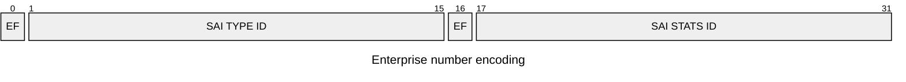
``` mermaid
---
title: Enterprise number encoding
---
packet-beta
0: "EF"
1-15: "SAI TYPE ID"
16: "EF"
17-31: "SAI STATS ID"

```

**EF is the extension flag: If this type or stat is an SAI extension, it should be set to 1.**

For example, if the switch has 8 ports, but we only want to get the `SAI_PORT_STAT_IF_IN_ERRORS = 0x00000004` of `SAI_OBJECT_TYPE_PORT = 0x00000001` on Ethernet2 and Ethernet5, the template will look like this:

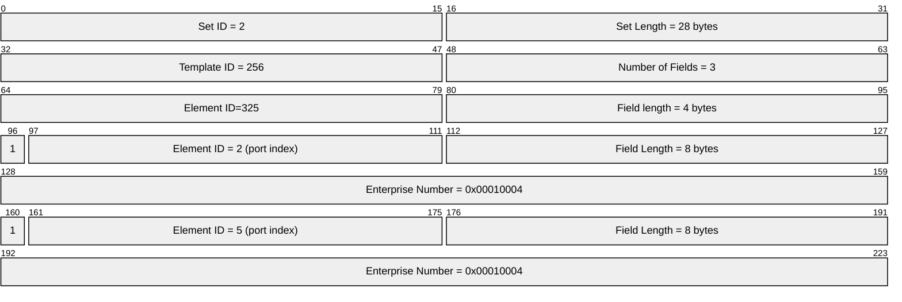
``` mermaid

packet-beta
0-15: "Set ID = 2"
16-31: "Set Length = 28 bytes"
32-47: "Template ID = 256"
48-63: "Number of Fields = 3"
64-79: "Element ID=325"
80-95: "Field length = 4 bytes"
96-96: "1"
97-111: "Element ID = 2 (port index)"
112-127: "Field Length = 8 bytes"
128-159: "Enterprise Number = 0x00010004"
160-160: "1"
161-175: "Element ID = 5 (port index)"
176-191: "Field Length = 8 bytes"
192-223: "Enterprise Number = 0x00010004"

```

#### 7.2.3. IPFIX data

An IPFIX data message consists of snapshots that is a binary block that can be interpreted using the IPFIX template mentioned above.

The binary structure of a snapshot is as follows:

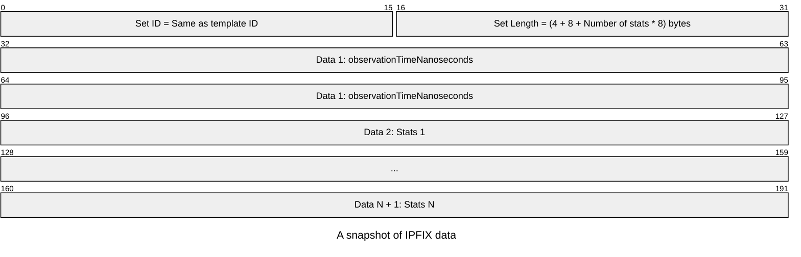
``` mermaid

---
title: A snapshot of IPFIX data
---
packet-beta
0-15: "Set ID = Same as template ID"
16-31: "Set Length = (4 + 8 + Number of stats * 8) bytes"
32-95: "Data 1: observationTimeNanoseconds"
96-127: "Data 2: Stats 1"
128-159: "..."
160-191: "Data N + 1: Stats N"
```

- The snapshot structure is derived from the IPFIX template, which is based on the stats we want to record.

Below is an example of an IPFIX message with 3 snapshots for the same stats record as the IPFIX template example:

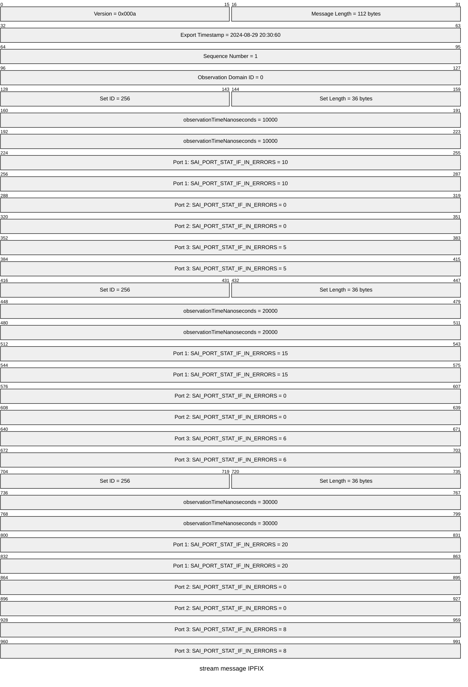
``` mermaid

---
title: stream message IPFIX
---
packet-beta
0-15: "Version = 0x000a"
16-31: "Message Length = 112 bytes"
32-63: "Export Timestamp = 2024-08-29 20:30:60"
64-95: "Sequence Number = 1"
96-127: "Observation Domain ID = 0"

128-143: "Set ID = 256"
144-159: "Set Length = 36 bytes"
160-223: "observationTimeNanoseconds = 10000"
224-287: "Port 1: SAI_PORT_STAT_IF_IN_ERRORS = 10"
288-351: "Port 2: SAI_PORT_STAT_IF_IN_ERRORS = 0"
352-415: "Port 3: SAI_PORT_STAT_IF_IN_ERRORS = 5"

416-431: "Set ID = 256"
432-447: "Set Length = 36 bytes"
448-511: "observationTimeNanoseconds = 20000"
512-575: "Port 1: SAI_PORT_STAT_IF_IN_ERRORS = 15"
576-639: "Port 2: SAI_PORT_STAT_IF_IN_ERRORS = 0"
640-703: "Port 3: SAI_PORT_STAT_IF_IN_ERRORS = 6"

704-719: "Set ID = 256"
720-735: "Set Length = 36 bytes"
736-799: "observationTimeNanoseconds = 30000"
800-863: "Port 1: SAI_PORT_STAT_IF_IN_ERRORS = 20"
864-927: "Port 2: SAI_PORT_STAT_IF_IN_ERRORS = 0"
928-991: "Port 3: SAI_PORT_STAT_IF_IN_ERRORS = 8"

```

- If the number of stats in a group is small, multiple snapshots may be encoded into a single IPFIX message.
- If the number of stats in a group exceeds 8K, the group must be split across multiple IPFIX messages.

The IPFIX template should be provided by vendors. This document does not restrict how to split or concatenate snapshots, but each separated snapshot must include its own `observationTimeNanoseconds`.

#### 7.2.4. Netlink message

We expect all control messages and out-of-band information to be transmitted by the SAI. Therefore, it is unnecessary to read the attribute header of netlink and the message header of Genetlink from the socket. Instead, we can insert a bulk of IPFIX recordings as the payload of the netlink message. The sample code for building the message from the kernel side is as follows:

``` c

struct genl_multicast_group stel_mcgrps[] = {
    { .name = "ipfix" },
};

// Family definition
static struct genl_family stel_family = {
    .name = "sonic_stel",
    .version = 1,
    // ...
    .mcgrps = stel_mcgrps,
    .n_mcgrps = ARRAY_SIZE(stel_mcgrps),
};


void send_msgs_to_user(/* ... */)
{
    struct sk_buff *skb_out = nlmsg_new(ipfix_msg_len, GFP_KERNEL);

    for (size_t i = 0; i < bulk_count; i++)
    {
        struct ipfix *msg = ring_buffer.pop();
        if (msg == NULL)
        {
            break;
        }
        nla_append(skb_out, msg->data, msg->len);
    }

    genlmsg_multicast(&stel_family, skb_out, 0, 0/* group_id to ipfix group */, GFP_KERNEL);
}

```

#### 7.2.5. OTLP message

OTLP gauge metrics represent a measurement at a specific point in time. Unlike counters, gauges can increase and decrease, making them suitable for metrics like buffer occupancy, port status, and other instantaneous measurements.

Gauge metrics in OTLP usually consist of:

- Metric Name: Unique identifier (e.g., buffer_pool.dropped_packets)
- Data Points: A single metric (identified by name) can contain multiple data points. Each data point includes:
  - Attributes: Key-value pairs providing context (e.g., object_name="Ethernet1|3")
  - Timestamp(time_unix_nano): When the measurement was taken
  - Value: The actual measurement

Example of a simplified OTLP metric:

```
Metric {
  name: "buffer_pool.dropped_packets",
  description: "SAI counter statistic",
  unit: "",
  data: Gauge {
    data_points: [
      {
        attributes: [
          { key: "object_name", value: "Ethernet1|3" }
        ],
        time_unix_nano: 2,
        value: 2
      }
    ]
  }
}
```

Heatmap counters are represented as OTLP delta histograms. Each data point covers one independent `heatmap_interval` and contains the raw-unit observations described in section 7.1.1. Bucket boundaries are inclusive upper bounds: for explicit bounds `[100, 200]`, the three buckets are values `<= 100`, values `> 100` and `<= 200`, and values `> 200`. In general, N explicit bounds produce N+1 buckets.

The histogram metric retains the source quantity's unit: `By` for both raw byte deltas and absolute byte values, `{cell}` for cells, and `1` for raw counts or the native fallback. It does not claim a per-second unit. Each data point includes `object_name`, SAI type/stat IDs, HFT session, `heatmap_value_kind`, `heatmap_quantity`, and `heatmap_schema` attributes. `heatmap_quantity` identifies `delta_bytes`, `absolute_bytes`, `delta_count`, `absolute_cells`, or `native` and therefore determines the unchanged unit. `heatmap_schema` is a stable identifier derived from the value kind, quantity, and complete effective explicit-bound list. The effective bounds already encode the nominal interval for a default `delta_bytes` layout, so different quantities, intervals, or layouts cannot be mixed in one backend series. In the example below, those attributes are omitted only for brevity.

The explicit bounds for a selected counter come from its `HIGH_FREQUENCY_TELEMETRY_AGGREGATOR_HISTOGRAM` row when one exists. Otherwise Counter Syncd resolves one of these compact defaults:

- `delta_bytes`: use common link speeds `[100, 200, 400, 800, 1600]` Gbit/s and utilization thresholds `[50%, 75%, 90%, 95%, 98%, 99%, 99.5%, 99.8%, 100%]`. Representing those percentages as basis points `[5000, 7500, 9000, 9500, 9800, 9900, 9950, 9980, 10000]`, Counter Syncd adds zero and computes each raw byte-delta bound with exact integer arithmetic: `bound_bytes = floor(speed_gbps * utilization_basis_points * nominal_interval_us / 80)`. It sorts and deduplicates the union because, for example, 100% of 100 Gbit/s equals 50% of 200 Gbit/s. This produces 42 explicit bounds and 43 buckets. The final implicit bucket contains deltas greater than the nominal 1600 Gbit/s equivalent.
- `absolute_bytes`: `[0, 512, 1024, 524288, 1048576, 5242880, 10485760, 52428800, 104857600]`, producing 10 buckets. These points cover idle, 512 B, 1 KiB, 512 KiB, 1 MiB, 5 MiB, 10 MiB, 50 MiB, and 100 MiB occupancy scales.
- `delta_count`: `[0, 1, 2, 5, 10, 20, 50, 100, 200, 500, 1000, 2000, 5000, 10000, 20000, 50000, 100000, 200000, 500000, 1000000, 2000000, 5000000, 10000000, 20000000, 50000000, 100000000, 200000000, 500000000]`, producing 29 buckets. This is the exact 1-2-5 progression through 500 million raw events per accepted interval.
- `absolute_cells`: `[0]` followed by `2^0` through `2^24`, producing 27 buckets.
- `native`: `[0]` followed by `2^0` through `2^53`, producing 56 buckets. It is the conservative fallback for rare native quantities; values above `2^53` use the implicit overflow bucket.

The `delta_bytes` bounds for common nominal accepted intervals are:

| Equivalent Gbit/s | 1 ms (`1000 us`) | 10 ms (`10000 us`) | 100 ms (`100000 us`) |
| -----------------: | ---------------: | -----------------: | -------------------: |
| 0 | 0 | 0 | 0 |
| 50 | 6250000 | 62500000 | 625000000 |
| 75 | 9375000 | 93750000 | 937500000 |
| 90 | 11250000 | 112500000 | 1125000000 |
| 95 | 11875000 | 118750000 | 1187500000 |
| 98 | 12250000 | 122500000 | 1225000000 |
| 99 | 12375000 | 123750000 | 1237500000 |
| 99.5 | 12437500 | 124375000 | 1243750000 |
| 99.8 | 12475000 | 124750000 | 1247500000 |
| 100 | 12500000 | 125000000 | 1250000000 |
| 150 | 18750000 | 187500000 | 1875000000 |
| 180 | 22500000 | 225000000 | 2250000000 |
| 190 | 23750000 | 237500000 | 2375000000 |
| 196 | 24500000 | 245000000 | 2450000000 |
| 198 | 24750000 | 247500000 | 2475000000 |
| 199 | 24875000 | 248750000 | 2487500000 |
| 199.6 | 24950000 | 249500000 | 2495000000 |
| 200 | 25000000 | 250000000 | 2500000000 |
| 300 | 37500000 | 375000000 | 3750000000 |
| 360 | 45000000 | 450000000 | 4500000000 |
| 380 | 47500000 | 475000000 | 4750000000 |
| 392 | 49000000 | 490000000 | 4900000000 |
| 396 | 49500000 | 495000000 | 4950000000 |
| 398 | 49750000 | 497500000 | 4975000000 |
| 399.2 | 49900000 | 499000000 | 4990000000 |
| 400 | 50000000 | 500000000 | 5000000000 |
| 600 | 75000000 | 750000000 | 7500000000 |
| 720 | 90000000 | 900000000 | 9000000000 |
| 760 | 95000000 | 950000000 | 9500000000 |
| 784 | 98000000 | 980000000 | 9800000000 |
| 792 | 99000000 | 990000000 | 9900000000 |
| 796 | 99500000 | 995000000 | 9950000000 |
| 798.4 | 99800000 | 998000000 | 9980000000 |
| 800 | 100000000 | 1000000000 | 10000000000 |
| 1200 | 150000000 | 1500000000 | 15000000000 |
| 1440 | 180000000 | 1800000000 | 18000000000 |
| 1520 | 190000000 | 1900000000 | 19000000000 |
| 1568 | 196000000 | 1960000000 | 19600000000 |
| 1584 | 198000000 | 1980000000 | 19800000000 |
| 1592 | 199000000 | 1990000000 | 19900000000 |
| 1596.8 | 199600000 | 1996000000 | 19960000000 |
| 1600 | 200000000 | 2000000000 | 20000000000 |

These tables describe nominal equivalence, not runtime rate normalization. For a 100 Gbit/s link, 50.01, 99.8, and 100 Gbit/s therefore occupy distinct buckets instead of sharing one coarse 50-to-100 Gbit/s bucket. If `reporting_rate=1000 us` and `poll_interval=10000 us`, the effective nominal interval is 10 ms and the middle column is selected. A delta above the final value enters the implicit overflow bucket. If samples are missed or a series is sparse, one observed delta may span multiple nominal intervals and land in a higher bucket even when the underlying average link rate did not increase.

Default and custom layouts are immutable for an effective configuration and are shared across objects and windows. A configuration change that changes a counter's effective quantity, nominal interval, or bounds creates a new schema and discards its partial heatmap state.

```
Metric {
  name: "sai_counter_type_1_stat_2_heatmap",
  description: "SAI counter heatmap; raw quantity and explicit-bound layout are identified by heatmap_quantity and heatmap_schema",
  unit: "1",
  data: Histogram {
    aggregation_temporality: DELTA,
    data_points: [{
      start_time_unix_nano: 1000,
      time_unix_nano: 2000,
      count: 3,
      explicit_bounds: [100, 200],
      bucket_counts: [1, 1, 1]
    }]
  }
}
```

For example, if `PORT|IF_OUT_ERRORS` has custom bounds `[100, 200]` while `QUEUE|WRED_ECN_MARKED_PACKETS` has no histogram row, the port histogram carries `[100, 200]` and three bucket counts. Both values are raw count deltas with unit `1`; the queue histogram carries the 28 default `delta_count` bounds and 29 bucket counts.

For design goals, requirements, and specification of the OTLP, please refer to the official documentation: [OpenTelemetry Protocol (OTLP)](https://github.com/open-telemetry/opentelemetry-proto/tree/main/docs).

For practical OTLP message examples and implementation patterns, see the examples in the OpenTelemetry repository: [OpenTelemetry Protocol Examples](https://github.com/open-telemetry/opentelemetry-proto/tree/main/examples).

### 7.3. Bandwidth Estimation

#### 7.3.1. IPFIX input

We estimate the IPFIX bandwidth based only on the effective data size, not the actual data size. The extra information in a message, such as the IPFIX header (16 bytes), data prefix (4 bytes), and observation time nanoseconds (8 bytes), is negligible. For example, an IPFIX message could include $The Maximal Number Of Counters In One Message = \frac{0xFFFF_{Max Length Bytes} - 16_{Header Bytes} - 4_{DataPrefix Bytes} - 8_{Observation Time Nanoseconds Bytes}}{8_{bytes}} \approx 8188$, so $The Percentage Of Effective Data = \frac{0xFFFF_{Max Length Bytes} - 16_{Header Bytes} - 4_{DataPrefix Bytes} - 8_{Observation Time Nanoseconds Bytes}} {0xFFFF_{Max LengthBytes}} \approx 99.9\%$.

The following table is an example of telemetry bandwidth of one cluster

| # of stats per port | # of ports per switch | # of switch | frequency (us) | Total BW per switch(Mbps) | Total BW(Mbps) |
| ------------------- | --------------------- | ----------- | -------------- | ------------------------- | -------------- |
| 30                  | 64                    | 10,000      | 10             | 12,288                    | 122,880,000    |

- /$/{Total BW Per Switch/} = \frac/{/{\verb|#| Of Stats Per Port/} \times 8_/{bytes/} \times /{\verb|#| Of Ports Per Switch/} \times /{Frequency/} \times 1,000 \times 8/}/{1,000,000/}$
- /$/{Total BM/} = /{Total BW Per Switch/} \times /{\verb|#| Of Switch/}/$

#### 7.3.2. OTLP heatmap output

OTLP Explicit Histograms repeat both arrays in every `HistogramDataPoint`; sharing an `Arc` inside Counter Syncd does not remove bytes from the exported protobuf. In the OTLP schema, `bucket_counts` is packed `repeated fixed64` and `explicit_bounds` is packed `repeated double`, so each element costs eight payload bytes even when a count or bound is zero. For N explicit bounds and N+1 buckets, the two packed arrays require:

```text
counts = 1-byte tag + varint_size(8 * (N + 1)) + 8 * (N + 1)
bounds = 1-byte tag + varint_size(8 * N)       + 8 * N
arrays = counts + bounds
```

The former 255-bound/256-bucket default therefore used `2051 + 2043 = 4094` bytes per data point before timestamps, count, sum/min/max, attributes, and enclosing messages. Arrays alone scale to approximately 0.25 MiB for 64 series, 2 MiB for 512 series, and 16 MiB for 4096 series in one heatmap window.

The following table deliberately separates that arrays-only formula from full production-shaped `HistogramDataPoint` measurements. Full sizes are obtained with `prost::Message::encoded_len()` using all repeated production attributes, coherent count/sum/min/max and bucket-count values, and the complete bounds. The former production-shaped point is 4436 B with 255 bounds and 256 buckets. A benchmark may report a shorter fixture-specific size when it intentionally uses shorter names, attributes, or scalar encodings; that number is not the production-shaped estimate.

| Layout | Bounds/buckets | Arrays only | Full encoded point |
| ------ | --------------: | ----------: | -----------------: |
| Former generic default | 255/256 | 4094 B | 4436 B |
| `delta_bytes` | 42/43 | 686 B | 1028 B |
| `absolute_bytes` | 9/10 | 156 B | 528 B |
| `delta_count` | 28/29 | 462 B | 804 B |
| `absolute_cells` | 26/27 | 430 B | 802 B |
| `native` | 55/56 | 894 B | 1250 B |

Full `ExportMetricsServiceRequest.encoded_len()` measurements include resource, scope, metric, and repeated data-point framing. Before splitting, a round-robin mixture of the five compact defaults is 56769 B for 64 series, 454457 B for 512 series, and 3638351 B (3.64 MB decimal) for 4096 series. The unsplit mixed 4096-series payload is larger than the 3 MiB production cap and is split; it must not be treated as one under-cap request. A homogeneous 4096-point `delta_bytes` request is 4234293 B (4.23 MB decimal), while a homogeneous 4096-point `native` request is 5143594 B (5.14 MB decimal); both are split. Homogeneous large custom layouts, including the supported 511-bound maximum, follow the same production splitting path. The former 4096-point synthetic layout is 18193460 B (18.19 MB decimal) before splitting. These figures are uncompressed protobuf sizes before gRPC framing.

Production does not rely on a receiver's generic gRPC limit. Counter Syncd computes the exact protobuf `encoded_len()` and applies a default 3 MiB (`3145728` byte) payload cap, configurable with the positive Counter Syncd CLI option `--otel-max-export-bytes`. It splits an oversized export at metric boundaries and, when one metric is too large, at that metric's data-point boundaries using an O(total encoded payload) greedy pass rather than repeatedly re-encoding the whole request. Every split histogram metric preserves `aggregation_temporality=DELTA`, its unchanged unit, and each data point's `heatmap_quantity` and `heatmap_schema`; splitting does not combine or reinterpret series. Every emitted `ExportMetricsServiceRequest` has `encoded_len()` less than or equal to the configured cap. A single data point is indivisible; if its enclosing request cannot fit, export fails with a clear error instead of exceeding the cap or silently dropping data.

Custom layouts remain operator-controlled and may contain up to 511 explicit bounds (512 buckets). They can therefore produce points at least as large as the former generic layout, but remain supported through the same exact-size splitting path. Operators must still set a receiver-compatible cap because one custom point is the indivisible unit.

The InfluxDB exporter further expands an OTLP histogram. Depending on schema mode, it writes all buckets as fields or emits a summary plus a line per bucket; tags and timestamps can be repeated for each expanded line. Smaller default layouts therefore reduce not only OTLP transport bytes but also conversion work, line-protocol volume, and backend field/tag expansion. Compression may reduce repetitive wire data, but it does not avoid exporter expansion or decompressed message-size limits.

##### Benchmark methodology

Runtime performance reports use Criterion with setup outside the timed loop. Aggregator benchmarks pre-resolve and cache layouts and reuse the session key, then compare a custom 8-bucket layout with the semantic 43-bucket `delta_bytes` default over 64 and 512 series; throughput is reported as input metrics/s and validation confirms observations remain raw. OTLP conversion benchmarks time `Heatmap::to_proto()` for every compact default and the synthetic former 256-bucket layout; benchmark IDs include `encoded_len()` bytes per point and throughput is histogram data points/s. Any shorter former-layout benchmark number is labeled as fixture-specific and is not substituted for the 4436 B production-shaped point above. Direct-send benchmarks prebuild production-shaped inputs for 64, 512, and 4096 mixed compact series, use the production-equivalent splitter, and move request/client cloning into Criterion's untimed batch setup. The timed closure awaits only `MetricsServiceClient::export()` responses from a mock tonic collector that fully decodes and counts requests and data points. A separate worst-case case sends homogeneous 4096-series `native` data through its multiple production-sized chunks. Reports include both histogram data points/s and protobuf MiB/s, with request count and encoded bytes making requests/s independently reproducible without timing request construction.

The final implementation report must list:

- Aggregator metrics/s for custom 8 buckets and semantic `delta_bytes` default at 64 and 512 series.
- OTLP conversion histogram data points/s, protobuf MiB/s, and encoded bytes/point for all five defaults and the former 256-bucket baseline.
- Direct tonic export histogram data points/s, protobuf MiB/s, requests/s, encoded request bytes, and split request count for 64, 512, and 4096 mixed series and the homogeneous 4096-series `native` split case.
- Toolchain, build profile, host CPU, sample size, warm-up time, measurement time, and any receiver/message-size configuration.

The implementation was measured in the optimized Cargo benchmark profile inside `sonic-slave-bookworm` with Rust 1.86.0 on an Intel Xeon Platinum 8370C VM. Aggregator cases use 10 samples, 1 second warm-up, 5 seconds measurement, and flat sampling. Conversion cases use 100 samples, 3 seconds warm-up, and 5 seconds measurement. Direct-send cases use 10 samples, 500 ms warm-up, and 2 seconds measurement; request cloning is outside the timed closure and each timed export awaits the decoded gRPC response. Values below are Criterion point estimates from that run.

| Aggregator layout | 64 series input metrics/s | 512 series input metrics/s |
| ----------------- | ------------------------: | -------------------------: |
| Custom 8 buckets | 15.71 M | 15.00 M |
| Semantic `delta_bytes`, 43 buckets | 14.10 M | 14.38 M |

| Captured `Heatmap::to_proto()` fixture | Encoded bytes/point | Point-estimate histogram points/s | Derived protobuf MiB/s |
| -------------------------------------- | ------------------: | --------------------------------: | ---------------------: |
| `delta_bytes` | 1012 B | 1.56 M | 1509.35 |
| `absolute_bytes` | 512 B | 965.37 K | 471.37 |
| `absolute_cells` | 786 B | 984.42 K | 737.91 |
| `delta_count` | 788 B | 1.03 M | 773.29 |
| `native` | 1234 B | 1.23 M | 1443.27 |
| Former 256-bucket fixture | 4420 B | 925.11 K | 3899.56 |

The captured conversion run uses a shorter object identifier than the worst-case production-shaped size test above; the current session identifier and numeric SAI IDs are otherwise representative. Its fixture-specific byte counts and throughput are retained as measured; the separate `1028/528/802/804/1250/4436 B` production-shaped sizes remain the capacity-planning values. Direct tonic results below use representative production-length names and the production 3 MiB splitter.

| Direct tonic case | Points | Requests/export | Total protobuf bytes | Point-estimate points/s | Point-estimate protobuf MiB/s |
| ----------------- | -----: | --------------: | -------------------: | ----------------------: | ----------------------------: |
| Mixed compact | 64 | 1 | 55765 | 8.81 K | 7.20 |
| Mixed compact | 512 | 1 | 446285 | 31.16 K | 25.78 |
| Mixed compact | 4096 | 2 | 3572963 | 87.29 K | 71.77 |
| Homogeneous `native` | 4096 | 2 | 5078190 | 84.42 K | 105.51 |

These are local comparative measurements, not hardware-independent service-level guarantees. `protobuf MiB/s` counts uncompressed protobuf payload bytes and excludes gRPC framing and HTTP/2 overhead.
The conversion-table MiB/s values are derived from its encoded bytes/point and point-estimate points/s before display rounding. The direct-send points/s and MiB/s columns come from separate Criterion `Throughput::Elements` and `Throughput::Bytes` runs over the same payloads, so one direct-send column is not arithmetically derived from the independently timed other column.

### 7.4. Config DB

Session/profile replacement interrupts the existing session and resets all aggregation state. Ordinary aggregator child updates are applied at an ordered configuration boundary without rebuilding the IPFIX session. A rollover width change resets only series whose effective modulus changes; adding or deleting an explicit 32-bit override is a semantic no-op and preserves state. Partial reporting and heatmap windows are discarded on an effective aggregator change.

#### 7.4.1. DEVICE_METADATA

```
DEVICE_METADATA|localhost
    "high_frequency_telemetry_chunk_size": {{uint32}}
    "high_frequency_telemetry_chunk_count": {{uint32}} (Optional)
```

```
; field                      = value
high_frequency_telemetry_chunk_size  = uint32; reporting byte size of chunk under the high frequency telemetry.
high_frequency_telemetry_chunk_count = uint32; chunk count under the high frequency telemetry. Some platforms may not support setting this value.
```

#### 7.4.2. HIGH_FREQUENCY_TELEMETRY_PROFILE

```
HIGH_FREQUENCY_TELEMETRY_PROFILE|{{profile_name}}
    "stream_state": {{enabled/disabled}}
    "poll_interval": {{uint32}}
    "otel_endpoint": {{string of endpoint}} (Optional)
    "otel_certs": {{string of path}} (Optional)
    "aggregator": {{string of aggregator name}} (Optional)
```

```
key                = HIGH_FREQUENCY_TELEMETRY_PROFILE|profile_name a string as the identifier of high frequency telemetry
; field            = value
stream_state       = enabled/disabled ; Enabled/Disabled stream.
poll_interval      = uint32 ; The positive interval to poll counter, unit microseconds; range 1 through 2^32-1.
otel_endpoint      = string ; The endpoint of OpenTelemetry collector. E.G. 192.168.0.100:4318.
                     It will use the local OpenTelemetry collector if this value isn't provided.
otel_certs         = string ; The path of certificates for OpenTelemetry collector. E.G. /etc/sonic/otel/cert.private
                     If this value isn't provided, we will use a non-secure channel.
aggregator         = string ; The optional name of the HIGH_FREQUENCY_TELEMETRY_AGGREGATOR entry that this profile applies.
                     If this value isn't provided, no aggregator configuration is applied.
```

#### 7.4.3. HIGH_FREQUENCY_TELEMETRY_AGGREGATOR

```
HIGH_FREQUENCY_TELEMETRY_AGGREGATOR|{{aggregator_name}}
    "reporting_rate": {{uint32}} (Optional)
    "rollover_counters@": {{comma-separated list of group and counter pairs}} (Optional)
    "heatmap_interval": {{uint32}} (Optional)
    "heatmap_counters@": {{comma-separated list of group and counter pairs}} (Optional)
```

```
key                  = HIGH_FREQUENCY_TELEMETRY_AGGREGATOR|aggregator_name a string as the identifier of aggregator configuration
                       aggregator_name must not contain '|' or leading/trailing whitespace.
; field              = value
reporting_rate       = uint32 ; The reporting interval after aggregation, unit microseconds.
                       Ordinary gauge/reporting output is the latest value in each reporting window.
                       If this value isn't provided, every lower-layer sample is an accepted point.
                       For default byte-delta bounds, the nominal accepted interval is
                       max(reporting_rate, bound profile poll_interval) when both exist, or whichever exists.
rollover_counters    = A comma-separated list of group and counter pairs that require rollover correction.
                       The syntax is the same list format used by object_names and object_counters.
                       Each item uses group_name|object_counter.
                       The group_name must match HIGH_FREQUENCY_TELEMETRY_GROUP.group_name, and object_counter must be valid for that group.
                       An example is PORT|IF_IN_UCAST_PKTS,QUEUE|DROPPED_PACKETS.
                       Watermark and current-occupancy counters must not be included.
                       The default value is empty, meaning no counters are corrected for rollover.
                       A selected counter with no HIGH_FREQUENCY_TELEMETRY_AGGREGATOR_ROLLOVER row uses an effective width of 32 bits.
heatmap_interval     = uint32 ; The independent heatmap aggregation interval, unit microseconds.
                       It must be configured together with heatmap_counters.
heatmap_counters     = A comma-separated list of group and counter pairs that should be treated as heatmap data.
                       The syntax is the same as rollover_counters.
                       An example is PORT|OUT_CURR_OCCUPANCY_BYTES,QUEUE|WRED_ECN_MARKED_PACKETS.
                       It must be configured together with heatmap_interval.
                       The default value is empty.
                       Counters without a child histogram row use the fixed semantic layout for their raw quantity.
                       For byte deltas, the nominal interval is max(reporting_rate, bound profile poll_interval)
                       when both exist, or whichever exists. No per-sample rate normalization is performed.
```

#### 7.4.4. HIGH_FREQUENCY_TELEMETRY_AGGREGATOR_ROLLOVER

```
HIGH_FREQUENCY_TELEMETRY_AGGREGATOR_ROLLOVER|{{aggregator_name}}|{{group_name}}|{{counter_name}}
    "bit_width": {{uint8}}
```

```
key             = HIGH_FREQUENCY_TELEMETRY_AGGREGATOR_ROLLOVER|aggregator_name|group_name|counter_name
CONFIG_DB key   = <aggregator>|<GROUP>|<COUNTER>
aggregator_name = Existing HIGH_FREQUENCY_TELEMETRY_AGGREGATOR name.
group_name      = One of PORT, BUFFER_POOL, QUEUE, or INGRESS_PRIORITY_GROUP.
counter_name    = A counter valid for group_name. The GROUP|COUNTER selector must be present in the referenced
                  parent's rollover_counters enable list.
; field         = value
bit_width       = Mandatory uint8 counter width from 1 through 63. The rollover modulus is 2^bit_width.
                  The leaf has no default. Absence of the entire override row means the selected parent counter
                  uses the effective default width of 32 bits. Width 64 is unsupported.
```

For example, `PORT|IF_IN_OCTETS` has an explicit 24-bit width below. The same parent selects `QUEUE|DROPPED_PACKETS` without a child row, so that queue counter uses the effective default width of 32 bits.

```
HIGH_FREQUENCY_TELEMETRY_AGGREGATOR|default_aggregator
    "rollover_counters@": PORT|IF_IN_OCTETS,QUEUE|DROPPED_PACKETS

HIGH_FREQUENCY_TELEMETRY_AGGREGATOR_ROLLOVER|default_aggregator|PORT|IF_IN_OCTETS
    "bit_width": 24
```

#### 7.4.5. HIGH_FREQUENCY_TELEMETRY_AGGREGATOR_HISTOGRAM

```
HIGH_FREQUENCY_TELEMETRY_AGGREGATOR_HISTOGRAM|{{aggregator_name}}|{{group_name}}|{{counter_name}}
    "explicit_bounds@": {{comma-separated list of uint64}}
```

```
key             = HIGH_FREQUENCY_TELEMETRY_AGGREGATOR_HISTOGRAM|aggregator_name|group_name|counter_name
aggregator_name = Existing HIGH_FREQUENCY_TELEMETRY_AGGREGATOR name.
group_name      = One of PORT, BUFFER_POOL, QUEUE, or INGRESS_PRIORITY_GROUP.
counter_name    = A counter valid for group_name. The GROUP|COUNTER selector must be present in the referenced
                  parent's heatmap_counters.
; field         = value
explicit_bounds = An ordered, strictly increasing list containing 1 through 511 inclusive uint64 upper bounds.
                  Every bound is in the range 0 through 2^53. N bounds produce N+1 buckets.
                  Values use the selected counter's unchanged raw unit. A selected counter with this row uses
                  these bounds; a selected counter without a row uses its fixed semantic default layout.
```

For example, the following customizes `PORT|OUT_CURR_OCCUPANCY_BYTES`. A second selected counter, `QUEUE|WRED_ECN_MARKED_PACKETS`, has no row and therefore uses the `delta_count` default layout.

```
HIGH_FREQUENCY_TELEMETRY_AGGREGATOR_HISTOGRAM|default_aggregator|PORT|OUT_CURR_OCCUPANCY_BYTES
    "explicit_bounds@": 0,1024,4096,16384
```

#### 7.4.6. HIGH_FREQUENCY_TELEMETRY_GROUP

```
HIGH_FREQUENCY_TELEMETRY_GROUP|{{profile_name}}|{{group_name}}
    "object_names": {{list of object name}}
    "object_counters": {{list of stats of object}}
```

```
key             = HIGH_FREQUENCY_TELEMETRY_GROUP|profile_name|group_name
                    ; group_name is the object type, like PORT, BUFFER_PG or BUFFER_POOL.
                    ; Multiple groups can be bound to a same high frequency telemetry profile.
; field         = value
object_names    = A list of object name.
                    ; The syntax of object name is top_object_name|index.
                    ; The object_name is the object of the top level, like port, Ethernet0,Ethernet4, or buffer pool, egress_lossless_pool,ingress_zero_pool.
                    ; The index indicates the object in second level, like priority group.
                    ; An example is Ethernet0|0,Ethernet4|3.
object_counters = A list of stats of object;
```

For the schemas of high frequency telemetry config tables, please refer to their [YANG model](sonic-high-frequency-telemetry.yang).

### 7.5. StateDb

#### 7.5.1. HIGH_FREQUENCY_TELEMETRY_SESSION_TABLE

```
HIGH_FREQUENCY_TELEMETRY_SESSION_TABLE|{{profile_name}}|{{group_name}}
    "stream_status": {{enabled/disabled}}
    "object_names": {{list of object name}}
    "object_ids": {{list of uint16_t}}
    "session_type": {{ipfix}}
    "session_config": {{binary array}}
```

```
key                 = HIGH_FREQUENCY_TELEMETRY_SESSION_TABLE|profile_name|group_name ; identifies one profile and object group
; field             = value
stream_status       = enabled/disabled ; Enabled/Disabled stream.
object_names        = A list of object name.
                      Same as the list of object_names of HIGH_FREQUENCY_TELEMETRY_GROUP in config db
object_ids          = A list of object ID;
                      A IDs list that is generated by orchagent.
                      The IDs in object_ids will correspond one-to-one with the above names in object_names.
session_type        = ipfix ; Specified the session type.
session_config      = binary array;
                      If the session type is IPFIX, This field stores the IPFIX template to interpret the message of this session.
```

### 7.6. Work Flow

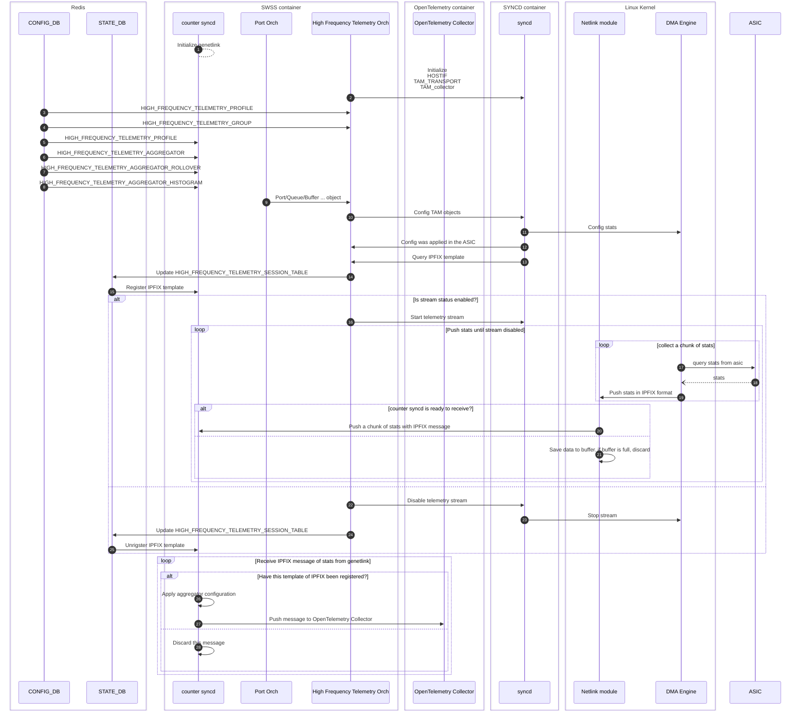
``` mermaid

sequenceDiagram
    autonumber
    box Redis
        participant config_db as CONFIG_DB
        participant state_db as STATE_DB
    end
    box SWSS container
        participant counter as counter syncd
        participant port_orch as Port Orch
        participant hft_orch as High Frequency Telemetry Orch
    end
    box OpenTelemetry container
        participant otel as OpenTelemetry Collector
    end
    box SYNCD container
        participant syncd
    end
    box Linux Kernel
        participant netlink_module as Netlink module
        participant dma_engine as DMA Engine
    end
    participant asic as ASIC

    counter --> counter: Initialize genetlink
    hft_orch ->> syncd: Initialize <br/>HOSTIF<br/>TAM_TRANSPORT<br/>TAM_collector<br/>

    config_db ->> hft_orch: HIGH_FREQUENCY_TELEMETRY_PROFILE
    config_db ->> hft_orch: HIGH_FREQUENCY_TELEMETRY_GROUP
    config_db ->> counter: HIGH_FREQUENCY_TELEMETRY_PROFILE
    config_db ->> counter: HIGH_FREQUENCY_TELEMETRY_AGGREGATOR
    config_db ->> counter: HIGH_FREQUENCY_TELEMETRY_AGGREGATOR_ROLLOVER
    config_db ->> counter: HIGH_FREQUENCY_TELEMETRY_AGGREGATOR_HISTOGRAM
    port_orch ->> hft_orch: Port/Queue/Buffer ... object

    hft_orch ->> syncd: Config TAM objects

    syncd ->> dma_engine: Config stats
    syncd ->> hft_orch: Config was applied in the ASIC
    syncd ->> hft_orch: Query IPFIX template
    hft_orch ->> state_db: Update HIGH_FREQUENCY_TELEMETRY_SESSION_TABLE
    state_db ->> counter: Register IPFIX template

    alt Is stream status enabled?

        hft_orch ->> syncd: Start telemetry stream

        loop Push stats until stream disabled
            loop collect a chunk of stats
                dma_engine ->> asic: query stats from asic
                asic --) dma_engine: stats
                dma_engine ->> netlink_module: Push stats in IPFIX format
            end
            alt counter syncd is ready to receive?
                netlink_module ->> counter: Push a chunk of stats with IPFIX message
            else
                netlink_module ->> netlink_module: Save data to buffer. if buffer is full, discard
            end
        end
    else
        hft_orch ->> syncd: Disable telemetry stream
        syncd ->> dma_engine: Stop stream
        hft_orch ->> state_db: Update HIGH_FREQUENCY_TELEMETRY_SESSION_TABLE
        state_db ->> counter: Unrigster IPFIX template
    end
    loop Receive IPFIX message of stats from genetlink
        alt Have this template of IPFIX been registered?
            counter ->> counter: Apply aggregator configuration
            counter ->> otel: Push message to OpenTelemetry Collector
        else
            counter ->> counter: Discard this message
        end
    end

```

### 7.7. SAI API

[SAI-Proposal-TAM-stream-telemetry.md](https://github.com/opencomputeproject/SAI/blob/master/doc/TAM/SAI-Proposal-TAM-stream-telemetry.md)

## 8. Configuration and management

### 8.1. Manifest (if the feature is an Application Extension)

N/A

### 8.2. CLI/YANG model Enhancements

#### 8.2.1. Config CLI

``` shell

# Add a new profile
sudo config hft add profile $profile_name --stream_state=$stream_state --poll_interval=$poll_interval --aggregator=$aggregator_name

# Change stream state
sudo config hft enable $profile_name
sudo config hft disable $profile_name

# Bind an aggregator to a profile
sudo config hft bind-aggregator $profile_name $aggregator_name
sudo config hft unbind-aggregator $profile_name

# Add an aggregator
sudo config hft add aggregator $aggregator_name --reporting_rate=$reporting_rate --rollover_counters="$group_name1|$object_counter1,$group_name2|$object_counter2" --heatmap_interval=$heatmap_interval --heatmap_counters="$group_name3|$object_counter3,$group_name4|$object_counter4"

# Add a width override for one enabled rollover counter
config hft add rollover <aggregator> --counter GROUP|COUNTER --bit_width N

# Delete the override; the still-enabled parent selector returns to the effective 32-bit width
config hft del rollover <aggregator> GROUP|COUNTER

# Add custom bounds for one selected heatmap counter
sudo config hft add histogram $aggregator_name --counter "PORT|OUT_CURR_OCCUPANCY_BYTES" --explicit_bounds 0,1024,4096,16384

# QUEUE|WRED_ECN_MARKED_PACKETS has no histogram row and uses the delta_count default layout
sudo config hft add aggregator heatmap_example --heatmap_interval=1000000 --heatmap_counters="PORT|OUT_CURR_OCCUPANCY_BYTES,QUEUE|WRED_ECN_MARKED_PACKETS"
sudo config hft add histogram heatmap_example --counter "PORT|OUT_CURR_OCCUPANCY_BYTES" --explicit_bounds 0,1024,4096,16384

# Add a monitor group
sudo config hft add group $profile_name --group_type=$group_name --object_names="$object1,$object2" --object_counters="$object_counters1,$object_counters2"

```

#### 8.2.2. Inspect stream CLI

Display HFT configuration or monitor counters from CounterSyncd:

``` shell
show hft configuration
show hft counters --stats-interval $seconds --max-stats-per-report $count
```

#### 8.2.3. YANG

[sonic-high-frequency-telemetry.yang](sonic-high-frequency-telemetry.yang)

### 8.3. Config DB Enhancements

[Config DB](#config-db)

### 8.4. Warmboot and Fastboot Design Impact

Warmboot/fastboot support is not required.

### 8.5. Memory Consumption

In addition to constant memory consumption, dynamic memory consumption can be adjusted by configuring the chunk size and chunk count of the high frequency telemetry profile table in the config DB.

$Dynamic Memory Consumption_{bytes} = \sum_{Profile} ({Chunk count} \times {Chunk Size} \times 8_{bytes} \times \sum_{Group} ({Object Count} \times {Stat Count}))$

### 8.6. Restrictions/Limitations

[Requirements / Constraints](#requirements--constraints)

### 8.7. Testing Requirements/Design

#### 8.7.1. Unit Test cases

- Test that the `HIGH_FREQUENCY_TELEMETRY_GROUP` can be correctly converted to the SAI objects and their corresponding SAI STAT IDs by the Orchagent.

#### 8.7.2. System Test cases

- Test that the counter can be correctly monitored by the counter syncd.
- Verify that the chunk size is accurate when reading messages from the netlink socket.
- By restarting counter syncd, verify whether the cached data during the restart corresponds to the chunk count.
- Ensure that counters can be correctly retrieved using the high frequency telemetry CLI.

### 8.8. Open/Action items - if any
