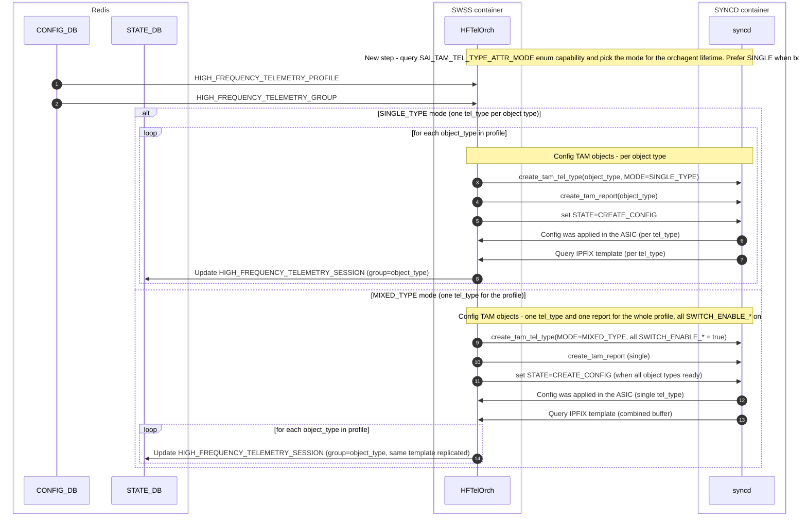
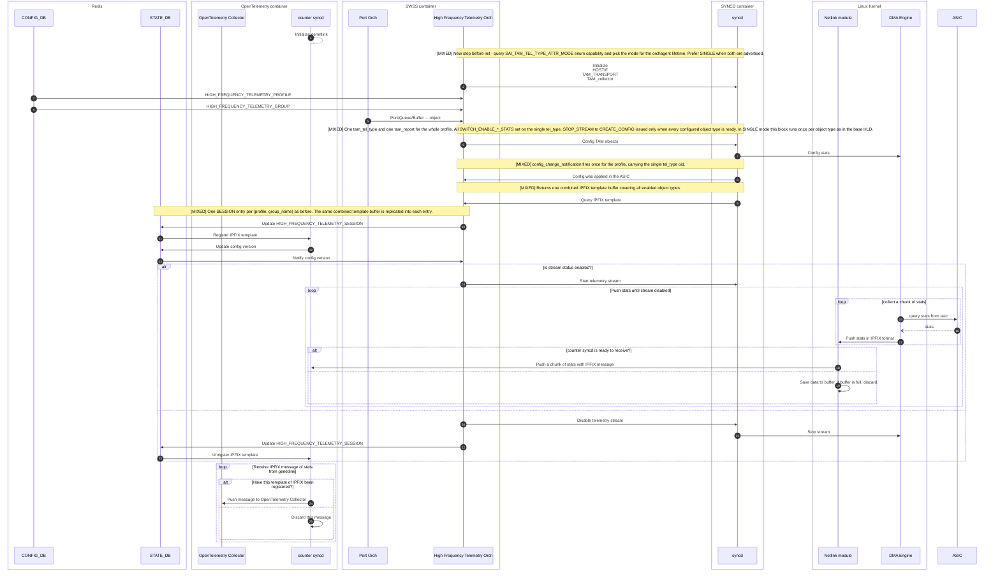

# High frequency telemetry - TAM telemetry type MIXED mode support <!-- omit in toc -->

## Table of Content <!-- omit in toc -->

- [1. Revision](#1-revision)
- [2. Scope](#2-scope)
- [3. Definitions/Abbreviations](#3-definitionsabbreviations)
- [4. Overview](#4-overview)
- [5. Requirements](#5-requirements)
- [6. Architecture Design](#6-architecture-design)
- [7. High-Level Design](#7-high-level-design)
  - [7.1. Mode auto-detection in HFTelOrch](#71-mode-auto-detection-in-hftelorch)
  - [7.2. HFTelProfile data structures](#72-hftelprofile-data-structures)
  - [7.3. Creating the tam\_tel\_type object](#73-creating-the-tam_tel_type-object)
  - [7.4. Collapsing the tam\_report object](#74-collapsing-the-tam_report-object)
  - [7.5. State machine](#75-state-machine)
  - [7.6. Config-ready notification and templates](#76-config-ready-notification-and-templates)
    - [7.6.1. CounterSyncd label resolution in MIXED](#761-countersyncd-label-resolution-in-mixed)
  - [7.7. STATE\_DB](#77-state_db)
  - [7.8. Work flow](#78-work-flow)
- [8. SAI API](#8-sai-api)
- [9. Configuration and management](#9-configuration-and-management)
  - [9.1. Manifest](#91-manifest)
  - [9.2. CLI/YANG model Enhancements](#92-cliyang-model-enhancements)
  - [9.3. Config DB Enhancements](#93-config-db-enhancements)
- [10. Warmboot and Fastboot Design Impact](#10-warmboot-and-fastboot-design-impact)
- [11. Memory Consumption](#11-memory-consumption)
- [12. Restrictions/Limitations](#12-restrictionslimitations)
- [13. Testing Requirements/Design](#13-testing-requirementsdesign)
  - [13.1. Unit Test cases](#131-unit-test-cases)
  - [13.2. System Test cases](#132-system-test-cases)
- [14. Open/Action items](#14-openaction-items)

## 1. Revision

| Rev | Date       | Author     | Change Description                            |
| --- | ---------- | ---------- | --------------------------------------------- |
| 0.1 | 2026-05-23 | David Zagury | Initial version - TAM tel_type MIXED mode  |

## 2. Scope

This document extends the existing [High frequency telemetry high level design](high-frequency-telemetry-hld.md) to add support for the `SAI_TAM_TEL_TYPE_MODE_MIXED_TYPE` mode of `sai_tam_tel_type`. It covers only orchagent-internal changes plus one contained internal extension to CounterSyncd's label-resolution path (§7.6.1). The CONFIG_DB schema, YANG model, CLI, STATE_DB schema, IPFIX wire format, the CounterSyncd public interface, and the OpenTelemetry exporter are unchanged.

## 3. Definitions/Abbreviations

The base HLD's abbreviations apply. Additional terms used in this document:

| Abbreviation | Description                                                                                              |
| ------------ | -------------------------------------------------------------------------------------------------------- |
| SINGLE_TYPE  | `SAI_TAM_TEL_TYPE_MODE_SINGLE_TYPE`: one `sai_tam_tel_type` object binds counters of exactly one type.   |
| MIXED_TYPE   | `SAI_TAM_TEL_TYPE_MODE_MIXED_TYPE`: one `sai_tam_tel_type` object binds counters of multiple types.      |
| HFT          | High frequency telemetry.                                                                                |

## 4. Overview

The current SONiC HFT implementation hardcodes `SAI_TAM_TEL_TYPE_ATTR_MODE = SAI_TAM_TEL_TYPE_MODE_SINGLE_TYPE` on every `sai_tam_tel_type` it creates. A SINGLE_TYPE tel_type binds counters of exactly one SAI object type, so the orchagent fans out to one tel_type per active object type (`SAI_OBJECT_TYPE_PORT`, `SAI_OBJECT_TYPE_BUFFER_POOL`, `SAI_OBJECT_TYPE_QUEUE`, `SAI_OBJECT_TYPE_INGRESS_PRIORITY_GROUP`) within a profile. MIXED_TYPE removes that per-tel_type restriction — a single tel_type can carry counters across all categories — collapsing the fan-out to one tel_type per profile.

Some vendor SAI implementations support only `SAI_TAM_TEL_TYPE_MODE_MIXED_TYPE`, in which a single tel_type carries counters across all categories. On those platforms HFT cannot be enabled today.

This document describes an additive change to `HFTelOrch` and `HFTelProfile` in `sonic-swss/orchagent/high_frequency_telemetry/`. The mode is selected automatically at orchagent initialization by querying the SAI capability. SINGLE_TYPE remains the default whenever the vendor advertises it, preserving today's behavior for existing platforms; MIXED_TYPE is chosen only when SINGLE_TYPE is not advertised.

## 5. Requirements

Requirements specific to MIXED_TYPE support, in addition to those listed in the base HLD's §5:

- The vendor SAI advertises at least one of `SAI_TAM_TEL_TYPE_MODE_SINGLE_TYPE` or `SAI_TAM_TEL_TYPE_MODE_MIXED_TYPE` through `sai_query_attribute_enum_values_capability` for `SAI_TAM_TEL_TYPE_ATTR_MODE`. If neither is advertised, HFT is disabled at orchagent init.
- In MIXED_TYPE mode the vendor SAI returns the IPFIX template through `SAI_TAM_TEL_TYPE_ATTR_IPFIX_TEMPLATES` on the single tel_type object, covering every counter category enabled via `SAI_TAM_TEL_TYPE_ATTR_SWITCH_ENABLE_*_STATS`. The buffer may contain a single IPFIX template set or - when the total exceeds the IPFIX 64KB message limit - multiple smaller template sets concatenated. CounterSyncd's template parser already handles both layouts.
- The `SAI_TAM_TEL_TYPE_ATTR_STATE` state machine operates on the single tel_type per profile; `sai_tam_tel_type_config_change_notification_fn` fires once per profile per transition into `SAI_TAM_TEL_TYPE_STATE_CREATE_CONFIG`.

Non-requirements:

- No CONFIG_DB, YANG, CLI, or STATE_DB schema changes.
- No CounterSyncd schema or public-interface changes. One internal extension to the label-resolution path is required so that the per-group sessions sharing a template_id in MIXED resolve correctly (see §7.6.1).
- No runtime mode switching - the chosen mode is fixed for the lifetime of the orchagent process.

## 6. Architecture Design

The architecture diagram from the [base HLD §6](high-frequency-telemetry-hld.md#6-architecture-design) is unchanged. The bulk of the change is internal to `Orchagent → High frequency telemetry Orch`; the SAI/syncd boundary, the CounterSyncd public interface, the OpenTelemetry container, and the Redis databases are unaffected. CounterSyncd's internal label-resolution path is extended to handle the MIXED-mode case where multiple per-group sessions share a template_id (§7.6.1).

## 7. High-Level Design

### 7.1. Mode auto-detection in HFTelOrch

`HFTelOrch::isSupportedHFTel(switch_id)` is extended to query the enum capability of `SAI_TAM_TEL_TYPE_ATTR_MODE` on `SAI_OBJECT_TYPE_TAM_TEL_TYPE` using `sai_query_attribute_enum_values_capability`. The selected mode is stored on `HFTelOrch` (e.g. `sai_tam_tel_type_mode_t m_tel_type_mode`) and passed to every `HFTelProfile` constructed by the orch.

Selection rules:

| Advertised values                | Selected mode | HFT enabled |
| -------------------------------- | ------------- | ----------- |
| `SINGLE_TYPE`                    | SINGLE_TYPE   | yes         |
| `SINGLE_TYPE` and `MIXED_TYPE`   | SINGLE_TYPE   | yes         |
| `MIXED_TYPE` only                | MIXED_TYPE    | yes         |
| neither                          | -             | no (logged) |

SINGLE_TYPE is preferred when both are advertised so that the behavior of all existing platforms is unchanged. This is consistent with the SAI specification, which declares `SAI_TAM_TEL_TYPE_MODE_SINGLE_TYPE` as the default value of `SAI_TAM_TEL_TYPE_ATTR_MODE`.

### 7.2. HFTelProfile data structures

`HFTelProfile` keeps its existing per-object-type maps:

```cpp
std::unordered_map<sai_object_type_t, sai_guard_t> m_sai_tam_tel_type_objs;
std::unordered_map<sai_object_type_t, sai_guard_t> m_sai_tam_report_objs;
std::unordered_map<sai_object_type_t, std::vector<std::uint8_t>> m_sai_tam_tel_type_templates;
std::unordered_map<sai_guard_t, sai_tam_tel_type_state_t> m_sai_tam_tel_type_states;
```

In SINGLE mode the maps are populated as today (one entry per active object type). In MIXED mode the same maps hold a single entry under a singleton key. The singleton `SAI_OBJECT_TYPE_NULL` is reserved for this purpose so that callers can keep using `object_type` as the lookup key:

- In SINGLE mode the accessors look up by `object_type` directly.
- In MIXED mode the accessors translate any `object_type` argument to the singleton before lookup.

This keeps callers in `deployCounterSubscription`, `notifyConfigReady`, the state machine, and the template accessors free of `if (mode == ...)` branching outside a small set of mode-aware helpers.

### 7.3. Creating the tam_tel_type object

`getTAMTelTypeObjID(object_type)` becomes mode-aware:

- **SINGLE mode** (unchanged): create one tel_type per object type, with exactly one of `SAI_TAM_TEL_TYPE_ATTR_SWITCH_ENABLE_PORT_STATS`, `SAI_TAM_TEL_TYPE_ATTR_SWITCH_ENABLE_MMU_STATS`, or `SAI_TAM_TEL_TYPE_ATTR_SWITCH_ENABLE_OUTPUT_QUEUE_STATS` set to `true` according to the object type. `SAI_TAM_TEL_TYPE_ATTR_MODE = SAI_TAM_TEL_TYPE_MODE_SINGLE_TYPE`.

- **MIXED mode**: on the first call, create a single tel_type with:
  - `SAI_TAM_TEL_TYPE_ATTR_TAM_TELEMETRY_TYPE = SAI_TAM_TELEMETRY_TYPE_COUNTER_SUBSCRIPTION`
  - `SAI_TAM_TEL_TYPE_ATTR_MODE = SAI_TAM_TEL_TYPE_MODE_MIXED_TYPE`
  - **All** applicable enable attributes set to `true`: `SAI_TAM_TEL_TYPE_ATTR_SWITCH_ENABLE_PORT_STATS`, `SAI_TAM_TEL_TYPE_ATTR_SWITCH_ENABLE_MMU_STATS`, `SAI_TAM_TEL_TYPE_ATTR_SWITCH_ENABLE_OUTPUT_QUEUE_STATS`.
  - `SAI_TAM_TEL_TYPE_ATTR_REPORT_ID` pointing to the single report object created in §7.4.

  Subsequent calls return the cached tel_type oid regardless of the `object_type` argument. The tel_type is added to `SAI_TAM_TELEMETRY_ATTR_TAM_TYPE_LIST` exactly once.

Setting all enable attributes (rather than only those required by the current profile) is acceptable because the actual counters streamed are constrained by the `sai_tam_counter_subscription` objects bound to the tel_type. Enabling categories that no subscription references has no functional effect.

### 7.4. Collapsing the tam_report object

`getTAMReportObjID(object_type)` is collapsed to a single report object per profile in MIXED mode: one tel_type → one report. Attributes (`SAI_TAM_REPORT_ATTR_TYPE = SAI_TAM_REPORT_TYPE_IPFIX`, `SAI_TAM_REPORT_ATTR_REPORT_MODE = SAI_TAM_REPORT_MODE_BULK`, `SAI_TAM_REPORT_ATTR_REPORT_INTERVAL`, `SAI_TAM_REPORT_ATTR_REPORT_INTERVAL_UNIT = SAI_TAM_REPORT_INTERVAL_UNIT_USEC`, `SAI_TAM_REPORT_ATTR_TEMPLATE_REPORT_INTERVAL = 0`) are unchanged.

### 7.5. State machine

The `SAI_TAM_TEL_TYPE_ATTR_STATE` state machine (`STOP_STREAM` ↔ `CREATE_CONFIG` ↔ `START_STREAM`) operates on each tel_type object. In SINGLE mode the orchagent advances per-type states independently, as today. In MIXED mode there is a single tel_type, so:

- `setStreamState(state)` issues exactly one SAI set call per transition.
- The transition `STOP_STREAM → CREATE_CONFIG` may only be issued when **every** object type currently configured on the profile reports `isMonitoringObjectReady(type) == true`. A helper `areAllMonitoringObjectsReady()` is added and used in place of the per-type check inside `setStreamState`.
- The transition `STOP_STREAM → START_STREAM` continues to require that the IPFIX template is present (now under the singleton key) and that monitoring objects are ready.

### 7.6. Config-ready notification and templates

`sai_tam_tel_type_config_change_notification_fn` is invoked by SAI when a tel_type completes `CREATE_CONFIG`. In MIXED mode the callback fires once per profile, with the single tel_type oid.

`HFTelProfile::getObjectType(tam_tel_type_obj)` returns the singleton in MIXED mode. `updateTemplates(tam_tel_type_obj)` queries `SAI_TAM_TEL_TYPE_ATTR_IPFIX_TEMPLATES` and stores the resulting buffer under the singleton key. `getTemplates(object_type)` returns that same buffer for every `object_type` requested by `HFTelOrch` when populating per-group STATE_DB session entries.

This means the combined IPFIX template returned by the single tel_type is **replicated** into each `HIGH_FREQUENCY_TELEMETRY_SESSION|profile|group_name` entry. CounterSyncd's existing template-set parser handles both single-template and multi-template-set buffers, so no parser change is needed. The replication does require an extension to CounterSyncd's label-resolution path, since multiple per-group sessions now share a template_id; see §7.6.1.

### 7.6.1. CounterSyncd label resolution in MIXED

CounterSyncd resolves IPFIX data-record fields to SAI counter identities by looking up each field's IPFIX element ID (the per-object label assigned by `HFTelProfile`) against the `object_names` list of the STATE_DB session that owns the template. In SINGLE mode each `sai_tam_tel_type` carries its own template_id, so there is exactly one session per template_id and the lookup is unambiguous.

In MIXED mode the orchagent replicates the combined IPFIX template into every per-group `HIGH_FREQUENCY_TELEMETRY_SESSION_TABLE` entry (§7.6), so all per-group sessions of a profile share a template_id. A resolution that consults only one session per template_id would correctly resolve labels owned by that session, but labels owned by sibling sessions (for example a PORT label seen when the QUEUE session won CounterSyncd's internal `template_id → session` race) would fall back to `unknown_<label>`.

CounterSyncd handles this with a per-session `session_template_ids` set that records every template_id a session registered. At per-record lookup time it unions the `object_id_name_map` entries of all sessions sharing the record's template_id and resolves the label against that union.

The aggregation is unambiguous because in MIXED mode the orchagent allocates labels from a per-profile monotonic counter (`HFTelProfile::m_next_label`, see §12), so two sessions within the same profile never share a label. In SINGLE mode each template_id has exactly one registering session, the aggregation collapses to that session's lookup, and behavior is identical to the pre-MIXED resolution path.

The CounterSyncd public interface — `HIGH_FREQUENCY_TELEMETRY_SESSION_TABLE` schema, IPFIX wire format, OpenTelemetry export — is unchanged. The extension is internal to CounterSyncd's IPFIX data-record processing path.

### 7.7. STATE_DB

The `HIGH_FREQUENCY_TELEMETRY_SESSION` schema from the base HLD §7.5.1 is unchanged. In MIXED mode the orchagent writes the same `session_config` (the combined IPFIX template) into every per-group entry that the profile produces, and writes per-group `object_names` / `object_ids` lists as today.

Operators and tooling that read these entries continue to see one entry per (profile, group_name). The duplication of `session_config` across entries in MIXED mode is intentional and documented here so that future maintainers do not interpret the equality as a bug.

### 7.8. Work flow

The base HLD §7.6 sequence diagram applies. The differences in MIXED mode are:

- `hft_orch ->> syncd: Config TAM objects` happens once per profile (instead of once per object type).
- `syncd ->> hft_orch: Config was applied in the ASIC` fires once per profile.
- `syncd ->> hft_orch: Query IPFIX template` returns one combined template.
- `hft_orch ->> state_db: Update HIGH_FREQUENCY_TELEMETRY_SESSION` still fires once per (profile, group_name), with the combined template replicated into each entry.

**Diagram A - focused SINGLE vs MIXED comparison.**
Strips the diagram down to the orchagent/syncd interactions that change between modes.



**Diagram B - full work flow with MIXED-mode annotations.**
Mirrors the base HLD §7.6 diagram end to end. Steps whose semantics differ in MIXED mode are flagged with adjacent `[MIXED]` Note blocks; everything else is identical to SINGLE mode and to the base HLD.



## 8. SAI API

No new SAI APIs are introduced. The change uses existing attributes:

- `sai_tam_tel_type_mode_t` (see `sai_tam_tel_type_mode_t` enum in `saitam.h`), with values `SAI_TAM_TEL_TYPE_MODE_SINGLE_TYPE` and `SAI_TAM_TEL_TYPE_MODE_MIXED_TYPE`.
- `SAI_TAM_TEL_TYPE_ATTR_MODE` - `CREATE_ONLY`, default `SAI_TAM_TEL_TYPE_MODE_SINGLE_TYPE`.
- `SAI_TAM_TEL_TYPE_ATTR_SWITCH_ENABLE_PORT_STATS`, `SAI_TAM_TEL_TYPE_ATTR_SWITCH_ENABLE_MMU_STATS`, `SAI_TAM_TEL_TYPE_ATTR_SWITCH_ENABLE_OUTPUT_QUEUE_STATS` - set together on the MIXED tel_type.
- `SAI_TAM_TEL_TYPE_ATTR_IPFIX_TEMPLATES` - returns the combined template in MIXED mode.
- `sai_query_attribute_enum_values_capability` - already used elsewhere in `HFTelOrch::isSupportedHFTel`.

See the SAI proposal ["Query telemetry type capability"](https://github.com/opencomputeproject/SAI/blob/master/doc/TAM/SAI-Proposal-TAM-stream-telemetry.md#query-telemetry-type-capability) for the canonical capability-query pattern.

## 9. Configuration and management

### 9.1. Manifest

N/A - HFT is a built-in feature; this enhancement does not change that.

### 9.2. CLI/YANG model Enhancements

No CLI changes. No changes to [sonic-high-frequency-telemetry.yang](sonic-high-frequency-telemetry.yang).

### 9.3. Config DB Enhancements

No changes to CONFIG_DB. The chosen mode is not user-visible - it is auto-selected from SAI capability at orchagent init.

## 10. Warmboot and Fastboot Design Impact

Warm/fast boot is not required for HFT per the base HLD §8.4. This enhancement does not change that.

## 11. Memory Consumption

In MIXED mode the orchagent holds one `sai_tam_tel_type` and one `sai_tam_report` per profile instead of up to four of each. The number of `sai_tam_counter_subscription` objects, the IPFIX template buffer size (per profile total), and CounterSyncd buffering are unchanged. The dynamic memory formula in the base HLD §8.5 still applies.

## 12. Restrictions/Limitations

Limitations introduced by this design:

- The TAM tel_type mode is chosen at orchagent init from SAI capability and cannot be changed at runtime.
- In MIXED mode all three `SAI_TAM_TEL_TYPE_ATTR_SWITCH_ENABLE_*_STATS` flags supported by SONiC HFT (PORT, MMU, OUTPUT_QUEUE) are enabled on the single tel_type even if a given profile only references a subset of object types. The streamed counters remain constrained by `sai_tam_counter_subscription` objects.
- If the vendor SAI advertises neither `SINGLE_TYPE` nor `MIXED_TYPE` for `SAI_TAM_TEL_TYPE_ATTR_MODE`, HFT is disabled at orchagent init and a notice is logged.
- In MIXED mode the per-profile IPFIX label allocator (`HFTelProfile::m_next_label`) is monotonic and never reuses values. Because the label field is 16-bit (`sai_uint16_t`), at most 65 535 distinct objects may be subscribed to a single profile over its lifetime; profiles approaching this limit must be deleted and recreated to reset the counter. The limit is per profile and per orchagent lifetime, so warm-restart or orchagent restart implicitly resets it. This monotonic allocation is what guarantees label uniqueness across all per-group sessions of a profile, on which CounterSyncd's label-resolution path in §7.6.1 depends.

Vendor-specific limitations inherited from the underlying SAI implementation. These are not introduced by this design but are surfaced by it on platforms that only support MIXED_TYPE:

- **Maximum number of concurrent active HFT profiles.** A vendor SAI may limit `SAI_TAM_ATTR_TELEMETRY_OBJECTS_LIST` (TAM Telemetry objects bound to a TAM) and/or the number of concurrent HFT streaming sessions in its SDK. When SONiC defines additional `HIGH_FREQUENCY_TELEMETRY_PROFILE` entries beyond the vendor's limit, the `create_tam_telemetry` call for the excess profiles will fail. SONiC operators should consult the platform's vendor documentation for the supported concurrency and enable streaming for at most that many profiles at once.
- **Uniform stats per object type.** Some vendor SAIs read the same stats for every object of a given type. The orchagent already assumes this - `HFTelGroup` applies the same `stats_ids` set to every object in the group - so no design change is needed.
- **Stats mode support.** Vendors that do not support `SAI_STATS_MODE_READ_AND_CLEAR` will reject subscriptions for stats that require it. The orchagent already selects the per-stat mode via `HFTelUtils::get_stats_mode`.
- **Platform / port constraints.** Some vendor platforms restrict HFT to specific ASIC generations or port configurations (e.g. excluding certain lane widths). These are surfaced by the SAI capability queries and / or by `create_*` failures, and are transparent to the orchagent design.

## 13. Testing Requirements/Design

### 13.1. Unit Test cases

Implemented in `sonic-swss/tests/mock_tests/`:

- Mode selection: mock `sai_query_attribute_enum_values_capability` to return (a) SINGLE only, (b) MIXED only, (c) both, (d) neither. Assert that `HFTelOrch` selects SINGLE in (a) and (c), MIXED in (b), and disables HFT in (d).
- MIXED mode SAI calls: assert exactly one `create_tam_tel_type` and one `create_tam_report` call per profile, with `SAI_TAM_TEL_TYPE_ATTR_MODE = SAI_TAM_TEL_TYPE_MODE_MIXED_TYPE` and all three `SAI_TAM_TEL_TYPE_ATTR_SWITCH_ENABLE_*_STATS` set to `true`.
- MIXED mode state machine: assert that `STOP_STREAM → CREATE_CONFIG` is not issued until every configured object type is ready, and is issued exactly once when the last one becomes ready.
- MIXED mode template propagation: with two groups configured (e.g. PORT and QUEUE), assert that the same combined IPFIX template buffer is written to both `HIGH_FREQUENCY_TELEMETRY_SESSION|profile|PORT` and `HIGH_FREQUENCY_TELEMETRY_SESSION|profile|QUEUE` entries.
- SINGLE mode regression: the existing tests continue to pass without modification.

### 13.2. System Test cases

Implemented in `sonic-swss/tests/` using DVS:

- Run the existing HFT DVS tests against a virtual switch that simulates a MIXED-only SAI capability. Verify:
  - Counters reach CounterSyncd through the genetlink path.
  - STATE_DB session entries are populated for each configured group with non-empty `session_config`, `object_ids`, and `object_names`.
  - The inspect-stream CLI returns the expected counters per group without modification.
- Run the same tests against a virtual switch advertising both modes. Verify that SINGLE_TYPE is selected and existing behavior is preserved.

## 14. Open/Action items

None.
