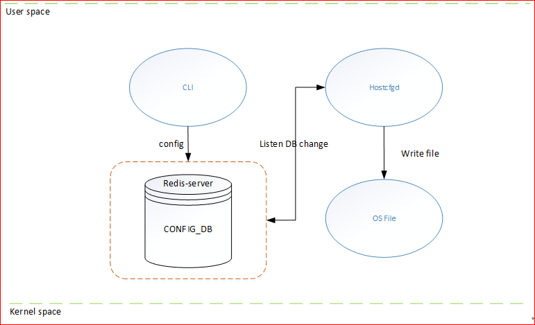
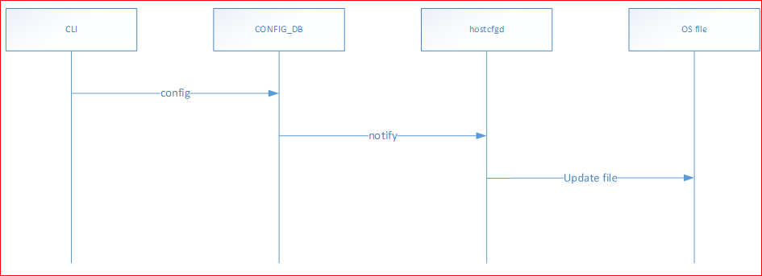
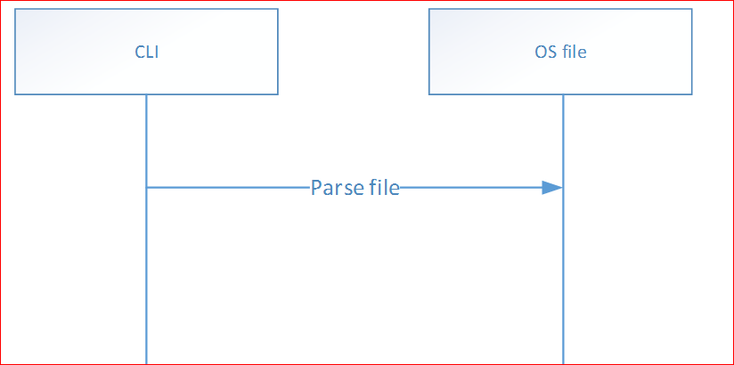

# Host Access Control HLD #

## 1.Table of Content 
- [1.1. Revision](###revision)
- [1.2. Scope](###scope)
- [1.3. Definitions/Abbreviations](###definitions/abbreviations)
- [1.4. Overview](###0verview)
- [1.5. Requirements](###requirements)
- [1.6. Architecture Design](###architecture_design)
- [1.7. High-Level Design](###high-level_design)
- [1.8. SAI API](###SAI_API)
- [1.9. Configuration and management ](###Configuration_and_management)
	- [1.9.1. CLI/YANG model Enhancements ](###CLI/YANG_model_Enhancements)
		- [1.9.1.1. CLI](#####CLI)
		- [1.9.1.2. J2](#####j2)
		- [1.9.1.3. YANG](#####yang)
	- [1.9.2. Config DB Enhancements ](####Config_DB_Enhancements)
- [1.10. Warmboot and Fastboot Design Impact](###Warmboot_and_Fastboot_Design_Impact)
- [1.11. Memory Consumption](###Memory_Consumption)
- [1.12. Restrictions/Limitations](###Restrictions/Limitations)
- [1.13. Testing Requirements/Design](###Testing_Requirements/Design)
	- [1.13.1. Unit Test cases](###Unit_Test_cases)
	- [1.13.2. System Test cases](###System_Test_cases)
- [1.14. Open/Action items - if any](###Open/Action_items)

### 1.1. Revision 
| Rev | Date       | Author     | Description     |
|:---:|:----------:|:----------:|:----------------|
| 0.1 | 08/20/2024 | PinghaoQu  | Initial version | 

### 1.2. Scope  

This hld doc for host access control configurations describes the requirements, architecture and general flow details of host access control config in SONIC OS based switches.

### 1.3. Definitions/Abbreviations 

NA.

### 1.4. Overview 

The host access control function controls client access to the host by modifying two Linux system files (/etc/hosts.allow, /etc/hosts.deny). Each access control file consists of zero or more lines of text.These lines are processed in order of appearance. The search terminates when a match is found.

    • A newline character is ignored when it is preceded by a backslash character. 
    • Blank lines or lines that begin with a `#´ character are ignored.  
    • All other lines should satisfy the following format:
	    daemon_list : client_list
daemon_list is a list of one or more daemon process names. daemons that use *libwrap* are supportted. You can use the command *ldd daemon | grep libwrap* to check if the daemon is supported. this time, only support sshd.

client_list is a list of one or more host addresses, network addresses, wildcards(only support string "ALL")

/etc/hosts.allow: (daemon,client) pairs that are granted access.

/etc/hosts.deny: (daemon,client) pairs that are denied access.

The access control software consults two files. The search stops at the first match:

    • Access will be granted when a (daemon,client) pair matches an entry in the /etc/hosts.allow file.
    • Otherwise, access will be denied when a (daemon,client) pair matches an entry in the /etc/hosts.deny file.
    • Otherwise, access will be granted.

A non-existing access control file is treated as if it were an empty file. Thus, access control can be turned off  by providing no access control files.

See the manual pages hosts_access(5) for further information.

### 1.5. Requirements

By modifying the host access control files, we can control client access to the host. This time, the main goal is to restrict clients from accessing the host via **SSH**, so we configure the daemon to support only ***sshd*** through the command line. However, this can easliy be extended int the future to support other protocol daemons supported by ***hosts_access***.

### 1.6. Architecture Design 

The overall architecture of SONiC will remain unchanged, and no new sub-modules will be introduced. The modifications will be limited to the CLI and CONFIG-DB to support the new configuration. Additionally, hostcfgd will be updated to subscribe to the newly added CONFIG-DB entries and generate a new hosts_access configuration file based on the j2 template file.

### 1.7. High-Level Design 

We will modify few touch few areas in the system:

  1. sonic-utilites - Add hosts-access configuration and show command
  2. config-db -  to include a dedicated table(HOSTS\_ACCESS\_TABLE) for configurations
  3. hostcfg daemon - to update host access control files once configDB relevant areas are modified
  4. OS files - specific for this stage, only /etc/hosts.allow and /etc/hosts.deny is going to be modifed by the hostcfg demon.

Config flow:

Users modify HOSTS\_ACCESS table in config_db through the CLI.

Hostcfgd subscribes HOSTS\_ACCESS table. When there are changes in this table in config_db, hostcfgd updates the host access control files using j2 template files based on the changes.

Show runningconfig flow:

Users execute the show commands, parse the host access control files ,and outputs the runingconfig data in the specified format.

### 1.8. SAI API 

NA.

### 1.9. Configuration and management 

#### 1.9.1. CLI/YANG model Enhancements 

##### 1.9.1.1. CLI

**config commands**

This command is to add or delete one or more clients that are granted or denied access to the daemon.

  Usage:

	config hosts-access <add | del> <access_type> <daemon> <client...>

  Parameters:

	<access_type> : access control type, only "allow" and "deny' are supported.
	<daemon>      : daemon name, currently, only "sshd" is supported.
	<client...>   : this parameter can be entered multiple times,It can be a host address, network address , or string “ALL” . clients that are granted/denied access. 
	
  Notes:

	1.Add commands can be configured multiple times, with each configuration specifying multiple clients. The configured clients will take effect by being appended in the configuration file. If the clients parameter includes ALL, it will directly override all others and take effect as ALL.
	2.Del commands can be configured multiple times, with each configuration specifying multiple clients.The configured clients are matched one by one in the configuration file and deleted if matched.
	3.The configuration takes effect immediately after being written to the configuration file, but does not affect existing sessions.
	4.The host access control file requires that when the input is a subnet with a mask(e.g.:1.1.1.0/24), the host bits must be all zeros. Therefore, if the host bits entered by the user are not all zeros(e.g.:1.1.1.1/24), the command line will convert them to all zeros(e.g.: 1.1.1.0/24).
	
 
  Example:

	admin@sonic:~$ config hosts-access add allow sshd 1.1.1.1 2.2.2.0/24
	admin@sonic:~$ config hosts-access add allow sshd 3.3.3.3 2001:db8:abcd::/64 6.6.6.6/16
	admin@sonic:~$ config hosts-access add deny sshd ALL

**show commands**

This command displays the runningconfig data.

  Usage:

	show runningconfig hosts-access

  Example:

	admin@sonic:~$Show runningconfig hosts_access
	Daemon    Allow_clients                    Deny_clients
	sshd      1.1.1.1 3.3.3.3                 ALL
	          2.1.1.0/24 2001:db8:abcd::/64

##### 1.9.1.2. j2
	
/etc/hosts.allow.j2:

	
	
	{{ daemon }}:{{ clients | join(' ') }}
	
	

/etc/hosts.deny.j2:	

	
	
	{{ daemon }}:{{ clients | join(' ') }}
	
	

##### 1.9.1.3. YANG
	//filename:  sonic-hosts_access.yang
	module sonic-hosts_access {
	    yang-version 1.1;
	    namespace "http://github.com/Azure/sonic-hosts_access";
	    prefix hosts-access;
	
	    import ietf-inet-types {
		prefix inet;
	    }
	
	    description "hosts access CONFIG YANG Module for SONiC OS";
	
	    revision 2024-08-16 {
	        description
	            "First Revision";
	    }
	
	    typedef access-type {
	        description "access type";
	        type enumeration {
	            enum "allow";
	            enum "deny";
	        }
	    }
	
	    typedef daemon-type {
	        description "daemon type";
	        type enumeration {
	            enum "sshd";
	        }
	    }
	    container sonic-hosts_access {
			container HOSTS_ACCESS {
				list access_type_list {
					key "access_type";
					leaf access_type {
						type access-type;
						description "Access type of HOSTS_ACCESS, allow|deny.";
					}
					list daemon_list {
						key "daemon_name";
						leaf daemon_name {
							type daemon-type;
							description "daemon process name,  sshd.";
						}
						leaf-list clients {
							type union {
								type inet:ipv4-address;
								type inet:ipv6-address;
								type inet:ipv4-prefix;
								type inet:ipv6-prefix;
								type string {
									pattern "ALL";
								}
							}
							description "A list of addresses allowed/denied to access daemon, which can include IPv4/IPv6 addresses, prefixes, or the string 'ALL'.";
						}
					}/*list daemon_name */
				}/*list access_type */
			} /* container HOSTS_ACCESS  */
	    }/* container sonic-hosts-access */
	}/* end of module sonic-hosts-access */

#### 1.9.2. Config DB Enhancements  

ConfigDB schemas:

	; Defines schema for HOSTS_ACCESS configuration attributes in HOSTS_ACCESS table:
	; The key can be any of the following: "allow", "deny"
	key          = 1*32VCHAR  ;access type
	; field      = value
	; The field name is variable and represents the daemon process name. It supports daemon processes that use libwrap.Currently, only sshd is suppored.
	<daemon>       = *STRING; List of clients that are granted/denied access. It can be a host address, network address , or string “ALL” 

The ConfigDB will be extended with next objects::

	{
		HOSTS_ACCESS:{
			allow:{
				"sshd ": [
						“1.1.1.1”,
						“2.1.1.0/24”,
						“A::1”,
						"2001:db8:abcd::/64"
				],
			},
			deny:{
				"sshd ": [
						“ALL”
				],
			}
		}
	}

		
### 1.10. Warmboot and Fastboot Design Impact  
NA

### 1.11. Memory Consumption
NA
### 1.12. Restrictions/Limitations  

### 1.13. Testing Requirements/Design  

#### 1.13.1. Unit Test cases  
sonic-utilities

	1. Validate command parameters; Entry the correct parameters and verify the entries in config_db is expected. Incorrect parameters entered, command line returns error message.
	2. Verify the output for the show commands is expected.

hostcfgd:
		
	Based on the specified JSON data and j2 template, the host access control files (/etc/hosts.allow, /etc/hosts.deny) that is expected can be generated.

#### 1.13.2. System Test cases
	
	1. Verify the scope of host access control permissions matches the scope of command line configuration.
	2. Test access control for compliance with hosts_access rules:
	    • Access will be granted when a (daemon,client) pair matches an entry in the /etc/hosts.allow file.
	    • Otherwise, access will be denied when a (daemon,client) pair matches an entry in the /etc/hosts.deny file.
	    • Otherwise, access will be granted.

### 1.14. Open/Action items - if any 
	
NOTE: All the sections and sub-sections given above are mandatory in the design document. Users can add additional sections/sub-sections if required.
