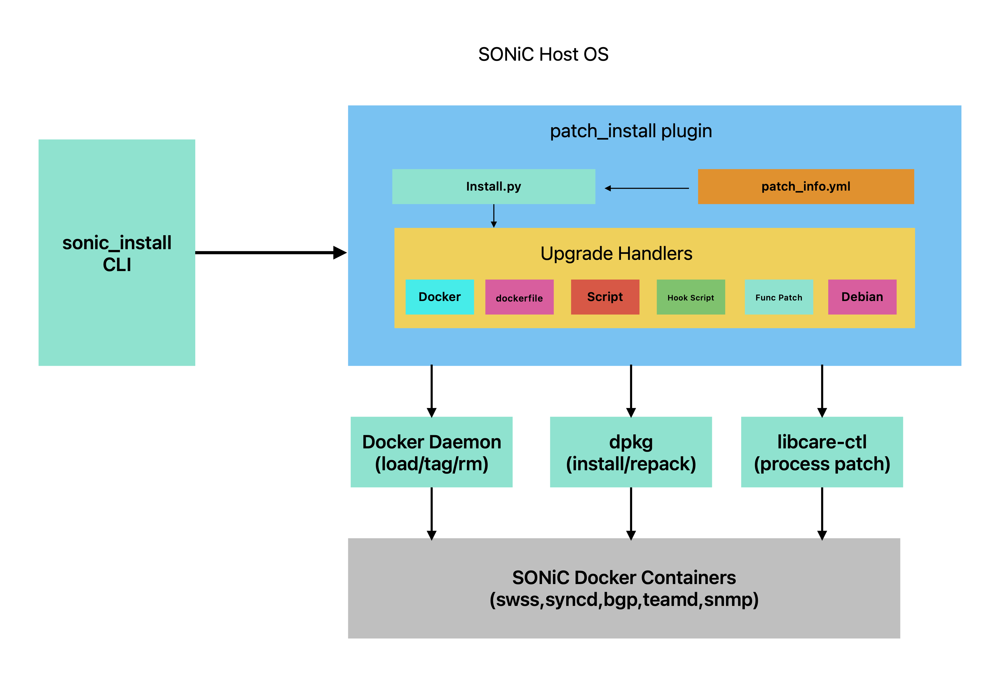

# SONiC Hotpatch HLD

## Table of Content

- [1. Revision](#1-revision)
- [2. Scope](#2-scope)
- [3. Definitions/Abbreviations](#3-definitionsabbreviations)
- [4. Overview](#4-overview)
- [5. Requirements](#5-requirements)
- [6. Architecture Design](#6-architecture-design)
- [7. High-Level Design](#7-high-level-design)
  - [7.1 Patch Packaging Model](#71-patch-packaging-model)
  - [7.2 Patch Metadata Format](#72-patch-metadata-format)
  - [7.3 Patch Type Details](#73-patch-type-details)
  - [7.4 Installation Flow](#74-installation-flow)
  - [7.5 Rollback Mechanism](#75-rollback-mechanism)
  - [7.6 Build Pipeline](#76-build-pipeline)
  - [7.7 Repository Changes](#77-repository-changes)
  - [7.8 Serviceability and Debug](#78-serviceability-and-debug)
- [8. SAI API](#8-sai-api)
- [9. Configuration and Management](#9-configuration-and-management)
  - [9.1 CLI Enhancements](#91-cli-enhancements)
  - [9.2 CLI/YANG Model Enhancements](#92-cliyang-model-enhancements)
  - [9.3 Config DB Enhancements](#93-config-db-enhancements)
- [10. Warmboot and Fastboot Design Impact](#10-warmboot-and-fastboot-design-impact)
- [11. Memory Consumption](#11-memory-consumption)
- [12. Restrictions/Limitations](#12-restrictionslimitations)
- [13. Testing Requirements/Design](#13-testing-requirementsdesign)
  - [13.1 Unit Test Cases](#131-unit-test-cases)
  - [13.2 System Test Cases](#132-system-test-cases)
  

### 1. Revision


| Rev |    Date    |   Author   | Change Description |
| :-: | :--------: | :--------: | :----------------- |
| 0.1 | 2026-05-06 | Kang Jiang | Initial version    |

### 2. Scope

This document covers the high-level design of the SONiC Hotpatch feature, which enables applying software patches to a running SONiC system without requiring a full image upgrade or reboot. The scope includes:

- Six patch types: docker image replacement, Debian package upgrade, script deployment, hook script execution, function-level live patching, and Dockerfile-based image building
- Hierarchical patch packaging model (Hotfix Package -> Sub-patches -> Packages)
- Integration with `sonic_installer patch_install` CLI
- Automatic backup and ordered rollback mechanism
- Patch build pipeline tooling

### 3. Definitions/Abbreviations


| Term           | Definition                                                                            |
| :------------- | :------------------------------------------------------------------------------------ |
| Hotpatch       | A software patch applied to a running system without a full reboot                    |
| Hotfix Package | The top-level distributable archive containing one or more sub-patches                |
| Sub-patch      | An individual patch unit within a Hotfix Package, containing packages and metadata    |
| func_hotpatch  | Function-level binary patching applied to a running process in-memory                 |
| libcare-ctl    | Userspace live-patching tool for applying binary patches to running processes         |
| kpatch         | Binary patch file format (`.kpatch`) used for function-level hotpatching              |
| dpkg-repack    | Tool to recreate a`.deb` package from an installed Debian package (used for rollback) |
| patch_info.yml | YAML manifest describing patch metadata, package list, checksums, and types           |
| summary.yml    | YAML file tracking the ordered list of sub-patches within a Hotfix Package            |

### 4. Overview

Production SONiC switches frequently require urgent bug fixes and security patches. Full image upgrades cause significant downtime, and even warm-reboot introduces control-plane disruption. The Hotpatch feature provides a targeted, surgical patching mechanism with minimal or zero service impact.

The hotpatch system provides a hierarchical packaging and installation framework that supports six distinct patch types, each targeting a different layer of the SONiC software stack:


| Patch Type    | Target Layer                   | Service Disruption      |
| :------------ | :----------------------------- | :---------------------- |
| docker        | Docker container image         | Brief (service restart) |
| debian        | Debian package                 | None to minimal         |
| script        | File on host filesystem        | None                    |
| hook_script   | Custom logic with run/rollback | Depends on script       |
| func_hotpatch | Running process (in-memory)    | None (zero-downtime)    |
| dockerfile    | Docker image (cold build)      | None until reboot       |

The feature operates as a plugin to the existing `sonic_installer` framework. Patches are distributed as self-contained tar.gz archives with embedded integrity verification and automatic rollback on failure.

### 5. Requirements

#### Functional Requirements

1. Support six patch types: `docker`, `debian`, `script`, `hook_script`, `func_hotpatch`, `dockerfile`
2. Hierarchical packaging: Hotfix Packages contain ordered sub-patches; sub-patches contain ordered packages
3. Cumulative patching: A new Hotfix Package aggregates all prior sub-patches (e.g., Hotfix3 includes sub-Hotfix1, sub-Hotfix2, sub-Hotfix3)
4. OS version compatibility checking before installation, supporting operators: `=`, `>=`, `>`, `<=`, `<`
5. MD5 checksum verification for every package within a sub-patch
6. Automatic backup before each package installation (docker image IDs, dpkg-repack, file copies)
7. Ordered rollback on failure: if package N fails, packages 0..N-1 are rolled back in reverse order
8. Uninstall capability: full reverse-order rollback of all packages
9. `func_hotpatch` duplicate detection: skip if same PatchId is already applied to a process
10. Integration with `sonic_installer patch_install <patch.tar.gz>` CLI
11. Syslog logging of all installation steps
12. Support for `RestartForActive` flag (cold-upgrade patches that activate on next reboot)
13. Background progress prompting for long-running patch operations

#### Non-Functional Requirements

1. Zero data-plane disruption for `func_hotpatch`, `script`, `hook_script`, and `debian` types
2. Minimal data-plane disruption for `docker` type (only during service restart)
3. Atomic per-package semantics: each package either fully installs or fully rolls back
4. Compatible with both Python 2 and Python 3 runtimes

### 6. Architecture Design

The hotpatch feature does not change the existing SONiC architecture. It operates as a plugin to the `sonic_installer` framework.

When `sonic_installer patch_install <patch.tar.gz>` is invoked, the system extracts the patch archive and dynamically imports `install.py` from within it. The plugin exposes a well-defined interface contract:

```python
# Return values
SUCCESS = 0
FAIL = 1

# Mandatory exports
get_patch_name()       # Returns patch name string
get_patch_desc()       # Returns patch description string
do_patch_install()     # Executes patch installation, returns (status, output)
do_patch_uninstall()   # Executes patch uninstallation, returns (status, output)
```

The following diagram shows how the hotpatch system fits within the SONiC architecture:



### 7. High-Level Design

#### 7.1 Patch Packaging Model

The hotpatch system uses a two-tier hierarchical packaging model:

**Tier 1: Hotfix Package** (e.g., `Hotfix3-SONiC-rel-x.y.z.tar.gz`)

- Top-level distributable archive
- Contains a `summary.yml` tracking all sub-patches with MD5 checksums
- Contains one or more sub-patch archives
- Cumulative: each new Hotfix includes all prior sub-patches
- Accompanied by `.tar.gz.md5` file for integrity verification

**Tier 2: Sub-patch** (e.g., `sub-Hotfix1.tar.gz`)

- Self-contained patch unit
- Contains `patch_info.yml` manifest
- Contains `install.py` (the installation plugin)
- Contains actual package files (docker images, .deb files, scripts, .kpatch files, Dockerfiles)

```
Hotfix3-SONiC-rel-x.y.z.tar.gz
|-- summary.yml
|-- sub-Hotfix1.tar.gz
|   |-- patch_info.yml
|   |-- install.py
|   +-- hook_script_disable_queue_watermark.sh
|-- sub-Hotfix2.tar.gz
|   |-- patch_info.yml
|   |-- install.py
|   +-- docker-swss.tar.gz
+-- sub-Hotfix3.tar.gz
    |-- patch_info.yml
    |-- install.py
    |-- orchagent_xxx.kpatch
    +-- zebra_yyy.kpatch
```

**summary.yml format:**

```yaml
os_version: SONiC-rel-x.y.z
patches:
  - name: sub-Hotfix1.tar.gz
    md5sum: <md5_hash>
  - name: sub-Hotfix2.tar.gz
    md5sum: <md5_hash>
  - name: sub-Hotfix3.tar.gz
    md5sum: <md5_hash>
```

#### 7.2 Patch Metadata Format

Each sub-patch contains a `patch_info.yml` manifest with the following schema:

```yaml
Patch name: <internal_name>.tar.gz
Patch extern name: <external_display_name>          # Optional, shown in `show version`
Patch description: <description_text>
Patch type: <normal|hotpatch>
SONiC version: <version_pattern>                   # Supports operators: =/>=/>/<=/< (default =)
Previous patch: <name_of_previous_patch>            # Optional, for dependency tracking
Packages:
  - Package: <file_path>
    Type: <docker|debian|script|hook_script|func_hotpatch|dockerfile>
    Md5sum: <md5_checksum>
    # Type-specific fields (see below)
```

**Patch type semantics:**

- **`normal`**: Standard patch. The patch archive is not persisted after installation; it will not be re-applied automatically after a system reboot.
- **`hotpatch`**: Hotpatch patch. The patch archive is copied to `/usr/share/sonic/hotpatches/` during installation. After a system reboot, the `hotpatches-auto-install` service automatically re-applies all hotpatches in order.

**Type-specific fields:**


| Type          | Required Fields                                     |
| :------------ | :-------------------------------------------------- |
| docker        | Name, Version, Service, RestartForActive (optional) |
| debian        | Name                                                |
| script        | Target directory                                    |
| hook_script   | (none)                                              |
| func_hotpatch | ProcessName, PatchId                                |
| dockerfile    | Name, Version, Service                              |

**Optional flags (all types):**

- `Background prompt`: yes/no - enables progress prompts for long-running operations

#### 7.3 Patch Type Details

##### 7.3.1 Docker Image Replacement (`docker`)

**Install flow:**

1. Save current docker image ID to `backup/<repo>_orig_image_id`
2. Remove current `:latest` tag: `docker rmi <repo>:latest`
3. Load new image: `docker load < <image_file>`
4. Restart service: `systemctl stop/start <service>`
5. Tag with version: `docker tag <repo>:latest <repo>:<version>`

**Cold-upgrade mode** (when `RestartForActive=True`):

1. Load new image and tag (no service restart)
2. Create flag file: `/etc/sonic/boot_from_docker_image_<service>`
3. Patch becomes active after next reboot

**Rollback:** Re-tag original image ID as `:latest`, restart service.

**Special handling:** SNMP service uses timer-based startup pattern requiring different restart logic.

##### 7.3.2 Debian Package Upgrade (`debian`)

**Install flow:**

1. Backup current package: `dpkg-repack <package_name>` to `backup/`
2. Remove old package: `dpkg -r <package_name>`
3. Install new package: `dpkg -i <new_deb_file>`

**Rollback:** Remove new package, install backed-up .deb from `backup/`.

##### 7.3.3 Script Deployment (`script`)

**Install flow:**

1. Backup existing target file to `backup/` (preserving path structure)
2. Copy permissions and ownership from target to new file
3. Copy new file to target directory: `cp -p <file> <target_dir>/`

**Rollback:** Restore original file from backup; if no backup exists, remove the deployed file.

##### 7.3.4 Hook Script Execution (`hook_script`)

**Install flow:**

1. Set executable permission on script
2. Execute: `./<script> run`

**Rollback:** Execute: `./<script> rollback`

Hook scripts must implement both `run` and `rollback` entry points. They are used for complex, custom update logic (e.g., modifying Redis state, fixing memory leaks, disabling features).

##### 7.3.5 Function-Level Hotpatch (`func_hotpatch`)

**Install flow:**

1. Discover target process PIDs: `pidof <process_name>`
2. For each PID:
   a. Check current patch state: `libcare-ctl info -p <pid>`
   b. If same PatchId already applied, skip (idempotent)
   c. Apply patch: `libcare-ctl patch -p <pid> <kpatch_file>`

**Rollback:** For each PID: `libcare-ctl unpatch -p <pid> -i <patch_id>`

**Key characteristics:**

- Zero-downtime: patches applied while process runs, no restart required
- Idempotent: safe to re-apply same PatchId
- Supports multiple process instances (e.g., multiple orchagent PIDs)
- PatchId is zero-padded to 4 digits (e.g., `0001`)

**libcareplus Internals:**

SONiC uses `libcareplus` as the underlying engine for `func_hotpatch`. It operates entirely in userspace via `ptrace` and does not require kernel modules.

*Core Principle:*
`libcareplus` loads the patch binary (a specially-crafted ELF object with `.kpatch.*` sections) into the target process's address space and rewrites the entry point of the original function with an unconditional jump (`jmp`) to the new patched function. The original instructions are first saved into an undo region so they can be restored during rollback.

*Patch Build Pipeline:*

1. **Two-stage compilation** via the `libcare-cc` compiler wrapper:
   - `KPATCH_STAGE=original`: compiles the unmodified source while preserving intermediate assembly files (`.kpatch_${file}.original.s`).
   - `KPATCH_STAGE=patched`: applies the source fix, recompiles, and runs `kpatch_gensrc` to diff the two assembly files. For every changed function, `kpatch_gensrc` emits a new function suffixed with `.kpatch` inside the `.kpatch.text` section, while keeping the original code untouched.
2. **Link with relocations**: the patched build adds `-Wl,-q` so the linker keeps full relocation information required for runtime symbol resolution.
3. **Strip & fixup** via `kpatch_strip`:
   - `--strip` removes all non-`.kpatch` sections.
   - `--rel-fixup` converts PLT32 relocations to PC32, resolves GOTPCREL references, and adjusts TLS relocations.
   - `--undo-link` converts absolute offsets back to section-relative offsets so the patch can be loaded as a flat blob.
4. **Package** via `kpatch_make`: prepends a `kpatch_file` header containing the target ELF BuildID and a unique `patch_id`, producing the final `.kpatch` file.

*Patch Build Example (`libcare-patch-make`):*

The `libcare-patch-make` script automates the entire build pipeline inside the SONiC build container (where the target package source and toolchain are available):

```bash
# In the SONiC build Docker: build a func_hotpatch from a source diff
$ libcare-patch-make -s ./ -i <patch_id> --buildid=<build_id> fix.patch
```

The script performs the following steps:

1. **Environment setup**: sets `CC=libcare-cc`, `CXX=libcare-cxx`, and defines output directories (`lpmake/` for original, `.lpmaketmp/patched/` for patched, `patchroot/` for output).
2. **Original build** (`KPATCH_STAGE=original`): compiles the unmodified source and installs objects into `lpmake/`.
3. **Apply patch**: applies the user-supplied `.patch` file to the source tree.
4. **Patched build** (`KPATCH_STAGE=patched`): recompiles with `-Wl,-q` and installs into `.lpmaketmp/patched/`.
5. **Generate `.kpatch`**: for every executable that contains a `.kpatch` section, runs `kpatch_strip` (strip, rel-fixup, undo-link) followed by `kpatch_make`, producing `<build_id>.kpatch` in `patchroot/`.

*libcareplus Package:*

The `libcareplus` Debian package (`libcareplus_1.0.3_amd64.deb`) must be installed in **both** environments:

- **Build environment** (SONiC build Docker): provides `libcare-patch-make`, `libcare-cc`, `kpatch_strip`, and other tools required to build `.kpatch` files.
- **Target device** (running SONiC): provides `libcare-ctl` and `livepatchshow` for applying and querying live patches at runtime.

On a SONiC device, the package can be verified as follows:

```bash
$ dpkg -l | grep libcareplus
ii  libcareplus  1.0.3  amd64  libcareplus service package
```

| Tool | Purpose |
|:-----|:--------|
| `libcare-ctl` | Main CLI for applying/unpatching func_hotpatches to running processes |
| `libcare-patch-make` | Automated patch build script (two-stage compile + package) |
| `libcare-cc` / `libcare-cxx` | Compiler wrappers that inject `kpatch_gensrc` into the build |
| `kpatch_gensrc` | Generates `.kpatch` function stubs by diffing original vs patched assembly |
| `kpatch_strip` | Strips non-kpatch sections and fixes relocations |
| `kpatch_make` | Packages the stripped patch ELF into a `.kpatch` file with header |
| `livepatchshow` | Displays currently applied live patches in running processes |

*Patch Application Flow:*

1. `libcare-ctl` attaches to every thread of the target process via `ptrace(PTRACE_ATTACH)`, freezing execution.
2. It parses `/proc/<pid>/maps` to discover the ELF objects (main binary and shared libraries) and matches their BuildID against the `.kpatch` header.
3. An anonymous memory region is allocated inside the target process (via a remote `mmap` syscall injected through `ptrace`).
4. The patch ELF is relocated on-the-fly: symbols are resolved against the original binary, a jump table is created for undefined/external symbols, and all relocations are applied.
5. The relocated patch code (`.kpatch.text`, `.kpatch.data`, jump table) is written into the allocated region via `/proc/<pid>/mem`.
6. **Safety check** (see below): every thread and coroutine stack is inspected with `libunwind` to ensure no CPU is currently executing any function about to be patched. If a thread is inside such a function, the patcher inserts a temporary breakpoint at the function's return address, resumes the thread, and waits until it exits.
7. Once safe, the original function's first 5 bytes are copied to the undo region, then overwritten with a `jmp` to the patched function (x86: `0xE9` + 32-bit relative offset).
8. The patch memory is remapped `r-x` (read-execute), threads are detached, and the process resumes.

*Rollback (Unpatch):*

1. Attach to the process again via `ptrace`.
2. Perform the same safety check to ensure no thread is executing inside the patched function.
3. Copy the saved original instructions from the undo region back to the original function entry point.
4. `munmap` the patch memory region remotely.
5. Detach and resume the process.

*Restart Recovery:*
`func_hotpatch` patches reside only in process memory and are not persisted across process restarts. SONiC provides automatic re-application of hotpatches after system reboot via the `hotpatches-auto-install` mechanism:

1. **Persistent storage on install**: when a hotpatch is installed, the patch archive is copied to `/usr/share/sonic/hotpatches/` for persistence across reboots.
2. **Auto-apply on boot**: the `hotpatches-auto-install` service runs at system startup, waits for port initialization to complete, then scans `/usr/share/sonic/hotpatches/` and re-applies all hotpatches in Hotfix number order via `sonic-installer hotpatch-install-single`.
3. **Cleanup on uninstall**: when a hotpatch is uninstalled, its archive is removed from `/usr/share/sonic/hotpatches/`.

**Limitation**: automatic re-application only covers full system reboot scenarios (warmboot, fastboot, cold reboot). If an individual process crashes and restarts independently (without a full system reboot), its `func_hotpatch` patches are lost and will not be automatically re-applied. This per-process auto-recovery remains a future enhancement.

*Safety Checks:*

- **Stack safety (`patch_verify_safety`)**: before any code is modified, `libcareplus` walks every thread's call chain using `libunwind-ptrace`. If any instruction pointer falls within the address range of a function to be patched, the operation is deferred until the thread leaves that function.
- **Coroutine safety**: for processes using user-mode coroutines (e.g., `libco`), `libcareplus` also inspects each coroutine's saved stack context.
- **Duplicate detection**: the `patch_id` embedded in the `.kpatch` header is checked against the list of already-applied patches for the target object. If the same PatchId is present, the application is skipped (idempotent).
- **BuildID match**: the patch header contains the expected BuildID of the target binary. If the running binary does not match (e.g., binary was replaced), the patch is rejected to prevent corrupting the process.

##### 7.3.6 Dockerfile Build (`dockerfile`)

**Install flow:**

1. Save current image ID to backup
2. Build new image: `docker build --no-cache --label Tag=<version> -t <name>:<version> <dir>`
3. Tag as latest: `docker tag <name>:<version> <name>:latest`
4. Prune dangling images: `docker image prune --force --filter label=Tag=<version>`
5. Create flag: `touch /etc/sonic/boot_from_docker_image_<service>`

**Rollback:** Re-tag original image, remove version tag and flag file.

This is a cold-upgrade type: the new image only becomes active after a reboot.

#### 7.4 Installation Flow

```
sonic_installer patch_install Hotfix.tar.gz
    |
    +-- Extract Hotfix Package
    +-- Read summary.yml -> iterate sub-patches in order
    |   +-- Extract sub-patch -> cd into directory
    |   |   +-- import install (install.py plugin)
    |   |   +-- Verify OS version compatibility
    |   |   +-- Stop apt-daily and apt-daily-upgrade services
    |   |   +-- For each Package in patch_info.yml (ordered):
    |   |   |   +-- Verify MD5 checksum
    |   |   |   +-- Instantiate appropriate Upgrade handler
    |   |   |   +-- handler.run()
    |   |   |   |   +-- Create backup of current state
    |   |   |   |   +-- Execute upgrade commands
    |   |   |   |   +-- On command failure: execute recover_commands
    |   |   |   +-- On handler failure: rollback packages [0..N-1] in reverse
    |   |   +-- Restart apt-daily and apt-daily-upgrade services
    +-- Report SUCCESS or FAIL
```

**OS version checking:** The `SONiC version` field in `patch_info.yml` is compared against the system's `build_version` from `/etc/sonic/sonic_version.yml`. Supports operator prefixes for flexible version matching.

**apt-daily handling:** The installer stops `apt-daily` and `apt-daily-upgrade` timer/service before installation and restarts them after to prevent dpkg lock contention.

#### 7.5 Rollback Mechanism

The system provides two levels of rollback:

**Level 1: Intra-package recovery (recover_commands)**

- If an upgrade command fails mid-execution within a single package, the handler's `recover_commands` list is executed to restore the previous state.
- This is defined per Upgrade class and runs automatically within `Upgrade.run()`.

**Level 2: Inter-package rollback**

- If a package handler returns FAIL after previous packages succeeded, `patch_uninstall()` is called on packages `[0..N-1]` in reverse order.
- Each handler's `rollback()` method is invoked to undo its changes.

**Manual uninstall:** `do_patch_uninstall()` rolls back all packages in reverse order.

```
Package 0: SUCCESS  --+
Package 1: SUCCESS  --+--> On Package 2 FAIL:
Package 2: FAIL    ---+    rollback Package 1, then rollback Package 0
```

#### 7.6 Build Pipeline

The patch build toolchain consists of:

```
generate.py --> check.py --> build.sh --> package.py
```

1. **generate.py** - Scans `packages/` directory, auto-detects package types by naming conventions:

   - `docker*.gz` -> docker
   - `*.deb` -> debian
   - `hook_script_*` -> hook_script
   - `*.kpatch` -> func_hotpatch
   - `Dockerfile` -> dockerfile
   - Others -> script

   Generates `patch_info.yml` from Jinja2 template. After generation, manually review and fill in any blank fields (e.g., `ProcessName`, `PatchId` for `func_hotpatch` packages).

2. **check.py** - Validates all required fields in `patch_info.yml` are populated.
3. **build.sh** - Orchestrates the generate -> validate -> copy -> tar.gz workflow for a sub-patch.
4. **package.py** - Creates or extends a Hotfix Package:

   - First patch: `package.py -n Hotfix1-<version> -a <os_version> -s sub-Hotfix1.tar.gz`
   - Subsequent patches: `package.py -o Hotfix1.tar.gz -n Hotfix2-<version> -s sub-Hotfix2.tar.gz`
   - Manages `summary.yml` and produces final `.tar.gz` + `.tar.gz.md5`

**Build Modes:**

*One-step build:* place all patch files (docker images, .deb packages, .kpatch files, etc.) into the `packages/` directory, then use `package.py` directly with the `-s` flag to specify the sub-patch. This bundles generate, check, and packaging into a single command.

*Manual step-by-step build:* for finer control over the patch metadata:

1. Run `./generate.py` to produce `patch_info.yml`
2. Edit `patch_info.yml` and fill in required fields
3. Copy scripts and packages to build directory: `cp -r src/* build/ && cp -r packages/* build/`
4. Pack: `mv build sub-Hotfix1 && tar cvzf sub-Hotfix1.tar.gz sub-Hotfix1`
5. Run `package.py` to create the final Hotfix Package

**package.py arguments:**

| Argument | Description |
|:---------|:------------|
| `-n, --patch-name` | New Hotfix package name (required) |
| `-a, --os-version` | Target OS version (required for first patch) |
| `-o, --old` | Previous Hotfix archive path (for subsequent patches) |
| `-s, --new-sub-patches` | Sub-patch archive(s) to include |

**install.py plugin interface:** each sub-patch contains an `install.py` that serves as the installation plugin. It must export the following interface:

```python
# Return values
SUCCESS = 0
FAIL = 1

# Mandatory exports
get_patch_name()       # Returns patch name string
get_patch_desc()       # Returns patch description string
do_patch_install()     # Executes patch installation, returns (status, output)
do_patch_uninstall()   # Executes patch uninstallation, returns (status, output)
```

#### 7.7 Repository Changes


| Repository          | Change                                                                                                                                                        |
| :------------------ | :------------------------------------------------------------------------------------------------------------------------------------------------------------ |
| sonic-utilities     | `sonic_installer` CLI framework - contains `patch_install` subcommand that dynamically imports `install.py`                                                  |
| sonic-buildimage    | `hotpatches-auto-install` systemd service that auto-re-applies hotpatches on boot; waits for port init, then scans `/usr/share/sonic/hotpatches/` in order   |
| sonic-hotpatch      | Submodule providing patch toolkit (`install.py`, `generate.py`, `package.py`, `check.py`, `build.sh`) and libcareplus framework (`libcare-ctl`, `libcare-patch-make`, `kpatch_strip`, etc.) |

#### 7.8 Serviceability and Debug

- **Syslog logging:** All operations logged via `syslog` (LOG_INFO for progress, LOG_ERR for failures)
- **Console output:** Interactive sessions receive console output alongside syslog
- **Background progress prompts:** For long-running operations (configurable interval, default 30 seconds), a background thread prints progress indicators
- **Patch status:** `sonic-installer patch-status` provides a unified view of patch runtime information, including operation history, live patch state, and packages pending reboot activation. Use `--section` to filter specific categories (e.g., `operation`, `live`)

### 8. SAI API

No SAI API changes are required. The hotpatch feature operates at the application and Docker container layer. Even `func_hotpatch` targets userspace processes (e.g., orchagent, zebra) and does not modify the SAI SDK directly.

### 9. Configuration and Management

#### 9.1 CLI Enhancements

The following CLI commands are provided via `sonic_installer`:

```bash
# Install a patch package
sonic-installer patch-install <patch.tar.gz>

# Pre-check a patch before installation
sonic-installer patch-install-precheck <summary_or_binary_file>

# Install a single hotpatch
sonic-installer hotpatch-install-single <patch.tar.gz>

# Uninstall a patch
sonic-installer patch-uninstall <patch_name>

# Uninstall a single patch (without cascading)
sonic-installer patch-uninstall <patch_name> --single

# List installed patches
sonic-installer patch-list

# Show patch details by name
sonic-installer patch-list --name <patch_name>

# Display patch status (operation history, live patch info, etc.)
sonic-installer patch-status

# Display only operation history section
sonic-installer patch-status --section operation

# Display only live (func_hotpatch) patch information
sonic-installer patch-status --section live
```

The `patch-install` subcommand dynamically imports `install.py` from the extracted patch archive and invokes the mandatory plugin interface functions.

#### 9.2 CLI/YANG Model Enhancements

No YANG model changes are introduced in the current design. Patch state is managed through filesystem markers rather than Config DB. 

#### 9.3 Config DB Enhancements

This section is not applicable to the hotpatch design.

### 10. Warmboot and Fastboot Design Impact

The hotpatch feature has no impact on warmboot or fastboot flows:

- **No boot-path additions:** Hotpatching does not add any stalls, IO operations, or CPU-heavy processing to the boot critical chain.
- **func_hotpatch persistence:** Patches applied via `libcare-ctl` reside in process memory. After a system-level reboot (warm/fast/cold), patches are automatically re-applied by the `hotpatches-auto-install` mechanism. However, if an individual process crashes and restarts independently (without a full system reboot), its patches are lost and will not be automatically re-applied.
- **docker cold-upgrade:** Patches with `RestartForActive=True` take effect after the next warm/fast/cold reboot via the `boot_from_docker_image_<service>` flag.
- **dockerfile cold-upgrade:** Always requires reboot to activate the newly built image.
- **No service delays:** The feature does not introduce any new services or daemons that run during boot.


### 11. Memory Consumption

- **Feature disabled (no patches installed):** Zero additional memory consumption. No daemons or resident processes.
- **func_hotpatch:** Each binary patch consumes memory proportional to patch size (typically < 1 MB per patch), held in the target process's memory space.
- **docker type:** New Docker image replaces old one; net memory change depends on image delta. Original image is removed after successful upgrade.
- **debian type:** Negligible; backup `.deb` stored temporarily in `backup/` directory during installation.
- **dockerfile type:** Temporary build cache during `docker build --no-cache`; pruned after completion via `docker image prune`.

### 12. Restrictions/Limitations

1. `func_hotpatch` only supports userspace processes; kernel modules are not supported.
2. `func_hotpatch` patches do not persist across process restarts - they must be re-applied.
3. Docker-type patches require a brief service restart (seconds of control-plane disruption for the affected service).
4. `dockerfile`-type patches require a reboot to activate the new image.
5. Patches are version-locked: a patch built for a specific OS version cannot be applied to a different version (unless version operators are used in the constraint).
6. The system does not support concurrent patch installation.
7. `dpkg-repack` must be available on the system for Debian rollback functionality.
8. The `libcareplus` Debian package must be pre-installed for `func_hotpatch` support.
9. `func_hotpatch` only supports **C/C++** functions.
10. The following scenarios are **not supported** by `func_hotpatch`:
    - Functions in infinite loops or that never return
    - `inline` functions
    - Constructor / initialization functions
    - NMI interrupt handlers
    - Replacing global variables
    - Functions shorter than 5 bytes
    - Modifying header files
    - Adding or removing function parameters
    - Structure member changes (add, remove, modify)
    - Modifying C files that use compiler macros such as `__LINE__` or `__FILE__`
    - Modifying Intel vector assembly instructions
11. Package ordering within `patch_info.yml` is significant - rollback proceeds in strict reverse order.


### 13. Testing Requirements/Design

#### 13.1 Unit Test Cases

1. **Version checking:** Test `_check_os_version_expected()` with all operators (`=`, `>=`, `>`, `<=`, `<`) and various version strings
2. **MD5 verification:** Test checksum validation for correct and corrupted packages
3. **Patch type detection:** Test `generate.py` auto-detection for all file naming patterns (`docker*.gz`, `*.deb`, `hook_script_*`, `*.kpatch`, `Dockerfile`, default)
4. **patch_info.yml validation:** Test `check.py` with complete and incomplete manifests
5. **Packaging:** Test `package.py` for first-patch and cumulative-patch scenarios
6. **Upgrade handler construction:** Test each Upgrade subclass instantiation with valid parameters

#### 13.2 System Test Cases

1. **Docker patch install & rollback:** Install a docker-type patch, verify service restarts with new image, uninstall and verify original image restored
2. **Debian patch install & rollback:** Install a .deb patch, verify package version changed, uninstall and verify original version restored via dpkg-repack
3. **Script patch install & rollback:** Install a script patch, verify file replaced at target with correct permissions, uninstall and verify original restored
4. **Hook script patch install & rollback:** Install a hook_script, verify `run` phase executed, uninstall and verify `rollback` phase executed
5. **func_hotpatch install & rollback:** Apply a `.kpatch` to a running process (e.g., orchagent), verify `libcare-ctl info` shows patch, uninstall and verify patch removed
6. **Duplicate func_hotpatch detection:** Apply same PatchId twice, verify second application is skipped
7. **Dockerfile patch install & rollback:** Build docker image from Dockerfile, verify cold-upgrade flag created and image tagged, rollback and verify flag removed
8. **Multi-package ordered rollback:** Install a patch with 3 packages where the 3rd fails; verify packages 1 and 2 are rolled back in reverse order
9. **Cumulative hotfix:** Install Hotfix3 (containing sub-Hotfix1, sub-Hotfix2, sub-Hotfix3) and verify all sub-patches applied in order
10. **OS version mismatch:** Attempt to install a patch targeting a different OS version, verify rejection with appropriate error message
11. **RestartForActive:** Install a docker patch with `RestartForActive=True`, verify `check_patch_inactive()` returns inactive status until reboot
12. **Warmboot compatibility:** Apply patches, perform warmboot, verify system comes up cleanly without interference from hotpatch feature


