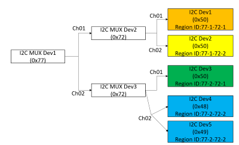

# I2C Bus Lock Prevention #

## Table of Content
* [List of Tables](#list-of-tables)
* [List of Figures](#list-of-figures)
* [1. Revision](#1-revision)
* [2. Scope](#2-scope)
* [3. Definitions/Abbreviations](#3-definitionsabbreviations)
* [4. Overview](#4-overview)
* [5. Requirements](#5-requirements)
* [6. Architecture Design](#6-architecture-design)
    * [6.1. I2C Healthd](#61-i2c-healthd)
    * [6.2. I2C Isolated Region](#62-i2c-isolated-region)
    * [6.3. I2C Isolation List](#63-i2c-isolation-list)
    * [6.4. Syslog Messages](#64-syslog-messages)
        * [6.4.1. The Timing to Write Syslog](#641-the-timing-to-write-syslog)
        * [6.4.2. The Format of the Syslog Messages](#642-the-format-of-the-syslog-messages)
        * [6.4.3. The Exausted List of the Syslog Messages](#643-the-exausted-list-of-the-syslog-messages)
    * [6.5. Platform Driver](#65-platform-driver)
    * [6.6. Special Handling on 'show techsupport'](#66-special-handling-on-show-techsupport)
* [7. High-Level Design](#7-high-level-design)
    * [7.1. The Method to Recover I2C Bus Lock and the Limitation of the Design](#71-the-method-to-recover-i2c-bus-lock-and-the-limitation-of-the-design)
    * [7.2. The Method to Detect I2C Bus Lock](#72-the-method-to-detect-i2c-bus-lock)
    * [7.3. The Method to Recover I2C Bus Lock State](#73-the-method-to-recover-i2c-bus-lock-state)
    * [7.4. General Pseudo Design](#74-general-pseudo-design)
    * [7.5. New Platform API](#75-new-platform-api)
* [8. SAI API](#8-sai-api)
* [9. Configuration and management](#9-configuration-and-management)
* [10. Warmboot and Fastboot Design Impact](#10-warmboot-and-fastboot-design-impact)
* [11. Memory Consumption](#11-memory-consumption)
* [12. Restrictions/Limitations](#12-restrictionslimitations)
    * [12.1. Minimum Interval to Detect the Presence State Change of Swapable Modules like Transceivers, PSUs and FAN Modules](#121-minimum-interval-to-detect-the-presence-state-change-of-swapable-modules-like-transceivers-psus-and-fan-modules)

* [13. Testing Requirements/Design](#13-testing-requirementsdesign)
    * [13.1. Unit Test cases ](#131-unit-test-cases)
    * [13.2. System Test cases](#132-system-test-cases)
* [14. Open/Action items](#14-openaction-items)

# List of Tables
* [Table 1: Definitions](#table-1-definitions)
* [Table 2: Abbreviation](#table-2-abbreviation)
* [Table 3: Example I2C Isolated Region](#table-3-example-i2c-isolated-region)
* [Table 4: I2C Bus Lock Prevention Syslog Messages](#table-4-i2c-bus-lock-prevention-syslog-messages)

# List of Figures
* [Figure 1: I2C Tree Example](#figure-1-i2c-tree-example)
* [Figure 2: I2C Tree Example 2](#figure-2-i2c-tree-example-2)

### 1. Revision
| Rev |     Date    |       Author       | Change Description                |
|:---:|:-----------:|:------------------:|-----------------------------------|
| 0.1 |             | Charlie Chen       | Initial version                   |

### 2. Scope

This document explains the high level design of the function to prevent the I2C bus from locked
permanently. It includes software components, the related database scheme, the related platform
APIs. The design which depends on the hardware design will be explicitly specified.

### 3. Definitions/Abbreviations

###### Table 1: Definitions
| Terminology              | Description                                                                                                                        |
|--------------------------|------------------------------------------------------------------------------------------------------------------------------------|
| I2C Bus Lock             | The SDA line is pulled low by a faulty i2c device on the bus. No i2c transactions work under this condition.                       |
| I2C Tree                 | The hierarchy of the i2c devices which form a tree layout.                                                                         |
| I2C Isolation List       | A list which contains the i2c devices that are isolated to prevent from i2c bus lock.                                              |
| I2C Mux                  | A i2c device on the bus which connects to other i2c devices behind its channels. Each channel can be opened or closed indivisually.|
| I2C Isolated Region      | The i2c devices behind a I2C Mux channel forms an i2c isolated region.                                                             |
| platform.json            | For each hardware model, a file named 'platform.json' is defined. It contains the i2c related information.                         |
| I2C Device Name          | The name of the device appears in the model's "platform.json"                                                                      |

###### Table 2: Abbreviation
| Abbreviation              | Description                                            |
|---------------------------|--------------------------------------------------------|
| I2C                       | Inter integrated circuit                               |

### 4. Overview 

Many peripheral devices relies on the i2c bus to operate. For example, transceivers, thermal sensors and psu modules.
When the i2c bus is locked, no transactions can be done through the i2c. The temperatures of transceivers, the temperatures
from thermal sensors and psu modules are not able to be retrieved. It is possible that the control of the fan speed
also relies on i2c and it is not able to control the fan speed when the i2c bus is locked. That means, the thermal policy of
the system cannot be applied and the hardware device could be in the risk of damage due to over temperature.

This feature introduces a mechanism to monitor the i2c bus health status.
When the i2c bus is locked, the daemon detect the faulty device on the i2c bus and generate an isolation list which
contains the detected faulty devices. All of the daemons which access i2c bus will be stopped during the
aforementeiond operation. After the isolation list is generated and the faulty device is marked through the platform
API, the daemons which access i2c bus will be started. After the daemons are started, the function calls by the daemons
to the platform API will avoid initating an i2c transaction to the faulty device so that the i2c bus will not be locked
again.

The hardware related requirements, the concept of a i2c region, the mechanism to detect i2c bus lock and recover
the i2c bus lock, the platform driver and platform API related changes, and the syslog messages written by this
feature will be expalined in the following sections.

### 5. Requirements

Feature Requirements
* Detect the i2c bus lock condition automatically.
* When i2c bus lock happens, detect the faulty i2c devices and put the faulty devices into an isolation list.
* Recover the i2c bus from lock status by preventing any program to access the faulty devices in the isolation list.
* The design shall not impact system performance, or minimize the impact to the system performance.
* Data plane traffic shall not be affected after the i2c recovery process is applied unless the conditions explicitly mention below.
    - If the faulty device is a transceiver inserted on a port which has running traffic, the traffic will be affected when it is replaced with a good device.

Hardware Requirements
* This feature requires the hardware support to close all channels of a I2C mux through non-i2c interface(e.g. CPU's GPIO).
* The swappable device shall be located behind a channel of a I2C mux.


### 6. Architecture Design 

#### 6.1. I2C Healthd

"i2c healthd" is a new daemon for detecting the i2c health. The daemon is started after the i2c driver is ready after the system starts. The daemon is responsible to monitor the i2c bus health status. It polls the representative i2c devices periodically. When i2c bus lock event is detected, it stops all of the daemons that will access i2c bus. After all of the daemons that will access i2c bus are stopped, the "i2c healthd" resets all of the I2C muxes on the bus to recover the control of the i2c bus. Note that the representative i2c devices differs on different hardware models and "i2c healthd" calls the new platform API to get the list of the representative i2c devices.

After the "i2c healthd" recovered the i2c bus successfully, it continues to locate the location of the i2c faulty devices in the i2c tree. For each i2c region, it only needs to execute the i2c transaction on one of the device in the i2c isolated region. If the access to the device in the region results in i2c bus lock, all of the devices in the isolated region will be put into the isolation list. After scanning all of the i2c isolated regions behind the i2c mux devices, the regions of the faulty i2c device are known. Then an isolated device list will be generated according to the scan result.

After the isolation list is generated, "i2c healthd" shall ensure the i2c bus is in healthy state. Then it starts the daemons that will access i2c bus. Note that the daemons that access i2c bus shall lookup the isolation list at start up and must not access to the devices in the isolation list.

#### 6.2. I2C Isolated Region

The definition of an i2c isolated region is a region that can be isolated through a channel of the i2c mux.
Take the i2c tree in Figure 1 below as an example to illustrate the encoding of the isolated region id.


###### Figure 1: I2C Tree Example 1

The table below shows the i2c isolated regions and the devices under each region.
The consistet of the region id is related to the intermediate i2c mux devices to access the region. Take region ID "77-1-72-1" as an example. The first part "77-1" means the i2c mux device with address "0x77" and "-1" stands for channel 1. The second part "72-1" means the i2c mux device with address "0x72" and "-1" stands for channel 1. To access the i2c device located in region "77-1-72-1", it is required to open channel 1 of the i2c mux device with address "0x77" and then open channel 1 of the i2c mux device with address "0x72".

###### Table 3: Example I2C Isolated Region
| I2C Isolated Region ID    | I2C Device Address and Name in the Region               |
|---------------------------|---------------------------------------------------------|
| 77-1-72-1                 | I2C Dev 1 addr, device name                             |
| 77-1-72-2                 | I2C Dev 2 addr, device name                             |
| 77-2-72-1                 | I2C Dev 3 addr, device name                             |
| 77-2-72-2                 | I2C Dev 4 addr, device name; I2C Dev 5 addr, device name|

Note:
* "device name" uses the name in platform.json.

#### 6.3. I2C Isolation List

The list is located in redisDB.
"i2c healthd" adds the isolated regions and the corresponding isolated devices into the list after the faulty device scan is done.
The daemons, which are responsible to detect the presence state of the replaceable devices, remove the isolated region and the corresponding isolated devices when the removal of any device in the isolation list is detected.

#### 6.4. Syslog Messages

##### 6.4.1. The Timing to Write Syslog

* I2C bus lock is detected.
* The critical steps in I2C bus lock recovery and faulty device scan.
* I2C faulty devices are detected.
* The recovery of i2c daemons.
* The removal of the device in the I2C isolated list due to the swapping of the device.

##### 6.4.2. The Format of the Syslog Messages

Here is the general format:
    [I2CHEALTH-NNN] Messages for the i2c bus lock event
Where
    I2CHEALTH-NNN --> 'NNN' is a serial number.

An example syslog message: [I2CHEALTH-001] i2c bus lock is detected.

##### 6.4.3. The Exausted List of the Syslog Messages

###### Table 4: I2C Bus Lock Prevention Syslog Messages
|Message ID|Log Level|Message Template|Example Message(Empty when it's the same as template)|Suggested Action|
|----------|---------|----------------|-----------------------------------------------------|----------------|
|0|ERROR|Internal Error: invalid msg id:{}.|Internal Error: invalid msg id:0.|Run 'show techsupport' and provide the dump file to the community with the reported issue.|
|1|ERROR|I2c bus lock is detected.| |Find out the isolated device and remove it.|
|2|NOTICE|I2c bus lock is recovered.| |None|
|3|NOTICE|Isolate i2c device: {} ({}:{}).|Isolate i2c devices: Ethernet1(77-2-72-1:25-0050).|Replace the transceiver inserted in the port mentioned by the message.|
|4|NOTICE|Remove {}({}:{}) from the isolation list.|Remove Ethernet1(77-2-72-1:25-0050) from the isolation list.|None|
|5|NOTICE|Reset all i2c mux devices to recover i2c bus lock.| |None|
|6|NOTICE|Set all of the fans to full speed.| |None|
|7|NOTICE|Stop all i2c daemons.| |None|
|8|NOTICE|Start scanning for i2c faulty devices.| |None|
|9|NOTICE|Finish scanning for i2c faulty devices.The isolation list is updated.| |None|
|10|NOTICE|Resume all i2c daemons.| |None|
|11|ERROR|Fatal error! Fail to stop all i2c daemons.| |Run 'show techsupport' and provide the dump file to the community with the reported issue.|
|12|ERROR|Fatal error! Fail to reset all i2c mux devices.| |Run 'show techsupport' and provide the dump file to the community with the reported issue.|
|13|ERROR|Fatal error! Fail to set all of the fans to full speed.| |Run 'show techsupport' and provide the dump file to the community with the reported issue.|
|14|WARNING|Init representative devices list error.| |Run 'show techsupport' and provide the dump file to the community with the reported issue.|
|15|INFO|Detect i2c bus health with I2C cmd '{}'.|Detect i2c bus health with I2C cmd 'sudo i2cget -f -y 0 0x77 0x0|None|
|16|DEBUG|{}: i2c get successfully on attempt {}/{}.|EEPROM: i2c get successfully on attempt 1/3.|None|
|17|NOTICE|{}: i2c get failed on attempt {}/{}.|EEPROM: i2c get failed on attempt 1/3.|None|
|18|WARNING|{}: an internal error occurs on attempt {}/{}.|EEPROM: an internal error occurs on attempt 1/3.|Run 'show techsupport' and provide the dump file to the community with the reported issue.|
|19|NOTICE|Execute cmd to stop i2c daemon: '{}'.|Execute cmd to stop i2c daemon: 'sudo systemctl stop as9716-32d-platform-monitor-fan.service'.|None|
|20|ERROR|Failed to execute cmd to stop i2c daemon: '{}'.|Failed to execute cmd to stop i2c daemon: 'sudo systemctl stop as9716-32d-platform-monitor-fan.service'.|Run 'show techsupport' and provide the dump file to the community with the reported issue.|
|21|NOTICE|Execute cmd to start i2c daemon: '{}'.|Execute cmd to start i2c daemon: 'sudo systemctl start as9716-32d-platform-monitor-fan.service'.|None|
|22|ERROR|Failed to execute cmd to start i2c daemon: '{}'.|Failed to execute cmd to start i2c daemon: 'sudo systemctl start as9716-32d-platform-monitor-fan.service'.|Run 'show techsupport' and provide the dump file to the community with the reported issue.|
|23|ERROR|Failed to add {}({}:{}) into the isolation list.|Failed to add Ethernet1(77-2-72-1:25-0050) into the isolation list.|1. Replace the transceiver inserted in the port mentioned by the message. 2. Run 'show techsupport' and provide the dump file to the community with the reported issue.|
|24|ERROR|Failed to remove {}({}:{}) into the isolation list.|Failed to remove Ethernet1(77-2-72-1:25-0050) into the isolation list.|1-a. First option: remove the transceiver inserted in the port mentioned in the message. 1-b. Second option: reboot the device. 2. Run 'show techsupport' and provide the dump file to the community with the reported issue."|


#### 6.5. Platform Driver

When the driver realizes the I2C device to be accessed is in the isolation list, it must skip the i2c transaction.
When there is a request from the upper layer(application), the driver will not perform any i2c transaction and returns error.

#### 6.6. Special Handling on 'show techsupport'

In the script of 'show techsupport', it contains the command to access i2c. It will not issue any i2c commands to the i2c devices in the isolation list to prevent from i2c bus lock.

### 7. High-Level Design 

This feature is a built-in SONiC feature which will be activated on the platform when the hardware design meets the requirement and the required implementation is available in the platform driver. The first platform to be supported is AS9716-32D.

#### 7.1. The Method to Recover I2C Bus Lock and the Limitation of the Design

The design relies on the i2c mux devices to isolate the faulty device on the bus. If the faulty device is not behind any i2c mux device, there is no way to isolate the device and the i2c bus cannot be recovered by this design.

It is assumes that only swappable devices could cause i2c bus lock. So this feature will not handle the case that the faulty device is a fixed i2c device.

Take the i2c tree example below to explain the method to detect I2C bus lock and recover it.
The scenarios that the recover cannot be done are also illustrated.


###### Figure 2: I2C Tree Example 2
The i2c devices with color are located behind a channel of a i2c mux device.
The same color indicates the same i2c isolated region.

Scenario 1: I2C Dev2 is in fault state (Recovery is possible)
    Given that I2C Dev 2 is the faulty device.
    Here are the brief illustrated steps for the key events and actions.
    1. I2C Dev 2 pulls the i2c signal line permanently and results in i2c bus lock.
    2. CPU detects the i2c bus lock, it takes the action to reset I2C Mux1 and I2C Mux2.
    3. All channels are closed on I2C Mux1 and I2C Mux2. The faulty device I2C Dev2 will not impact the signal lines before I2C Mux1. So CPU is able to operate on the bus now.
    4. I2C Dev 2 needs to put into the isolation list.

Scenario 2: I2C Dev1 is in fault state (Recovery is impossible)
Given that I2C Dev 1 pulls the I2C signal line.
Here are the brief illustrated steps for the key events and actions.
    1. I2C Dev 1 pulls the I2C signal line permanently.
    2. CPU detects the I2C bus lock, it takes the action to reset I2C Mux1 and I2C Mux2.
    3. I2C Dev 1 is not located behind I2C Mux1 and I2C Mux2 so the faulty state cannot be isolated/recovered.

Scenario 3: I2C Dev 6 is in fault state (Recovery is impossible)
Given that I2C Dev 6 pulls the I2C signal line.
Here are the brief illustrated steps for the key events and actions.
    1. I2C Dev 6 pulls the I2C signal line permanently.
    2. CPU detects the I2C bus lock, it takes the action to reset I2C Mux1 and I2C Mux2.
    3. All channels are closed on I2C Mux1 and I2C Mux2. The faulty device I2C Dev6 will not impact the signal lines before I2C Mux1. So CPU is able to operate on the bus now.
    4. I2C Dev 6 and 7 need to put into the isolation list.

#### 7.2. The Method to Detect I2C Bus Lock

On a specific hardware model, choose three representative i2c devices to poll.

The criteria to choose the representative i2c devices are shown below.
* In order to minimize the impact to the system performance, the chosen i2c device is seldom visited by the platform driver daemons.
* The polling interval shall be defined to a value that will not impact the system performance severely.

When i2c bus lock happens, the error realized by the i2c driver is timeout error. There are two possible causes listed below for the timeout error.
    1. The i2c slave device is dead so it does not response to the i2c command issued from the i2c controller(i.e. master device)
    2. The i2c bus is locked. So the i2c slave device cannot receive the i2c command issued from the i2c controller.

In order to detect the condition 2 correctly, it is required to poll three i2c devices to confirm that the i2c bus is REALLY locked. Given that only one i2c device is polled and it happens the device is broken and not respond to the i2c controller(i.e. condition 1 listed above). It gets the false alarm because only the i2c slave device chosen to poll is broken and not response. Actually, the i2c bus is still good and the i2c controller is able to issue i2c transactions to other i2c devices on the bus.

The i2c bus is determined to be in lock state when all of the chosen i2c devices cannot be accessed correctly.

#### 7.3. The Method to Recover I2C Bus Lock State

When the i2c bus lock happens, the CPU triggers the reset signal to i2c mux devices to close all of the channels on these mux devices.

#### 7.4. General Pseudo Design

* Monitoring i2c bus health status
    - Log when i2c bus health status is changed to bad or changed to good.

* Handling i2c bus lock
    - Reset I2C muxe devices to recover the lock state.
    - It is known that the thermal sensors readings are accessed through the i2c bus. The fan speed control is also done through i2c bus. When i2c bus is locked, the daemon to enforce thermal policy is not working anymore. To alleviate the risk of the hazard of overheating, this design invokes the special script to set all of the fans on the switch device to full speed as long as the i2c bus health is back to normal. Given that the i2c operations to set fan speed will not be affected by the faulty i2c device, all of the fan speed can be set as full speed running.
    - Perform the algorithm to find out the faulty device and put into the isolation list. Note that the algorithm skips checking on the device that is known to be faulty. In other words, the algorithm only scans on the healthy devices according to the existing isolation list. Only on the first occurrence of the i2c bus lock, all of the i2c devices will be scanned.
    - After the isolation list is generated and the i2c bus health is back to normal. Recover the execution of the daemons that need to access i2c bus.

* Fault Tolerance Design on the i2c-access daemons. ("i2c-access daemons" means the daemon that will issue i2c transactions in the background)
    - The isolation list is only generated after the occurrence of a i2c bus lock event. I2c-access daemons will be stopped when the i2c bus lock event happens.
    - When a faulty device is detected by i2c healthd, i2c healthd will call platform API to set the faulty state to the device.
    - When a daemon starts, it calls platform API to access the i2c device. The platform API shall not issue any i2c command against the i2c device when it is marked as faulty.
    - For the i2c device that is swappable, there must be a mechanism that is responsible to detect the present status of the i2c device. Take 'xcvrd' as an example, it is resposnible to monitor the presence state of transceivers. In this design, the daemon like 'xcvrd' is responsible to update the isolation list for the device that it keeps monitoring for the presence status. When a faulty device presence status is changed(i.e. the device might be swapped as a good one), it shall remove the device from the isolation list.

#### 7.5. New Platform API

```
class ChassisBase:

    def get_all_i2c_region_list(self):
        """
        Groups all I2C devices by their region.

        Retrieves the list of all I2C devices, checks for the 'region' key in each device,
        and organizes them into a dictionary where the key is the region, and the value
        is a list of devices in that region.

        Returns:
            dict: A dictionary which contains isolated regions as keys and the list of devices in the corresponding region as value.

        """
        pass

    def reset_i2c_mux(self):
        """
        Reset I2C MUX to close all channels on the mux.

        Returns:
            bool: True if successful, otherwise the error result string.
        """
        pass

    def representative_devices_get(self):
        """
        Return the representative i2c devices which will be probed in order to know
        whether the i2c bus is locked.
    
        Returns:
            list: A list of representative i2c devices
        """
        pass

    def get_platform_service_list(self):
       """
       Return the services specific to run on a platform which will access i2c bus.

       Returns:
           list: A list of the platform specific services which will access i2c bus.
       """
       pass

    def set_all_fan_full_speed(self):
       """
       Set all of the fan speed to full speed.

       Returns:
           bool: True if successful, otherwise the error result string.
       """
       pass

    def set_i2c_faulty_device(self, bus, addr, faulty):
        """
        Set the faulty state for a device on the specified I2C bus and address.

        Args:
            bus (str): The I2C bus number.
            addr (str): The I2C device address.
            faulty (bool): True to mark the device as faulty, False otherwise.

        Returns:
            bool: True if the faulty state was set successfully, False otherwise.
        """
        pass
```
#### 7.6. New Table in STATE DB

The i2c faulty devices detected by the i2c healthd will be written to the 'I2C_ISOLATION_LIST' table in STATE DB.

Table Name: I2C_ISOLATION_LIST

Key: I2C_ISOLATION_LIST|I2C Isolated Region ID|Isolated I2C Device Address

Field: "device_name"

Refer to [6.2. I2C Isolated Region](#62-i2c-isolated-region) for the consistent of the name in "I2C Isolated Region ID".
"Isolated I2C Device Address" is the address of the isolated i2c device. The address is got from the platform API. The platform
API may output the corresponding i2c device name under '/sys/bus/i2c/devices/'.

Here is an example for the record in "I2C_ISOLATION_LIST" table in STATE DB.
The table below contains one faulty device. The I2C Isolated Region ID of the device is "77-2-77-6"
The isolated region i2c device name is "30-0050".
The device name of the isolated i2c device is "Ethernet40". That means the transceiver inserted in
the port Ethernet40 is being isolated.
```
admin@sonic:~$ redis-cli -n 6 hgetall "I2C_ISOLATION_LIST|77-2-72-6|30-0050"
1) "device_name"
2) "Ethernet40"
```

### 8. SAI API 

SAI API is not used in this feature.

### 9. Configuration and management 

No configuration in this feature. 

### 10. Warmboot and Fastboot Design Impact  

The feature does not support warmboot and fastboot, and it has nothing to do with warmboot and fastboot.

### 11. Memory Consumption

No memory consumption is expected when the feature is disabled via compilation and no growing memory consumption while feature is disabled by configuration.

### 12. Restrictions/Limitations  

The I2C bus lock prevention only works when the swappable faulty device is located behind a I2C Mux's channel.

#### 12.1. Minimum Interval to Detect the Presence State Change of Swapable Modules like Transceivers, PSUs and FAN Modules

Due to the implemenation of xcvrd, psud and thermalctld, they polls for the presence state at fixed interval. If an inserted module is removed and replaces with a new module in a short time, the daemon might not be able to realize the presence state has ever been changed to not present because it does not poll the presence state when the module is removed.

The mechanism for removing devices from isolation depends on the presence state change. Therefore, for the I2C health daemon to detect the presence state change, it must remove the module and wait for the detection interval to elapse to ensure that the "not present" state can be detected.

### 13. Testing Requirements/Design  

#### 13.1. Unit Test cases  

#### 13.2. System Test cases

Test Case 1: The i2c healthd shall only runs on the platform that support i2c bus lock prevention.

Test Case 2: Plug a faulty transceiver on the device. The i2c healthd shall detect the faulty transceiver, isolate the device and recover the i2c bus.

Test Case 3: Unplug a faulty transceiver. The faulty transceiver shall be removed from the isolation list.

Test Case 4: Power off the device. Plug a faulty transceiver on the device and power on the device. The i2c healthd shall detect the faulty transceiver, isolate the device and recover the i2c bus.


### 14. Open/Action items
