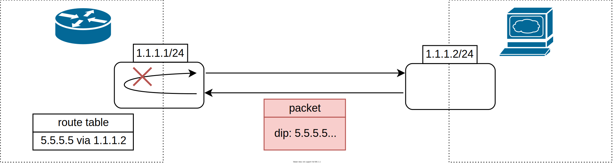

# SONiC IP Interface Loopback Action
## High level design document
## Table of contents
- [Revision](#revision)
- [Scope](#scope)
- [1 Introduction](#1-introduction)
    - [1.1 Feature overview](#11-feature-overview)
    - [1.2 Requirements](#12-requirements)
        - [1.2.1 Functionality](#121-functionality)
        - [1.2.2 Command interface](#122-command-interface)
        - [1.2.3 Error handling](#123-error-handling)
        - [1.2.4 Event logging](#124-event-logging)
- [2 Design](#2-design)
    - [2.1 Overview](#21-overview)
    - [2.2 DB schema](#22-db-schema)
        - [2.2.1 Config DB](#221-config-db)
        - [2.2.2 App DB](#222-app-db)
        - [2.2.3 Configuration migration](#223-configuration-migration)
    - [2.3 Flows](#23-flows)
        - [2.3.1 Loopback action set interface vlan](#231-loopback-action-set-interface-vlan)
            - [2.3.1.1 Handle set in runtime](#2311-handle-set-in-runtime)
            - [2.3.1.2 Handle set in init](#2312-handle-set-in-init)
        - [2.3.2 Loopback action set interface Ethernet](#232-loopback-action-set-interface-ethernet)
        - [2.3.3 Loopback action set interface port-channel](#233-loopback-action-set-interface-port-channel)
        - [2.3.4 Loopback action set subinterface](#234-loopback-action-set-subinterface)
        - [2.3.5 IP interface creation](#235-ip-interface-creation)
    - [2.4 SAI](#24-sai)
    - [2.5 Statistics](#25-statistics)
    - [2.6 CLI](#26-cli)
        - [2.6.1 Config command](#261-config-command)
        - [2.6.2 Show command](#262-show-command)
    - [2.7 YANG model](#27-yang-model)
    - [2.8 Warm/Fast boot](#28-warmfast-boot)
- [3 Test plan](#3-test-plan)
    - [3.1 Unit tests via VS](#31-unit-tests-via-vs)
    - [3.2 System tests](#32-system-tests)

## Revision
| Rev | Date       | Author         | Description     |
|:---:|:----------:|:--------------:|:----------------|
| 0.1 | 18/05/2022 | Lior Avramov   | Initial version |

## Scope
This document describes the high level design of IP interface loopback action feature in SONiC

## List of figures
[Figure 1: feature overview](#figure-1-feature-overview)  
[Figure 2: interface vlan](#figure-2-interface-vlan)  

# 1 Introduction
## 1.1 Feature overview
IP interface loopback action is a feature that allows user to change the way router handles routed packets for which egress port equals to ingress port.
1. When loopback action is configured to drop, those packets will be dropped. Drppoed packets due to loopback action are counted in rif statistics, see [2.5 Statistics](#25-statistics)
2. When loopback action is configured to forward, those packets will be forwarded as the pipeline defined.


###### Figure 1: feature overview

## 1.2 Requirements
### 1.2.1 Functionality
**This feature will support the following functionality:**
1. Loopback action can be set on an IP interface. 
2. An IP Interface can be one of the following:
    1. Interface vlan
    2. Interface Ethernet
    3. Interface port-channel
    4. Subinterface
3. Loopback action can be set to "drop" or "forward". 
4. CLI will reject loopback action setting on a non IP interface. Interface is considered as an IP interface if it has entry in:
    1. VLAN_INTERFACE table for interface vlan (e.g. VLAN_INTERFACE|Vlan100)
    2. INTERFACE table for interface Ethernet (e.g. INTERFACE|Ethernet232)
    3. PORTCHANNEL_INTERFACE table for interface port-channel (e.g. PORTCHANNEL_INTERFACE|PortChannel1)    
    4. VLAN_SUB_INTERFACE table for subinterface (e.g. VLAN_SUB_INTERFACE|Ethernet0.10)
5. The configured loopback action can be viewed by show command in CLI.
6. When SONiC configuration of loopback action is missing the system will behave as it is today, based on SAI behavioural model, forward the loopbacked packets.
7. No changes required in Kernel.

### 1.2.2 Command interface
**This feature will support the following commands:**
1. config: set IP interface loopback action.
2. show: display the configured loopback action.

### 1.2.3 Error handling
**This feature will provide error handling for the next situations:**
1. In CLI: invalid action, invalid interface, non ip interface
2. In SWSS: invalid action, invalid DB operation, invalid interface

### 1.2.4 Event logging
**This feature will provide event logging for:** loopback action set on IP interface.

###### Table 1: Event logging
| Event                                     | Severity |
|:------------------------------------------|:---------|
| IP interface loopback action set: success | NOTICE   |
| IP interface loopback action set: error   | ERROR    |

# 2 Design
## 2.1 Overview
Intfmgrd subscribes for changes in L3 interface tables VLAN_INTERFACE, INTERFACE and PORTCHANNEL_INTERFACE in config DB. Whenever there is a change in one of these tables, intfmgrd is notified. Intfmgrd then updates INTF_TABLE table in app DB. Upon change in INTF_TABLE, intforch is notified.
Intforch performs validity checks, call the relevant SAI API and updates internal cache. The flow in intfmgr is based on the current interface configuration flow.

## 2.2 DB schema
### 2.2.1 Config DB
To support loopback action set on L3 interface, a new field-value pair is defined in CONFIG_DB in the following tables.
Valid values are "drop" or "forward".

1. VLAN_INTERFACE
```
VLAN_INTERFACE|interface-name
    "loopback_action": action (OPTIONAL) 
```
Example:
```
"VLAN_INTERFACE": {
    "Vlan100": {
        "loopback_action": "drop",
        "mac_addr": "00:01:02:03:04:10",
        "ipv6_use_link_local_only": "enable"
    },
}
```

2. INTERFACE
```
INTERFACE|interface-name
    "loopback_action": action 
```
Example:

```
"INTERFACE": {
    "Ethernet248": {
        "loopback_action": "forward",
        "mac_addr": "00:01:02:03:04:11",
        "ipv6_use_link_local_only": "enable"
    },
}
```
3. PORTCHANNEL_INTERFACE
```
PORTCHANNEL_INTERFACE|interface-name
    "loopback_action": action
```
Example:
```
"PORTCHANNEL_INTERFACE": {
    "PortChannel1": {
        "loopback_action": "drop",
        "mac_addr": "00:01:02:03:04:12",
        "ipv6_use_link_local_only": "enable"
    },
}
```

4. VLAN_SUB_INTERFACE
```
VLAN_SUB_INTERFACE|interface-name
    "loopback_action": action
```
Example:
```
"VLAN_SUB_INTERFACE": {
    "Ethernet0.10": {
        "loopback_action": "drop",
        "mac_addr": "00:01:02:03:04:12",
        "ipv6_use_link_local_only": "enable"
    },
}
```

### 2.2.2 App DB
To support loopback action set on L3 interface, a new field-value pair is defined in APP DB in table INTF_TABLE.
```
INTF_TABLE|interface-name
    "loopback_action": action
```
Example for interface vlan:
```
    "INTF_TABLE": {
        "Vlan100": {
            "loopback_action": "drop",
            "mac_addr": "00:01:02:03:04:10",
            "ipv6_use_link_local_only": "enable"

```
Example for interface Ethernet:
```
    "INTF_TABLE": {
        "Ethernet248": {
            "loopback_action": "drop",
            "mac_addr": "00:01:02:03:04:11",
            "ipv6_use_link_local_only": "enable"
        }
    }
```
Example for interface port-channel:
```
    "INTF_TABLE": {
        "PortChannel1": {
            "loopback_action": "drop",
            "mac_addr": "00:01:02:03:04:12",
            "ipv6_use_link_local_only": "enable"
        }
    }
```
Example for subinterface:
```
    "INTF_TABLE": {
        "Ethernet0.10": {
            "loopback_action": "drop",
            "mac_addr": "00:01:02:03:04:12",
            "ipv6_use_link_local_only": "enable"            
        }
    }
```

### 2.2.3 Configuration migration
When upgrading from SW image which does not support the new schema to a one which supports, the new image will not contain loopback action configuration. All existing IP interfaces will behave as today, based on SAI behavioural model, forward the loopbacked packets.

## 2.3 Flows

### 2.3.1 Loopback action set interface vlan
#### 2.3.1.1 Handle set in runtime

###### Figure 2: interface vlan

#### 2.3.1.2 Handle set in init
In init, loopback action configuration is being handled as part of the IP interface creation.
During init, all field-value pairs of each key in INTF_TABLE table (e.g. INTF_TABLE|Vlan100) are being received in intfOrch together at once.
Those field-value pairs are the interface attributes, e.g. mac address, loopback action etc.

### 2.3.2 Loopback action set interface Ethernet
Loopback action set on interface Ethernet flow is the same as interface vlan flow besides config DB and app DB keys being used. Used keys are defined in [2.2.1 Config DB](#221-config-db).

### 2.3.3 Loopback action set interface port-channel
Loopback action set on interface port-channel flow is the same as interface vlan flow besides config DB and app DB keys being used. Used keys are defined in [2.2.1 Config DB](#221-config-db).

### 2.3.4 Loopback action set subinterface
Loopback action set on subinterface flow is the same as interface vlan flow besides config DB and app DB keys being used. Used keys are defined in [2.2.1 Config DB](#221-config-db).

### 2.3.5 IP interface creation
If loopback action was not configured by the user, default loopback action is derived from SAI behavioral model which is forward.

## 2.4 SAI
The following will be used for setting IP interface loopback action.

SAI API:
```
sai_router_intfs_api->set_router_interface_attribute()
sai_router_intfs_api->create_router_interface()
```

SAI attribute:
###### Table 2: SAI attribute
| Loopback action  | SAI attribute                                     | Attribute value            |
|------------------|---------------------------------------------------|----------------------------|
| drop             | SAI_ROUTER_INTERFACE_ATTR_LOOPBACK_PACKET_ACTION  | SAI_PACKET_ACTION_DROP     |
| forward          | SAI_ROUTER_INTERFACE_ATTR_LOOPBACK_PACKET_ACTION  | SAI_PACKET_ACTION_FORWARD  |


```
typedef enum _sai_router_interface_attr_t
{
    /**
     * @brief Packet action when a packet ingress and gets routed on the same RIF
     *
     * @type sai_packet_action_t
     * @flags CREATE_AND_SET
     * @default SAI_PACKET_ACTION_FORWARD
     */
    SAI_ROUTER_INTERFACE_ATTR_LOOPBACK_PACKET_ACTION,

} sai_router_interface_attr_t;
```

## 2.5 Statistics
Packets that are dropped due to loopback action will be counted in TX_ERR in IP interface statistics.
```
root@r-lionfish-14:/home/admin# show interfaces counters rif
       IFACE    RX_OK    RX_BPS    RX_PPS    RX_ERR    TX_OK    TX_BPS    TX_PPS    TX_ERR
------------  -------  --------  --------  --------  -------  --------  --------  --------
 Ethernet236        4  0.00 B/s    0.00/s         1        0  0.00 B/s    0.00/s         0
PortChannel1        0  0.00 B/s    0.00/s         0        0  0.00 B/s    0.00/s         0
       Vlan2        0  0.00 B/s    0.00/s         0        0  0.00 B/s    0.00/s         0
Ethernet0.10        0  0.00 B/s    0.00/s         0        0  0.00 B/s    0.00/s         0
```

## 2.6 CLI
### 2.6.1 Config command
A new SONiC CLI command is introduced to configure IP interface loopback action.
```
# Set loopback action per INTERFACE/PORTCHANNEL_INTERFACE/VLAN_INTERFACE/VLAN_SUB_INTERFACE
config interface loopback-action <intf-name> drop|forward
```

Examples:
```
config interface loopback-action Ethernet248 drop
config interface loopback-action Vlan100 forward
```

### 2.6.2 Show command
A new SONiC CLI command is introduced to show the configured loopback action.
IP interfaces that user did not configure loopback action on them, will not be shown in the table.
```
show ip interfaces loopback-action
```

Example:
```
root@sonic:~# show ip interfaces loopback-action
Interface     Action      
------------  ----------  
Ethernet232   drop
Vlan100       forward     
```

## 2.7 YANG model
The following YANG models will be extended in order to provide support for loopback action:
1. sonic-interface.yang -> container INTERFACE 
2. sonic-portchannel.yang -> container PORTCHANNEL_INTERFACE
3. sonic-vlan.yang -> container VLAN_INTERFACE 
4. sonic-vlan-sub-interface.yang -> container VLAN_SUB_INTERFACE

New leaf loopback_action will be added:
```
leaf loopback_action {
    description "Packet action when a packet ingress and gets routed on the same IP interface";
    type string {
        pattern "drop|forward";
    }
}
```

## 2.8 Warm/Fast boot
No special handling is required

# 3 Test plan
## 3.1 Unit tests via VS
Add the following test case in file sonic-swss/tests/test_interface.py.
1. Create IP interface by writing to config DB
2. Set loopback action on IP interface
3. Check table INTF_TABLE in App DB
4. Check table SAI_OBJECT_TYPE_ROUTER_INTERFACE in ASIC DB
5. Create port-channel IP interface and repeat steps 2 to 4.
6. Create interface VLAN and repeat steps 2 to 4.
7. Create subinterface and repeat steps 2 to 4.

## 3.2 System tests
Add the following test in sonic-mgmt.
1. Create IP interface Ethernet.
2. Loopback action not configured, send traffic, verify loopbacked packets are forwarded (SAI default).
3. Set loopback action to drop, send traffic, verify loopbacked packets are dropped and TX_ERR in rif counter increased.
4. Save config and reboot, send traffic, verify loopbacked packets are dropped and TX_ERR in rif counter increased.
5. Set loopback action to forward, send traffic, verify loopbacked packets are forwarded.
6. Save config and reboot, send traffic, verify loopbacked packets are forwarded.
7. Create port-channel IP interface and repeat steps 2 to 6.
8. Create interface VLAN and repeat steps 2 to 6.
9. Create subinterface and repeat steps 2 to 6.
10. Set loopback action on non IP interface.
11. Set loopback action on non existing interface.
