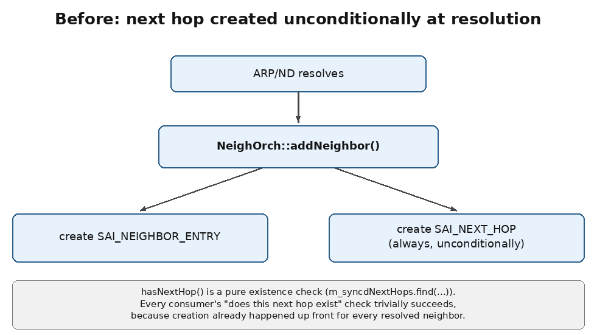
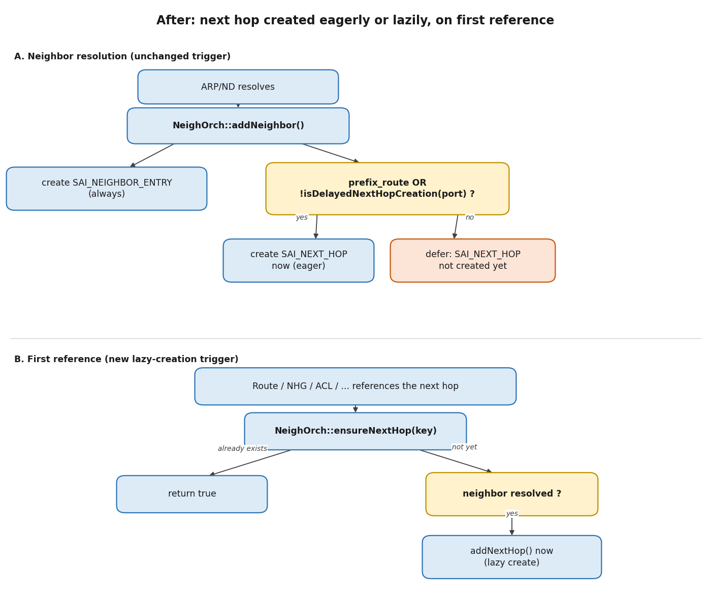

# Delayed Neighbor Next-Hop Creation

Delayed Neighbor Next-Hop Creation is a feature that optimizes SAI next-hop resource usage by delaying a resolved neighbor's next-hop creation until it is actually referenced/used by a route or next-hop group, rather than creating it unconditionally as soon as the neighbor resolves.

This saves hardware resources in scenarios where only a fraction of a large number of resolved neighbors ever get referenced -- each unused resolved neighbor would otherwise consume a scarce, platform-limited SAI/ASIC next-hop entry for no functional benefit. No change is required from any next-hop *consumer* orchagent module in the common case.

The feature is opt-in via `DEVICE_METADATA|localhost|enable-optimized-neighbor-nexthop` (default `false`); when it is off, creation stays eager at resolution.

## Table of Contents

<!-- @import "[TOC]" {cmd="toc" depthFrom=1 depthTo=6 orderedList=false} -->

<!-- code_chunk_output -->
- [1. Revision](#1-revision)
- [2. Scope](#2-scope)
- [3. Definitions/Abbreviation](#3-definitionsabbreviation)
- [4. Overview](#4-overview)
  - [4.1 Problem Statement](#41-problem-statement)
- [5. Requirements](#5-requirements)
  - [5.1 Functional Requirements](#51-functional-requirements)
  - [5.2 Compatibility Requirements](#52-compatibility-requirements)
- [6. Architecture](#6-architecture)
  - [6.1 Before](#61-before)
  - [6.2 After](#62-after)
  - [6.3 Key APIs](#63-key-apis)
  - [6.4 Gating Logic in addNeighbor()](#64-gating-logic-in-addneighbor)
- [7. High-Level Design](#7-high-level-design)
  - [7.1 FgNhgOrch (Fine-Grained ECMP)](#71-fgnhgorch-fine-grained-ecmp)
  - [7.2 MuxOrch](#72-muxorch)
  - [7.3 CRM and Reference Counting](#73-crm-and-reference-counting)
  - [7.4 BFD-Down-Before-Creation Replay](#74-bfd-down-before-creation-replay)
  - [7.5 Warm Restart](#75-warm-restart)
  - [7.6 Operational Implications](#76-operational-implications)
    - [7.6.1 Adjacency Resolution No Longer Reserves a Next Hop](#761-adjacency-resolution-no-longer-reserves-a-next-hop)
    - [7.6.2 Behavior Under FRR Route Churn (Withdraw / Re-inject)](#762-behavior-under-frr-route-churn-withdraw--re-inject)
    - [7.6.3 Bounding CRM Staleness: Debounced Reclaim of Idle Next Hops](#763-bounding-crm-staleness-debounced-reclaim-of-idle-next-hops)
  - [7.7 Alternative Considered: Delayed Creation Below SAI (in the SDK)](#77-alternative-considered-delayed-creation-below-sai-in-the-sdk)
- [8. DB Schema Changes](#8-db-schema-changes)
  - [8.1 CONFIG_DB: DEVICE_METADATA](#81-config_db-device_metadata)
- [9. Command Line](#9-command-line)
- [10. Future Enhancements](#10-future-enhancements)
  - [10.1 Bulk-Creating On-Demand Next Hops for a Batch of Routes](#101-bulk-creating-on-demand-next-hops-for-a-batch-of-routes)
  - [10.2 Distinct Signal for Table-Full vs. Unresolved Neighbor](#102-distinct-signal-for-table-full-vs-unresolved-neighbor)
- [11. Limitations](#11-limitations)
- [12. Error Handling and Failure Scenarios](#12-error-handling-and-failure-scenarios)
- [13. Testing](#13-testing)
  - [13.1 Test Plan](#131-test-plan)

<!-- /code_chunk_output -->

<a id="1-revision"></a>
## 1. Revision
| Rev |     Date     |         Author        |    Change Description    |
|:---:|:------------:|:----------------------:|:-------------------------:|
| 0.1 | 07/27/2026   | Manas Kumar Mandal     | Initial draft.            |

<a id="2-scope"></a>
## 2. Scope
This feature changes when a resolved neighbor's hardware next hop is created: no hardware next hop is created for a neighbor unless something -- a route, a next-hop group, or any other feature that forwards traffic -- actually references it. Creation of the neighbor entry itself is unaffected and remains immediate, since it is required for L3 forwarding regardless of usage.

**Out of scope:**

  * Any change to when the neighbor entry itself is created (always immediate, unchanged).
  * Runtime toggling of the feature -- the gate ([Section 8.1](#81-config_db-device_metadata)) is read at orchagent start.

<a id="3-definitionsabbreviation"></a>
## 3. Definitions/Abbreviation
| Term                      | Definition |
|:-------------------------:|:-----------|
| SAI                       | Switch Abstraction Interface. |
| CRM                       | Critical Resource Monitoring; SONiC's mechanism for tracking used/available counts of scarce ASIC resources (e.g. `CRM_IPV4_NEXTHOP`). |
| ARP / ND                  | Address Resolution Protocol / Neighbor Discovery -- the mechanisms that resolve an IP neighbor to a link-layer address. |
| ECMP                      | Equal-Cost Multi-Path. |
| FG ECMP                   | Fine-Grained ECMP, implemented by `FgNhgOrch`. |
| FRR / zebra               | The routing stack (FRRouting / its `zebra` RIB daemon) that distributes routes to SONiC via `fpmsyncd`/`APPL_DB`. |
| Mux                       | The dual-ToR mux next-hop abstraction owned by `MuxOrch`, used to steer traffic to the active ToR. |
| Warm restart              | SONiC's mechanism for reconciling in-memory/SAI state against a saved state across an orchagent/`swss` restart without traffic disruption. |

<a id="4-overview"></a>
## 4. Overview

<a id="41-problem-statement"></a>
### 4.1 Problem Statement
Today, as soon as a neighbor (ARP/ND entry) resolves, `NeighOrch::addNeighbor()` creates both:

1. The `SAI_OBJECT_TYPE_NEIGHBOR_ENTRY` (required for L3 forwarding/ARP suppression regardless of usage), and
2. The `SAI_OBJECT_TYPE_NEXT_HOP` object (a limited, ASIC-scarce hardware resource) for that neighbor.

Every resolved neighbor consumes one hardware next-hop entry, **whether or not any route or next-hop group ever points at it**. On boxes with a large number of resolved neighbors relative to actual next-hop consumers (e.g. large L3 fan-out, many peers/servers resolved but only a subset actively routed to at a given time), this wastes a scarce, platform-limited SAI/ASIC resource and can contribute to hitting the `CRM` next-hop scale ceiling for no functional benefit.

**Goal:** do not consume the hardware next-hop resource until it is actually used, so effective next-hop scale tracks real usage -- within a short, bounded lag on the way back down (see [Section 7.6.3](#763-bounding-crm-staleness-debounced-reclaim-of-idle-next-hops)) -- instead of neighbor resolution.

<a id="5-requirements"></a>
## 5. Requirements

<a id="51-functional-requirements"></a>
### 5.1 Functional Requirements
- Delayed creation is opt-in, off by default, gated by `enable-optimized-neighbor-nexthop` ([Section 8.1](#81-config_db-device_metadata)).
- Once enabled, no SAI next hop is created for a neighbor unless something (a route, a next-hop group member, ACL redirect, SRv6, MPLS, VNET, etc.) actually references that next hop key.
- No logic change required from any next-hop *consumer* orchagent module in the common case -- the existing check-before-use pattern already present in those modules should transparently gain the new behavior. The one mechanical exception is a repo-wide rename of the check-before-use call itself, from `hasNextHop()` to `ensureNextHop()` (see [Section 6.3](#63-key-apis)), so that its name honestly reflects that it can create hardware state; this touches every call site textually but changes no call-site logic.
<a id="52-compatibility-requirements"></a>
### 5.2 Compatibility Requirements
- With the gate off, next-hop creation remains eager at neighbor resolution (pre-change behavior).
- No regression to existing behaviors that require the SAI next hop immediately at resolution time: mux prefix-route neighbors (no-host-route mode), warm-restart reconciliation, and BFD-down-before-creation replay.
- CRM next-hop counters must continue to accurately reflect only next hops that actually exist in hardware.

<a id="6-architecture"></a>
## 6. Architecture

<a id="61-before"></a>
### 6.1 Before



`hasNextHop()` (this change's predecessor, since renamed -- see [Section 6.3](#63-key-apis)) was a pure existence check (`m_syncdNextHops.find(...)`). Every consumer's "does this next hop exist" check trivially succeeded because creation always happened up front.

<a id="62-after"></a>
### 6.2 After



With the gate enabled, the SAI next hop is created either eagerly (unchanged, for the cases that still need it immediately) or lazily, on first reference, via the renamed `ensureNextHop()` call (formerly `hasNextHop()`) that every consumer already makes, structurally unchanged, before using a next hop.

As part of this change, the existing software is updated to call `ensureNextHop()` everywhere it previously called `hasNextHop()` -- every consumer call site (`RouteOrch`, `NhgOrch`, `MplsRouteOrch`, `Srv6Orch`, `VNetOrch`, `AclOrch`, `FgNhgOrch`, `MuxOrch`) is mechanically renamed to match. See the naming rationale and the full list of affected files in [Section 6.3](#63-key-apis).

<a id="63-key-apis"></a>
### 6.3 Key APIs
| Function | Kind | Purpose |
|---|---|---|
| `ensureNextHop(key)` | public, side-effecting | "Ensure this next hop is usable, creating it now if needed." Lazily creates the SAI object on demand if the neighbor is resolved but the object doesn't exist yet. **This is the single trigger point for on-demand creation.** All existing consumers (RouteOrch, NhgOrch, MplsRouteOrch, Srv6Orch, VNetOrch, AclOrch, FgNhgOrch, MuxOrch) already call this before using a next hop, so they need no logic changes -- only this rename -- to gain the new behavior. |
| `hasSyncdNextHop(key)` | public, pure | "Does the SAI object exist right now?" Never creates. Used for every internal check inside `NeighOrch` (asserts, removal guards, refcount accessors) where triggering creation would be wrong (e.g. mid-teardown). Declared public (not `private`) only because the unit tests call it directly for white-box assertions on the pure/side-effecting split ([Section 13.1](#131-test-plan)); no production code outside `neighorch.cpp` calls it -- see the enumeration below. |
| `isNeighborResolved(key)` | public, pure | "Is the underlying ARP/ND entry resolved?" Decoupled from next-hop existence -- a pure query against the neighbor table (`hw_configured` flag), independent of whether the SAI next hop has been created. |
| `isDelayedNextHopCreation()` | public | Gate evaluated once per neighbor in `addNeighbor()`; returns the configured `enable-optimized-neighbor-nexthop` value ([Section 8.1](#81-config_db-device_metadata)). The gate is global -- it applies to every port alike. |

**Naming note:** the pre-existing API was named `hasNextHop()` and was a pure predicate (see [Section 6.1](#61-before)). Making it side-effecting without renaming it would leave a `has*`-named method that can silently allocate a hardware resource -- a maintenance trap for any future caller that assumes `has*` means "read-only." It is therefore renamed to `ensureNextHop()` as part of this change, while `hasSyncdNextHop()` is kept as the actual pure predicate for "does the SAI object exist right now." This is a mechanical, compiler-checked rename with no call-site logic changes; it does touch every consumer file that calls it (`routeorch.cpp`, `nhgorch.cpp`, `fgnhgorch.cpp`, `muxorch.cpp`, `vnetorch.cpp`, `srv6orch.cpp`, `mplsrouteorch.cpp`, `aclorch.cpp`), which is a wider diff than the behavioral change alone required, but was judged worth it for API contract clarity over minimizing file count.

**Pure/side-effecting split (`neighorch.cpp`):** the design only holds if every internal check that must not create anything calls `hasSyncdNextHop()` rather than `ensureNextHop()`; `isNeighborResolved()` uses a separate query altogether. Every such call site in `NeighOrch`, production and test, is listed below so the split can be checked rather than taken on trust:

- **`ensureNextHop()` itself:** the fast path -- `if (hasSyncdNextHop(nexthop)) return true;` returns immediately with no side effect if the object already exists, before ever considering creation.
- **`addNextHop()`:** `assert(!hasSyncdNextHop(nexthop))` -- precondition that the object does *not* yet exist, checked immediately before the `create_next_hop()` call it guards.
- **`removeNextHop()`:** `assert(hasSyncdNextHop(nexthop))` -- precondition that the object exists before tearing it down.
- **`removeMplsNextHop()`:** same precondition-guard pattern, for the MPLS next-hop teardown path.
- **`removeOverlayNextHop()`:** same precondition-guard pattern, for the overlay/VXLAN tunnel next-hop teardown path.
- **`getNextHopId()`:** `assert(hasSyncdNextHop(nexthop))` before returning the SAI object id -- a pure accessor that must never itself trigger creation.
- **`getNextHopRefCount()`:** same assert before reading `ref_count`.
- **`increaseNextHopRefCount()`:** same assert before incrementing `ref_count`.
- **`decreaseNextHopRefCount()`:** same assert before decrementing `ref_count`.
- **`removeNeighbor()`:** the one non-`assert`, decision-making use, and the one internal site that does **not** go through `hasSyncdNextHop()` at all: it looks up `m_syncdNextHops.find(nexthop)` directly to decide both whether to attempt a SAI `remove_next_hop()` call and where to read the object id from, specifically to avoid `hasSyncdNextHop()`'s `MuxOrch` OR-in (see [Section 7.2](#72-muxorch)) and `operator[]`'s silent-insert behavior, either of which could otherwise treat a deferred, never-created next hop as existing and drive removal off a phantom, zeroed entry.
- **`doVoqSystemNeighTask()`:** decides whether a VOQ/system (remote) neighbor's next hop is already synced, to skip redundant reprocessing during system-neighbor reconciliation -- a read-only check on an unrelated (chassis/VOQ) code path that must not have a side effect either.
- **`neighorch_ut.cpp`:** the unit tests call `hasSyncdNextHop()` directly as a white-box assertion to verify the lazy-creation behavior itself (e.g. "not created at resolution," "created on first reference") -- this is why the API is `public` rather than `private`.

`isNeighborResolved()` is called out separately because it does **not** call `hasSyncdNextHop()` at all: it queries `m_syncdNeighbors`' `hw_configured` flag directly and never touches `m_syncdNextHops`. It completes the same discipline from the other side -- no code path that only needs "is this neighbor resolved" should be able to trigger next-hop creation, and `isNeighborResolved()` guarantees that structurally, by construction, rather than by convention.

No file outside `neighorch.cpp` and `neighorch_ut.cpp` calls `hasSyncdNextHop()` anywhere in the tree (verified by a repo-wide search); every other consumer goes through `ensureNextHop()`.

<a id="64-gating-logic-in-addneighbor"></a>
### 6.4 Gating Logic in addNeighbor()

```cpp
bool defer_nexthop_creation = !prefix_route && isDelayedNextHopCreation();

if (!defer_nexthop_creation)
{
    addNextHop(ctx);                 // eager: feature off, or prefix_route
    if (prefix_route)
        addPrefixRouteForNeighbor(...);
}
else
{
    gFgNhgOrch->validNextHopInNextHopGroup(nhKey);   // see below
}
```

`isDelayedNextHopCreation()` returns the configured gate, so nothing is deferred until it is enabled. `prefix_route` neighbors (mux no-host-route mode, where a full-prefix host route points directly at the next hop) always remain eager, since the SAI next hop is required at the moment the host route is programmed.

<a id="7-high-level-design"></a>
## 7. High-Level Design
This section assumes the feature is enabled; with the gate off, `addNeighbor()` always takes the eager path and none of the deferred-neighbor cases below arise. It covers the detailed interactions triggered by the gating logic in [Section 6.4](#64-gating-logic-in-addneighbor), the operational implications of the change ([Section 7.6](#76-operational-implications)), and an alternative design that was considered and rejected ([Section 7.7](#77-alternative-considered-delayed-creation-below-sai-in-the-sdk)).

<a id="71-fgnhgorch-fine-grained-ecmp"></a>
### 7.1 FgNhgOrch (Fine-Grained ECMP)
Before this change, `addNextHop()` was the sole place that notified `FgNhgOrch::validNextHopInNextHopGroup()` that a next hop had become usable, and `removeNextHop()` was the sole place that notified `FgNhgOrch::invalidNextHopInNextHopGroup()` that it had gone away. Since neither is unconditionally called anymore -- both are skipped for a deferred neighbor whose SAI next hop was never created -- this add/remove pair had to be restored **symmetrically**, not just on the add side, otherwise a neighbor that resolves, is validated as an FG member, and is later removed without its next hop ever having been created would leave a stale FG member behind:

1. **Add side.** `NeighOrch::addNeighbor()` explicitly calls `gFgNhgOrch->validNextHopInNextHopGroup(nhKey)` for every plain neighbor, restoring the "neighbor resolved" notification. `FgNhgOrch::validNextHopInNextHopGroup()` in turn calls `m_neighOrch->ensureNextHop(nexthop)` itself before activating a member, since being configured as an FG ECMP member is itself a legitimate reference that should trigger lazy creation (this call safely short-circuits reentrantly through `addNextHop()`'s own `validNextHopInNextHopGroup()` notification for the same key). As a direct consequence, any next hop that FG ECMP actually activates is guaranteed to exist as a SAI object from that point on, since activation is what creates it.
2. **Remove side (teardown symmetry).** `NeighOrch::removeNeighbor()` explicitly calls `gFgNhgOrch->invalidNextHopInNextHopGroup(nexthop)` for a plain neighbor whose next hop was never created, mirroring the add-side call above, instead of relying solely on the `removeNextHop()` call site which only runs when the SAI next hop exists. This closes the gap for the case where the next hop was deferred and either never became an FG member at all, or FG's own reference to it (and hence the object) was already torn down by some other event (e.g. link down) before the neighbor itself is removed -- in both cases the call is a safe no-op, since `invalidNextHopInNextHopGroup()` only acts on a `nexthop` that appears in some FG ECMP group's `nhg_key`. Combined with (1), every `validNextHopInNextHopGroup()` call has a matching `invalidNextHopInNextHopGroup()` call regardless of whether the underlying SAI next hop happened to be created, so FG ECMP's membership state cannot go stale on neighbor removal.

<a id="72-muxorch"></a>
### 7.2 MuxOrch
Mux neighbors in the default ("host-route") mode are plain (non `prefix_route`) neighbors and are therefore subject to delayed creation. Several mux code paths (`MuxNbrHandler::update()`/`enable()`, `MuxOrch::updateRoute()`) previously fetched a next hop's SAI id via the **pure** `getLocalNextHopId()` lookup, which would silently return `SAI_NULL_OBJECT_ID` for a deferred-but-not-yet-created next hop. Each of these call sites now calls `ensureNextHop()` first to force on-demand creation before the pure lookup. (`MuxPrefixBasedNbrHandler`, used for no-host-route mode, is unaffected -- it is always `prefix_route`, hence always eager.)

`hasSyncdNextHop()` itself also consults `MuxOrch::getNextHopId()` and returns `true` if *either* `m_syncdNextHops` has the key *or* `MuxOrch` reports an active tunnel next hop override for it -- the latter is populated as soon as a port is configured as mux'd, independent of whether the neighbor's own local next hop has been created. `removeNeighbor()`'s decision of whether this neighbor's *own* SAI next hop needs tearing down must not use that OR'd result: doing so would treat a mux'd, still-deferred neighbor's next hop as "existing" purely because of the unrelated tunnel override, and then reading `m_syncdNextHops[nexthop]` via `operator[]` for a key genuinely absent from the map would silently insert a zeroed entry, drive `remove_next_hop()` with a null object id, and risk a CRM `used` and router-interface-refcount underflow. `removeNeighbor()` therefore checks `m_syncdNextHops` directly (`find()`, never `operator[]`) for this specific decision, which only `NeighOrch`'s own map can answer correctly.

<a id="73-crm-and-reference-counting"></a>
### 7.3 CRM and Reference Counting
- CRM next-hop counters (`CRM_IPV4_NEXTHOP` / `CRM_IPV6_NEXTHOP` / `CRM_MPLS_NEXTHOP`) are incremented/decremented exclusively inside `addNextHop()` / `removeNextHop()` / `removeMplsNextHop()` / `removeOverlayNextHop()`, unchanged. Only the *timing* of creation moves; the 1:1 accounting invariant is untouched, and counts now more accurately reflect real hardware usage than before. The debounced reclaim in [Section 7.6.3](#763-bounding-crm-staleness-debounced-reclaim-of-idle-next-hops) is a new *caller* of `removeNextHop()`, not a new decrement path, so this invariant still holds.
- `getNextHopRefCount()` / `increaseNextHopRefCount()` / `decreaseNextHopRefCount()` still `assert(hasSyncdNextHop(key))` (pure check, never creates). Every caller across the tree was audited to confirm it calls `ensureNextHop()` (lazy-creating) before touching ref counts; two real gaps were found and fixed as part of this change (the `FgNhgOrch` and `MuxOrch` items above).

<a id="74-bfd-down-before-creation-replay"></a>
### 7.4 BFD-Down-Before-Creation Replay
A neighbor's SAI next hop may not exist yet when a `BFD` session for its peer transitions to `DOWN`. `updateNextHop()` cannot apply `NHFLAGS_IFDOWN` to an object that doesn't exist, so `NeighOrch` now tracks the last-known-down peer set (`m_bfdDownPeers`) independent of next-hop existence, and `addNextHop()` replays `NHFLAGS_IFDOWN` at lazy-creation time if the peer was already known to be down.

An entry in `m_bfdDownPeers` is removed in one of two ways, both required so this set cannot grow stale or unbounded: (1) `updateNextHop()` already erases it the moment the peer's BFD session reports `UP` again, unchanged from before this design; (2) `removeNeighbor()` additionally erases it once no resolved neighbor references that peer IP any more. (2) is necessary because a peer's BFD session can be torn down (e.g. the neighbor itself is removed) while its last-known state is still `DOWN` -- that session's teardown is not preceded by an `UP` transition, so (1) alone would never fire and the entry would linger indefinitely. Since `m_bfdDownPeers` is keyed purely by peer IP (matching `updateNextHop()`'s own matching semantics, which ignores alias/VRF), (2) only erases an entry once *every* neighbor sharing that IP is gone, not just the one being removed.

<a id="75-warm-restart"></a>
### 7.5 Warm Restart
Reconciliation was verified to be unaffected: `addNeighbor()`'s gating logic runs identically during warm-boot replay as during normal operation, and consumers reconcile next hops the same way they always have (via `ensureNextHop()`), so a next hop that was created pre-warm-reboot is re-created (or found already present, depending on `bake()` ordering) using the same lazy-or-eager decision as a fresh resolution.

<a id="76-operational-implications"></a>
### 7.6 Operational Implications

<a id="761-adjacency-resolution-no-longer-reserves-a-next-hop"></a>
#### 7.6.1 Adjacency Resolution No Longer Reserves a Next Hop
**This is a deliberate trade-off of the design and should be called out explicitly.**

Before this change, a resolved adjacency and an existing hardware next hop were effectively the same event: `addNeighbor()` created the SAI next hop synchronously as part of resolving the neighbor, so any subsequent route referencing that neighbor was guaranteed a next hop already existed. If the ASIC next-hop table was full at resolution time, `addNextHop()` failed and `addNeighbor()` rolled back the *neighbor entry itself* (see `neighorch.cpp`, the `!addNextHop(ctx)` branch), so the failure was visible as a stuck/retrying adjacency for every affected neighbor -- regardless of whether that neighbor would ever be used by a route.

With delayed creation, a plain neighbor's resolution never touches the next-hop table. The SAI next hop -- and any `SAI_STATUS_TABLE_FULL` / `SAI_STATUS_INSUFFICIENT_RESOURCES` it can return -- is now only attempted later, inside `ensureNextHop()`, at the moment a route or next-hop-group actually references the key. Concretely:

- **Adjacency-resolved no longer implies "a hardware next hop is available for this destination."** A neighbor can be fully resolved (up, ARP/ND-suppressed, visible as reachable to `FRR`/`zebra`/`BGP`) while the ASIC genuinely has no free next-hop slot, and that fact is now only discovered when a route actually gets pushed and processed.
- **FRR/zebra has no visibility into this.** Routing stacks distribute routes to `fpmsyncd`/`APPL_DB` based purely on RIB/adjacency state; they have no notion of a two-stage "adjacency then hardware-resource" SAI reservation. A route pointing at a perfectly healthy neighbor can fail to get its next hop created purely due to table exhaustion discovered at that later point.
- **The failure is handled as a retry, not a drop, but is not distinctly surfaced.** `handleSaiCreateStatus()` maps table-full/insufficient-resource statuses to `task_need_retry`, so `RouteOrch::addRoute()` (and the equivalent paths in `NhgOrch`/`FgNhgOrch`/etc.) simply returns `false` and leaves the route in the consumer's retry queue, retried every orchagent iteration. The immediate log signal in the route path (`SWSS_LOG_INFO("Failed to get next hop ...")`) looks identical to the ordinary "still waiting for ARP to resolve" case, even though the underlying cause here is hardware capacity, not an unresolved neighbor. The `SAI_STATUS_TABLE_FULL` itself *is* logged at `SWSS_LOG_ERROR` inside `addNextHop()`, but that is one layer removed from the route/prefix that is actually stuck.

**Net assessment:** this shift is expected to *reduce* how often the next-hop table is exhausted in the first place, since capacity is now only spent on next hops genuinely referenced by routes/groups rather than on every resolved-but-unused neighbor -- which is the entire point of this change. But when the table is genuinely undersized for the routes actually needed, the resulting failure now surfaces later (at route-install time, per-route) instead of earlier (at adjacency-resolution time, per-neighbor).

**CRM `NEXTHOP` `used`/`available` should not be read as a single, interchangeable signal here -- they mean different things, and this design does not change either one's definition.** `available` is queried live from the ASIC and is unaffected by this change or by any next hop's create/destroy policy: it is the precise, always-current exhaustion signal, and should be the primary thing operators/monitoring watch for approaching next-hop scale limits. `used` remains exactly what it has always meant for every CRM resource type: the count of SAI objects that currently exist -- this design does not redefine it. What changes is only how closely that occupancy count tracks real demand: pre-change it counted every resolved neighbor regardless of use; post-change it only counts next hops actually referenced at least once, but (per [Section 7.6.2](#762-behavior-under-frr-route-churn-withdraw--re-inject)) is never destroyed on reference count reaching zero, so it can still run ahead of live demand for as long as a next hop's neighbor stays resolved. [Section 7.6.3](#763-bounding-crm-staleness-debounced-reclaim-of-idle-next-hops) bounds that staleness to a short grace period instead of leaving it unbounded, but `used` should still be read as an occupancy trend indicator corroborating `available`, not as a live demand gauge in its own right.

A reasonable follow-up (not implemented here) would be to give this specific case -- next hop creation deferred by design but currently resource-blocked -- a distinct counter/log signature from "neighbor not yet resolved," so it can be alerted on directly instead of only inferred from CRM trending (see [Section 10.2](#102-distinct-signal-for-table-full-vs-unresolved-neighbor)).

<a id="762-behavior-under-frr-route-churn-withdraw--re-inject"></a>
#### 7.6.2 Behavior Under FRR Route Churn (Withdraw / Re-inject)
A natural question for this design is what happens when `FRR`/`zebra` repeatedly withdraws and re-injects routes for a destination (BGP path flapping, graceful-restart replay, ECMP/UCMP recomputation, etc.) while the underlying neighbor stays resolved throughout. This was analyzed in detail and is summarized below.

**Steady-state route churn does not repeat SAI next-hop create/destroy work.**

Creation of a plain neighbor's SAI next hop may now be deferred, but its *destruction* is never driven directly by `RouteOrch`'s next-hop reference count reaching zero -- `RouteOrch::removeNextHopRoute()` / `decreaseNextHopRefCount()` only ever decrement the in-memory `ref_count` field on a plain next hop; nothing in that path calls `NeighOrch::removeNextHop()` itself. This is what makes the churn-free property below hold. Read in isolation this looks like an unconditional win, but it is also this design's main limitation: taken to its extreme (a next hop referenced once and never again, with its neighbor remaining resolved indefinitely), it would strand that next hop's hardware slot until the neighbor entry itself eventually goes away -- i.e. next-hop occupancy would track *ever-referenced* neighbors (a cumulative high-water mark) rather than *currently*-referenced ones. [Section 7.6.3](#763-bounding-crm-staleness-debounced-reclaim-of-idle-next-hops) is the other half of this trade-off: reference count reaching zero does schedule a reclaim, just a debounced one, so that extreme is bounded to a short grace period instead of being permanent.

Consequently, once a plain next hop has been lazily created by its first route/next-hop-group reference:

- A `SET` (route install) after a `DEL` (route withdraw) for the same prefix, with the neighbor still resolved, calls `ensureNextHop()` again, finds `hasSyncdNextHop() == true`, and returns immediately -- no new `create_next_hop()`/`remove_next_hop()` SAI call is made, only `increaseNextHopRefCount()`/`decreaseNextHopRefCount()` bookkeeping.
- This means the one-time creation cost introduced by this feature is paid **once, at first reference**, not once per churn cycle. Steady-state route flapping is no more expensive after this change than before it; the only difference is *when* that one-time cost is paid (first route reference instead of neighbor resolution).
- This is a genuine change in behavior only for plain ARP/ND next hops. MPLS-labeled next hops (`RouteOrch::removeMplsNextHop()`, invoked whenever `getNextHopRefCount() == 0`) and overlay/VXLAN tunnel next hops already had a "create-on-reference, destroy-on-zero-refcount" lifecycle *before* this change, so they already pay a create/destroy cost on every churn cycle, unrelated to and unaffected by this feature.
- As a side effect, CRM `NEXTHOP` used-counters for plain neighbors stay flat across pure route churn instead of ticking down/up on every flap, which is a useful property when using those counters as a capacity signal (see [Section 7.6.1](#761-adjacency-resolution-no-longer-reserves-a-next-hop)) -- churn noise does not show up as CRM churn for the common case.

If the churn event also perturbs the neighbor itself (e.g. an interface flap that ages out and re-resolves the ARP/ND entry, not just a RIB-level route flap), `removeNeighbor()` does tear down the SAI next hop if it existed, so the next reference after re-resolution pays the lazy-creation cost again -- but this exactly mirrors the pre-change cost profile, which always paid this cost on every re-resolution regardless of route churn. No regression there either.

**Churn amplifies the table-full interaction described above.**

The retry-cache merge logic in `Orch::addToSync()` (`orch.cpp`) already handles fast add/withdraw/add churn gracefully at the queueing level: a `DEL` arriving while an earlier `SET` for the same key is parked in the retry cache (e.g. because `ensureNextHop()` previously failed with `SAI_STATUS_TABLE_FULL`/`SAI_STATUS_INSUFFICIENT_RESOURCES`) evicts that pending `SET` outright, and a subsequent re-`SET` is treated as a fresh task. This is beneficial: churn does not cause an ever-growing backlog of doomed retries against an already-exhausted next-hop table.

The flip side is that **each re-`SET` re-enters `RouteOrch::addRoute()` from scratch and calls `ensureNextHop()` again**. If the next-hop table is genuinely full, this means:

- A repeated `SAI_STATUS_TABLE_FULL`-driven `create_next_hop()` attempt (and its `SWSS_LOG_ERROR` inside `addNextHop()`) is now emitted **once per churn cycle**, rather than the cost being "pinned" once per neighbor as it effectively was pre-change (a resource-blocked neighbor would already be stuck retrying its own resolution, independent of how often a route referencing it happened to flap). Log volume and retry-driven work for a table-full condition now scale with *route churn rate* in addition to *neighbor resolution rate*.
- `RouteOrch::addRoute()`'s existing `ensureNextHop() == false` handling (`routeorch.cpp`, the "IP neighbor is not yet resolved" branch) cannot distinguish "genuinely unresolved neighbor" from "resolved neighbor whose on-demand creation failed due to table exhaustion" -- both fall through to `m_neighOrch->resolveNeighbor(nexthop)` and the same `SWSS_LOG_INFO("... resolving neighbor")` line. Under sustained table-full conditions combined with route churn, this re-emits a spurious (internally deduped, so harmless) resolve request and a misleading log line on every churn cycle for a neighbor that was never actually unresolved -- obscuring the real (capacity) root cause exactly when an operator is trying to diagnose a flapping route. This sharpens the existing "distinct counter/log signature" follow-up noted above.

**Ref-count integrity is preserved under churn.**

`increaseNextHopRefCount()`/`decreaseNextHopRefCount()` are only invoked by `RouteOrch` on the success path, after a next hop id has actually been obtained -- symmetric before and after this change. A failed `ensureNextHop()` call (whether due to a genuinely unresolved neighbor or a table-full condition) leaves the route in `task_need_retry` without touching ref counts. Rapid add/withdraw/add churn therefore cannot desync ref counts merely because creation is now lazy.

**A withdrawn-before-resolved route could otherwise leak an `m_neighborToResolve` entry -- addressed directly by this design.**

Tracing churn against `resolveNeighbor()` surfaced a genuine interaction that this design must, and does, handle:

1. A route references next hop `N` before `N`'s neighbor has resolved. `RouteOrch::addRoute()` sees `ensureNextHop(N) == false`, treats it as unresolved, and calls `m_neighOrch->resolveNeighbor(N)`, which inserts `N` into `m_neighborToResolve` and writes a probe request to `APP_NEIGH_RESOLVE_TABLE_NAME` in `APPL_DB`. The route is left in the retry queue.
2. FRR withdraws that route (churn) before `N` resolves; the pending `SET` is evicted from the retry cache as described above.
3. `N` resolves shortly after anyway (independent kernel/neighsyncd event). `NeighOrch::addNeighbor()` runs, but since `N` is a deferred (plain, non prefix-route) neighbor, `addNextHop()` is **not** called as part of this resolution -- that is the entire point of this feature. Prior to the fix below, the only two places that cleared `m_neighborToResolve` and the corresponding `APPL_DB` row both lived inside `addNextHop()`.
4. Without a fix, if no route ever references `N` again afterwards, `N` would be left in `m_neighborToResolve` -- and its stale row in `APP_NEIGH_RESOLVE_TABLE_NAME` -- permanently, even though the neighbor is fully resolved, and would persist across subsequent remove/re-add cycles of the same neighbor too (`removeNeighbor()` does not clean up `m_neighborToResolve` either).

Before this change this could not happen, because `addNextHop()` ran unconditionally and synchronously inside `addNeighbor()`, so `m_neighborToResolve` was always cleared in lock-step with resolution, independent of whether any route ever used the neighbor. Decoupling "next hop created" from "neighbor resolved" (a deliberate and necessary part of this design, see `isNeighborResolved()` in [Section 6.3](#63-key-apis)) reintroduces this as a possible ordering: a route can now request resolution and be withdrawn again before the one event (`addNextHop()`) that used to double as the resolution-request cleanup.

**Fix (implemented as part of this design):** `NeighOrch::addNeighbor()` now clears `m_neighborToResolve` (and the corresponding `APP_NEIGH_RESOLVE_TABLE_NAME` row in `APPL_DB`) directly, for any neighbor whose resolution was previously requested, whenever that resolution is satisfied -- regardless of whether `addNextHop()` runs during that same call. This decouples the resolution-request cleanup from "SAI next hop created" the same way `isNeighborResolved()` was already decoupled from `ensureNextHop()` on the read side, so the four-step sequence above no longer leaks state. A regression test modeling that exact sequence (`resolveNeighbor()` -> route withdrawn -> neighbor resolves independently -> assert `m_neighborToResolve` is empty) is part of the test plan for this change (see [Section 13.1](#131-test-plan)).

Had this not been fixed, the impact would have been bounded and not a hardware resource leak -- no SAI object and no CRM impact, since one was never created -- but a state/telemetry hygiene issue: an internal `std::set` entry (bounded by neighbor table size) plus a stale, never-revisited row per affected neighbor in `APP_NEIGH_RESOLVE_TABLE_NAME`.

<a id="763-bounding-crm-staleness-debounced-reclaim-of-idle-next-hops"></a>
#### 7.6.3 Bounding CRM Staleness: Debounced Reclaim of Idle Next Hops
Section 7.6.2 establishes that a plain next hop's SAI object is destroyed only when its neighbor is removed, never when its route/group reference count drops back to zero -- this is what makes steady-state route churn free. The flip side is that a next hop which becomes genuinely unreferenced (not just mid-flap, but never used again) can keep occupying a hardware slot indefinitely, for as long as the neighbor itself stays resolved. CRM `used`, accordingly, is a high-water mark of every next hop referenced at least once since resolution, not a live measure of current demand (see [Section 7.6.1](#761-adjacency-resolution-no-longer-reserves-a-next-hop)).

To bound that staleness without giving up the churn-free property above, reclaiming a next hop on reference count reaching zero is **debounced** rather than immediate or never: when a next hop's reference count drops to zero, its destruction is scheduled after a short, fixed grace period instead of happening right away. If any consumer references it again before the grace period elapses -- the ordinary churn case -- the pending destruction is simply cancelled and no SAI work happens at all, identical to today. Only a next hop that stays unreferenced for longer than the grace period is actually torn down, once, through the same teardown path `removeNeighbor()` already uses, so CRM decrement and `FgNhgOrch` invalidation ([Section 7.1](#71-fgnhgorch-fine-grained-ecmp)) stay consistent automatically, with no separate teardown logic to maintain.

This is deliberately narrow in scope: it only bounds staleness under ordinary churn, and does not attempt to reactively reclaim capacity under table-full pressure (a different problem, not addressed here). The grace period is a fixed constant -- long enough to absorb the flap/reconverge timescales discussed in [Section 7.6.2](#762-behavior-under-frr-route-churn-withdraw--re-inject), short enough that CRM `used` staleness is now bounded rather than unbounded. A neighbor removed while one of its next hop's pending destructions hasn't yet fired tears down cleanly through the existing `removeNeighbor()` path; the now-redundant pending destruction is simply dropped.

<a id="77-alternative-considered-delayed-creation-below-sai-in-the-sdk"></a>
### 7.7 Alternative Considered: Delayed Creation Below SAI (in the SDK)
Instead of gating creation in `orchagent`, the vendor SDK could accept `create_next_hop()` eagerly (as today) but defer the actual hardware programming internally until the object is referenced by a route/group.

**Pros:**

- **Transparency:** transparent to every consumer with no `orchagent` code changes, so none of the edge cases this design had to fix (FgNhgOrch, MuxOrch, `m_neighborToResolve` leak, etc.) would exist.
- **Bulk coalescing:** the SDK can potentially see a bulk route create and a bulk next-hop create together and commit them as a single hardware transaction -- a cross-object-type optimization `orchagent`'s per-type bulkers (`gRouteBulker`/`gNextHopBulker`) cannot express through SAI today.

**Cons:**

- **CRM inaccuracy:** `used` is incremented on every `create_next_hop()` call, so it reverts to counting resolved neighbors, not actual references -- the exact problem this HLD fixes. `available` (queried live from hardware) stays accurate, so `used + available != capacity`: real hardware availability stays consistent, but the two counters diverge and no longer agree with each other, which is confusing/misleading for capacity monitoring.
- **Loss of control:** `orchagent` loses control over bulking/error-mode policy, since the decision now lives in vendor code.
- **Error misattribution:** table-full failures would surface on whatever call finally references the next hop (e.g. a route or next-hop-group-member create), not on a next-hop-specific call: wrong resource type gets blamed, there's no next-hop key to log, and a single failed member inside an ECMP group create can only return one aggregate status for the whole group.
- **Vendor lock-in:** vendor/SDK-specific, closed-source in most cases, not portable or testable in open-source `orchagent` unit tests.

**Verdict:** rejected primarily because it cannot satisfy the CRM-accuracy requirement above -- CRM accounting is defined at the SAI call boundary, not the hardware-programming boundary -- and secondarily because it degrades error attribution, turning a precise per-next-hop failure into an ambiguous failure on whatever route/group object referenced it. The bulk-coalescing benefit is better pursued as a vendor-internal optimization layered underneath this design rather than as a replacement for it.

<a id="8-db-schema-changes"></a>
## 8. DB Schema Changes
No SAI, APPL_DB, or STATE_DB schema changes. The only CONFIG_DB change is the opt-in field below. Any code path that already followed the established "`ensureNextHop()` before using a next hop" convention needs no changes and transparently benefits once the feature is enabled.

<a id="81-config_db-device_metadata"></a>
### 8.1 CONFIG_DB: DEVICE_METADATA
One optional boolean field is added to `DEVICE_METADATA|localhost`, with a matching `sonic-device_metadata` YANG leaf:

```
key                                 = DEVICE_METADATA|localhost
enable-optimized-neighbor-nexthop   = "true" / "false"   ; default "false"
```

`true` enables delayed creation (and the debounced reclaim of [Section 7.6.3](#763-bounding-crm-staleness-debounced-reclaim-of-idle-next-hops)); `false` or absent keeps the legacy eager behavior. `isDelayedNextHopCreation()` returns this value, read once at orchagent start, so a `swss` restart is needed to change it.

<a id="9-command-line"></a>
## 9. Command Line
No new CLI is introduced by this change; the feature is enabled by setting the CONFIG_DB field in [Section 8.1](#81-config_db-device_metadata).

Operators should continue to use the existing CRM show commands (`CRM_IPV4_NEXTHOP` / `CRM_IPV6_NEXTHOP` / `CRM_MPLS_NEXTHOP` used/available counters), with `available` remaining the primary, precise signal for approaching next-hop scale limits and `used` serving as a corroborating occupancy trend rather than a live demand gauge (see [Section 7.6.1](#761-adjacency-resolution-no-longer-reserves-a-next-hop)).

<a id="10-future-enhancements"></a>
## 10. Future Enhancements

<a id="101-bulk-creating-on-demand-next-hops-for-a-batch-of-routes"></a>
### 10.1 Bulk-Creating On-Demand Next Hops for a Batch of Routes
Because next-hop creation is now on-demand rather than eager, a batch of routes that arrives together and references a batch of previously-unused next hops turns each of those creations into a separate synchronous SAI call, at exactly the moment `RouteOrch` would otherwise most benefit from bulking them together with the SAI bulk next-hop-creation API.

**The gap, precisely.** `RouteOrch::doTask()` already processes an entire batch of route tasks pulled from the consumer in a single pass, and already defers all resulting `SAI_OBJECT_TYPE_ROUTE_ENTRY` creations into `gRouteBulker`, flushing it exactly once per batch (`routeorch.cpp`, the `while (it != m_toSync.end())` loop culminating in a single `gRouteBulker.flush()`). But `addRoute()` is called once per task, synchronously, *inside* that same loop, and its `m_neighOrch->ensureNextHop(nexthop)` call can trigger an immediate, blocking `sai_next_hop_api->create_next_hop()` deep inside `NeighOrch::addNextHop()` before the loop ever reaches the route bulker's flush. So today: N routes in one batch, each pointing at a distinct, not-yet-referenced neighbor, cost N sequential `create_next_hop()` round trips, followed by one bulked `create_route_entries()` call -- the opposite of what the route path itself already does for `SAI_ROUTE_ENTRY`.

**What already exists to build on.** The low-level bulk-enqueue mechanism for next hops already exists and is reused, just not wired up to the on-demand path:

- `NeighOrch` already owns `gNextHopBulker`, an `ObjectBulker<sai_next_hop_api_t>` (`neighorch.h`).
- `NeighOrch::addNextHop(NeighborContext& ctx)` already branches on `ctx.bulk_op`: when true, it calls `gNextHopBulker.create_entry(&ctx.next_hop_id, ...)` (enqueue only, `next_hop_id` stays `SAI_NULL_OBJECT_ID` until the bulker is flushed) instead of calling `sai_next_hop_api->create_next_hop()` synchronously.
- Today `bulk_op` is only ever set `true` from the mux prefix-route neighbor enable/disable path (`enableNeighbors()`/`disableNeighbors()`); `ensureNextHop()` -- the single trigger point for on-demand creation -- always builds its `NeighborContext` with the single-argument constructor, i.e. `bulk_op = false`.

So the SAI-level batching primitive is already in place; what's missing is a batch-aware caller.

**What would need to change.**

1. **A batch-aware NeighOrch entry point.** Something like `NeighOrch::prepareNextHop(const NextHopKey&)` that, for a next hop that is resolved but not yet created, enqueues it into `gNextHopBulker` (`bulk_op = true`) instead of creating it inline, plus a `NeighOrch::flushNextHopBulker()` (mirroring `RouteOrch::flushRouteBulker()`) that `RouteOrch` calls once per batch.
2. **A third processing phase in `RouteOrch::doTask()`.** Today's loop is effectively two phases: (1) per-task `addRoute()`/`removeRoute()` calls that build up `gRouteBulker`, then (2) a single `gRouteBulker.flush()`. Bulk next-hop creation needs a phase in between: (1) scan the batch and call `prepareNextHop()` for every referenced next hop that doesn't yet exist, (1.5) flush `gNextHopBulker` exactly once so every creatable next hop in the batch now has a real OID, then (2) proceed with the existing per-task `addRoute()` logic -- which can now assume `ensureNextHop()`-style checks reflect the post-flush state -- to build `gRouteBulker` entries, then flush those. This is the most invasive part: `addRoute()`'s current single-shot "check next hop, then immediately build route attributes" flow would need to become resumable across that phase boundary (or the next-hop-existence pre-scan would need to be factored out into its own pass over `consumer.m_toSync` before the existing loop body runs).
3. **A decision on `SAI_BULK_OP_ERROR_MODE`.** `ObjectBulker<sai_next_hop_api_t>` currently flushes creates with `SAI_BULK_OP_ERROR_MODE_STOP_ON_ERROR` (`bulker.h`), unlike `gRouteBulker`/`gNeighBulker` (`EntityBulker` specializations), which use `SAI_BULK_OP_ERROR_MODE_IGNORE_ERROR` and give every entry its own independent status. Under `STOP_ON_ERROR`, if the next-hop table fills up partway through one bulk create call, the SAI implementation is free to stop processing and leave the remaining entries in that call as `SAI_STATUS_NOT_EXECUTED` rather than reporting each one's own true per-entry outcome. Those would need to be treated the same as today's `task_need_retry` (safe, since the corresponding routes just get retried next iteration), but this needs an explicit decision: keep `STOP_ON_ERROR` and accept that batch order determines which next hops win a given round under table exhaustion, or change this bulker to `IGNORE_ERROR` so sibling entries in the same call aren't starved by one failure ahead of them in the batch.
4. **Diminishing-but-real returns for ECMP/next-hop-group batches.** `RouteOrch::addNextHopGroup()` already calls `ensureNextHop()` once per group member the first time a given `NextHopGroupKey` is built (`routeorch.cpp` ~1496-1523); once built, `hasNextHopGroup()` short circuits all other routes in the batch that share the same group, so a batch of, say, 5,000 routes sharing one new 32-member ECMP group already only pays a 32-next-hop creation cost once, not 5,000 times. The bulk win there is turning those 32 sequential `create_next_hop()` calls into 1 bulk call of 32 -- a real but smaller-magnitude win than the naive "N routes x M members" estimate suggests. The larger-magnitude case this extension targets is many distinct single-next-hop (non-ECMP) routes in one batch that each reference a *different*, not-yet-created neighbor -- e.g. large-scale host/VM route injection or initial convergence after a mass re-peer event.
5. **`NhgOrch`/`FgNhgOrch`/`MuxOrch`'s own direct `ensureNextHop()` calls** (added earlier in this design for FG ECMP member activation and mux state transitions) are triggered by per-neighbor, event-driven call sites rather than a batch-of-routes loop, so they don't naturally benefit from this restructuring and can reasonably keep using the synchronous single-create path.

**Feasibility.** It reuses real existing infrastructure rather than requiring new SAI-bulker plumbing, but it is a genuine restructuring of `RouteOrch::doTask()`/`addRoute()` into a three-phase pipeline (not just a `NeighOrch` change), plus an explicit bulk-error-mode decision. Given that scope, this is recorded here as a candidate follow-up rather than folded into this change.

<a id="102-distinct-signal-for-table-full-vs-unresolved-neighbor"></a>
### 10.2 Distinct Signal for Table-Full vs. Unresolved Neighbor
`RouteOrch::addRoute()`'s `ensureNextHop() == false` handling cannot distinguish an unresolved neighbor from a resolved one whose deferred creation failed due to table exhaustion; under route churn this repeats a misleading "resolving neighbor" log/probe once per churn cycle (see [Section 7.6.2](#762-behavior-under-frr-route-churn-withdraw--re-inject)). A distinct counter/log signature for "creation deferred by design but currently resource-blocked" would let operators alert on this directly instead of only inferring it from CRM trending (see [Section 7.6.1](#761-adjacency-resolution-no-longer-reserves-a-next-hop)).

<a id="11-limitations"></a>
## 11. Limitations
- The gate is global and boot-time only: it applies to every port alike, and toggling it requires a `swss` restart.
- When the feature is enabled, a resolved adjacency no longer guarantees an available hardware next hop; see the trade-off discussion in [Section 7.6.1](#761-adjacency-resolution-no-longer-reserves-a-next-hop).
- Under sustained table-full conditions combined with route churn, log volume and retry-driven work scale with route churn rate in addition to neighbor resolution rate; see [Section 7.6.2](#762-behavior-under-frr-route-churn-withdraw--re-inject).
- The debounce grace period in [Section 7.6.3](#763-bounding-crm-staleness-debounced-reclaim-of-idle-next-hops) is a fixed constant with no per-platform tuning yet, and only bounds CRM `used` staleness under ordinary churn -- it does not reactively reclaim capacity under table-full pressure.

<a id="12-error-handling-and-failure-scenarios"></a>
## 12. Error Handling and Failure Scenarios
- **SAI next-hop table full at first reference (`SAI_STATUS_TABLE_FULL` / `SAI_STATUS_INSUFFICIENT_RESOURCES`):** `handleSaiCreateStatus()` maps this to `task_need_retry`; the referencing route/group is left in the consumer's retry queue and retried every orchagent iteration. The `SAI_STATUS_TABLE_FULL` itself is logged at `SWSS_LOG_ERROR` inside `addNextHop()`. See [Section 7.6.1](#761-adjacency-resolution-no-longer-reserves-a-next-hop) for the operational implications of this failure moving from resolution-time to route-install-time.
- **Repeated table-full under route churn:** each re-`SET` after a `DEL`/`SET` churn cycle re-enters `ensureNextHop()` and can re-attempt (and re-log) a failing `create_next_hop()` once per cycle; see [Section 7.6.2](#762-behavior-under-frr-route-churn-withdraw--re-inject).
- **Neighbor removed before its deferred next hop was ever created:** `removeNeighbor()` tears down cleanly with no spurious SAI remove call and no assert (verified by unit test, [Section 13.1](#131-test-plan)).
- **Neighbor removed after its next hop was lazily created:** `removeNeighbor()` correctly tears down the SAI next hop (verified by unit test, [Section 13.1](#131-test-plan)).
- **BFD session transitions to `DOWN` before the peer's next hop is created:** handled via the `m_bfdDownPeers` replay mechanism in [Section 7.4](#74-bfd-down-before-creation-replay); no flag is lost.
- **Route references a next hop before its neighbor resolves, then the route is withdrawn before resolution:** does not leak a SAI object, a CRM count, or an `m_neighborToResolve`/`APPL_DB` bookkeeping entry -- `addNeighbor()` clears the pending resolution-request state directly once the neighbor resolves, independent of whether `addNextHop()` runs during that call; see [Section 7.6.2](#762-behavior-under-frr-route-churn-withdraw--re-inject).

<a id="13-testing"></a>
## 13. Testing

<a id="131-test-plan"></a>
### 13.1 Test Plan
- Unit tests added in `neighorch_ut.cpp`:
  - With the gate off, plain neighbor resolution still eagerly creates a SAI next hop (legacy behavior). The remaining cases run with it enabled.
  - Plain neighbor resolution does not eagerly create a SAI next hop.
  - First reference lazily creates exactly one SAI next hop; subsequent references do not re-create it.
  - Removing a neighbor whose next hop was never created tears down cleanly (no spurious SAI remove call, no assert).
  - Removing a neighbor whose next hop was lazily created correctly tears down the SAI next hop.
  - A route requests resolution of a next hop via `resolveNeighbor()`, is withdrawn before the neighbor resolves, and the neighbor then resolves independently: `m_neighborToResolve` (and the mirrored `APP_NEIGH_RESOLVE_TABLE_NAME` row) is cleared by `addNeighbor()` even though `addNextHop()` never runs (see [Section 7.6.2](#762-behavior-under-frr-route-churn-withdraw--re-inject)).
  - A neighbor that is a configured FG ECMP member resolves (activating the member and, via `ensureNextHop()`, creating its SAI next hop) and is then removed: `FgNhgOrch`'s member state reflects the removal (via `invalidNextHopInNextHopGroup()`) and no stale member remains.
  - A neighbor that is *not* an FG ECMP member resolves, is never referenced (its SAI next hop stays deferred), and is then removed: `removeNeighbor()`'s explicit `invalidNextHopInNextHopGroup()` call on the deferred path is a no-op (see [Section 7.1](#71-fgnhgorch-fine-grained-ecmp)) and teardown completes cleanly.
  - A next hop's reference count drops to zero and is referenced again before the debounce grace period elapses: the pending destruction is cancelled, and no `create_next_hop()`/`remove_next_hop()` SAI call is made (see [Section 7.6.3](#763-bounding-crm-staleness-debounced-reclaim-of-idle-next-hops)).
  - A next hop's reference count drops to zero and stays there past the debounce grace period: it is torn down exactly once, with the corresponding CRM decrement (see [Section 7.6.3](#763-bounding-crm-staleness-debounced-reclaim-of-idle-next-hops)).
  - A neighbor is removed while one of its next hop's debounced destructions is still pending: teardown completes cleanly via `removeNeighbor()`, with no double-teardown or stale pending state left behind.
  - A peer's BFD session transitions to `DOWN` and is then removed (e.g. its neighbor is removed) without an intervening `UP` transition: the peer is erased from `m_bfdDownPeers` by `removeNeighbor()`, not left behind (see [Section 7.4](#74-bfd-down-before-creation-replay)).
  - Two neighbors on different aliases share the same peer IP and both have a recorded `DOWN` state; removing one of them does not erase the peer from `m_bfdDownPeers` while the other still exists (see [Section 7.4](#74-bfd-down-before-creation-replay)).
  - A mux'd neighbor whose local next hop is still deferred (never created) is removed while `MuxOrch` reports an active tunnel next hop override for the same key: `removeNeighbor()` does not treat the local next hop as existing, issues no `remove_next_hop()` call, does not insert a phantom `m_syncdNextHops` entry, and does not decrement CRM or the router-interface refcount (see [Section 7.2](#72-muxorch)).
- Manual/code review verification: mux active/standby transitions in host-route mode, warm-restart reconciliation, and BFD-down replay before/after lazy creation.
