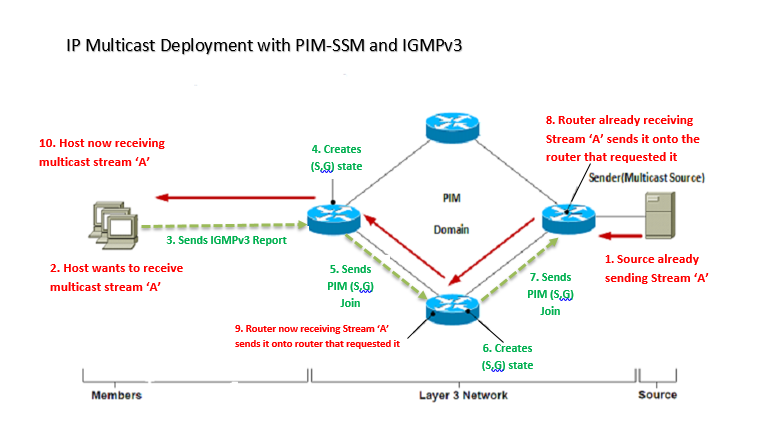

# SONiC PIM Source Specific Multicast Support
# High Level Design Document
#### Rev 0.1

# Table of Contents
  * [List of Tables](#list-of-tables)
  * [Revision](#revision)
  * [About this Manual](#about-this-manual)
  * [Scope](#scope)
  * [Definition/Abbreviation](#definitionabbreviation)
  * [1 Feature Overview](#1-feature-overview)
     * [1.1 Requirements](#1.1-requirements)
        * [1.1.1 Functional Requirements](#1.1.1-functional-requirements)
        * [1.1.2 Configuration and Management Requirements](#1.1.2-configuration-and-management-requirements)
        * [1.1.3 Scalability Requirements](#1.1.3-scalability-requirements)
     * [1.2 Design Overview](#1.2-design-overview)
        * [1.2.1 Basic Approach](#1.2.1-basic-approach)
        * [1.2.2 Container](#1.2.2-container)
        * [1.2.3 SAI Overview](#1.2.3-sai-overview)
  * [2 Functionality](#2-functionality)
     * [2.1 Target Deployment Use Case](#2.1-target-deployment-use-case)
  * [3 Design](#3-design)
     * [3.1 Overview](#3.1-overview)
        * [3.1.1 Enabling PIM](#3.1.1-enabling-pim)
        * [3.1.2 Enabling IGMP](#3.1.2-enabling-igmp)
     * [3.2 DB Changes](#3.2-db-changes)
        * [3.2.1 CONFIG DB](#3.2.1-config-db)
        * [3.2.2 APP DB](#3.2.2-app-db)
           * [3.2.2.1 IPMC_ROUTE_TABLE](#3.2.2.1-ipmc_route_table)
           * [3.2.2.2 IPMC_INTF_TABLE](#3.2.2.2-ipmc_intf_table)
        * [3.2.3 State DB](#3.2.3-state-db)
        * [3.2.4 ASIC DB](#3.2.4-asic-db)
        * [3.2.5 COUNTER DB](#3.2.5-counter-db)
     * [3.3 Switch State Service Design](#3.3-switch-state-service-design)
        * [3.3.1 IPMC Orchestration Agent](#3.3.1-ipmc-orchestration-agent)
     * [3.4 SyncD](#3.4-syncd)
     * [3.5 SAI](#3.5-sai)
     * [3.6 CLI](#3.6-cli)
        * [3.6.1 Data Models](#3.6.1-data-models)
        * [3.6.2 IS-CLI Compliance](#3.6.2-is-cli-compliance])
        * [3.6.3 Configuration Commands](#3.6.3-configuration-commands)
        * [3.6.4 Show Commands](#3.6.4-show-commands)
        * [3.6.5 Debug Commands](#3.6.5-clear-commands)
        * [3.6.6 Clear Commands](#3.6.6-clear-commands)
        * [3.6.7 REST API Support](#3.6.7-rest-api-support)
  * [4 Flow Diagrams](#4-flow-diagrams)
     * [4.1 Enabling PIM on an Interface](#4.1-enabling-pim-on-an-interface)
     * [4.2 IP Multicast Route Entry Creation/Deletion Flow](#4.2-ip-multicast-route-entry-creationdeletion-flow)
  * [5 Error Handling](#5-error-handling)
  * [6 Serviceability and Debug](#6-serviceability-and-debug)
  * [7 Warm Boot Support](#7-warm-boot-support)
  * [8 Scalability](#8-scalability)
  * [9 Unit Test](#9-unit-test)
    * [9.1 CLI Test Cases](#9.1-cli-test-cases)
    * [9.2 Functional Test Cases](#9.2-functional-test-cases)
    * [9.3 Scaling Test Cases](#9.3-scaling-test-cases)
  * [10 Future Enhancements](#11-future-enhancements)

# List of Tables
[Table 1: Abbreviations](#table-1-abbreviations) <br>
[Table 2: IPMC SAI Attributes](#table-2-ipmc-sai-attributes) <br>
[Table 3: IP Multicast Scaling limits](table-3-ip-multicast-scaling-limits) <br>

# Revision
| Rev |     Date    |       Author       | Change Description                |
|:---:|:-----------:|:------------------:|-----------------------------------|
| 0.1 | 07/15/2019  |  Krishna Mohan CS  | Initial version                   |

# About this Manual
This document provides general information about PIM Source Specific Multicast integration effort in SONiC.

# Scope
This document describes the functionality and high level design of PIM Source Specific Multicast integration in SONiC by leveraging FRR 7.0 (or later) PIM and IGMP protocol suite. This document describes the interactions between FRR, SwSS and Syncd components.

The scope of this feature includes support for IGMPv3 and PIM-SSM protocols for IPv4 only.

# Definition/Abbreviation
### Table 1: Abbreviations
| **Term**  | ***Meaning***                                                     |
|-----------|-------------------------------------------------------------------|
| PIM-SM    | Protocol Independent Multicast                                    |
| PIM-SSM   | PIM - Source Specific Multicast                                   |
| IGMP      | Internet Group Management Protocol                                |
| IGMPv3    | IGMP version 3                                                    |
| SPT       | Shortest Path Tree                                                |
| RPF       | Reverse Path Forwarding                                           |
| RP        | Rendezvous Point                                                  |
| (S,G)     | (Source address, Group address)                                   |
| VRF       | Virtual Router Forwarding                                         |
| LHR       | Last Hop Router (Router directly connected to the Host/Receiver   |
| FHR       | First Hop Router (Router directly connected to the Source/Sender  |
| FRR       | Free Range Routing                                                |
| MC-LAG    | Multi-Chassis Link Aggregation                                    |
| OIF/OIL   | Outgoing Interface List                                           |
| IIF       | Incoming interface (RP Interface)                                 |
| SSM Range | 232.0.0.0/8                                                       |

# 1 Feature Overview
The IP multicast route entries learnt by PIM are stored in the PIM database in FRR-PIM daemon.  PIM updates the multicast routes to Linux kernel.  But PIM doesn't have a means to program the multicast routes to the hardware.

This feature introduces a Forwarding plane manager ('ipmcFpmSyncd') and an Orchestration agent ('ipmcOrch') to synchronize IP multicast routes between Linux kernel and the switching ASIC.

## 1.1 Requirements
### 1.1.1 Functional Requirements
1. Support trapping of PIM control packets to CPU.
2. Support trapping of IGMP control packets to CPU.
3. Support programming of (S, G) multicast routes into hardware using SAI APIs.
4. Support line rate multicast traffic between multicast sender and listener.
5. Support SSM destination addresses in the range 232.0.0.0/8 for IPv4.
6. Support IPv4 multicast forwarding/routing on Port based, VLAN based and LAG based routing interfaces.
7. Support IPv4 multicast forwarding/routing in a VRF.
8. Support PIM neighbor reachability tracking using BFD.

### 1.1.2 Configuration and Management Requirements
There are no new configuration requirements for this feature.  This feature relies on FRR PIM and IGMP CLI configuration.  FRR PIM and IGMP related CLI commands given in the below links are supported:
http://docs.frrouting.org/en/latest/pim.html
https://buildmedia.readthedocs.org/media/pdf/frrouting/stable-5.0/frrouting.pdf

### 1.1.3 Scalability Requirements
The following are the scalability requirements for this feature:
1. Maximum number of PIM neighbors supported is 64.
2. Maximum number of multicast route entries supported is 8K.

FRR-PIM does not impose any restriction on the scale of multicast route entries.  The scalability testing for this feature is validated as per the above limits.

## 1.2 Design Overview
### 1.2.1 Basic Approach

PIM runs in the BGP docker.  A new daemon ipmcFpmSyncd is created in the BGP docker.  During PIM protocol initialization, PIM connects to ipmcFpmSyncd through a regular TCP socket.  PIM updates the multicast routes to ipmcFpmSyncd using this connection.  ipmcFpmSyncd updates the multicast routes to APP_DB.

The Orchestration agent is enhanced to read the multicast route table in APP_DB and update the multicast routes to the ASIC by invoking SAI APIs.

### 1.2.2  Container
No new container is introduced with this feature.  The existing BGP (FRR), SwSS and SyncD containers are modified for this feature.

### 1.2.3 SAI Overview
SAI definition to program a multicast route entry in the ASIC is already defined. This feature adds SAI support for Broadcom silicon as per the SAI definition.

SAI object model of IPMC allows programming of multiple member ports (OIF list).  This is achieved by creating the IPMC group object (SAI_GROUP_MEMBER_ATTR_GROUP_ID) and associating multiple group members for the group object (SAI_GROUP_MEMBER_ATTR_MEMBER_ID).

More details of the SAI changes are discussed in the SAI section.

IP Multicast SAI APIs are defined in the below headers:
https://github.com/opencomputeproject/SAI/blob/master/inc/saiipmc.h
https://github.com/opencomputeproject/SAI/blob/master/inc/saiipmcgroup.h

# 2 Functionality
## 2.1 Target Deployment Use Case



__Figure 1: IP Multicast Deployment with PIM-SSM__

# 3 Design
## 3.1 Overview


__Figure 2: IP Multicast High level architecture__

The interactions between FRR PIM, Linux kernel, ipmcFpmSyncd and ipmcOrch for updating a multicast route entry from PIM to the hardware are explained below:

1. PIM creates a (S,G) entry in two scenarios.  One, when the LHR receives a IGMPv3 Report message and second, when the FHR or an intermediate PIM router receives a PIM (S,G) Join message from its downstream.  Pimd listens on a socket for receiving the PIM and IGMP control packets. <br> <br>

    1.1. When the LHR receives a IGMPv3 Report, it is passed to the Linux kernel.  Kernel delivers the IGMPv3 Report payload to the Pimd process.  Pimd creates a IGMP group membership entry and queries Zebra (or Static Mroute database) to see if the Source address specified in the IGMPv3 Report is reachable.  If reachable, Pimd creates a (S,G) entry with the RPF interface as its IIF and updates the (S,G) entry's OIF with the interface on which the IGMPv3 Report is received. <br> <br>

    1.2. When the FHR or an intermediate PIM router receives a PIM (S,G) Join message, the message is passed to the Linux kernel and kernel delivers the PIM Join message and its associated payload to Pimd process.  PIM queries Zebra for RPF validation and then creates a (S,G) entry with the RPF interface as its IIF.  PIM queries IGMP database (inside Pimd) and updates the (S,G) entry's OIF list. <br> <br>

2. After PIM creates the (S,G) entry with the required information, PIM updates Linux kernel using a socket and kernel creates a mroute entry. <br> <br>

3. ipmcFpmSyncd registers with Linux kernel for RT netlink group RTNLGRP_IPV4_MROUTE and listens for RTM_NEWROUTE and RTM_DELROUTE RT netlink events.  When Pimd creates/deletes a multicast route entry, Linux kernel notifies ipmcFpmSyncd about multicast route entry creation/deletion using RTM_NEWROUTE and RTM_DELROUTE events. <br> <br>

4. ipmcFpmsyncd processes the netlink message and updates the (S,G) route entry information into IPMC_MROUTE_TABLE in APP_DB. <br> <br>

5. ipmcOrch being an APP_DB subscriber, it receives the multicast route entry information previously updated to APP_DB by ipmcFpmsyncd. <br> <br>

6. After processing the received information, ipmcOrch invokes SAI APIs to inject the multicast route entry information into ASIC_DB. <br> <br>

7. Syncd being an ASIC_DB subscriber, it receives the multicast route information updated to ASIC_DB by ipmcOrch. <br> <br>

8. Syncd processes the multicast route information and invokes the SAI API to inject this mroute entry into the corresponding ASIC-driver. <br> <br>

9. The multicast route is finally programmed in the hardware.

### 3.1.1 Enabling PIM
ipmcFpmSyncd registers with Linux kernel for RT netlink group RTNLGRP_IPV4_NETCONF and listens for RTM_NEWNETCONF and RTM_DELNETCONF netlink events.

When the user enables/disables PIM on an interface, Pimd updates the mc_forwarding status in the Linux kernel (/proc/sys/net/ipv4/conf/all/mc_forwarding). Linux kernel notifies ipmcFpmSyncd about the multicast VIF (mr_vif) creation/deletion using RTM_NEWNETCONF and RTM_DELNETCONF events.

ipmcFpmSyncd processes the multicast interface enable message and updates the IPMC_INTF_TABLE in APP_DB.  ipmcOrch receives the PIM enable message from APP_DB and does the following:

1. Enables IPv4 multicast on the interface by invoking the SAI router interface attribute, SAI_ROUTER_INTERFACE_ATTR_V4_MCAST_ENABLE.
2. Enables trapping of PIM control packets to CPU by invoking the SAI COPP trap setting, SAI_HOSTIF_TRAP_TYPE_PIM. PIM control packets are trapped to a higher COS queue (COS queue 5 [TBD]).
3. A system wide policy is setup to drop all the multicast data packets destined to the SSM range (*,232.0.0.0)/8 that meet the below criteria:<br>
3.1. The received multicast data packet is a L3 packet.<br>
3.2. The received multicast data packet results in a IPMC table look-up miss.</br>

### 3.1.2 Enabling IGMP
The actions taken to trap IGMP control packets to CPU when the user enables IGMP on an interface is described in the below document:
https://github.com/Azure/SONiC/pull/425.

## 3.2 DB Changes
This section describes the changes made to different DBs for supporting PIM-SSM.

### 3.2.1 CONFIG DB
For the scope of this HLD, there are no new SONiC CLI or CONFIG_DB entries required or defined - it's all done in FRR PIM CLI.  Note that a separate effort will integrate FRR PIM CLI with the SONiC UI and that effort will make some additions here.  However this is beyond the scope of this HLD.

### 3.2.2 APP DB
#### 3.2.2.1 IPMC_MROUTE_TABLE
A new table IPMC_MROUTE_TABLE is introduced in APP_DB to specify dynamic multicast route entries.
```
IPMC_MROUTE_TABLE:{{vrf_id}} | {{source_address}} | {{group_address}}
    "incoming interface"       : {{ifname}}
    "outgoing interface list"  : {{list of interfaces}}
```
IPMC_MROUTE_TABLE Schema
```
; Defines schema for multicast route entry table
key      = IPMC_MROUTE_TABLE:vrf_id|src_address|grp_address ; Mroute table
; field                 = value
INCOMING_INTERFACE      = intf_name     ; ifname must be unique across PORT,INTF,VLAN,LAG TABLES
OUTGOING_INTERFACE_LIST = intf_names_list    ; list of interfaces delimited by ','
```

#### 3.2.2.2 IPMC_INTF_TABLE
A new table IPMC_INTF_TABLE is introduced in APP_DB to specify the IGMP and PIM interface admin mode.

```
IPMC_INTF_TABLE:{{ifname}}   ; ifname must be unique across PORT,INTF,VLAN,LAG TABLES
    "mcast_forwarding"       : {{multicast-forwarding-state}}
```
IPMC_INTF_TABLE Schema
```
; Defines schema for multicast interface table
key       = IPMC_INTF_TABLE:ifname ; Interface table ... ifname must be unique across PORT,INTF,VLAN,LAG TABLES
; field             = value
MCAST_FORWARDING    = "enable" / "disable"
```

### 3.2.3 STATE DB
N/A

### 3.2.4 ASIC DB
Below is the format of ASIC_DB entry for IP multicast (S, G) route entry.

127.0.0.1:6379[1]> hgetall "ASIC_STATE:SAI_OBJECT_TYPE_IPMC_ENTRY:{\"destination\":\"224.1.1.1\",\"source\":\"192.168.10.10\",\"switch_id\":\"oid:0x21000000000000\",\"type\":\"SAI_IPMC_ENTRY_TYPE_SG\",\"vr_id\":\"oid:0x3000000000022\"}"
1) "SAI_IPMC_ENTRY_ATTR_PACKET_ACTION"
2) "SAI_PACKET_ACTION_FORWARD"
3) "SAI_IPMC_ENTRY_ATTR_OUTPUT_GROUP_ID"
4) "oid:0x330000000005e0"
5) "SAI_IPMC_ENTRY_ATTR_RPF_GROUP_ID"
6) "oid:0x2f0000000005e2"

### 3.2.5 COUNTER DB
No new counters are added as part of this feature.  This feature utilizes the below mentioned counters support that exists in SONiC:
1. FRR PIM CLI and Linux kernel has support for protocol level counters.
2. SONiC supports interface level counters for Rx/Tx multicast packets count.

## 3.3 Switch State Service Design
### 3.3.1 IPMC Orchestration Agent

ipmcOrch is responsible for the following:
   - Registers and listens on the notifications of IPMC_MROUTE_TABLE for the multicast route entry information that is updated to APP_DB by ipmcFpmSyncd.

   - Handles multicast route entry updates viz., SET, DELETE and translates to SAI objects and updates them to ASIC_DB.

   - Creates IPMC route entry with OID mapping to handle subsequent IPMC route entry addition, modification or deletion.

## 3.4 SyncD
No changes are needed in SyncD for this feature.

## 3.5 SAI
IPMC SAI interface APIs are already defined, table shown below represents the SAI attributes which are used for PIM and IGMP.

###### Table 2: IPMC SAI Attributes
| IPMC component		      | SAI attributes                                        |
|--------------------------|-------------------------------------------------------|
| IPMC ENTRY               | SAI_IPMC_ATTR_OUTPUT_GROUP_ID <br>
| IPMC Group               | SAI_IPMC_GROUP_ATTR_IPMC_OUTPUT_COUNT <br>                                                   SAI_IPMC_GROUP_ATTR_IPMC_MEMBER_LIST <br>
| IPMC Group Member        | SAI_IPMC_GROUP_MEMBER_ATTR_IPMC_GROUP_ID <br>                                                SAI_IPMC_GROUP_MEMBER_ATTR_IPMC_OUTPUT_ID <br>

To program IPMC entry in the hardware, the OIF list (collection of one or more member ports) needs to be specified.  SAI object model of IPMC allows programming of multiple member ports.  This is achieved by creating the IPMC group object (SAI_GROUP_MEMBER_ATTR_GROUP_ID) and associating multiple group members for the group object (SAI_GROUP_MEMBER_ATTR_MEMBER_ID).

Below is the sample code to program a IPMC route entry to the ASIC:

       sai_object_id_t ipmc_group_id = 0;
       sai_status_t status = SAI_STATUS_SUCCESS;
       sai_attribute_t attr[3] = {};

       status = sai_ipmc_group_api->create_ipmc_group(&ipmc_group_id, gSwitchId, 0, 0);

       sai_object_id_t ipmc_group_member_id = 0;

       attr[0].id = SAI_IPMC_GROUP_MEMBER_ATTR_IPMC_GROUP_ID;
       attr[0].value.oid = ipmc_group_id;

       attr[1].id = SAI_IPMC_GROUP_MEMBER_ATTR_IPMC_OUTPUT_ID;
       attr[1].value.oid = port.m_rif_id;

       status = sai_ipmc_group_api->create_ipmc_group_member(&ipmc_group_member_id, gSwitchId, 2, attr);
       sai_object_id_t rpf_object_id = 0;
       status = sai_rpf_group_api->create_rpf_group(&rpf_group_id, gSwitchId, 0, 0);

       sai_ipmc_entry_t ipmc_entry;

       ipmc_entry.switch_id = gSwitchId;
       ipmc_entry.vr_id = gVirtualRouterId;
       ipmc_entry.type = SAI_IPMC_ENTRY_TYPE_SG;
       ipmc_entry.destination.addr_family = SAI_IP_ADDR_FAMILY_IPV4;
       ipmc_entry.destination.addr.ip4 = 0xE0010101;

       ipmc_entry.source.addr_family = SAI_IP_ADDR_FAMILY_IPV4;
       ipmc_entry.source.addr.ip4 = 0x0;

       attr[0].id = SAI_IPMC_ENTRY_ATTR_PACKET_ACTION;
       attr[0].value.s32 = SAI_PACKET_ACTION_FORWARD;

       attr[1].id = SAI_IPMC_ENTRY_ATTR_OUTPUT_GROUP_ID;
       attr[1].value.oid = ipmc_group_id;

       attr[2].id = SAI_IPMC_ENTRY_ATTR_RPF_GROUP_ID;
       attr[2].value.oid = rpf_group_id;

       status = sai_ipmc_entry_api->create_ipmc_entry(&ipmc_entry, 2, attr);

## 3.6 CLI
### 3.6.1 Data Models
A separate effort will integrate FRR PIM CLI with the SONiC UI and that effort will make some additions here.  However this is beyond the scope of this HLD.

### 3.6.2 IS-CLI Compliance
A separate effort will integrate FRR PIM CLI with the SONiC UI and that effort will make some additions here.  However this is beyond the scope of this HLD.

### 3.6.3 Configuration Commands
This feature relies on FRR 7.0 (or later) PIM and IGMP CLI configuration.  FRR PIM and IGMP related CLI commands given in the below link are supported:
http://docs.frrouting.org/en/latest/pim.html
https://buildmedia.readthedocs.org/media/pdf/frrouting/stable-7.0/frrouting.pdf

The below CLI configuration commands are supported. Please refer to the links given above for detailed explanation/outputs.

#### 3.6.3.1 Global Configuration Commands

1. ip pim ecmp rebalance <br>

2. ip pim ecmp <br>

3. ip pim join-prune-interval (60-600) <br>

4. ip pim packets (1-100) <br>

5. ip pim ssm prefix-list WORD <br>

6. ip multicast rpf-lookup-mode WORD <br>

7. ip mroute A.B.C.D/M A.B.C.D (1-255) <br>

8. ip mroute A.B.C.D/M INTERFACE (1-255) <br>

#### 3.6.3.2 Interface Configuration Commands

1. ip pim bfd

2. ip pim drpriority (1-4294967295)

3. ip pim hello (1-180)

4. ip pim

5. ip multicat boundary oil WORD

6. ip mroute INTERFACE A.B.C.D A.B.C.D

8. ip pim use-source A.B.C.D

### 3.6.4 Show Commands
This feature relies on FRR 7.0 (or later) PIM and IGMP CLI show commands.  FRR PIM and IGMP related CLI show commands given in the below link are supported:
http://docs.frrouting.org/en/latest/pim.html
https://buildmedia.readthedocs.org/media/pdf/frrouting/stable-7.0/frrouting.pdf

The below CLI show commands are supported. Please refer to the links given above for detailed explanation/outputs.

1. show ip pim [vrf NAME] assert

2. show ip pim [vrf NAME] group-type A.B.C.D [json]

3. show ip pim [vrf NAME] interface [detail|WORD] [json]

4. show ip pim [vrf NAME] interface traffic [WORD] [json]

5. show ip pim [vrf NAME] join [json]

6. show ip pim [vrf NAME] local-membership [json]

7. show ip pim [vrf NAME] neighbor [detail|WORD] [json]

8. show ip pim [vrf NAME] nexthop

9. show ip pim [vrf NAME] nexthop-lookup A.B.C.D A.B.C.D

10. show ip pim [vrf NAME] rpf [json]

11. show ip pim [vrf NAME] secondary

12. show ip pim [vrf NAME] state [A.B.C.D [A.B.C.D]] [json]

13. show ip pim [vrf NAME] upstream [json]

14. show ip pim [vrf NAME] upstream-join-desired [json]

15. show ip pim [vrf NAME] upstream-rpf [json]

16. show ip pim vrf all interface [detail|WORD] [json]

17. show ip pim vrf all join [json]

18. show ip pim vrf all neighbor [detail|WORD] [json]

19. show ip pim vrf all rpf [json]

20. show ip pim vrf all state [A.B.C.D [A.B.C.D]] [json]

21. show ip pim vrf all upstream [json]

### 3.6.5 Debug Commands
This feature relies on FRR 7.0 (or later) PIM and IGMP CLI 'debug' commands as listed in the below links:
http://docs.frrouting.org/en/latest/pim.html
https://buildmedia.readthedocs.org/media/pdf/frrouting/stable-5.0/frrouting.pdf

The below CLI debug commands are supported. Please refer to the links given above for detailed explanation/outputs.

1. debug mroute detail

2. debug mroute

3. debug pim events

4. debug pim nht

5. debug pim packet-dump receive

6. debug pim packet-dump send

7. debug pim packets [<hello|joins|register>]

8. debug pim trace detail

9. debug pim trace

10. debug pim zebra

11. debug pim

### 3.6.6 Clear Commands
This feature relies on FRR 7.0 (or later) PIM and IGMP CLI 'clear' commands as listed in the below links:
http://docs.frrouting.org/en/latest/pim.html
https://buildmedia.readthedocs.org/media/pdf/frrouting/stable-7.0/frrouting.pdf

The below CLI clear commands are supported. Please refer to the links given above for detailed explanation/outputs.

1. clear ip mroute [vrf NAME]

2. clear ip pim [vrf NAME] interface traffic

3. clear ip pim [vrf NAME] interfaces

4. clear ip pim [vrf NAME] oil

### 3.6.7 REST API Support
REST API is not supported for this feature.

# 4 Flow Diagrams
## 4.1 Enabling PIM on an Interface


__Figure 5: Enabling PIM/IGMP on an Interface__

## 4.2 IP Multicast Route Entry Creation/Deletion Flow


__Figure 6: IP Multicast Route Entry Creation/Deletion Flow__

# 5 Error Handling
This feature doesn't register with the Error Handling framework. Instead a message is logged with ERROR severity in case of SAI API failures.

# 6 Serviceability and Debug
FRR PIM and IGMP has debug tracing support.  This feature utilizes the same.

This feature introduces the below mentioned serviceability debug options:
1. PIM and IGMP Debug tracing output is captured as part of tech support.
2. All the errors with in ipmcFpmSyncd and ipmcOrchAgent are logged in Syslog with ERROR severity.
3. SAI interaction errors are logged in Syslog.

# 7 Warm Boot Support
Administrator can initiate Warmboot when PIM is enabled, but there may be an interruption in IP multicast traffic flow. So, PIM router will effectively start as in cold-boot. PIM clears all the existing the IP multicast route entries from APP_DB. However a fully consistent system state will be reached after the Warmboot is complete as explained below.

Each PIM router auto-generates a Generation ID (GenID) when PIM is enabled on an interface.  This GenID is sent in PIM Hello messages that helps in uniquely identifying a PIM router.  After Warmboot is complete and as PIM comes up afresh, PIM sends a new GenID in its Hello messages.  PIM protocol has an in-built recovery mechanism where in if a downstream PIM neighbor detects a GenID change, it refreshes all its (S, G) state to its RPF neighbor (which restarted with a new GenID).  This helps the PIM router to quickly get back its (S, G) state.

# 8 Scalability
Below are the IP multicast scaling numbers:

###### Table 3: IP Multicast Scaling limits
| Name                                 | Scaling value |
|--------------------------------------|---------------|
| Number of Multicast Route Entries    | 8192          |
| Number of PIM Neighbours             | 64            |

# 9 Unit Test
## 9.1 CLI Test Cases
N/A, as this feature uses FRR PIM and IGMP CLI.

## 9.2 Functional Test Cases
1. Verify IP multicast route entry is learned by sending multicast data. Verify that the entry is updated in APP_DB, ASIC_DB and SAI. Verify that multicast data dropped in the hardware. <br> <br>

2. Verify IP multicast route entry is learned by sending multicast data and IGMPv3 report with Include mode.  Verify that the entry's OIF list is updated with the receiver's interface and is programmed in APP_DB, ASIC_DB and SAI. Verify that the host receives multicast data. <br> <br>

3. Verify IP multicast route entry is learned by sending multicast data and IGMPv3 report with Exclude mode.  Verify that the entry's OIF list is updated with the receiver's interface and is programmed in APP_DB, ASIC_DB and SAI. Verify that the host doesn't receive multicast data. <br> <br>

4. Verify IP multicast route entry is created upon receiving a PIM (S, G) Join.  Verify that the entry is updated successfully in APP_DB, ASIC_DB and SAI. Send multicast data and verify if the host receives multicast data. <br> <br>

5. Verify IP multicast route entry is updated upon receiving a PIM (S, G) Prune.  Verify that the entry is updated successfully in APP_DB, ASIC_DB and SAI. Send multicast data and verify that the host doesn't multicast data. <br> <br>

6. Verify if the PIM interface enable notification is updated in APP_DB. <br> <br>

7. Verify if the PIM interface disable notification is updated in APP_DB. <br> <br>

8. Verify if the IGMP interface enable notification is updated in APP_DB. <br> <br>

9. Verify if the IGMP interface disable notification is updated in APP_DB. <br> <br>

10. Verify if the multicast route entry is learned by sending multicast data and IGMPv3 Include Reports from two interfaces.  Verify that the entry's OIF list is updated with the receiver's interfaces and is programmed in APP_DB, ASIC_DB and SAI. Verify that the both the hosts receive multicast data. <br> <br>

11. Verify if the multicast route entry is learned by sending multicast data and IGMPv3 Include Report on one interface and IGMPv3 Exclude Report on another interface.  Verify that the entry is updated in APP_DB, ASIC_DB and SAI. Verify that only one host receives multicast data. <br> <br>

12. Verify that the multicast route entry is removed in APP_DB, ASIC_DB and SAI upon disabling PIM and the host stops receiving data. <br> <br>

13. Verify that the multicast route entry is updated in APP_DB, ASIC_DB and SAI upon disabling IGMP and the host stops receiving data. <br> <br>

14. Verify that the multicast route entry is removed in APP_DB, ASIC_DB and SAI upon clearing the mroute and the host stops receiving data. <br> <br>

15. Verify that the multicast route entry is updated in APP_DB, ASIC_DB and SAI upon clearing the PIM OIF list and the host stops receiving data. <br> <br>

16. Verify that the multicast route entry is updated in APP_DB, ASIC_DB and SAI upon clearing IGMP interfaces and the host stops receiving data. <br> <br>

17. Verify that the multicast route entry is updated in APP_DB, ASIC_DB and SAI upon shutting down the multicast host interface and the host stops receiving data. <br> <br>

18. Verify that the multicast route entry is removed in APP_DB, ASIC_DB and SAI upon shutting down the multicast source interface and the host stops receiving data. <br> <br>

19. Stop BGP docker and verify that the multicast route entries are removed in APP_DB, ASIC_DB and SAI and the host stops receiving data. <br> <br>

20. Restart BGP docker and verify that the multicast route entry is re-added in APP_DB, ASIC_DB and SAI and the host starts receiving data. <br> <br>

21. Any dynamic memory allocation failures are handled gracefully. <br> <br>

22. Error messages are logged if ipmcFpmSyncd gets errors writing to APP_DB. <br> <br>

23. Error messages are logged if ipmcOrch gets errors writing to ASIC_DB. <br> <br>

24. Verify tracing of ipmcFpmSyncD at different log levels. <br> <br>

25. Verify tracing of ipmcOrch at different log levels. <br> <br>

26. Verify all the multicast related config is saved and restored after save/reload. <br> <br>

27. Verify all the multicast related config in pim.conf is restored after config-reload. <br> <br>

28. Execute the debug dump commands for dumping the internal operational data/state of ipmcFpmSyncd and ipmcOrch. <br> <br>

## 9.3 Scaling Test Cases
29. Send IP multicast data for maximum multicast route entries and verify the above functional tests. <br> <br>

30. Send IGMP group membership reports for maximum IGMP groups and verify the above functional tests. <br> <br>

31. Establish maximum PIM neighbors and verify the above functional tests. <br> <br>

32. Send IP multicast data for more than the maximum supported Mroute entries and check if the MRoute Table Full condition is reported. <br> <br>

33. Send IGMP group membership reports for more than the maximum supported IGMP groups and check if the IGMP Table Full condition is reported. <br> <br>

34. Attempt to establish more than maximum supported PIM neighbors and check if the PIM neighbor Table Full condition is reported. <br> <br>

# 10 Future Enhancements
1. Support inter-working of IPv4 PIM/multicast with IGMP Snooping to update L2/L3 bitmaps.
2. FRR multicast does not have support for MLD and IPv6 multicast routing.
3. Error Handling Support: Register with the Error Handling framework to handle the SAI errors gracefully.
4. Aging of multicast route entries: Multicast route entries are deleted when the router doesn't receive multicast traffic for a specified time period (210 seconds).  Aging of multicast route entries can be achieved in two ways. (1) Age-out in the application: Application periodically queries for the HIT status using a SAI API and deletes the route entry after a specified time-out. (2) Age-out in the driver: Add age-out logic in the driver and extend SAI to notify the application after the route entry age-out.  Currently, SAI doesn't support both these APIs.
