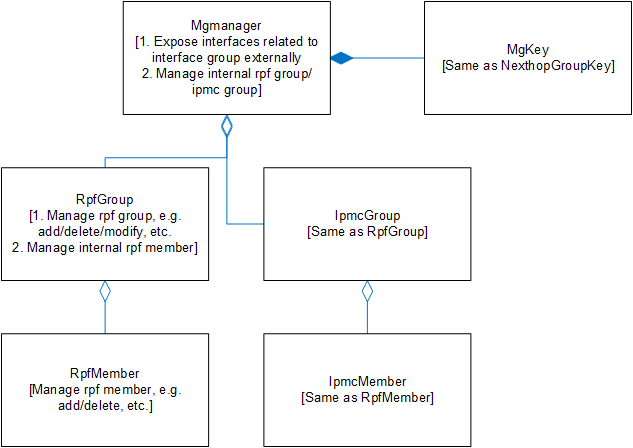

# IPMC Data Plane HLD

## Table of Content

- [IPMC Data Plane HLD](#ipmc-data-plane-hld)
  - [Table of Content](#table-of-content)
    - [Revision](#revision)
    - [Scope](#scope)
    - [Definitions/Abbreviations](#definitionsabbreviations)
    - [Overview](#overview)
    - [Requirements](#requirements)
      - [Functional Requirements](#functional-requirements)
      - [Configuration and Management Requirements](#configuration-and-management-requirements)
    - [Architecture Design](#architecture-design)
    - [High-Level Design](#high-level-design)
      - [Read IP multicast routes from the kernel](#read-ip-multicast-routes-from-the-kernel)
      - [Enabling IGMP](#enabling-igmp)
      - [DB Changes](#db-changes)
        - [APPL\_DB changes](#appl_db-changes)
      - [SWSS Container](#swss-container)
      - [mgmanager](#mgmanager)
      - [CRM](#crm)
      - [Warm reboot requirements](#warm-reboot-requirements)
      - [Sequence diagram](#sequence-diagram)
      - [Scalability and performance requirements](#scalability-and-performance-requirements)
    - [SAI API](#sai-api)
      - [COPP\_TABLE Traps](#copp_table-traps)
    - [Configuration and management](#configuration-and-management)
      - [Manifest](#manifest)
      - [CLI/YANG model Enhancements](#cliyang-model-enhancements)
        - [Interface Yang Model](#interface-yang-model)
        - [IPMC commands](#ipmc-commands)
          - [Config commands](#config-commands)
          - [Show commands](#show-commands)
      - [Config DB Enhancements](#config-db-enhancements)
    - [Warmboot and Fastboot Design Impact](#warmboot-and-fastboot-design-impact)
    - [Restrictions/Limitations](#restrictionslimitations)
    - [Testing Requirements/Design](#testing-requirementsdesign)
      - [Unit Test cases](#unit-test-cases)
      - [System Test cases](#system-test-cases)
    - [Open/Action items](#openaction-items)

### Revision

| Rev  | Date        | Author   | Change Description             |
| :--- | :---------- | :------- | :----------------------------- |
| 0.1  | Aug-13-2024 | Hb-micas | Initial version                |
| 0.2  | Nov-12-2024 | Hb-micas | Revise HLD per review feedback |

### Scope

This document describes how to implement the IPMC data plane feature in SONiC infrastructure.

- This document only discusses the SONiC data plane integration with IPMC functionality
- Other multicast routing protocols that use the PIM protocol (or other network protocols) are beyond the scope of this document

### Definitions/Abbreviations

Table 1: Abbreviations

| Abbreviation | Description               |
| :----------- | :------------------------ |
| FRR          | Free Range Routing Stack  |
| CLI          | Command Line Interface    |
| ASM          | Any-Source Multicast      |
| SSM          | Source-Specific Multicast |
| RPF          | Reverse Path Forwarding   |
| IPMC         | IP Multicast              |
| Mroute       | Multicast Route           |
| Nhg          | NextHop Group             |

### Overview

IP multicast is a network communication technique that allows a single sender to send packets to multiple destinations without having to send packets separately for each destination. This method greatly saves bandwidth resources and improves the efficiency of the network. For different Multicast group members, Multicast service models can be divided into ASM(Any-Source multicast) and SSM(Source-Specific multicast) service models. To ensure efficient transmission of multicast data, IP multicast uses the RPF (Reverse Path Forwarding) mechanism.

Routers dynamically establish forwarding tables through protocols (such as IGMP, PIM, MSDP, etc.) and maintain a multicast forwarding table, recording the membership of the multicast group and the corresponding outbound interface.

Multicast packets target a specific multicast address (224.0.0.0/4 for ipv4 and FF00::/8 for ipv6).

### Requirements

#### Functional Requirements

The following requirements are addressed by the design presented in this document:

1. Support IP multicast routing: ASM and SSM
2. Support IPv4 and IPv6 multicast routes
3. Support IP multicast function for routing interfaces, SVI interfaces, L3 subinterfaces, and L3 Portchannel interfaces 
4. Support non-default VRF for IP multicast routes
5. Support warm reboot for IP multicast routes

#### Configuration and Management Requirements

This document proposes that configuration and management should meet the following:

1. Enable IP multicast on interfaces

   > The default interface is not enabled to forward multicast routes

### Architecture Design

This document is designed to integrate the IP multicast routing function into the SWSS Container, so that related components can support IP multicast routing installing and warm reboot functions, and finally support the IP multicast routing function at the chip level.

In SONiC, unicast routes and ECMP routes are sent via the fpm component to the APPL DB for further processing on the data plane. However, for IP multicast routing, the FRR Container has not passed the IP multicast routing data to the fpm component.

The frr-pimd/pim6d daemon process is introduced in the FRR Container, in order to learn IP multicast routes under the PIM protocol and install IP multicast routes to the kernel.

For the implementation of the data plane, firstly, the fpm component does not support IP multicast routing right now; secondly, in order to support more IP multicast protocols as much as possible;  thirdly, the implementation and support of FRR Container are beyond the design scope of this document, so the design will use Linux kernel as multicast route source.

In ECMP routing, there is already a very elegant nexthop group design and implementation, so for IP multicast routing reference this design uses mgmanager to manage the ipmc group and rpf group.

The following diagram summarizes the key structure of IPMC functionality in SONiC (The abbreviation of FRR Container is frr-pimd):


Figure 1. IPMC main structure.

### High-Level Design

#### Read IP multicast routes from the kernel

When obtaining kernel IP multicast routing information through NetLink, you need to listen to the corresponding message type:

Listen for NetLink message group type

```text
RTNLGRP_IPV4_MROUTE
RTNLGRP_IPV6_MROUTE
```

Listens for the netlink message type

```text
RTM_NEWROUTE
RTM_DELROUTE
```

The obtained routing information family should be of multicast type

```text
RTNL_FAMILY_IPMR
```

#### Enabling IGMP

The actions taken to trap IGMP control packets to CPU when the user enables IGMP on an interface is described in the below document: [sonic-net#425](https://github.com/sonic-net/SONiC/pull/425).

#### DB Changes

##### APPL_DB changes

Special note:

1. The multicast route has one more key field than other routes: the source IP address. Therefore, the multicast route cannot share the same TABLE with the original routing entries
2. When delivering an ipv6 multicast route, assume that both the source and destination IP addresses are ipv6. If the default delimiter of APPL DB ':' is used, the two ipv6 addresses cannot be distinguished by delimiter. Therefore, the delimiter '|' is used here.

MROUTE_TABLE

Producer: mroutesyncd

Consumer: mrouteorch

Description: A table was added to store IP multicast routing data. One entry corresponds to one multicast route.

Schema:

```SQL
; New table
; Store IP multicast routing data

key = MROUTE_TABLE:vrf_name@source_ip,dest_ip
                                    ; APPL DB usually uses ':' as the separator, but using ':' cannot distinguish two ipv6 addresses
                                    ; Referring to 'NexthopGroupKey', the VRF uses '@' as the separator, and IP addresses use ',' as the separator
                                    vrf_name    ; The multicast route belongs to the Vrf. If this field is empty, the default global Vrf is used
                                    source_ip   ; Source IP addresses of multicast routes, for example, IPv4 0.0.0.0(ASM), A.B.C.D(SSM)
                                    dest_ip     ; Indicates the destination IP address of the multicast route

; field = value
incoming_group = router_intfs_group  ; IP multicast routes into an interface member group, which can be empty or have multiple members. Each member is separated by commas ','
outgoing_group = router_intfs_group  ; The IP multicast route outgoing interface member group, which cannot be empty. It can have one or more members. Each member is separated by commas ','
```

Example:

```bash
admin@sonic:~$ redis-cli -n 0 hgetall "MROUTE_TABLE:0.0.0.0,225.0.0.1"
1) "incoming_group"
2) "Ethernet1"
3) "outgoing_group"
4) "Ethernet13,Ethernet15"
```

```bash
admin@sonic:~$ redis-cli -n 0 hgetall "MROUTE_TABLE:192.168.1.200,230.0.0.1"
1) "incoming_group"
2) "Ethernet49"
3) "outgoing_group"
4) "Ethernet39,Ethernet65,Vlan200"
```

```bash
admin@sonic:~$ redis-cli -n 0 hgetall "MROUTE_TABLE:Vrf1@192.168.1.200,230.0.0.1"
1) "incoming_group"
2) "Ethernet49"
3) "outgoing_group"
4) "Ethernet39,Ethernet65,Vlan200"
```

INTF_TABLE

Producer: intfmgrd

Consumer: intfsorch

Description: Add a new field to store the multicast forwarding capability of the interface.

Schema:

```sql
;Modify table
;Store interface data

key = INTF_TABLE:interface_name
            interface_name    ; Configure interface name

; field = value
ipmc_forward = "enable"/"disabled";
```

Example:

```bash
admin@sonic:~$ redis-cli -n 0 hgetall "INTF_TABLE:Ethernet49"
1) "NULL"
2) "NULL"
3) "mac_addr"
4) "00:00:00:00:00:00"
5) "ipmc_forward"
6) "enable"
```

#### SWSS Container

mroutesyncd

- Reads IP multicast routing messages from the kernel and listens for IP multicast routing changes in the kernel
- Based on netlink messages, the source IP address, destination IP address, inbound interface member, and outbound member of the IP multicast route are resolved and written into the APPL DB
- During a warm reboot, compare the kernel multicast route and APPL DB data to update the warm reboot data

intfsorch

- Listens to INTF_TABLE in the APPL DB and enables the IP multicast forwarding function of the corresponding routing interface

mgmanager

- IP Multicast route encapsulation management of incoming and outgoing interface groups
- Encapsulate and manage the creation, modification, and deletion of rpf group and ipmc group
- Implement rpf/ipmc group and member reference counting, exception handling, and other behaviors
- Internally invoke the SAI API of the rpf/ipmc group and member. For details about the SAI API, see the following
- Provides external query and update interfaces for the rpf/ipmc group

mrouteorch

- Listens to MROUTE_TABLE in the APPL DB and queries the corresponding rpf group and ipmc group.
- Associate the corresponding rpf group and ipmc group IDs, and invoke the SAI API to create IP multicast routes.
- Count and track the number of IP multicast routes generated.

#### mgmanager

Follow the nexthop group design, and manage the Group and Members separately:
> The reason why the nexthop group is not used directly, is that the nhg has been strongly coupled with SAI API when it is implemented. The multicast routing services cannot be reused.</br>
> In addition, nhg IDs are often referenced by other businesses, so abstracting a single mgmanager can also avoid misuse by unfamiliar businesses.

The functionality of mgmanager mainly consists of two parts:

- Expose function interfaces for querying and managing IpmcGroup and RpfGroup externally
  - Provide operations such as querying groups, adding groups, and deleting groups.
- Manage IpmcGroup and RpfGroup internally
  - Call SAI APIs based on groups to operate on corresponding groups/members.
  - Increase the reference count of the interface based on members.
  - Since there is no available_group/member SAI API, CRM statistics are not considered for now.

The reference architecture diagram for mgmanager is as follows:



Figure 2. Architecture diagram for mgmanager.

#### CRM

Similar to unicast routes, IP multicast routes also involve multiple resources that need to be counted

However, since the current SAI API only supports SAI_SWITCH_ATTR_AVAILABLE_IPMC_ENTRY, only IP multicast route counting is considered:
> CrmOrch already supports statistics for IPMC entries.</br>
> Therefore, in business logic, the corresponding CrmOrch functions can be invoked based on the actions of created or deleted IP multicast routes.

```c++
// new ipmc route
gCrmOrch->incCrmResUsedCounter(CrmResourceType::CRM_IPMC_ENTRY);
// delete ipmc route
gCrmOrch->decCrmResUsedCounter(CrmResourceType::CRM_IPMC_ENTRY);
```

#### Warm reboot requirements

This document mainly considers the data plane IP multicast routing function data plane warm reboot:

The warm reboot support for the protocol plane is not in the design scope. In this case, the IP multicast route obtained from the kernel can be regarded as the latest routing data on the data plane.

1. The data plane is warm rebooted
2. mroutesycnd reads the kernel IP multicast routing information and sends it to the common warm reboot component for comparison
3. The warm reboot component writes the data to be updated to the APPL DB to complete the IP multicast route update
4. The warm reboot of the data plane is complete

#### Sequence diagram

Add an IP multicast route (simplify the protocol plane into an FRR component for description. In actual situations, the selection of the protocol plane may be different):


Figure 3.  Add new IP multicast routes.

Warm Reboot:


Figure 4. IP multicast routes warm reboot.

#### Scalability and performance requirements

There are two types of capacities that need to be discussed for IP multicast routing:

- For RPF/IPMC groups and members, since the current SAI API does not implement query interfaces for multicast group and member group capacities, no constraints are applied to related capacities.

  > However, the device must continue to run normally in scenarios where the capacity is exceeded..

- For IPMC routes, the current SAI API only supports an interface for querying the available capacity, but does not provide a query interface for the total multicast route capacity.
  - During warm reboot, the chip already contains some existing capacities, so it is not possible to infer the total capacity directly from the available capacity.
  - Combining warm reboot and available capacity management exceeds the design scope of IP multicast routing. In general, SAI APIs should directly provide capacity query interfaces. Therefore, this document assumes that querying total capacity for IP multicast routes is currently not supported.
  - Therefore, only CRM-related processes are considered for support.

In terms of performance:

- because the SAI API does not define batch installation of bulk interfaces, IP multicast routes can only be delivered by invoking the SAI API one by one.

### SAI API

The SAI API invocation of IP multicast routing is similar to ECMP routing. A group is created and a member is added. Then, the created rpf group, ipmc group, source IP address, and destination IP address will be bound.

In simple terms:
> Use sai_ipmc_group_api to create nexthop groups and members
> Use sai_rpf_group_api to create rpf groups and members
> Use sai_ipmc_api, source IP address, destination IP address, ipmc group id, and rpf group id to create IP multicast routes

The SAI API involved is as follows:
| SAI API                                              | SAI attributes                                                                                                 |
| ---------------------------------------------------- | -------------------------------------------------------------------------------------------------------------- |
| sai_router_intfs_api->set_router_interface_attribute | SAI_ROUTER_INTERFACE_ATTR_V4_MCAST_ENABLE</br>SAI_ROUTER_INTERFACE_ATTR_V6_MCAST_ENABLE                        |
| sai_rpf_group_api->create_rpf_group                  | NULL                                                                                                           |
| sai_rpf_group_api->create_rpf_group_member           | SAI_RPF_GROUP_MEMBER_ATTR_RPF_GROUP_ID</br>SAI_RPF_GROUP_MEMBER_ATTR_RPF_INTERFACE_ID                          |
| sai_ipmc_group_api->create_ipmc_group                | NULL                                                                                                           |
| sai_ipmc_group_api->create_ipmc_group_member         | SAI_IPMC_GROUP_MEMBER_ATTR_IPMC_GROUP_ID</br>SAI_IPMC_GROUP_MEMBER_ATTR_IPMC_OUTPUT_ID                         |
| sai_ipmc_api->create_ipmc_entry                      | SAI_IPMC_ENTRY_ATTR_OUTPUT_GROUP_ID</br>SAI_IPMC_ENTRY_ATTR_PACKET_ACTION</br>SAI_IPMC_ENTRY_ATTR_RPF_GROUP_ID |

Example of enabling ipv4 ipmc packet forwarding:

```c++
 sai_attribute_t attr;
 attr.value.booldata = mcast_status;

 attr.id = SAI_ROUTER_INTERFACE_ATTR_V4_MCAST_ENABLE;
 sai_status_t status = sai_router_intfs_api->set_router_interface_attribute(port.m_rif_id, &attr);
```

Example of creating an ipmc group member:

```c++
sai_attribute_t ipmc_entry_attr;
vector<sai_attribute_t> ipmc_entry_attrs;

ipmc_entry_attr.id = SAI_IPMC_GROUP_MEMBER_ATTR_IPMC_GROUP_ID;
ipmc_entry_attr.value.oid = group_id;
ipmc_entry_attrs.push_back(ipmc_entry_attr);

ipmc_entry_attr.id = SAI_IPMC_GROUP_MEMBER_ATTR_IPMC_OUTPUT_ID;
ipmc_entry_attr.value.oid = m_rif;
ipmc_entry_attrs.push_back(ipmc_entry_attr);
sai_status_t status = sai_ipmc_group_api->create_ipmc_group_member(&m_id, gSwitchId, (uint32_t)ipmc_entry_attrs.size(), ipmc_entry_attrs.data());
```

Example of creating an ipmc route:

```c++
sai_attribute_t ipmc_entry_attr;
vector<sai_attribute_t> ipmc_entry_attrs;
sai_ipmc_entry_t ipmc_entry;
ipmc_entry_attr.id = SAI_IPMC_ENTRY_ATTR_OUTPUT_GROUP_ID;
ipmc_entry_attr.value.oid = ipmc_group_id;
ipmc_entry_attrs.push_back(ipmc_entry_attr);

ipmc_entry_attr.id = SAI_IPMC_ENTRY_ATTR_PACKET_ACTION;
ipmc_entry_attr.value.oid = SAI_PACKET_ACTION_FORWARD;
ipmc_entry_attrs.push_back(ipmc_entry_attr);

ipmc_entry_attr.id = SAI_IPMC_ENTRY_ATTR_RPF_GROUP_ID;
ipmc_entry_attr.value.oid = rpf_group_id;
ipmc_entry_attrs.push_back(ipmc_entry_attr);

ipmc_entry.vr_id = vrf_id;
ipmc_entry.switch_id = gSwitchId;
ipmc_entry.type = src_ip.isZero() ? SAI_IPMC_ENTRY_TYPE_XG : SAI_IPMC_ENTRY_TYPE_SG;
copy(ipmc_entry.source, src_ip);
ipmc_entry.source.addr_family = SAI_IP_ADDR_FAMILY_IPV4;
copy(ipmc_entry.destination, dest_ip);
ipmc_entry.destination.addr_family = SAI_IP_ADDR_FAMILY_IPV4;

sai_status_t status = sai_ipmc_api->create_ipmc_entry(&ipmc_entry, (uint32_t)ipmc_entry_attrs.size(), ipmc_entry_attrs.data());
```

#### COPP_TABLE Traps

Control Plane Policing (COPP) table entries are used to Trap IGMP packets and unknown IP multicast packets to the host.

The following are the definitions of IGMP packets and unknown IP multicast packets in COPP and their corresponding SAI value:

```c++
{"igmp_query", SAI_HOSTIF_TRAP_TYPE_IGMP_TYPE_QUERY},
{"igmp_leave", SAI_HOSTIF_TRAP_TYPE_IGMP_TYPE_LEAVE},
{"igmp_v1_report", SAI_HOSTIF_TRAP_TYPE_IGMP_TYPE_V1_REPORT},
{"igmp_v2_report", SAI_HOSTIF_TRAP_TYPE_IGMP_TYPE_V2_REPORT},
{"igmp_v3_report", SAI_HOSTIF_TRAP_TYPE_IGMP_TYPE_V3_REPORT},
...
{"l3_multicast", SAI_HOSTIF_TRAP_TYPE_UNKNOWN_L3_MULTICAST},
```

CoPP will be extended as follows for trapping unknown IP multicast packets:
> IGMP packet configuration follows [Enabling IGMP](#enabling-igmp) and will not be elaborated further.

```json
  "trap.group.l3_multicast": {
    "cir":"600",
    "cbs":"600",
    "meter_type":"packets",
    "mode":"sr_tcm",
    "red_action":"drop",
    "trap_action":"trap",
    "trap_priority":"4",
    "queue": "4",
    "yellow_action":"drop"
  },
  ...
  "l3_multicast": {
    "trap_ids": "l3_multicast",
    "trap_group": "trap.group.l3_multicast",
  },
```

### Configuration and management

#### Manifest

N/A

#### CLI/YANG model Enhancements

The IPMC forwarding function is enabled on the interface

##### Interface Yang Model

Revised sonic-interface.yang to add ipmc_forward field

```yang
container INTERFACE {
..
  leaf ipmc_forward {
      description "enable/disable ipmc forward for the interface";
      type enumeration {
          enum enable;
          enum disable;
      }
  }
..
}
```

##### IPMC commands

SONIC Click-based configuration and monitoring CLIs have been introduced in SONIC for interface ipmc

###### Config commands

```python
config interface ipmc <interface_name> <ipmc_forward>
```

- Run this command to enable or disable IP multicast packet forwarding on an interface
- interface_name: interface name (Ethernet/Vlan/PortChannel/sub-interface)
- ipmc_forward: enable the IP multicast packet forwarding function

###### Show commands

```python
show interface ipmc { <interface_name> }
```

- Run the IP multicast packet forwarding command to show the configuration of the multicast packet forwarding function on the interface

#### Config DB Enhancements

INTERFACE_TABLE

Producer: config manager

Consumer: intfmgrd

Description: Added a field to check whether the ip multicast forwarding has been enabled or not.

Schema:

```sql
;Modify table
;The field of enabling ip multicast forwarding is added

key = INTERFACE|interface_name
                                  ; Interface name string like Vlan1 or PortChannel002 or Ethernet4
; field = value
..
ipmc_forward = "enable"/"disable" ; Whether to enable ip multicast forwarding on the interface. The default value is disable
..
```

Example:

```bash
admin@sonic:~$ redis-cli -n 4 hgetall "INTERFACE|Ethernet3"
1) "ipmc_forward"
2) "enable"
```

### Warmboot and Fastboot Design Impact

The IPMC function's warm reboot relies on the warm reboot of the protocol plane. That is, the protocol plane is required to maintain the original IP multicast route during the warm reboot and update the changed IP multicast route after the warm reboot is complete (warm reboot support for  protocol plane is not in the design scope).

The warm reboot of the data plane uses a common warm reboot component to compare the kernel IP multicast route with the IP multicast route of the APPL DB, to ensure that the warm reboot does not affect data forwarding.

### Restrictions/Limitations

Due to SAI API restrictions, the following functions are not supported:

1. Query the capacity of the IP multicast route. Query the capacity of the IP multicast route in and out interface groups
2. IP multicast routes bulk API

The protocol plane must also support the warm reboot function to ensure uninterrupted flow during the warm reboot process

### Testing Requirements/Design

#### Unit Test cases

Unit test cases for this specification are listed below:

| Test Cases         | UT Action and observation                                                                                                             | Remarks |
| :----------------- | :------------------------------------------------------------------------------------------------------------------------------------ | :------ |
| Configuration      | Verify the Ethernet/Vlan/PortChannel interface enable IP group broadcast forwarding function                                          |         |
| IP multicast route | Verify that the protocol plane creates/deletes/updates IP multicast routes, and the data plane can receive and process them normally  |         |
|                    | Verify that ASM-type multicast routes are created or deleted                                                                          |         |
|                    | The SSM type multicast route was created or deleted. Procedure                                                                        |         |
|                    | Verify that an IP multicast route bound to a non-default Vrf is created or deleted                                                    |         |
|                    | Verify that multicast routes containing one or more inbound interfaces are created or deleted                                         |         |
|                    | Verify that multicast routes containing one or more outbound interfaces are created or deleted                                        |         |
|                    | Verify that IP multicast routes are updated in the APPL DB after they are created, deleted, or updated                                |         |
|                    | Verify that the APPL DB and ASIC DB data are consistent after IP multicast routes are created, deleted, or updated                    |         |
|                    | Using IPv6 addresses, validate the unit test cases[IP multicast route]                                                                |         |
| Logs and errors    | Any abnormal and failed operations are logged                                                                                         |         |
|                    | Verification after abnormal data is delivered, mroutesyncd logs it and ignores processing                                             |         |
|                    | After verifying that the invocation of the SAI API fails, mrouteorch logs correctly and handles according to the invocation exception |         |

#### System Test cases

Unit system cases for this specification are listed below:

| Test Cases    | UT Action and observation                                                                                                                                                    | Remarks |
| :------------ | :--------------------------------------------------------------------------------------------------------------------------------------------------------------------------- | :------ |
| Configuration | Verify IP multicast routes and counts for reference whose impact interfaces                                                                                                  |         |
| Verification  | Verify whether IP multicast packet forwarding is enabled on the interface and is restored at config-reload                                                                   |         |
|               | Based on unit test cases[IP multicast route], Add an IP multicast route and send an IP multicast packet to verify whether the IP multicast route work or not                 |         |
|               | Verify enable/disable IP multicast packets forwarding function in Ethernet/Vlan/PortChannel interfaces                                                                       |         |
|               | Delete the IP multicast route and send an IP multicast packet to verify the IP multicast route work or not                                                                   |         |
|               | Verify system test cases by using IPv6 addresses[Verification]                                                                                                               |         |
| Warm reboot   | Verify the SWSS has warm reboot and the IP multicast route does not interrupt or lose packets                                                                                |         |
| Capacity      | Verify that under the maximum number of IP group routes, sends IP multicast packets to verify the preceding functions                                                        |         |
|               | Verify that when the number of IP multicast routes exceeds the maximum chip capacity, the device still runs normally except for the IP multicast routing function            |         |
|               | Create IP multicast incoming interface groups and members that exceed the maximum chip capacity, and the device still runs normally except the IP multicast routing function |         |
|               | Create IP multicast outgoing interface groups and members that exceed the maximum chip capacity, and the device still runs normally except the IP multicast routing function |         |
|               | After creating IP multicast routes that exceed the maximum chip capacity, delete all IP multicast routes and the IP multicast function still works properly                  |         |

### Open/Action items

N/A
