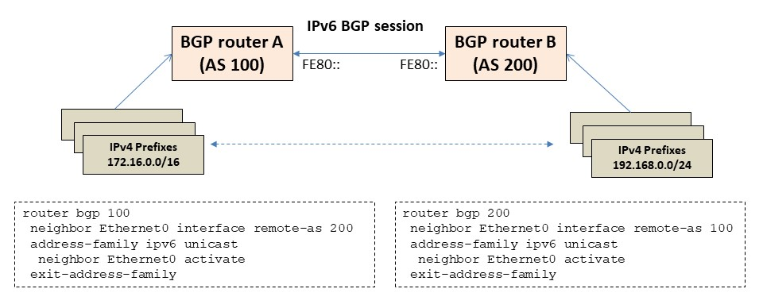
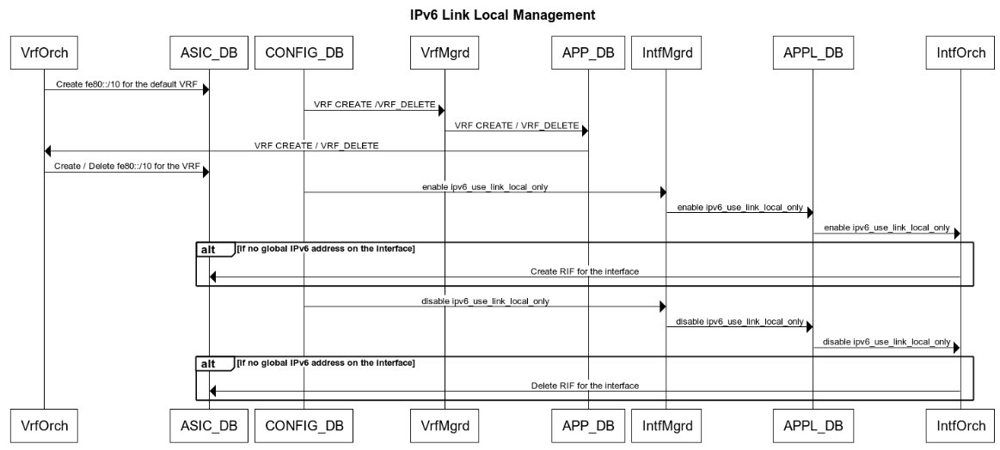

# IPv6 Link-local enhancements

# High Level Design Document
#### Rev 0.3

# Table of Contents
  * [List of Tables](#list-of-tables)
  * [Revision](#revision)
  * [About This Manual](#about-this-manual)
  * [Scope](#scope)
  * [Definition/Abbreviation](#definitionabbreviation)
  * [1 Feature Overview](#1-feature-overview)
    * [1.1 Requirements](#11-requirements)
      * [1.1.1 Functional Requirements](#111-functional-requirements)
      * [1.1.2 Configuration and Management Requirements](#112-configuration-and-management-requirements)
      * [1.1.3 Scalability Requirements](#113-scalability-requirements)
      * [1.1.4 Warm Boot Requirements](#114-warm-boot-requirements)
    * [1.2 Design Overview](#12-design-overview)
      * [1.2.1 Basic Approach](#121-basic-approach)
      * [1.2.2 Container](#122-container)
      * [1.2.3 SAI Overview](#123-sai-overview)
  * [2 Functionality](#2-functionality)
    * [2.1 Target Deployment Use Cases](#21-target-deployment-use-cases)
    * [2.2 Functional Description](#22-functional-description)
	  * [2.2.1 IPv6 Global Command](#221-ipv6-global-command)
	  * [2.2.2 IPv6 use-link-local-only](#222-ipv6-use-link-local-only)
  * [3 Design](#3-design)
    * [3.1 Overview](#31-overview)
    * [3.2 DB Changes](#32-db-changes)
      * [3.2.1 CONFIG DB](#321-config-db)
      * [3.2.2 APP DB](#322-app-db)
      * [3.2.3 STATE DB](#323-state-db)
      * [3.2.4 ASIC DB](#324-asic-db)
      * [3.2.5 COUNTER DB](#325-counter-db)
    * [3.3 Switch State Service Design](#33-switch-state-service-design)
      * [3.3.1 Orchestration Agent](#331-orchestration-agent)
      * [3.3.2 NeighSyncd changes](#332-neighsyncd-changes)
      * [3.3.3 IntfMgr](#333-intfmgr)
      * [3.3.4 IntfOrch](#334-intforch)
    * [3.4 SyncD](#34-syncd)
    * [3.5 SAI](#35-sai)
    * [3.6 CLI](#36-cli)
      * [3.6.1 Data Models](#361-data-models)
      * [3.6.2 Configuration Commands](#362-configuration-commands)
      * [3.6.3 Show Commands](#363-show-commands)
  * [4 Flow Diagrams](#4-flow-diagrams)
  * [5 Error Handling](#5-error-handling)
  * [6 Serviceability and Debug](#6-serviceability-and-debug)
  * [7 Warm Boot Support](#7-warm-boot-support)
  * [8 Scalability](#8-scalability)
  * [9 Unit Test](#9-unit-test)
    * [9.1 CLI Test Cases](#91-cli-test-cases)
    * [9.2 Rest API Test Cases](#92-rest-api-test-cases)
    * [9.3 Functional Test Cases](#93-functional-test-cases)
    * [9.4 Scaling Test Cases](#94-scaling-test-cases)
    * [9.5 Warm Boot Test Cases](#95-warm-boot-test-cases)
    * [9.6 Negative Test Cases](#96-negative-test-cases)
  
# List of Tables
[Table 1: Abbreviations](#table-1-abbreviations)

# Revision
| Rev |     Date    |       Author          | Change Description                |
|:---:|:-----------:|:---------------------:|-----------------------------------|
| 0.1 | 05/28/2020  | Abhimanyu Devarapalli | Initial version                   |
| 0.2 | 08/20/2020  | Santosh Doke          | Addressed review comments         |
| 0.3 | 06/25/2021  | Kiran Kella           | Addressed review comments         |

# About this Manual
This document provides general information about the IPv6 link-local enhancements in SONiC.
# Scope
This document describes the high level design of IPv6 link-local enhancements.

# Definition/Abbreviation
### Table 1: Abbreviations
| **Term**                 | **Meaning**                         |
|--------------------------|-------------------------------------|
| ECMP                     | Equal Cost Multi Path               |
| EUI                      | Extended Unique Identifier          |
| swss                     | Switch State Service                |

# 1 Feature Overview
## 1.1 Requirements
### 1.1.1 Functional Requirements
1. Support auto-generation of IPv6 link-local address. An auto-generated IPv6 link-local address is an IPv6 unicast address that is automatically configured on interface. It uses the  prefix FE80::/64 and the interface identifier in the modified EUI-64 format. It is standardized through RFC 2373. Exactly one auto-generated IPv6 link-local address per interface is supported.
2. Support manual configuration of IPv6 link-local address on the interface. For all practical use-case, only one link-local address per interface is required, in which case the number of link-local IPv6 addresses is limited by the number of router interfaces supported by the switching ASIC.
3. Support IPv6 Link Local addresses on Ethernet, Port-channel, VLAN interfaces. Loopback interfaces do not require link-local address and hence do not have an auto-generated address.
4. Support Neighbor Discovery  to determine/learn the IPv6 link-local addresses of neighbors on the attached links.
5. Support IPv6 routes (including ECMP) via IPv6 link-local next hops. As SONIC uses same router MAC address for all L3 interfaces, it is mandatory to specify the interface along with the IPv6 link-local next hop.
6. Support IPv6 protocols using Link local address.  This applies to all protocols, like BGP or ICMPv6, that support global IPv6 address.
7. Support to trap control packets destined to IPv6 link-local address to CPU.
8. Support filtering of packets with IPv6 link-local source or destination addresses. These packets must not be routed to other interfaces.  This implies utilities like trace route are not applicable for IPv6 link-local addresses. Also, ping to link-local address is only applicable for directly connected networks.
9. Support BGP peering using unnumbered interface configuration. In this configuration, the IPv6 link-local address of the interface is used and the remote peer IPv6 link-local address is dynamically discovered to establish adjacency.
10. IPv6 mode is enabled by default on an interface.
11. Support per interface knob to enable IPv6 auto link-local address generation in the absence of manually configured IPv6 addresses on the interface.
12. Support for global IPv6 command to disable or enable IPv6 auto link-local address generation (in the absence of manually configured addresses) on all the existing eligible interfaces in the switch. Exceptions are the OOB port (eth0) and Linux loopback (lo) port. In L2 only deployments, it is desirable to turn off auto-generating link-local address so that IPv6 control packets are not transmitted by switch. L3 applications are responsible to handle the interface address add and delete events and cleanup/restore the state. For other applications like ACL, link-local addresses are treated like global IPv6 address. This command applies to all VRF instances in the system.


### 1.1.2 Configuration and Management Requirements
1. FRR 7.0 CLI already supports IPv6 link-local addresses.  There are no new configuration commands required to handle IPv6 link local addresses. When configuring IPv6 route with link-local next hop,  interface name must be specified to uniquely identify the gateway interface .

   `#ipv6 route 5555::1/64 fe80::5054:ff:fea2:4a00 Ethernet124`

2. FRR 7.0 CLI already supports configuring BGP using unnumbered.

   `#neighbor Ethernet0 interface remote-as 100`

   `#address-family ipv6 unicast`

   `#neighbor Ethernet0 activate`

3. Provide SONiC CLI per interface configuration command to enable and disable the IPv6 auto link-local address generation when addresses are not configured manually. By default the IPv6 link-local address generation knob is disabled. Refer to section 2.2 for more details. 

   `#config interface ipv6 enable use-link-local-only Ethernet24`

   `#config interface ipv6 disable use-link-local-only Ethernet24`

4. Provide SONiC CLI global command to enable or disable the IPv6 auto link-local address generation configuration on all eligible interfaces.

   `#config ipv6 enable link-local`

   `#config ipv6 disable link-local`

5. Standard SNMP IP-MIB should support retrieving of link-local IPv6 addresses/neighbors.


### 1.1.3 Scalability Requirements
The maximum number of IPv6 link-local addresses depends on number of Ethernet, LAG, VLAN interfaces supported by the switch. For example, a 64 port switch with 64 max PortChannel interfaces and 4K VLAN interfaces would require maximum of 4094+64+64 link-local addresses.

### 1.1.4 Warm Boot Requirements
L3 Traffic destined to IPv6 link-local next hops/neighbors should continue to be routed across warm restart. There should be no or minimal loss with in acceptable limits (< 1sec).

## 1.2 Design Overview
### 1.2.1 Basic Approach
SONiC already supports IPv6 addressing. This feature extends IPv6 by adding link-local address support.  SWSS is modified to handle IPv6 link-local neighbors and IPv6 routes with link-local next hops.

### 1.2.2 Container
The code changes for this feature are part of *neighsyncd*  *routeorch* and *intfmgrd* modules which are part of SWSS container.

### 1.2.3 SAI Overview
There are no changes to SAI headers/implementation to support this feature. Existing SAI Neighbor, Next hop and Route APIs are used to handle IPv6 link-local addresses.

# 2 Functionality
## 2.1 Target Deployment Use Cases
When BGP is deployed in a IPv6 data center network, it is desirable to configure BGP neighbors using IPv6 link-local addresses to avoid assigning and managing global IPv6 addresses on interconnect links.  In such configurations, BGP auto-detects the neighbor using IPv6 router advertisements. This can be leveraged to advertise IPv4 prefixes over IPv6 BGP session (RFC5549).

The below diagram shows the deployment use case.

1. IPv6 link local address used for BGP peering
2. RFC 5549 advertises the IPv4 addresses over BGP IPv6 peering
3. IPv6 router advertisement is used to learn peer's link-local address.
4. For configuration, the BGP neighbor is identified using interface 'Ethernet0' and not IPv6 address.



The following command shows the IPv4 routes learned via IPv6 link-local next hops on Router A:

```
sonic# show ip route
Codes: K - kernel route, C - connected, S - static, R - RIP,
       O - OSPF, I - IS-IS, B - BGP, E - EIGRP, N - NHRP,
       T - Table, v - VNC, V - VNC-Direct, A - Babel, D - SHARP,
       F - PBR, f - OpenFabric,
       > - selected route, * - FIB route # - not installed in hardware

B    192.168.0.0/24 [20/0] via fe80::5054:ff:fe03:6175, Ethernet0, 00:00:06
```


## 2.2 Functional Description
This document describes the functional changes required to support IPv6 link-local addresses.

A link-local address is an IPv6 unicast address that is automatically configured on an interface using the link-local prefix FE80::/10 and the interface identifier (EUI-64 format). Link-local addresses are not necessarily bound to the MAC address, they can be configured manually as per FE80::/10 format.

These addresses are restricted to a particular interface and are only used for addressing on that interface. They are typically used for automatic address configuration and neighbor discovery protocol. Link-local addresses can be used to reach the neighboring nodes attached to the same interface. These interfaces do not need a globally unique address to communicate. L3 routers do not forward IPv6 packets with link-local source or destination addresses. Every IPv6 enabled interface has at least one link-local unicast address.

### 2.2.1 IPv6 Global Command
Global IPv6 enable/disable command loops through all eligible interfaces and enables/disables the IPv6 'use-link-local-only' configuration. It is not a configuration knob but an action command. Eligible interface criteria is mentioned in section below.

By default, the IPv6 mode is disabled on an interface excepting the out-of-band interface (eth0) and the linux kernel loopback interface (lo).

### 2.2.1 IPv6 use-link-local-only
The 'use-link-local-only' configuration is enabled on an interface to enable IPv6 mode on the interface as well as to enable IPv6 auto link-local generation, when there are not any explicitly configured addresses on the interface.

In other words, the IPv6 mode on an interface is enabled either when addresses (global or link-local) are manually configured (or) when IPv6 'use-link-local-only' mode is enabled.

Similarly, the IPv6 mode on an interface is disabled when IPv6 'use-link-local-only' mode is disabled with no manually configured addresses on the interface (or) when all addresses are unconfigured on the interface with IPv6 'use-link-local-only' disabled.

User can configure IPv6 'use-link-local-only' on an interface that satisfies the following criteria.

```
- L2 interface that is not part of a Port-Channel or a VLAN.
- L3 interface (Ethernet, VLAN, Port-Channel, Loopback)
```

An Ethernet interface is not allowed to be a member of a Port-Channel or a VLAN if 'use-link-local-only' configuration is enabled on the interface.
A Port-Channel is not allowed to be a member of a VLAN if 'use-link-local-only' configuration is enabled on the interface.

# 3 Design

## 3.1 Overview
The following components are modified to support IPv6 link local addresses.
- Route ORCH agent
- Neighbor ORCH agent
- CONFIG_DB, APP_DB, ASIC_DB and STATE_DB updates
- Interface manager

## 3.2 DB Changes
### 3.2.1 CONFIG DB
To support enabling/disable of IPv6 auto link-local address generation on an interface, a new key-value pair is defined as part of CONFIG_DB under INTERFACE table. The default value is "disable".

    "INTERFACE": {
        "Ethernet24": {
            "ipv6_use_link_local_only": "disable"
        }

    127.0.0.1:6379[4]> hgetall INTERFACE|Ethernet24
    1) "ipv6_use_link_local_only"
    2) "disable"

### 3.2.2 APP DB
To support auto generated IPv6 link-local address, the APP_DB interface tables and neighbor tables are updated to store link-local addresses too.

```
    "INTF_TABLE": {
        "Ethernet24": {
            "ipv6_use_link_local_only": "disable"
        }

    127.0.0.1:6379[0]> hgetall INTF_TABLE:Ethernet24
    1) "ipv6_use_link_local_only"
    2) "disable"

127.0.0.1:6379> keys *NEIGH*
1) "NEIGH_TABLE:Ethernet0:fe80::5054:ff:fe03:6175"

```
### 3.2.3 STATE DB
There are no changes to STATE DB schema definition.

### 3.2.4 ASIC DB
To support programming of link-local neighbors, ASIC_DB neighbor tables are updated to store the link-local neighbors.

```
127.0.0.1:6379[1]> keys *NEIGH*
	1) "ASIC_STATE:SAI_OBJECT_TYPE_NEIGHBOR_ENTRY:	{\"ip\":\"fe80::5054:ff:fe03:6175\",\"rif\":\"oid:0x60000000005b1\",\"switch_id\":\"oid:0x21000000000000\"}"
```

### 3.2.5 COUNTER DB
There are no changes to COUNTER DB schema definition.

## 3.3 Switch State Service Design

### 3.3.1 Orchestration Agent
- Adds IP2ME /128 route for the interface link-local address to hardware (Only 1 IP2ME route is added as the link-local address is same on all IPv6 interfaces). This enables prioritizing the traffic destined to the interface link-local address.
- Adds the fe80::/10 subnet route to the hardware per VRF. This allows for all traffic destined to link-local prefix to be copied to CPU.  Instead of adding multiple link-local routes to the hardware, a single /10 route is added to handle all link-local traffic. This helps reduce the usage of the hardware L3 route table resource.

For all practical use-cases, the fe80::/10 route is enough to handle all IPv6 packets destined to link-local destination. The IP2ME/128 route is added to be consistent with global IPv6 address - as the underlying SAI implementation may treat these differently. Also, in some deployments, servers can be configured with a default gateway in the fe80:: range - the fe80::/10 route helps to route traffic from those servers.

Changes done in NeighOrch:

* Add the interface parameter to the next hop object key. This allows to add multiple IPv6 link local next hops with same IPv6 address. This change was originally implemented as part of the VRF implementation.

```
struct NextHopKey
{
    IpAddress           ip_address;     // neighbor IP address
    string              alias;          // incoming interface alias
}
```

```
sonic# show ipv6 route

S>*  2222::/64 [1/0] via fe80::5054:ff:fe03:6175, Ethernet0, 00:00:04
  *                  via fe80::5054:ff:fe03:6175, Ethernet4, 00:00:04
  *                  via fe80::5054:ff:fe03:6175, Ethernet8, 00:00:04

127.0.0.1:6379> keys *NEIGH*
 1) "NEIGH_TABLE:Ethernet8:fe80::5054:ff:fe03:6175"
 2) "NEIGH_TABLE:Ethernet0:fe80::5054:ff:fe03:6175"
 3) "NEIGH_TABLE:Ethernet4:fe80::5054:ff:fe03:6175"

```

### 3.3.2 NeighSyncd

Neighsyncd is updated to learn the IPv6 link-local neighbors. All link-local neighbors that are dynamically learned are programmed to ASIC_DB.

### 3.3.3 IntfMgr
In the absence of manually configured addresses on an interface, to enable/disable IPv6 link-local mode, IntfMgr is modified to handle changes to the CONFIG DB `'ipv6_use_link_local_only'` setting by forwards the same `'ipv6_use_link_local_only'` mode to APPL_DB.

### 3.3.4 IntfOrch
- On receiving IPv6 Link local enable event on an interface, Orchagent then creates the L3 RIF based on these entries. This is needed to ensure that the L3 routing can happen even with out any global IPv6 address configured on the interface.
- On receiving IPv6 Link local disable event on interface, Orchagent then deletes the L3 RIF from the ASIC DB.

## 3.4 SyncD

## 3.5 SAI

## 3.6 CLI
### 3.6.1 Data Models

N/A

### 3.6.2 Configuration Commands

```
# config interface ipv6 enable use-link-local-only
Usage: config interface ipv6 [OPTIONS] COMMAND [ARGS] 

  Enable or Disable IPv6 processing on interface

Options:
  --help  Show this message and exit.

Commands:
  disable  Disable IPv6 processing on interface
  enable   Enable IPv6 processing on interface

#config ipv6 enable link-local
Usage: config ipv6 enable [OPTIONS]

  Enable IPv6 link-local on all interfaces

Options:
  --help  Show this message and exit.

#config ipv6 disable link-local
Usage: config ipv6 disable [OPTIONS]

  Disable IPv6 link-local on all interfaces

Options:
  --help  Show this message and exit.

```

### 3.6.3 Show Commands

```
# show ipv6 link-local-mode -h
Usage: show ipv6 link-local-mode [OPTIONS]

  show ipv6 link-local-mode

Options:
  --verbose    Enable verbose output
  --help       Show this message and exit.

``` 

# 4 Flow Diagrams
Below sequence depicts the interactions between various components for events w.r.t IPv6 Link Local Address and IPv6 Link Local Neighbor in SONiC



# 5 Error Handling

There is no specific limit enforced on the number of IPv6 addresses. It is limited by the underlying switching silicon. If the L3 interface table reaches full capacity, enabling IPv6 on interface may fail to route packets destined to IPv6 next hops.

# 6 Serviceability and Debug
All existing debug and serviceability for interface IPv6 global address works for link-local address.

# 7 Warm Boot Support
There are no warm boot changes required for this feature. When warm restart is initiated, configured IPv6 addresses are saved to CONFIG_DB and restored after restart. Whereas, the auto-generated IPv6 link local addresses are automatically handled by Linux kernel when the interfaces are created in stack. As far as ASIC_DB state and SAI state is concerned, L3 router interfaces, IPv6 link-local neighbors and IPv6 routes with link-local next hops are restored during warm restart.

# 8 Scalability

# 9 Unit Test
## 9.1 CLI Test Cases
1. Verify that the IPv6 global disable/enable command is working as expected.
2. Verify that the IPv6 use-link-local-only command is working as expected.
3. Verify that the IPv6 auto-generated link-local address is properly displayed in the output of the 'show ipv6 interfaces', 'show ndp' and 'show ipv6 routes' commands.
   
## 9.2 Rest API Test Cases

## 9.3 Functional Test Cases
1. Verify that the IPv6 link-local address is auto-generated on interface (Ethernet, Port channel and VLAN) .
2. Verify that the IPv6 route with link-local next hop is programmed to switch ASIC. 
3. Verify that BGP is established between two peers over auto-generated IPv6 link-local address.
4. Verify that IPv6 link-local neighbors are discovered and programmed to switch ASIC.
5. Verify that IPv6 ECMP routes with multiple IPv6 link-local next hops are handled correctly and programmed to switch ASIC .
6. Verify that IPv6 link-local address can be manually configured.
7. Verify that packets destined to link-local address are trapped to CPU - using ping utility.
8. Verify that save and reload operation restores the configured IPv6 link-local address and static IPv6 routes with link-local next hops.
9. Verify that the ping over auto generated IPv6 link-local address is working between two routers connected back to back with out any IPv4 or IPv6 address manually configured on the interfaces.
10. Verify that the interface bind/unbind is working as expected on interfaces with auto generated IPv6 link-local address only.
11. Verify that executing IPv6 global disable command removes all link-local address assigned to the L3 interfaces when there are no manually configured addresses. 
12. Verify that IPv6 use-link-local-only mode is saved and restored after system restart.
13. Verify that IPv6 mode is disabled by default and is disabled for newly created VLAN interfaces and Port channel interfaces.
14. Verify that the IPv6 mode applied globally using IPv6 global command is not applied to VLAN member ports and Port channel members.
15. Verify that an Ethernet port with use-link-local-only configuration enabled and with no manually configured addresses, is not allowed to be made a member of a Port-Channel or a VLAN.
16. Verify that a Port-Channel with use-link-local-only configuration enabled and with no manually configured addresses, is not allowed to be made a member of a VLAN.
17. Verify that the BGP peer running over the auto-configured link-local address advertises IPv4 routes with IPv6 link-local address as nexthop.
18. Verify that the BGP peer running over the auto-configured link-local address can receive and install IPv4 routes with IPv6 link-local nexthop.

## 9.4 Scaling Test Cases
1. Verify that L3 RIF is created on all the VLAN interfaces when maximum supported VLANs are created and when the global IPv6 commmand is executed.

## 9.5 Warm Boot Test Cases
1. Verify that there is minimal traffic loss (less than 1sec) to routes with next hop as IPv6 link-local address.

## 9.6 Negative Test Cases
1. Verify that the interface is bound to the proper VRF after binding/unbinding it to a VRF multiple times.
2. Verify that the L3 RIF is removed/created after doing a shutdown/startup on an interface or when global IPv6 disable/enable command is executed.
3. Verify that the 'config interface ipv6 use-link-local-only' command handles unsupported options.
4. Verify the graceful handling of error when maximum number of L3 interfaces are exhausted.
