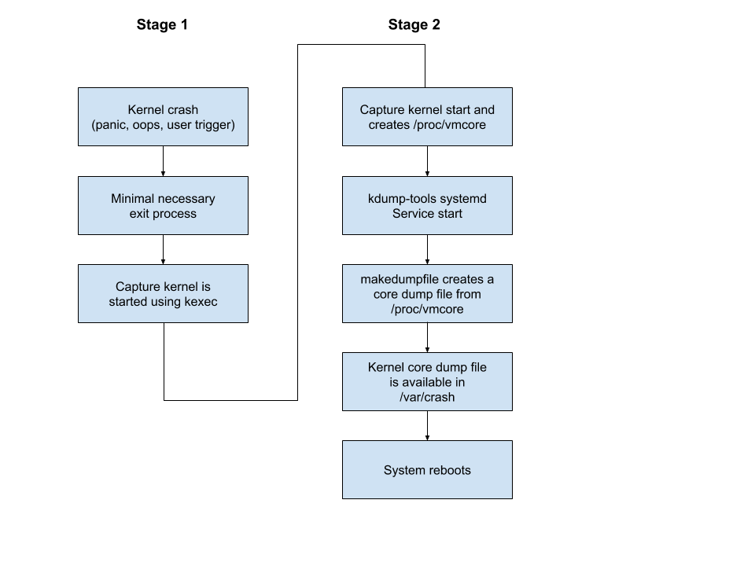

# kdump

## High Level Design Document
**Rev 0.4**

## Table of Contents

<!-- TOC depthFrom:2 depthTo:4 withLinks:1 updateOnSave:1 orderedList:0 -->

- [High Level Design Document](#high-level-design-document)
- [Table of Contents](#table-of-contents)
- [List of Tables](#list-of-tables)
- [Revision](#revision)
- [About this Manual](#about-this-manual)
- [Scope](#scope)
- [Definitions/Abbreviations](#definitionsabbreviations)
    - [Table 1: Abbreviations](#table-1-abbreviations)
- [Requirements Overview  <a name="requirements-overview"></a>](#requirements-overview-a-namerequirements-overviewa)
    - [Functional Requirements  <a name="functional-requirements"></a>](#functional-requirements-a-namefunctional-requirementsa)
    - [Scalability Requirements](#scalability-requirements)
    - [Warmboot Requirements](#warmboot-requirements)
    - [Configuration and Management Requirements](#configuration-and-management-requirements)
        - [Configuration commands](#configuration-commands)
	- [Information commands](#information-commands)
- [kdump : end-to-end flow](#kdump-end-to-end-flow)
- [Functional Description](#functional-description)
    - [Design](#design)
    - [Kernel core-dump service](#kernel-core-dump-service)
    - [SONiC Code Changes](#sonic-code-changes)
    - [Configuration commands:](#configuration-commands)
        - [config kdump <enable|disable>](#config-kdump-enabledisable)
        - [config kdump memory string](#config-kdump-memory-string)
        - [config kdump num_dumps number](#config-kdump-numdumps-number)
        - [show kdump [status]](#show-kdump-status)
        - [show kdump files](#show-kdump-files)
        - [show kdump log [X]](#show-kdump-log-x)
- [How to use the kernel core dump files](#how-to-use-the-kernel-core-dump-files)
    - [Introduction](#introduction)
    - [Use the kernel core dump file on the switch](#use-the-kernel-core-dump-file-on-the-switch)
    - [Use the kernel core dump file on a Linux host](#use-the-kernel-core-dump-file-on-a-linux-host)
    - [Analyzing the core dump](#analyzing-the-core-dump)
- [KDUMP DB](#kdump-db)
- [Test](#test)
    - [Test on Different Platforms](#test-on-different-platforms)
    - [Unit Test](#unit-test)

<!-- /TOC -->

## List of Tables

[Table 1: Abbreviations](#table-1-abbreviations)

## Revision

Rev   |   Date   |  Author   | Change Description
:---: | :-----:  | :------:  | :---------
0.1   | 10/28/19 | O. Singla | Initial version
0.2   | 10/29/19 | O. Singla | Changed the memory allocated for kdump
0.3   | 11/04/19 | O. Singla | Minor changes
0.4   | 12/17/19 | O. Singla | Removed the option to force reboot

## About this Manual

This document describes how to configure and use the kdump feature in SONiC network operating system. kdump is a feature of the Linux kernel that creates and stores a dump file in the event of a kernel crash.

## Scope

This document describes the following enhancements to the SONiC O/S:

 - The Debian "kdump-tools" service is enhanced and added to the SONiC host O/S
 - A CLI program is added to configure kdump administrative mode and some of its customization parameters
 - Tools used to support the kernel core file generation, and how to analyze it.

## Definitions/Abbreviations

### Table 1: Abbreviations

| **Term**     | **Meaning**            |
| :----------- | ---------------------- |
| tech-support | Technical support data |
| kdump        | Kernel Dump            |

## Requirements Overview  <a name="requirements-overview"></a>

### Functional Requirements  <a name="functional-requirements"></a>

1. When the kernel crashes, the kdump tool must generate the core dump of the kernel.
2. The kernel core files are stored on the persistent storage like the hard disk of the SONiC switch.
3. The number of kernel core files stored on the disk must be configurable in order to optimize disk space usage.
4. The kernel core files must be included in the SONiC switch *tech-support* so that they can be exported to a remote server for offline analysis.
5. The kernel core file generated must provide as much information as possible for the user to identify which line of code in the kernel has crashed along with kernel logs of the events that led to the crash.
6. Use Debian and Linux kernel provided native tools to generate and inspect kernel core files. Any such findings can be easily shared and understood by the open source Linux kernel community while reporting  kernel bugs.
7. The memory in RAM reserved for kernel core file should be relatively small so that enough memory is available for protocol applications to operate.

### Scalability Requirements

Since the kernel core dump files are relatively small (~90 MB), there is no explicit limit on the size of the core file generated and the space occupied on the disk.

### Warmboot Requirements

Enabling or Disabling kdump always requires a cold reboot of the switch. Warmboot is not supported while generating a core file in the event of a kernel crash.

### Configuration and Management Requirements

To configure the kernel core dump the following CLI utility shall be supported. Note that the data optionally sent to a remote server by the Core File Manager always includes two files:
 - the kernel core dumps generated on the system
 - the kernel log

#### Configuration commands

1. Enable/disable the kernel core dump generation.
2. Specify the amount of physical memory in RAM reserved to generate kernel core file in the event of a kernel crash.
3. Specify how many kernel core files are stored on the switch's persistent storage device.

#### Information commands
1. Display the current kdump status, configuration and the kernel core files stored locally.

## kdump : end-to-end flow


## Functional Description

### Design

The SONiC kernel core dump functionality can be divided into two categories:

1. Kernel core-dump generation service
2. Kernel core-dump configuration and inspection tools

### Kernel core-dump service

The kernel core-dump services can be described as the debug feature performing following activities:

1.  Kernel core files are generated when a software bug in the kernel cause the kernel to either crash or panic unexpectedly. Typical conditions are memory access violations, hardware errors, kernel internal data structure inconsistency, etc.
2.  The kdump service ensures that after a kernel crash, the system starts a new capture kernel that collects system information about the crash that has just happened, creates a core dump file and finally reboots the system to start a clean kernel.

Kdump is a kernel crash dumping mechanism that allows you to save the contents of the system's memory for later analysis. It relies on kexec feature of Linux kernel, which can be used to boot a Linux kernel from the context of another kernel, bypass BIOS, and preserve the contents of the first kernel's memory that would otherwise be lost.

In case of a system crash, kdump uses kexec to boot into a second kernel (a capture kernel). This capture kernel resides in a reserved part of the system memory that is inaccessible to the first kernel. The capture kernel then captures the contents of the crashed kernel's memory (a crash dump) and saves it.

In order for kdump to be able to capture a kernel crash dump and save it for further analysis, a part of the system memory has to be permanently reserved for the capture kernel. When reserved, this part of the system memory is not available to the main kernel.

When kdump is installed, correctly configured, and functional, it provides the following capabilities:

1. When the kernel crashes, a second kernel is started using kexec. This kernel is stored in a physical memory reserved solely for this kernel, and is therefore not corrupted by the first kernel.

2. The capture kernel uses makedumpfile system utility to collect crash information and create a compressed core dump file, which is then stored in the /var/crash directory.

3. In addition to the core dump file, kdump also stores a copy of the kernel log (this is the output of dmesg command) leading up to the crash.

4. By default, kdump service is configured to store up to three core dump images. The oldest images are deleted to ensure there are no more than three core dump images stored on the local drive.

5. Core files generated are stored in */var/crash* directory, with date/time stamped sub-directory name, e.g. */var/crash/201910041457*

6. Inside the sub directory, two types of files can be found:
 - kernel logs (e.g. *dmesg.201910041633*)
 - kernel core dump file (e.g. *dump.201910041633*)

7. Core files are compressed by the *makedumpfile* program to occupy less storage space on disk.

8. Much information (such as free pages) in a vmcore (kernel core) is not useful. *makedumpfile* excludes unnecessary pages, such as:
 - pages filled with zeroes,
 - cache pages without private flag (non-private cache);
 - cache pages with private flag (private cache);
 - user process data pages;
 - free pages.
We let makedumpfile to save only in-use kernel pages to reduce the corefile.

8. File permissions of generated core files generated are set appropriately so that only a root user can access them.

9. When too many core files are generated and take up more than the allocated disk space, the oldest core files are automatically deleted to make room for the newly created ones.

### SONiC Code Changes

Current SONiC code has basic kernel support to generate a kernel core file, but user-space support is missing. To add full kdump support, the following changes are proposed:

 - Install *kdump-tools* and *makedumpfile* as part of SONiC host O/S.
Changes to be done in *sonic-buildimage/build_debian.sh*
 - kdump-tools package is modified:
   - to allow the creation of the initramfs image for the capture kernel on first boot, since the standard kdump-tools Debian package does not allow creating the initramfs image from a fakeroot environment during image build time.
   - the default maximum number of stored core files is set to 3.
   - kernel core dump files are prefixed by *kdump-*
   - kdump-tools serive is enabled or disabled depending of administrative state (as stored in ConfigDB)
 - kdump is configured using the SONiC utility *config*.
 - kdump status and configuration can be shown using the SONiC utility *show*.
 - kdump is disabled by default.
 - if kdump is enabled and a new SONiC image is installed using the *sonic-installer* command, kdump will be enabled in the new installed image.

### Configuration commands:

For SONiC switches, the following CLI commands are provided to manage core files.

#### config kdump <enable|disable>

Enable or disable kernel core dump functionality.

Administrative state of kdump is stored in ConfigDB.

The variable *USE_KDUMP* in the file /etc/default/kdump-tools is set to 0 to disable kdump, and set to 1 to enable kdump.

Since this command might require changing the kernel parameters to specify the amount of memory reserved for the capture kernel (the kernel parameters which are exported through */proc/cmdline*), a reboot is necessary. The command displays a message showing that kdump functionality will be either enabled or disabled following the next reboot.

#### config kdump memory string

Set the amount of memory reserved for the capture kernel called with kexec.

The amount of memory should always be specified in MB. For instance, the command *config kdump memory 512M* allocates 512M for the capture kernel. If the memory amount is changed and kdump is currently enabled, the command displays a message showing that the new provided memory size will be used following a reboot.

If the amount of memory is set too low, kdump will not be able to either:
 - store the capture kernel and initramfs image,
 - or store the core dump information.

The default value for the memory allocated for the capture memory is:
*0M-2G:256M,2G-4G:320M,4G-8G:384M,8G-:448M*

Which translates into:
|RAM size|crashkernel <br>parameter|
| -----  | ---- |
| <= 2GB  | 256 MB |
| <= 4GB  | 320 MB |
| <= 8GB  | 384 MB |
| > 8GB | 448 MB |

For instance, if the system has 8GB of RAM, the kernel will allocate 384 MB of memory for the capture kernel.

#### config kdump num_dumps number

When a kernel core dump file is generated, the kdump service should keep the generated core file in compressed form for the last N-1 number of core files. The number and the maximum size of the core files can be configured through this command.

The number provided used to set the maximum number of kernel core dumps stored locally. Valid numbers are between 1 and 9. If there are already N kernel core dumps files stored locally and a number less than N is specified, files shall be deleted on the local storage to satisfy the new number of files. For instance, if there are already 6 kernel core dumps saved, and the user specifies keeping only 3 kernel core dump files, the 4 oldest files are removed from the local storage to make room for 2 existing dump files plus the new core dump file to be generated. Note that this file pruning only happens when a new kernel crash occurs.

The default value is 3.

Valid values are from 1 to 9.

#### show kdump [status]

This command displays information about the current settings and how many files are stored locally:
 - If the kdump feature is enabled or disabled
 - If kdump is enabled, display whether the kdump feature is operationally ready to perform a kdump in the event of a kernel crash
 - Amount of memory reserved for the kdump capture kernel
 - Maximum number of kdump core files kept locally
 - List of kdump cores stored locally

 This command shows the kernel core dump files currently saved on the local storage. They are displayed in reverse chronological order.

 For instance:
 ```
 Record Key           Filename
 --------------------------------------------------------------
 1      201910170223 /var/crash/201910170223/dump.201910170223
                     /var/crash/201910170223/dmesg.201910170223
 2      201910170206 /var/crash/201910170206/dump.201910170206
                     /var/crash/201910170206/dmesg.201910170206
 ```

#### show kdump files

  This command is used to display the kdump core stored locally.

#### show kdump log [X]

 This command is used to display the last *X* lines of the kernel log ring buffer. If *X* is not provided, the default value *75* is being used. The kernel log buffer typically contains the kernel back-trace. The crash dump can be specified by using either the Record number or the the Key name. The Filenames are displayed for reference.

## How to use the kernel core dump files

### Introduction

The kernel core dump file can be examined either on the switch itself or on any Linux based system. In both cases, you will need to have access to the debugging version of the kernel. The SONiC build system always builds the debugging version of the kernel along with the non debugging version. If you configured SONiC to build the kernel (DEFAULT_KERNEL_PROCURE_METHOD=build or incremental), the debugging version of the kernel will be available in this location:
*src/sonic-linux-kernel/linux-image-4.9.0-9-2-amd64-dbg_4.9.168-1+deb9u3_amd64.deb*

### Use the kernel core dump file on the switch

The first step consists of installing the crash package:
 - apt-get update
 - apt-get install crash

The second step consists of installing the debug version of the kernel:
  - copy the file *linux-image-4.9.0-9-2-amd64-dbg_4.9.168-1+deb9u3_amd64.deb* into the switch
  - use the *dpkg* command to install it (this require root privilege).

The debug version of the kernel is available in */usr/lib/debug/boot/*

### Use the kernel core dump file on a Linux host

The first step consists of installing the crash program using either yum, dnf or apt-get commands.

The second step consists of installing the debug version of the kernel:
 - copy the file *linux-image-4.9.0-9-2-amd64-dbg_4.9.168-1+deb9u3_amd64.deb* into the switches
 - **do not install** the Debian package, but instead extract its contents:
   - use 'ar x' command to extract the files from the .deb archive;
   - usr tar command to extract the files from archive data.tar.xz
     this will provide the file *vmlinux-4.9.0-9-2-amd64* under *usr/lib/debug/boot*

### Analyzing the core dump

The kernel core dump is always analyzed using the 'crash' program. Two parameters need to be provided to the crash program:
 - kernel's vmlinux file (debugging version)
 - kernel core dump file

Typical usage:

```
~/kdump2$ crash usr/lib/debug/boot/vmlinux-4.9.0-9-2-amd64 kdump.201910281849

crash 7.1.9-3.fc27
Copyright (C) 2002-2016  Red Hat, Inc.
Copyright (C) 2004, 2005, 2006, 2010  IBM Corporation
Copyright (C) 1999-2006  Hewlett-Packard Co
Copyright (C) 2005, 2006, 2011, 2012  Fujitsu Limited
Copyright (C) 2006, 2007  VA Linux Systems Japan K.K.
Copyright (C) 2005, 2011  NEC Corporation
Copyright (C) 1999, 2002, 2007  Silicon Graphics, Inc.
Copyright (C) 1999, 2000, 2001, 2002  Mission Critical Linux, Inc.
This program is free software, covered by the GNU General Public License,
and you are welcome to change it and/or distribute copies of it under
certain conditions.  Enter "help copying" to see the conditions.
This program has absolutely no warranty.  Enter "help warranty" for details.

GNU gdb (GDB) 7.6
Copyright (C) 2013 Free Software Foundation, Inc.
License GPLv3+: GNU GPL version 3 or later <http://gnu.org/licenses/gpl.html>
This is free software: you are free to change and redistribute it.
There is NO WARRANTY, to the extent permitted by law.  Type "show copying"
and "show warranty" for details.
This GDB was configured as "x86_64-unknown-linux-gnu"...

WARNING: kernel relocated [324MB]: patching 75476 gdb minimal_symbol values

WARNING: kernel version inconsistency between vmlinux and dumpfile     

      KERNEL: usr/lib/debug/boot/vmlinux-4.9.0-9-2-amd64
    DUMPFILE: kdump.201910281849  [PARTIAL DUMP]
        CPUS: 4
        DATE: Mon Oct 28 14:49:30 2019
      UPTIME: 00:04:45
LOAD AVERAGE: 3.12, 4.20, 1.95
       TASKS: 879
    NODENAME: sonic
     RELEASE: 4.9.0-9-2-amd64
     VERSION: #1 SMP Debian 4.9.168-1+deb9u3 (2015-12-19)
     MACHINE: x86_64  (2400 Mhz)
      MEMORY: 8 GB
       PANIC: "sysrq: SysRq : Trigger a crash"
         PID: 8323
     COMMAND: "bash"
        TASK: ffffa07157a90e80  [THREAD_INFO: ffffa07157a90e80]
         CPU: 1
       STATE: TASK_RUNNING (SYSRQ)

crash> bt
PID: 8323   TASK: ffffa07157a90e80  CPU: 1   COMMAND: "bash"
 #0 [ffffb3cc824afba0] machine_kexec at ffffffff95454a88
 #1 [ffffb3cc824afbf8] __crash_kexec at ffffffff95508031
 #2 [ffffb3cc824afcb8] crash_kexec at ffffffff95508098
 #3 [ffffb3cc824afcd0] oops_end at ffffffff954298d3
 #4 [ffffb3cc824afcf0] no_context at ffffffff95461a01
 #5 [ffffb3cc824afd50] __do_page_fault at ffffffff954624c6
 #6 [ffffb3cc824afdc0] page_fault at ffffffff95a01958
    [exception RIP: sysrq_handle_crash+18]
    RIP: ffffffff95829462  RSP: ffffb3cc824afe78  RFLAGS: 00010282
    RAX: ffffffff95829450  RBX: 0000000000000063  RCX: 0000000000000000
    RDX: 0000000000000000  RSI: ffffa071ffc90648  RDI: 0000000000000063
    RBP: ffffffff960bf360   R8: 0000000000000001   R9: 0000000000014124
    R10: 0000000000000001  R11: 0000000000000001  R12: 0000000000000004
    R13: 0000000000000000  R14: 0000000000000000  R15: 0000000000000000
    ORIG_RAX: ffffffffffffffff  CS: 0010  SS: 0018
 #7 [ffffb3cc824afe78] __handle_sysrq at ffffffff95829b97
 #8 [ffffb3cc824afea0] write_sysrq_trigger at ffffffff95829fdb
 #9 [ffffb3cc824afeb0] proc_reg_write at ffffffff95679240
#10 [ffffb3cc824afec8] vfs_write at ffffffff9560ac10
#11 [ffffb3cc824afef8] sys_write at ffffffff9560c052
#12 [ffffb3cc824aff38] do_syscall_64 at ffffffff95403b7d
#13 [ffffb3cc824aff50] entry_SYSCALL_64_after_swapgs at ffffffff95a0058e
    RIP: 00007f2486d6b970  RSP: 00007ffddb212ef8  RFLAGS: 00000246
    RAX: ffffffffffffffda  RBX: 0000000000000002  RCX: 00007f2486d6b970
    RDX: 0000000000000002  RSI: 00000000009e1008  RDI: 0000000000000001
    RBP: 00000000009e1008   R8: 00007f248702b760   R9: 00007f2487675700
    R10: 0000000000000073  R11: 0000000000000246  R12: 0000000000000002
    R13: 0000000000000001  R14: 00007f248702a600  R15: 0000000000000002
    ORIG_RAX: 0000000000000001  CS: 0033  SS: 002b
crash> dis sysrq_handle_crash
0xffffffff95829450 <sysrq_handle_crash>:        nopl   0x0(%rax,%rax,1) [FTRACE NOP]
0xffffffff95829455 <sysrq_handle_crash+5>:      movl   $0x1,0xa83929(%rip)        # 0xffffffff962acd88
0xffffffff9582945f <sysrq_handle_crash+15>:     sfence
0xffffffff95829462 <sysrq_handle_crash+18>:     movb   $0x1,0x0
0xffffffff9582946a <sysrq_handle_crash+26>:     retq   
0xffffffff9582946b <sysrq_handle_crash+27>:     nopl   0x0(%rax,%rax,1)
crash> kmem -i
                 PAGES        TOTAL      PERCENTAGE
    TOTAL MEM  1891539       7.2 GB         ----
         FREE  1133121       4.3 GB   59% of TOTAL MEM
         USED   758418       2.9 GB   40% of TOTAL MEM
       SHARED   136430     532.9 MB    7% of TOTAL MEM
      BUFFERS    49852     194.7 MB    2% of TOTAL MEM
       CACHED        0            0    0% of TOTAL MEM
         SLAB    42836     167.3 MB    2% of TOTAL MEM

   TOTAL HUGE        0            0         ----
    HUGE FREE        0            0    0% of TOTAL HUGE

   TOTAL SWAP        0            0         ----
    SWAP USED        0            0    0% of TOTAL SWAP
    SWAP FREE        0            0    0% of TOTAL SWAP

 COMMIT LIMIT   945769       3.6 GB         ----
    COMMITTED  2378028       9.1 GB  251% of TOTAL LIMIT

```

Links:
 - [White Paper: Red Hat Crash Utility](https://people.redhat.com/anderson/crash_whitepaper/)
 - [crash utility help pages](https://people.redhat.com/anderson/help.html)

## KDUMP DB

 A new table "KDUMP" will be introduced in ConfigDB for maintaining kdump configurations. Below is the schema for this table.

```
 KDUMP_TABLE:{{config}}
     "enabled"    :{{"false"|"true"}}
     "memory"     :{{string}}
     "num_dumps"  :{{number}}
```

## Test

### Test on Different Platforms

We tested the Linux kernel dump mechanism on different platfroms in StarLab. 
The following table shows detailed information related to the size of core
dump file and kernel log file, the downtime of device. At here, the `downtime`
represents the time interval from issuing the command `echo c > /proc/sysrq-trigger`
triggering the kernel crash to the device is up and can be logged in again.

|       Platforms     | Memory Size | Size of core file | Size of kernel log file | Downtime |
| :------------------ | :---------: | :---------------: | :---------------------: | :------: |
| Arista-7050-QX-32S  |     4 GB    |       119 MB      |          72 KB          |   150 s  |
| Mellanox SN2700     |     8 GB    |       246 MB      |          116 KB         |   160 s  |
| Force10-S6000       |     8 GB    |       77 MB       |          72 KB          |   150 s  |
| Celestica-E1031     |     2 GB    |       53 MB       |          60 KB          |   270 s  |

### Unit Test

[Test of sonic-kdump](images/sonic-kdump_ut.pdf)
