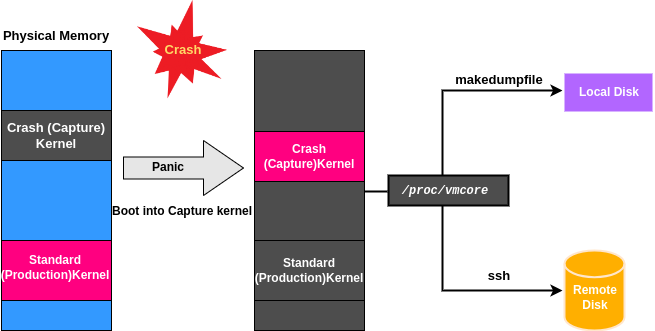

# kdump_Remote_SSH

## High Level Design Document
**Rev 0.1**

## Table of Contents

<!-- TOC depthFrom:2 depthTo:4 withLinks:1 updateOnSave:1 orderedList:0 -->

- [High Level Design Document](#high-level-design-document)
- [Table of Contents](#table-of-contents)
- [List of Tables](#list-of-tables)
- [Revision](#revision)
- [Overview](#about-this-manual)
- [Scope](#scope)
- [Definitions/Abbreviations](#definitionsabbreviations)
    - [Table 1: Abbreviations](#table-1-abbreviations)
- [Introduction](#introduction)
- [Requirements Overview  <a name="requirements-overview"></a>](#requirements-overview-a-namerequirements-overviewa)
    - [Functional Requirements  <a name="functional-requirements"></a>](#functional-requirements-a-namefunctional-requirementsa)
    - [Configuration and Management Requirements](#configuration-and-management-requirements)
	- [SSH Key Generation Requirements](#ssh-key-generation-requirement)
- [kdump Remote Architechture](#kdump-remote-architechture)
- [Functional Description](#functional-description)
    - [Design Changes](#design-changes)
- [Configurations and Management](#configuration-and-management)
    - [CONFIG_DB Enhancements](#config_db-enhancements)
    - [SAI API](#sai-api)
    - [CLI/Yang MOdel Enhancements](#cliyang-model-enhancements)
- [CLI Enhancements](#cli-enhancements)
    - [CLI Configuration Commands](#cli-configuration-commands)
    - [CLI Show Commands](#cli-show-commands)
- [YANG Enhancement](#yang-enhancements)
- [Warmboot Requirements](#warmboot-requirements)
- [Test](#test)
    - [Unit Test cases](#unit-test-cases)
- [Links](#links)

<!-- /TOC -->

## List of Tables

[Table 1: Abbreviations](#table-1-abbreviations)

## Revision

Rev   |   Date   |  Author   | Change Description
:---: | :-----:  | :------:  | :---------
0.1   | 06/05/2024 | Ghulam Bahoo, Muhammad Ali Hussnain | Initial version
## Overview
This document outlines the configuration and usage of the kdump remote feature with ssh for the SONiC.

## Scope

This document describes how to configure remote kdump feature in SONiC infrastructure.

## Definitions/Abbreviations

### Table 1: Abbreviations

| **Term**     | **Meaning**            |
|  ----------- | ---------------------- |
| SSH          | Secure Shell           |
| kdump        | Kernel Dump            |
| NFS          | Network File System    |

## Introduction
Kdump, a built-in Linux kernel feature, generates and stores a crash dump file in the event of a kernel panic. Currently SONiC lacks the functionality of storing dump files on a remote server. It offloads the storage from switch by saving the crash reports to a separate designated server for offline analysis. This feature extends existing kdump feature by enabling remote dumps via ssh protocol, allowing you to transfer kernel crash data to a designated remote server.

## Requirements Overview  <a name="requirements-overview"></a>

### Functional Requirements  <a name="functional-requirements"></a>
This section describes the SONiC requirements for kdump remote feature.

At a high level the following should be supported:
1. The kernel core dump files must be stored on the a remote ssh server.
### Configuration and Management Requirements

- CLI support for configuring remote kdump feature enable/disable via ssh.
- CLI support for configuring username and hostname of ssh server (username@server_address).
- CLI support for configuring SSH private key path for ssh server (SSH_private_Key_Path).
- CLI support for displaying credentials of ssh server.
- CLI support for displaying state of kdump remote feature (enable/disable).
### SSH Key Generation Requirement
The system should authenticate with the remote server using SSH keys for secure access. 

```
admin@sonic: ssh-keygen
```

User be prompted to choose a location to save the key pair. By default, it saves the private key to ~/.ssh/id_rsa and the public key to ~/.ssh/id_rsa.pub.

```
admin@sonic: ssh-copy-id username@server_address
```

 This helps automate passwordless SSH logins by copying public key to authorized servers.

## kdump Remote Architechture


## Functional Description

### Design Changes

The SONiC kernel core dump remote functionality can be divided into two categories:

1. Kernel core-dump generation service
2. Storing Kernel core-dump files remotely

Current SONiC lacks remote kernel dump functionality. To add this feature, consider enabling kdump for remote storage.

We are suggesting modifying the exisitng SONiC configuration as following sonic-buildimage files.
 
1. build_debian.sh (Addition)

    - Required for kdump_remote_ssh_dump: InItialize network interfaces and enable DHCP upon kernel crash. 

2. files/scripts/network_setup.sh (New Addition)
    - A script to initialize the network interfaces and enable DHCP on them.
3. files/script/network_setup.hook (New Addition)
4. Updated exisitng hostcfg daemon file script/hostcfgd (Updation).

## Configuration and Management
This section describes all types of configuration and management related design. Example sub-sections for "CLI" and "Config DB" are given below.


### CONFIG_DB Enhancements
 New attributes will be introduced to "KDUMP" table in ConfigDB for maintaining remote kdump configurations. Below is the schema for this table.

```
    KDUMP_TABLE:{{config}}
     "enabled"    :{{"false"|"true"}}
     "memory"     :{{string}}
     "num_dumps"  :{{number}}
     "remote"     :{{"false"|"true"}}
     "ssh_string" :{{string}}
     "ssh_path" :{{string}}
```

### SAI API 

No SAI API change or addition is needed for this HLD. 


### CLI/YANG model Enhancements 
### CLI Enhancements

#### CLI Configuration Commands
New SONiC CLI commands are introduced to configure remote kdump feature.

```
admin@sonic: sudo config kdump remote enable 
```
This commans will configure remote kdump feature in SONiC.

```
admin@sonic: sudo config kdump remote add ssh_string username@serverip
```

```
admin@sonic: sudo config kdump remote add ssh_path /path to ssh private key/
```

```
admin@sonic: sudo config kdump remove ssh_sting
```

```
admin@sonic: sudo config kdump remove ssh_path
```

```
admin@sonic: sudo config kdump remote disable
```
This command disables the remote kdump feature.
#### CLI Show Commands
An existing SONiC CLI command is used to display the current remote kdump feature configuraitons.

```
admin@sonic: show kdump config
```

Example output from the above command:
```
admin@sonic:~$ show kdump config
Kdump administrative mode: Enabled
Kdump operational mode: Ready
Kdump memory reservation: 512
Maximum number of Kdump files: 3
remote: true
ssh_string: username@serverip
ssh_path: /path to ssh_private key/
```

### YANG Enhancements

```
leaf remote {
        type boolean;
        description
            "Enable or Disable the Kdump remote ssh mechanism";
}

leaf ssh_string {
        type string;
        description  
            "Remote ssh connection string";
}

leaf ssh_path {
        type string;
        description  
            "Remote ssh private key path";

}				

```

### Warmboot Requirements

Configuring kdump feature always requires a cold reboot of the switch. Warmboot is not supported while generating a core file in the event of a kernel crash.

## Test

### Unit Test Cases
- Enable/Disable remote kdump feature.
- Add/Remove ssh_string i.e. username@hostname.
- Add/Remove ssh_path.

## Links
 - [White Paper: Red Hat Crash Utility](https://people.redhat.com/anderson/crash_whitepaper/)
 - [crash utility help pages](https://people.redhat.com/anderson/help.html)
