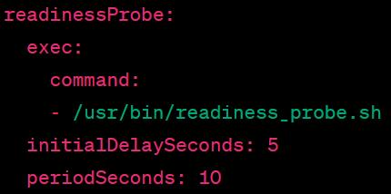

# Why need health-check
- Current status
    - We can only check whether the k8s scheduled container is running or not, couldn't exactly know the real supervisor service inside container is healthy or not. K8s need to have a probe configuration to know the state inside container
- Problems should be resolved
    - Health-check should check whether the real supervisor service is healthy or not
    - If not healthy, there better be different error codes to help debug

# How do we Implement the health-check 
- Leverage k8s probe tool
    - K8s has three kinds of probe, [liveness, readiness and startup probes](https://kubernetes.io/docs/tasks/configure-pod-container/configure-liveness-readiness-startup-probes/#define-startup-probes) which can help us probe state inside container. we can use readiness probe for our scenario.
    - Every probe has four probe types, http|TCP|gRPC|command, command type should be good for our scenario.
    - Command type means that we could deploy one script inside container, k8s will call this script and record the exit code during the container's whole lifecycle. We can use different non-zero exit codes to recognize what the issue is if probe failed.
    - Command probe example:
    - 
- Controller action from k8s side
    - During container upgrade process, our k8s controller will use the readiness probe result. when our k8s controller is in post-check stage, controller will check the readiness probe exit code, if the exit code is zero, controller think it's healthy, post-check will proceed. If the exit code is non-zero, controller think it's not healthy and will re-check again and again util timeout. If timeout happens, controller will do fallback.
- Why not startup and liveness probe
    - For startup probe, k8s will help restart container if startup probe failed number meet limit, we don't need k8s do this, we will do fallback to handle this case other than do restart.
    - For liveness probe, existing code has already implemented the liveness probe function. Supervisor exit-listener service inside container will kill itself container to handle critical service unexpected exit.

# How do we implement the readiness_probe script inside container
- Script path and name
    - /usr/bin/readiness_probe.sh
- Health-Check logic in the script(two steps for now)
    - Do common checks which are same for all containers
        - Currently, one common check is that if the supervisor start.sh exists, we need to ensure that it exits with code 0.
        - Will not check critical services, because these services should be managed by the exit-listener supervisor service.
    - Call container self-related specific executable script if exists
        - Executable script path and name
            - /usr/bin/readiness_probe_hook
        - Feature owner should implement the pythons script if needed
            - One note is that exit code should be 0 if all are good. If not, need to define the exit code clearly so that we can figure out the issue once happens.

# Why check start service
- The start.sh script is for the real service initialization. Check the initialization finished or not.
- Including call k8s startup script, k8s startup script will participate the upgrade process, proceeding to upgrade container must be after the k8s startup script finished, so need to check start service whether exit as expected.