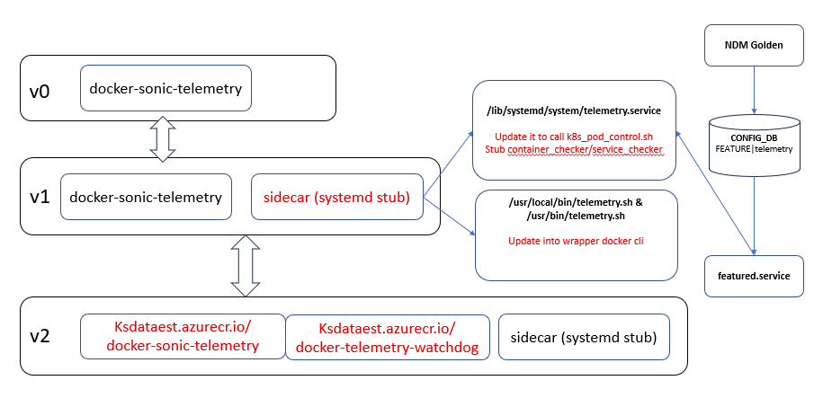
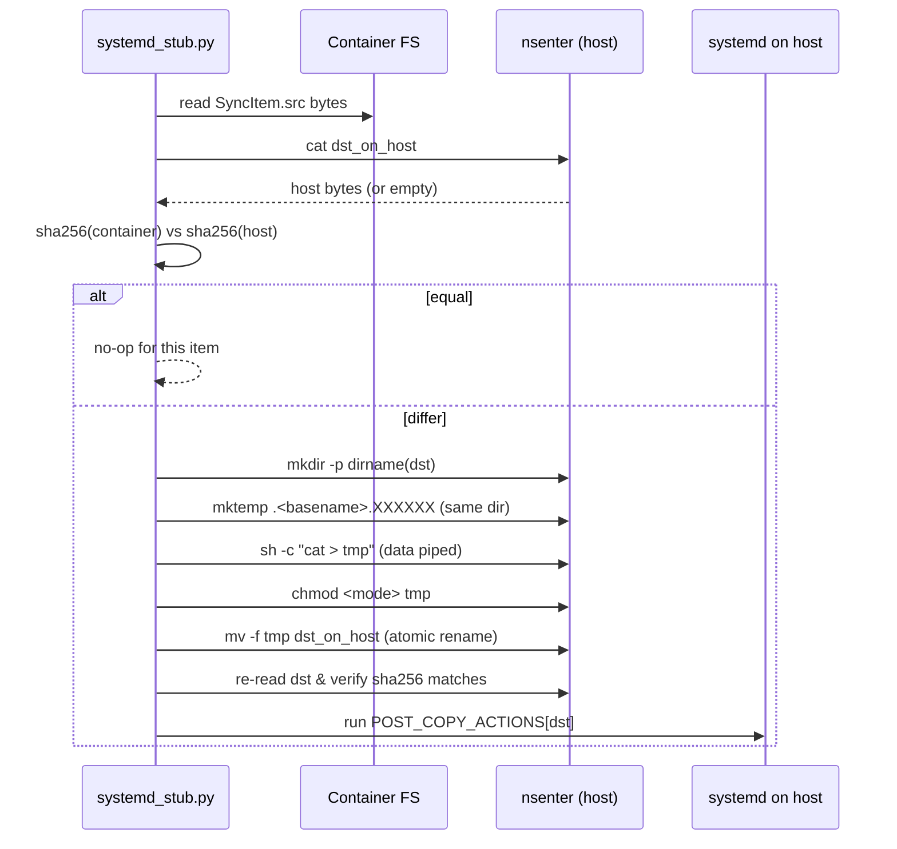
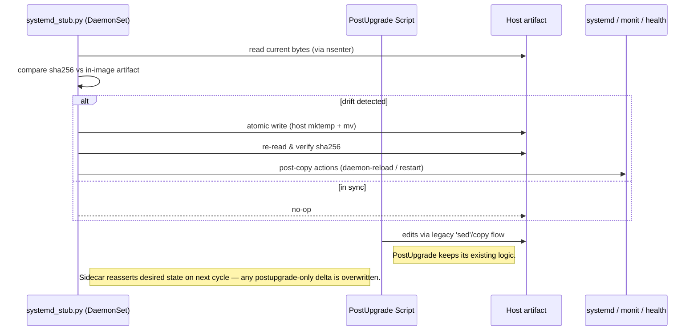
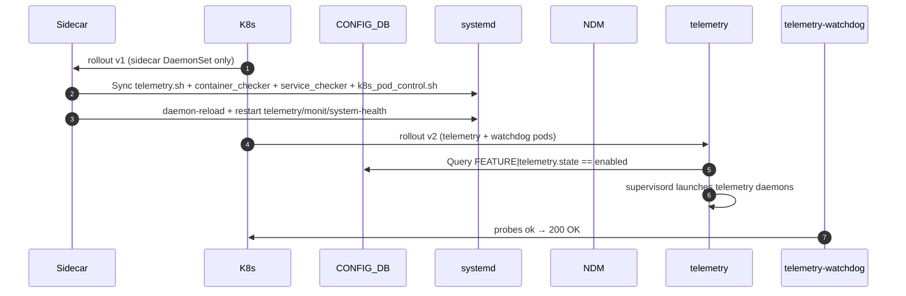
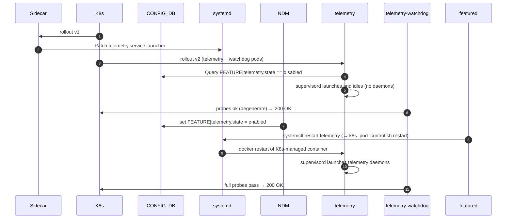
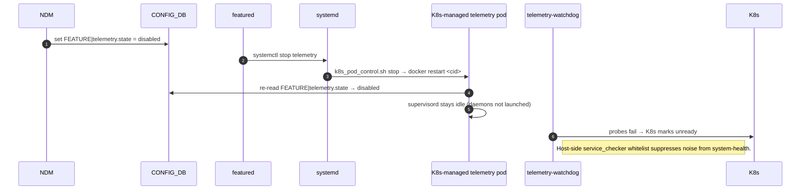
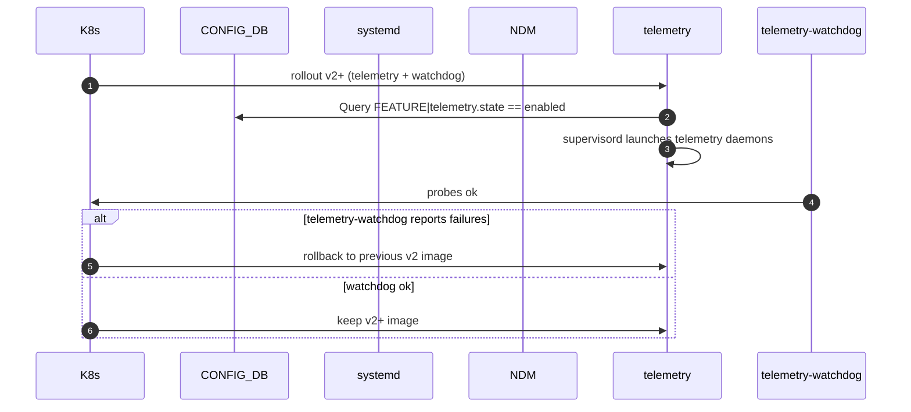
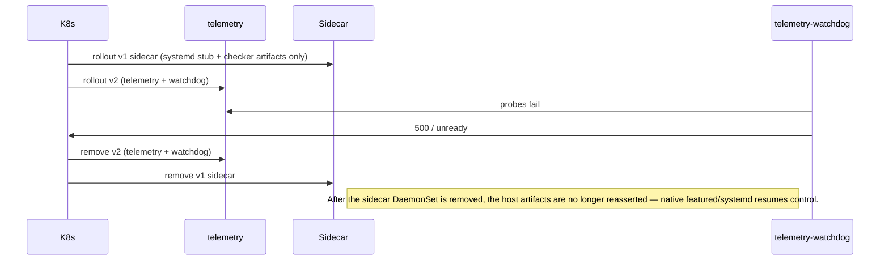

# Migrating Image-Managed Docker Containers to Kubernetes with Resource Control

## 1. Background

In current SONiC architecture, many containers are image-managed, which means they are packed into the build image and managed by NDM Golden config. They are commonly deployed and managed via `systemd` and monitored via tools like `monit`. After KubeSonic comes into the picture, this deployment lacks advanced orchestration and native resource management features offered by Kubernetes.

This document outlines the actual end-to-end approach used today to migrate an image-managed Docker container to a Kubernetes-managed (KubeSonic) container while preserving:

- the existing `systemd` interface (so monit / featured / postupgrade keep working),
- the FEATURE table in CONFIG_DB as the source of truth for whether a feature is enabled,
- backward compatibility with image-baked artifacts that older releases still depend on,
- and Kubernetes-native CPU / memory resource controls.

The first container fully migrated under this model is `telemetry`. A watchdog container (`docker-telemetry-watchdog`) ships alongside the migrated feature pod for K8s liveness/readiness probing.

## 2. Objective

- Standardize container deployment under Kubernetes for containers whose enablement is still controlled by the NDM golden config `FEATURE` table.
- Keep the `systemd` interface backward compatible. `systemctl start|stop|restart|status <feature>` continues to work from operator tooling, but the underlying action is delegated to the K8s-managed container.
- Make sure postupgrade scripts and the K8s sidecar can both modify the same host files without diverging — both converge on the desired state baked into the sidecar image.
- Enforce CPU and memory resource constraints natively via Kubernetes `resources` spec; remove `monit`-based memory checking for migrated containers.
- Keep a single source of truth for branch-specific behavior: the sidecar ships per-branch artifacts (e.g. `container_checker_202505`) and selects the right one at runtime based on the host SONiC build version.

---

## 3. Container Upgrade Flow with version and changes


The repository pieces that implement this flow:

| Piece | Location | Role |
|-------|----------|------|
| Feature container (existing) | `dockers/docker-sonic-telemetry/` | Original image-managed container. Now also rollout-able as a K8s pod. |
| Sidecar container | `dockers/docker-telemetry-sidecar/` | DaemonSet sidecar that patches host artifacts and reconciles CONFIG_DB. |
| Watchdog container | `dockers/docker-telemetry-watchdog/` | Rust HTTP server used by K8s liveness/readiness probes. |
| Common sidecar lib | `src/sonic-py-common/sonic_py_common/sidecar_common.py` | Reusable file-sync / CONFIG_DB / nsenter helpers shared by all sidecars. |
| systemd stub launcher | `files/scripts/k8s_pod_control.sh` (synced into `/usr/share/sonic/scripts/docker-*-sidecar/k8s_pod_control.sh`) | Host-side script that translates `start/stop/restart/wait/status` into `docker` operations on the K8s-managed container. |
| Per-branch artifacts | `dockers/docker-*-sidecar/systemd_scripts/container_checker_<YYYYMM>`, `service_checker.py_<YYYYMM>`, `*.service_<YYYYMM>`, `v1/*.sh_<YYYYMM>` | Versioned scripts the sidecar selects at runtime based on the host SONiC build version. |


## 4. Standardize Kubernetes-Based container Deployment

Since we need to migrate from an image-managed container to a Kubernetes-managed container while avoiding dual-running instances and preserving compatibility, we keep features like `CriticalProcessHealthChecker`, `featured`, `system-health`, and `monit` working throughout the transition.

### 4.1 Keep FEATURE table as the source of truth of feature enablement

Even after we enable a feature via KubeSonic, `FEATURE` (CONFIG_DB) remains owned by NDM Golden config, monitored by `featured.service`. KubeSonic only deploys the container and manages its presence on the node; whether the daemon inside that container should actually be running is still derived from `FEATURE|<name>.state`.

#### FEATURE Table Snapshot
```json
"telemetry": {
  "auto_restart": "enabled",
  "state": "enabled",
  "delayed": "False",
  "check_up_status": "False",
  "has_per_asic_scope": "False",
  "has_global_scope": "True",
  "high_mem_alert": "disabled",
  "set_owner": "kube",
  "support_syslog_rate_limit": "true"
}
```

`set_owner: kube` is rendered into `init_cfg.json` for `lldp`, `pmon`, `radv`, `eventd`, `snmp`, `telemetry`, `gnmi` whenever the image is built with `include_kubernetes == "y"` (see `files/build_templates/init_cfg.json.j2`). For multi-ASIC per-ASIC-scope containers, the systemd templates under `files/build_templates/per_namespace/` propagate the same setting.

#### Feature|state Ownership and Versioning

Version description
- **v0** – current iteration in SONiC; feature container is purely image-managed.
- **v1** – KubeSonic rolls out only the sidecar DaemonSet. The sidecar patches host artifacts (systemd unit launcher, container_checker, service_checker, k8s_pod_control.sh) so that subsequent rollback or rollout into v2 is a desired-state convergence. The feature daemon stays controlled by `systemd` / `featured`.
- **v2+** – KubeSonic rolls out the feature container (and its watchdog) under K8s. The systemd unit is now a stub that proxies to the K8s pod via `docker restart`. The daemon inside is still gated by `FEATURE.state`.

| Version | Container Installed By | Container service running or not | systemd Handling | Kubernetes Presence |
|---------|------------------------|------------------------------------|------------------|---------------------|
| v0      | SONiC image            | Controlled by NDM FEATURE table via `featured` | Native systemd unit | None |
| v1      | KubeSonic              | Not launched — sidecar only patches systemd artifacts on the host | Native systemd unit replaced by stub (`exec k8s_pod_control.sh ...`) | DaemonSet (sidecar only for easy rollback) |
| v2+     | KubeSonic              | Pod launched by Kubernetes; whether the daemon inside is running is still gated by FEATURE table (via supervisord critical_processes / docker entrypoint) | Stub unit; `start/stop/restart` triggers `docker restart` of the K8s-managed container | DaemonSet (feature + watchdog) + sidecar DaemonSet |


### 4.2 Feature container behavior and FEATURE-table gating

Each migrated feature container keeps its existing supervisord configuration, dependent-startup wiring, and critical_processes file. There is **no separate `docker-entrypoint.sh` polling loop** added by KubeSonic; instead:

- The `systemctl start <feature>` action is what causes the K8s-managed container to (re)start. That action is implemented by the host-side stub `k8s_pod_control.sh` (see §4.4) and only takes effect when `featured` decides the FEATURE is enabled.
- When the FEATURE is disabled, `featured` issues `systemctl stop <feature>` which routes into the stub and restarts the K8s container into an idle state, so the daemons (controlled by supervisord critical_processes / `*.sh wait`) do not get launched.

This keeps the existing CONFIG_DB → `featured` → systemd flow intact and removes the need to duplicate that polling logic inside the container image.

### 4.3 Container watchdog containers

Each migrated feature has a dedicated watchdog container (separate from the feature container and separate from the sidecar) that exposes an HTTP endpoint consumed by Kubernetes liveness/readiness probes. They live under `dockers/docker-*-watchdog/` and are written in Rust (built via `cargo` in a multi-stage Dockerfile).

Highlights of the current implementations:

- `docker-telemetry-watchdog` — HTTP server bound to `127.0.0.1:50080` (the port the K8s liveness/readiness probes hit) and runs configurable probes:
  - TCP port check on `127.0.0.1:50051` (default; overridable via Redis `TELEMETRY|gnmi.port`).
  - Optional `gnmi_get` xpath probing. xpaths come from `/cmd_list.json` (baked into the image) plus the env var `TELEMETRY_WATCHDOG_XPATHS` (comma-separated), minus `TELEMETRY_WATCHDOG_XPATHS_BLACKLIST`. Per-command timeout via `TELEMETRY_WATCHDOG_CMD_TIMEOUT_SECS`. `gnmi_get` flags include TLS cert paths fetched from Redis (`TELEMETRY|certs`, `TELEMETRY|gnmi.client_auth`), or `-insecure true` when `client_auth` is not explicitly `"true"`.
  - Optional cert-based probes (`TELEMETRY_WATCHDOG_GOOD_*` expected to succeed, `TELEMETRY_WATCHDOG_BAD_*` expected to fail) toggled by `TELEMETRY_WATCHDOG_CERT_PROBE_ENABLED`.
  - Optional serial-number probing toggled by `TELEMETRY_WATCHDOG_SERIALNUMBER_PROBE_ENABLED`.
  - Optional SHOW-API probe toggled by `TELEMETRY_WATCHDOG_SHOW_API_PROBE_ENABLED`.
  - Returns HTTP 200 with a JSON body when all enabled probes pass; HTTP 500 otherwise.

The watchdog never reads `FEATURE.state` directly today; it does fail-open and degrade to "OK" when expected inputs (e.g. Redis) are unavailable. Treating a disabled FEATURE as "OK" is implicit: when the feature daemon is not running, the port/xpath probes fail and the readiness probe reports unready — but the migrated feature is excluded from the host-side `service_checker` / `container_checker` paths so the host system-health doesn't flap (see §4.7).

Because the pod uses `hostNetwork: true`, the feature container's liveness/readiness probes can target the watchdog's `127.0.0.1:50080` from a different container in the same pod (see the DaemonSet shapes in §4.5).


### 4.4 Maintaining `systemd` compatibility via a stub launcher

We preserve the `systemctl <action> <feature>` contract by replacing the unit's launcher script on the host with a thin shim that operates on the K8s-managed container directly through Docker labels — **no `kubectl` involved**.

#### v0 behavior
- Container is fully managed by `systemd` (e.g. `telemetry.service`).
- `FEATURE.state` is enforced by `featured`.
- Actual container starts/stops via `docker` from inside the original launcher script.

#### v1+ behavior with Kubernetes DaemonSet
- The pod is deployed by Kubernetes (DaemonSet, one per node).
- The systemd unit on the host is kept (e.g. `telemetry.service` still exists with `ExecStart=/usr/local/bin/telemetry.sh wait`).
- `/usr/local/bin/telemetry.sh` is overwritten by the sidecar with a thin wrapper:

  ```bash
  #!/bin/bash
  # Thin wrapper for telemetry pod control - uses sidecar-specific k8s_pod_control.sh
  exec /usr/share/sonic/scripts/docker-telemetry-sidecar/k8s_pod_control.sh telemetry "$@"
  ```

- The wrapper `exec`s the shared `k8s_pod_control.sh` (synced into a per-sidecar directory by the sidecar). The script is feature-agnostic — the service name is passed as the first argument.

##### Stub launcher: `k8s_pod_control.sh`

Source of truth: `files/scripts/k8s_pod_control.sh`. The script is feature-agnostic and is invoked as `k8s_pod_control.sh <SERVICE_NAME> <action>` (the first positional argument is the feature name; the second is the systemd action). Every action is implemented with `docker` against the local dockershim — no `kubectl`, no in-cluster API access, no kubeconfig on the host.

###### Discovering the K8s-managed container

The script never relies on the dockershim's `k8s_<container>_<pod>_<ns>_<uid>` container name. Instead it filters on the labels that the dockershim/CRI writes on every K8s-managed container:

```bash
docker ps -q \
  --filter "label=io.kubernetes.container.name=${SERVICE_NAME}" \
  --filter "label=io.kubernetes.pod.namespace=sonic"
```

The match is exact (`SERVICE_NAME=telemetry` won't accidentally pick up a future `telemetry_v2`), and the result is the set of container IDs for this feature on this node. The same filter with `docker ps -a --format '{{index .Labels "io.kubernetes.pod.name"}} {{.State}}'` is used for `status`.

###### systemctl → docker mapping

| systemd action (via `featured`) | What the stub does | Why |
|---------------------------------|--------------------|-----|
| `systemctl start <feature>` | `timeout 20 k8s_pod_control.sh <feature> restart` | The pod is already running (K8s created it on rollout); the start hook re-asserts the same `docker restart`. The hard 20 s cap keeps the call inside the unit's `TimeoutStartSec` (~30 s). |
| `systemctl stop <feature>` | `docker restart <cid>` for every container ID returned by the filter | Deliberately **does not stop the container** — see _Stop semantics_ below. |
| `systemctl restart <feature>` | `docker restart <cid>` for every container ID returned by the filter | Normal reload path. |
| `ExecStart=… wait` (the systemd unit's main process) | infinite `sleep 300` loop | Keeps the systemd unit in `active (running)` so `featured` / `monit` / `system-health` see what they expect. |
| `systemctl status <feature>` | `docker ps -a` with the same filter, prints each pod's state, exits `0` if any pod is `running`, `3` if none exist, `1` otherwise | Exit codes line up with what monit and `service_checker` expect. |

###### Stop semantics

`systemctl stop <feature>` resolves to `docker restart`, not `docker stop`. The reasoning is:

- The pod is owned by a DaemonSet — Kubernetes will immediately re-create any container we `docker stop`, defeating the operator's intent and racing with the watchdog probes.
- Whether the daemon **inside** the container should be running is gated by `FEATURE.state` (read by supervisord's `critical_processes` / `*.sh wait`). A `docker restart` of the container after `featured` flips `FEATURE.state = disabled` causes supervisord to come up idle, achieving the same end result without taint-and-evict mechanics on the K8s side.
- Truly stopping the container would require tainting the node, which is rejected here because it would push the design toward one DaemonSet per feature.

### 4.5 Patch host artifacts via a Python sidecar (DaemonSet)

The patching engine is a long-running Python program inside the sidecar container, not a one-shot script. The sidecar (`docker-telemetry-sidecar`) ships:

- `systemd_stub.py` — feature-specific entry point. Defines:
  - the list of files to sync to the host (`SYNC_ITEMS`),
  - the post-copy actions per file (`POST_COPY_ACTIONS`),
  - feature-specific CONFIG_DB reconciliation,
  - the supported branches and how to resolve the runtime branch.
- `supervisord.conf` — runs `systemd_stub.py` under supervisord with auto-restart.
- `systemd_scripts/` — per-branch artifacts shipped into the image: `container_checker_<YYYYMM>` and `service_checker.py_<YYYYMM>` (branches `202411` / `202412` / `202505`), plus the unified launcher `telemetry.sh` and the canonical `telemetry.service` for the current release.
- `files/k8s_pod_control.sh` (copied into the image and from there synced to the host).

#### Shared library: `sonic_py_common.sidecar_common`

Living at `src/sonic-py-common/sonic_py_common/sidecar_common.py`, this module provides the building blocks used by every sidecar:

| Helper | Purpose |
|--------|---------|
| `SyncItem(src_in_container, dst_on_host, mode)` | Declarative description of one file to sync. |
| `sync_items(items, post_copy_actions)` | Compare SHA-256 of container vs. host file via `nsenter`; if different, atomically write and run post-copy commands. |
| `run_nsenter(args)` | Run a command in the host namespaces (`nsenter --target 1 --pid --mount --uts --ipc --net`). |
| `host_read_bytes(path)` / `host_write_atomic(path, data, mode)` | Read/write host files. Atomic write uses host-side `mktemp` in the destination directory so the final `mv` is a same-FS rename and concurrent sidecars don't race on a shared `/tmp/<basename>.tmp`. |
| `db_hget` / `db_hgetall` / `db_hset` / `db_hdel` / `db_del` / `db_get_table_keys` | CONFIG_DB access via `ConfigDBConnector` (lazy singleton). Returns `List[str]` for YANG leaf-list fields so JSON-encoded or scalar values can both be handled. |
| `cleanup_native_container(name, is_v1_enabled)` | In v2 mode, scrubs any leftover native-named docker container that the sidecar's post-copy actions might have missed on subsequent restarts. |
| `get_bool_env_var(name, default)` | Common bool env parser. |
| `SYNC_INTERVAL_S` | Default sync loop interval (900 s; overridable via env). |

#### Mode toggle: `IS_V1_ENABLED`

Each sidecar Dockerfile sets `ENV IS_V1_ENABLED=false` and the DaemonSet manifest overrides it per release. The behavior differences:

- **v1** (`IS_V1_ENABLED=true`)
  - Sidecar syncs the per-branch v1 launcher (kept in `systemd_scripts/telemetry.sh`) instead of the current thin-wrapper `telemetry.sh`.
  - Feature pod is NOT rolled out by Kubernetes (only the sidecar DaemonSet exists).
- **v2** (`IS_V1_ENABLED=false`, default)
  - Sidecar syncs the new thin-wrapper launcher (`exec k8s_pod_control.sh ...`).
  - `cleanup_native_container("telemetry", is_v1_enabled=False)` runs every cycle and removes any leftover native-named docker container (in case the K8s pod and the legacy named container raced).

#### File sync flow


```mermaid
sequenceDiagram
    participant Sidecar as systemd_stub.py
    participant FS as Container FS
    participant NS as nsenter (host)
    participant Sysd as systemd on host

    Sidecar->>FS: read SyncItem.src bytes
    Sidecar->>NS: cat dst_on_host
    NS-->>Sidecar: host bytes (or empty)
    Sidecar->>Sidecar: sha256(container) vs sha256(host)
    alt equal
        Sidecar-->>Sidecar: no-op for this item
    else differ
        Sidecar->>NS: mkdir -p dirname(dst)
        Sidecar->>NS: mktemp .<basename>.XXXXXX (same dir)
        Sidecar->>NS: sh -c "cat > tmp" (data piped)
        Sidecar->>NS: chmod <mode> tmp
        Sidecar->>NS: mv -f tmp dst_on_host  (atomic rename)
        Sidecar->>NS: re-read dst & verify sha256 matches
        Sidecar->>Sysd: run POST_COPY_ACTIONS[dst]
    end
```

POST_COPY_ACTIONS in practice (telemetry sidecar):

| Synced file | Post-copy actions |
|-------------|-------------------|
| `/usr/local/bin/telemetry.sh` | `docker stop telemetry`; `docker rm telemetry`; `systemctl daemon-reload`; `systemctl restart telemetry` |
| `/bin/container_checker` | `systemctl daemon-reload`; `systemctl restart monit` |
| `/usr/local/lib/python3.11/dist-packages/health_checker/service_checker.py` | `systemctl restart system-health` |
| `/usr/share/sonic/scripts/docker-telemetry-sidecar/k8s_pod_control.sh` | `systemctl daemon-reload`; `systemctl restart telemetry` |

#### Branch detection and per-branch selection

`systemd_stub.py` reads `/etc/sonic/sonic_version.yml` (`build_version`) and falls back to `nsenter sonic-cfggen` if not found. The `_get_branch_name()` regexes return:

| Version pattern | Returned branch |
|-----------------|-----------------|
| `[SONiC.]master.<num>-<sha>` | `master` |
| `[SONiC.]internal.<num>-<sha>` | `internal` |
| `[SONiC.]YYYYMMDD.<...>` | `YYYYMM` (e.g. `202505`) |
| anything else | `private` |

`telemetry-sidecar` has a fixed allowlist `("202411", "202412", "202505")`. Any other branch (including `master`, `internal`, `private`) causes `ensure_sync()` to return `False`, signalling the K8s controller to roll back. This is intentional because telemetry's `container_checker` / `service_checker` differ enough between releases that a wrong file would break health checks. A different per-sidecar resolution policy (e.g. nearest-lower-branch with fallback to the latest for `master` / `internal` / `private`) can be plugged in without changing the framework.

#### CONFIG_DB reconciliation

When `TELEMETRY_CLIENT_CERT_VERIFY_ENABLED=true`, `telemetry-sidecar` also reconciles two CONFIG_DB locations on every cycle, before the file sync runs:

- `TELEMETRY|gnmi.user_auth = "cert"`.
- For each entry in env var `GNMI_CLIENT_CERTS` (JSON array of `{"cname": ..., "role": [...]}`) or the legacy `TELEMETRY_CLIENT_CNAME` / `GNMI_CLIENT_ROLE` pair, ensure `GNMI_CLIENT_CERT|<cname>.role` matches the desired list.

Drift correction is emitted as an RFC 6902 JSON Patch and applied via `nsenter sudo config apply-patch /dev/stdin`, so the change is YANG-validated and atomic. Only operations needed to converge are emitted (no-op when CONFIG_DB already matches).

When `TELEMETRY_CLIENT_CERT_VERIFY_ENABLED=false`, the sidecar removes `TELEMETRY|gnmi.user_auth` and clears the entire `GNMI_CLIENT_CERT` table.

#### Sidecar supervisord wiring

Telemetry sidecar `supervisord.conf` (illustrative):

```ini
[program:rsyslogd]
command=/usr/sbin/rsyslogd -n -iNONE
...

[program:systemd_stub]
command=python3 /usr/bin/systemd_stub.py
autostart=true
autorestart=true
dependent_startup_wait_for=rsyslogd:running
environment=IS_V1_ENABLED=%(ENV_IS_V1_ENABLED)s
```

The sidecar takes one optional CLI flag from a debug DaemonSet override:
- `--once` → single sync pass and exit (used in CI tests).
- `--interval <s>` → override sync interval (default `SYNC_INTERVAL_S=900`).
- `--no-post-actions` → skip the host systemctl actions (debug only).

The interval can be jittered (±10 %) so multiple nodes don't perform host writes in lockstep.

#### DaemonSet shape (KubeSonic side)

The DaemonSet manifests themselves are owned by the KubeSonic deployment repo, not by `sonic-buildimage`. From this design's perspective only the shape matters; the relevant pieces are:

- **Per-feature DaemonSets**, one per migrated feature. Each feature is rolled out in two flavors:
  - **v1 flavor** — sidecar container only. No feature container, no watchdog. The sidecar's sole job is to patch host artifacts (the systemd-unit launcher, `container_checker`, `service_checker.py`, `k8s_pod_control.sh`) so that a later v2+ rollout — or a rollback to v0 — converges on the desired state.
  - **v2+ flavor** — three containers in one pod: the feature container, its watchdog, and its sidecar. Optional hwsku- or AZ-targeted variants exist (selected via `nodeAffinity` on `worker.sonic/hwsku` and `nodeSelector` on `worker.sonic/device-type` / `worker.sonic/availabilityzone`).

- **Common pod-spec characteristics** (independent of which feature):
  - `hostNetwork: true`, `hostPID: true`, `hostIPC: true`, `hostname: sonic`, `dnsPolicy: ClusterFirstWithHostNet` — so that the pod sees the same network/PID/IPC namespaces as the host and can reach host services on `127.0.0.1`.
  - `updateStrategy.type: OnDelete` plus SONiC-operator rolling-update annotations (`max-unavailable`, `rollout-unit-group-by`, `rollback-enabled`).
  - Pod label `raw_container_name: <feature>` so KubeSonic tooling can map a pod back to its feature name.
  - `securityContext: { privileged: true }` on every container that needs `nsenter` / host docker access (the sidecar always; the feature and watchdog when they touch host paths).

- **Sidecar host access** — the sidecar mounts the host `docker` binary, `/var/run/docker.sock`, the host root as `/hostroot`, and `/etc/hostname` as `/etc/host-utsname`. Combined with `hostPID` and `privileged`, this is what allows `nsenter --target 1` from inside the sidecar to reach host namespaces.

- **Probe wiring** — the feature container's liveness/readiness probes target the **watchdog's** HTTP endpoint on `127.0.0.1:50080`; because the pod shares the host network namespace, one port serves the readiness signal for the whole pod.

- **Env-driven sidecar behavior** — the DaemonSet drives sidecar behavior purely through environment variables, not config files:
  - `IS_V1_ENABLED` selects v1 vs. v2+ launcher artifacts and disables native-container cleanup.
  - `IMAGE_VERSION` / `DOCKER_BIN` parametrize logging and host-docker invocation.
  - For telemetry's client-cert variant: `TELEMETRY_CLIENT_CERT_VERIFY_ENABLED=true` plus `GNMI_CLIENT_CERTS` (JSON array of `{cname, role}`) drive the CONFIG_DB reconciliation described above, and the watchdog's `TELEMETRY_WATCHDOG_*` envs (`TARGET_NAME`, `CA_CRT`, `SERVER_CRT/KEY`, `GOOD_*`, `BAD_*`, `CERT_PROBE_ENABLED`, `SERIALNUMBER_PROBE_ENABLED`, `SHOW_API_PROBE_ENABLED`) drive the per-probe matrix in §4.3.
  - For the feature container: `launch_by=k8s` selects the K8s-managed code path inside the existing image entrypoint; `RUNTIME_OWNER=local` keeps the inside-container behavior aligned with FEATURE-table gating.

### 4.6 Desired-state convergence between sidecar and postupgrade

Both the K8s sidecar and host-side postupgrade scripts can touch the same files (`telemetry.sh`, `container_checker`, `service_checker.py`, `k8s_pod_control.sh`). To keep the system converging on a single state regardless of who runs last, the sidecar treats the artifact baked into its own image as the desired state and reconciles on every cycle:


```mermaid
sequenceDiagram
    participant K8s_Sidecar as systemd_stub.py (DaemonSet)
    participant PostUpgrade as PostUpgrade Script
    participant HostFile as Host artifact
    participant Sysd as systemd / monit / health

    K8s_Sidecar->>HostFile: read current bytes (via nsenter)
    K8s_Sidecar->>K8s_Sidecar: compare sha256 vs in-image artifact
    alt drift detected
        K8s_Sidecar->>HostFile: atomic write (host mktemp + mv)
        K8s_Sidecar->>HostFile: re-read & verify sha256
        K8s_Sidecar->>Sysd: post-copy actions (daemon-reload / restart)
    else in sync
        K8s_Sidecar-->>HostFile: no-op
    end

    PostUpgrade->>HostFile: edits via legacy 'sed'/copy flow

    Note right of PostUpgrade: PostUpgrade keeps its existing logic.
    Note right of K8s_Sidecar: Sidecar reasserts desired state on next cycle — any postupgrade-only delta is overwritten.
```

The image-baked artifact is the source of truth. To change an artifact for a given branch, update the corresponding `dockers/docker-*-sidecar/systemd_scripts/<file>_<branch>` (or the unversioned variant) and ship a new sidecar image.

### 4.7 `container_checker` and `service_checker` behavior for K8s-managed containers

The host-side monitors are updated to recognize K8s-managed containers (which carry the dockershim labels `io.kubernetes.pod.namespace`, `io.kubernetes.container.name`, `io.kubernetes.docker.type`):

- `files/image_config/monit/container_checker` — `get_current_running_from_dockers()` adds a container to the running set as `io.kubernetes.container.name` when `io.kubernetes.pod.namespace=sonic` and `io.kubernetes.docker.type=container`, and as `ctr.name` for non-K8s containers. Telemetry image-existence fallback to `gnmi` (slim image) is preserved.
- `health_checker/service_checker.py` (synced from `dockers/docker-telemetry-sidecar/systemd_scripts/service_checker.py_<branch>`) defines a `CONTAINER_K8S_WHITELIST` (containing `telemetry`) and **excludes** entries in it from both the expected and currently-running sets used by `system-health`. Practical effect: a K8s-managed container is not counted by system-health (so the K8s liveness/readiness probe is the only health signal for it), while monit's `container_checker` continues to count it under its K8s name.

The reason for the two-tier handling is that monit (and CPHC built on top of `container_checker`) wants to know whether the container is up at all, but `service_checker` (system-health) also walks per-container critical-process supervisord state — for K8s-managed containers that state is gated by the FEATURE flag, so we suppress it to avoid spurious alerts.


## 5. Possible scenarios for KubeSonic rollout

### 5.1 FEATURE state is enabled in NDM golden config (e.g. telemetry)


```mermaid
sequenceDiagram
    autonumber
    participant Sidecar
    participant K8s
    participant CONFIG_DB
    participant systemd
    participant NDM
    participant telemetry
    participant telemetry-watchdog

    K8s->>Sidecar: rollout v1 (sidecar DaemonSet only)
    Sidecar->>systemd: Sync telemetry.sh + container_checker + service_checker + k8s_pod_control.sh
    Sidecar->>systemd: daemon-reload + restart telemetry/monit/system-health
    K8s->>telemetry: rollout v2 (telemetry + watchdog pods)
    telemetry->>CONFIG_DB: Query FEATURE|telemetry.state == enabled
    telemetry->>telemetry: supervisord launches telemetry daemons
    telemetry-watchdog->>K8s: probes ok → 200 OK
```

### 5.2 FEATURE state is disabled in NDM golden config at rollout time


```mermaid
sequenceDiagram
    autonumber
    participant Sidecar
    participant K8s
    participant CONFIG_DB
    participant systemd
    participant NDM
    participant telemetry
    participant telemetry-watchdog
    participant featured

    K8s->>Sidecar: rollout v1
    Sidecar->>systemd: Patch telemetry.service launcher
    K8s->>telemetry: rollout v2 (telemetry + watchdog pods)
    telemetry->>CONFIG_DB: Query FEATURE|telemetry.state == disabled
    telemetry->>telemetry: supervisord launches and idles (no daemons)
    telemetry-watchdog->>K8s: probes ok (degenerate) → 200 OK
    NDM->>CONFIG_DB: set FEATURE|telemetry.state = enabled
    featured->>systemd: systemctl restart telemetry (→ k8s_pod_control.sh restart)
    systemd->>telemetry: docker restart of K8s-managed container
    telemetry->>telemetry: supervisord launches telemetry daemons
    telemetry-watchdog->>K8s: full probes pass → 200 OK
```

### 5.3 After KubeSonic rollout, disable container via FEATURE (e.g. livesite mitigation)


```mermaid
sequenceDiagram
    autonumber
    participant NDM
    participant CONFIG_DB
    participant featured
    participant systemd
    participant K8sPod as K8s-managed telemetry pod
    participant Watchdog as telemetry-watchdog
    participant K8s

    NDM->>CONFIG_DB: set FEATURE|telemetry.state = disabled
    featured->>systemd: systemctl stop telemetry
    systemd->>K8sPod: k8s_pod_control.sh stop → docker restart <cid>
    K8sPod->>CONFIG_DB: re-read FEATURE|telemetry.state → disabled
    K8sPod->>K8sPod: supervisord stays idle (daemons not launched)
    Watchdog->>K8s: probes fail → K8s marks unready
    Note right of Watchdog: Host-side service_checker whitelist suppresses noise from system-health.
```

### 5.4 Rollback the feature container (v2+ → v2)


```mermaid
sequenceDiagram
    autonumber
    participant K8s
    participant CONFIG_DB
    participant systemd
    participant NDM
    participant telemetry
    participant telemetry-watchdog

    K8s->>telemetry: rollout v2+ (telemetry + watchdog)
    telemetry->>CONFIG_DB: Query FEATURE|telemetry.state == enabled
    telemetry->>telemetry: supervisord launches telemetry daemons
    telemetry-watchdog->>K8s: probes ok
    alt telemetry-watchdog reports failures
        K8s->>telemetry: rollback to previous v2 image
    else watchdog ok
        K8s->>telemetry: keep v2+ image
    end
```

### 5.5 Rollback the container back to the image-baked version (v2 → v0)


```mermaid
sequenceDiagram
    participant K8s
    participant telemetry
    participant Sidecar
    participant telemetry-watchdog

    K8s->>Sidecar: rollout v1 sidecar (systemd stub + checker artifacts only)
    K8s->>telemetry: rollout v2 (telemetry + watchdog)
    telemetry-watchdog->>telemetry: probes fail
    telemetry-watchdog->>K8s: 500 / unready
    K8s->>telemetry: remove v2 (telemetry + watchdog)
    K8s->>Sidecar: remove v1 sidecar
    Note right of Sidecar: After the sidecar DaemonSet is removed, the host artifacts are no longer reasserted — native featured/systemd resumes control.
```

---


## 6. Enforce CPU and memory resource constraints natively

Kubernetes provides native resource management through the `resources` spec, allowing both `requests` (scheduling minimums) and `limits` (hard caps) for CPU and memory. After a feature is in v2+, we rely on Kubernetes for resource accounting and OOM killing instead of monit `memory_checker`:

- OOM-based restart: when memory exceeds the limit the kernel kills the container (`ExitCode=137`), and the pod's restart policy (or DaemonSet controller) re-creates it.
- CPU is throttled rather than killed.

#### Example: telemetry pod resources

Resource specs are not yet populated in the current DaemonSet manifests; they are intentionally left blank so KubeSonic can roll them in per-feature after sizing data is collected. The intended shape is a standard K8s `resources` block on the feature container:

```yaml
      - name: telemetry
        resources:
          requests: { memory: "400Mi", cpu: "100m" }
          limits:   { memory: "400Mi", cpu: "500m" }
        livenessProbe:
          httpGet: { host: localhost, path: /, port: 50080, scheme: HTTP }   # served by telemetrywatchdog via hostNetwork
        readinessProbe:
          httpGet: { host: localhost, path: /, port: 50080, scheme: HTTP }
      - name: telemetrywatchdog
        ports:
          - { name: health, containerPort: 50080, protocol: TCP }
```

The key design points are: (a) probes target the watchdog's port `50080` over `hostNetwork`, so the same probe serves the whole pod; (b) memory `requests == limits` so the pod gets a guaranteed QoS class and OOM-kill behavior is deterministic.

### Monitoring and alerting

#### container_checker

Source: `files/image_config/monit/container_checker`. Behavior summary:

- `get_expected_running_containers()` walks the `FEATURE` table from CONFIG_DB. For the `telemetry` feature it falls back to `gnmi` (slim image) when `docker-sonic-telemetry` image is absent.
- `get_current_running_from_DB()` first tries `STATE_DB.FEATURE.container_id`; for `always_running_containers` it cross-checks with `DOCKER_CLIENT.containers.get(name)`.
- `get_current_running_from_dockers()` iterates running docker containers and, for any container with the `io.kubernetes.pod.namespace=sonic` label, adds it to the running set using `io.kubernetes.container.name` (instead of the docker name, which under K8s looks like `k8s_<container>_<pod>_<ns>_<uid>`). Containers without a K8s namespace label are added by `ctr.name` as before.

This unifies K8s-managed and image-native containers under the same FEATURE-keyed accounting.

#### service_checker (system-health)

Source: `dockers/docker-telemetry-sidecar/systemd_scripts/service_checker.py_<YYYYMM>` (synced to host `/usr/local/lib/python3.11/dist-packages/health_checker/service_checker.py`).

- `CONTAINER_K8S_WHITELIST` (containing `telemetry`) — entries in this set are excluded from both `get_expected_running_containers()` and `get_current_running_containers()`. system-health no longer reports critical-process health for them; the Kubernetes liveness/readiness probe (driven by the watchdog) is authoritative.

#### memory_checker

For a migrated container (`telemetry`) the per-container monit `check program container_memory_telemetry` block is to be removed once it is running under K8s — the K8s `resources.limits.memory` + OOM-killer + DaemonSet restart-on-failure cover the same intent. During the transition we keep monit working for non-migrated containers; for migrated ones we leave the monit entry but the K8s `set_owner=kube` indirectly disables the monit-driven `restart_service` path (since featured/systemd restart paths now resolve to `k8s_pod_control.sh`).

If a deployment must temporarily keep `monit memory_checker` for a migrated container, rewriting `/usr/bin/memory_checker` to read from cgroups v2 paths (or `kubectl top`) is an option, but is not currently in the codebase.

---

