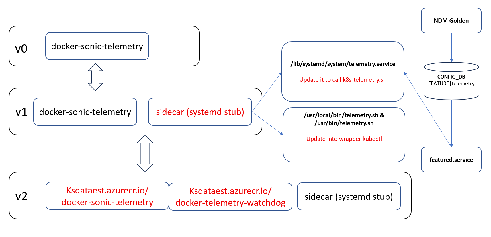
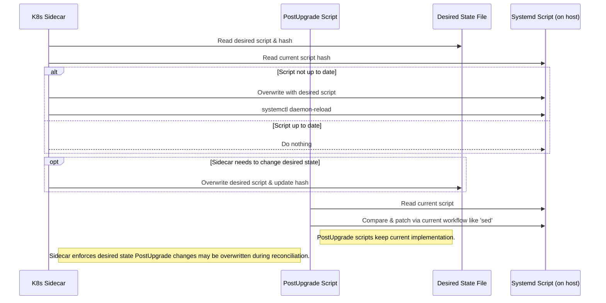
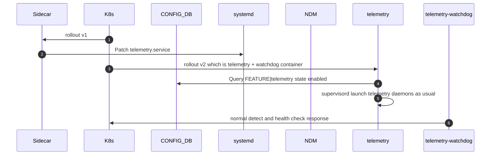
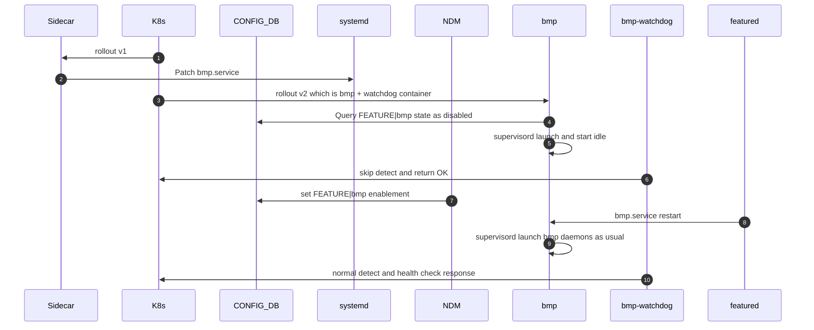
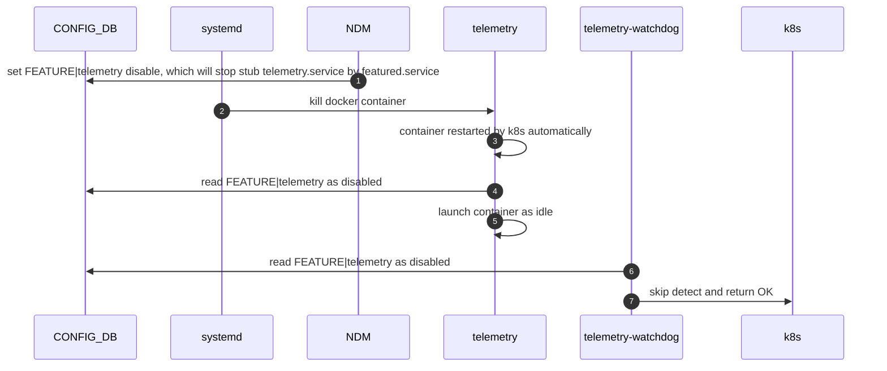
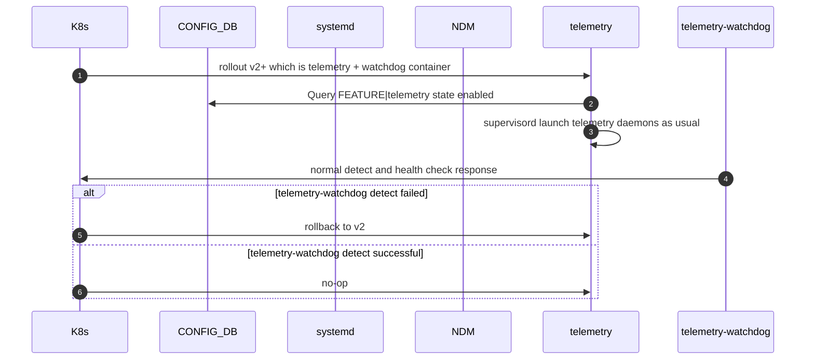
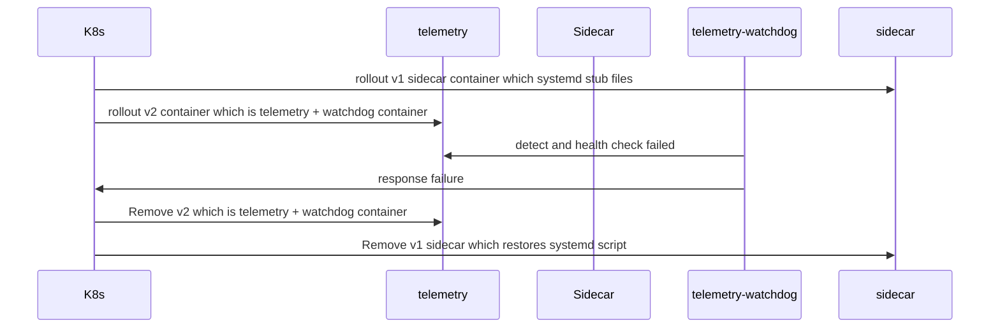

# Migrating Image-Managed Docker Containers to Kubernetes with Resource Control

## 1. Background

In current SONiC architecture, many containers are image-managed, which means it's packed into build image and managed by NDM Golden config. And commonly deployed and managed using `systemd` and monitored using tools like `monit`. But after KubeSonic comes into picture, this deployment lacks advanced orchestration and native resource management features offered by Kubernetes.

This document outlines a generic approach to migrate any Image-managed Docker container to Kubernetes, while maintaining backward compatibility with the existing `systemd` workflows, and keeping enabled/disabled controlled by NDM golden config FEATURE table, providing CPU and memory resource controls.The telemetry container (`docker-sonic-telemetry`) is used as a concrete example.

## 2. Objective

- Standardize container deployment using Kubernetes, including the image native container which is controlled via NDM golden config FEATURE table.
- Maintain `systemd` interface for backward compatibility, but behaves differently since Kubernetes start controlling container start/stop..
- postupgrade and Kubernetes rollout may change the same files, any apply order should coverge into the same desired state.
- Enforce CPU and memory resource constraints natively.

---

## 3. Container Upgrade Flow with version and changes


In below sections, the change part will be described in details.


## 4. Standardize Kubernetes-Based container Deployment

Since we need migration from a image-managed container to a Kubernetes-managed container, while avoiding dual-running instances and preserving compatibility. Meanwhile, we should not
break any existing feature like CriticalProcessHealthChecker, featured, systemHealth, etc.

### 4.1 Keep FEATURE table as the source of truth of feature enablement

This means even after we enable feature via KubeSonic, we will still keep FEATURE table and NDM Golden as its owner, KubeSonic will only deploy container and manage container start/stop which coordinate with FEATURE table.

#### FEATURE Table Snapshot
```json
"telemetry": {
  "auto_restart": "enabled",
  "state": "enabled",
  "delayed": "False",
  "check_up_status": "False",
  "has_per_asic_scope": "False",
  "has_global_scope": "True",
  "high_mem_alert": "disabled",
  "set_owner": "kube",
  "support_syslog_rate_limit": "true"
}
```

Above feature table will still controlled by NDM and monitored by featured.service. For multi-asic per asic scope container, we will need to update systemd scripts under https://github.com/sonic-net/sonic-buildimage/tree/master/files/build_templates/per_namespace


#### Feature|state Ownership and Versioning

Version description
- v0, current version iteration in SONiC
- v1, KubeSonic rollout sidecar container, this version only contains systemd script changes so that rollback could be done as desire state.
- v2+, KubeSonic rollout feature container, from v2 feature container will be iterated by its own release pace.


| Version | Container Installed By | Container service running or not                                    | systemd Handling         | Kubernetes Presence |
|---------|------------------------|---------------------------------------------------------------------|--------------------------|----------------------|
| v0      | SONiCImage             | NDM FEATURE table control it via featured service monitor           | Native systemd file used | None                 |
| v1      | KubeSonic              | Not launched as it's only a short life version to patch systemd script  | stub service file        | DaemonSet            |
| v2+     | KubeSonic              | Service launched by Kubernetes but NDM FEATURE table controls supervisorctl managed daemon running or not | stub service file        | DaemonSet            |


### 4.2 container startup script update

Since FEATURE table still control container start/stop via featured.service, after container is rollout-ed via kubernetes, it keeps reading from FEATURE table and determines whether it will launch daemon or enter idle.

docker-entrypoint.sh
```bash
#!/usr/bin/env bash

while true; do

  STATE=$(redis-cli -n 4 HGET "FEATURE|telemetry" state)
  if [ "$STATE" == "enabled" ]; then
    echo "Telemetry is enabled. Starting service..."
    break
  else
    echo "Telemetry is disabled. Entering idle..."
    sleep 1000
  fi
done
exec /usr/local/bin/supervisord
```

Dockerfile
```
COPY docker-entrypoint.sh /usr/local/bin/docker-entrypoint.sh
RUN chmod +x /usr/local/bin/docker-entrypoint.sh
ENTRYPOINT ["/usr/local/bin/docker-entrypoint.sh"]
```

### 4.3 container watchdog

Since container will be installed via kubernetes, but FEATURE table still controls its enable or disable, watchdog will need to coordinate with this meanwhile. 
watchdog needs to read FEATURE, if FEATURE is enabled, watchdog executes its normal probe and return healthcheck status; if FEATURE is disabled, watchdog will skip probe and return OK directly.

telemetry-watchdog snippet code
```rust
fn is_telemetry_enabled() -> bool {
    let output = Command::new("redis-cli")
        .args(["-n", "4", "HGET", "FEATURE|telemetry", "state"])
        .output();

    if let Ok(out) = output {
        if out.status.success() {
            let result = String::from_utf8_lossy(&out.stdout).trim().to_string();
            return result == "enabled";
        }
    }
    false
}

fn is_port_accessible() -> bool {
    match TcpStream::connect_timeout(
        &"127.0.0.1:50051".parse().unwrap(),
        Duration::from_secs(1),
    ) {
        Ok(_) => true,
        Err(_) => false,
    }
}

fn main() {
    let listener = TcpListener::bind("127.0.0.1:50069")
        .expect("Failed to bind to 127.0.0.1:50069");

    if !is_telemetry_enabled() {
        let response = "HTTP/1.1 200 OK\r\nContent-Type: application/json\r\nContent-Length: 29\r\n\r\n{\"message\":\"telemetry disabled\"}";
        stream.write_all(response.as_bytes()).ok();
    } else {
        if is_port_accessible() {
            let response = "HTTP/1.1 200 OK\r\nContent-Type: application/json\r\nContent-Length: 27\r\n\r\n{\"message\":\"port 50051 ok\"}";
            stream.write_all(response.as_bytes()).ok();
        } else {
            let response = "HTTP/1.1 503 Service Unavailable\r\nContent-Type: application/json\r\nContent-Length: 34\r\n\r\n{\"error\":\"port 50051 not reachable\"}";
            stream.write_all(response.as_bytes()).ok();
        }
    }
}
```


### 4.4 Maintaining `systemd` Compatibility

In environments where existing operational workflows depend on managing containers via systemd, we can preserve compatibility by implementing a proxy systemd unit that interacts with Kubernetes behind the scenes. This allows existing automation tools and scripts that call systemctl to continue functioning without modification, even though the container is now orchestrated by Kubernetes.

Many production systems have monitoring, automation, or recovery mechanisms that depend on:
- `systemctl start <service>`
- `systemctl stop <service>`
- `systemctl status <service>`

To prevent breaking these expectations during the migration, a `systemd` service stub can be provided.


#### v0 Behavior
- Container is fully managed by `systemd` (e.g., `telemetry.service`).
- FEATURE table controls startup (`state: Enabled/Disabled`).
- Actual container starts or stops via `systemctl` by featured.service

#### v1+ Behavior with Kubernetes DaemonSet
- The container is deployed via Kubernetes DaemonSet.
- The systemd service is retained as a **stub**, to avoid breaking automation or tools that query it.
- For start/stop/restart, it will just kill container simply so that kubernetes will relaunch it automatically. Here is some limitation: since kubernetes takes over the container thus systemd stop will not STOP container really, unless we taint the node but that requires each container should use dedicated daemon set which is not preferrable as well.
- For status, it will return runtime state via kubectl.


##### Stub Systemd Script implementation

Create a script `/usr/local/bin/k8s-telemetry.sh` that translates `systemd`-style commands to Kubernetes `kubectl` actions:


```bash
#!/usr/bin/env bash

NAMESPACE="sonic"
LABEL_SELECTOR="app=telemetry"
NODE_NAME=$(hostname)

usage() {
    echo "Usage: $0 {start|stop|restart|status}"
    exit 1
}

get_pod_name() {
    kubectl get pods -n "$NAMESPACE" \
      -l "$LABEL_SELECTOR" \
      --field-selector spec.nodeName="$NODE_NAME" \
      -o jsonpath='{.items[0].metadata.name}' 2>/dev/null
}

kill_container() {
    POD_NAME=$(get_pod_name)
    if [[ -n "$POD_NAME" ]]; then
        kubectl exec "$POD_NAME" -n "$NAMESPACE" -c telemetry -- pkill -f telemetry
    else
        exit 1
    fi
}

check_status() {
    POD_NAME=$(get_pod_name)
    if [[ -z "$POD_NAME" ]]; then
        exit 1
    fi

    STATUS=$(kubectl get pod "$POD_NAME" -n "$NAMESPACE" -o jsonpath='{.status.phase}')
    if [[ "$STATUS" != "Running" ]]; then
        exit 1
    fi
}

case "$1" in
    start|stop|restart)
        kill_container "$1"
        ;;
    status)
        check_status
        ;;
    *)
        usage
        ;;
esac

```


### 4.5 Patch systemd script via DaemonSet Sidecar

To patch systemd script aligned with actual runtime state, here we leverage a sidecar container inside the `DaemonSet` to perform periodic sync logic.

- The sidecar container:
  - Detects whether the container is running (via `kubectl`, `docker`, or other APIs).
  - Patch systemd service files.


patch_systemd
```rust
fn main() {
    let hash: &str = "d2d2d2a0cddb9be830c3767eaa78ef8b0f720b8c63aefc50f3f5f2aab2b8e2f4";
    loop {
        // 1. read script and hash calculation

        // 2. overwrite systemd script

        // 3. systemctl daemon-reload & restart service

    }
}
```


#### Example: DaemonSet YAML
This script is embedded in the sidecar container of the `telemetry` DaemonSet.

```yaml
apiVersion: apps/v1
kind: DaemonSet
metadata:
  name: telemetry
  namespace: sonic
spec:
  selector:
    matchLabels:
      app: telemetry
  template:
    metadata:
      labels:
        app: telemetry
    spec:
      containers:
      - name: telemetry
        image: ksdatatest.azurecr.io/docker-sonic-telemetry:latest
        command: ["/usr/local/bin/supervisord"]
      - name: telemetry-feature-sidecar
        image: sonicinfra/feature-sync:latest
        command: ["scripts/patch_systemd"]
        volumeMounts:
        - name: scripts
          mountPath: /scripts
      volumes:
      - name: scripts
        configMap:
          name: feature-sync-script
```


### 4.6 Desired state driven for the files patching  (like systemd patch)
Since postupgrade and Kubernetes rollout may change the same files, which may lead to uncertain result. we propose to use desired state driven for files patching, so that any apply order should coverged into the same desired state.
The desired state script will be based on top of tree from specific code branch.




## 5. Possible scenario for KubeSonic rollout

### 5.1 FEATURE state is enabled in NDM golden config, like telemetry



### 5.2 FEATURE state is disabled in NDM golden config, like bmp


### 5.3 After KubeSonic rollout, use FEATURE state to disable container, like feature switch-off in some livesite issue, etc



### 5.4 After KubeSonic rollout, rollback the container. (v2+ -> v2)



### 5.4 After KubeSonic rollout, rollback the container to imaged based version. (v2 -> v0)



---


## 6. Enforce CPU and memory resource constraints natively.

Kubernetes provides native resource management through the `resources` spec, allowing you to define minimum (`requests`) and maximum (`limits`) values for CPU and memory.

Thus after Kubernetes rollouted we will simplify the restart logic to be OOM based only, once memory allocated exceeds the hard limit, container will get killed by OOM Killer with ExitCode=137 (SIGKILL), --restart=on-failure is used for restarting container automatically.

#### Example: telemetry Container

```yaml
apiVersion: apps/v1
kind: Deployment
metadata:
  name: telemetry
  namespace: sonic
spec:
  replicas: 1
  selector:
    matchLabels:
      app: telemetry
  template:
    metadata:
      labels:
        app: telemetry
    spec:
      containers:
      - name: telemetry
        image: ksdatatest.azurecr.io/docker-sonic-telemetry:latest
        command: ["/usr/local/bin/supervisord"]
        resources:
          requests:
            memory: "400Mi"
            cpu: "100m"
          limits:
            memory: "400Mi"
            cpu: "500m"
        ports:
        - containerPort: 5000
        livenessProbe:
          exec:
            command: ["/usr/bin/pgrep", "telemetry"]
          initialDelaySeconds: 60
          periodSeconds: 30
        readinessProbe:
          exec:
            command: ["/usr/bin/pgrep", "telemetry"]
          initialDelaySeconds: 30
          periodSeconds: 15
```


### Monitoring and Alerting

#### container_checker

Refer https://github.com/sonic-net/sonic-buildimage/blob/master/files/image_config/monit/container_checker, now container_checker was used widely like CPHC, SystemHealth, as well as mgmt test.

Brief container_checker implementation
```
    expected_running_containers, always_running_containers = get_expected_running_containers()
    current_running_containers = get_current_running_containers(always_running_containers)

    expected_running_containers |= always_running_containers
    not_running_containers = expected_running_containers.difference(current_running_containers)
    if not_running_containers:
        publish_events(not_running_containers)
        print("Expected containers not running: " + ", ".join(not_running_containers))
        sys.exit(3)
```

we need to update the implementation of get_current_running_containers() since after Kubernetes rollout container name will not equal to feature name any more. like ksdatatest.azurecr.io/docker-sonic-telemetry, we need to add label into docker run procedure, so that container_checker could query running container status via name from FEATURE table.

```
docker run -d --label telemetry docker-sonic-telemetry
docker ps -a --filter "label=telemetry"
```

#### memory_checker

Currently SONiC uses monit check memory for specific container, like below

```
###############################################################################
## Monit configuration for telemetry container
###############################################################################
check program container_memory_telemetry with path "/usr/bin/memory_checker telemetry 419430400"
    if status == 3 for 10 times within 20 cycles then exec "/usr/bin/restart_service telemetry" repeat every 2 cycles

```

memory_checker implementation
```
def get_memory_usage(container_id):
    """Reads the container's memory usage from the control group subsystem's file
    '/sys/fs/cgroup/memory/docker/<container_id>/memory.usage_in_bytes'.
    Args:
        container_id: A string indicates the full ID of a container.
    Returns:
        A string indicates memory usage (Bytes) of a container.
    """
    validate_container_id(container_id)

    docker_memory_usage_file_path = CGROUP_DOCKER_MEMORY_DIR + container_id + "/memory.usage_in_bytes"

    for attempt in range(3):
        try:
            with open(docker_memory_usage_file_path, 'r') as file:
                return file.read().strip()
        except FileNotFoundError:
            if attempt < 2:
                time.sleep(0.1)  # retry after short delay
            else:
                break
        except IOError:
            syslog.syslog(syslog.LOG_ERR, ERROR_CONTAINER_MEMORY_USAGE_NOT_FOUND.format(container_id))
            sys.exit(INTERNAL_ERROR)

    syslog.syslog(syslog.LOG_ERR, ERROR_CGROUP_MEMORY_USAGE_NOT_FOUND.format(docker_memory_usage_file_path, container_id))
    sys.exit(INTERNAL_ERROR)
```


As section "Enforce CPU and memory resource constraints natively" mentioned, this monit functionality could be covered by Kubernetes, thus for monit we need to get rid of if from the KubeSonic rollouted container. However, during transition period if there's any case decalres that `monit` must be retained temporarily, we can also rewrite /usr/bin/memory_check to use Kubernetes data (e.g., via `kubectl top`) instead of reading Docker or CGroup files like above.

---


