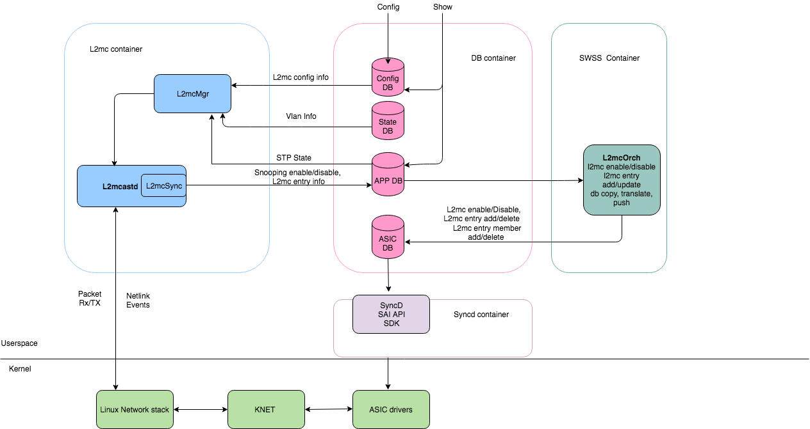
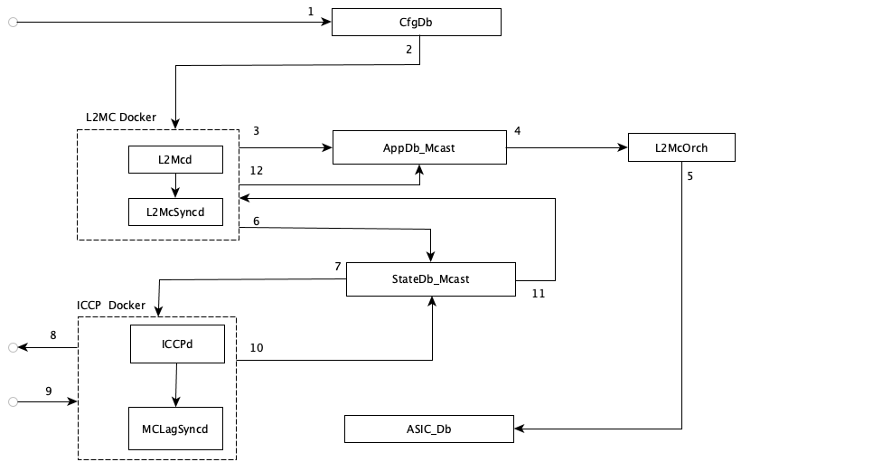
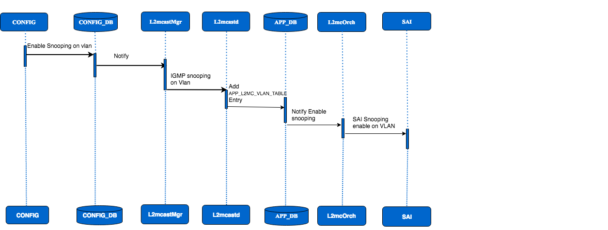
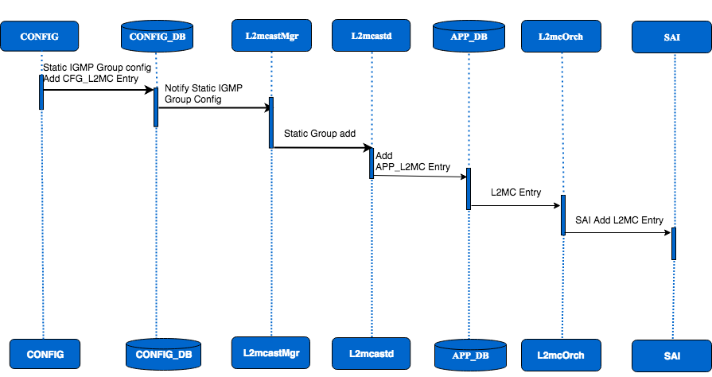
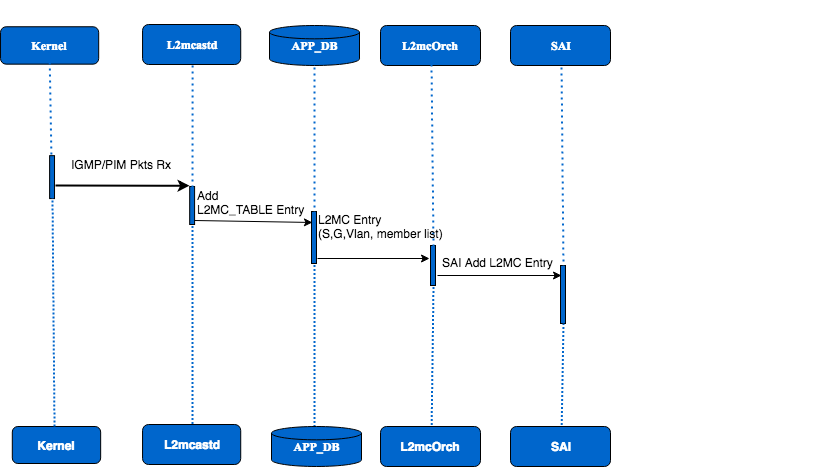
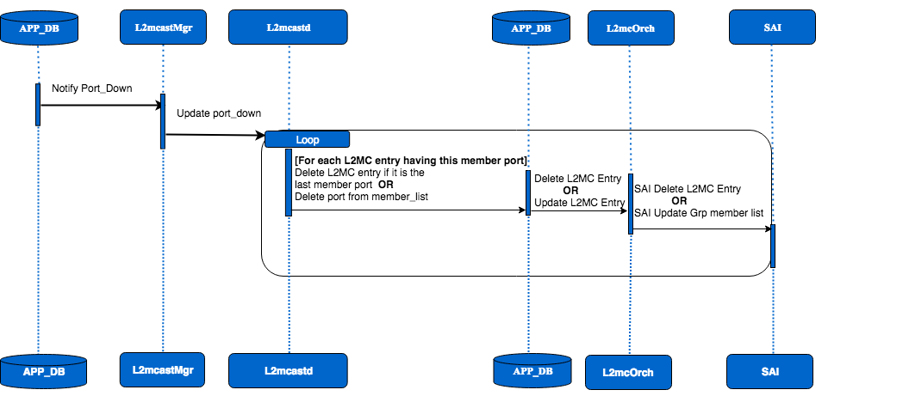
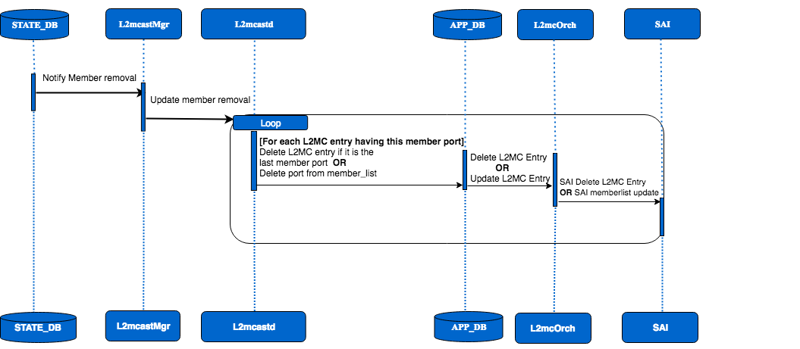
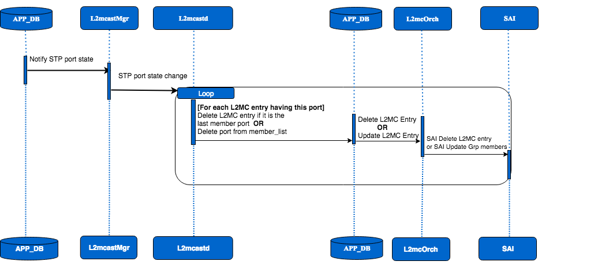

# SONiC IGMP Snooping
# High Level Design Document
#### Rev 0.4

# Table of Contents
  * [List of Tables](#list-of-tables)
  * [Revision](#revision)
  * [About This Manual](#about-this-manual)
  * [Scope](#scope)
  * [Definition/Abbreviation](#definitionabbreviation)
  * [1 Feature Overview](#feature-overview)
     * [1.1 Requirements](#requirements)
        *  [1.1.1 Functional Requirements](#functional-requirements)
        *  [1.1.2 Configuration and Management Requirements](#configuration-and-management-requirements)
        *  [1.1.3 Scalability Requirements](#scalability-requirements)
        *  [1.1.4 Warm Boot Requirements](#warm-boot-requirements)
      *  [1.2 Design Overview](#design-overview)
          * [1.2.1 Basic Approach](#basic-approach)
          * [1.2.2 L2MC Docker](#l2mc-docker)
          * [1.2.3 IGMP control packets flooding](#igmp-control-packets-flooding)
          * [1.2.4 SAI Overview](#sai-overview)
          * [1.2.5 MCLAG Support](#mclag-overview)
  * [2 Functionality](#functionality)
      * [2.1 Target Deployment Use Cases](#target-deployment-use-cases)
      * [2.2 Functional Description](#functional-description)
  * [3 Design](#design)
      * [3.1 Overview](#overview)
      * [3.2 DB Changes](#db-changes)
          * [3.2.1 CONFIG DB](#config-db)
          * [3.2.2 APP DB](#app-db)
          * [3.2.3 STATE_DB](#state-db)
      * [3.3 Switch State Service Design](#switch-state-service-design)
          * [3.3.1 L2mcOrch changes](#l2mcorch-changes)
      * [3.4 Docker for L2MC](#docker-for-l2mc)
      * [3.4 SAI](#sai)
      * [3.6 CLI](#cli)
          * [3.6.1 Data Models](#data-models)
          * [3.6.2 Configuration Commands](#configuration-commands)
          * [3.6.3 Show Commands](#show-commands)
          * [3.6.4 Rest API Support](#rest-api-support)
      * [3.7 MCLAG For IGMP Snooping](#mclag-for-igmp-snooping)
  * [4 Flow Diagrams](#flow-diagrams)
	  * [4.1 IGMP Snooping Enable on VLAN](#igmp-snooping-enable-on-vlan)
	  * [4.2 Static L2MC add flow](#static-l2mc-add-flow)
	  * [4.3 Dynamic L2mc add flow](#dynamic-l2mc-add-flow)
	  * [4.4 Port Down flow](#port-down-flow)
	  * [4.5 Vlan member-port delete flow](#vlan-member-port-delete-flow)
	  * [4.6 STP State change flow](#stp-state-change-flow)
  * [5 Error Handling](#error-handling)
  * [6 Serviceability and Debug](#serviceability-and-debug)
  * [7 Warm Boot Support](#warm-boot-support)
  * [8 Scalability](#scalability)
  * [9 Unit Test](#unit-test) 
     * [9.1 CLI Test Cases](#cli-test-cases)
     * [9.2 Rest API Test Cases](#rest-api-test-cases)
     * [9.3 Functional Test Cases](#functional-test-cases)
     * [9.4 IGMPv1 V2 and V3 cases](#igmpv1-v2-and-v3-cases)
     * [9.5 Warm Boot Test Cases](#warm-boot-test-cases)
     * [9.6 Scalability Test Cases](#scalability-test-cases)

# List of Tables
[Table 1: Abbreviations](#table-1-abbreviations)

# Revision
| Rev |     Date    |       Author                     | Change Description                |
|:---:|:-----------:|:--------------------------------:|-----------------------------------|
| 0.1 | 05/22/2019  | Ashok Krishnegowda, Benzeer Bava | Initial version                   |
| 0.2 | 06/25/2019  | Ashok Krishnegowda, Benzeer Bava | Incorporated review comments      |
| 0.3 | 20/09/2019  | Benzeer Bava, Ashok Krishnegowda | MCLAG Support                     |
| 0.4 | 01/24/2020  | Ashok Krishnegowda, Benzeer Bava | Incorporated review comments	   |


# About this Manual
This document provides general information about IGMP Snooping feature implementation in SONiC.
# Scope
This document describes the functionality and high level design of IGMP Snooping feature in SONiC. 


# Definition/Abbreviation
### Table 1: Abbreviations
| Term   | Meaning                                                |
|--------|--------------------------------------------------------|
| IGMP   | Internet Group Management Protocol            		  |
| PIM    | Protocol Independent Multicast						  |
| L2MC	 | Layer-2 Multicast									  |
|Mrouter | Multicast router										  |
|MCLAG    | Multi-Chassis Link Aggregation Group                   |

# 1 Feature Overview
The forwarding of multicast control packets and data through a Layer 2 device configured with VLANs is most easily achieved by the Layer 2 forwarding of received multicast packets on all the member ports of the VLAN interfaces. However, this simple approach is not bandwidth efficient, because only a subset of member ports may be connected to devices interested in receiving those multicast packets. In a worst-case scenario, the data would get forwarded to all port members of a VLAN with a large number of member ports, even if only a single VLAN member is interested in receiving the data. Such scenarios can lead to loss of throughput for a device that gets hit by a high rate of multicast data traffic.
Internet Group Management Protocol (IGMP) snooping is a mechanism by which a Layer 2 device can effectively address this issue of inefficient multicast forwarding to VLAN port members. Snooping involves "learning" forwarding states for multicast data traffic on VLAN port members from the IGMP control (join/leave) packets received on them.
When snooping is enabled on a VLAN, switch examines IGMP packets between hosts connected to network switches and multicast routers. Switch builds member list based on what it learns from the report and mrouter port based on IGMP queries or PIM hello packet from multicast router, the switch then forwards multicast traffic to those interfaces in the VLAN where interested receivers are present instead of flooding the traffic to all member ports of the VLAN.


## 1.1 Requirements

### 1.1.1 Functional Requirements
 1. Support IGMP Snooping for IGMP Version1 (IGMPv1), IGMPv2, IGMPv3 (INCL Mode).
 2. Support IPv4 based forwarding.
 3. Support IGMP fast leave.
 4. Support IGMP querier functionality.
 5. Support static and dynamic multicast router list. 
 6. Aging of dynamic mrouter ports will be supported. Static mrouter ports will not timed out, they have to be un-configured explicitly.
 7. Support static multicast group configuration. Static l2mc entries will not timed out, they have to be un-configured explicitly.
 8. Support trapping IGMP and PIM Hello control packets to CPU.
 9. Support Link-layer topology changes (due to STP) and generate queries on all non-mrouter ports for faster convergence. 
 10. Support IS-CLI Configuration and show commands
 11. Support IGMP Snooping for MCLAG
 

### 1.1.2 Configuration and Management Requirements

To support IS-CLI configuration and show commands.
 1. Support CLI configurations as described in "Configuration Commands" section below
 2. Support show commands as described in "Show Commands" section below
 3. Support openconfig REST API and gNMI

### 1.1.3 Scalability Requirements

SONiC IGMP Snooping feature does not have scale limit, scale number varies based on ASIC supported number, refer to scalability section below for the tested scale numbers.
 
### 1.1.4 Warm Boot Requirements

Dynamic and static L2MC entries should persist across warm reboot with no traffic disruption to the active flows.
And, remote learnt L2MC entries in MCLAG should persist across warm reboot.
Learning of new snooping entries and aging of existing L2MC entries will stop while the control plane is away.
- To support planned system warm boot.

## 1.2 Design Overview

### 1.2.1 Basic Approach
### 1.2.2  L2MC Docker
A new L2MC docker will be created to support IGMP snooping.
L2MC will host l2mcastMgr and l2mcastd,  and l2mcastSync will be part of l2mcastd, the details of the changes will be discussed in the design section below.  

### 1.2.3 IGMP control packets flooding 
IGMP control packets flooding happens in kernel, kernel  flooding behaviour is per bridge, there is no per VLAN flooding control in Kernel.  Until the dynamic multicast-router(mrouter) port learns in the VLAN, IGMP reports will be flooded to all members of the VLAN.  
In presence of multicast-router, IGMP reports received on a host interface are forwarded to multicast-router interfaces alone, but not to the other host interfaces in the VLAN.

### 1.2.4 SAI Overview
The existing L2MC SAI interface APIs shall be used to support this feature and they are available at below location,  
[https://github.com/opencomputeproject/SAI/blob/master/inc/sail2mc.h](https://github.com/opencomputeproject/SAI/blob/master/inc/sail2mc.h)  
https://github.com/opencomputeproject/SAI/blob/master/inc/sail2mcgroup.h

The detail of the changes will be discussed in the design section below.

### 1.2.5 MCLAG Overview
In an MCLAG Enabled node, IGMP Source can be at MCLAG member port or Orphan Port. Details of IGMP changes will be discussed at design section below.

# 2 Functionality
Refer to section 1
## 2.1 Target Deployment Use Cases

## 2.2 Functional Description
Refer to section 1.1

# 3 Design
## 3.1 Overview




__Figure 1: IGMP Snooping High Level Architecture__

L2MC docker will host L2mcastMgr and L2mcastd process.

L2mcastMgr process will handle following interactions,

-   L2mcastMgr subscribes to CONFIG_DB to get configuration changes, it gets VLAN info from STATE_DB, and STP state changes from APP_DB.
-   L2mcastMgr notifies all these DB updates to L2mcastd for protocol operation via unix domain socket.

L2mcastd process will handle following interactions,

-   Linux kernel to processes dynamic IGMP and PIM hello packets and netlink events.
-   L2mcastd uses libevent for processing below incoming events from l2mcastMgr,  
    - CLI configurations  
    - STP state change  
    - VLAN configuration changes
-   Timer events are generated every 100ms for handling IGMP protocol timers.
-   L2mcastSync is part of L2mcastd which handles L2MC entries update to APP_DB to be consumed by L2mcOrch.


## 3.2 DB Changes
This section describes the changes made to different DBs for supporting IGMP Snooping.

### 3.2.1 CONFIG DB
#### CFG_L2MC_TABLE
	
    ;Store IGMP Snooping configuration per VLAN
    ;Status: work in progress
    key                         = CFG_L2MC_TABLE|"Vlan"vlanid
    ;field                      = value
    enabled                     = "true"/"false"                       ; Is the IGMP Snooping on VLAN enabled or disabled 
    querier                     = "true"/"false"                       ; Is the IGMP Snooping querier enabled  or disabled 
    fast-leave                  = "true"/"false"                       ; Is IGMP fast leave enabled or disabled 
    version                     = 1*DIGIT                   ; IGMP Snooping Version ( Version 1 or 2 or 3, Default: 2)
    query-interval              = 5*DIGIT                   ; Query Interval Value (1 to 18000sec, Default:125sec)
    last-member-query-interval  = 5*DIGIT                   ; Last Member Query Interval Value (100 to 25500ms; Default: 1000ms)
    query-max-response-time     = 2*DIGIT                   ; Query Response Time (1 to 25sec, Default: 10sec)
     
#### CFG_L2MC_MROUTER_TABLE
    ;Store Mrouter configuration
    ;Status: work in progress
    key                         = CFG_L2MC_MROUTER_TABLE|"Vlan"vlanid|mrouter_port_name       
    ;field                      = value               

####  CFG_L2MC_STATIC_MEMBER_TABLE
    ;Store Static L2MC entry configuration per VLAN. 
    ;Status: work in progress 
    key                 =  CFG_L2MC_STATIC_MEMBER_TABLE|"vlan"vlanid|group_address|static_port_name
    ;field              = value

### 3.2.2 APP DB

#### APP_L2MC_VLAN_TABLE
	;Store Snooping state on VLAN
    ;Status: work in progress
    key         = APP_L2MC_VLAN_TABLE:"Vlan"vlanid
    ;field      = value

#### APP_L2MC_MEMBER_TABLE
    ;Store L2MC member table entry.
    ;Status: work in progress
    key            = APP_L2MC_MEMBER_TABLE:"Vlan"vlanid:source_address:group_address:port_name
    ;field         = value
    type           = "static"/"dynamic"/"remote"           ; Static or Dynamic multicast group entry or remote entry learnt from MCLAG peer
### APP_L2MC_MROUTER_TABLE
    ;Store L2MC mrouter table entry.
    ;Status: work in progress
    key            = APP_L2MC_MROUTER_TABLE:"Vlan"vlanid:port_name
    ;field         = value
    type           = "static"/"dynamic"           ; Static or Dynamic multicast group entry

### 3.2.3 STATE DB
#### L2MC_STATE_MEMBER_TABLE
    ;Store L2MC member state table entry for ICCPd communications.
    ;Status: work in progress
    key            = L2MC_STATE_MEMBER_TABLE|"Vlan"vlanid|source_address|group_address|port_name
    ;field         = value
    type           = "static"/"dynamic"           ; Static or Dynamic multicast group entry
    
   #### L2MC_STATE_MROUTER_TABLE
    ;Store L2MC mrouter state table entry for ICCPd communications.
    ;Status: work in progress
    key            = L2MC_STATE_MROUTER_TABLE|"Vlan"vlanid|port_name
    ;field         = value
    type           = "static"/"dynamic"           ; Static or Dynamic mrouter entry
    
### 3.2.4 ASIC DB
### 3.2.5 COUNTER DB

    No changes

## 3.3 Switch State Service Design
### 3.3.1 L2mcOrch changes 
L2mcOrch is responsible for the following activities:
   - Handles snooping enable/disable on VLAN being subscriber to APP_DB. 
   - For l2mc member table changes, handles creation/deletion of l2mc entry being subscriber to APP_DB.
   - Translates these updates to SAI objects and pushes them to ASIC_DB. 
   - Creates l2mc db entry with OID mapping to handle subsequent l2mc entry member addition or deletion.

## 3.4 Docker for L2MC
A separate docker named 'l2mc' is created, It can be stopped/started/restarted independently. By default L2MC docker service will be disabled. When l2mcast docker is stopped, all the static and dynamic learnt l2mc entries are removed from the APP_DB and ultimately from the hardware.

```
root@sonic:/home/admin# docker ps
CONTAINER ID        IMAGE                             COMMAND                  CREATED              STATUS              PORTS               NAMES
9ff843cc79fa        docker-syncd-brcm:latest          "/usr/bin/supervisord"   About a minute ago   Up About a minute                       syncd
042faedb7b4b        docker-dhcp-relay:latest          "/usr/bin/docker_iniâ¦"  About a minute ago   Up About a minute                       dhcp_relay
210f0ad0b776        docker-router-advertiser:latest   "/usr/bin/supervisord"   About a minute ago   Up About a minute                       radv
b45498e6e705        docker-orchagent-brcm:latest      "/usr/bin/supervisord"   About a minute ago   Up About a minute                       swss
a77dbe67649a        docker-l2mc:latest                "/usr/bin/supervisord"   2 minutes ago        Up About a minute                       l2mc
0d3b86e300f9        docker-lldp-sv2:latest            "/usr/bin/supervisord"   2 minutes ago        Up About a minute                       lldp
f65865e90fd1        docker-platform-monitor:latest    "/usr/bin/supervisord"   2 minutes ago        Up About a minute                       pmon
4374ebb6e0e1        docker-teamd:latest               "/usr/bin/supervisord"   2 minutes ago        Up About a minute                       teamd
6244613730fb        docker-fpm-frr:latest             "/bin/sh -c '/usr/biâ¦"  2 minutes ago        Up About a minute                       bgp
9ba9d3e63426        docker-database:latest            "/usr/bin/supervisord"   2 minutes ago        Up 2 minutes                            database
```

## 3.5 SAI
L2MC SAI interface APIs are already defined, table shown below represents the SAI attributes which shall be used for IGMP Snooping.

###### Table 2: L2MC  SAI attributes
| L2MC component		   | SAI attributes                                         |						   
|--------------------------|-------------------------------------------------------|
| VLAN					   | SAI_VLAN_ATTR_CUSTOM_IGMP_SNOOPING_ENABLE <br>
| L2MC ENTRY               | SAI_L2MC_ENTRY_ATTR_OUTPUT_GROUP_ID <br>              
| L2MC Group               | SAI_L2MC_GROUP_ATTR_L2MC_OUTPUT_COUNT <br> SAI_L2MC_GROUP_ATTR_L2MC_MEMBER_LIST <br>
| L2MC Group Member        | SAI_L2MC_GROUP_MEMBER_ATTR_L2MC_GROUP_ID <br> SAI_L2MC_GROUP_MEMBER_ATTR_L2MC_OUTPUT_ID <br>
| L2MC Traps			   | SAI_HOSTIF_TRAP_TYPE_IGMP_TYPE_QUERY <br>SAI_HOSTIF_TRAP_TYPE_IGMP_TYPE_LEAVE<br> SAI_HOSTIF_TRAP_TYPE_IGMP_TYPE_V1_REPORT <br> SAI_HOSTIF_TRAP_TYPE_IGMP_TYPE_V2_REPORT <br> SAI_HOSTIF_TRAP_TYPE_IGMP_TYPE_V3_REPORT <br> SAI_HOSTIF_TRAP_TYPE_PIM <br>


IGMP Snooping feature can be enabled/disabled at VLAN level. By default the IGMP Snooping feature is disabled in SONiC. SAI_VLAN_ATTR_CUSTOM_IGMP_SNOOPING_ENABLE attribute can be set in the VLAN attributes using  **set_vlan_attribute**  

The L2MC traps are enabled on the host interfaces to trap IGMP and PIM control packets to the CPU.

To support programming of l2mc entry with list of member ports, current SAI object model of l2mc allows programming multiple member ports for a given L2MC entry, this is achieved using L2mc group object (SAI_L2MC_ENTRY_ATTR_OUTPUT_GROUP_ID) on the L2MC entry.
L2mc group then has list of L2mc group members each of which points to a member port.

### 3.5.1 COPP_TABLE TRAPS

We have below set of IGMP and PIM traps already defined, 

    {"igmp_query", SAI_HOSTIF_TRAP_TYPE_IGMP_TYPE_QUERY},
    {"igmp_leave", SAI_HOSTIF_TRAP_TYPE_IGMP_TYPE_LEAVE},
    {"igmp_v1_report", SAI_HOSTIF_TRAP_TYPE_IGMP_TYPE_V1_REPORT},
    {"igmp_v2_report", SAI_HOSTIF_TRAP_TYPE_IGMP_TYPE_V2_REPORT},
    {"igmp_v3_report", SAI_HOSTIF_TRAP_TYPE_IGMP_TYPE_V3_REPORT},
    {"pim", SAI_HOSTIF_TRAP_TYPE_PIM},


IGMP and PIM protocol trap support will be added to enable trapping of IGMP query/leave/ v1,v2,v3 reports and PIM control packets.

	"COPP_TABLE:trap.group.igmp”: {
	            "trap_ids": “igmp_query, igmp_leave, igmp_v1_report, igmp_v2_report, igmp_v3_report”,
	            "trap_action":"trap",
	            "trap_priority":"4",
	            "queue": "4",
	            "meter_type":"packets",
	            "mode":"sr_tcm",
	            "cir":"6000",
	            "cbs":"6000",
	            "red_action":"drop"
	        }

	"COPP_TABLE:trap.group.pim”: {
		            "trap_ids": “pim”,
		            "trap_action":"trap",
		            "trap_priority":"4",
		            "queue": "4",
		            "meter_type":"packets",
		            "mode":"sr_tcm",
		            "cir":"10000",
		            "cbs":"10000",
		            "red_action":"drop"
		        }

## 3.6 CLI
### 3.6.1 Data Models
Openconfig Yang model will be introduced for this feature.

https://github.com/openconfig/public/blob/master/release/models/multicast/openconfig-igmp.yang

### 3.6.2 Configuration Commands

#### 3.6.2.1 Enable/Disable IGMP Snooping on VLAN

**switch# config terminal**

Enter into Vlan interface configuration mode to enable/disable igmp snooping.   
**switch(config)# interface Vlan <vlan-id\>**        

This command allows to configure IGMP Snooping on VLAN.       
**switch(config-if-vlan10)# ip igmp snooping**  

This command disables IGMP snooping on a VLAN.      
**switch(config-if-vlan10)# no ip igmp snooping**

#### 3.6.2.2 Enable/Disable IGMP Snooping Querier on VLAN
The IGMP snooping querier sends out IGMP queries to trigger IGMP responses from devices receiving IP multicast traffic. The IGMP snooping querier listens for these responses to map the appropriate forwarding addresses. 

Below configuration allows to configure IGMP Snooping querier on VLAN.   

**switch(config-if-vlan10)#ip igmp snooping querier**   

Below configuration allows to disable IGMP Snooping querier on VLAN.    

**switch(config-if-vlan10)#no ip igmp snooping querier**

By Default, querier is disabled.

#### 3.6.2.3 Enable/Disable fast-leave 

Below configuration allows to enable fast-leave on a VLAN which is enabled for IGMP snooping.  
**switch(config-if-vlan10)# ip igmp snooping fast-leave**

This command disables fast-leave on a VLAN which is  enabled for IGMP snooping.  
**switch(config-if-vlan10)# no ip igmp snooping fast-leave**    

By default fast leave is disabled.

#### 3.6.2.4 Configure query-interval 
This command allows modification of the query interval to specify how often the querier sends general queries. The valid range is from 1 through 18000 seconds. 

Below configuration allows to set query-interval for a vlan.  
**switch(config-if-vlan10)# ip igmp snooping query-interval <query-interval\>**

Below configuration command is used to reset query interval to default value,  
**switch(config-if-vlan10)# no ip igmp snooping query-interval**

The default interval is 125 seconds, which is set when igmp snooping is enabled for vlan.

#### 3.6.2.5 Configure last member query interval
When the querier receives an IGMP leave message, it verifies the multicast group has no remaining listeners by sending a set of group-specific queries at a configured interval. If the querier does not receive a response to the queries, it removes the group state and stops forwarding multicast traffic. 
This command configures the transmission interval for sending group-specific or group-source-specific query messages to the active interface. 
The valid range is from 100ms to 25500ms. 

Below configuration allows to set last-member-query-interval for a vlan.  
**switch(config-if-vlan10)# ip igmp snooping last-member-query-interval <last-member-query-interval\>** 

Below configuration is used to  reset the last memeber query interval to default value.  
**switch(config-if-vlan10)# no ip igmp snooping last-member-query-interval**

The default value is  1000ms.

#### 3.6.2.5 Configure max response interval
The Max Response interval field in a membership query messages specifies the longest time a host can wait before responding with a membership report message.
Use the following commands to set the maximum response time and Value range from 1 to 25 seconds. 

Below configuration allows to set query-max-response-time for a vlan.   
**switch(config-if-vlan10)# ip igmp snooping query-max-response-time <query-max-response-time\>**  

Below configuration is used to  reset  the maximum respose time to default value.      
**switch(config-if-vlan10)# no ip igmp snooping query-max-response-time**

The default value is 10 seconds.

#### 3.6.2.6 Configure IGMP version

This command allows to configure  IGMP versions 1 through 3. A VLAN that is configured with IGMP snooping uses default version 2 (unless otherwise configured). 

**switch(config-if-vlan10)# ip igmp snooping version <version\>**

Valid values are 1,2 and 3. The default value is 2.

#### 3.6.2.7 Configure static multicast router(mrouter) port

This command allows to configure an mrouter interface from a vlan. The interface can be an Ethernet or Port channel.   
**switch(config-if-vlan10)# ip igmp snooping mrouter interface <interface-name\>**     

This command is used  to remove an mrouter interface from a vlan . The interface can be an Ethernet or Port channel.   
**switch(config-if-vlan10)# no ip igmp snooping mrouter interface <interface-name\>**

    Example:
    switch(config-if-vlan10)# ip igmp snooping mrouter interface Ethernet4
    switch(config-if-vlan10)# ip igmp snooping mrouter interface PortChannel1
    switch(config-if-vlan10)# no ip igmp snooping mrouter interface PortChannel1

Dynamic mrouter ports expires in 300 sec when there are no IGMP query/PIM hello in this period. Static mrouter ports will not be timed out, they have to be un-configured explicitly.

#### 3.6.2.8 Configure static multicast group
A snooping-enabled VLAN cannot forward multicast traffic to ports that do not receive IGMP membership reports. If clients cannot send reports, user can configure a static group which applies to specific ports. The static group allows packets to be forwarded to the static group ports even though they have no client membership reports.

This command configures a static multicast group on a VLAN with the receiver port. The group adress should be a vlaid multicast address and interface should be member of the VLAN. The Interface can be a Ethernet or Portchannel interface.

**switch(config-if-vlan10)# ip igmp snooping static-group < group-address> interface <interface-name\>**

This command configures a static multicast group entry from a VLAN  
**switch(config-if-vlan10)# no ip igmp snooping static-group < group-address> interface <interface-name\>**

        Example:
        switch(config-if-vlan10)# ip igmp snooping static-group 225.0.0.1 interface Ethernet4
        switch(config-if-vlan10)# ip igmp snooping static-group 227.2.0.1 interface PortChannel3
        switch(config-if-vlan10)# no ip igmp snooping static-group 226.0.0.1 interface Ethernet4


### 3.6.3 Show Commands
**switch# show ip igmp snooping [[ vlan ] vlan-id ]**

These commands displays IGMP snooping configuration across all the VLANs or the specific VLAN. Configuration details are read from CONFIG_DB entries programmed per VLAN.

If vlan id is not specified, all the vlans configured with vlan are displayed.

    switch#show ip igmp snooping    
	Vlan ID: 10
	Multicast Router ports: Ethernet8, Ethernet1, PortChannel10 
	Querier - Disabled 
	IGMP Operation mode: IGMPv2
	Is Fast-Leave Enabled : Disabled
	Max Response time = 10
	Last Member Query Interval = 1000
	Query interval = 125
	

**switch# show ip igmp snooping groups [[vlan] vlan-id]**

These commands will be used to display L2MC entries from APP_DB for the specific or all vlans.

Example

     switch# show ip igmp snooping groups
	 Vlan ID : 10      
	 -------------
	1   (*, 225.0.0.1 ) 
        Outgoing Ports: Ethernet4,PortChannel3
    2   (100.10.2.3, 226.0.0.1 ) 
        Outgoing Ports: Ethernet8,Portchannel2
	Total number of entries: 2      

	 Vlan ID : 20      
	 -------------
	1   (*, 226.0.0.1 )
        Outgoing Ports: Ethernet20,Ethernet16
    2   (120.30.4.3, 226.0.0.1 )
        Outgoing Ports: Ethernet4,Portchannel4
	Total number of entries: 2  

    switch# show ip igmp snooping groups vlan 10
	 Vlan ID : 10      
	 -------------
	1   (*, 225.0.0.1 ) 
        Outgoing Ports: Ethernet4,PortChannel3
    2   (100.10.2.3, 226.0.0.1 ) 
        Outgoing Ports: Ethernet8,Portchannel2
	Total number of entries: 2  


### 3.6.4 REST API Support
 
## 3.7 MCLAG For IGMP Snooping
### 3.7.1 Overview 
MCLAG peers communicates and synchronizes states using  Inter-Chassis Communication Protocol defined by RFC727 .

Below is the IGMP Snooping Specific settings to interwork with the MCLAG Container implementation of ICCP as described in the Sonic MC-LAG HLD Document.

ICCPd protocol is used to synchonize information between the MCLAG Peers. The format of information  is defined in ICC Parameter TLV defnitions section of RFC 7275. Snce no ICCPd TLV is defined for synchronizing IGMP information between  MCLAG peers,aAn extension tye TLV needs to be assigned for IGMP synchronization.

Below picture depicts the overview of component interactions in the functioning of IGMP MCLAG. L2Mcd sends/process the  MCLAG state information to/from remote peer and update the forwarding states of IGMP snooping instance accordingly. Please refer MCLAG HLD for details of the state handling requirements at aplication modules.




### 3.7.2 IGMP Control Packet Processing

| Type   |  Port    | Description                                          |
|--------|---------|------------------------------------------------------|
|Report received   | MCLAG Port| ICCP Sync of Report to Remote Peer.  MC interface is local LAG port at both peers  |
|Report received   | Orphan Port| ICCP Sync of Report to Remote Peer.  MC Interface is Orphan Port and ICCP Port respectively at the node and remote peer.|
|Leave received   | Any| ICCP Sync to Remote Peer and clear  MC interface at both peers  |
|Query received   | Any| ICCP Sync to Remote Peer |


### 3.7.3 State Handling
| Type   |  Description                                          |
|--------|------------------------------------------------------|
|Local MCLAG port Down|  MC Interface is changed from MCLAG port to ICCP link for all groups|
|Local MCLAG port up|  MC Interface is changed from ICCP link to MCLAG link for all groups|
|Peer Link Down | The split brain scenario triggers ICCP links to be cleared from Groups |

 
# 4 Flow Diagrams
## 4.1 IGMP Snooping Enable on VLAN



__Figure 2: Enable IGMP Snooping on VLAN__


## 4.2 Static L2MC add flow



__Figure 3: Static L2MC  add__


## 4.3 Dynamic L2MC add flow



__Figure 4: Dynamic L2MC  add__


## 4.4 Port Down flow



__Figure 5: Port down flow__


## 4.5 VLAN member-port delete flow



__Figure 6: VLAN member-port delete flow__


## 4.6 STP state change flow



__Figure 7: STP state change flow__


# 5 Error Handling
# 6 Serviceability and Debug
Debug logs will be captured as part of tech support.
- A CLI configuration error will be displayed via console and configuration will be rejected
- Internal processing error within SwSS will be logged in syslog with ERROR level
- SAI interaction errors will be logged in syslog

# 7 Warm Boot Support
The traffic corresponding to the active L2MC flows should not be disturbed during the warm reboot process. 
 
- L2MCd is responsible for restoring static, dynamic and remote learnt flows from APP_DB and handles l2mc entry change from port state  and vlan member port state change events, and pushes updated entry to APP_DB.
 - Learning new entries and aging of existing l2mc entries will stop when control plane is away.
 - If switch is an active querier, l2mcastd sends out query immediatly to check available active memebers.
 - l2mcOrch is responsible for restoring static , dynamic and remote learnt L2MC entries  from APP_DB and cache those entries with OID.


# 8 Scalability

Below L2MC entries scale will be tested to success on an ASIC with 512 L2MC group support,
###### Table 3: Scaling limits
|Name                      | Scaling value    |
|--------------------------|------------------|
| Number of VLANS 	       |      512         |
| Number of L2MC entries   |      512         |

 
# 9 Unit Test
## 9.1 CLI Test Cases

    1. Verify CLI to enable IGMP Snooping on vlan.
    2. Verify CLI to enable IGMP Snooping Querier.
    3. Verify CLI to enable fast-leave.
    4. Verify CLI to configure Query-interval.
    5. Verify CLI to configure last-member-query interval.
    6. Verify CLI to configure max-response interval.
    7. Verify CLI to configure IGMP version 1.
    8. Verify CLI to configure IGMP version 2.
    9. Verify CLI to configure IGMP version 3.
    10. Verify CLI to add static mrouter port.
    11. Verify CLI to add static multicast group.
    12. Verify CLI to disable IGMP Snooping on vlan.
    13. Verify CLI to disable IGMP Snooping Querier.
    14. Verify CLI to disable fast-leave.
    15. Verify CLI to un-configure Query-interval.
    16. Verify CLI to un-configure last-member-query interval.
    17. Verify CLI to un-configure max-response interval.
    18. Verify CLI to un-configure IGMP version 1.
    19. Verify CLI to un-configure IGMP version 2.
    20. Verify CLI to un-configure IGMP version 3.
    21. Verify CLI to delete static mrouter port.
    22. Verify CLI to delete static multicast group.
    23. Verify CLI to display IGMP Snooping configured on vlan.
    24. Verify CLI to display multicast groups learnt on vlan.
    25. Verify configuration save and verify after reload.
    26. Verify unsaved configuration loss after reload.

## 9.2 Rest API Test Cases
    Verify all REST commands

## 9.3 Functional Test Cases

    1. Verify IGMP Snooping enable/disable configuration on vlan.
    2. Verify IGMP reports/leaves received and processed. 
    3. Verify General Query messages and Group Specific queries. 
    4. Verify PIM hello packets are received and processed.
    5. Verify IGMP/PIM protocol pkts trap happening fine when switch comes up after the reboot
    6. Verify IGMP stats updated for IGMP reports, leaves, and membership queries.
    7. Verify static IGMP group addition/deletion through configuration. 
    8. Verify multicast data forwarding happening using static l2mc entry programmed in hardware.
    9. Verify l2mc entry creation when dynamic IGMP report is received. 
    10. Verify multicast data forwarding happening for the dynamic learnt l2mc entry programmed in hardware.
    11. Verify existing l2mc entry updated with new portlist based on the IGMP report from second port.
    12. Verify multicast data forwaring is happening for the new member port added.
    13. Verify member port removed from l2mc entry based on IGMP leave.
    14. Verify multicast data forwarding not happening on the port where leave has processed.
    15. Verify dynamic mrouter port added to the l2mc entry member portlist.
    16. Verify multicast data forwarding happens to the newly added dynamic mrouter port also.
    17. Add static mrouter port and verify multicast data forwarding happens to the newly added static mrouter port also.
    18. Verify l2mc entry member port list updated when one of the member port goes down.
    19. Verify l2mc entry deletion when last member port goes down.
    20. Verify multicast data forwarding happens to the newly updated member ports when vlan member port removal happens.
    21. Verify mrouter port timeout.
    22. Verify dynamic learnt member port timeout.
    23. Verify fast-leave.
    24. Verify Queries by modifying Query interval.
    25. Verify Last member query interval.
    26. Verify max response interval.
    27. Verify debug messages are logged in /var/log/syslog
    28. Verify l2mc entry synced b/w Mclag peers with igmp join
    29. Verify l2mc entry synced b/w Mclag peers with igmp leave
    30. Verify mrouter sync b/w Mclag peers 
    31. Verify updation of l2mc entries when Peer link goes down in Mclag 
    32. Verify updating of l2mc entries when Mclag interface goes down.

## 9.4 IGMPv1,V2 and V3 cases.
    
    Verify functional test cases for IGMPv1,V2 and V3.

## 9.5 Warm boot Test Cases
    
    Verify system warm boot. Verify active l2mc traffic flows are not affected during warm boot.

## 9.6 Scaling Test Cases
 
    1. Verify with Snooping configured on the maximum number of VLANs as specified in section 8.
    2. Verify maximum number of L2MC entries as specified in section 8.
